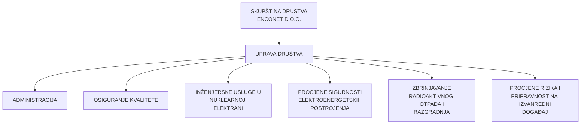
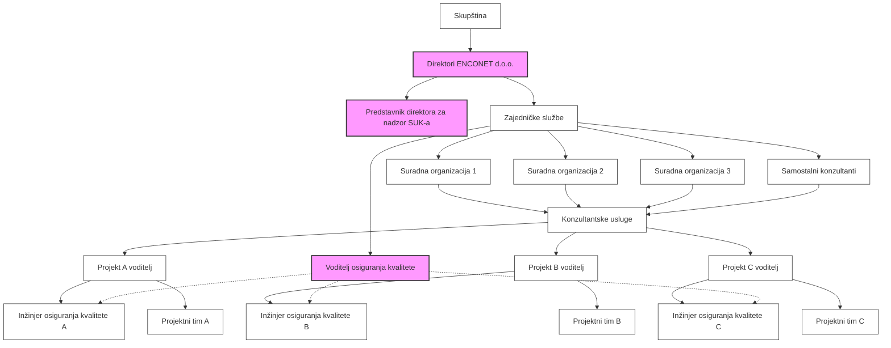

# NUKLEARNI QA PLAN

| Identifikacijska oznaka dokumenta: | NP-SUK-001 |
|-----------------------------------|------------|
| Revizija broj:                    | 8          |
| Datum objavljivanja:              | 14.04.2023.|
| Kontrolirana kopija broj:         | ../...     |

| Pripremio: | Vladimir Križe, voditelj QA | 03.04.2023. |
|------------|----------------------------|-------------|
| Pregledao: | mr.sc. Ilijana Iveković, predstavnica direktora | 05.04.2023. |
| Odobrio:   | Josip Vuković, direktor | 07.04.2023. |

## Periodični pregled

| Pregledao: | Datum: | Slijedeći pregled: |
|------------|--------|---------------------|
|            |        |                     |
|            |        |                     |
|            |        |                     |

# 0    SADRŽAJ I PREGLED REVIZIJA

Oznaka dok: NP0

| NP OZNAKA SEKCIJE | NP NAZIV SEKCIJE | Datum izdavanja/Revizija |Datum izdavanja/Revizija|Datum izdavanja/Revizija|Datum izdavanja/Revizija|
|-------------------|-------------------|---------|-------|-------|-------|
|                   |                   | 19.11.2003. | 26.07.2005. | 17.02.2009. | 04.02.2010. | 04.04.2012. |
| NP | NUKLEARNI QA PLAN (cijeli dokument) | 0 | 1 | 2 | 3 | 4 |
| NP0 | SADRŽAJ I PREGLED REVIZIJA | 0 | 1 | 2 | 3 | 4 |
| NP1 | UVOD | 0 | 1 | 2 | 3 | 4 |
| NP1.1 | Općenito |||||
| NP1.2 | Područje primjene |||||
| NP1.3 | Odgovornost |||||
| NP2 | PROGRAM OSIGURAVANJA KVALITETE | 0 | 1 | 2 | 3 | 4 |
| NP2.1 | Općenito |||||
| NP2.2 | Postupci, upute i nacrti |||||
| NP2.3 | Ocjena uprave |||||
| NP3 | ORGANIZACIJA | 0 | 1 | 2 | 3 | 4 |
| NP3.1 | Odgovornosti, ovlaštenja i komunikacije |||||
| NP3.2 | Osoblje i izobrazba |||||
| NP4 | UPRAVLJANJE DOKUMENTIMA | 0 | 1 | 2 | 3 | 4 |
| NP4.1 | Priprema, pregled i odobravanje dokumenata |||||
| NP4.2 | Objelodanjivanje i dostava dokumenata |||||
| NP4.3 | Kontrola promjene dokumenata |||||
| NP5 | UPRAVLJANJE PROJEKTOM | 0 | 1 | 2 | 3 | 4 |
| NP5.1 | Općenito |||||
| NP5.2 | Kontrola projektnih međuveza |||||
| NP5.3 | Verifikacija projekta |||||
| NP5.4 | Promjene u projektu |||||
| NP6 | KONTROLA NABAVE | 0 | 1 | 2 | 3 | 4 |
| NP6.1 | Općenito |||||
| NP6.2 | Vrednovanje i izbor isporučitelja |||||
| NP6.3 | Kontrola naručenih proizvoda i usluga |||||
| NP7 | KONTROLA MATERIJALA, DIJELOVA I KOMPONENTI | 0 | 1 | 2 | 3 | 4 |
| NP7.1 | Identifikacija i kontrola materijala, dijel. i komp. |||||
| NP7.2 | Rukovanje, skladištenje i otprema |||||
| NP7.3 | Održavanje |||||
| NP8 | UPRAVLJANJE PROCESOM | 0 | 1 | 2 | 3 | 4 |
| NP8.1 | Upravljanje procesom |||||
| NP8.2 | Specijalni procesi |||||
| NP9 | INSPEKCIJA I TESTIRANJE | 0 | 1 | 2 | 3 | 4 |
| NP9.1 | Program inspekcije |||||
| NP9.2 | Program testiranja |||||
| NP9.3 | Kalibracija i kontrola opreme za mjer. i test. |||||
| NP9.4 | Identifikacija stanja inspekcije, testa i rada |||||
| NP10 | KONTROLA NESUKLADNOSTI | 0 | 1 | 2 | 3 | 4 |
| NP10.1 | Općenito |||||
| NP10.2 | Ocjena i rješavanje nesukladnosti |||||
| NP11 | POPRAVNE RADNJE | 0 | 1 | 2 | 3 | 4 |
| NP11.1 | Popravne radnje | | | | | |
| NP12 | QA ZAPISI | 0 | 1 | 2 | 3 | 4 |
| NP12.1 | Priprema QA zapisa | | | | | |
| NP12.2 | Prikupljanje, arhiviranje i čuvanje QA zapisa | | | | | |
| NP13 | NEZAVISNO OCJENJIVANJE KVALITETE | 0 | 1 | 2 | 3 | 4 |
| NP13.1 | Općenito | | | | | |
| NP14 | PRILOZI | | | | | |
| NP14.1 | Usporedba normi | 0 | 1 | 2 | 3 | 4 |
| NP14.2 | Organizacijska shema | | | | | |
| NP14.3 | Funkcionalna shema | | | | | |

20.01.2015. izdana je revizija 5 Nuclear QA Plan-a
17.11.2017. izdana je revizija 6 Nuclear QA Plan-a
01.07.2020. izdana je revizija 7 Nuclear QA Plan-a
14.04.2023. izdana je revizija 8 Nuclear QA Plan-a

---

# 1 UVOD

## 1.1 Općenito

Ovaj Nuklearni QA Plan (NQAP) sadrži temeljne postavke, utvrđuje politiku kvalitete, određuje odgovornosti i opisuje postupak upravljanja koji utječe na kvalitetu rada u organizaciji Enconet d.o.o. (Enconet).

QA Program opisan u ovom NQAP sukladan je zahtjevima propisa IAEA General Safety Requirements, No. GSR Part 2, Vienna 2016, Leadership and Management for Safety, zahtjevima Saveznog državnog zakona SAD 10CFR50, App. B, QA Criteria for Nuclear Power Plants and Fuel Reprocessing Plants, ASME NQA-1-1994 (95 addenda) and 2008 editions, QA Requirements for Nuclear Facility Aplications, 10CFR Part 21, Reporting of Defects and Noncompliance, kao i odgovarajućih propisanih preporuka, zakona i standarda ukoliko se primjenjuju za poslove kod ili za korisnika usluga Enconeta.

Dodatno se pregledavaju svi novi i/ili revidirani ugovori, narudžbenice i tehničke specifikacije u smislu zahtijevanih i primjenjivih standarda, kodova i ostalih regulatornih zahtjeva, koje mogu uključivati:

- Code of Federal Regulations – CFR
- Generic Letters
- NUREG's
- ANSI
- IEEE
- INPO
- ASME
- ACI
- ASTM
- ISO
- IAEA
- EPRI
- NRC

Primjena QA Programa opisanog u ovom NQAP obavezna je za cjelokupno osoblje Enconeta, kao i za osoblje podugovarača, koji rade na odgovarajućim poslovima u nuklearnim elektranama i ostalim nuklearnim postrojenjima. Odgovornost za ostvarivanje kvalitete leži na svakom pojedincu koji obavlja određene poslove. Konačnu odgovornost za primjenu zahtijevane QA regulative snosi Enconet, kao primarni nositelj ugovora.

Ostvarenje sukladnosti s ovim QA Programom pokazat će da je tražena kvaliteta i postignuta. Enconet prihvaća svoju odgovornost da kao konzultant za sve radove primjenjuje odgovarajuće zakone, propise i standarde.

Enconet neće potpisati niti jedan ugovor za pružanje usluga povezanih s kvalitetom, ukoliko su zahtjevi kvalitete zanemareni ili ublaženi, sve dok se detaljno ne razmotre učinci na ciljeve QA Programa koji se primjenjuje.

# 1 UVOD

## 1.2 Područje primjene

Ovaj sustav kvalitete primjenjuje se kod pružanja konzultantskih usluga Enconeta na području primjene nuklearne tehnologije u energetici. Glavna područja pružanja usluga u nuklearnoj energetici su:

- priprema i implementacija programa održavanja i praćenja stanja opreme,
- trening i kvalifikacija,
- periodički pregledi sigurnosti,
- analize sigurnosti nuklearnih objekata,
- priprema i dokumentiranje modifikacija,
- usluge osiguranja i kontrole kvalitete, QA/QC,
- nezavisan pregled i verifikacija tehničke dokumentacije,
- pripravnost u slučaju nuklearne nesreće,
- gospodarenje radioaktivnim otpadom i dekomisija,
- evaluacija i vrednovanje projekata važnih za nuklearnu sigurnost,
- EQ kvalifikacija opreme,
- kontrola i održavanje baze podataka MECL

u svim fazama pogonskog vijeka nuklearnog postrojenja – projektiranje, narudžba, rukovanje, otprema, skladištenje, čišćenje, montaža, ugradnja, inspekcija, ispitivanje, pogon, održavanje, popravak, modifikacije, puštanje u rad i razgradnja objekta.

## 1.3 Odgovornost

Republika Hrvatska kao država članica IAEA ima zakonodavni okvir za uređenje regulative u svezi s nuklearnim elektranama. Enconet kao tvrtka registrirana u Republici Hrvatskoj ima zakonsku obvezu obavljati svoje djelatnosti u nuklearnom području prema zahtjevima tih hrvatskih zakona, propisa i normi.

U primjeru izvršenja ugovorenih aktivnosti na nuklearnim postrojenjima i elektranama drugih država, Enconet će primjenjivati i poštivati svu potrebnu zakonsku regulativu koja se zahtjeva u konkretnom slučaju.

U slučaju kad je posao potpuno ili djelomično prenesen na druge organizacije ili podugovarače, Enconet i nadalje ostaje odgovoran za ostvarivanje kvalitete.

## 2 PROGRAM OSIGURAVANJE KVALITETE

Naziv dok: NP2
Rev: 8    Str: 1/2

### 2.1 Općenito

Enconet NQAP predstavlja dokument kvalitete najviše razine (razine 1 – krovni dokument). Organiziran je tako da postavlja QA Program koji odgovara na sve zahtjeve sigurnosnog propisa IAEA General Safety Requirements, No. GSR Part 2, Vienna 2016, Leadership and Management for Safety, 10CFR50, App. B, 10CFR21, Reporting of Defects and Noncompliance, ASME NQA-1, QA Requirements for Nuclear Facility Aplications i dodatnih sigurnosnih uputa. NQAP će biti uključen u svaki nuklearni projekt u kojem Enconet sudjeluje.

Voditelji projekata osiguravaju uspješno usvajanje ovog QA Programa u svim fazama projekta prema određenom vremenskom planu, bilo kroz ugovorne obveze bilo po nalogu uprave.

Nalozi direktora Enconeta o provođenju zahtjeva QA Programa sadržani u ovom dokumentu i pridruženim postupcima (Programski postupci), usmjereni su na utvrđivanje odgovornosti za usvajanje odgovarajućih zahtjeva.

Raspodjela odgovornosti osoblja Enconeta provedena je kako slijedi:

- Direktor - odgovoran je za usvajanje QA Programa kod svih djelatnosti koje utječu na kvalitetu za poslove Enconeta i njegovih podizvođača;
- Voditelji projekata - odgovorni su za kvalitetu pruženih usluga ili izvedenih radova, te obavljanje poslova sukladno primijenjenim specifikacijama, propisima i standardima;
- Voditelj QA poslova - odgovoran je za izvješćivanje o sukladnosti pruženih usluga ili izvedenih radova sa zahtjevima ovog sustava kvalitete;
- Svaki pojedinac - odgovaran je za kvalitetu obavljenih radova prema dodijeljenim zadacima.

Politika Enconeta kod pružanja konzultantskih usluga temelji se na radu stručnjaka koji su prije svega, osim iskustva i naobrazbe, priznati autoriteti u svom području. Ti stručnjaci prvenstveno osiguravaju da je kompetentna primjena preporuka Enconeta sukladna zahtjevima zakona, propisa i standarda na snazi, te utemeljena na uspješnom troškovnom principu prema pravilima struke i najboljem iskustvu.

Proizvodi, djelatnosti i usluge za koje je obavezna primjena ovog QA Programa predočeni su u točki 4.3, Priručnika kvalitete norma - ISO 9001:2015. Ti proizvodi, djelatnosti i usluge, a koji su prema projektu utvrđeni kao entiteti sigurnosne klase (osnovne komponente), odnose se na objekte, sustave i komponente nuklearnih elektrana.

Aktivnosti koje utječu na kvalitetu obavljat će osposobljeno osoblje s odgovarajućom opremom u strogo kontroliranim okolišnim uvjetima.

Direktor Enconeta snosi odgovornost za primjenu programa izobrazbe cjelokupnog osoblja koje izvodi aktivnosti značajne za kvalitetu. Priprema se godišnji plan izobrazbe, a dokazi o sudjelovanju učesnika i njihovoj osposobljenosti smatraju se QA dokumentacijom.

---
# 2 PROGRAM OSIGURAVANJE KVALITETE

Uobičajeno vremensko razdoblje za reviziju ovog QA Programa je tri godine. Direktor Enconeta ovlašten je za iniciranje revizije u bilo kojem trenutku.

Ovaj QA Plan objavljen je u izvorniku na engleskom i hrvatskom jeziku, tako da se obje verzije smatraju jednako važećim dokumentom. QA dokumentacija
objavljuje se prema potrebi na engleskom i/ili hrvatskom jeziku.

## 2.2 Postupci, upute i nacrti

Aktivnosti koje utječu na kvalitetu moraju se izvoditi prema pisanim postupcima,
uputama ili nacrtima. U svakom postupku utvrditi će se kvantitativno i/ili
kvalitativno kriterij prihvaćanja. Ovi postupci moraju biti odobreni, objavljeni i
razdijeljeni u kontroliranim uvjetima.

Voditelji projekata i voditelj QA poslova odgovorni su za periodični pregled i
obnavljanje postupaka.

Ref: Postupak: PP-42-01, «Upravljanje dokumentima»

## 2.3 Ocjena uprave

Direktor Enconeta izvještavat će periodično o stanju i primjerenosti QA
Programa. Nezavisno ocjenjivanje kvalitete glede usvajanja naloga direktora
provodit će se sukladno zahtjevima u poglavlju 13. ovog NQAP. Izvješća o
ocjenjivanju ili njihov sažetak bit će dostavljena direktoru i odgovarajućem
vodećem osoblju Enconeta.

Voditelj QA poslova odgovoran je da se najmanje jednom godišnje ocjeni
Enconet Nuklearni QA Program kao i njegova primjena u pojedinim projektima.
Ocjena mora uključiti vrednovanje prikladnosti i učinkovitosti QA Programa, kao
i potrebne izmjene i /ili dopune.

Voditelji projekata ili Direktor Enconeta koji primjenjuju sustav kvalitete ili neki
njegov dio, moraju redovito procjenjivati primjerenost onog dijela sustava za koji
su odgovorni, te moraju osigurati njegovo uspješno usvajanje. Unutrašnje
nezavisno ocjenjivanje kvalitete treba planirati i provoditi kako je propisano u
poglavlju 13. ovog NQAP.

---
# 3 ORGANIZACIJA

## 3.1 Odgovornosti, ovlaštenja i komunikacije

Principi organizacije, komuniciranja i obavješćivanja u Enconetu koji su razrađeni i predstavljeni u Priručniku kvalitete prema normi ISO 9001:2015 vrijede za sve djelatnosti Enconeta.

Enconet je osnovan kao društvo s ograničenom odgovornošću. Funkciju upravljanja vrši Direktor Enconeta, koji ujedno ima i izvršnu funkciju. Skupština Enconeta postavlja predsjednika skupštine i direktora tvrtke. Direktor je odgovoran za sveukupne djelatnosti Enconeta. On može u potpunosti ili djelomično tehničke i komercijalne poslove prenijeti na voditelje projekata, a na voditelja QA poslova aktivnosti u svezi s kvalitetom. Organizacijska shema je prikazana u prilogu NP14.2 i NP14.3.

Odgovornost voditelja QA poslova je izvještavanje direktora o bilo kojem neriješenom problemu kvalitete ili bilo kojem nesukladnom entitetu, ukoliko na razini voditelja projekata nema rješenja ili rješenje nije zadovoljavajuće. Ukoliko je entitet ili usluga nuklearne sigurnosne klase, ovlašten je da inicira proces obustave radova sve dok se ne postigne zadovoljavajuće rješenje.

Kad je Enconet uključen u posao s drugim organizacijama (podizvođači Enconeta ili voditelji projekta u kojem je Enconet uključen kao podizvođač) trebaju se jasno utvrditi međuveze svih subjekata, te odrediti način komuniciranja i odgovornosti.

Podizvođači Enconeta moraju slijediti pravila utvrđena u NQAP, te će se nadzirati i ocjenjivati radi uspješnosti i učinkovitosti. Poslovi koji proizlaze iz primjene ovog sustava kvalitete mogu se prenijeti na podizvođača kao ugovorna obveza, ali uvijek ostaje odgovornost Enconeta da verificira sukladnost sa sustavom kvalitete svih uključenih subjekata.

Enconet kao podizvođač treba slijediti pravila usvojena u ovom NQAP, nakon što je pregledan i odobren od korisnika. Ukoliko korisnik odredi dodatne zahtjeve koji prelaze zahtjeve postavljene u ovom NQAP, Enconet će koristiti odobrene postupke korisnika za obavljanje tih poslova ili će razviti svoje vlastite postupke koje korisnik treba odobriti.

## 3.2 Osoblje i izobrazba

Enconet će kod eventualnog proširenja poslova zaposliti ili ugovorno angažirati stručnjake s odgovarajućim tehničkim iskustvom i naobrazbom. U tom slučaju, stručnjake treba samo upoznati sa zahtjevima QA Programa Enconeta, kao i opremom, metodama i postupcima koji se koriste za obavljanje određenih poslova. Ukoliko je to potrebno, može se izraditi program izobrazbe radi upoznavanja i primjene novih zahtjeva ili unapređenja procesa, metoda i postupaka.

Ref: Postupak PP-62-01 «Izobrazba i uvježbavanje osoblja»

---
# 3 ORGANIZACIJA

Voditelji projekata i poslova odgovorni su za izradu planova izobrazbe na temelju planova aktivnosti.

Voditelj QA poslova odgovoran je za verifikaciju da je osoblje kvalificirano sukladno odobrenim planovima izobrazbe.

Cjelokupno osoblje Enconeta koje je odgovorno za provođenje aktivnosti u svezi s kvalitetom treba biti kvalificirano za obavljanje posebnih poslova koji su im dodijeljeni. To uključuje, ali nije time i ograničeno, sljedeće:

- Izobrazbu o sustavu kvalitete
- Neprekidno uvježbavanje QA aktivnosti
- Kvalificiranje QC kontrolora
- Kvalificiranje nezavisnog ocjenjivača kvalitete (Auditora)

U postupcima kvalifikacije trebaju se odrediti potrebe i vremenska razdoblja obnavljanja kvalifikacije

Zapisi o kvalifikaciji trebaju se čuvati sukladno zahtjevima u poglavlju 12. ovog NQAP.

---
# 4 UPRAVLJANJE DOKUMENTIMA

## 4.1 Priprema, pregled i odobravanje dokumenata

Upute, postupci i nacrti koje koristi Enconet moraju se kontrolirati. Nadzor dokumenata mora zadovoljavati, neovisno o podrijetlu dokumenata (izrađeni u Enconetu, dobiveni od trećih ili od kupca) sljedeće minimalne zahtjeve:

- Da su kontrolirana izdanja dokumenata koji propisuju aktivnosti značajne za kvalitetu,
- Da su takvi dokumenti ocijenjeni kao odgovarajući i odobreni za objavljivanje od ovlaštenog osoblja;
- Da su važeća izdanja odgovarajućih dokumenata dostupna na svim mjestima gdje se propisane aktivnosti provode;
- Da su promjene takvih dokumenata ocijenjene i odobrene od istih organizacijskih jedinica koje su odobrile izvornik.

Voditelj projekta mora verificirati postupke kontrole dokumenata koji utječu na dokumente koje osoblje Enconeta koristi, izrađuje ili prepravlja, tako da zadovoljavaju zahtjeve zakona, propisa i standarda koji se primjenjuju. Ukoliko utvrdi nedostatak, mora obavijestiti subjekte koji su uključeni u objavljivanje dokumenta i mora poduzeti nužne radnje kako bi se osiguralo usvajanje odgovarajuće kontrole dokumenata u poslovima Enconeta.

Ref: Postupak PP-42-01, «Upravljanje dokumentima»

## 4.2 Objava i dostava dokumenata

Voditelj projekta odgovoran je za uspostavu i obnavljanje popisa svih dokumenata, uključujući i one dostavljene od kupca ili trećih osoba, a koje treba kontrolirati. Popis mora sadržavati naziv dokumenta, oznaku, reviziju, te imena osoba i mjesta gdje se koristi i pohranjuje.

Voditelj projekta mora odrediti osobu za kontrolu takvih dokumenata, uključujući dostavu novih i revidiranih dokumenata.

Kontrola mora uključivati zahtjev da primatelj nove revizije dokumenta vrati, uništi ili označi kao nevažeću staru reviziju tog dokumenta, te da kod preuzimanja dokumenta označi koju je radnju obavio.

## 4.3 Kontrola promjene dokumenta

Promjene u dokumentima i podacima moraju biti podvrgnute istom postupku kao i izvorno izdanje. Pregled i odobrenje mora izvršiti ista organizacijska jedinica koja je izvršila pregled i odobrenje izvornika ili neka druga posebno određena organizacija koja ima pristup relevantnim podlogama na temelju kojih je odobren izvornik.

Voditelj projekta mora kod objave i dostave promjena u dokumentima i podacima postupiti na isti način kao i kod postupanja s izvornim dokumentom.

---
# 5 UPRAVLJANJE PROJEKTOM

## 5.1 Općenito

Opseg poslova Enconeta koji se odnosi na aktivnosti upravljanja projektom uključuje:

- Razvijanje, obnavljanje ili pojednostavljenje postupaka upravljanja projektom značajnih za kvalitetu sukladno zahtjevima korisnika;
- Izvođenje ili upravljanje QA aktivnostima pregleda dokumenata projekta;
- Provođenje nezavisnog ocjenjivanja projekta kod odgovorne organizacije kako bi se utvrdile primjerene kontrole i sukladnosti s postavljenim zahtjevima;
- Upravljanje projektom sigurnosne klase za korisnika.

Voditelj projekta odgovoran je za uspostavu odgovarajućih postupaka upravljanja projektom razvijenih prema zahtjevima postavljenim u poglavlju 4. ovog NQAP. Odgovoran je za primjenu svih zahtjeva kupca te specifičnih projektnih zahtjeva, kao što su to regulatorni zahtjevi, projektni temeljni podaci, propisi i standardi, te da su korektno preneseni u specifikacije, nacrte i upute.

Kriteriji prihvatljivosti za inspekcije i testiranja moraju se jasno utvrditi u projektnim dokumentima.

Proces i aktivnosti projektiranja moraju se dokumentirati do zadnjeg detalja, kako bi se omogućilo vrednovanje projekta stručnjacima koji nisu bili uključeni u izvorni projekt.

Ref: Postupak: PP-73-01, «Proces projektiranja i razvoja»

## 5.2 Kontrola projektnih međuveza

Direktor Enconeta odgovoran je za utvrđivanje i prijenos u ugovor svih vanjskih međuveza Enconeta s kupcem i drugim vanjskim organizacijama koje sudjeluju u projektnim aktivnostima. Ugovorom se moraju utvrditi načini i komunikacijske veze, kao i odgovornosti svih uključenih subjekata.

Voditelj projekta odgovoran je za utvrđivanje i ostvarivanje organizacijskih i tehničkih veza unutar Enconeta.

## 5.3 Verifikacija projekta

Prihvatljivost projekta i korištenih projektnih metoda Enconet mora verificirati kroz ocjenu projekta, primjenom alternativnih proračuna ili izvođenjem odgovarajućeg programa testiranja.

Voditelj projekta odgovoran je za određivanje stručnjaka koji će sudjelovati u stručnom timu za verifikaciju projekta, a koji nisu učestvovali u izradi projekta.

Enconet mora imenovati voditelja stručnog tima za verifikaciju projekta, koji će biti odgovoran za dokumentiranje metoda i rezultata verifikacije projekta.

Enconet mora od slučaja do slučaja razviti odgovarajući program testiranja. Takav program za testiranje prototipa mora se ocijeniti i odobriti prije korištenja.

---
# 5 UPRAVLJANJE PROJEKTOM

## 5.4 Promjene u projektu

Promjene u projektu podvrgnute su istom postupku kao i izvorni projekt. Ocjenu i odobrenje mora provesti ista organizacijska jedinica koja je izvela izvorni projekt ili neka druga posebno određena organizacija koja ima pristup relevantnim podlogama na temelju kojih je odobren i izvorni projekt.

Voditelj projekta mora kod objave i dostave promjena postupiti na isti način kao i kod postupanja s izvornim projektom.

---
# 6 KONTROLA NABAVE

## 6.1 Općenito

Kontrola nabave Enconeta mora uključivati, ali time nije i ograničena, sljedeće:

- Razvijanje, obnavljanje i pojednostavljenje postupaka za korisnika;
- Izrada ili procjena nabavnih dokumenata glede primjerenosti zahtjeva kvalitete;
- Nezavisno ocjenjivanje kvalitete nabavnih dokumenata kako bi se utvrdila primjerenost postupaka i ostvarena sukladnost;
- Djelovanje kao ovlaštenik korisnika u procesu nabave ili QA aktivnostima u nabavi.

Voditelji projekata odgovorni su da se odgovarajući zahtjevi prenesu iz regulatornih zahtjeva, temeljnih projektnih podataka, standarda, specifikacija i zahtjeva kvalitete u nabavne dokumente proizvoda ili usluga.

Minimalno, kontrola nabavnih dokumenata mora uključiti odgovarajuće mjere kako bi se osiguralo da su:

- Nabavni dokumenti sukladni odgovarajućim standardima i zahtjevima kvalitete;
- Nabavni dokumenti specificirani, preko reference ili pridodati ugovoru, te da su utvrđeni tehnički zahtjevi, projektni temeljni podaci i ostali zahtjevi koji se primjenjuju, a koji su nužni da se odrede fizička i radna svojstva entiteta koji se naručuje;
- Poduzete odgovarajuće mjere kako bi se osigurala isporuka entiteta sukladno nabavnim dokumentima i specifikaciji.

To uključuje minimalno:

- Izjavu o opsegu posla isporučitelja;
- Tehničke zahtjeve specificirane preko reference na propise, standarde, upute, postupke, smjernice i specifikacije, uključujući odgovarajuće revizije, tako da se u potpunosti opiše naručeni proizvod ili usluga;
- Testove, inspekcije i kriterije prihvaćanja, kao i posebne upute i zahtjeve u vezi s time;
- Pravo pristupa pogonima i zapisima isporučitelja u svrhu inspekcije izvora podataka kao i nezavisnog ocjenjivanja kvalitete, ukoliko se ukaže potreba;
- Utvrđivanje odgovarajućih zahtjeva kvalitete i elemenata sustava kvalitete za primjenu kod naručenog proizvoda ili usluge. Nije potrebno da svaki isporučitelj ima usvojen QA Program koji odgovara svim elementima ovog NQAP. Ukoliko se traži proširenje zahtjeva, u nabavnim dokumentima mora se zatražiti od ugovarača ili podizvođača da usvoji QA Program koji će biti sukladan zahtjevima iz ovog NQAP;
- Utvrđivanje tražene dokumentacije, kao što su upute, postupci, specifikacije, zapisi inspekcija i testiranja, kao i ostalih zapisa kvalitete koji se trebaju pripremiti i poslati na pregled i odobrenje Enconetu;

---
# 6 KONTROLA NABAVE

- Odredbe glede kontrolirane dostave dokumenata, te čuvanja, obnavljanja i
  raspolaganja zapisima kvalitete;
- Zahtjeve za izvješćivanjem o nesukladnostima i odobrenju otklanjanja
  nesukladnosti;
- Odredbe za proširenje primjerenih zahtjeva iz nabavnih dokumenata na
  podizvođača i podisporučitelja, uključujući i pravo pristupa Enconeta njihovim
  pogonima i zapisima;
- Odredbe kojima se utvrđuju rokovi dostave dokumenata.

Ref: Postupak: PP-74-01, «Proces nabave i ocjenjivanje dobavljača»

## 6.2 Vrednovanje i izbor isporučitelja

Enconet mora vrednovati sposobnosti isporučitelja, te na temelju dobivenih
rezultata izvršiti izbor isporučitelja. Voditelj QA poslova odgovoran je za
uspostavljanjem i obnavljanjem odobrene liste isporučitelja.

Vrednovanje isporučitelja uključuje, ukoliko je primjereno:

- Vrednovanje dosadašnjeg iskustva u proizvodnji i isporuci istih ili sličnih
  proizvoda ili usluga, a koji su se u radu pokazali zadovoljavajućim;
- Vrednovanje sadašnjih zapisa kvalitete i dodatnih informacija koje se
  mogu objektivno vrednovati;
- Vrednovanje sustava kvalitete isporučitelja;
- Vrednovanje izabranih uzoraka proizvoda.

## 6.3 Kontrola naručenih proizvoda i usluga

Inspekcije i nezavisno ocjenjivanje kvalitete kod isporučitelja, kao i ispitivanje
proizvoda ili usluge nakon isporuke, mora se provesti prema zahtjevima iz
nabavnih dokumenata radi provjere sukladnosti.

Ukoliko je potrebno, uzorci se moraju zadržati radi daljnjeg ispitivanja.

Prije ugradnje ili korištenja proizvoda ili usluge pod nadzorom Enconeta, mora se
dokumentirano dokazati sukladnost s nabavnim dokumentima.

---
# 7 KONTROLA MATERIJALA, DIJELOVA I KOMPONENTI

## 7.1 Identifikacija i kontrola materijala, dijelova i komponenti

Enconet mora obavljati identifikaciju i kontrolu materijala, dijelova i komponenti koji su pod nadzorom Enconeta prilikom isporuke, ugradnje i rada, pomoću oznaka šarže, broja dijela, serijskog broja ili nekim drugim odgovarajućim načinom, bilo oznakom na dijelu bilo pomoću zapisa o sljedivosti dijelova.

Fizička identifikacija provodit će se koliko je to maksimalno moguće ostvariti. Ukoliko je to nepraktično, usvojit će se proceduralna kontrola.

Identifikacijska oznaka primjenjivat će se na takav način da ne utječe na radna svojstva dijela.

Ref: Postupak PP-74-01, «Proces nabave i ocjenjivanje dobavljača»

## 7.2 Rukovanje, skladištenje i otprema

Enconet mora kontrolirati aktivnosti rukovanja, otpreme i skladištenja u svrhu sprječavanja oštećenja, propadanja ili gubitka proizvoda. Ukoliko je potrebno, moraju se utvrditi, propisati, održavati i verificirati posebne mjere o rukovanju i zaštitnim okolišnim uvjetima prilikom transporta i skladištenja onda kad je Enconet odgovoran za navedene aktivnosti.

## 7.3 Održavanje

Ukoliko je održavanje dijelova u opsegu odgovornosti Enconeta, mora se obavljati na taj način, da se osigura odgovarajuća kvaliteta kao što je bila i izvorno zahtijevana kod tih dijelova.

---
# 8 UPRAVLJANJE PROCESOM

## 8.1 Upravljanje procesom

Procesi kod kojih ostvarena kvaliteta ovisi o radu tih procesa, a koja se ne može naknadno verificirati završnim pregledom proizvoda, moraju se provoditi u kontroliranim uvjetima prema kvalificiranim postupcima, s kvalificiranom opremom i osobljem.

Voditelj projekta odgovoran je za utvrđivanje inspekcijskih točaka u takvim procesima (svjedočenje i zaustavljanje procesa). Objektivni dokazi provedenih inspekcija u tim točkama koristit će za verifikaciju da su zadovoljeni kriteriji prihvatljivosti unutar propisanih tolerancija.

## 8.2 Specijalni procesi

Za izvršenje zadataka koji spadaju u kategoriju specijalnih procesa (zavarivanje, toplinska obrada, ispitivanje bez razaranja.....) osigurat će se zahtijevani trening i postupci. Osigurat će se traženi uvjeti kao i potrebna ispravna i kalibrirana oprema.

Enconet je do sada uključen u kategoriju specijalnih procesa na području vizualne kontrole QC aktivnosti. Trening i zdravstveni uvjeti osiguravaju se u sklopu zahtjeva NE Krško. Direktni izvršioci imaju odgovarajući trening i zdravstvene kontrole vida. Specijalni procesi provode se u skladu sa zahtjevima ugovorenih poslova.

U slučaju da Enconet novim ugovorom preuzme obavezu izvedbe specijalnih procesa koji do sada nisu izvođeni, osigurat će se zahtijevana edukacija, postupci, oprema, kalibracije, potreban prostor i svi ostali potrebni parametri za uspješno izvođenje procesa.

Ref: 1. Postupak PP-72-01, «Proces marketinga, ugovaranja i prodaje»
     2. Postupak PP-73-01, «Proces projektiranja i razvoja»
     3. Postupak PP-74-01, «Proces nabave i ocjenjivanje dobavljača

---
# 9 INSPEKCIJA I TESTIRANJE

## 9.1 Program inspekcije

Ispitivanje dijelova, proizvoda ili usluga u opsegu isporuke Enconeta ili pod njegovim nadzorom mora provoditi osoblje koje nije sudjelovalo u izvođenju aktivnosti koje se pregledavaju. Kriteriji prihvatljivosti i verifikacije sukladnosti moraju se utvrditi u dokumentiranim uputama, postupcima i nacrtima. Ukoliko nije moguće ispitivanje obrađenog dijela, proizvoda ili usluge, provodit će se praćenje procesa na način naveden u poglavlju 8. ovog NQAP.

Ref: Vidi poglavlje 8.

Voditelj projekta odgovoran je za utvrđivanje inspekcijskih točaka u takvim procesima (svjedočenje i zaustavljanje procesa). Objektivni dokazi provedenih inspekcija u tim točkama koristit će za verifikaciju da su zadovoljeni kriteriji prihvatljivosti unutar propisanih tolerancija prije nastavka radova ili pružanja usluge.

Ukoliko je Enconet odgovoran za obavljanje inspekcije u radu postrojenja, inspekcija se mora provoditi prema pisanim i odobrenim postupcima.

## 9.2 Program testiranja

Ukoliko je testiranje ugovorna ili regulatorna obveza, mora se izraditi program testiranja i dokumentirati rezultate testova.

Testiranje pod nadzorom Enconeta mora se izvoditi prema pisanim postupcima testiranja. Takvi postupci moraju utvrditi odgovarajuće okolišne uvjete, te zahtjeve za kvalifikacijom osoblja i kalibracijom instrumenata.

## 9.3 Kalibracija i kontrola opreme za mjerenje i testiranje

Mora se izvršiti pravilan izbor opreme za pregled, mjerenje i ispitivanje kako bi se zadovoljilo mjerno područje, vrsta, točnost i preciznost mjerenja.

Oprema se mora kontrolirati s obzirom na rukovanje, skladištenje i kalibraciju. Ukoliko se utvrdi odstupanje izmjerenih vrijednosti preko dopuštenih ograničenja, mora se izvršiti vrednovanje vjerodostojnosti prije obavljenih mjerenja, a rezultati ispitivanja moraju se ponovno procijeniti za cjelokupno razdoblje od zadnje kalibracije.

Voditelj projekta odgovorni su za obavljanje i sljedivost rezultata kalibracije opreme za pregled, mjerenje i ispitivanje prema priznatim standardima.

Ref: Radna uputa: RU-82-05, «Program nadzora mjerne i testne opreme»

## 9.4 Identifikacija stanja inspekcije, testa i rada

Oprema za mjerenje i ispitivanje mora biti jednoznačno obilježena, tako da se u slučaju korištenja te opreme njena oznaka prenosi na pojedinačne entitete koji su pregledani i ispitani. Trebaju se koristiti tipske kartice ili zapisnici pregleda radi utvrđivanja stanja pregleda i ispitivanja, kao i sljedivost testiranih entiteta kroz izvješća. Kod testiranih sustava, komponenti i dijelova koristit će se fizičko označivanje karticama kako bi se spriječila nepažljiva uporaba.

---
# 10 KONTROLA NESUKLADNOSTI

## 10.1 Općenito

Cjelokupno osoblje Enconeta koje izvodi aktivnosti značajne za kvalitetu, snosi odgovornost za prepoznavanje i izvješćivanje o nesukladnostima. Izvješća o takvim entitetima ili uslugama moraju se dostaviti voditelju projekta ili voditelju QA poslova. Nesukladni entiteti moraju se identificirati, označiti i izdvojiti sve dok voditelj projekta ne odredi daljnje postupanje.

## 10.2 Ocjena i rješavanje nesukladnosti

Nesukladni proizvodi ili usluge moraju biti podvrgnuti inženjerskoj ocjeni i vrednovanju. Postupanje mora biti verificirano i odobreno od voditelja projekta prije prihvaćanja proizvoda s bilo kojim stanjem (koristi kao što je, popravak-dorada, prenamjena, odbijen ili odbačen).

Voditelj QA analizira sve nesukladnosti a posebno obzirom na zahtjeve 10CFR Part21, te o nalazima obavještava direktora, koji je odgovoran za izvještavanje kupca / naručitelja u slučaju potrebe.

Ref: Postupak PP-83-01, «Upravljanje nesukladnim proizvodom»

---
# 11 POPRAVNE RADNJE

## 11.1 Popravne radnje

Uvjeti koji ugrožavaju kvalitetu moraju se popravljati. Utvrđena nesukladnost mora se zabilježiti i rješavati prema poglavlju 10. ovog NQAP.

Enconet mora provesti analizu uzroka nastajanja nesukladnosti, sa svrhom sprječavanja ponavljanja u slučaju pojave uvjeta koji značajno ugrožavaju kvalitetu.

Ref: Postupak PP-85-01, «Popravne i preventivne radnje»

---
# 12 QA ZAPISI

## 12.1 Priprema QA zapisa

QA zapisi se moraju pripremati kako bi se pružio objektivni dokaz postignute kvalitete.

Bilo koji pisani dokument koji se odnosi na kvalitetu rada Enconeta, potpisan, datiran, čitljiv, kompletan i prepoznatljiv s obzirom na uključeni proizvod ili uslugu, smatra se QA zapisom.

## 12.2 Prikupljanje, arhiviranje i čuvanje QA zapisa

QA zapisi moraju se kontrolirano prikupljati, identificirati, arhivirati i čuvati. Voditelj QA poslova Enconeta odgovoran je za uspostavu sustava upravljanja QA zapisima i odgovarajućeg mjesta za pohranu. Voditelji projekata odgovorni su za točnost i obnavljanje dokumenata i podataka. Zapisi se moraju arhivirati na takav način da se mogu lako pronaći, te čuvati u odgovarajućim okolišnim uvjetima kako bi se spriječilo oštećenje, propadanje i gubitak zapisa.

Vremensko razdoblje čuvanja i raspolaganja zapisima kvalitete mora biti propisano u dokumentiranom postupku. Kao minimalno, prihvatljivo je razvrstavanje zapisa i period čuvanja kako je određeno u ANSI N.45.2.9.

Ref: Postupak PP-42-02, «Upravljanje zapisima»

---
# 13 NEZAVISNO OCJENJIVANJE KVALITETE

## 13.1 Općenito

Usvajanje i uspješnost QA Programa Enconeta mora se verificirati kroz nezavisno ocjenjivanje kvalitete. Takvo nezavisno ocjenjivanje mora se provoditi prema pisanim postupcima i upitnicima.

Unutarnje, kao i vanjsko nezavisno ocjenjivanje kvalitete, mora provoditi izabrani tim kvalificiranog osoblja koje nema izravnu odgovornost za izvedbu poslova čija se uspješnost ocjenjuje. Izvješća s primjedbama i nalazima moraju se dostaviti rukovodećem osoblju organizacije i direktoru Enconeta. Naknadno nezavisno ocjenjivanje mora verificirati i zabilježiti primjenu i uspješnost provedenih popravnih radnji.

Ref: Postupak PP-82-01, «Auditi»

---
## 14 PRILOZI
### 14.1 Usporedba normi

#### 14.1 Usporedba normi

| NP OZNAKA SEKCIJE | NP NAZIV SEKCIJE | PK | ISO 9001:2015 | IAEA Part 2 | 10CFR50 Dodatak B |
|-------------------|-------------------|----|--------------|--------------|--------------------|
| NP1 | UVOD | 0.1-0.4 | 0.1-0.4 | - | N/A |
| NP2 | PROGRAM OSIGURANJA KVALITETE | 4.4 | 4.4 | 1,3,4,6,7,9 | II |
| NP3 | ORGANIZACIJA | 5.3 | 5.3 | 1,2,4,6,7,9,10 12,13 | I, II |
| NP4 | UPRAVLJANJE DOKUMENTIMA | 7.5.2 | 7.5.2 | 7,8,10 | V, VI |
| NP5 | UPRAVLJANJE PROJEKTOM | 8.3 | 8.3 | 2,10 | III |
| NP6 | KONTROLA NABAVE | 8.4 | 8.4 | 11 | IV |
| NP7 | KONTROLA MATERIJALA, DIJELOVA I PROIZVODA | 8.4 | 8.4 | 11 | VII,VIII, XIII |
| NP8 | UPRAVLJANJE PROCESOM | 8.5 | 8.5 | 5,10 | IX |
| NP9 | INSPEKCIJA I TESTIRANJE | 8.6 | 8.6 | 10 | IX, X, XI, XII, XIV |
| NP10 | KONTROLA NESUKLADNOSTI | 8.7; 10.2 | 8.7 ; 10.2 | 13 | XV |
| NP11 | POPRAVNE RADNJE | 10.2 | 10.2 | 13 | XVI |
| NP12 | QA ZAPISI | 7.5.3 | 7.5.3 | 8,10 | XVII |
| NP13 | NEZAVISNO OCJENJIVANJE KVALITETE | 9.2 | 9.2 | 6,10,13,14 | XVIII |

10CFR50, App. B-- specificiran je kroz 18 zahtjeva za kvalitetu---18 KRITERIJA
ISO9001------------- specificiran je u 10 zahtjeva sustava upravljanja kvalitetom
IAEA GSR Part 2-- postavlja 14 zahtjeva za sigurnost

Svaki od standarda ima različiti pristup u načinu osiguranja kvalitete, iako im je cilj isti. Nemoguće je doslovno uspostaviti usporedbe pojedinih zahtjeva za kvalitetom, i ova tabela je samo informativne naravi. Određeni zahtjev i/ili kriterij jednog standarda opisan je u više raznih zahtjeva drugih standarda, drugačijim rječnikom i drugačijim pristupom, tako da je direktna usporedba neizvediva.

Izuzetak:
Priručnik kvalitete ne uključuje kriterij XIII Appendix-a B, 10CFR50. Dosadašnje aktivnosti Enconeta po svojoj naravi i opsegu ne zahtijevaju primjenu navedenog kriterija XIII - Handling, Storage and Shipping.
Prilikom pružanja usluga u NEK-u, Enconetovi djelatnici u radu primjenjuju QA program NEK-a.
Ukoliko Enconet u budućnosti bude pružao usluge NE Krško, koje bi zahtijevale primjenu kriterija XIII, Dodatka B, 10CFR50, poštivati će se zahtjevi odgovarajućih postupaka NE Krško, što nije u suprotnosti s kodom i biti će specificirano u ponudi Enconeta. U slučaju opsežnih i dugotrajnih radova na području koje bi zahtijevalo striktnu primjenu tog kriterija Enconet će razviti svoje postupke.

---
14 PRILOZI
14.2 Organizacijska shema

Oznaka dok: NP14.2

## 14.2 Organizacijska shema

---
# 14 PRILOZI
## 14.3 Funkcionalna shema

### 14.3 Funkcionalna shema

Legend:
- - - - Izvještavanje
——— konzalting
——— linija odgovornosti
——— osiguranje kvalitete

