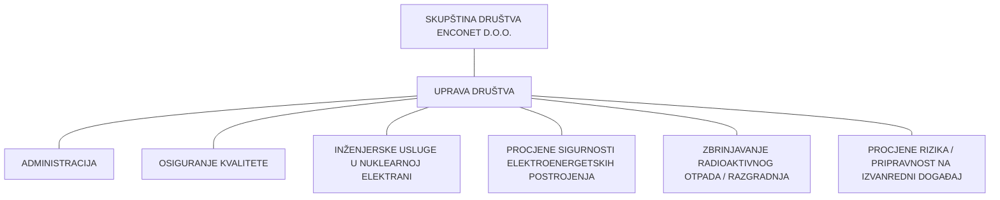

# PRAVILNIK O RADU DRUŠTVA ENCONET D.O.O., Revizija 2

Na temelju članka 26. i 27. Zakona o radu (NN br. 93/14, 127/17, 98/19, 151/22) društvo ENCONET d.o.o, Zagreb, Miramarska 20, OIB: 66909065021 (dalje u tekstu: poslodavac), donosi dana 30. lipnja 2023. godine sljedeći

# PRAVILNIK O RADU

## I. TEMELJNE ODREDBE

### Članak 1.

Ovim Pravilnikom o radu (dalje u tekstu: Pravilnik) uređuju se plaće, organizacija rada, postupak i mjere za zaštitu dostojanstva radnika, te mjere zaštite od diskriminacije i druga pitanja važna za radnike zaposlene kod poslodavca, a pobliže se uređuje:

- sklapanje ugovora o radu,
- zaštita života, zdravlja i privatnosti radnika,
- probni rad, obrazovanje i osposobljavanje za rad,
- radno vrijeme,
- odmori i dopusti,
- zaštita trudnica, roditelja i posvojitelja,
- zaštita radnika koji su privremeno ili trajno nesposobni za rad,
- plaće,
- materijalna prava radnika,
- zabrana natjecanja radnika s poslodavcem,
- naknada štete,
- prestanaka ugovora o radu,
- ostvarivanje prava i obveza iz radnog odnosa,
- mjere kontrole,
- prijelazne i završne odredbe.

Pravilnik se neposredno primjenjuje na sve radnike. Ako je neko pravo iz radnog odnosa različito uređeno ugovorom o radu, pravilnikom o radu, sporazumom sklopljenim između radničkog vijeća i poslodavca, kolektivnim ugovorom ili zakonom, primjenjuje se za radnika najpovoljnije pravo.

Odredbe ovog Pravilnika primjenjuju se neposredno i na fizičke osobe koje su članovi uprave Društva, direktori, prokuristi ili u drugom svojstvu sukladno posebnim zakonima, pojedinačno i samostalno, ovlašteni voditi poslove Društva, osim onih odredbi kojima se uređuju pitanja radnog vremena, stanke, dnevnog i tjednog odmora, ugovoru o radu na određeno vrijeme, prestanku ugovora o radu, otkaznom roku i otpremnini u slučaju da su ova pitanja na drugačiji način uređena ugovorom o radu između navedenih osoba i Društva.

Izrazi koji se koriste u ovom Pravilniku, a imaju rodno značenje, koriste se i odnose jednako na muški i ženski rod.

### Članak 2.

Prije stupanja radnika na rad, poslodavac mora omogućiti radniku da se upozna s propisima o radnim odnosima, te s organizacijom rada i zaštitom na radu.

### Članak 3.

Poslodavac i radnik obvezuju se postupati sukladno odredbama ovog Pravilnika, Zakona o radu i drugih propisa i odluka, koje se temelje na ovom Pravilniku i Zakonu o radu.

Poslodavac je obvezan uz puno poštivanje prava i dostojanstva svakog radnika izvršavati svoje radne obveze, u radnom odnosu radniku dati posao te mu za obavljeni rad isplatiti plaću, pobliže odrediti mjesto i način obavljanja rada, te osigurati uvjete za siguran rad, a radnik je obvezan prema uputama poslodavca danim u skladu s naravi i vrstom rada, osobno obavljati preuzeti posao na savjestan i stručan način, usavršavati svoje znanje i radne vještine, štititi poslovne interese poslodavca te se pridržavati strukovnih i stegovnih pravila koja proizlaze iz organizacije posla i pravila struke.

Obaveze radnika iz radnog odnosa su naročito:
- uredno i pravodobno obavljanje radnih zadataka i poslova utvrđenih rasporedom poslova i drugih povjerenih poslova koji su u vezi sa radom,
- čuvanje imovine poslodavca, te briga o njenom održavanju,
- osobno i odgovorno obavljanje svih radnih dužnosti i obaveza koje proistječu iz rada,
- obavljanje rada u određeno vrijeme i neudaljavanje sa svog radnog mjesta bez znanja i odobrenja neposrednog rukovoditelja,
- dolazak na rad i odlazak sa rada u vrijeme utvrđeno za početak odnosno završetak rada,
- u slučaju nemogućnosti dolaska na rad obavještavanje neposrednog rukovoditelja najkasnije u roku jednog radnog dana od nastanka spriječenosti, osim u slučaju iz članka 54. Pravilnika (privremena nesposobnost za rad)
- čuvanje poslovne tajne i ugleda poslodavca,
- usavršavanje svoje stručne i radne sposobnosti uz potporu poslodavca,
- održavanje profesionalnog odnosa prema drugim zaposlenicima poslodavca,
- pridržavanje mjera zaštite na radu,
- izvan radnog vremena ponašanje na način koji ne umanjuje ugled poslodavca.

## II. SKLAPANJE UGOVORA O RADU

### Zasnivanje radnog odnosa

#### Članak 4.
Radni odnos zasniva se ugovorom o radu. Ugovor o radu je sklopljen kada su se ugovorne strane suglasile o bitnim sastojcima ugovora o radu.

Ugovor o radu se sklapa u pisanom obliku, a propust ugovornih strana da sklope ugovor o radu u pisanom obliku, ne utječe na postojanje i valjanost tog ugovora. Obvezan sadržaj ugovora o radu je propisan Zakonom o radu te će se poslodavac i radnik pridržavati istog sadržaja. Uz zakonom propisane odredbe, ugovor o radu može sadržavati i druge odredbe kojima se uređuje radnopravni odnos između poslodavca i radnika.

Prava i obveze iz radnog odnosa zasnivaju se od trenutka kada ugovor o radu potpišu obje ugovorne strane, odnosno na dan, koji je kao dan zasnivanja prava i obveza iz radnog odnosa kao takav određen ugovorom o radu.

Radnik će obavljati poslove za obavljanje kojih je sklopio ugovor o radu. Pored poslova određenih za pojedino radno mjesto u Pravilniku o sistematizaciji radnih mjesta i možebitno ugovoru o radu, radnik je dužan po uputama uprave ili neposrednog rukovoditelja obavljati poslove koji su u skladu s naravi i vrstom posla radnog mjesta utvrđenog ugovorom o radu, a iznimno i druge poslove u slučaju kad za to postoji potreba.

Ugovor o radu sklapa se, u pravilu, na neodređeno vrijeme.

Iznimno, ugovor o radu se može sklopiti na određeno vrijeme za zasnivanje radnog odnosa čiji je prestanak unaprijed utvrđen kada je zbog objektivnog razloga potreba za obavljanjem posla privremena. Ugovor o radu na određeno vrijeme zaključuje se u slučajevima, pod uvjetima i na rok utvrđen odredbama Zakona o radu.

Ako ugovorom o radu nije određeno vrijeme na koje je sklopljen, smatra se da je sklopljen na neodređeno vrijeme.

Poslodavac je dužan radniku koji je kod njega zaposlen na temelju ugovora o radu na određeno vrijeme osigurati iste uvjete rada kao i radniku koji je sklopio ugovor o radu na neodređeno vrijeme.

#### Članak 5.

Ugovor o radu sklopljen u pisanom obliku, odnosno potvrda o sklopljenom ugovoru o radu mora sadržavati sve bitne uglavke, a najmanje o:

1. strankama, njihovom osobnom identifikacijskom broju te njihovom prebivalištu, odnosno sjedištu,
2. mjestu rada, a ako zbog prirode posla ne postoji stalno ili glavno mjesto rada ili je ono promjenjivo, podatak o različitim mjestima na kojima se rad obavlja ili bi se mogao obavljati
3. nazivu posla, odnosno naravi ili vrsti rada, na koje se radnik zapošljava ili kratak popis ili opis poslova,
4. datumu sklapanja ugovora o radu i danu početka rada,
5. tome sklapa li se ugovor na neodređeno ili određeno vrijeme te o datumu prestanka ili očekivanom trajanju ugovora u slučaju ugovora o radu na određeno vrijeme,
6. trajanju plaćenog godišnjeg odmora na koji radnik ima pravo, a u slučaju kada se takav podatak ne može dati u vrijeme sklapanja ugovora odnosno izdavanja potvrde, načinu određivanja trajanja toga odmora,
7. postupku u slučaju otkazivanja ugovora o radu te o otkaznim rokovima kojih se mora pridržavati radnik, odnosno poslodavac, a u slučaju kada se takav podatak ne može dati u vrijeme sklapanja ugovora odnosno izdavanja potvrde, načinu određivanja otkaznih rokova,
8. bruto plaći, uključujući bruto iznos osnovne odnosno ugovorene plaće, dodacima te ostalim primicima za obavljeni rad i razdobljima isplate tih i ostalih primitaka na temelju radnog odnosa na koja radnik ima pravo,
9. trajanju redovnog radnog dana ili tjedna u satima,
10. tome ugovara li se puno radno vrijeme ili nepuno radno vrijeme
11. pravu na obrazovanje, osposobljavanje i usavršavanje, ako ono postoji,
12. trajanju i uvjetima probnog rada, ako je ugovoren

Ugovor o radu sadržavat će i druge odredbe propisane Zakonom o radu ako se radi o radnom mjestu za koje Zakon o radu iziskuje reguliranje radnog odnosa putem dodatnih odredbi u ugovoru o radu.

## Posebni uvjeti za sklapanje ugovora o radu

#### Članak 6.

Svaka osoba može, uz ispunjavanje općih i posebnih uvjeta za rad na određenim poslovima propisanim zakonom i pravilnicima poslodavca, slobodno, ravnopravno i uz jednake uvjete zasnovati radni odnos u Društvu.

Ako su zakonom, drugim propisom ili ovim Pravilnikom određeni posebni uvjeti za zasnivanje radnog odnosa, ugovor o radu može sklopiti samo radnik koji udovoljava tim uvjetima. Posebni uvjeti mogu biti predviđeni i odlukom uprave ili natječajem odnosno oglasom objavljenim u svrhu popunjavanja radnog mjesta.

Posebni uvjeti odnose se na zahtjeve koje mora ispunjavati radnik za rad na pojedinom poslu (radnom mjestu), a odnose se na uvjete stručne spreme, radno iskustvo i posebna znanja i sposobnosti.

Strani državljani i osobe bez državljanstva mogu se zaposliti u Društvu ako udovoljavaju i posebnim uvjetima za zapošljavanje tih osoba, propisanim posebnim zakonom.

#### Članak 7.

Rad na izdvojenom mjestu rada je rad kod kojeg radnik ugovoreni posao obavlja od kuće ili u drugom prostoru slične namjene koji je određen na temelju dogovora radnika i poslodavca, a koji nije prostor poslodavca.

Rad na daljinu je rad koji se uvijek obavlja putem informacijsko-komunikacijske tehnologije, pri čemu poslodavac i radnik ugovaraju pravo radnik da samostalno određuje gdje će taj rad obavljati, što može biti promjenjivo i ovisiti o volji radnika, zbog čega se takav rad ne smatra radom na mjestu rada odnosno na izdvojenom mjestu rada u smislu propisa o zaštiti na radu.

Rad na izdvojenom mjestu rada i rad na daljinu mogu se obavljati kao stalan, privremen ili povremen, ako, na prijedlog radnika ili poslodavca, radnik i poslodavac ugovore takvu vrstu rada.

Poslovi koji su Zakonom o radu ili drugim zakonom utvrđeni kao poslovi s posebnim uvjetima rada odnosno poslovi na kojima, ni uz primjenu mjera zaštite zdravlja i sigurnosti na radu, nije moguće zaštititi radnika od štetnih utjecaja ne smiju se obavljati radom na izdvojenom mjestu rada niti radom na daljinu.

Bitni sadržaj ugovora o radu na izdvojenom mjestu rada i ugovora o radu na daljinu utvrđuje se odredbama Zakona o radu.

## Dodatan rad

#### Članak 8.

Radnik koji je zaposlen i radi u punom radnom vremenu kod jednog poslodavca (dalje: matični poslodavac), odnosno radi u nepunom radnom vremenu kod više matičnih poslodavaca, tako da je njegovo ukupno radno vrijeme 40 sati tjedno, može dodatno raditi na temelju ugovora o dodatnom radu za drugog poslodavca.

S radnikom koji radi na poslovima s posebnim uvjetima rada u skladu s propisima o zaštiti na radu, radnikom koji radi u skraćenom radnom vremenu iz članka 26. ovog Pravilnika te radniku kojemu se prema propisu o mirovinskom osiguranju staž osiguranja računa s povećanim trajanjem ne može se sklopiti ugovor o dodatnom radu za obavljanje takvih poslova.

Radnik iz stavka 1. ovoga članka dužan je prije početka rada kod drugog poslodavca pisanim putem obavijestiti svog matičnog poslodavca o sklopljenom ugovoru o dodatnom radu s drugim poslodavcem.

Matični poslodavac može pisanim putem zatražiti od radnika da prestane obavljati dodatan rad kod drugog poslodavca, ako za to postoje objektivni razlozi, osobito ako je to protivno zakonskoj zabrani natjecanja ili ako se obavlja unutar rasporeda radnog vremena radnika kod matičnog poslodavca.

Ako je zahtjev matičnog poslodavca postavljen zbog postupanja protivnog zakonskoj zabrani natjecanja radnika s poslodavcem, na prava i obveze radnika i poslodavca na odgovarajući će se način primijeniti odredbe Zakona o radu kojima je uređena zakonska zabrana natjecanja.

Ako je zahtjev matičnog poslodavca postavljen zbog obavljanja dodatnog rada unutar rasporeda radnog vremena radnika kod matičnog poslodavca, radnik je dužan najkasnije u roku od tri dana prilagoditi radno vrijeme kod drugog poslodavca.

Poslodavac kod kojeg je radnik zaposlen u dodatnom radu dužan je na zahtjev radnika omogućiti korištenje godišnjeg odmora tog radnika u istom tjednu u kojem godišnji odmor koristi kod matičnog poslodavca.

Ugovor o dodatnom radu može se sklopiti na određeno ili na neodređeno vrijeme.

Ugovorom o dodatnom radu ne smije se ugovoriti radno vrijeme u trajanju dužem od osam sati tjedno.

#### Članak 9.

Prilikom sklapanja ugovora o radu, radnik je dužan obavijestiti poslodavca o bolesti ili drugoj okolnosti koja ga onemogućuje ili bitno ometa u izvršenju obveza iz ugovora o radu ili koja ugrožava život ili zdravlje osoba s kojima u izvršenju ugovora o radu radnik dolazi u dodir.

U slučaju da prilikom sklapanja ugovora o radu radnik ne obavijesti poslodavca o bolesti i drugoj okolnosti koja ga onemogućuje ili bitno ometa u izvršenju obveza iz ugovora o radu ili koja ugrožava život ili zdravlje osoba s kojim u izvršenju ugovora o radu radnik dolazi u dodir, a koja činjenica kasnije izađe na vidjelo, poslodavac ima pravo otkazati ugovor o radu po pravilima za izvanredni otkaz ugovora o radu.

#### Članak 10.

Radi utvrđivanja zdravstvene sposobnosti za obavljanje određenih poslova, poslodavac može uputiti radnika na liječnički pregled.

Troškove liječničkog pregleda snosi poslodavac.

#### Članak 11.

Prilikom postupka odabira kandidata za radno mjesto (razgovor, testiranje, anketiranje i sl.) i sklapanja ugovora o radu poslodavac ne smije tražiti od radnika podatke koji nisu u neposrednoj vezi s radnim odnosom.

Provjeru znanja i sposobnosti za obavljanje posla poslodavac može između ostalog vršiti na temelju preporuke bivšeg poslodavca radnika ili neposrednom provjerom na način koji odredi poslodavac prema članku 14., a koja je u skladu sa potrebama radnog mjesta.

Dodatna edukacija, specifična znanja i vještine su potrebna znanja i vještine za uspješno i potpuno obavljanje određenog posla (znanje stranog jezika, poznavanje rada na računalu, certifikacija, edukacija i stručna osposobljenost za rad na nuklearnom objektu i slično).

## III. ZAŠTITA ŽIVOTA, ZDRAVLJA, PRIVATNOSTI I PRAVA RADNIKA

#### Članak 12.

Poslodavac je dužan osigurati i/ili pribaviti i održavati prostor, uređaje, opremu, alate, mjesto rada i pristup mjestu rada te organizirati rad na način koji osigurava zaštitu života i zdravlja radnika, u skladu s posebnim zakonima i drugim propisima i naravi posla koji se obavlja.

Poslodavac je dužan upoznati radnika s opasnostima posla kojeg radnik obavlja, a dužan ga je osposobiti za rad, na način koji osigurava zaštitu života i zdravlja radnika te sprječava nastanak nesreća.

Radnik je odgovoran za vlastitu sigurnost i zdravlje, kao i sigurnost i zdravlje ostalih radnika na koje utječu njegovi postupci u radu.

Radnik je u provedbi mjera zaštite i sigurnosti obvezan pravilno upotrebljavati sredstva rada, osobni zaštitnu opremu i odmah obavijestiti poslodavca o događaju koji predstavlja moguću opasnost, te provoditi druge propisane ili od poslodavca utvrđene mjere.

#### Članak 13.

Poslodavac će prikupljati, obrađivati, koristiti i dostavljati trećima radi ostvarivanja prava i obveza iz radnog odnosa ili u vezi s radnim odnosom sljedeće podatke radnika: ime i prezime, adresa, spol, bračni status, mjesto i datum rođenja, državljanstvo, početak rada kod poslodavca, tekući (ili drugi odgovarajući bankovni) račun, podatke o zavisnim članovima radnikove obitelji (ime, rođenje, spol, državljanstvo), ime za svrhu opcija za stjecanje dionica, ime i prezime osobe za kontakt u hitnim slučajevima, podatke o poznavanju stranih jezika, spremnost na putovanja, obrazovanje, podatke o bivšim poslodavcima, osobni identifikacijski broj (ili drugi odgovarajući identifikacijski broj), podatke o plaći, mjesto rada, vrsta ugovora o radu s obzirom na trajanje, vještine i specijalnosti, važenje dokumenata (o boravku, radna dozvola, zdravstveno osiguranje), izvršeno osposobljavanje ili usavršavanje, broj korporacijske identifikacije, kategorija zaposlenja.

Poslodavac je ovlašten raspolagati i drugim osobnim podacima radnika kada to zakon nalaže odnosno sukladno pozitivno pravnoj zakonskoj regulativi.

Poslodavac će podatke iz stavka 1. ovoga članka dostavljati jedino onim osobama koje su u takvoj poslovnoj vezi s poslodavcem da je njihovo saznanje za osobne podatke radnika potrebno radi ostvarenja prava i obveza iz ili u vezi s radnim odnosom.

Osobne podatke radnika ovlašten je u ime poslodavca prikupljati, obrađivati, koristiti i dostavljati trećima član uprave poslodavca ili, u slučaju višečlane uprave, svaki od članova uprave poslodavca. Poslodavac, na način predviđen za zastupanje društva, može za navedene radnje u vezi s osobnim podacima radnika pisanim putem opunomoćiti jednog ili više radnika Društva. Uprava poslodavca, na način predviđen za zastupanje Društva, između osoba koje uživaju povjerenje radnika, dužan je imenovati radnika ili drugu osobu koja će, osim uprave poslodavca, biti ovlaštena nadzirati zakonitost raspolaganja osobnim podacima radnika.

Osoba ovlaštena za nadzor u smislu stavka 4. ovoga članka mora brižljivo čuvati podatke koje je saznala u obavljanju dužnosti.

Netočni podaci moraju se neodgodivo ispraviti, a podaci za čije čuvanje nema pravnih ili stvarnih razloga moraju se brisati. Radnik je dužan bez odgode obavijestiti poslodavca o svim promjenama osobnih podataka.

Ako je zakonom ili drugim propisom predviđen koji oblik raspolaganja i drugim podacima iz područja rada, Društvo će raspolagati i tim drugim podacima, na propisani način.

Poslodavac je dužan imenovati osobu koja je osim njega ovlaštena nadzirati da li se osobni podaci radnika prikupljaju, obrađuju, koriste i dostavljaju trećim osobama u skladu sa zakonom.

#### Članak 14.

Radnik koji smatra da mu je poslodavac povrijedio neko pravo iz radnog odnosa može u roku od 15 dana od dana dostave odluke kojom je povrijeđeno njegovo pravo, odnosno 15 dana od dana saznanja za povredu prava, zahtijevati od poslodavca ostvarenje tog prava.

Ako poslodavac u roku od 15 dana od dostave zahtjeva radnika ne udovolji tom zahtjevu, radnik može u daljnjem roku od 15 dana zahtijevati zaštitu povrijeđenog prava pred nadležnim sudom.

## IV. PROVJERA STRUČNIH SPOSOBNOSTI, PROBNI RAD,OBRAZOVANJE I OSPOSOBLJAVANJE ZA RAD

### Provjera stručnih i drugih radnih sposobnosti kandidata za zaposlenje

#### Članak 15.

Poslodavac samostalno utvrđuje svoj organizacijski ustroj i broj radnika, kao i uvjete koje radnici moraju ispunjavati za obavljanje pojedinih poslova.

Pod uvjetima potrebnima za obavljanje poslova radnog mjesta podrazumijevaju se uvjeti koji su kao takvi predviđeni za pojedina radna mjesta odredbama Pravilnika o sistematizaciji radnih mjesta. Broj radnika na pojedinom radnom mjestu određuje poslodavac sukladno svojim potrebama.

Prije zasnivanja radnog odnosa može se obaviti provjera stručnih, zdravstvenih i drugih radnih sposobnosti. Provjera se obavlja na način koji utvrdi uprava u skladu sa zakonom.

Provjeru obavlja osoba koju za to zaduži uprava.

Provjera se može obaviti putem testiranja, obavljanjem određenog praktičnog zadatka, razgovorom, te na drugi prikladan način.

O načinu provjere sposobnosti u konkretnom slučaju odlučuje poslodavac, odnosno osoba koju on ovlasti.

U slučaju negativnog rezultata provjere ne može se donijeti odluka o zasnivanju radnog odnosa sa radnikom.

Odluku o izboru kandidata donosi uprava, odnosno osoba koju oni ovlaste.

S izabranim kandidatom poslodavac zaključuje ugovor o radu.

# Probni rad

#### Članak 16.

Prilikom sklapanja ugovora o radu može se ugovoriti probni rad. Trajanje probnog rada određuje se ugovorom o radu, s time da probni rad ne smije trajati duže od šest mjeseci. Iznimno, razdoblje u kojem je određen probni rad može trajati duže ako je tijekom njegova trajanja radnik bio privremeno odsutan, osobito zbog privremene nesposobnosti za rad, korištenja rodiljnih i roditeljskih prava prema posebnom propisu i korištenja prava na plaćeni dopust, kada se trajanje probnog rada može produžiti razmjerno dužini trajanja nenazočnosti na probnom radu tako da ukupno trajanje probnog rada prije i nakon njegova prekida ne može biti duže od šest mjeseci. Ako je ugovor o radu sklopljen na određeno vrijeme, trajanje probnog rada mora biti razmjerno očekivanom trajanju ugovora i naravi i vrsti posla koji radnik obavlja.

Probni rad se ugovara kako bi se utvrdilo ima li radnik stručne i radne sposobnosti potrebne za obavljanje poslova radnog mjesta za koje sklapa ugovor o radu.

Rad radnika na probnom radu ocjenjuje osoba određena od strane poslodavca. Ako radnik ne zadovolji na probnom radu, isto predstavlja posebno opravdan razlog za otkaz ugovora o radu koji se radniku može otkazati tijekom njegova trajanja, a najkasnije zadnjeg dana probnog rada uz otkazni rok od 14 dana. Otkaz ugovora o radu za trajanja probnog rada mora se dostaviti radniku kojemu se radni odnos otkazuje, a čime otkazni rok počinje teći danom primitka odluke o otkazu od strane radnika.

Nakon prestanka sklopljenog ugovora o radu u kojem je bio ugovoren probni rad, radnik i poslodavac pri sklapanju novog ugovora o radu za obavljanje istih poslova ne mogu ponovno ugovoriti probni rad. Ako su radnik i poslodavac tijekom trajanja radnog odnosa sklopili ugovor o radu radi obavljanja drugih poslova, dopušteno je ugovoriti probni rad, s time da se u pogledu otkaznog roka primjenjuje odredba stavka 3. ovoga članka.

# Pojam pripravnika i vrijeme na koje se može s njim sklopiti ugovor o radu

#### Članak 17.

Osobu koja se prvi puta zapošljava u zanimanju za koje se školovala poslodavac može zaposliti kao pripravnika.

Ugovor o radu pripravnika može se sklopiti na određeno vrijeme, sukladno trajanju pripravničkog staža.

#### Članak 18.

Pripravnik se za samostalan rad osposobljava pod nadzorom mentora kojeg mu odredi poslodavac.

Za trajanja pripravničkog staža pripravnik će obavljati sve poslove iz djelokruga poslova za koje se priprema.

Radi osposobljavanja za samostalan rad, pripravnika se može privremeno uputiti na rad kod drugog poslodavca.

#### Članak 19.

Osposobljavanje pripravnika za samostalan rad (pripravnički staž) traje najduže godinu dana, ako zakonom nije drukčije određeno.

Ako, temeljem pozitivne ocjene osobe ovlaštene od strane poslodavca, pripravnik na kraju pripravničkog staža pokaže zadovoljavajuće stečeno znanje na poslovima na kojima je radio, poslodavac može s takvim radnikom zaključiti ugovor o radu na neodređeno vrijeme i temeljem sklopljenog ugovora o radu rasporediti ga na obavljanje odgovarajućih poslova.

Pripravnici u strukama i zanimanjima za koje je zakonom ili drugim propisom utvrđeno trajanje pripravničkog staža i način polaganja stručnog ispita, odrađuju pripravnički staž sukladno tim propisima.

Ako pripravnik ne položi stručni ispit koji je propisan zakonom, kolektivnim ugovorom ili nekim drugim propisom, poslodavac može pripravniku redovito otkazati ugovor o radu.

## Stručno osposobljavanje za rad

#### Članak 20.

Ako je stručni ispit ili radno iskustvo, zakonom ili drugim propisom utvrđeno kao uvjet za obavljanje poslova radnog mjesta određenog zanimanja, poslodavac može osobu koja je završila školovanje za takvo zanimanje primiti na stručno osposobljavanje za rad bez zasnivanja radnog odnosa (stručno osposobljavanje za rad).

Razdoblje stručnog osposobljavanja za rad iz stavka 1. ovoga članka ubraja se u pripravnički staž i radno iskustvo propisano kao uvjet za rad na poslovima radnog mjesta određenog zanimanja. Stručno osposobljavanje za rad može trajati koliko i pripravnički staž.

Ako zakonom nije drukčije propisano, na osobu koja se stručno osposobljava za rad primjenjuju se odredbe o radnim odnosima iz Zakona o radu i drugih zakona, osim odredbi o sklapanju ugovora o radu, plaći i naknadi plaće te prestanku ugovora o radu.

Ugovor o stručnom osposobljavanju za rad mora se sklopiti u pisanom obliku.

## Obrazovanje i osposobljavanje za rad

#### Članak 21.

Poslodavac će, sukladno potrebama posla i mogućnostima, omogućiti radnicima školovanje, obrazovanje, osposobljavanje i usavršavanje, a pod uvjetima propisanim u ovom članku.

Svaki radnik se dužan, u skladu sa svojim sposobnostima i potrebama rada, školovati, obrazovati, osposobljavati i usavršavati za rad.

Poslodavac će organizirati odnosno osigurati osposobljavanje za rad radnika u sljedećim slučajevima:

- radi promjene ili uvođenja novog načina ili organizacije rada;
- radi osposobljavanja na novom stroju, programu i sl.;
- radi obveznog osposobljavanja za rad na siguran način;
- radi neophodnog osposobljavanja radi osiguranja ovlaštenja za rad za poslove koje radnik obavlja, a koje ovlaštenje je uvjet za radnikovo obavljanje posla, uključujući i obnavljanje ovlaštenja;
- u drugim sličnim slučajevima propisanim zakonom odnosno drugim propisom.

Osposobljavanje će poslodavac sam organizirati i obaviti ili će osigurati vanjskog pružatelja takve usluge.

Troškove osposobljavanja iz stavka 3. ovoga članka u cijelosti snosi poslodavac, a obavljat će se primarno u prostorijama poslodavca, ako je to moguće, te po mogućnosti tijekom utvrđenog rasporeda radnog vremena radnika.

Osposobljavanje iz stavka 3. ovoga članka uračunava se u radno vrijeme.

Pod osposobljavanjem iz stavka 3. ovoga članka ne smatraju se edukacije potrebne za održavanje licence zbog članstva u obveznoj komori koje su propisane posebnim zakonima, osim ako posebnim zakonom nije izričito propisano drugačije, i sve edukacije iz ovog Pravilnika, odnosno sve druge edukacije koje radnik samostalno koristi.

Kada poslodavac radnika upućuje na kraću edukaciju (seminar, konferenciju i sl.) te kada poslodavac snosi troškove takve edukacije, navedeno se smatra radnim vremenom, a u situaciji kada se edukacije održavaju izvan mjesta rada, isto se smatra službenim putem.

Poslodavac može radniku, ako ga sam ne upućuje na edukacije, na radnikov zahtjev odobriti plaćeni ili neplaćeni dopust za kraću edukaciju, a može mu, po vlastitom nahođenju, platiti trošak edukacije, uključivo i trošak puta na edukaciju, u cijelosti ili djelomično.

Ako poslodavac upućuje radnika na dulje odnosno skuplje školovanje (srednjoškolsko obrazovanje, preddiplomski studij, diplomski studij, doktorski studij i sl.) radnik je dužan po povratu sa školovanja ostati na radu kod poslodavca najmanje dvostruko vremena nego što je trajalo školovanje, a u protivnom dužan je vratiti sredstva za školovanje umanjena proporcionalno za onoliko vremena koliko je radnik nakon školovanja ostao u radu kod poslodavca, a koja obveza plaćanja tih sredstava dospijeva s danom prestanka rada kod poslodavca.

Ako radnik ne završi školovanje, prekine ga, odustane od školovanja, izgubi pravo na školovanje, da otkaz za vrijeme školovanja, ili mu poslodavac otkaže zbog radnikove krivnje, dužan je poslodavcu vratiti sva sredstva koja je poslodavac platio za školovanje, a koja sredstva dospijevaju danom prestanka školovanja odnosno prestanka rada kod poslodavca.

Ako radnik ne završi školovanje u roku koji ne može biti duži od vremena redovitog trajanja školovanja uvećanog za 50%, dužan je poslodavcu vratiti sredstva plaćena za školovanje, a koja dospijevaju istekom roka iz ovog stavka.

Iznimno, radnik neće biti dužan vratiti sredstva za školovanje ako mu prije nastanka okolnosti iz stavaka 10. do 12. ovoga članka Poslodavac otkaže ugovor o radu poslovno uvjetovanim otkazom.

Sve obveze i prava iz stavaka 10. do 13. ovoga članka vrijede ako se poslodavac i radnik drugačije ne dogovore ugovorom o školovanju ili drugim ugovorom odnosno sporazumom.

# Stupanje na rad

#### Članak 22.
Radnik je dužan stupiti na rad danom koji je određen ugovorom o radu.

Poslodavac može u protivnom raskinuti ugovor o radu i tražiti naknadu štete.

#### Članak 23.
Poslodavac je dužan radniku prije početka rada dostaviti primjerak ugovora o radu kada je sklopljen u pisanom obliku te dostaviti primjerak prijave na obvezno mirovinsko i zdravstveno osiguranje u roku od osam dana od isteka roka za prijavu na obvezna osiguranja prema posebnom propisu.

# V. RADNO VRIJEME

## Pojam radnog vremena

#### Članak 24.
Radno vrijeme je vremensko razdoblje u kojem je radnik obvezan obavljati poslove, odnosno u kojem je spreman (raspoloživ) obavljati poslove prema uputama poslodavca, na mjestu gdje se njegovi poslovi obavljaju ili drugom mjestu koje odredi poslodavac.

Radnim vremenom ne smatra se vrijeme u kojem je radnik pripravan odazvati se pozivu poslodavca za obavljanje poslova ako se ukaže takva potreba, pri čemu se radnik ne nalazi na mjestu gdje se njegovi poslovi obavljaju niti na drugom mjestu koje je odredio poslodavac.

Vrijeme koje radnik provede obavljajući poslove po pozivu poslodavca, smatra se radnim vremenom, neovisno o tome da li ih obavlja u mjestu koje je odredio poslodavac ili u mjestu koje je odabrao radnik.

## Puno i nepuno radno vrijeme

#### Članak 25.
Ugovor o radu može se sklopiti za puno ili nepuno radno vrijeme. Puno radno vrijeme iznosi 40 sati tjedno.

Nepunim radnim vremenom smatra se svako radno vrijeme kraće od punog radnog vremena.

Ugovor o radu može se sklopiti i za nepuno radno vrijeme kada priroda i opseg posla, odnosno organizacija rada ne zahtijeva rad s punim radnim vremenom, odnosno u slučaju kada radnik podnese zahtjev za obavljanje rada u nepunom radnom vremenu, a priroda posla i ostali uvjeti to omogućuju.

Rad u nepunom radnom vremenu može biti raspoređen u istom ili različitom trajanju tijekom tjedna, odnosno samo u nekim danima u tjednu, što će se utvrditi rasporedom radnog vremena.

Prilikom sklapanja ugovora o radu za nepuno radno vrijeme, radnik je dužan obavijestiti poslodavca o sklopljenim ugovorima o radu za nepuno radno vrijeme s drugim poslodavcem, odnosno drugim poslodavcima.

Ukoliko to priroda i organizacija rada omogućava, na istom radnom mjestu, odnosno poslovima mogu raditi dva izvršitelja, svaki s nepunim radnim vremenom.

Ako radnik radi nepuno radno vrijeme kod dva ili više poslodavca, za preraspodjelu radnog vremena potreban je pristanak radnika.

#### Članak 26.

Zaposlenici s nepunim radnim vremenom ostvaruju ista prava kao i zaposlenici s punim radnim vremenom, glede odmora između dva uzastopna radna dana, tjednog odmora, trajanja godišnjeg odmora i plaćenog dopusta.

Ako ugovorom o radu nije drugačije utvrđeno, radnicima s nepunim radnim vremenom osnovna plaća određuje se razmjerno vremenu na koje su zasnovali radni odnos.

Poslodavac je dužan razmotriti zahtjev radnika koji je stranka ugovora o radu sklopljenog za puno radno vrijeme za sklapanje ugovora o radu za nepuno radno vrijeme, kao i radnika koji je stranka ugovora o radu sklopljenog za nepuno radno vrijeme za sklapanje ugovora za puno radno vrijeme, ako kod njega postoji mogućnost za takvu vrstu rada.

Radnik koji je u radnom odnosu na temelju sklopljenog ugovora o radu za nepuno radno vrijeme kod istog poslodavca proveo duže od šest mjeseci, uključujući i razdoblje probnog rada kada je bio ugovoren, može zatražiti sklapanje ugovora o radu za puno radno vrijeme.

Poslodavac je dužan razmotriti mogućnost sklapanja ugovora o radu iz stavka 4. ovog članka te je u slučaju nemogućnosti sklapanja takvog ugovora dužan radniku dostaviti obrazloženi, pisani odgovor u roku od 30 dana od dana zaprimanja.

Ako radnik poslodavcu uputi naknadni sličan zahtjev, poslodavac koji je u nemogućnosti sklapanja ugovora o radu za puno radno vrijeme dužan je radniku dostaviti obrazloženi pisani odgovor u roku od 30 dana od dana zaprimanja zahtjeva, samo ako je od prethodno podnesenog zahtjeva radnika proteklo najmanje 12 mjeseci.

## Skraćeno radno vrijeme

#### Članak 27.

Na poslovima na kojima, uz primjenu mjera zaštite zdravlja i sigurnosti na radu, nije moguće zaštititi radnika od štetnih utjecaja, radno vrijeme se skraćuje razmjerno štetnom utjecaju uvjeta rada na zdravlje i radnu sposobnost radnika.

Poslovi iz stavka 1. ovoga članka te trajanje radnog vremena na takvim poslovima utvrđuju se posebnim propisom.

Ugovorom o radu može se odrediti da radnik, koji na poslovima iz stavka 1. ovog članka ne radi puno radno vrijeme, dio radnog vremena najduže do punoga radnog vremena, radi na nekim drugim poslovima, koji nemaju narav poslova iz stavka 1. ovog članka.

Pri ostvarivanju prava na plaću i drugih prava iz radnog odnosa ili u svezi s radnim odnosom, skraćeno radno vrijeme se izjednačuje s punim radnim vremenom.

# Prekovremeni rad

#### Članak 28.
U slučaju više sile, izvanrednog povećanja opsega poslova i u drugim sličnim slučajevima prijeke potrebe, radnik na zahtjev poslodavca mora raditi duže od punog, odnosno nepunog radnog vremena (prekovremeni rad).

Ako priroda prijeke potrebe onemogućava poslodavca da prije početka prekovremenog rada uruči radniku pisani zahtjev, usmeni zahtjev poslodavac je dužan pisano potvrditi u roku od 7 dana od dana kada je prekovremeni rad naložen.

Rad subotom i nedjeljom se smatra prekovremenim radom kada je radnik odradio puno radno vrijeme (40 sati) u istom tjednu.

Ukupno trajanje rada pojedinog radnika ne smije trajati duže od 50 sati tjedno. Prekovremeni rad pojedinog radnika ne smije trajati duže od 180 sati godišnje.

Trudnica, roditelj s djetetom do osam godina života te radnik koji radi u nepunom radnom vremenu kod više poslodavaca mogu raditi prekovremeno samo ako dostave poslodavcu pisanu izjavu o dobrovoljnom pristanku na takav rad, osim u slučaju više sile.

Matični poslodavac može radniku koji radi u dodatnom radu naložiti prekovremeni rad samo ako radnik dostavi poslodavcu pisanu izjavu o dobrovoljnom pristanku na takav rad, osim u slučaju više sile.

# Raspored radnog vremena

#### Članak 29.
Radno vrijeme raspoređeno je na 5 radnih dana od ponedjeljka do petka sa 8-satnim dnevnim radnim vremenom, osim ako je drugačije određeno Ugovorom o radu.

Poslodavac mora obavijestiti radnike o rasporedu ili promjeni rasporeda radnog vremena najmanje tjedan dana unaprijed, osim u slučaju hitnog prekovremenog rada.

# Preraspodjela radnog vremena

#### Članak 30.
Ako narav posla to zahtijeva, puno ili nepuno radno vrijeme može se preraspodijeliti tako da tijekom jedne kalendarske godine u jednom razdoblju traje duže, a u drugom razdoblju kraće od punog ili nepunog radnog vremena, na način da prosječno radno vrijeme tijekom trajanja preraspodjele ne smije biti duže od punog ili nepunog radnog vremena.

Preraspodijeljeno radno vrijeme ne smatra se prekovremenim radom.

Preraspodijeljeno radno vrijeme tijekom razdoblja u kojem traje duže od punog ili nepunog radnog vremena ne može trajati duže od 48 sati tjedno.

Preraspodijeljeno radno vrijeme u razdoblju u kojem traje duže od punog ili nepunog radnog vremena može trajati najduže 4 mjeseci.

Zabranjen je rad maloljetnika u preraspodijeljenom radnom vremenu koji bi trajao duže od 8 sati
dnevno.

## Noćni rad

#### Članak 31.
Noćni rad je rad radnika kojeg, neovisno o njegovom trajanju, obavlja u vremenu između 22 sata
uvečer i 6 sati ujutro idućeg dana.

Za maloljetnike zaposlene izvan industrije noćnim radom smatra rad između 20 sati uvečer i 6
sati ujutro idućeg dana.

Noćni radnik je radnik, koji prema rasporedu radnog vremenu redovito tijekom jednog dana radi
najmanje 3 sata u vremenu noćnog rada, odnosno koji tijekom kalendarske godine radi najmanje
trećinu svog radnog vremena u vremenu noćnog rada.

## Rad u smjenama

#### Članak 33.
Rad u smjenama je organizacija rada kod poslodavca prema kojoj dolazi do izmjene radnika na
istom radnom mjestu i mjestu rada u skladu s rasporedom radnog vremena, koji može biti
prekinut ili neprekinut, uključujući izmjenu smjena.

Smjenski radnik je radnik koji, kod poslodavca kod kojeg je rad organiziran u smjenama, tijekom
jednog tjedna ili jednog mjeseca na temelju rasporeda radnog vremena, posao obavlja u
različitim smjenama.

Ako je rad organiziran u smjenama koje uključuju i noćni rad, mora se osigurati izmjena smjena
tako da radnik u noćnoj smjeni radi uzastopce najduže jedan tjedan.

#### Članak 34.
Poslodavac je dužan noćnim i smjenskim radnicima osigurati sigurnost i zdravstvenu zaštitu u
skladu s naravi posla koji se obavlja, kao i sredstvo zaštite i prevencije koje odgovaraju i
primjenjuju se na sve ostale radnike i dostupne su u svako doba.

Radniku koji rasporedom radnog vremena bude određen da rad obavlja kao noćni radnik, prije
započinjanja tog rada, kao i redovito tijekom trajanja rada noćnog radnika, poslodavac je dužan
omogućiti zdravstvene preglede sukladno posebnom propisu.

Troškove zdravstvenog pregleda snosi poslodavac.

## Evidencija radnog vremena

#### Članak 35.
Poslodavac vodi evidenciju o radnicima, radnom vremenu i prekovremenim satima radnika,
odnosno evidentira ukupni broj sati prisustva radnika na radu te sate i razlog odsustva s rada za
vrijeme radnog vremena.

# VI. ODMORI I DOPUSTI

## Stanka

#### Članak 36.

Radnik koji radi najmanje šest sati dnevno ima svakoga radnog dana pravo na odmor (stanku) od najmanje 30 minuta. Maloljetni radnik koji radi najmanje četiri i pol sata dnevno ima svakoga radnog dana pravo na odmor (stanku) od najmanje 30 minuta neprekidno.

Vrijeme odmora iz stavka 1. ovoga članka ubraja se u radno vrijeme.

Način korištenja stanke odrediti će poslodavac obzirom na narav posla te mogućnost prekida rada radi korištenja odmora iz stavka 1. ovog članka.

## Dnevni odmor

#### Članak 37.

Tijekom svakog vremenskog razdoblja od 24 sata, radnik ima pravo na dnevni odmor od najmanje 12 sati neprekidno.

Iznimno od stavka 1. ovog članka poslodavac je dužan punoljetnom radniku koji radi na poslovima u dvokratnom ili smjenskom radu te u drugim slučajevima kada to zahtjeva intenzitet poslova u pojedinom razdoblju (poput remonta NE Krško odnosno drugih postrojenja u kojima zaposlenici obavljaju rad, i slično) osigurati pravo na dnevni odmor u trajanju od najmanje 8 sati neprekidno.

Radniku iz stavka 2. ovoga članka, mora se omogućiti korištenje zamjenskog dnevnog odmora odmah po okončanju razdoblja koje je proveo na radu zbog kojeg dnevni odmor nije koristio, odnosno koristio ga je u kraćem trajanju.

## Tjedni odmor

#### Članak 38.

Radnik ima pravo na tjedni odmor u neprekidnom trajanju od najmanje 24 sata, kojem se pribraja dnevni odmor.

Radnik ima pravo koristiti tjedni odmor nedjeljom, odnosno u dan koji nedjelji prethodi odnosno iza nje slijedi, ako mu se zbog organizacije rada ne može omogućiti korištenje tjednog odmora nedjeljom.

Ako radnik ne može koristiti odmor u trajanju i na način iz stavka 1. ovog članka, mora mu se za svaki radni tjedan omogućiti korištenje zamjenskog tjednog odmora odmah po okončanju razdoblja koje je proveo na radu, zbog kojeg tjedni odmor nije koristio ili ga je koristio u kraćem trajanju.

Iznimno, radnicima koji zbog obavljanja posla u različitim smjenama ili objektivno nužnih tehničkih razloga ili zbog organizacije rada ne mogu iskoristiti odmor u trajanju iz stavka 1. ovoga članka, pravo na tjedni odmor može biti određeno u neprekidnom trajanju od najmanje 24 sata kojem se ne pribraja dnevni odmor.

Maloljetni radnik ima pravo na tjedni odmor u neprekidnom trajanju od najmanje 48 sati.

# Godišnji odmor

#### Članak 39.
Radnik ima za svaku kalendarsku godinu pravo na plaćeni godišnji odmor u trajanju od najmanje četiri tjedna.

Maloljetni radnik i radnik koji radi na poslovima na kojima, uz primjenu mjera zaštite zdravlja i sigurnosti na radu, nije moguće zaštititi radnika od štetnih utjecaja, ima za svaku kalendarsku godinu pravo na godišnji odmor u trajanju od najmanje pet tjedana.

#### Članak 40.
Blagdani i neradni dani određeni zakonom ne uračunavaju se u trajanje godišnjeg odmora.

Razdoblje privremene nesposobnosti za rad, koje je utvrdio ovlašteni liječnik, ne uračunava se u trajanje godišnjeg odmora.

## Ništetnost odricanja od prava na godišnji odmor

#### Članak 41.
Ništetan je sporazum o odricanju od prava na godišnji odmor, odnosno o isplati naknade umjesto korištenja godišnjeg odmora.

## Rok stjecanja prava na godišnji odmor

#### Članak 42.
Radnik koji se prvi put zaposli ili koji ima prekid rada između dva radna odnosa duži od osam dana, stječe pravo na puni godišnji odmor određen na način propisan odredbama 38. i 39. ovoga Pravilnika, nakon šest mjeseci neprekidnog rada.

## Pravo na razmjerni dio godišnjeg odmora

### Članak 43.
Radnik ima pravo na jednu dvanaestinu pripadajućeg punog godišnjeg odmora određenog na način propisan odredbama čl. 39. i 40. ovoga Pravilnika za svakih navršenih mjesec dana rada, u slučaju da:

1. u kalendarskoj godini u kojoj je zasnovao radni odnos nije ispunio uvjete iz članka 45. ovoga Pravilnika te stekao pravo na puni godišnji odmor te

2. kada radniku prestaje radni odnos, za tu kalendarsku godinu ostvaruje pravo na razmjeran dio godišnjeg odmora.

Pri izračunavanju trajanja godišnjeg odmora na način iz stavka 1. ovoga članka, najmanje polovica dana godišnjeg odmora zaokružuje se na cijeli dan godišnjeg odmora, a najmanje polovica mjeseca rada zaokružuje se na cijeli mjesec.

# Naknada plaće za vrijeme godišnjeg odmora

#### Članak 44.
Za vrijeme korištenja godišnjeg odmora radnik ima pravo na naknadu plaće u visini kao da radi, a najmanje u visini njegove prosječne mjesečne plaće u prethodna tri mjeseca (uračunavajući sva primanja u novcu i naravi koja predstavljaju naknadu za rad).

# Naknada za neiskorišteni godišnji odmor

#### Članak 45.
U slučaju prestanka ugovora o radu, poslodavac je dužan radniku koji nije iskoristio pripadajući godišnji odmor na koji je stekao pravo, isplatiti naknadu umjesto korištenja godišnjeg odmora.

Naknada iz stavka 1. ovoga članka određuje se u visini naknade plaće za vrijeme korištenja godišnjeg odmora, razmjerno broju dana neiskorištenoga godišnjeg odmora.

# Korištenje godišnjeg odmora u dijelovima

#### Članak 46.
Ako radnik koristi godišnji odmor u dijelovima, mora tijekom kalendarske godine za koju ostvaruje pravo na godišnji odmor iskoristi najmanje dva tjedna u neprekidnom trajanju, osim ako se radnik i poslodavac drukčije ne dogovore, pod uvjetom da je ostvario pravo na godišnji odmor u trajanju dužem od dva tjedna.

# Prenošenje godišnjeg odmora u sljedeću kalendarsku godinu

#### Članak 47.
Neiskorišteni dio godišnjeg odmora u trajanju dužem od dijela godišnjeg odmora iz članka 46. ovoga Pravilnika radnik može prenijeti i iskoristiti najkasnije do 30. lipnja sljedeće kalendarske godine.

Radnik koji je ostvario pravo na razmjerni dio godišnjeg odmora u trajanju kraćem od dijela godišnjeg odmora iz članka 46. ovoga Pravilnika, može taj dio godišnjeg odmora prenijeti i iskoristiti najkasnije do 30. lipnja sljedeće kalendarske godine.

Radnik ne može prenijeti u sljedeću kalendarsku godinu dio godišnjeg odmora iz članka 43. ovoga Zakona ako mu je bilo omogućeno korištenje toga odmora.

Iznimno od stavka 2. ovoga članka, godišnji odmor, odnosno dio godišnjeg odmora koji radnik zbog korištenja prava na rodiljni, roditeljski i posvojiteljski dopust te dopust radi skrbi i njege djeteta s težim smetnjama u razvoju nije mogao iskoristiti ili njegovo korištenje poslodavac nije omogućio do 30. lipnja sljedeće kalendarske godine, radnik ima pravo iskoristiti do kraja kalendarske godine u kojoj se vratio na rad.

# Raspored korištenja godišnjeg odmora

#### Članak 48.
Raspored korištenja godišnjeg odmora utvrđuje poslodavac posebnom odlukom u skladu s ovim Pravilnikom.

Poslodavac prijedlog rasporeda korištenja godišnjeg odmora sastavlja na temelju odmora do 30. lipnja tekuće godine.

Pri utvrđivanju rasporeda korištenja godišnjeg odmora moraju se uzeti u obzir potrebe organizacije rada te mogućnosti za odmor raspoložive radnicima.

Radnika se mora najmanje 15 dana prije korištenja godišnjeg odmora obavijestiti o trajanju godišnjeg odmora i razdoblju njegovog korištenja pisanom odlukom.

Jedan dan godišnjeg odmora radnik ima pravo koristiti kada on to želi, uz obvezu da o tome obavijesti poslodavca najmanje 3 dana prije njegovog korištenja.

## Utvrđivanje trajanja godišnjeg odmora

#### Članak 49.

Zakonski minimum trajanja godišnjeg odmora od 4, odnosno 5 tjedana uvećava se za radni staž, za godine starosti te prema ocjeni poslodavca (otežani uvjeti rada, socijalni kriteriji i slično), kako slijedi:

1) Radni staž | radni dani
--------------|------------
Za radni staž od 1 do 5 godina | 1
Za radni staž od 5 do 10 godina | 2
za radni staž od 10 do 15 godina | 3
Za radni staž od 15 do 20 godina | 5
Za radni staž od 20 do 25 godina | 7
Za radni staž od preko 25 godina | 9

2) Godine starosti | radni dani
------------------|-----------
od 30 do 40 godina života | 1
od 40 do 50 godina života | 2
od 50 do 60 godina života | 3
više od 60 godina života | 4

3) Posebni uvjeti | radni dani
-----------------|------------
Rad izvan Zagreba vezan na dnevna putovanja | 3
Rad u kontroliranom području (od 1 do 3 radna dana) | 1-3
Samohranim roditeljima po djetetu | 1
Za posebno zalaganje na poslu (od 1 do 2 radna dana) | 1-2
Majke/očevi s djecom do 15 godina po djetetu | 1

## Plaćeni dopust

#### Članak 50.

Tijekom kalendarske godine radnik ima pravo na oslobođenje od obveze rada uz naknadu plaće (plaćeni dopust), za važne osobne potrebe, a osobito za:

Razlog | Broj radnih dana
-------|------------------
sklapanje braka | 3 radna dana
rođenje djeteta | 3 radna dana
teža bolest člana uže obitelji | 3 radna dana
selidba | 2 radna dana
smrt supružnika, djeteta ili roditelja (pastorčad, posvojenici, posvojitelji) | 4 radna dana

- smrt ostalih članova uže obitelji                                      2 radna dana
  (roditelji supružnika, supružnici djece,
  braća i sestre, očuh i maćeha, djedovi i bake)
- elementarne nesreće većih razmjera                                     2 radna dana
- dobrovoljno davanje krvi – za svako davanje                            1 radni dan
- školovanje, osposobljavanje,
  obrazovanje na zahtjev Radnika                                         6 radnih dana
- obvezni periodički zdravstveni pregled                                 1 radni dan

Radnik ima pravo na plaćeni dopust u ukupnom trajanju do 10 radnih dana godišnje.

Za stjecanje prava iz radnog odnosa ili u vezi s radnim odnosom, razdoblja plaćenog dopusta
smatraju se vremenom provedenim na radu.

Plaćeni dopust iz stavka 1. ovoga članka radnik koristi u vrijeme ili neposredno nakon nastanka
događaja zbog kojeg ostvaruje pravo na njegovo korištenje.

## Članak 51.

Radnici – dobrovoljni darivatelji krvi ostvaruju pravo na jedan slobodan dan s naslova
dobrovoljnog darivanja krvi za svako davanje krvi, a ostvaruju ga u tijeku kalendarske godine
sukladno radnim obvezama.

O namjeri darivanja krvi radnik je dužan, ako je to moguće, obavijestiti poslodavca najmanje tri
dana unaprijed.

Pravo iz stavka 1. ovoga članka radnik ostvaruje neovisno o opsegu korištenja prava na plaćeni
dopust po nekoj drugoj osnovi.

## Neplaćeni dopust

#### Članak 52.

Poslodavac može radniku na njegov pisani zahtjev odobriti neplaćeni dopust posebnom
odlukom.

Za vrijeme neplaćenoga dopusta prava i obveze iz radnog odnosa ili u svezi s radnim odnosom
miruju, ako zakonom nije drukčije određeno.

Radnik ima pravo na neplaćeni dopust u ukupnom trajanju od pet radnih dana godišnje za
pružanje osobne skrbi.

Pod pružanjem osobne skrbi, smatra se skrb koju radnik pruža članu uže obitelji ili osobi koja živi
u istom kućanstvu i koja joj je potrebna zbog ozbiljnog zdravstvenog razloga.

## Odsutnost s posla

#### Članak 53.

Radnik ima pravo na odsutnost s posla jedan dan u kalendarskoj godini kada je zbog osobito važnog i hitnog obiteljskog razloga uzrokovanog bolešću ili nesretnim slučajem prijeko potrebna njegova trenutačna nazočnost.

Razdoblje odsutnosti s posla iz stavka 1. ovoga članka smatra se vremenom provedenim na radu za stjecanje prava iz radnog odnosa ili u vezi s radnim odnosom (za stjecanje prava na otpremninu, otkazni rok i sl.)

## VII. ZAŠTITA TRUDNICA, RODITELJA I POSVOJITELJA

#### Članak 54.

Poslodavac ne smije odbiti zaposliti ženu niti joj otkazati ugovor o radu zbog njezine trudnoće, niti joj smije ponuditi sklapanje izmijenjenog ugovora o radu, osim na njezin prijedlog za obavljanje drugih odgovarajućih poslova.

Poslodavac ne smije tražiti bilo kakve podatke o ženinoj trudnoći niti smije uputiti drugu osobu da traži takve podatke, osim ako radnica osobno zahtijeva određeno pravo predviđeno zakonom ili drugim propisom radi zaštite trudnica.

Ako trudnica odnosno žena koja doji radi na poslovima koji ugrožavaju njezin život ili zdravlje, odnosno djetetov život ili zdravlje, poslodavac joj je dužan ponuditi sklapanje sporazuma kojim će se odrediti obavljanje drugih odgovarajućih poslova, a koji će za određeno vrijeme zamijeniti odgovarajuće uglavke ugovora o radu.

Sporazum iz prethodnog stavka ne smije imati za posljedicu smanjenje plaće radnice.

Ako poslodavac nije u mogućnosti postupiti na način propisan stavkom 3. ovoga članka, radnica ima pravo na dopust uz naknadu plaće sukladno posebnom propisu, a istekom vremena iz stavka 3. ovoga članka prestaje i sporazum iz istog članka, te se radnica vraća na poslove na kojima je prethodno radila na temelju ugovora o radu.

#### Članak 55.

Za vrijeme trudnoće, korištenja rodiljnog, roditeljskog, posvojiteljskog dopusta, očinskog dopusta ili dopusta koji je po sadržaju i načinu korištenja istovjetan pravu na očinski dopust, rada s polovicom punog radnog vremena, rada s polovicom punog radnog vremena zbog pojačane njege djeteta, dopusta trudnice, radnice koja je rodila ili majke koja doji dijete, te dopusta ili rada s polovicom punog radnog vremena radi skrbi i njege djeteta s težim smetnjama u razvoju, odnosno u roku od 15 dana od prestanka trudnoće ili prestanka korištenja tih prava u skladu s propisom o rodiljnim i roditeljskim potporama, poslodavac ne smije otkazati ugovor o radu trudnici i osobi koja se koristi nekim od spomenutih prava.

Okolnosti iz stavka 1. ovoga članka ne sprječavaju prestanak ugovora o radu sklopljenog na određeno vrijeme, istekom vremena za koje je sklopljen taj ugovor.

Radnik koji koristi pravo na rodiljni, roditeljski i posvojiteljski dopust i očinski dopust ili dopust koji je po sadržaju i načinu korištenja istovjetan pravu na očinski dopust, te ostala prava navedena u stavku 1. ovoga članka, može otkazati ugovor o radu izvanrednim otkazom. Ugovor se može otkazati najkasnije 15 dana prije onoga dana kojeg se radnik dužan vratiti na rad.

Trudnica može otkazati ugovor o radu izvanrednim otkazom.

#### Članak 56.

Nakon proteka rodiljnog, roditeljskog, posvojiteljskog i očinskog dopusta ili dopusta koji je po sadržaju i načinu korištenja istovjetan pravu na očinski dopust, dopusta trudne radnice, dopusta radnice koja je rodila ili radnice koja doji dijete, dopusta radi skrbi i njege djeteta s težim
smetnjama u razvoju te mirovanja radnog odnosa do treće godine života djeteta sukladno
propisu o rodiljnim i roditeljskim potporama, radnik koji je koristio neko od tih prava ima pravo
povratka na poslove na kojima je radio prije korištenja toga prava, a ako je prestala potreba za
obavljanjem tih poslova, poslodavac mu je dužan ponuditi sklapanje ugovora o radu za obavljanje
drugih odgovarajućih poslova, čiji uvjeti rada ne smiju biti nepovoljniji od uvjeta rada poslova koje
je obavljao prije korištenja toga prava.

Radnik iz stavka 1. ovoga članka, osim radnika koji koristi očinski dopust ili dopust koji je po
sadržaju i načinu korištenja istovjetan pravu na očinski dopust, u skladu s propisom o rodiljnim i
roditeljskim potporama, o namjeri povratka na rad mora poslodavca obavijestiti najmanje 3 dana
prije.

Radnik koji se koristio pravom iz stavka 1. ovoga članka ima pravo na dodatno stručno
osposobljavanje, ako je došlo do promjene u tehnici ili načinu rada, kao i sve druge pogodnosti
koje proizlaze iz poboljšanih uvjeta rada na koje bi ima pravo.

## VIII. ZAŠTITA RADNIKA KOJI SU PRIVREMENO ILI TRAJNO NESPOSOBNI ZA RAD

### Članak 57.
Radniku koji je pretrpio ozljedu na radu ili je obolio od profesionalne bolesti te je privremeno
nesposoban za rad zbog liječenja ili oporavka poslodavac ne može otkazati ugovor o radu u
razdoblju privremene nesposobnosti za rad zbog liječenja ili oporavka.

Zabrana iz stavka 1. ovoga članka ne utječe na prestanak ugovora o radu sklopljenoga na
određeno vrijeme.

### Članak 58.
Radnik koji je privremeno bio nesposoban za rad zbog ozljede ili ozljede na radu, bolesti ili
profesionalne bolesti, a za kojega nakon liječenja, odnosno oporavka, ovlašteni specijalist
medicine rada, odnosno ovlašteno tijelo sukladno posebnom propisu, utvrdi da je sposoban za
rad, ima se pravo vratiti na poslove na kojima je prethodno radio, a ako je prestala potreba za
obavljanjem tih poslova, poslodavac mu je dužan ponuditi sklapanje ugovora o radu za obavljanje
drugih odgovarajućih poslova.

### Članak 59.
Radnik je dužan što je moguće prije obavijestiti poslodavca o privremenoj nesposobnosti za rad,
a najkasnije u roku od tri dana dužan mu je dostaviti liječničku potvrdu o privremenoj
nesposobnosti za rad i njezinom očekivanom trajanju.

Ako zbog opravdanoga razloga radnik nije mogao ispuniti obvezu iz stavka 1. ovoga članka,
dužan je to učiniti što je moguće prije, a najkasnije tri dana od dana prestanka razloga koji ga je u
tome onemogućavao.

### Članak 60.
Ako ovlašteno tijelo utvrdi da kod radnika postoji profesionalna nesposobnost za rad ili
neposredna opasnost od nastanka invalidnosti, poslodavac je dužan, uzimajući u obzir nalaz i
mišljenje tog tijela, ponuditi radniku sklapanje ugovora o radu u pisanom obliku za obavljanje poslova za koje je on sposoban, koji što je više moguće moraju odgovarati poslovima na kojima je radnik prethodno radio.

## Članak 61.

Radnik koji je pretrpio ozljedu na radu, odnosno koji je obolio od profesionalne bolesti, a koji nakon završenog liječenja i oporavka ne bude vraćen na rad, ima pravo na otpremninu najmanje u dvostrukom iznosu od iznosa koji bi mu inače pripadao.

Radnik koji je neopravdano odbio ponuđene poslove iz članka 60. ovoga Pravilnika nema pravo na otpremninu u dvostrukom iznosu.

## Članak 62.

Radnik koji je pretrpio ozljedu na radu ili je obolio od profesionalne bolesti ima prednost pri stručnom osposobljavanju i školovanju koje organizira poslodavac.

## IX. DUŽNOSTI POSLODAVCA RADI POSEBNE ZAŠTITE DJETETA I MALOLJETNIKA

## Članak 63.

Ako je kod poslodavca zaposlen maloljetnik ili se provodi učenje temeljeno na radu, povremeni rad redovitog učenika prema posebnom propisu, odnosno ako je poslodavac organizator aktivnosti u kojima sudjeluju djeca i maloljetnici, kod radnika ili drugih osoba koje na zakonit način sudjeluju u radu kod poslodavca (studenata, osoba koje rade po posebnom propisu i sl.), a koji su u redovitom kontaktu s djetetom i maloljetnikom, ne smije postojati neka od sljedećih zapreka:

- pravomoćna osuda za neko od kaznenih djela protiv spolne slobode, spolnog zlostavljanja i iskorištavanja djeteta, a koja su, prije nego što su počinjena, bila propisana zakonom ili međunarodnim pravom

- da se protiv radnika odnosno druge osobe koja na zakonit način sudjeluje u radu kod poslodavca vodi kazneni postupak za neko od kaznenih djela navedenih u točki 1. ovoga stavka.

Radi utvrđivanja postojanja okolnosti iz stavka 1. poslodavac će:

- uz suglasnost osobe za koju se traži, zatražiti od nadležnog tijela dokaz da kandidat za radno mjesto ili radnik zaposlen kod poslodavca nije pravomoćno osuđen

- od kandidata za radno mjesto ili od radnika zaposlenog kod poslodavca zatražiti da dostavi dokaz da se protiv njega ne vodi kazneni postupak za kazneno djelo iz stavka 1. ovoga članka.

Poslodavac koji zapošljava maloljetnika ili provodi učenje temeljeno na radu, povremeni rad redovitog učenika prema posebnom propisu, odnosno organizator je provođenja aktivnosti u kojima sudjeluju djeca i maloljetnici dužan je onemogućiti osobi za koju ima saznanja da postoji zapreka iz stavka 1. ovoga članka kontakt s djetetom ili maloljetnikom.

# X. PLAĆE

## Članak 64.

Plaća je primitak radnika koji poslodavac isplaćuje radniku za obavljeni rad u određenom mjesecu.

Za izvršeni rad kod poslodavca radnik ima pravo na plaću čija je visina u bruto iznosu za svako radno mjesto utvrđena ugovorom o radu.

Plaća se može sastojati od osnovne, odnosno ugovorene plaće, dodataka te ostalih primitaka. Osnove i mjerila na temelju kojih se određuje plaća radnika utvrđeni su Pravilnikom o sistematizaciji radnih mjesta, a to su:

1. tražena stručna sprema
2. radno iskustvo
3. dodatna znanja i kvalifikacije
4. posebna znanja i vještine
5. opis poslova koje radnik obavlja

## Članak 65.

Za otežane uvjete rada, prekovremeni i noćni rad te za rad, nedjeljom, blagdanom ili nekim drugim danom za koji je zakonom određeno da se ne radi radnik ima pravo na povećanje osnovne plaće i to:

| Vrsta rada | Povećanje |
|------------|-----------|
| - za prekovremeni rad | 25% |
| - rad blagdanom, nedjeljom i druge neradne dane utvrđene Zakonom | 50% |
| - za noćni rad | 40% |
| - rad u kontroliranom području | 20% |

Ukoliko se rad radnika obavlja uz istodobno prisustvo više posebnih uvjeta, dodaci se kumuliraju. Iznimno, ako je blagdan ili neradni dan utvrđen zakonom nedjelja, radnik ostvaruje pravo na dodatak za rad na dan blagdana bez kumuliranja dodatka za rad nedjeljom.

## Članak 66.

Dodaci na plaću mogu biti u obliku bonusa odnosno nagrade i u obliku stimulacije.

Poslodavac će Radnicima isplatiti bonus odnosno nagradu na način da uzme u obzir uspješnost projekta i/ili radnog naloga na kojem je Radnik obavljao svoje radne zadatke, uspješnost Radnika na pojedinom projektu i/ili radnom nalogu, brzinu i kvalitetu obavljanja ugovornih obveza iz radnog odnosa Radnika te uvažavanje vrednovanja poslovnih partnera poslodavca i neposrednog voditelja projekta i/ili direktora Društva. Odlukom Uprave Društva se određuju uvjeti ostvarivanja isplate bonusa odnosno nagrade, iznos te dospijeće isplate istih.

Poslodavac može isplatiti radniku stimulativni dio plaće zbog iznimne učinkovitosti i zalaganja radnika prilikom izvršavanja radnih zadataka te ako Radnik svojim radom/idejama/angažmanom ostvari značajnu financijsku uštedu/korist u korist Poslodavca, ukoliko to financijske prilike poslodavca dopuštaju. Odluku o isplati stimulativnog dijela plaće, njegovoj visini te datumu dospijeća istog, donosi za svakog pojedinog radnika poslodavac temeljem vlastite odluke ovisno o krajnjim rezultatima rada.

#### Članak 67.
Plaća pripravnika iznosi 80% od plaće radnog mjesta za koje se pripravnik osposobljava.

#### Članak 68.
Plaća se isplaćuje nakon obavljenog rada, a isplaćuje se u novcu.

Plaća i naknada plaće se za prethodni mjesec isplaćuje najkasnije do 15. dana u idućem mjesecu na transakcijski račun radnika.

Osnovna plaća Radnika povećava se za svaku navršenu godinu dana rada u Društvu za 0,5%.

#### Članak 69.
Poslodavac je dužan najkasnije u roku 15 (petnaest) dana od dana isplate plaće, naknade plaće ili otpremnine, radniku dostaviti obračun iz kojeg je vidljivo kako su ti iznosi utvrđeni.

U obračunu plaće ili naknade plaće iz stavka 1. ovoga članka iskazuje se i iznos dospjelih i isplaćenih primitaka koje radnik ostvaruje na temelju radnog odnosa.

Poslodavac koji na dan dospjelosti ne isplati plaću, naknadu plaće ili otpremninu ili ih ne isplati u cijelosti, dužan je do kraja mjeseca u kojem je dospjela isplata plaće, naknada plaće, otpremnine radniku dostaviti:
- obračun u kojem će biti iskazan ukupan iznosa plaće, naknade plaće, otpremnine ili naknade plaće za neiskorišteni godišnji odmor u propisanom sadržaju
- obračun iznosa plaće, naknade plaće, otpremnine ili naknade plaće za neiskorišteni godišnji odmor koji je bio dužan isplatiti u propisanom sadržaju.

Obračuni iznosa su ovršne isprave.

## Članak 70.
Za razdoblja u kojima ne radi zbog opravdanih razloga određenih zakonom ili drugim propisom, radnik ima pravo na naknadu plaće.

Ako nije drukčije određeno zakonom, drugim propisom ili ugovorom o radu, radnik ima pravo na naknadu plaće u visini prosječne plaće isplaćene mu u prethodna tri mjeseca.

## Članak 71.
Za dane kada ne radi zbog privremene spriječenosti za rad u slučaju bolesti, njege člana obitelji i drugih slučajeva utvrđenih propisima o zdravstvenom osiguranju, radnik ima pravo na naknadu plaće u postotku utvrđene posebnim propisima o zdravstvenom osiguranju.

## XI. MATERIJALNA PRAVA RADNIKA

### Naknada troškova prijevoza na posao i s posla

## Članak 72.
Radnik ima pravo na naknadu troškova prijevoza na posao i s posla mjesnim javnim prijevozom i međumjesnim javnim prijevozom u visini stvarnih izdataka prema cijeni mjesečne odnosno pojedinačne prijevozne karte.

# Naknade za korištenje privatnog automobila u službene svrhe

## Članak 73.
Radnik koji po nalogu poslodavca koristi osobno vozilo za službene potrebe ima pravo na naknadu troškova tog korištenja u visini propisanoj poreznim propisima kao maksimalno neoporezivoj po prijeđenom kilometru.

# Prigodne nagrade, drugi oblici nagrada i solidarna pomoć

## Članak 74.
Poslodavac može utvrditi pravo radnika na isplatu prigodnih nagrada (božićnica, regres za godišnji odmor i sl.), novčanih nagrada za radne rezultate i drugih oblika dodatnog nagrađivanja radnika.

Novčane nagrade za radne rezultate se isplaćuju u slučaju da Društvo ostvari godišnji plan prihoda predviđen na početku godine odlukom Uprave Društva. Odlukom Uprave Društva se određuju uvjeti ostvarivanja isplate, iznos te dospijeće isplate istih.

Poslodavac može isplatiti radniku odnosno radnikovoj obitelji solidarnu pomoć u sljedećim slučajevima:
- smrti radnika
- nastanka teške invalidnosti
- bolovanja dužeg od 90 dana.

# Nagrade radnicima za navršene godine radnog staža

## Članak 75.
Radnik ima pravo na nagradu za navršene godine radnog staža koje su poreznim propisima određene kao jubilarne i to u iznosima koji se po tim propisima mogu kao neoporezivi isplatiti radniku.

Odluku o isplati nagrade iz ovog članka donosi Uprava Društva uz mogućnost uvećanja isplate iznosa predviđenih stavkom 1. ovog članka.

# Dnevnica za službeni put

## Članak 76.
Radnik ima pravo na dnevnicu za službeno putovanje u zemlji i inozemstvu u iznosu koji poslodavac po poreznim propisima može kao neoporeziv isplatiti radniku.

# Naknada za odvojeni život od obitelji

## Članak 77.
Poslodavac utvrđuje slučajeve kada radniku za čijim radom poslodavac ima potrebu, a čije je prebivalište izvan sjedišta poslodavca ili poslovne jedinice poslodavca, pripada pravo na naknadu za odvojeni život radi pokrića troškova smještaja i prehrane i to najviše do neoporezivog iznosa utvrđenog propisom.

## XII. ZABRANA NATJECANJA RADNIKA S POSLODAVCEM

### Članak 78.
Radnik ne smije bez prethodne pisane suglasnosti poslodavca, za svoj ili tuđi račun, sklapati poslove iz djelatnosti koju obavlja poslodavac (zakonska zabrana natjecanja).

Ako radnik postupi protivno zabrani iz stavka 1. ovog članka, poslodavac može od radnika tražiti naknadu pretrpljene štete ili može tražiti da se sklopljeni posao smatra sklopljenim za njegov račun, odnosno da mu radnik preda zaradu ostvarenu iz takvog posla ili da na njega prenese potraživanje zarade iz takvoga posla.

Pravo poslodavca iz stavka 2. ovog članka prestaje u roku tri mjeseca od dana kada je poslodavac saznao za sklapanje posla, odnosno pet godina od dana sklapanja posla.

Ako je u vrijeme zasnivanja radnog odnosa poslodavac znao da se radnik bavi obavljanjem određenih poslova, a nije od njega zahtijevao da se prestane time baviti, smatra se da je radniku dao odobrenje za bavljenje takvim poslovima.

Poslodavac može odobrenje iz stavka 1. odnosno stavka 4. ovog članka opozvati, poštujući pri tome propisani ili ugovoreni rok za otkaz ugovora o radu.

### Članak 79.
Poslodavac i radnik mogu ugovoriti da se određeno vrijeme nakon prestanka ugovora o radu, radnik ne smije zaposliti kod druge osobe koja je u tržišnom natjecanju s poslodavcem te da ne smije za svoj račun ili za račun treće osobe sklapati poslove kojima se natječe s poslodavcem (ugovorna zabrana natjecanja).

Ugovor iz stavka 1. ovog članka ne smije se zaključiti za razdoblje duže od dvije godine od dana prestanka radnog odnosa. Ugovor se mora sklopiti u pisanom obliku, a može biti sastavni dio ugovora o radu.

### Članak 80.
Ugovorna zabrana natjecanja obvezuje radnika samo ako je ugovorom poslodavac preuzeo obvezu da će radniku za vrijeme trajanja zabrane isplaćivati naknadu najmanje u iznosu polovice prosječne plaće, isplaćene radniku u tri mjeseca prije prestanka ugovora o radu.

Naknadu iz stavka 1. ovog članka poslodavac je dužan isplatiti radniku krajem svakog kalendarskog mjeseca.

### Članak 81.
Ako je za slučaj nepoštivanja ugovorne zabrane natjecanja predviđena samo ugovorna kazna, poslodavac može, u skladu s općim propisima obveznog prava, tražiti samo isplatu te kazne, a ne i ispunjenje obveze ili naknadu veće štete.

Ugovorna kazna iz stavka 1. ovog članka može se ugovoriti i za slučaj da poslodavac ne preuzme obvezu isplate naknade plaće za vrijeme trajanja ugovorne zabrane natjecanja.

# XIII. NAKNADA ŠTETE

## Članak 82.
Radnik koji na radu ili u svezi s radom namjerno ili zbog krajnje nepažnje uzrokuje štetu poslodavcu, dužan je štetu nadoknaditi.

Ako štetu uzrokuje više radnika, svaki radnik odgovara za dio štete koji je uzrokovao. Ako se od tih radnika za svakog radnika zasebno ne može utvrditi dio štete koji je on uzrokovao, smatra se da su svi radnici odgovorni i štetu naknađuju u jednakim dijelovima.

Ako je više radnika uzrokovalo štetu kaznenim djelom počinjenjem s namjerom, za štetu odgovaraju solidarno.

## Članak 83.
Visina štete utvrđuje se na osnovi cjenika ili knjigovodstvene vrijednosti, a ako ovih nema, procjenom.

Procjena visine štete može se povjeriti ovlaštenom sudskom vještaku.

## Članak 84.
Radnik koji na radu ili u svezi s radom, namjerno ili zbog krajnje nepažnje uzrokuje štetu trećoj osobi, a štetu je naknadio poslodavac, dužan je poslodavcu naknaditi iznos naknade isplaćene trećoj osobi.

## Članak 85.
Ako radnik pretrpi štetu na radu ili u svezi s radom, poslodavac je dužan radniku naknaditi štetu po općim propisima obveznoga prava.

Pravo na naknadu štete iz stavka 1. ovog članka odnosi se i na štetu koju je poslodavac uzrokovao radniku povredom njegovih prava iz radnog odnosa.

# XIV. PRESTANAK UGOVORA O RADU

## Načini prestanka ugovora o radu

## Članak 86.
Ugovor o radu prestaje:
1. smrću radnika,
2. istekom vremena na koje je sklopljen ugovor o radu na određeno vrijeme,
3. kada radnik navrši 65 godina života i 15 godina mirovinskog staža, osim ako se poslodavac i radnik drukčije ne dogovore,
4. sporazumom radnika i poslodavca,
5. danom dostave obavijesti poslodavcu o pravomoćnosti rješenja o priznanju prava na invalidsku mirovinu zbog potpunog gubitka radne sposobnosti,
6. otkazom,
7. odlukom nadležnog suda.

# Sporazum o prestanku ugovora o radu

#### Članak 87.
Sporazum o prestanku ugovora o radu mora biti zaključen u pisanom o obliku.

# Otkaz ugovora o radu

#### Članak 88.
Ugovor o radu mogu otkazati poslodavac i radnik.

# Redoviti otkaz poslodavca

#### Članak 89.
Poslodavac može otkazati ugovor o radu uz propisani ili ugovoreni otkazni rok (redoviti otkaz) ako za to ima opravdani razlog, u slučaju:
- ako prestane potreba za obavljanjem određenog posla zbog gospodarskih, tehničkih ili organizacijskih razloga (poslovno uvjetovani otkaz),
- ako radnik nije u mogućnosti uredno izvršavati svoje obveze iz radnog odnosa zbog određenih trajnih osobina ili sposobnosti (osobno uvjetovan otkaz),
- ako radnik krši obveze iz radnog odnosa (otkaz uvjetovan skrivljenim ponašanjem radnika), ili
- ako radnik nije zadovoljio na probnom radu (otkaz zbog nezadovoljavanja na probnom radu).

#### Članak 90.
Prije redovitog otkazivanja uvjetovanoga ponašanjem radnika, poslodavac je dužan radnika pisano upozoriti na obveze iz radnog odnosa i ukazati mu na mogućnost otkaza u slučaju nastavka povrede te obveze, osim ako postoje okolnosti zbog kojih nije opravdano očekivati od poslodavca da to učini.

Obvezama iz radnog odnosa, čije je kršenje razlog za otkaz ugovora poslodavca uvjetovan skrivljenim ponašanjem radnika, naročito se smatraju obveze radnika navedene u članku 3. Pravilnika te neostvarivanje predviđenih rezultata rada iz neopravdanih razloga.

Prije redovitog otkazivanja uvjetovanog ponašanjem radnika, poslodavac je dužan omogućiti radniku da iznese svoju obranu, osim ako postoje okolnosti zbog kojih nije opravdano očekivati od poslodavca da to učini.

# Redoviti otkaz radnika

#### Članak 91.
Radnik može otkazati ugovor o radu uz propisani ili ugovoreni otkazni rok, ne navodeći za to razlog.

# Izvanredni otkaz ugovora o radu

#### Članak 92.
Poslodavac i radnik imaju opravdani razlog za otkaz ugovora o radu sklopljenog na neodređeno ili određeno vrijeme, bez obveze poštivanja propisanog ili ugovorenog otkaznog roka (izvanredni otkaz), ako zbog osobito teške povrede obveze iz radnog odnosa ili neke druge osobito važne činjenice, uz uvažavanje svih okolnosti i interesa obiju ugovornih stranaka, nastavak radnog odnosa nije moguć.

Teškim povredama obveza iz radnog odnosa smatraju se na primjer:
- nezakonito raspolaganje sredstvima poslodavca;
- nesvrsishodno i neodgovorno korištenje sredstava poslodavca;
- neobavještavanje poslodavca prilikom sklapanja ugovora o radu o bolesti ili drugoj okolnosti koja će radnika onemogućavati ili bitno ometati u izvršenju obveza iz ugovora o radu ili koje ugrožavaju živote ili zdravlje osoba s kojima će u izvršenju ugovora o radu radnik dolaziti u dodir
- nepoduzimanje radnje koje je radnik s posebnim ovlaštenjima i odgovornostima dužan poduzeti u okviru svojih ovlaštenja;
- zloupotreba položaja ili prekoračenja danog ovlaštenja;
- povreda propisa o osiguranju i zaštiti od požara, eksplozije, elementarnih nepogoda i štetnog djelovanja otrovnih i drugih opasnih materija;
- odavanje poslovne, službene ili druge tajne utvrđene zakonom ili općim aktom;
- zloupotreba prava korištenja bolovanja;
- povreda propisa i nepoduzimanje mjera radi zaštite radnika, sredstava rada i životne sredine;
- ometanje jednog ili više radnika u procesu rada kojim se izričito otežava izvršavanje radnih obveza;
- poduzimanje djelatnosti konkurentnih poslodavcu protivno ugovoru o radu;
- sudjelovanje u fizičkom obračunu na radnom mjestu ili van radnog mjesta sa nekim od radnika ili osoba koje su na bilo koji način povezane s poslodavcem;
- narušavanje ugleda poslodavca;
- javno istupanje bez prethodne suglasnosti Uprave poslodavca;
- povreda obveze čuvanja tajnosti vlastite i tuđe plaće;
- povreda čuvanja poslovne tajne
- namjerno oštećivanje, uništavanje, krađa imovine koja pripada suradnicima ili poslodavcu, bez obzira na visinu nanesene štete;
- uzrokovanje štete trećoj osobi na radu ili u svezi s radom namjerno ili grubom nepažnjom;
- prouzrokovanje štete poslodavcu zbog nesavjesnog rada ili sa namjerom;
- izbjegavanje ili odbijanje kontrole prilikom ulaska i izlaska iz radnih prostorija poslodavca;
- pušenje u prostorijama poslodavca u kojima nije dozvoljeno pušenje, sukladno zakonu ili odlukama poslodavca;
- svađanje sa strankama, korisnicima, poslovnim partnerima, vikanje na njih te druga vrsta nepristojnog ponašanja (psovanje, udaranje i sl.);
- konzumiranje alkohola ili drugih opojnih sredstava za vrijeme rada, dolazak na rad pod utjecajem istih ili unošenje istih u poslovne prostorije poslodavca;
- pogodovanje klijentima (odobravanje uvjeta u suprotnosti sa pravilima ili bez odobrenja direktora ili ovlaštene osobe poslodavca);
- protupravno pribavljanje imovinske koristi za sebe ili drugoga u svezi s radom;
- sklapanje ugovora i/ili poslova štetnih za poslodavca;
- povreda zakonske zabrane utakmice s poslodavcem;
- namjerno davanje krivih ili neistinitih informacija kako bi se dobio posao ili odmor;
- korištenje prijetećeg ili ugrožavajućeg načina razgovora prema suradnicima;
- kopiranje, mijenjanje ili bilo kakva druga neovlaštena intervencija glede programskih aplikacija, a posebice kopiranje računalnih programa u vlasništvu poslodavca
- nebriga ili zloupotreba opreme i alata poslodavca;
- nošenje oružja u prostorima poslodavca;
- izostanak s posla bez valjanog opravdanja bezrazložno odbijanje izvršavanja naloga i uputa nadređenog;
- grubo nepoštivanje internih akata poslodavca;
- druge teške povrede obveza iz radnog odnosa;
- sve ostale povrede koje kao takve izričito navodi zakon.

#### Članak 93.
Ugovor o radu može se izvanredno otkazati samo u roku od 15 dana od dana saznanja za činjenicu na kojoj se izvanredni otkaz temelji.

#### Članak 94.
Prije izvanrednog otkazivanja uvjetovanog ponašanjem radnika, poslodavac je dužan omogućiti radniku da iznese svoju obranu, osim ako postoje okolnosti zbog kojih nije opravdano očekivati od poslodavca da to učini.

## Otkaz ugovora o radu sklopljenog na određeno vrijeme

#### Članak 95.
Ugovor o radu sklopljen na određeno vrijeme može se redovito otkazati samo ako je takva mogućnost otkazivanja predviđena ugovorom.

## Oblik, obrazloženje i dostava otkaza

#### Članak 96.
Otkaz mora imati pisani oblik. poslodavac mora u pisanom obliku obrazložiti otkaz. Otkaz se mora dostaviti osobi kojoj se otkazuje.

## Otkazni rok

#### Članak 97.
Otkazni rok počinje teći danom dostave otkaza ugovora o radu.

Iznimno od stavka 1. ovoga članka, otkazni rok radniku koji je u vrijeme dostave odluke o otkazu privremeno nesposoban za rad počinje teći od dana prestanka njegove privremene nesposobnosti za rad.

Otkazni rok ne teče za vrijeme privremene nesposobnosti za rad.

Iznimno od stavka 3. ovoga članka, otkazni rok teče za vrijeme privremene nesposobnosti za rad radnika kojemu je poslodavac prije početka tog razdoblja otkazao ugovor o radu i tom odlukom radnika u otkaznom roku oslobodio obveze rada, osim ako ugovorom o radu ili ovim Pravilnikom nije drugačije uređeno.

Otkazni rok ne teče za vrijeme trudnoće, korištenja rodiljnog, roditeljskog, posvojiteljskog dopusta i očinskog dopusta ili dopusta koji je po sadržaju i načinu korištenja istovjetan pravu na očinski dopust, rada s polovicom punog radnog vremena, rada s polovicom punog radnog vremena zbog pojačane njege djeteta, dopusta trudne radnice ili radnice koja doji dijete, te dopusta ili rada s polovicom punog radnog vremena radi skrbi i njege djeteta s težim smetnjama u razvoju u skladu s propisom o rodiljnim i roditeljskim potporama te za vrijeme privremene nesposobnosti za rad tijekom liječenja ili oporavka od ozljede na radu ili profesionalne bolesti, te vršenja dužnosti i prava državljana u obrani.

Iznimno od stavka 3. ovoga članka, otkazni rok teče u slučaju prestanka ugovora o radu radnika tijekom provedbe postupka likvidacije te postupka radi prestanka društva po skraćenom postupku bez likvidacije u skladu s propisom o trgovačkim društvima.

## Najmanje trajanje otkaznog roka

### Članak 98.
U slučaju redovitog otkaza, otkazni rok je najmanje:
- dva tjedna, ako je radnik u radnom odnosu kod istog poslodavca proveo neprekidno manje od jedne godine,
- mjesec dana, ako je radnik u radnom odnosu kod istog poslodavca proveo neprekidno jednu godinu,
- mjesec dana i dva tjedna, ako je radnik u radnom odnosu kod istog poslodavca proveo neprekidno dvije godine,
- dva mjeseca, ako je radnik u radnom odnosu kod istog poslodavca proveo neprekidno pet godina,
- dva mjeseca i dva tjedna, ako je radnik u radnom odnosu kod istog poslodavca proveo neprekidno deset godina,
- tri mjeseca, ako je radnik u radnom odnosu kod istog poslodavca proveo neprekidno dvadeset godina.

Otkazni rok iz stavka 1. ovoga članka radniku koji je kod poslodavca proveo u radnom odnosu neprekidno dvadeset godina, povećava se za dva tjedna ako je radnik navršio 50 godina života, a za mjesec dana ako je navršio 55 godina života.

Radniku kojem se ugovor o radu otkazuje zbog povrede obveze iz radnog odnosa (otkaz uvjetovan skrivljenim ponašanjem radnika), utvrđuje se otkazni rok u dužini polovice otkaznih rokova utvrđenih u stavku 1. i 2. ovoga članka.

Iznimno od stavka 1. ovoga članka, radnik koji u trenutku otkazivanja ugovora o radu ima navršenih 65 godina života i 15 godina mirovinskog staža ne ostvaruje pravo na otkazni rok.

### Članak 99.
Ako radnik na zahtjev poslodavca prestane raditi prije isteka propisanog ili ugovorenog otkaznog roka, poslodavac mu je dužan isplatiti naknadu plaće i priznati sva ostala prava kao da je radio do isteka otkaznoga roka.

### Članak 100.
Za vrijeme otkaznoga roka radnik ima pravo uz naknadu plaće biti odsutan s rada najmanje četiri sata tjedno radi traženja novog zaposlenja.

### Članak 101.
Ako radnik otkazuje ugovor o radu, otkazni rok ne može biti duži od mjesec dana, ako on za to ima osobito važan razlog.

## Otkaz s ponudom izmijenjenog ugovora

### Članak 102.
Odredbe koje se odnose na otkaz, primjenjuju se i na slučaj kada poslodavac otkaže ugovor i istodobno predloži radniku sklapanje ugovora o radu pod izmijenjenim uvjetima (otkaz s ponudom izmijenjenog ugovora).

Ako radnik prihvati ponudu poslodavca, pridržava pravo pred nadležnim sudom osporavati dopuštenost takvog otkaza ugovora.

O ponudi za sklapanje ugovora o radu pod izmijenjenim uvjetima radnik se mora izjasniti u roku kojeg odredi poslodavac, a koji ne smije biti kraći od 8 dana.

U slučaju otkaza ugovora o radu s ponudom izmijenjenog ugovora, rok od 15 dana u kojem može od poslodavca zahtijevati ostvarenja povrijeđenog prava teče od dana kada se radnik izjasnio o odbijanju ponude za sklapanje ugovora o radu pod izmijenjenim uvjetima, ili od dana isteka roka koji je za izjašnjenje o dostavljenoj ponudi odredio poslodavac, ako se radnik nije izjasnio o primljenoj ponudi ili se izjasnio nakon isteka ostavljenog roka.

## Otpremnina

### Članak 103.

Otpremnina je, u smislu Zakona o radu, novčani iznos koji kao sredstvo osiguravanja prihoda i ublažavanja štetnih posljedica otkaza ugovora o radu poslodavac isplaćuje radniku kojem ugovor o radu otkazuje nakon dvije godine neprekidnog rada.

Iznimno od stavka 1. ovoga članka, otpremninu ne ostvaruje radnik kojem se ugovor o radu otkazuje zbog razloga uvjetovanih ponašanjem radnika te radnik koji u trenutku otkazivanja ugovora o radu ima najmanje 65 godina života i 15 godina mirovinskog staža.

Iznos otpremnine određuje se s obzirom na dužinu prethodnog neprekidnog trajanja radnog odnosa s tim poslodavcem, a ne smije se ugovoriti, odnosno odrediti u iznosu manjem od jedne trećine prosječne mjesečne plaće koju je radnik ostvario u tri mjeseca prije prestanka ugovora o radu, za svaku navršenu godinu rada kod tog poslodavca.

Ukupan iznos otpremnine iz stavka 3. ovoga članka ne može biti veći od šest prosječnih mjesečnih plaća koje je radnik ostvario u tri mjeseca prije prestanka ugovora o radu.

Radnik koji odlazi u mirovinu sukladno propisima o mirovinskom osiguranju ima pravo na otpremninu u minimalnom fiksnom iznosu u visini kako je propisano sljedećom tablicom, i to:

| Radnik koji je na radu kod Poslodavca proveo | Iznos otpremnine |
|----------------------------------------------|-------------------|
| od 5 do uključno 20 godina | 3 bruto osnovice otpremnine |
| od 21 do uključno 30 godina | 4 bruto osnovice otpremnine |
| 31 godinu i više | 5 bruto osnovice otpremnine |

Osnovica otpremnine iz prethodnog stavka ovog članka utvrđuje se u visini prosječne mjesečne bruto plaće koje se isplaćuju radnicima zaposlenima kod Poslodavca u posljednja tri mjeseca prije nastupanja uvjeta za mirovinu kod Radnika ili u iznosu osnovice prosječne mjesečne bruto plaće koju je radnik ostvario u posljednja tri mjeseca prije nastupanja uvjeta za mirovinu, ako je to za radnika povoljnije.

Odluku o isplati iznosa otpremnine Radniku koji odlazi u mirovinu donosi Uprava Društva.

# XV. OSTVARIVANJE PRAVA I OBVEZA IZ RADNOG ODNOSA

## Odlučivanje o pravima i obvezama iz radnog odnosa

### Članak 104.
Pravo odlučivati o pravima i obvezama iz radnog odnosa ima osoba ovlaštena za zastupanje poslodavca.

## Dostava odluke o pravima i obvezama iz radnog odnosa

### Članak 105.
Odluke o otkazu ugovora o radu dostavljaju se u prostorima poslodavca, za radnog vremena.

Ako se radnik ne nalazi na radu, odluke iz stavka 1. ovog članka dostavljaju se preporučenom poštom s povratnicom na adresu stanovanja radnika, koju je radnik prijavio poslodavcu. Odluka se smatra dostavljenom ako je istu zaprimio odrasli član radnikovog kućanstva.

Ako dostava ne uspije na način iz stavka 2. ovog članka, odluka o otkazu ističe se na oglasnoj ploči poslodavca ili u poslovnom prostoru poslodavca u kojem borave ili se kreću radnici poslodavca. Protekom roka od tri dana smatra se da je odluka o otkazu dostavljena radniku, što na odluci potvrđuje ovlaštena osoba poslodavca.

Dostavu potvrda, isprava, akata i drugih pismena koje poslodavac upućuje radniku, osim odluke o otkazu iz stavka 1. ovoga članka, poslodavac može izvršiti u pisanom obliku sukladno stavcima 2.-3. ovoga članka, odnosno u elektroničkom obliku, pod uvjetom da su dostupni radniku, da se mogu ispisati i pohraniti te da poslodavac zadrži dokaz da ih je radniku dostavio odnosno da ih je radnik pohranio.

## Zaštita dostojanstva radnika

### Članak 106.
Poslodavac je dužan zaštititi radnika od izravne ili neizravne diskriminacije na području rada i radnih uvjeta, uključujući kriterije za odabir i uvjete pri zapošljavanju, napredovanju, profesionalnom usmjeravanju, stručnom osposobljavanju i usavršavanju te prekvalifikaciji, sukladno posebnim zakonima.

Poslodavac je dužan zaštititi dostojanstvo radnika za vrijeme obavljanja posla od postupanja nadređenih, suradnika i osoba s kojima radnik redovito dolazi u doticaj u obavljanju svojih poslova, ako je takvo postupanje neželjeno i u suprotnosti s posebnim zakonima.

Dostojanstvo radnika štiti se od uznemiravanja ili spolnog uznemiravanja.

Uznemiravanje je svako neželjeno ponašanje uzrokovano nekim od sljedećih osnova: rase ili etničke pripadnosti ili boje kože, spola, jezika, vjere, političkog ili drugog uvjerenja, nacionalnog ili socijalnog podrijetla, imovnog stanja, članstva u sindikatu, obrazovanja, društvenog položaja, bračnog ili obiteljskog statusa, dobi, zdravstvenog stanja, invaliditeta, genetskog naslijeđa, rodnog identiteta, izražavanja ili spolne orijentacije, koje ima za cilj ili stvarno predstavlja povredu dostojanstva osobe, a koje uzrokuje strah, neprijateljsko, ponižavajuće ili uvredljivo okruženje.

Spolno uznemiravanje je svako verbalno, neverbalno ili fizičko ponašanje spolne naravi koje ima za cilj ili stvarno predstavlja povredu dostojanstva osobe, a koje uzrokuje strah, neprijateljsko, ponižavajuće ili uvredljivo okruženje.

Pravilnik o radu Društva ENCONET d.o.o. 34
---
Ponašanje radnika koje predstavlja uznemiravanje i spolno uznemiravanje predstavlja povredu obveza iz radnog odnosa.

## Članak 107.

Poslodavac koji zapošljava najmanje 20 radnika dužan je, uz prethodnu pisanu suglasnost osobe za koju predlaže imenovanje, imenovati jednu osobu, a poslodavac koji zapošljava više od 75 radnika, dužan je imenovati dvije osobe različitog spola, koja je osim njega ovlaštena primati i rješavati pritužbe vezane uz zaštitu dostojanstva radnika.

Osobe iz stavka 1. ovoga članka mogu biti radnici ili osobe koje nisu u radnom odnosu kod poslodavca.

Poslodavac je dužan, u roku od osam dana od dana imenovanja osobe iz stavka 1. ovoga članka, o imenovanju obavijestiti radnike.

Poslodavac ili osoba iz stavka 1. ovoga članka dužna je, što je prije moguće, a najkasnije u roku od osam dana od dostave pritužbe, ispitati pritužbu i poduzeti sve potrebne mjere primjerene pojedinom slučaju radi sprječavanja nastavka uznemiravanja ili spolnog uznemiravanja ako utvrdi da ono postoji.

## Članak 108.

Osoba koja je osim poslodavca ovlaštena primati i rješavati pritužbe vezane za zaštitu dostojanstva radnika (dalje: ovlaštena osoba) dužna je bez odgode razmotriti pritužbu i u vezi s njom provesti dokazni postupak radi potpunog i istinitog utvrđivanja činjeničnog stanja.

Ovlaštena osoba u vezi s pritužbom može saslušavati podnositelja pritužbe, svjedoke, osobu za koju se tvrdi da je podnositelja pritužbe uznemiravala ili spolno uznemiravala, obaviti suočenje, obaviti očevid, te prikupljati druge dokaze kojima se može dokazati osnovanost pritužbe.

## Članak 109.

O svim radnjama koje poduzme u cilju utvrđivanja činjeničnog stanja ovlaštena osoba će sastaviti zapisnik ili službenu bilješku.

Zapisnik će se u pravilu sastaviti prilikom saslušanja svjedoka, podnositelja pritužbe i osobe za koju podnositelj tvrdi da ga je uznemiravala ili spolno uznemiravala, kao i u slučaju njihovog suočenja. Zapisnik potpisuju sve osobe koje su bile nazočne njegovom sastavljanju.

U zapisniku će se posebno navesti da je ovlaštena osoba sve nazočne upozorila da su svi podaci utvrđeni u postupku zaštite dostojanstva radnika tajni, te da ih je upozorila na posljedice odavanja te tajne.

Službena bilješka će se u pravilu sastaviti pri obavljanju očevida ili prikupljanju drugih dokaza. Službenu bilješku potpisuje ovlaštena osoba i zapisničar koji je bilješku sastavio.

## Članak 110.

Nakon provedenog postupka ovlaštena će osoba u pisanom obliku izraditi odluku u kojoj će:
1. utvrditi da postoji uznemiravanje ili spolno uznemiravanje podnositelja pritužbe ili,
2. utvrditi da ne postoji uznemiravanje ili spolno uznemiravanje podnositelja pritužbe.

## Članak 111.

Pravilnik o radu Društva ENCONET d.o.o.                                                             35
---
U slučaju iz podstavka 1. prethodnoga članka, ovlaštena će osoba u svojoj odluci navesti sve činjenice koje dokazuju da je podnositelj pritužbe uznemiravan ili spolno uznemiravan.

U odluci iz stavka 1. ovog članka ovlaštena će osoba predložiti nadležnom tijelu poslodavca da osobi koja je podnositelja pritužbe uznemiravala ili spolno uznemiravala izrekne mjeru zbog povrede radne obveze (pisano upozorenje na obveze iz radnog odnosa, redoviti ili izvanredni otkaz ugovora o radu), te predložiti poduzimanje drugih mjera koje su primjerene pojedinom slučaju radi sprječavanja nastavka uznemiravanja.

U slučaju iz stavka 1. točke 2. prethodnog članka, ovlaštena osoba će odbiti pritužbu podnositelja zahtjeva.

## Članak 112.

Nadležno tijelo poslodavca će na temelju provedenog postupka i prijedloga ovlaštene osobe poduzeti mjere koje su primjerene odnosnom slučaju radi sprječavanja nastavka uznemiravanja, te osobi koja je radnika uznemiravala ili spolno uznemiravala izreći odgovarajuću mjeru zbog povrede obveza iz radnog odnosa.

## Članak 113.

Ako poslodavac u roku od osam dana ne poduzme mjere za sprečavanje uznemiravanja ili spolnog uznemiravanja ili ako su mjere koje je poduzeo očito neprimjerene, radnik koji je uznemiravan ili spolno uznemiravan ima pravo prekinuti rad dok mu se ne osigura zaštita, pod uvjetom da je u daljnjem roku od osam dana zatražio zaštitu pred nadležnim sudom.

## Članak 114.

Ako postoje okolnosti zbog kojih nije opravdano očekivati da će poslodavac zaštititi dostojanstvo radnika, radnik nije dužan dostaviti pritužbu poslodavcu i ima pravo prekinuti rad, pod uvjetom da je zatražio zaštitu pred nadležnim sudom i o tome obavijestio poslodavca u roku od osam dana od dana prekida rada.

Za vrijeme prekida rada iz prethodnog članka, kao i u slučaju iz stavka 1. ovog članka radnik ima pravo na naknadu plaće koju bi ostvario da je radio.

Ako je pravomoćno sudskom odlukom utvrđeno da nije povrijeđeno dostojanstvo radnika, poslodavac može zahtijevati povrat isplaćene naknade iz stavka 2. ovog članka.

## XVI. ČUVANJE POSLOVNE TAJNE DRUŠTVA

## Članak 115.

Radnik je dužan sve informacije koje sazna u radu kod poslodavca, kao i sve druge informacije koje se odnose na intelektualno vlasništvo, poslovne tajne, povjerljive poslovne i tehničke podatke, postupke, primjene, poslovnu praksu i ugovore, financijske podatke, skice, nacrte, metode, podatke o proizvodnji, inženjeringu, istraživanjima i razvoju, kao i know-how, čuvati kao poslovnu tajnu.

U svrhu čuvanja tajnosti svih navedenih podataka radnik je dužan navedene podatke koristiti isključivo u svezi obavljanja poslova i radnih zadataka te ih čuvati s primjerenom pažnjom tajnost povjerljivih podataka pazeći da isti ne budu otkriveni neovlaštenim osobama ili objavljeni na drugi način.

Pravilnik o radu Društva ENCONET d.o.o.                                                               36
---
Za slučaj da nije izvjesno smatra li se neka informacija podatkom u smislu ovog članka, radnik je dužan istu tretirati takvom do drugačije pisane odluke poslodavca.

Poslovnom tajnom Društva naročito se smatraju podaci iz ugovora o radu, posebno podaci o plaći radnika.

Trajanje obveze čuvanja poslovne tajne je trajno, te se produžuje i na period nakon prestanka Ugovora o radu, a primjenjuje se ne samo prema trećim osobama, već i u odnosu na cjelokupno osoblje poslodavca, osim ukoliko im se poslovne tajne moraju odati zbog poslovnih razloga.

Svi dokumenti, potvrde, zapisnici i korespondencija koji su dostupni radniku ostaju u vlasništvu poslodavca. Radnik je dužan navedene dokumente vratiti poslodavcu po prestanku Ugovora o radu ili prije ukoliko to zatraži poslodavac.

Povreda dužnosti čuvanja poslovne tajne Društva smatra se težim kršenjem obveza iz radnog odnosa, i razlogom za izvanredni otkaz ugovora o radu.

## XVII. AUTORSKA PRAVA I PRAVA INTELEKTUALNOG VLASNIŠTVA

### Članak 116.

Poslodavac stječe sva prava, a što uključuje i isključivo, prenosivo te sadržajno, teritorijalno i vremenski neograničeno pravo iskorištavanja na izumima, tehničkim unapređenjima, žigovima i autorskim djelima koje je stvorio radnik, odnosno u čijem stvaranju je isti sudjelovao ili je koristio sredstva poslodavca, odnosno podatke koji su mu stavljeni na raspolaganje, radi izvršavanja poslova iz radnog odnosa. Ukoliko autorsko djelo nastane iz zavisnosti prema poslodavcu, pa čak ako je nastalo izvan radnog vremena i sredstvima radnika, pa i preko obveza iz radnog odnosa, smatrat će se da se radi o autorskom djelu nastalom u radnom odnosu. Poslodavac u navedenom slučaju na stvorenim autorskim djelima ima jednaka prava iskorištavanja kao na onima koje radnik stvori izvršavajući svoje radne obveze ili po uputama poslodavca.

Poslodavac je dužan poštivati autorsko djelo i s dužnom pozornošću voditi računa o časti i ugledu Radnika. Društvo se obvezuje osigurati da se prilikom svakog korištenja autorskog djela Radnik naznači kao autor. Radniku kao autoru pripadaju moralna prava iz autorskih djela koje stvori sukladno odredbama ovoga članka.

Sve tražbine koje bi radnik mogao isticati prema poslodavcu u vezi sa stavkom prvim ovog članka pokrivene su iznosom ugovorene plaće.

## XVIII. PRIJELAZNE I ZAVRŠNE ODREDBE

### Članak 117.

Ovaj Pravilnik stupa na snagu i primjenjuje se nakon proteka roka od 8 dana od dana objave na oglasnoj ploči poslodavca.

### Članak 118.

Izmjene i dopune ovoga Pravilnika donose se na način propisan Zakonom o radu za njegovo donošenje.

Pravilnik o radu Društva ENCONET d.o.o.                                                                               37
---
Ovaj Pravilnik je objavljen na oglasnoj ploči Društva dana 30. lipnja 2023. godine, te stupa na snagu dana 09. srpnja 2023. godine.

Za Poslodavca:

JOSIP VUKOVIĆ
2023.06.30 16:25:37 +02'00'

______________________
Josip Vuković, direktor

Prilozi

1. Prilog Pravilnika o radu

   ORGANIZACIJA I SISTEMATIZACIJA RADNIH MJESTA

Pravilnik o radu Društva ENCONET d.o.o.                                                           38
---
# 1. PRILOG PRAVILNIKA O RADU

## ORGANIZACIJA I SISTEMATIZACIJA RADNIH MJESTA

### Članak 1.

U skladu sa Zakonom o radu i Pravilnikom o radu od dana 30. lipnja 2023.g. uređuje se organizacija rada u ENCONET d.o.o. (dalje u tekstu: „Društvo"), te se između ostalog, utvrđuju, nazivi pojedinih organizacijskih dijelova i radnih mjesta, popis i osnovni opisi radnih mjesta i uvjeti bitni za obavljanje poslova odnosnog radnog mjesta odnosno za sklapanje ugovora o radu.

### Članak 2.

Radi ostvarivanja što boljih rezultata u obavljanju poslova iz djelokruga Društva postavlja se organizacija rada koja osigurava racionalan, ekonomičan i učinkovit način izvođenja radnih postupaka te podjelu, povezivanje i razvoj dijelova i cjeline poslovnog procesa.

Prema društvenom ugovoru Društva od 06.04.2017. organi Društva su uprava Društva i skupština Društva. Uprava se sastoji od jednog do tri člana (direktora). Direktore imenuje i opoziva skupština Društva. Direktor je ovlašten zastupati Društvo pojedinačno i samostalno u okviru registrirane djelatnosti društva, te odgovara za svoj cjelokupan rad.

Sukladno vrsti i srodnosti poslova, mogućnosti praćenja procesa rada i postizanja optimalnih rezultata rada osnovani su Odjeli kao glavne organizacijske cjeline Društva. Odjeli Društva su:

- Odjel za inženjerske usluge u nuklearnoj elektrani
- Odjel za procjene rizika i pripravnost na izvanredni događaj
- Odjel za zbrinjavanje radioaktivnog otpada i razgradnju
- Odjel za procjene sigurnosti elektroenergetskih postrojenja.

Direktoru su izravno podređeni Voditelji projekata. Voditelji projekata imaju i sljedeće odgovornosti:

- Vođenje i nadzor izrade projekata (resursi, rokovi, kvaliteta, troškovi)
- Osiguranje internih i vanjskih veza potrebnih za izvedbu projekata
- Osiguravanje primjene odgovarajućih postupaka i metoda rada u svrhu izvršenja projekata
- Izrada plana projekata i podjela radnih zadataka

Vođenje Odjela je odgovornost onih Voditelja projekata koje imenuje Direktor za potrebe vođenja Odjela. Voditelji projekata koji vrše i dužnost Voditelja Odjela, imaju i sljedeće odgovornosti:

- Praćenje djelatnosti i poslovnih procesa Odjela
- Planiranje i upravljanje aktivnosti Odjela (resursi, procesi, troškovi i dr.)
- Briga o ljudima (radna disciplina, kontinuirano stjecanje znanja i vještina, napredovanje u poslu i sl.)
- Unapređenje djelatnosti Odjela
- Sudjelovanje u izradi ponuda, planiranju i nabavi opreme i materijala
- Izvještavanje o radu Odjela te komunikacija i suradnja s kupcima

Organizaciju Društva prikazuju Slika 1: Organizacijska shema ENCONET d.o.o. 1/3 gdje su prikazane organizacijske cjeline Društva i Slika 2: Organizacijska shema ENCONET d.o.o. 2/3 te Slika 3: Organizacijska shema ENCONET d.o.o. 3/3, a koje prikazuju detaljnu organizaciju i broj izvršitelja.

Organizacija i sistematizacija radnih mjesta    1
---
## Članak 3.

Pored organizacijskih cjelina, direktor po potrebi može imenovati i zaposliti radne grupe, timove, pojedine radnike i slično radi obavljanja poslova ukoliko je to svrsishodnije ili ekonomičnije ili ukoliko se radi o poslovima koji se ne mogu iz bilo kojeg razloga obaviti u stalnim organizacijskim cjelinama.

## OPIS RADNIH MJESTA

### Članak 4.

Ovim prilogom Pravilnika o radu, utvrđuje se popis radnih mjesta te uvjeti, obveze i odgovornosti radnika za pojedino radno mjesto.

Radno mjesto je skup radnih zadataka koje izvršava pojedini radnik.

Broj radnika i opseg radnih zadataka utvrđuje se tako da se osigura puna zaposlenost tijekom redovnog radnog vremena. Kako bi isto bilo osigurano, ovaj prilog Pravilnika o radu predviđa potreban broj radnika, odnosno izvršitelja za određeno radno mjesto.

Potrebu za otvaranjem novog radnog mjesta odnosno ukidanjem postojećeg, određuje direktor sa svrhom uspješnog poslovanja Društva, a uslijed gospodarskih, tehničkih ili organizacijskih razloga te u skladu sa organizacijom rada u Društvu.

### Članak 5.

Opis radnih zadataka i odgovornosti svakog pojedinog radnog mjesta, te uvjeta kojima radnik mora udovoljiti za obavljanje poslova odnosno radnog mjesta sadržan je u POPISU POSLOVA S OPISOM I UVJETIMA ZA RADNO MJESTO koji je sastavni dio ovog priloga Pravilnika o radu. Izrazi koji se koriste a imaju rodno značenje, koriste se neutralno i odnose se jednako na muški i ženski rod.

Osim poslova utvrđenih ovim prilogom Pravilnika o radu, radnik je dužan obavljati i sve ostale poslove koji s obzirom na organizaciju rada, interna pravila i upute Društva, pravila i standarde struke, pripadaju u njegov djelokrug rada te obavljanje drugih poslova i radnih zadataka koje mu je privremeno ili trajno naložio glavni operativni direktor ili neposredni voditelj, ali u skladu sa Zakonom o radu i sklopljenim ugovorom o radu.

### Članak 6.

Suprotnost bilo koje odredbe ovog priloga Pravilnika o radu, s prisilnom odredbom sada važećeg ili naknadno donesenog zakona ili drugog propisa ili naknadno sklopljenog kolektivnog ugovora koji obvezuje Društvo, ne utječe na valjanost ovog priloga u cijelosti, već će se umjesto odredbe suprotne zakonu, drugom propisu ili kolektivnom ugovoru neposredno primijeniti odgovarajuća odredba.

Organizacija i sistematizacija radnih mjesta    2
---

Slika 1: Organizacijska shema ENCONET d.o.o. 1/3

Organizacija i sistematizacija radnih mjesta 3
---
# INŽENJERSKE USLUGE U NUKLEARNOJ ELEKTRANI

## INŽENJERING

| Modifikacije | Kontrola konfiguracije | Kvalifikacija opreme | Potpora nabavi | Nadzor dokumentacije |
|--------------|------------------------|----------------------|----------------|----------------------|
| vodeći inženjer za modifikacije, 1 izvršitelj | vodeći inženjer za kontrolu konfiguracije, 1 izvršitelj | vodeći inženjer za kvalifikaciju opreme, 1 izvršitelj | inženjer potpore nabavi, 1 izvršitelj | vodeći inženjer nadzora dokumentacije, 1 izvršitelj |
| tehničar za modifikacije, 1 izvršitelj | inženjer za kontrolu konfiguracije, 1 izvršitelj | | | inženjer nadzora dokumentacije, 1 izvršitelj |
| | | | referent za nabavu u nuklearnoj elektrani, 1 izvršitelj | tehničar nadzora dokumentacije, 1 izvršitelj |

## UPRAVLJANJE KVALITETOM

| Osiguranje kvalitete | Kontrola kvalitete | Potporni poslovi |
|----------------------|---------------------|-------------------|
| vodeći inženjer osiguranja kvalitete, 1 izvršitelj | vodeći inženjer kontrole kvalitete, 1 izvršitelj | referent za komunikacijske i administrativne poslove, 1 izvršitelj |
| | inženjer kontrole kvalitete, 1 izvršitelj | |

## TEHNIČKA OPERATIVA

| Nadzor starenja sustava | AOV | MOV |
|-------------------------|-----|-----|
| vodeći inženjer nadzora starenja kablova, 1 izvršitelj | vodeći inženjer za modifikacije i pneumatski upravljane ventile, 1 izvršitelj | vodeći inženjer za elektromotorno upravljane ventile, 1 izvršitelj |
| | inženjer za potporu dugoročnom radu nuklearne elektrane i pneumatski upravljane ventile, 1 izvršitelj | |

Slika 2: Organizacijska shema ENCONET d.o.o. 2/3

Organizacija i sistematizacija radnih mjesta 4
---
# PROCJENE SIGURNOSTI ELEKTROENERGETSKIH POSTROJENJA

| Pozicija | Broj izvršitelja |
|----------|------------------|
| Vodeći inženjer za nuklearnu sigurnost i zbrinjavanje radioaktivnog otpada | 1 izvršitelj |
| Stručni suradnik za zaštitu prirode i okoliša te upravljanja prirodnim resursima | 1 izvršitelj |

# PROCJENE RIZIKA I PRIPRAVNOST NA IZVANREDNI DOGAĐAJ

| Pozicija | Broj izvršitelja |
|----------|------------------|
| Vodeći inženjer za procjene tehnoloških rizika i pripravnost na izvanredni događaj | 1 izvršitelj |

# ZBRINJAVANJE RADIOAKTIVNOG OTPADA I RAZGRADNJA

| Pozicija | Broj izvršitelja |
|----------|------------------|
| Vodeći inženjer za zbrinjavanje radioaktivnog otpada, razgradnju i analize rizika | 1 izvršitelj |
| Inženjer za zbrinjavanje radioaktivnog otpada i razgradnju | 1 izvršitelj |

# ADMINISTRACIJA

| Pozicija | Broj izvršitelja |
|----------|------------------|
| voditelj komercijalnih i financijskih poslova | 1 izvršitelj |
| referent za nabavu, administrativne, računovodstvene i kadrovske poslove | 1 izvršitelj |
| IT i sistem administrator | 1 izvršitelj |

# UPRAVA

| Pozicija | Broj izvršitelja |
|----------|------------------|
| direktor | 1 izvršitelj |

Slika 3: Organizacijska shema ENCONET d.o.o. 3/3

Organizacija i sistematizacija radnih mjesta         5
---
# POPIS POSLOVA S OPISOM I UVJETIMA ZA RADNO MJESTO

## UPRAVA

### 1) Naziv radnog mjesta: DIREKTOR

#### Opis posla

- Vođenje i ugovaranje poslova za Društvo
- Zastupanje i predstavljanje Društva u zemlji i inozemstvu
- Utvrđivanje misije, vizije i ciljeva tvrtke
- Strateško i operativno planiranje poslovanja Društva
- Praćenje djelotvornosti i unapređenje organizacije Društva
- Odgovornost za sveukupno poslovanje Društva
- Planiranje i nadzor ostvarivanja ciljeva pojedinih Odjela
- Osiguranje uvjeta za izradu, uvođenje, provođenje i unapređenje sustava za upravljanje kvalitetom
- Odobravanje i potpisivanje ugovora, službenih akata i dokumenata
- Praćenje djelotvornosti i unapređenje organizacije Društva
- Osiguranje svih potrebnih resursa (kadrovi, prostori, oprema i sl.) za djelotvorno odvijanje svih procesa
- Imenovanje voditelja projekata, predstavnika uprave za kvalitetu i dr.
- Odobravanje podizvođača i dobavljača na projektima
- Izvještavanje Skupštine o poslovanju Društva
- Tehnička podrška pri izradi ponuda Društva

#### Uvjeti za radno mjesto:

##### Potrebna stručna sprema i broj izvršitelja

- VSS elektrotehnike (1 izvršitelj)

##### Dodatna edukacija, specifična znanja i vještine

- Znanja iz područja inženjeringa, prodaje, nabave i financija
- Poznavanje rada na računalu (MS Office, MS Windows)
- Znanje engleskog i slovenskog jezika
- Sposobnost timskog rada

##### Radno iskustvo

- 10 godina radnog iskustva na inženjerskim poslovima iz djelokruga Društva, od toga najmanje 5 godina u vođenju projekata iz djelokruga Društva

Organizacija i sistematizacija radnih mjesta 6
---
# ADMINISTRACIJA

## 2) Naziv radnog mjesta: VODITELJ KOMERCIJALNO FINANCIJSKIH POSLOVA

### Opis posla

- Vođenje komercijalno financijskih poslova
- Planiranje i vođenje tekućih financijskih pokazatelja te izvršenja pojedinih odjela Društva (resursi, procesi, troškovi i sl.)
- Izvještavanje Direktora o financijskom stanju u Društvu (primanja, projekti, kontinuirane usluge i sl.)
- Korištenje znanja i vještina u svrhu praćenja komercijalno-financijskih pokazatelja Društva
- Sudjelovanje u izradi ponuda za usluge Društva
- Planiranje i nadzor ostvarivanja ciljeva odjela Društva
- Osiguravanje primjene odgovarajućih postupaka i metoda rada
- Blagajnički poslovi u Društvu
- Praćenje potreba, zahtjeva, očekivanja i zadovoljstva kupaca
- Komunikacija i suradnja s kupcima
- Praćenje konkurencije
- Planiranje i nabava opreme i materijala
- Izrada godišnjih i drugih periodičnih financijskih izvješća
- Izrada godišnjih i drugih periodičnih statističkih izvješća

### Uvjeti za radno mjesto:

#### Potrebna stručna sprema i broj izvršitelja
- VSS ekonomije (1 izvršitelj)

#### Dodatna edukacija, specifična znanja i vještine
- Dobro poznavanje zakona i propisa iz područja komercijale i financija
- Dobro poznavanje djelatnosti, tržišta, kupaca i konkurencije iz djelokruga Društva
- Poznavanje rada na računalu (MS Office, MS Windows)
- Znanje engleskog jezika
- Sposobnost timskog rada

#### Radno iskustvo
- 10 godina radnog iskustva na komercijalno financijskim poslovima, od toga najmanje 5 godina u vođenju komercijalno financijskih poslova

## 3) Naziv radnog mjesta: REFERENT ZA ADMINISTRATIVNE, NABAVNE, RAČUNOVODSTVENE I KADROVSKE POSLOVE

### Opis posla

- Vođenje evidencije o radnicima, obračunava radne sate za plaću
- Priprema dokumentacije za računovodstvo (evidencija ulaznih računa; izdavanje, likvidacija i obračun putnih naloga; unos naloga za plaćanje i dr.)
- Priprema obrazaca za ponude i prikupljanje dokumentaciju prema zahtjevima naručitelja
- Vođenje administrativno kadrovskih poslova
- Arhiviranje financijske, kadrovske, QA i druge dokumentacije
- Popunjavanje Evidencije prema uredbi GDPR-a
- Nabava potrošnih materijala, vođenje blagajne, izračun troškova
- Poslovna korespondencija na hrvatskom i engleskom jeziku

Organizacija i sistematizacija radnih mjesta 7
---
• Briga o redovitom održavanju radnih prostora
• Drugi poslovi sukladno odluci Direktora i poslovnim potrebama

Uvjeti za radno mjesto:

Potrebna stručna sprema i broj izvršitelja

• VSS društvenih znanosti (1 izvršitelj)

Dodatna edukacija, specifična znanja i vještine

• Poznavanje rada na računalu (MS Office, MS Windows)
• Znanje engleskog jezika
• Sposobnost timskog rada

Radno iskustvo

• 3 godine radnog iskustva na poslovima administracije, nabave, računovodstva i
kadrovskih poslova

4) Naziv radnog mjesta:    VODITELJ QA POSLOVA

Opis posla

• Vođenje poslova upravljanja kvalitetom
• Predstavljanje Društva u području upravljanja kvalitetom
• Osiguravanje sukladnosti SUK-a (Sustav upravljanja kvalitetom Društva) s normom ISO 9001 i
zahtjevima iz nuklearne industrije (10CFR50 App. B)
• Planiranje i provođenje internih i eksternih audita
• Analiza nađenih nesukladnosti
• Nadzor provođenja popravnih radnji
• Verifikacija da su popravne radnje postigle željeni rezultat
• Identifikacija preventivnih akcija i praćenje njihovog provođenja
• Izvještavanje o stanju SUK-a
• Planiranje i provođenje izobrazbe djelatnika o SUK-u
• Planiranje i ostvarivanje poboljšanja SUK-a
• Sudjelovanje kod izrade Direktorove ocjene SUK-a

Uvjeti za radno mjesto:

Potrebna stručna sprema i broj izvršitelja

• VSS elektrotehnike / strojarstva (1 izvršitelj)

Dodatna edukacija, specifična znanja i vještine

• Dobro poznavanje međunarodnih i nacionalnih standarda te prakse koja se odnosi na sustave
upravljanja kvalitetom, posebice za nuklearnu industriju
• Dobro poznavanje djelatnosti i prakse iz djelokruga Društva, a posebno sustava upravljanja
kvalitetom u usporedivim sa onim u Društvu (SUK)
• Poznavanje rada na računalu (MS Office, MS Windows)
• Znanje engleskog jezika
• Sposobnost timskog rada
• Specijalizirana edukacija iz područja osiguranja kvalitete u nuklearnim objektima:
  o Nuclear Quality Assurance Lead Auditor NQA-1
  o ISO 9001 Interni auditor

Organizacija i sistematizacija radnih mjesta   8
---
Radno iskustvo
• 10 godina radnog iskustva na poslovima upravljanja kvalitetom za nuklearne objekte

## 5) Naziv radnog mjesta: SISTEM ADMINISTRATOR / IT ADMINISTRATOR

Opis posla

• Tehnički nadzor hardwarea i softwarea te provjera ispravnosti tehničke opreme
• Aktivno planiranje i implementacija novih i održavanje postojećih tehničkih rješenja
• Tehnička podrška radnicima tvrtke
• Nabava tehničke opreme te izrada, nadzor i vođenje inventurne liste
• Instalacija korisničkih računala (Windows, Linux)
• Optimizacija i nadogradnja mreže i sustava
• Ovlaštenik za zaštitu na radu kod poslodavca
• Unutarnji nadzor nad primjenom pravila zaštite na radu te poticanje i savjetovanje poslodavca i njegovih ovlaštenika da otklanjaju nedostatke u zaštiti na radu utvrđene unutarnjim nadzorom
• Sudjelovanje u izradi procjene rizika
• Osposobljavanje radnika za rad na siguran način te vođenje evidencije o istom
• Svi drugi poslovi sukladno odluci nadređenog, poslovnim potrebama te naravi i vrsti posla pripadajućeg radnog mjesta i poslovnog područja

Uvjeti za radno mjesto:

Potrebna stručna sprema i broj izvršitelja
• SSS elektrotehnike (1 izvršitelj)

Dodatna edukacija, specifična znanja i vještine
• Podrška za Windows i linux operativne sustave i okruženje
• Izvrsno poznavanje procesa i procedura u domeni podrške radnicima
• Obuka sistemskog mrežnog administratora
• Obuka za specijalista zaštite na radu prvog stupnja
• Certifikat iz sigurnosnih sustava upravljanja
• Komunikacijske vještine
• Poznavanje rada na računalu
• Znanje engleskog jezika
• Sposobnost timskog rada

Radno iskustvo
• 5 godina rada na poslovima informacijskih tehnologija

Organizacija i sistematizacija radnih mjesta       9
---
# INŽENJERSKE USLUGE U NUKLEARNOJ ELEKTRANI

## 6) Naziv radnog mjesta: VODEĆI INŽENJER ZA ELEKTROMOTORNO UPRAVLJANE VENTILE

### Opis posla

- Priprema radnih naloga iz područja elektromotorno upravljanih ventila
- Inženjerska potpora pri implementaciji programa za elektromotorno upravljane ventile u nuklearnoj elektrani
- Praćenje međunarodnih standarda i industrijske prakse iz područja elektromotorno upravljanih ventila u nuklearnoj elektrani
- Uspostavljanje i održavanje baze za elektromotorno upravljane ventile
- Izvođenje, dokumentiranje i evaluacija rezultata testiranja elektromotorno upravljanih ventila
- Trendiranje testnih parametara elektromotorno upravljanih ventila
- Revizija postupaka i frekvencije izvođenja testiranja statičkih i dinamičkih elektromotorno upravljanih ventila
- Provođenje analiza, akcija i izvršenje istih u okviru programa korektivnih radnji iz područja elektromotorno upravljanih ventila
- Priprema, izvedba i sudjelovanje na internim osposobljavanjima unutar vezanih na elektromotorno upravljane ventile
- Bilježenje tehničkih odstupanja iz područja elektromotorno upravljanih ventila

### Uvjeti za radno mjesto:

#### Potrebna stručna sprema i broj izvršitelja

- VSS strojarstva/elektrotehnike (1 izvršitelj)

#### Dodatna edukacija, specifična znanja i vještine

- Poznavanje rada na računalu
- Znanje engleskog jezika
- Sposobnost timskog rada
- Specijalizirana edukacija:
  - VOTES Infinity MOV
  - Elektromotorno upravljani ventili

#### Radno iskustvo

- 10 godina radnog iskustva na inženjerskim poslovima iz područja elektromotorno upravljanih ventila

## 7) Naziv radnog mjesta: VODEĆI INŽENJER NADZORA STARENJA KABLOVA

### Opis posla

- Pregled tehnoloških prostora sa kabelima sa praćenjem parametara lokacije (temperatura, vlaga, radijacija...).
- Vizualni pregled uzorkovanih kabela
- Izvođenje mjerenja predviđenih programom nadzora staranja kablova
- Pregled rezultata kalibracijskih mjerenja na kabelima
- Sudjelovanje i potpora pri izvođenju poslova predviđenih programom nadzora staranja kablova
- Praćenje međunarodnih standarda i industrijske prakse iz područja staranja kablova u nuklearnoj elektrani
- Sanacija utvrđenih odstupanja kabelskih trasa uz proces radnog naloga
- Pomoć u planiranju sanacije i popravka ili zamjene oštećenih električnih kabela.
- Izrada izvještaja o izvršenim radovima i tehničko dokumentiranje

Organizacija i sistematizacija radnih mjesta                                                               10
---
• Izrada izvještaja o preostalom životnom vijeku kabela i rangiranje rezultata u skladu sa industrijskom praksom
• Priprema, izvedba i sudjelovanje na internim osposobljavanjima unutar vezanih na starenje kablova
• Bilježenje tehničkih odstupanja iz područja nadzora staranja kablova

Uvjeti za radno mjesto:

Potrebna stručna sprema i broj izvršitelja
• VSS elektrotehnike (1 izvršitelj)

Dodatna edukacija, specifična znanja i vještine
• Poznavanje rada na računalu (MS Office, MS Windows)
• Znanje engleskog jezika
• Sposobnost timskog rada
• Specijalizirana edukacija iz područja nadzora staranja kablova:
  o Testiranje niskonaponskih i visokonaponskih kablova
  o Visokonaponsko testiranje kablova
  o Analiza stanja kablova

Radno iskustvo
• 10 godina radnog iskustva na inženjerskim poslovima iz područja nadzora staranja kablova

8) Naziv radnog mjesta:    VODEĆI INŽENJER KONTROLE KVALITETE

Opis posla
• Kontrola aktivnosti elektro radova u procesu radnog naloga na primarnoj i sekundarnoj strani nuklearne elektrane za vrijeme pogona i u remontu
• Pregled i procesiranje radnih naloga u nuklearnoj elektrani
• Izvođenje aktivnosti kontrole kvalitete prema definiranim postupcima, procedurama i uputama izvođača radova i/ili kontrolnim postupcima
• Bilježenje svih tehničkih i procesnih odstupanja u skladu sa važećim zahtjevima
• Revizija i pisanje postupaka kontrole kvalitete za održavanje tehničke opreme u nuklearnoj elektrani
• Pregled i odobravanje dokumentacije u sklopu projektnih promjena u nuklearnoj elektrani
• Pregled radnih (pogonskih i remontnih) paketa i dokumentacije izvođača radova u nuklearnoj elektrani
• Poznavanje principa rada i održavanja sa osvrtom na kontrolu kvalitete elektro opreme
• Priprema, izvedba i sudjelovanje na internim osposobljavanjima unutar službe kontrole kvalitete
• Izvođenje aktivnosti neovisnog nadzora u tehnološkom djelu elektrane
• Poznavanje i rad sa bazama podataka za opremu i dokumentaciju u nuklearnoj elektrani
• Održavanje znanja kroz praćenje međunarodnih standarda i industrijske prakse iz područja kontrole kvalitete u nuklearnoj elektrani

Uvjeti za radno mjesto:

Potrebna stručna sprema i broj izvršitelja
• VSS elektrotehnike (2 izvršitelja)

Dodatna edukacija, specifična znanja i vještine
• Poznavanje rada na računalu (MS Office, MS Windows)

Organizacija i sistematizacija radnih mjesta                                                                 11
---
• Znanje engleskog jezika
• Sposobnost timskog rada
• Specijalizirana edukacija iz područja kontrole kvalitete:
    o Nuclear Quality Assurance Lead Auditor NQA-1
    o 10 CFR 50.59 Changes, Tests and Experiments Screening Process
    o Vizualna kontrola VT II – ANSI/ASNT CP-189

Radno iskustvo

• 10 godina radnog iskustva na inženjerskim poslovima iz područja kontrole kvalitete u
  nuklearnoj elektrani

9) Naziv radnog mjesta:    VODEĆI INŽENJER OSIGURANJA KVALITETE

Opis posla

• Izvođenje audita procesa, organizacijskih jedinica, dobavljača opreme i/ili usluga u skladu
  sa godišnjim planom, priprema izvještaja s procjena (audita), te praćenje izvođenja
  korektivnih akcija
• Ocjenjivanje i nadzor dobavljača u nuklearnoj elektrani
• Pregled i procesiranje nabavne dokumentacije u skladu sa procesima u nuklearnoj
  elektrani(tehničke specifikacije, narudžbenice, ugovori, ...)
• Pregled i procesiranje te priprema i arhiviranje postupaka i programa iz područja osiguranja
  kvalitete u nuklearnoj elektrani
• Pregled i odobravanje dokumentacije u sklopu projektnih promjena u nuklearnoj elektrani
• Izrada planova nadzora, nadzor izvedbe aktivnosti i testiranja opreme u nuklearnoj
  elektrani
• Sudjelovanje u projektnim timova za izvođenje projekata u nuklearnoj elektrani
• Izvođenje aktivnosti neovisnog nadzora u tehnološkom djelu elektrane
• Pregled radnih (pogonskih i remontnih) paketa, planova kontrole te ostale dokumentacije
  izvođača radova u nuklearnoj elektrani
• Priprema, izvedba i sudjelovanje na internim osposobljavanjima unutar službe osiguranja
  kvalitete
• Priprema podloga za izvještaje iz područja osiguranja kvalitete
• Ostale tekuće aktivnosti: sastanci, praćenje stručnih područja iz područja osiguranja
  kvalitete
• Poznavanje i rad sa bazama podataka za opremu i dokumentaciju u nuklearnoj elektrani
• Održavanje znanja kroz praćenje međunarodnih standarda i industrijske prakse iz područja
  osiguranja kvalitete u nuklearnoj elektrani

Uvjeti za radno mjesto:

Potrebna stručna sprema i broj izvršitelja

• VSS strojarstva (1 izvršitelj)
• VSS građevinarstva (1 izvršitelj)

Dodatna edukacija, specifična znanja i vještine

• Poznavanje rada na računalu (MS Office, MS Windows)
• Znanje engleskog jezika
• Sposobnost timskog rada
• Specijalizirana edukacija iz područja osiguranja kvalitete

Organizacija i sistematizacija radnih mjesta                                                   12
---
o Nuclear Quality Assurance Lead Auditor NQA-1
o ISO 9001& ISO 14001
o Standard ASME Sekcija III & XI (vrijedi za izvršitelja VSS strojarstva)
o Nuclear Safety-Related Concrete Structures (vrijedi za izvršitelja VSS
građevinarstva)

Radno iskustvo

• 10 godina radnog iskustva na inženjerskim poslovima iz područja osiguranja kvalitete u
nuklearnoj elektrani

10) Naziv radnog mjesta:    REFERENT ZA ADMINISTRATIVNE I KOMUNIKACIJSKE POSLOVE

Opis posla

• Komunikacijska potpora na području osiguranja i kontrole kvalitete u nuklearnoj elektrani
• Vođenje tehničke dokumentacije iz područja osiguranja i kontrole kvalitete
• Administrativna potpora pri procesiranju tehnološke i ne-tehnološke dokumentacije
(nacrti, procedure, ...) uz osiguravanje procesa sljedljivosti
• Vođenje i nadzor nad administrativnim procesom (vođenje i uređivanje dozvola za dostup u
tehnološki i ne-tehnološki dio nuklearne elektrane, evidentiranje, kontrola, vođenje i
uređivanje evidencije certificiranih osoba, vođenje evidencije odrađenih sati osoblja
osiguranja i kontrole kvalitete, vođenje evidencije godišnjih odmora, ...),
• Praćenje korektivnih zahtjeva vezanih na administrativne procese

Uvjeti za radno mjesto:

Potrebna stručna sprema i broj izvršitelja

• VSS društvenih znanosti (1 izvršitelj)

Dodatna edukacija, specifična znanja i vještine

• Poznavanje rada na računalu (MS Office, MS Windows)
• Znanje engleskog jezika
• Sposobnost timskog rada
• Specijalizirana znanja:
o Ažuriranje administrativnih baza podataka u nuklearnoj elektrani

Radno iskustvo

• 3 godine radnog iskustva na poslovima iz područja administrativnih i komunikacijskih
poslova

11) Naziv radnog mjesta:    VODEĆI INŽENJER ZA KVALIFIKACIJU OPREME

Opis posla

• Naručivanje opreme u skladu sa tehničkim specifikacijama
• Izvođenje projektnih promjena na opremi bitnoj sa sigurnost u nuklearnoj elektrani
• Potporne aktivnosti pripreme i pregleda dokumentacije za kvalifikaciju opreme
• Poslovi odgovornog inženjera za potrebe programa okolišne kvalifikacije opreme
• Održavanje baze kvalifikacije opreme u nuklearnoj elektrani
• Verifikacija skladnosti ugrađene opreme sa projektnim zahtjevima
• Izvođenje pregleda opreme na tehnološkom dijelu nuklearne elektrane

Organizacija i sistematizacija radnih mjesta                                                           13
---
• Održavanje i revizija nacrta za okolišno kvalificiranu opremu
• Razvoj i nadogradnja programa za električnu i mehaničku okolišnu kvalifikaciju opreme projektne i van projektne uvijete
• Nadzor zamjene opreme i dijelova koji ne zadovoljavaju kriterije po važećim postupcima
• Uređenje postupaka i zahtjeva za skladištenje okolišno kvalificirane opreme
• Uspostavljanje sustava za kontrolu preostale životne dobi kvalificirane opreme

Uvjeti za radno mjesto:

Potrebna stručna sprema i broj izvršitelja
• VSS/VŠS elektrotehnike (1 izvršitelj)

Dodatna edukacija, specifična znanja i vještine
• Poznavanje rada na računalu (MS Office, MS Windows)
• Znanje engleskog jezika
• Sposobnost timskog rada
• Specijalizirana edukacija iz područja kvalifikacije opreme u nuklearnoj elektrani:
   o Environmental Qualification
   o 10 CFR 50.59 Changes, Tests and Experiments Screening Process
   o 10 CFR 50.49 Environmental Qualification of Electric Equipment

Radno iskustvo
• 10 godina radnog iskustva na inženjerskim poslovima iz područja kvalifikacije opreme

## 12) Naziv radnog mjesta: VODEĆI INŽENJER ZA NADZOR DOKUMENTACIJE

Opis posla

• Odgovornost za zaprimanje, upravljanje, obradu i distribuciju dokumenata te revizija dokumenata u nuklearnoj elektrani
• Odgovaranje na tehnička i administrativna pitanja koja se odnose na nadzor dokumenata u nuklearnoj elektrani
• Pregled zahtjeva za identifikacijom i kvalifikacijom dokumentacije, distribucija i pohrana dokumenta
• Upravljanje sustavima za nadzor dokumenata i zapisa
• Kontrola distribucija kontroliranih i radnih kopija dokumenata
• Održavanje kvalitete računalnog sustava za nadzor dokumentacije u nuklearnoj elektrani te kreiranje zahtjeva za promjene u sustavu
• Održavanje veza sa konfiguracijskom kontrolom zbog održavanja veze dokumenata i opreme
• Obrada i odlaganje evidencijskih lista sa namjerom praćenja skladištenja dokumentacije
• Kontinuirano praćenje i savladavanje novosti na području administracije, zakonskih standarda i industrijske prakse, kao i njihove primjene u procesu nadzora dokumentacije u nuklearnoj elektrani
• Sudjelovanje u projektima iz područja inženjerske podrške dugoročnom radu nuklearne elektrane

Uvjeti za radno mjesto:

Potrebna stručna sprema i broj izvršitelja
• VSS/VŠS elektrotehnike (1 izvršitelj)

Dodatna edukacija, specifična znanja i vještine
• Poznavanje rada na računalu (MS Office, MS Windows)
• Znanje engleskog jezika
• Sposobnost timskog rada
• Specijalizirana edukacija iz područja nadzora dokumentacije:

Organizacija i sistematizacija radnih mjesta                                                                    14
---
o Upravljanje dokumentacijom i arhiviranje u nuklearnoj elektrani
o 10 CFR 50.59 Safety screening and safety evaluation process

Radno iskustvo

• 10 godina radnog iskustva na inženjerskim poslovima iz područja nadzora dokumentacije u nuklearnoj elektrani

13) Naziv radnog mjesta:    INŽENJER ZA NADZOR DOKUMENTACIJE

Opis posla

• Pohrana izvornih zapisa i dokumenata te priprema kontroliranih dokumenata za distribuciju
• Održavanje i kontrola glavne arhive dokumenata u nuklearnoj elektrani
• Reprodukcija zapisa, planova i drugih dokumenata
• Skeniranje zapisa, obrada i kontrolirano postavljanje u sustav za nadzor dokumentacije
• Distribucija kontroliranih kopija dokumenata u nuklearnoj elektrani
• Provedba elektroničkog arhiviranja i obrade zapisa u nuklearnoj elektrani
• Kontrolirano izdavanje dokumenata kroz sustav za nadzor dokumentacije
• Unos podataka u baze podataka sustava za nadzor dokumenata u nuklearnoj elektrani
• Sudjelovanje u projektima iz područja inženjerske podrške dugoročnom radu nuklearne elektrane
• Edukacije i usavršavanje u području nadzora dokumenata u nuklearnoj elektrani
• Izvršavanje zadataka putem korektivnog programa

Uvjeti za radno mjesto:

Potrebna stručna sprema i broj izvršitelja

• VSS/VŠS elektrotehnike / aeronautike (1 izvršitelj)

Dodatna edukacija, specifična znanja i vještine

• Poznavanje rada na računalu (MS Office, MS Windows)
• Znanje engleskog jezika
• Sposobnost timskog rada
• Specijalizirana edukacija iz područja nadzora dokumentacije:
    o Upravljanje dokumentacijom u nuklearnoj elektrani

Radno iskustvo

• 2 godine radnog iskustva na inženjerskim poslovima iz područja nadzora dokumentacije

14) Naziv radnog mjesta:    VODEĆI INŽENJER ZA KONTROLU KONFIGURACIJE

Opis posla

• Sustavno ažuriranje postojećih podataka u bazama kontrole konfiguracije opreme u nuklearnoj elektrani
• Nadogradnja baza kontrole konfiguracije opreme novim vrstama/podvrstama opreme u nuklearnoj elektrani
• Priprava, kreiranje i održavanje specifičnih ispisa i popisa opreme u poslovnim aplikacijama za kontrolu konfiguracije opreme
• Ishođenje i obrada podataka za novo ugrađene komponente/podkomponente
• Sudjelovanje u pripremi, izradi i postavljanju identifikacijskih oznaka opreme u tehnološkom dijelu nuklearne elektrane
• Pregled paketa projektnih promjena u nuklearnoj elektrani

Organizacija i sistematizacija radnih mjesta                                                                   15
---
• Sudjelovanje u projektnim timovima za izvođenje projekata i pregled projektnih promjena u
nuklearnoj elektrani
• Sudjelovanje u revidiranju postupaka iz područja kontrole konfiguracije
• Izvođenje drugih aktivnosti i sudjelovanje u projektima u svrhu održavanja kontrole konfiguracije
• Praćenje stanja komponenti na objektu, arhiviranje i njihovo povezivanje u bazama kontrole
konfiguracije
• Obavljanje vizualnog pregleda za provjeru podataka o pojedinačnoj opremi u nuklearnoj elektrani
• Kreiranje i rješavanje zahtjeva iz korektivnog programa iz područja kontrole konfiguracije
• Sudjelovanje u projektima iz područja inženjerske podrške dugoročnom radu nuklearne elektrane

Uvjeti za radno mjesto:

Potrebna stručna sprema i broj izvršitelja

• VSS/VŠS elektrotehnike (1 izvršitelj)

Dodatna edukacija, specifična znanja i vještine

• Poznavanje rada na računalu (MS Office, MS Windows)
• Znanje engleskog jezika
• Sposobnost timskog rada
• Specijalizirana edukacija iz područja kontrole konfiguracije:
   o Kvalifikacija opreme i konfiguracijska kontrola
   o 10 CFR 50.59 Changes, Tests and Experiments Screening Process

Radno iskustvo

• 10 godina radnog iskustva na inženjerskim poslovima iz područja kontrole konfiguracije

15) Naziv radnog mjesta:    INŽENJER ZA KONTROLU KONFIGURACIJE

Opis posla

• Sustavno ažuriranje postojećih podataka u bazama kontrole konfiguracije opreme u nuklearnoj
elektrani
• Nadogradnja baza kontrole konfiguracije opreme novim vrstama/podvrstama opreme u nuklearnoj
elektrani
• Priprava, kreiranje i održavanje specifičnih ispisa i popisa opreme u poslovnim aplikacijama za
kontrolu konfiguracije opreme
• Ishođenje i obrada podataka za novo ugrađene komponente/podkomponente
• Pregled projektnih promjena iz područja kontrole konfiguracije u nuklearnoj elektrani
• Sudjelovanje u revidiranju postupaka iz područja kontrole konfiguracije
• Periodični pregled i označavanje opreme u skladu sa valjanim postupcima
• Praćenje stanja komponenti na objektu, arhiviranje i njihovo povezivanje u bazama kontrole
konfiguracije
• Obavljanje vizualnog pregleda nuklearne elektrane za provjeru podataka o pojedinačnoj opremi
• Kreiranje i rješavanje zahtjeva iz korektivnog programa iz područja kontrole konfiguracije
• Sudjelovanje u projektima iz područja inženjerske podrške dugoročnom radu nuklearne elektrane

Uvjeti za radno mjesto:

Potrebna stručna sprema i broj izvršitelja

• VSS/VŠS elektrotehnike (1 izvršitelj)
• VSS/VŠS strojarstva (1 izvršitelj)

Organizacija i sistematizacija radnih mjesta                                                                 16
---
Dodatna edukacija, specifična znanja i vještine

- Poznavanje rada na računalu (MS Office, MS Windows)
- Znanje engleskog jezika
- Sposobnost timskog rada
- Specijalizirana edukacija iz područja kontrole konfiguracije:
  - Kvalifikacija opreme i konfiguracijska kontrola
  - Poslovne aplikacije u nuklearnoj elektrani (vrijedi za izvršitelja VSS elektrotehnike)
  - Inženjerski modul za nuklearne elektrane (vrijedi za izvršitelja VSS strojarstva)

Radno iskustvo

- 5 godina radnog iskustva na inženjerskim poslovima iz područja kontrole konfiguracije

## 16) Naziv radnog mjesta: VODEĆI INŽENJER ZA MODIFIKACIJE I PNEUMATSKI UPRAVLJANE VENTILE

Opis posla

- Izvođenje projektnih promjena na opremi bitnoj sa sigurnost u nuklearnoj elektrani
- Potporne aktivnosti pripreme i pregleda dokumentacije za kvalifikaciju opreme
- Poslovi odgovornog inženjera za potrebe programa okolišne kvalifikacije opreme
- Verifikacija skladnosti ugrađene opreme sa projektnim zahtjevima
- Revizija i usklađivanje postojeće dokumentacije sa promjenama na objektu
- Održavanje i revizija nacrta za okolišno kvalificiranu opremu
- Podrška pri priprema i evaluaciji programa za pneumatski upravljane ventile u nuklearnoj elektrani
- Praćenje međunarodnih standarda i industrijske prakse iz područja pneumatski upravljanih ventila u nuklearnoj elektrani
- Nadzor pri uspostavljanju i održavanje bazu za pneumatski upravljane ventile
- Podrška pri izvođenje, dokumentiranju i evaluaciji rezultata testiranja pneumatski upravljanih ventila
- Provođenje analiza, akcija i izvršenje istih u okviru programa korektivnih radnji iz područja potpore dugoročnom radu nuklearne elektrane i pneumatski upravljanih ventila
- Bilježenje tehničkih odstupanja iz područja inženjeringa
- Sudjelovanje u analizi i razvoju dugoročnog plana aktivnosti za nadzor starenja komponenata u nuklearnoj elektrani
- Periodički pregled cjelokupnog nadzora starenja struktura, sistema i komponenata u nuklearnoj elektrani

Uvjeti za radno mjesto:

Potrebna stručna sprema i broj izvršitelja

- VSS/VŠS elektrotehnike (1 izvršitelj)

Dodatna edukacija, specifična znanja i vještine

- Poznavanje rada na računalu (MS Office, MS Windows)
- Znanje engleskog jezika
- Sposobnost timskog rada
- Specijalizirana edukacija iz poslova modifikacija i pneumatski upravljanih ventila:
  - Nadzor starenja opreme i projektne osnove u nuklearnoj elektrani
  - Nuclear Quality Assurance Lead Auditor NQA-1
  - VOTES Infinity AOV

Organizacija i sistematizacija radnih mjesta                                                                     17
---
o    10 CFR 50.59 Changes, Tests and Experiments Screening Process

Radno iskustvo
- 10 godina radnog iskustva na inženjerskim poslovima iz područja modifikacija u nuklearnoj elektrani i 1 godinu iz područja pneumatski upravljanih ventila

17) Naziv radnog mjesta:    INŽENJER ZA POTPORU DUGOROČNOM RADU NUKLEARNE ELEKTRANE I PNEUMATSKI UPRAVLJANE VENTILE

Opis posla

- Praćenje starenja struktura, sistema i komponenata u nuklearnoj elektrani sa naglaskom na ventile i potporu dugoročnom radu nuklearne elektrane
- Priprema postupaka i programa za nadzor starenja struktura, sistema i komponenata u nuklearnoj elektrani u svrhu potpore dugoročnom radu nuklearne elektrane
- Inženjerska potpora pri pripremi i evaluaciji programa za pneumatski upravljane ventile u nuklearnoj elektrani
- Priprema radnih naloga iz područja pneumatski upravljanih ventila
- Praćenje međunarodnih standarda i industrijske prakse iz područja pneumatski upravljanih ventila u nuklearnoj elektrani
- Održavanje baze za pneumatski upravljane ventile
- Tehnička dijagnostika pneumatski upravljanih ventila
- Izvođenje, dokumentiranje i evaluacija rezultata testiranja pneumatski upravljanih ventila
- Trendiranje testnih parametara pneumatski upravljanih ventila
- Revizija postupaka i frekvencije izvođenja testiranja statičkih i dinamičkih pneumatski upravljanih ventila
- Provođenje analiza, akcija i izvršenje istih u okviru programa korektivnih radnji iz područja potpore dugoročnom radu nuklearne elektrane i pneumatski upravljanih ventila
- Priprema, izvedba i sudjelovanje na internim osposobljavanjima unutar vezanih na pneumatski upravljane ventile
- Bilježenje tehničkih odstupanja iz područja pneumatski upravljanih ventila
- Sudjelovanje u analizi i razvoju dugoročnog plana aktivnosti za nadzor starenja komponenata u nuklearnoj elektrani
- Određivanje kriterija za pregled starenja novih struktura, sistema i komponenata sa naglaskom na ventile

Uvjeti za radno mjesto:

Potrebna stručna sprema i broj izvršitelja
- VSS/VŠS strojarstva (1 izvršitelj)

Dodatna edukacija, specifična znanja i vještine
- Poznavanje rada na računalu (MS Office, MS Windows)
- Znanje engleskog jezika
- Sposobnost timskog rada
- Specijalizirana edukacija iz poslova potpore dugoročnom radu nuklearne elektrane i pneumatski upravljanih ventila:
  o    Nadzor starenja opreme i potpora dugoročnom radu nuklearne elektrane
  o    VOTES Infinity AOV
  o    Nuclear Quality Assurance Lead Auditor NQA-1

Organizacija i sistematizacija radnih mjesta                                                                     18
---
Radno iskustvo

• 5 godina radnog iskustva na inženjerskim poslovima iz područja pneumatski upravljanih ventila i 1 godinu na potpori dugoročnom radu nuklearne elektrane

## 18) Naziv radnog mjesta: VODEĆI INŽENJER ZA MODIFIKACIJE

Opis posla

• Priprema i operativno vođenje modifikacija nuklearnoj elektrani u skladu sa važećim postupcima i standardima u nuklearnoj industriji
• Rad na poslovima odgovornog inženjera za projektne promjene u nuklearnoj elektrani
• Izrada projektne dokumentacije i koordinacija izvedenih radova
• Provođenje analiza, akcija i izvršenje istih u okviru programa korektivnih radnji
• Revizija i usklađivanje postojeće dokumentacije sa promjenama na objektu
• Priprema, revizija i postojećih i izrada novih opisa tehnoloških sustava u skladu s zahtjevima iz važećih procedura
• Podrška u pripremi i provedbi projekta kroz pripremu ulaznih podataka, pregled, komentiranje i praćenje projektne dokumentacije ponuđača (dobavljača) opreme
• Sudjelovanje u izvedbi projektnih promjena kroz podršku drugim voditeljima projekata pri pripremi i izvedbi projekata
• Pružanje stručnog pregleda projektne dokumentacije na elektro području inženjeringa u nuklearnoj elektrani
• Nadzor nad izvođenjem testova po instalaciji projektnih promjena
• Samostalna izrada ocjena nuklearne sigurnosti u nuklearnoj elektrani
• Sudjelovanje u vođenju i izvedbi sveobuhvatnih periodičkih pregleda u nuklearnoj elektrani

Uvjeti za radno mjesto:

Potrebna stručna sprema i broj izvršitelja

• VSS elektrotehnike (2 izvršitelja)

Dodatna edukacija, specifična znanja i vještine

• Poznavanje rada na računalu (MS Office, MS Windows)
• Znanje engleskog jezika
• Sposobnost timskog rada
• Specijalizirana edukacija:
    o Projektne osnove / promjene i konfiguracijska kontrola u nuklearnoj elektrani
    o 10 CFR 50.59 Safety Screening and Safety Evaluation Process
    o Poslovne aplikacije u nuklearnoj elektrani

Radno iskustvo

• 10 godina radnog iskustva na inženjerskim poslovima iz područja modifikacija u nuklearnoj elektrani

## 19) Naziv radnog mjesta: TEHNIČAR ZA MODIFIKACIJE

Opis posla

• Samostalno izvođenje radova, koordiniranje i nadzor pri izvođenju projektnih promjena na cjevovodima u skladu sa zaduženjima

Organizacija i sistematizacija radnih mjesta 19
---
• Provjera nacrta i popratnih promjena na objektu nuklearne elektrane (dimenzijska točnost i
sukladnost cjevovoda sa stvarnim stanjem)
• Sudjelovanje u pripremi podataka za izračune cjevovoda u skladu sa projektom
• Sudjelovanje u pripremi dokumentacije
• Pregledavanje dijelova projektnih paketa
• Pregled i kontrola dokumentacije za arhivu
• Priprema podataka pri provedbi projektnih promjena
• Koordinacija radova tijekom ugradnje opreme po projektu
• Izrada dokumentacije u skladu sa stvarnim stanjem
• Radovi po uputama voditelja projekta

Uvjeti za radno mjesto:

Potrebna stručna sprema i broj izvršitelja

• SSS strojarstva (1 izvršitelj)

Dodatna edukacija, specifična znanja i vještine

• Poznavanje rada na računalu (MS Office, MS Windows)
• Znanje engleskog jezika
• Sposobnost timskog rada
• Specijalizirana edukacija:
    o Projektne osnove cjevovoda u nuklearnoj elektrani
    o Koordinacija i vođenje radova u nuklearnoj elektrani
    o Poslovne aplikacije u nuklearnoj elektrani

Radno iskustvo

• 5 godina radnog iskustva na poslovima iz područja modifikacija u nuklearnoj elektrani

## 20) Naziv radnog mjesta: TEHNIČAR NADZORA DOKUMENTACIJE

Opis posla

• Šifriranje stavki za bazu podataka i rješavanje problema u slučaju nedostataka i nesavršenosti
podataka na zahtjevu za ažuriranje dokumentacije
• Reprodukcija zapisa, planova i drugih dokumenata
• Skeniranje zapisa, obrada i kontrolirano postavljanje u sustav za nadzor dokumentacije
• Podrška inženjeru i vodećem inženjeru za nadzor dokumenata pri distribuciji dokumenata nabave -
administriranje
• Aktivnosti tehničke podrške definirane u važećim postupcima za potpori nabavi
• Sudjelovanje u projektima iz kroz obavljanje svih aktivnosti iz područja inženjerske podrške
dugoročnom radu nuklearne elektrane
• Izvršavanje zadataka putem korektivnog programa

Uvjeti za radno mjesto:

Potrebna stručna sprema i broj izvršitelja

• SSS elektrotehnike (1 izvršitelj)

Dodatna edukacija, specifična znanja i vještine

• Poznavanje rada na računalu (MS Office, MS Windows)
• Znanje engleskog jezika
• Sposobnost timskog rada
• Specijalizirana edukacija iz područja nadzora dokumentacije u nuklearnoj elektrani:

Organizacija i sistematizacija radnih mjesta                                                               20
---
o Upravljanje dokumentacijom u nuklearnoj elektrani
o Poslovne aplikacije u nuklearnoj elektrani

Radno iskustvo
• 2 godine radnog iskustva na poslovima iz područja nadzora dokumentacije

## 21) Naziv radnog mjesta: INŽENJER POTPORE NABAVI

Opis posla

• Pregled internih narudžbenica za nabavu robe i usluga
• Određivanje klasifikacija sigurnosti ruba i usluga za nuklearne elektrane
• Definiranje tehničkih zahtjeva za nabavu roba i usluga
• Priprema, kontrola i koordinacija provedbe nabave opreme i rezervnih dijelova
• Ocjenjivanje ponuda za robu i usluge prema sigurnosnim i tehničkim zahtjevima
• Sudjelovanje u pregledu i pripremi nabave u odnosu na tehničke zahtjeve kvalitete opreme od proizvođača
• Sudjelovanje u inspekcijskom pregledu postupka nabave robe od ulazne kontrole do prijenosa u skladište
• Sudjelovanje u pregledu tehničkih evaluacija i dostavi svih naručenih projektnih dokumenata
• Podrška inicijatoru narudžbenice za robu i usluge kroz pripremu tehničkih specifikacija
• Aktivnosti smanjenja troškova vezanih za nabavu, standardizaciju tehničkih zahtjeva i zahtjeva osiguranja kvalitete
• Potpora svim aktivnostima održavanje i kontrole skladištene robe u nuklearnoj elektrani
• Obilazak tehnološkog dijela elektrane i skladišta zbog adekvatnosti instalirane opreme i podataka u dokumentaciji u nuklearnoj elektrani
• Sudjelovanje i potpora aktivnostima pri izradi i popravku rezervnih dijelova
• Pregled, unos i šifriranje interne narudžbenice za robu i usluge, kao i potpora ostalim inženjerima potpore nabavi
• Izvršavanje zadataka putem korektivnog programa

Uvjeti za radno mjesto:

Potrebna stručna sprema i broj izvršitelja
• VSS elektrotehnike (2 izvršitelja)
• VSS strojarstva (1 izvršitelj)

Dodatna edukacija, specifična znanja i vještine
• Poznavanje rada na računalu (MS Office, MS Windows)
• Znanje engleskog jezika
• Sposobnost timskog rada
• Specijalizirana edukacija iz područja potpore nabavi u nuklearnoj elektrani:
    o Klasifikacija i nabava opreme
    o Inženjerske projektne osnove
    o Standardi iz nuklearne industrije
    o Poznavanje ASME Boiler & Pressure Vessel standarda (vrijedi za izvršitelja VSS strojarstva)

Radno iskustvo
• 5 godina radnog iskustva na inženjerskim poslovima iz područja potpore nabavi

Organizacija i sistematizacija radnih mjesta                                                                   21
---
22) Naziv radnog mjesta: REFERENT ZA NABAVU

Opis posla

- Komercijalno vođenje postupaka nabave i projekata (usluge i roba)
- Priprema natječajne dokumentacije
- Koordinacija cjelokupnog postupka javne nabave
- Analiziranje i ocjenjivanje ponuda
- Priprema i aktivno sudjelovanje u pregovorima s ponuditeljima
- Priprema i aktivno sudjelovanje na sastancima
- Priprema zapisnika, obrazaca i ostale dokumentacije
- Sastavljanje ugovora
- Praćenje i savladavanje važećih zakona
- Priprema analiza (cijene, pregled narudžbi)
- Izrada izvješća za određena vremenska razdoblja i u različite svrhe
- Praćenje pouzdanosti nabave
- Kontrola troškova nabavljene robe
- Praćenje realizacije narudžbi i ugovora
- Odgovarajući pregled računa
- Prikupljanje i obrada nabavne dokumentacije
- Rješavanje reklamacije
- Unutarnja i vanjska komunikacija
- Unos podataka u bazu podataka za nabavne procese
- Provođenje korektivnih radnji

Uvjeti za radno mjesto:

Potrebna stručna sprema i broj izvršitelja
- VSS ekonomije (1 izvršitelj)

Dodatna edukacija, specifična znanja i vještine
- Poznavanje rada na računalu (MS Office, MS Windows)
- Znanje engleskog jezika
- Sposobnost timskog rada
- Specijalizirana znanja iz područja nabave

Radno iskustvo
- 3 godine radnog iskustva na poslovima u struci

23) Naziv radnog mjesta: INŽENJER PRIPRAVNIK

Opis posla

- Sudjelovanje na projektima iz djelokruga Društva prema uputama voditelja projekta
- Priprema na izvođenje aktivnosti inženjera na budućem radnom mjestu u skladu sa uputama inženjera mentora
- Usvajanje znanja i usavršavanje za buduće radno mjesto
- Stručno osposobljavanje

Uvjeti za radno mjesto:

Potrebna stručna sprema i broj izvršitelja
- VSS/VŠS iz područja tehničkih znanosti (1 izvršitelj)

Organizacija i sistematizacija radnih mjesta 22
---
## Dodatna edukacija, specifična znanja i vještine

- Poznavanje rada na računalu (MS Office, MS Windows)
- Znanje engleskog jezika
- Sposobnost timskog rada

## Radno iskustvo

- N/A

Organizacija i sistematizacija radnih mjesta                       23
---
PROCJENE SIGURNOSTI ELEKTROENERGETSKIH POSTROJENJA

24) Naziv radnog mjesta:    VODEĆI INŽENJER ZA NUKLEARNU SIGURNOST I ZBRINJAVANJE 
    RADIOAKTIVNOG OTPADA

Opis posla

- Procjene sigurnosti nuklearnih elektrana
- Determinističke analize nuklearnih elektrana uz pomoć kompjuterskih alata
- Analize sigurnosti nuklearnog goriva
- Analiza i pregled sigurnosnih faktora kvalifikacija opreme i programa starenja
- Praćenje pogonskog iskustva u nuklearnoj industriji kroz simulaciju prijelaznih pojava i akcidenata te teških nezgoda u primarnom i sekundarnom krugu
- Izvođenja analiza i akcija iz zahtjeva korektivnog programa
- Praćenje regulatornih zahtjeva koji se postavljaju na nuklearne elektrane
- Verifikacija i validacija scenarija različitih nuklearnih modela
- Problematika gospodarenja radioaktivnim otpadom
- Ocjene izvodljivosti uspostave postrojenja odlagališta nisko i srednje radioaktivnog otpada
- Izrada stručnih podloga za izradu strategije zbrinjavanja radioaktivnog otpada
- Izvođenje periodičkih sigurnosnih pregleda u nuklearnoj elektrani
- Izrađivanje stručnih studija vezanih na utjecaj nuklearnih elektrana na okoliš

Uvjeti za radno mjesto:

Potrebna stručna sprema i broj izvršitelja
- VSS elektrotehnike (1 izvršitelj)

Dodatna edukacija, specifična znanja i vještine
- Poznavanje rada na računalu (MS Office, MS Windows)
- Kompjuterski alati proračune termo-hidrauličkih parametara reaktora
- Znanje engleskog jezika
- Sposobnost timskog rada
- Specijalizirana edukacija iz područja nuklearne sigurnosti i zbrinjavanja radioaktivnog otpada:
  o RELAP & SCADAP alati
  o Projektne osnove nuklearnih objekata
  o Tečajevi iz područja nuklearne sigurnosti i zbrinjavanja radioaktivnog otpada
  o Nuclear Quality Assurance Lead Auditor NQA-1

Radno iskustvo
- 10 godina radnog iskustva na inženjerskim poslovima iz područja nuklearne sigurnosti i zbrinjavanja radioaktivnog otpada

Organizacija i sistematizacija radnih mjesta                                                                      24
---
25) Naziv radnog mjesta: STRUČNI SURADNIK ZA ZAŠTITU PRIRODE I OKOLIŠA

Opis posla

- Vođenje stručnih poslova zaštite okoliša i prirode
- Izrada studija utjecaja na okoliš
- Izrada studija strateške procjene utjecaja na okoliš
- Izrada studija ocjene prihvatljivosti za ekološke mreže
- Izrada elaborata zaštite okoliša u postupcima ocjene o potrebi procjene utjecaja zahvata na okoliš
- Upotreba bioloških, geoloških i geografskih načela i metoda te njihove primjene u rješavanju prostorno-okolišnih problema
- Upotreba znanstvenih načela potrebnih za proučavanje utjecaja prirodnih i antropogenih utjecaja na okoliš i prirodu
- Procjene sigurnosti elektroenergetskih postrojenja
- Izvođenja analiza aplikabilnosti lokacija elektroenergetski postrojenja
- Praćenje regulatornih zahtjeva koji se postavljaju na elektroenergetska postrojenja
- Izrada stručnih podloga za ishođenje okolišne dozvole
- Izrađivanje stručnih studija utjecaja tehnoloških objekata na okoliš

Uvjeti za radno mjesto:

Potrebna stručna sprema i broj izvršitelja

- VSS ekologije (1 izvršitelj)

Dodatna edukacija, specifična znanja i vještine

- Poznavanje rada na računalu (MS Office, MS Windows)
- Znanje engleskog jezika
- Sposobnost timskog rada
- Specijalizirana znanja iz područja zaštite prirode i okoliša

Radno iskustvo

- 5 godina radnog iskustva na inženjerskim poslovima u struci

Organizacija i sistematizacija radnih mjesta                                                                   25
---
# ZBRINJAVANJE RADIOAKTIVNOG OTPADA I RAZGRADNJA

## 26) Naziv radnog mjesta: VODEĆI INŽENJER ZA OCJENE TEHNOLOŠKIH RIZIKA, ZBRINJAVANJE RADIOAKTIVNOG OTPADA I RAZGRADNJU

### Opis posla

- Sudjelovanje na projektima iz područja zbrinjavanja radioaktivnog otpada i nuklearnog goriva
- Izrada strategija i programa zbrinjavanja radioaktivnog otpada i istrošenog nuklearnog goriva
- Provedbu sigurnosnih analiza za postrojenja za zbrinjavanje radioaktivnog otpada
- Izrada studija izvodljivosti i analiza tehničkih rješenja zbrinjavanja, karakterizaciju radioaktivnog otpada
- Razvoj kriterija za prihvat radioaktivnog otpada i specifikacija paketa radioaktivnog otpada
- Stručna podrška regulatornim tijelima u jačanju kapaciteta i izradi zakonodavnog okvira
- Procjena i upravljanje tehnološkim rizicima industrijskih postrojenja
- Procjena rizika od nesreća u nuklearnim elektranama
- Kvalitativne i kvantitativne procjene tehnološkog rizika
- Procjene sigurnosti industrijskih postrojenja
- Izvođenje periodičkih sigurnosnih pregleda u nuklearnoj elektrani
- Ocjene izvodljivosti uspostave postrojenja odlagališta nisko i srednje radioaktivnog otpada
- Izrađivanje stručnih studija vezanih na utjecaj nuklearnih elektrana na okoliš

### Uvjeti za radno mjesto:

#### Potrebna stručna sprema i broj izvršitelja
- VSS elektrotehnike (1 izvršitelj)

#### Dodatna edukacija, specifična znanja i vještine
- Poznavanje rada na računalu (MS Office, MS Windows)
- Znanje engleskog jezika
- Sposobnost timskog rada
- Specijalizirana edukacija iz područja ocjene tehnoloških rizika, zbrinjavanja radioaktivnog otpada i razgradnje:
  - Zbrinjavanje radioaktivnog otpada
  - Analiza tehnoloških rizika
  - Sigurnosne analize
  - Dekomisija nuklearnih postrojenja

#### Radno iskustvo
- 10 godina radnog iskustva na inženjerskim poslovima iz područja ocjene tehnoloških rizika, zbrinjavanja radioaktivnog otpada i razgradnje

## 27) Naziv radnog mjesta: INŽENJER ZA ZBRINJAVANJE RADIOAKTIVNOG OTPADA I RAZGRADNJU

### Opis posla

- Sudjelovanje na projektima iz područja zbrinjavanja radioaktivnog otpada i nuklearnog goriva
- Podrška pri provedbi sigurnosnih analiza za postrojenja za zbrinjavanje radioaktivnog otpada
- Stručna podrška regulatornim tijelima u jačanju kapaciteta i izradi zakonodavnog okvira
- Procjena i upravljanje tehnološkim rizicima industrijskih postrojenja
- Sudjelovanje na projektima procjene sigurnosti industrijskih postrojenja
- Izvođenje periodičkih sigurnosnih pregleda u nuklearnoj elektrani

Organizacija i sistematizacija radnih mjesta                                                                     26
---
• Sudjelovanje pri izradi ocjena izvodljivosti uspostave postrojenja odlagališta nisko i srednje radioaktivnog otpada

## Uvjeti za radno mjesto:

### Potrebna stručna sprema i broj izvršitelja

• VSS geološko inženjerstvo (1 izvršitelj)

### Dodatna edukacija, specifična znanja i vještine

• Poznavanje rada na računalu (MS Office, MS Windows)
• Znanje engleskog jezika
• Sposobnost timskog rada
• Specijalizirana edukacija iz područja zbrinjavanja radioaktivnog otpada i razgradnje:
  o Zbrinjavanje radioaktivnog otpada
  o Sigurnosne analize

### Radno iskustvo

• 3 godina radnog iskustva na inženjerskim poslovima iz područja zbrinjavanja radioaktivnog otpada i razgradnje

Organizacija i sistematizacija radnih mjesta                                                                          27
---
# PROCJENE RIZIKA I PRIPRAVNOST NA IZVANREDNI DOGAĐAJ

28) Naziv radnog mjesta: VODEĆI INŽENJER ZA OCJENE TEHNOLOŠKIH RIZIKA I POSLOVE PRIPRAVNOSTI U SLUČAJU IZVANREDNIH DOGAĐAJA

## Opis posla

- Procjena i upravljanje tehnološkim rizicima industrijskih postrojenja
- Procjene prijetnje, posljedica i rizika čine osnovu pri planiranju za izvanredni događaj
- Procjena rizika od nesreća u nuklearnim elektranama
- Izrada planova i programa mjera zaštite od ionizirajućeg zračenja te intervencije u slučaju izvanrednog događaja
- Kvalitativne i kvantitativne procjene tehnološkog rizika (HAZOP i SIL)
- Izrada specifikacija sigurnosnih zahtjeva
- Poslovi pripravnosti i odgovor na radiološku i nuklearnu nesreću
- Procjene sigurnosti industrijskih postrojenja
- Rad na sustavima pripravnosti za radiološku nesreću
- Izvođenje periodičkih sigurnosnih pregleda u nuklearnoj elektrani
- Ocjene izvodljivosti uspostave postrojenja odlagališta nisko i srednje radioaktivnog otpada
- Izrađivanje stručnih studija vezanih na utjecaj nuklearnih elektrana na okoliš

## Uvjeti za radno mjesto:

### Potrebna stručna sprema i broj izvršitelja

- VSS elektrotehnike (1 izvršitelj)

### Dodatna edukacija, specifična znanja i vještine

- Poznavanje rada na računalu (MS Office, MS Windows)
- Znanje engleskog jezika
- Sposobnost timskog rada
- Specijalizirana edukacija iz područja ocjene tehnoloških rizika i pripravnosti u slučaju izvanrednih događaja:
  - Izvanredni događaji
  - Radiološka sigurnost
  - Analize tehnoloških rizika

### Radno iskustvo

- 10 godina radnog iskustva na inženjerskim poslovima područja ocjene tehnoloških rizika i pripravnosti u slučaju izvanrednih događaja

Organizacija i sistematizacija radnih mjesta                                                             28