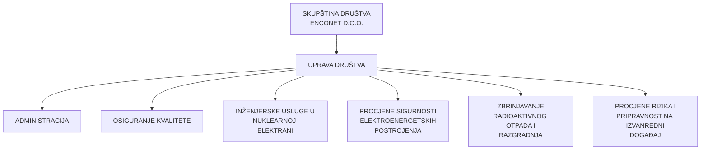
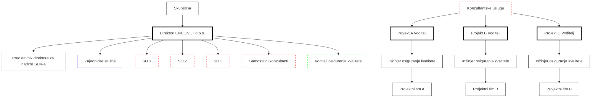

# PRIRUČNIK KVALITETE
## NORMA - ISO 9001:2015

| Identifikacijska oznaka dokumenta: | PK-SUK-001 |
|-----------------------------------|------------|
| Revizija broj:                     | 9          |
| Datum objavljivanja:               | 14.04.2023. |
| Kontrolirana kopija broj:          | 1          |

| Uloga | Ime i prezime | Funkcija | Datum |
|-------|---------------|----------|-------|
| Pripremio: | Vladimir Križe | voditelj QA | 03.04.2023. |
| Pregledala: | mr.sc. Ilijana Iveković | predstavnica direktora | 05.04.2023. |
| Odobrio: | Josip Vuković | direktor | 07.04.2023. |

### Periodični pregled

| Pregledao: | Datum: | Slijedeći pregled: |
|------------|--------|---------------------|
|            |        |                     |
|            |        |                     |
|            |        |                     |
---
# SADRŽAJ

1. UVOD............................................................................................................................. 5
   1.1 Usmjerenost na procesni pristup............................................................................... 5
   1.2 Osnovni podaci o organizaciji ................................................................................... 5
   1.3 Cilj ustrojstvo i upravljanje priručnikom ..................................................................... 6
2. REFERENCE ................................................................................................................. 7
3. NAZIVI, DEFINICIJE I SKRAĆENICE ............................................................................ 8
4. KONTEKST ORGANIZACIJE......................................................................................... 9
   4.1 Razumijevanje organizacije i njezinog konteksta ...................................................... 9
   4.2 Razumijevanje potreba i očekivanja zainteresiranih strana ......................................10
   4.3 Određivanje područja primjene sustava upravljanja kvalitetom ................................10
   4.4 Sustav upravljanja kvalitetom i njegovi procesi ........................................................11
5. VODSTVO.....................................................................................................................13
   5.1 Vodstvo i opredijeljenost ..........................................................................................13
      5.1.1 Općenito............................................................................................................13
      5.1.2 Usmjerenost na kupca.......................................................................................13
   5.2 Politika Kvalitete ......................................................................................................14
      5.2.1 Razvoj politike kvalitete .....................................................................................14
      5.2.2 Priopćavanje politike kvalitete ...........................................................................14
   5.3 Organizacijske uloge, odgovornosti i ovlaštenja.......................................................14
6. PLANIRANJE SUSTAVA KVALITETE...........................................................................16
   6.1 Mjere za rješavanje rizika i prilika ............................................................................16
   6.2 Ciljevi kvalitete i planiranje njihovog postizanja........................................................16
   6.3 Planiranje promjena.................................................................................................17
7. PODRŠKA.....................................................................................................................18
   7.1 Sredstva ..................................................................................................................18
      7.1.1 Općenito............................................................................................................18
      7.1.2 Ljudi ..................................................................................................................18
      7.1.3 Infrastruktura.....................................................................................................18
      7.1.4 Okruženje za rad procesa .................................................................................18
      7.1.5 Sredstva za praćenje i mjerenje ........................................................................19
      7.1.6 Organizacijsko znanje .......................................................................................19
   7.2 Sposobnost..............................................................................................................19
   7.3 Svjesnost .................................................................................................................19
   7.4 Komunikacija ...........................................................................................................20
   7.5 Dokumentirana informacija ......................................................................................21
      7.5.1 Općenito............................................................................................................21
      7.5.2 Stvaranje i ažuriranje.........................................................................................22
      7.5.3 Upravljanje dokumentiranim informacijama .......................................................23
8. PROVEDBA 24
       8.1 Operativno planiranje i nadzor 24
       8.2 Zahtjevi za proizvode i usluge 24
       8.2.1 Komunikacija s kupcem 24
       8.2.2 Određivanje zahtjeva koji se odnose na proizvode i usluge 24
       8.2.3 Preispitivanje zahtjeva koji se odnose na proizvode i usluge 25
       8.2.4 Promjena zahtjeva za proizvode i usluge 25
       8.3 Projektiranje i razvoj proizvoda i usluga 25
       8.3.1 Općenito 25
       8.3.2 Planiranje projektiranja i razvoja 25
       8.3.3 Ulazni podaci za projektiranje i razvoj 26
       8.3.4 Kontrola projektiranja i razvoja 26
       8.3.5 Izlazni podaci projektiranja i razvoja 27
       8.3.6 Promjene u projektiranju i razvoju 27
        8.4.1 Općenito 27
        8.4.2 Vrsta i opseg nadzora 28
        8.4.3 Informacije za vanjske pružatelje usluga 28
        8.5 Opskrba proizvodnje i usluga 28
        8.5.1 Nadzor opskrbe proizvodnje i usluga 28
        8.5.2 Utvrđivanje i sljedivost 29
        8.5.3 Imovina koja pripada kupcima i vanjskim pružateljima usluga 29
        8.5.4 Čuvanje proizvoda 29
        8.5.5 Aktivnosti poslije isporuke 29
        8.5.6 Nadzor nad promjenama 30
        8.6 Predaja proizvoda i usluge 30
        8.7 Nadzor nesukladnih izlaznih podataka 31
9. PROCJENA PROVEDBE 32
 9.1 Praćenje, mjerenje, analize i evaluacija 32
        9.1.1 Općenito 32
        9.1.2 Zadovoljstvo kupca 32
        9.1.3 Analiza i procjena 32
 9.2 Unutarnja prosudba 33
 9.3 Ocjena direktora 33
 9.3.1 Općenito 33
 9.3.2 Ulazni podaci za ocjenu sustava od strane direktora 34
 9.3.3 Rezultati ocjene sustava od strane direktora 34
 10. POBOLJŠAVANJE 35
 10.1 Općenito 35
 10.2    Nesukladnosti i popravna mjera ..............................................................................35
 10.3    Stalno poboljšavanje ..............................................................................................35
Dodatak A    Usporedba normi.............................................................................................37
Dodatak B    Organizacijska shema .....................................................................................40
Dodatak C    Funkcionalna shema .......................................................................................41
Dodatak D    Izjava o politici i ciljevima kvalitete...................................................................42
Dodatak E    Popis korisnika kontroliranih kopija priručnika .................................................43
Dodatak F    Popis programskih postupaka sustava kvalitete ..............................................44
Dodatak G    Popis radnih uputa ..........................................................................................45
Dodatak H    Odluka o imenovanju predstavnika direktora...................................................46
Dodatak I    Odluka o imenovanju voditelja QA...................................................................47
Dodatak J    Odluka o imenovanju odbora za kvalitetu ........................................................48


---
# 1. UVOD

## 1.1. Usmjerenost na procesni pristup

U izgradnji i provođenju sustava za upravljanje kvalitetom Enconet polazi od procesnog pristupa kako ga je definirala norma ISO 9001, a to je posebna pozornost na dvije teme:

- Usmjerenost na kupca
- Stalno unapređivanje SUK-a

To u praksi Enconeta znači da se uvijek nastoji potpuno razumjeti i ispuniti zahtjeve kupca. Njegovi zahtjevi su ulazni podaci za naše procese. Svaki naš proces definiramo s jasnim ulaznim podacima, rezultatima procesa te vezama i odgovornostima prema drugim procesima.

Prema potrebi i na odgovarajući način, rezultat svakog procesa i njegova učinkovitost mjeri se, provjerava i analizira. Posebno pratimo i vrednujemo želje i mišljenje kupca. To je osnova za neprekidno poboljšavanje procesa i sustava u cjelini te udovoljavanje zahtjevima kupca.

## 1.2. Osnovni podaci o organizaciji

### Naziv i registracija

Organizacija je osnovana kao društvo s ograničenom odgovornošću i registrirana kod Trgovačkog suda u Zagrebu, Republika Hrvatska. Matični broj je 3643921. Naziv organizacije je: ENCONET, d.o.o. poduzeće za poslove u energetici i ekologiji. Naziv djelatnosti je: Istraživanje i razvoj u prirodno tehničkoj i tehnološkoj znanosti. Sjedište organizacije je u Zagrebu - Miramarska 20.

### Znak i djelatnosti

```
ENCONET
```

Znak Enconeta predstavljen je grafičkim i tekstualnim prikazom. U grafičkom prikazu nalaze se tri oznake koje predočuju glavne djelatnosti. Na mrežastoj pravokutnoj podlozi sive boje, iscrtana je zakrivljena linija zelene boje i zakrivljena linija crvene boje. Desno od grafičkog prikaza istaknut je skraćeni naziv organizacije velikim štampanim slovima, a slovo "N" u nazivu "ENCONET" pomaknuto je prema gore u odnosu na ostala slova.

### Inženjerstvo i primjena računala

| Djelatnosti |
|-------------|
| Primjena računala u inženjerskim proračunima |
| Primjena računala za nadzor i vođenje procesa |
| Usluge pri izgradnji, remontu i modifikaciji postrojenja |
| Osiguravanje i kontrola kvalitete |


### Industrijske i energetske tehnologije

| Racionalno korištenje energije |
|--------------------------------|
| Gospodarenje energijom         |
| Optimizacija procesa           |
| Ocjena pouzdanosti postrojenja |

### Procjena rizika i zaštita okoliša

| Analize sigurnosti procesnih postrojenja |
|------------------------------------------|
| Analize rizika                           |
| Programski paketi za procjenu opasnosti  |
| Studije utjecaja na okoliš               |
| Strategija zaštite okoliša               |
| Izobrazba                                |

## 1.3. Cilj ustrojstvo i upravljanje priručnikom

### Cilj

Priručnik kvalitete Enconeta opisuje elemente sustava kvalitete prema zahtjevima norme ISO 9001, i ima višestruku namjenu. Služi kao:

- Krovni dokument Enconeta o primijenjenom SUK-u
- Pomoć Upravi za upravljanje organizacijom
- Dokument za predstavljanje Enconeta kupcima i pomoć kod nuđenja i ugovaranja poslova
- Uputa svim zaposlenicima Enconeta u provođenju postupaka koji utječu na kvalitetu
- Dokument za prosudbu SUK-a Enconeta od druge i treće strane

### Distribucija

Priručnik se dostavlja korisnicima kao:
- kontrolirana kopija ili
- nekontrolirana kopija

Za kontrolirane kopije, koje se koriste u svakodnevnom radu, vodi se Lista distribucije s imenom korisnika i brojem kopije. Listu distribucije vodi i održava voditelj QA a odobrava Direktor Enconeta. Svim korisnicima kontroliranih kopija Enconet je obavezan dostavljati sve izmjene i dopune Priručnika.

Nekontrolirane kopije Priručnika dostavljaju se isključivo u informativne i/ili promotivne svrhe.

### Revizije

Promjene sadržaja (teksta) u odnosu na prethodnu reviziju označavaju se vertikalnom crtom na desnoj margini.

Ostali elementi upravljanja Priručnikom kvalitete vrijede kao i za druge dokumente SUK-a, a propisani su u posebnoj proceduri PP-42-01 "Upravljanje dokumentima".


## 2. REFERENCE

1. HRN EN ISO 9000:2002; (ISO 9000:2000); (EN ISO 9000:2000)
   Sustavi upravljanja kvalitetom – Temeljna načela i rječnik

2. HRN EN ISO 9000-3:2002
   Smjernice za primjenu ISO 9001 za razvoj, opskrbu, instalaciju i održavanje
   računalne programske podrške

3. HRN EN ISO 9001:2015
   Sustavi upravljanja kvalitetom – Zahtjevi

4. HRN EN ISO 9004:2003; (ISO 9004:2000); (EN ISO 9004:2000)
   Sustavi upravljanja kvalitetom – Upute za poboljšavanje sposobnosti

5. ISO 10005:1995
   Quality management-Guidelines for quality plans

6. HRN EN ISO 10013:1998; (ISO 10013:1995)
   Smjernice za izradu priručnika za kakvoću

7. ISO 19011:2002
   Guidelines for quality and/or environmental management system auditing

8. 10CFR50 Dodatak B (Savezni državni zakon SAD:1997)
   Kriteriji osiguravanja kvalitete za nuklearne elektrane i postrojenja za preradu
   nuklearnog goriva

9. IAEA Leadership and Management for Safety, IAEA Safety Standards Series No.
   GSR Part 2, IAEA Vienna, 2016.

### 3. NAZIVI, DEFINICIJE I SKRAĆENICE

#### Nazivi i definicije

U okviru ovog Priručnika kvalitete vrijede nazivi i definicije prema međunarodnoj normi ISO 9000 (Sustavi upravljanja kvalitetom – Temeljna načela i rječnik). Prema novoj reviziji norme ISO 9001 nazivi: dobavljač, organizacija i kupac imaju sljedeći odnos:

```
dobavljač → organizacija → kupac
               ↓
            Enconet
```

Naziv "proizvod" u ovom Priručniku podrazumijeva ravnopravno svaku vrstu proizvoda i usluge.

#### Skraćenice

| Skraćenica | Značenje |
|------------|----------|
| Enconet    | Enconet d.o.o. |
| Priručnik  | Priručnik sustava kvalitete Enconeta |
| HRN        | Hrvatska norma |
| ISO        | Međunarodna organizacija za normizaciju |
| SUK        | Sustav upravljanja kvalitetom |
| KFP        | Komercijalno-financijski poslovi |
| EN         | Europska norma |
| QA         | Osiguravanje kvalitete |
| PK         | Priručnik kvalitete |
| PP         | Programski postupak |
| RU         | Radna uputa |


# 4. KONTEKST ORGANIZACIJE

## 4.1. Razumijevanje organizacije i njezinog konteksta

Odluka o uvođenju i primjeni sustava upravljanja kvalitetom u skladu sa zahtjevima međunarodne norme ISO 9001:2015 dio je ukupne poslovne politike Enconet, d.o.o. (u daljnjem tekstu: Enconet) te predstavlja iskaz trajnog strateškog opredjeljenja direktora.

Međunarodna norma ISO 9001:2015 postavlja zahtjeve na sustav upravljanja kvalitetom (u daljnjem tekstu: SUK), a usvajanjem tih zahtjeva Enconet želi dokazati da je sposoban:

- Osigurati da njegovi proizvodi i usluge zadovoljavaju zahtjeve kupca i zahtjeve primjenjivih propisa.
- Ostvariti zadovoljstvo kupca djelotvornom primjenom i stalnim poboljšavanjem SUK-a.

SUK, opisan ovim Priručnikom te pripadajućim Postupcima i Radnim uputama, u potpunosti je usuglašen sa zahtjevima međunarodne norme ISO 9001:2015, ali je istovremeno i prilagođen specifičnim potrebama Enconeta.

Pristup upravljanju sustavom kvalitete utemeljen je na PDCA petlji (Plan-Do-Check-Act), što je princip na kojemu se zasniva planiranje, primjena, kontrola i stalno poboljšavanje kako procesa realizacije proizvoda tako i ostalih procesa SUK-a.

Glavna područja djelatnosti ENCONET-a su konzalting i inženjering u područjima:

- primjene industrijskih i energetskih tehnologija,
- nuklearne tehnologije,
- procjene i upravljanja tehnološkim rizicima

Kontekst organizacije podrazumijeva praćenje i preispitivanje svih vanjskih i unutarnjih elemenata koji mogu imati utjecaj na ostvarivanje ciljeva Enconeta.

Elementi vanjskog konteksta organizacije Enconeta su:

- kupci i korisnici usluga
- suradničke firme
- dobavljači usluga i opreme
- tržište i ekonomska kretanja
- konkurentne organizacije
- zakonski i regulatorni zahtjevi
- politička usmjerenja razvoja ekonomije

Elementi unutarnjeg konteksta organizacije Enconeta su:

- stečeno znanje i iskustvo
- kvalitetni proizvodi i usluge
- tržišna i poslovna uspješnost
- visoko obrazovano i stručno osoblje
- definirane ovlasti i odgovornosti unutar organizacije
- suvremena informatička oprema, software i hardware
- stabilan i pouzdan poslovni prostor
- dugoročna i stabilna suradnja s NE Krško

## 4.2. Razumijevanje potreba i očekivanja zainteresiranih strana

Enconet ulaže maksimalne napore da kupcu pruži kvalitetne usluge koji zadovoljavaju sve postavljene regulatorne zahtjeve, i posvećen je kontinuiranom praćenju, kontroli i analizi svih relevantnih informacija da bi osigurao sve postavljene zahtjeve i efektivno primijenio zahtjeve programa kvalitete.

Zainteresirane strane bitne za sustav upravljanja kvalitetom:

- Enconet
- kupci i korisnici usluga  
- zakonodavni i regulatorni organi
- svi zaposlenici
- dobavljači
- osiguravajuća društva
- druge firme s kojima Enconet surađuje

Zahtjevi zainteresiranih strana bitni za sustav upravljanja kvalitetom određuju se na više različitih načina:

- specificiranje zahtjeva tijekom ugovornog procesa (zahtjev za ponudu, ponuda, ugovor)
- analiza podataka o zadovoljstvu kupca
- praćenje razvoja i izmjena regulative
- ocjenjivanje i komunikacija s dobavljačima  
- kontinuirana izobrazba zaposlenika
- komunikacija s kupcima

## 4.3. Određivanje područja primjene sustava upravljanja kvalitetom

### Područje primjene

Ovaj Priručnik kvalitete po međunarodnoj normi ISO 9001, kao krovni dokument SUK-a, primjenjuje se na sve djelatnosti Enconeta.

Za djelatnosti koje se odnose na sigurnost i/ili kvalitetu nuklearnih objekata, sustava, komponenti i dijelova, Enconet osim ovog Priručnika, primjenjuje Nuklearni QA Plan, koji odgovara na 18 zahtjeva kvalitete po Američkom zakonu 10CFR50 Dodatak B, odnosno na sve postavljene zahtjeve kvalitete Međunarodne agencije za atomsku energiju koje proizlaze iz regulative IAEA Leadership and Management for Safety, IAEA Safety Standards Series No. GSR Part 2, IAEA Vienna, 2016. Za ove djelatnosti, Nuklearni QA Plan je krovni dokument istog značaja kao i Priručnik po normi ISO 9001:2015.

### Priručnik kvalitete

Kao krovni dokument SUK-a, Enconet uspostavlja ovaj Priručnik kvalitete. Priručnik se temelji na međunarodnoj normi ISO 9001:2015 i u njemu su opisani: politika i ciljevi kvalitete, organizacijska struktura, odgovornosti, način provođenja svih zahtjeva norme, te mjere za dokumentiranje i nadzor sustava.

Pored navedenog, Priručnik definira:

- Cilj, ustrojstvo i upravljanje Priručnikom
- Područje primjene sustava kvalitete
- Popis Programskih Postupaka
- Popis Radnih uputa
- Opise međuveza pojedinih procesa sustava

Pregled Priručnika radi eventualnih izmjena i dopuna provodi Odbor (Tim) za kvalitetu prema ukazanoj potrebi. Za pripremu i izmjene Priručnika odgovoran je Voditelj QA.

## 4.4. Sustav upravljanja kvalitetom i njegovi procesi

Sustav upravljanja kvalitete Enconeta, usklađen sa zahtjevima međunarodne norme ISO 9001:2015, obuhvaća organizaciju, ovlaštenja i odgovornosti, procese, postupke i resurse koji u međusobnom i zajedničkom djelovanju osiguravaju ostvarivanje utvrđene politike i ciljeva kvalitete, odnosno zadovoljenje zahtjeva i očekivanja kupca.

Osnovni cilj primjene sustava upravljanja kvalitetom je prenošenje politike Enconeta na sve zaposlene, postizanje ciljeva koji proizlaze iz politike i jedinstveno izvođenje procesa. Svi procesi u Enconetu podijeljeni su u slijedeće tri grupe:

1. Osnovni procesi koji bitno utječu na kvalitetu proizvoda
   - Proces marketinga, ugovaranja i prodaje (Praćenje i analiza tržišta, zahtjeva i zadovoljstva kupaca; Zahtjev za ponudu/Upit-Ponuda-Ugovor/Narudžba; ugovaranje dodjele dijela ugovorenog projekta Enconeta trećoj strani – outsourcing)
   - Proces projektiranja i razvoja (Projekti, studije, elaborati, analize, računalna programska podrška (software), konzalting i druge inženjerske usluge, nadzor i kontrola projekta ugovorenog po sistemu outsourcing)
   - Proces nabave i ocjenjivanje dobavljača (Podaci za nabavu, vrednovanje dobavljača, nabavljanje, prijemna kontrola, reklamacije, detaljni auditi dobavljača potencijalnih u sistemu outsourcing)

2. Pomoćni procesi
   To su svi ostali procesi koji su podrška za uspješno odvijanje osnovnih procesa u cilju zadovoljenja kupčevih zahtjeva i zahtjeva norme ISO 9001:2015.

3. Procesi upravljanja sustavom kvalitete
   - Upravljanje dokumentacijom
   - Upravljanje zapisima
   - Ocjena sustava od strane direktora
   - Izobrazba i razvoj osoblja
   - Procesi komunikacije
   - Unutrašnja neovisna ocjena (Interni audit)
   - Nadzor nad nesukladnostima
   - Popravne i preventivne radnje

Direktor Enconeta će osigurati da u odgovarajućim procedurama i dokumentima svi procesi, kao i cijeli sustav kvalitete, budu opisani, dokumentirani i primjenjivani, da se odvijaju po odgovarajućem slijedu i međusobnim vezama te da budu osigurani svi potrebni resursi i
metode za njihovu djelotvornu realizaciju. Posebno će se utvrditi i provoditi postupci i metode nadzora, mjerenja i analiza u svrhu stalnog poboljšavanja tih procesa.

Ako provođenje nekog procesa koji utječe na sukladnost proizvoda prepusti nekom drugom, Enconet će, sukladno ovom sustavu kvalitete, odrediti metode i načine upravljanja tim procesom.


# 5. VODSTVO

## 5.1. Vodstvo i opredijeljenost

### 5.1.1. Općenito

Strateško opredjeljenje i cilj Enconeta je da se postigne potpuno zadovoljstvo kupaca što znači da se isporučuje proizvod i usluga s ugovorenim zahtjevima i kvalitetom, u traženim rokovima i u skladu sa zahtjevima norme.

Da bi ostvarila prihvaćeno opredjeljenje i ciljeve direktor je obavezan da:

- Uspostavi djelotvoran i dokumentiran SUK
- Osigura provođenje i stalno poboljšavanje SUK-a
- Odredi nositelje odgovornosti za SUK
- Osoblju prenese važnost zadovoljavanja zahtjeva kupca i zahtjeva primjenjivih zakona i normi
- Definira politiku i ciljeve kvalitete
- Osigura razumijevanje i realizaciju planirane politike i ciljeva kvalitete na svim nivoima organizacijske strukture
- Osigura potrebne organizacijske, tehničke i ljudske resurse
- Provodi pregled SUK-a (ocjena direktora)

### 5.1.2. Usmjerenost na kupca

Uspjeh Enconeta ovisi o prepoznavanju i zadovoljavanju potreba kupca što se osigurava kroz dokumentirane procedure određivanja zahtjeva koji se odnose na proizvod. Kroz aktivnosti definirane u postupku PP-72-01 "Proces marketinga, ugovaranja i prodaje", direktor mora osigurati da zahtjevi kupca budu:

- Utvrđeni
- Ispunjeni u cilju povećanja njegovog zadovoljstva

Osim zahtjeva kupca, Enconet će utvrditi i ostale zahtjeve koji se odnose na proizvod i ocijeniti ih prije preuzimanja obaveze za isporuku. Nakon prihvaćanja zahtjeva kupca, Enconet će provoditi propisane metode praćenja i mjerenja pojedinih procesa u cilju ispunjenja tih zahtjeva.

Stalnim nadzorom direktor prati zadovoljstvo kupca kroz marketinške i istraživačke aktivnosti, obrade reklamacija, upitnike i druge metode.

Direktor posebnu pažnju usmjeruje provjeri i nadzoru kvalitete prema onim suradnicima i organizacijama s kojima Enconet uspostavlja blisku suradnju na principu ugovaranja – dodjele (outsourcing) dijela ili cijelog već ugovorenog projekta Enconeta.


## 5.2. Politika Kvalitete

### 5.2.1. Razvoj politike kvalitete

Politika kvalitete u funkciji je postizanja planiranih ciljeva. Da bi se ostvarili zacrtani ciljevi direktor osigurava da politika kvalitete:

- Bude odgovarajuća prema svrsi i potrebama Enconeta
- Uključuje obavezu zadovoljavanja zahtjeva i stalnog unapređenja djelotvornosti SUK-a
- Osigurava resurse i uvjete za uspostavljanje i pregledavanje (ocjenjivanje) ciljeva kvalitete
- Bude poznata i razumljiva
- Bude ocjenjivana u cilju trajne primjerenosti

Politika kvalitete dana je u «Izjavi o politici i ciljevima kvalitete».

### 5.2.2. Priopćavanje politike kvalitete

Politika kvalitete je uspostavljena i kontinuirano primjenjivana. Svi zaposlenici su kroz proces edukacije i internih audita upoznati sa važnosti primjene programa kvalitete i dužni su primjenjivati zahtjeve programa kvalitete u svom opsegu dužnosti u skladu sa zahtjevima kupca.

## 5.3. Organizacijske uloge, odgovornosti i ovlaštenja

### Odgovornosti i ovlaštenja

Direktor Enconeta ima izvršnu funkciju te poduzima sve potrebne mjere da se ostvari strateški cilj poduzeća, snabdijevanje kupaca kvalitetnim proizvodima i uslugama u skladu s ugovorenim zahtjevima, unutar predviđenih rokova i prihvaćenih cijena.

U cilju ostvarenja navedenih opredjeljenja direktor je odgovoran da:

- Uspostavi djelotvoran sustav upravljanja kvalitetom
- Definira politiku i ciljeve kvalitete
- Osigura razumijevanje i realizaciju planirane politike i ciljeva kvalitete na svim nivoima organizacijske strukture
- Definira odgovornosti i metode komuniciranja u cilju djelotvorne provedbe SUK-a
- Osigura razvoj i stalno poboljšavanje SUK-a
- Osigura organizacijske, ljudske i tehničke resurse

Pojedine funkcije Enconeta sa odgovarajućim poslovima i odgovornostima te njihove međusobne veze i odnosi definirani su i prikazani u organizacijskoj i funkcionalnoj shemi.

Konkretne odgovornosti i ovlaštenja za sve funkcije i nositelje realizacije SUK-a date su u pojedinim procedurama koje opisuju procese sustava i zahtjeve kvalitete.


# Predstavnik direktora za nadzor SUK-a

Direktor Enconeta imenuje Predstavnika dir. za nadzor SUK-a, koji neovisno o ostalim poslovima i odgovornostima, ima ovlaštenja i odgovornosti da:

- Osigura da su procesi, nužni za SUK, uspostavljeni, primijenjeni i održavani

- Obavještava direktora o djelovanju i potrebi poboljšavanja SUK-a

- Promiče svijest kod svih djelatnika da je ispunjavanje zahtjeva kupca strateški cilj i interes Enconeta

- Surađuje s vanjskim organizacijama u području SUK-a


# 6. PLANIRANJE SUSTAVA KVALITETE

## 6.1. Mjere za rješavanje rizika i prilika

### Planiranje sustava upravljanja kvalitetom

Kod planiranja sustava upravljanja kvalitetom direktor mora osigurati da su uključeni:

- zahtjevi sustava
- ostvarivanje ciljeva kvalitete
- da se promjene sustava planiraju i provode a cjelovitost sustava mora biti održana.

Planiranje sustava upravljanja kvalitetom Enconeta temelji se na strateškim odrednicama poslovanja Enconeta i utvrđenoj politici i ciljevima kvalitete. Konkretni planovi mogu se, prema potrebi, raditi:

- prema razini organizacije (Enconet, pojedini organizacijski nivo i sl.)
- prema vremenskom periodu (godišnji, kvartalni, mjesečni i sl.)
- za pojedinu funkciju/djelatnost (projektiranje, KFP, QA i sl.).

Sadržaj pojedinačnog plana ovisi o funkciji i karakteru aktivnosti koje se planiraju kao što su: poslovne aktivnosti (projekti), troškovi poslovanja, troškovi kvalitete (nekvalitete, škarta), potrebni resursi (osoblje, infrastruktura, radno okružje), investicije i održavanje, izobrazba i osposobljavanje, interni auditi i t.d.

Izmjene SUK-a planiraju se i izvode tako da se osigura njegova cjelovitost i integritet za što ovlaštenja i odgovornost ima predstavnik dir. za nadzor SUK-a.

### Preventivne radnje

Enconet mora utvrditi i poduzeti primjerene i potrebne radnje za uklanjanje uzroka mogućih (potencijalnih) nesukladnosti i sprečavanje njihova pojavljivanja. U tu svrhu uspostaviti će se i održavati dokumentirani postupak PP-85-01 "Popravne i preventivne radnje" za:

- Identifikaciju mogućih (potencijalnih) nesukladnosti i njihovih uzroka
- Ocjenjivanje potrebe za akcijom kako bi se spriječilo pojavljivanje nesukladnosti
- Utvrđivanje i osiguravanje primjene potrebnih radnja
- Pregledavanje i ocjenjivanje provedenih preventivnih radnji

Preventivne radnje planiraju se minimalno na osnovu ocjene sustava kvalitete od strane direktora.

Preventivne radnje odobrava direktor Enconeta.

## 6.2. Ciljevi kvalitete i planiranje njihovog postizanja

### Ciljevi kvalitete

Enconet planira i utvrđuje ciljeve kvalitete koji proizlaze iz:

- zahtjeva kupaca
- zahtjeva norme
- konkurentskog okruženja
- vlastitih potreba

Strateški i dugoročni ciljevi kvalitete Enconeta dati su «Izjavi o politici i ciljevima kvalitete».

Pobliže ciljeve kvalitete utvrđuje direktor za svaku razinu organizacije i funkciju. Pri tome je važno da u realizaciju ciljeva budu uključeni svi koji su potrebni za udovoljavanje zahtjeva na proizvod. Direktor posebno vodi računa da su ciljevi kvalitete u duhu politike kvalitete te jasni i u najvećoj mogućoj mjeri mjerljivi.

Direktor definira tko prati izvršenje pojedinih ciljeva. Ovisno o mjerljivosti, odgovorno osoblje prati, mjeri i analizira izvršenje postavljenih ciljeva. (Stručne analize i izvješća voditelja projekata, izvješća Odbora za kvalitetu, izvješća voditelja QA i sl.).

Direktor na kraju godine, na osnovu svih analiza i izvješća donosi ocjenu sustava te utvrđuje ciljeve kvalitete za iduću godinu.

## 6.3. Planiranje promjena

Sve potrebne promjene sustava upravljanja kvalitetom detaljno se analiziraju i planiraju.

Analiziraju se:

- Svrha promjene kao i posljedice
- Utjecaj na cjelovitost sustava upravljanja kvalitetom
- Raspodjela odgovornosti i ovlaštenja
- Raspoloživost sredstava za realizaciju promjena

# 7. PODRŠKA

## 7.1. Sredstva

### 7.1.1. Općenito

Direktor Enconeta mora definirati i pribaviti sve potrebne resurse kako bi osigurala:

- Primjenu, održavanje i stalno poboljšavanje djelotvornosti SUK-a
- Povećanje zadovoljstva kupca udovoljavajući njegovim zahtjevima.

Potrebni resursi su ljudski resursi, infrastruktura i radno okružje.

### 7.1.2. Ljudi

Zaposlenici Enconeta imaju potrebno obrazovanje i kompetentni su zadovoljavati postavljene uvjete kupca tijekom pružanja svojih usluga.

Djelatnici se dodatno kontinuirano osposobljavaju na domaćim i međunarodnim seminarima, radionicama i tečajevima. Zapisi o izobrazbi se arhiviraju u formi potvrda i certifikata.

### 7.1.3. Infrastruktura

U svrhu postizanja zahtjeva na proizvod, direktor Enconeta mora definirati, osigurati i održavati potrebnu infrastrukturu koja, po potrebi, uključuje:

- Nekretnine (građevine, zgrade), radni prostor i odgovarajuću opremu
- Procesnu opremu (hardware i software)
- Opće usluge (prijevoz, komunikacije i sl.)

### 7.1.4. Okruženje za rad procesa

Enconet mora definirati, osigurati i upravljati radnim okružjem kako bi se osigurala tražena sukladnost proizvoda sa zahtjevima te postigla odgovarajuća motivacija zaposlenih. Pri tome direktor posebno mora voditi računa o ispunjenju svih zahtjeva definiranih zakonskim propisima (zaštita na radu, zahtjevi za siguran rad i sl.).

Radno okružje za administrativno izvođenje projekata je uglavnom definirano radnim prostorijama firme Enconet. Za svaki izlazak na teren u smislu sakupljanja informacija i podataka, radno okružje definira se u tehničkim specifikacijama projekta u kojima su navedeni i radni uvjeti i zaštita na radu projektanta.

Djelatnici Enconeta na kontinuiranim uslugama u NE Krško, imaju definirano i regulirano radno okružje u skladu sa zahtjevima i regulativom NE Krško, kao i svi ostali zaposlenici, trajno zaposleni, podizvođači na kontinuiranom radu, podizvođači na određeno vrijeme.


### 7.1.5. Sredstva za praćenje i mjerenje

Povremeno, kada se pojavi potreba za korištenjem specijalizirane mjerne opreme, Enconet koristi usluge od kvalificiranih i ovlaštenih institucija. Postupak, kojim se osigurava ovaj zahtjev norme, opisan je u proceduri PP-74-01 «Proces nabave i ocjenjivanja dobavljača».

Kada se ukaže potreba, odnosno svrsishodnost za vlastito posjedovanje nadzorne i mjerne opreme, Enconet će definirati i dokumentirati način njezinog upravljanja, sukladno ovom zahtjevu norme.

Mjerna i testna oprema nabavlja se prvenstveno na zahtjev kupca. Zahtjevi su specificirani u ponudi i tehničkim specifikacijama projekta. Enconet će nabaviti traženu opremu i koristiti je u skladu s postupkom RU-82-05, «Program nadzora mjerne i testne opreme», koja specificira i određuje način označavanja, korištenja, kalibracije, održavanja i čuvanja mjerne i testne opreme.

### 7.1.6. Organizacijsko znanje

Zaposlenici Enconeta posjeduju sva znanja potrebna za izvršavanje svojih zadataka i postizanje sukladnosti proizvoda i usluga. Znanja su definirana u potrebnom opsegu, održavana do zahtijevanog nivoa i raspoloživa unutar određenih postupaka.

U slučaju potrebnih promjena i trendova Enconet je spreman analizirati nove potrebe i organizirati stjecanje novih potrebnih znanja.

### 7.2. Sposobnost

#### Općenito

Enconet će osigurati da osoblje koje obavlja poslove koji utječu na kvalitetu proizvoda bude kompetentno na temelju odgovarajućeg obrazovanja, izobrazbe, vještina i iskustva.

### 7.3. Svjesnost

#### Osposobljenost/kompetentnost, svijest i izobrazba

Za osoblje koje obavlja poslove koji utječu na kvalitetu proizvoda Enconet mora:

- Definirati potrebnu osposobljenost/kompetentnost
- Osigurati izobrazbu i/ili poduzimati druge radnje za zadovoljavanje i postizanje potrebnih kompetencija
- Ocjenjivati učinkovitost poduzetih radnji
- Osigurati da su zaposlenici svjesni važnosti i značaja svoga rada na kvalitetu proizvoda
- Osigurati odgovarajuće zapise o edukaciji, treningu, potrebnim vještinama i radnom iskustvu


Kako bi ispunio navedene zahtjeve i potrebe Enconet će utvrđivati i provoditi Godišnje planove izobrazbe. Potrebe za izobrazbom prijavljuju svi direktori/voditelji odjela za svoje suradnike. Godišnji plan izobrazbe odobrava direktor Enconeta. Plan izobrazbe mora obuhvatiti:

- Opće zahtjeve za rad (sigurnost na radu, zaštita od požara i dr.)
- Odgovarajuće stručne teme
- Teme koje se odnose na Sustav kvalitete
- Promjene u radnom okruženju i rizici povezani s radnim okruženjem

Odgovornosti i aktivnosti na području izobrazbe opisani su u postupku PP-62-01 «Izobrazba i uvježbavanje osoblja».

Ovisno o vrsti i sadržaju, izobrazba se može provoditi u vanjskim ovlaštenim institucijama (tečajevi za sigurnost na radu i zaštitu od požara, razni specijalistički seminari za stručne teme te osposobljavanje internih auditora, i druge teme iz područja Sustava kvalitete). Enconet može povremeno organizirati i provoditi interna osposobljavanja svojih zaposlenika radi stjecanja potrebnih dodatnih specijalističkih znanja i vještina.

Kod uključivanja novih ili angažiranja vanjskih suradnika Enconet će, kroz navedene mjere, osigurati da oni budu osposobljeni/kompetentni za obavljanje poslova koji utječu na kvalitetu proizvoda.

## 7.4. Komunikacija

### Unutrašnja komunikacija

U skladu s definiranim funkcijama i njihovim međusobnim vezama direktor definira i odgovarajuće procese komuniciranja te primjerene metode i načine obavješćivanja o djelotvornosti SUK-a. To je definirano kroz:

- Funkcionalnu shemu
- Procedure i Radne upute
- Slijed zapisa kvalitete

Predstavnik direktora za nadzor SUK-a odgovoran je za nadzor i praćenje stanja internih komunikacija te za prepoznavanje mogućnosti poboljšanja i njihovog predlaganja direktoru.

U cilju operativnog praćenja i upravljanja sustavom kvalitete direktor Enconeta imenuje Odbor (Tim) za kvalitetu u koji ulaze:

- Predstavnik direktora za nadzor SUK-a
- Voditelj KFP
- Voditelj QA

Odbor za kvalitetu Enconeta, prema potrebi, pregledava i ocjenjuje provođenje SUK-a, te o svojim nalazima i prijedlozima poboljšanja izvještava direktora Enconeta.

Za izvješćivanje o radu i rezultatima rada Odbora odgovoran je Predstavnik direktora za nadzor SUK-a, a sve operativne i administrativne poslove Odbora za kvalitetu obavlja voditelj QA.

Voditelji projekata/poslova odgovorni su da se mjere sustava kvalitete razumiju i provode od strane svih zaposlenika. U tom smislu, oni su odgovorni za pravodobno i potpuno informiranje te planiranje odgovarajuće izobrazbe.

Unutrašnja komunikacija se provodi na nekoliko načina:
- razmjena informacija preko poslovne elektroničke mreže, koja je dostupna svim
  zaposlenima i koja omogućava pravovremene informacije o svim važnim pitanjima
  vezanim za izvođenje projekata, upravljanje kvalitetom i utjecaj na okoliš

- kratki informativni sastanci, planirani po potrebi

- godišnji sastanak radi donošenja ocjene sustava upravljanja kvalitetom

Ostala interna komunikacija (planovi, obavijesti, odluke i sl.) provodi se izravnim
obavješćivanjem zaposlenika usmenim putem, putem informativnih sastanaka, putem e-
maila ili distribucijom odgovarajućih pisanih materijala.

Vanjska komunikacija

Svrha vanjskog komuniciranja je:

- ispunjavanje zakonskih obaveza prema nadležnim tijelima o utjecaju tvrtke na okoliš,
  o mjerama prevencije i otklanjanju eventualnih štetnih posljedica

- upoznavanje zainteresiranih strana o poduzetim mjerama zaštite okoliša i provedbi
  mjera zaštite na radu

- komunikacija s kupcem tijekom sklapanja ugovora, izvođenja projekta, primopredaje
  dokumentacije, završenog projekta i izvještaja

Komuniciranje se provodi:

- izvještavanjem u pisanoj formi

- neposrednim komuniciranjem ovlaštenih osoba Enconeta s predstavnicima nadležnih
  upravnih i nadzornih službi

- sudjelovanjem predstavnika Enconeta na stručnim skupovima, seminarima i
  radionicama

- usmeno i elektronsko komuniciranje sa zainteresiranim stranama (telefon, telefaks,
  elektronska pošta, pošta)

- komuniciranjem ovlaštenih predstavnika Enconeta s predstavnicima javnog
  komuniciranja

Osnovno načelo vanjskog komuniciranja je iznošenje istinitih, provjerljivih i transparentnih
informacija od strane ovlaštenih osoba Enconeta. Za vanjsko komuniciranje prema
informativnim medijima ovlašten je direktor Enconeta. Utjecaj na okoliš firma ne izvješćuje
direktno nego u sklopu izvještavanja korisnika usluga, a naročito na području nuklearne
energetike.

## 7.5. Dokumentirana informacija

### 7.5.1. Općenito

Dokumentacija SUK-a u Enconetu hijerarhijski je svrstana u slijedeće razine:

1. Priručnik kvalitete i Nuklearni QA Plan su dokumenti najviše hijerarhijske razine
   (krovni dokumenti) koji definiraju opći pristup, politiku, zahtjeve i odgovornosti te
   opisuju sustav upravljanja kvalitetom u Enconetu.


2. Procedure sustava kvalitete su temeljni dokumenti koji omogućavaju planiranje i upravljanje prepoznatljivim cjelinama aktivnosti sustava kvalitete. Odgovaraju na pitanje: TKO, ŠTO, GDJE, KADA, KAKO (načelno-prema potrebi), i TKO JE ODGOVORAN. One opisuju:

   - Odgovornosti, ovlaštenja i komunikaciju osoba koje vode, obavljaju, verificiraju ili nadziru aktivnosti
   - Slijed aktivnosti
   - Korištenje potrebnih dokumentacijskih podloga i obrazaca
   - Nadzorne aktivnosti koje se trebaju primijeniti

   Razina detalja u procedurama omogućava upravljanje tako utvrđenim aktivnostima, ne ulazeći u stručne i tehničke podrobnosti provedbe koje se, kada je potrebno, utvrđuju putem Radnih uputa.

3. Radne upute su dokumenti koji opisuju način i metodu odvijanja pojedinih aktivnosti u poslovnom procesu. Za razliku od procedura, radne upute detaljno opisuju pojedine složene aktivnosti, ulazeći u tehničke detalje, u tom procesu. Sadrže slijed i način provedbe operacija, spisak potrebnih materijalnih resursa, potrebnu dokumentaciju te potrebne elemente nadzora. Koriste se za standardiziranje poslova u pojedinoj organizacijskoj jedinici i stoga su lokalnog karaktera jer se samo izuzetno koriste u više organizacijskih jedinica. Mogu biti u različitom obliku kao:

   - Pisane upute
   - Obrasci
   - Dijagrami toka
   - Formule za proračun
   - Tabele
   - Grafikoni, i slično

4. Zapisi kvalitete su dokumenti koji sadrže i pokazuju rezultate funkcioniranja SUK-a. Osim navedene dokumentacije SUK-a, u Enconetu se još pojavljuju i koriste:

- Odgovarajući dokumenti za odvijanje poslovnih procesa
- Nacionalne i međunarodne norme
- Zakoni i propisi Republike Hrvatske
- Dokumenti koje dostavi kupac

## 7.5.2. Stvaranje i ažuriranje

### Upravljanje dokumentima

Dokumentiranim postupkom za upravljanje dokumentima Enconet detaljno propisuje postupke i odgovornosti kako bi osigurao da su:

- Dokumenti odobreni prije upotrebe
- Dokumenti pregledavani i revidirani po potrebi te ponovno odobreni
- Definirane izmjene i trenutni status revizije dokumenta
- Zadnje revizije dokumenta dostupne na mjestu upotrebe
- Dokumenti nedvosmisleno označeni i čitljivi
- Dokumenti odgovarajuće čuvani i nadzirani
- Dokumenti vanjskog porijekla identificirani i nadzirani
- Spriječene mogućnosti upotrebe nevažećih dokumenata

Način upravljanja dokumentima SUK-a opisan je u postupku PP-42-01 «Upravljanje dokumentima».

Dokumenti mogu biti na bilo kojem nosaču zapisa, na pr. na papiru ili na elektronskom mediju.

## 7.5.3. Upravljanje dokumentiranim informacijama

### Upravljanje zapisima

Zapisi kvalitete kao rezultat izvođenja procedura i radnih uputa predstavljaju objektivni dokaz provedenosti određene aktivnosti i njene sukladnosti s traženim zahtjevima. Drugim riječima zapisi kvalitete na dokumentiran način uspostavljaju vezu između utvrđenih kriterija i njihove realizacije.

Zapisi kvalitete moraju se održavati kao dokazi o podudaranju SUK-a sa zahtjevima norme ISO 9001:2015, kao dokazi da se proizvodi, usluge i dokumenti podudaraju s ugovornim i drugim zahtjevima, kao dokazi o kvalifikaciji osoba, procesa i opreme, kao dokazi o provedbi korektivnih i preventivnih radnji i.t.d.

Način upravljanja zapisima kvalitete opisan je u Postupku PP-42-02 "Upravljanje zapisima" kojim je definirano i osigurano:

- Identifikacija zapisa
- Pretraživanje i pronalaženje
- Vrijeme čuvanja
- Pohrana, zaštita i način uklanjanja

Propisano je da svaki zapis sadrži slijedeće podatke:

- Identifikacijsku oznaku zapisa
- Identifikaciju proizvoda ili aktivnosti na koje se zapis odnosi
- Datum zapisa
- Identifikaciju osobe koja je izradila i/ili verificirala zapis


# 8. PROVEDBA

## 8.1. Operativno planiranje i nadzor

Enconet će planirati i razvijati procese i aktivnosti za realizaciju proizvoda u skladu sa zahtjevima sustava upravljanja kvalitetom. Pritom će za svaki proizvod, kada je to primjereno, na odgovarajući način utvrditi:

- Ciljeve kvalitete i zahtjeve za konkretni proizvod
- Potrebu za uspostavljanjem procesa (po fazama), dokumenata i osiguravanje resursa specifičnih za taj proizvod
- Radnje i aktivnosti za verifikaciju, validaciju, nadzor, inspekciju i ispitivanje koje su svojstvene tom proizvodu te kriterije za prihvaćanje proizvoda

Osnovni proizvodi Enconeta su projekti, studije, elaborati, analize, računalna programska podrška (software), te konzalting i druge inženjerske usluge. Voditelj posla će, za svaki takav pojedinačni proizvod predvidjeti i utvrditi Plan realizacije projekta s gore navedenim elementima. Taj Plan treba biti u obimu i obliku koji je primjeren svakom takvom proizvodu/projektu.

Detaljniji postupak planiranja realizacije proizvoda odnosno projekta opisan je u posebnoj proceduri PP-73-01 "Proces projektiranja i razvoja".

## 8.2. Zahtjevi za proizvode i usluge

### 8.2.1. Komunikacija s kupcem

Ovisno o obimu i karakteru proizvoda, Enconet utvrđuje i provodi različite postupke i metode komuniciranja s kupcem kako bi osigurao:

- Potrebne informacije o proizvodu
- Rukovanje upitima, ugovorima ili narudžbama i njihovim dopunama
- Povratne informacije od kupca uključujući i njegove reklamacije

Učesnici te postupci i metode komuniciranja s kupcem definirani su u postupku PP-72-01 «Proces marketinga, ugovaranja i prodaje».

### 8.2.2. Određivanje zahtjeva koji se odnose na proizvode i usluge

Enconet mora utvrditi zahtjeve za proizvod uključujući:

- Zahtjeve koje specificira kupac uključujući zahtjeve za isporuku i radnje poslije isporuke
- Zahtjeve koje kupac nije specificirao a neophodni su zbog upotrebe proizvoda kada je ona poznata
- Zahtjeve zakona i propisa koji se odnose na proizvod
- Sve ostale zahtjeve koje utvrdi Enconet


### 8.2.3. Preispitivanje zahtjeva koji se odnose na proizvode i usluge

Prije preuzimanja obaveze na isporuku proizvoda (ponuda, ugovor ili narudžba) Enconet mora pregledati i ocijeniti sve zahtjeve za proizvod te osigurati:

- Da su svi zahtjevi za proizvod definirani i evidentirani
- Da su u procesu ugovaranja razriješene razlike između zahtjeva u ponudi i zahtjeva u ugovoru
- Da je sposoban zadovoljiti te zahtjeve

Pregled i ocjena zahtjeva za proizvod obavlja se prema postupku PP-72-01 "Proces marketinga, ugovaranja i prodaje".

Kada kupac ne daje zahtjeve u dokumentiranom obliku (usmeni upit) Enconet ih treba evidentirati i potvrditi prije prihvaćanja.

Ako se zahtjevi za proizvod, iz bilo kojih razloga promijene, Enconet će, ako je potrebno, provesti ponovno ocjenjivanje te osigurati izmjenu odgovarajuće dokumentacije i da nadležno osoblje bude upoznato s promijenjenim zahtjevima.

Značajnije promjene zahtjeva za proizvod rješavaju se aneksima ili dopunama.

### 8.2.4. Promjena zahtjeva za proizvode i usluge

U slučaju izmjena zahtjeva za proizvod i/ili usluge voditelj projekta je dužan ponoviti postupak evaluacije i odobrenja kao i kod inicijalnih zahtjeva.

### 8.3. Projektiranje i razvoj proizvoda i usluga

#### 8.3.1. Općenito

Enconet ima razvijen postupak PP-73-01 "Proces projektiranja i razvoja", koji se primjenjuje i održava u procesu projektiranja. Proces je prikladan za izvođenje i isporuku proizvoda i usluga Enconeta.

#### 8.3.2. Planiranje projektiranja i razvoja

Planiranje projektiranja i razvoja
Proces projektiranja i razvoja u Enconetu obuhvaća izradu tehničkih projekata, studija, elaborata, analiza, računalne programske podrške (software), te konzalting i druge inženjerske usluge. Svaki takav zadatak odnosno proces, započinje izradom Plana realizacije kojim se utvrđuje:

- Pojedine faze procesa
- Pregledi, ocjene, verifikacije i validacije koji su primjereni svakoj fazi
- Odgovornosti i ovlaštenja za izvođenje procesa
- Upravljanje vezama i komunikacijama između grupa koje su uključene u aktivnosti projektiranja i razvoja

Tijekom izrade zadatka voditelj vrši nadzor odvijanja planiranih aktivnosti te prema potrebi vrši korekcije odnosno dopune Plana.

Aktivnosti i odgovornosti kod planiranja projektiranja i razvoja opisane su u postupku PP-73-01 "Proces projektiranja i razvoja".


Ugovaranje projektiranja i razvoja s vanjskim organizacijama, Outsourcing

"Ousourced process" je proces koji je Enconetu potreban u smislu održavanja kvalitete proizvoda i koji Enconetu omogućuje dodjelu ugovorenih poslova trećim (vanjskim) organizacijama.

U cilju održavanja osiguranja kvalitete, Enconet može prema potrebi poslove dodijeliti vanjskim podizvođačima, ali ga to ne oslobađa odgovornosti prema osiguranju svih statutarnih i regulatornih zahtjeva kupca.

Eksternizirani procesi (Ousourced process) se mogu primijeniti na sve poslove u smislu osiguranja kvalitete, kao što su:

- Aktivnosti upravljanja (management)
- Nabavu sredstava (provision of resources)
- Realizacija proizvoda
- Mjerenja, analize i usavršavanja

Način i opseg kontrole eksterniziranih procesa Enconet mora uspostaviti u skladu s utjecajnim faktorima, kao što su:

- Potencijalni utjecaj procesa na mogućnost Enconeta da osigura proizvod koji odgovara postavljenim zahtjevima
- Stupanj podjele kontrole između Enconeta i podizvođača
- Mogućnost postizanja potrebne kontrole i nadzora dogovoren u procesu narudžbe

### 8.3.3. Ulazni podaci za projektiranje i razvoj

#### Ulazni podaci za projektiranje i razvoj

Enconet će za svaki proizvod utvrditi ulazne podatke koji moraju sadržavati:

- Zahtjeve na funkciju i karakteristike proizvoda
- Odgovarajuće zakonske i pravne zahtjeve
- Informacije od prijašnjih sličnih projekata ako je to korisno
- Ostale zahtjeve potrebne za projektiranje i razvoj
- Procjena rizika za uspješno izvođenje i završetak projekta

### 8.3.4. Kontrola projektiranja i razvoja

#### Ocjena projektiranja i razvoja

Projektni tim odnosno učesnici u projektiranju i razvoju će, u primjerenim fazama i u skladu s utvrđenim Planom realizacije, provesti sustavnu ocjenu kako bi se:

- Ocijenile mogućnosti za ispunjavanje zahtjeva
- Identificirali problemi i predložile radnje za njihovo uklanjanje

Odgovornost za donošenje ocjene projektiranja i razvoja snosi voditelj odgovarajućeg projekta.

#### Ovjera/verifikacija projektiranja i razvoja

U odgovarajućim kontrolnim točkama, definiranim u Planu realizacije, treba verificirati da li rezultati projektiranja i razvoja udovoljavaju ulaznim podacima i zahtjevima a na način definiran postupkom PP-73-01 «Proces projektiranja i razvoja».


#### Utvrđivanje prihvatljivosti/validacija projektiranja i razvoja

U odgovarajućim kontrolnim točkama, definiranim u planu zadatka, treba utvrditi da li proizvod odgovara namijenjenoj upotrebi a na način definiran postupkom PP-73-01 «Proces projektiranja i razvoja». Kada god je to izvedivo, ovu validaciju treba provesti u potpunosti, prije isporuke ili primjene proizvoda. Ako postoje razlozi da to nije moguće napraviti, onda validaciju treba provesti za onaj dio proizvoda za kojega je to moguće (djelomična validacija).

## 8.3.5. Izlazni podaci projektiranja i razvoja

#### Rezultati (izlazni podaci) projektiranja i razvoja

Rezultati (izlazni podaci) projektiranja i razvoja moraju:

- Biti u obliku koji omogućava verifikaciju s obzirom na ulazne podatke
- Biti odobreni prije objavljivanja
- Ispuniti ulazne zahtjeve za projektiranje i razvoj
- Osigurati potrebne informacije za nabavu te realizaciju proizvoda i pružanje usluga
- Definirati kriterije prihvatljivosti za proizvod ili na njih upućivati
- Odrediti karakteristike proizvoda koje su bitne za njegovu sigurnu i ispravnu uporabu

Voditelj odgovarajućeg projekta odgovoran je da rezultati (izlazni podaci) projektiranja i razvoja ispunjavaju zahtjeve ulaznih podataka te sadržavaju kriterije prihvatljivosti i sve potrebne podatke koji jasno određuju traženi proizvod.

### 8.3.6. Promjene u projektiranju i razvoju

#### Upravljanje promjenama u projektiranju i razvoju

Promjene u projektiranju i razvoju, kada je to svrsishodno, treba ocijeniti, ovjeriti, utvrditi prihvatljivost i odobriti prije primjene.

Ocjena promjene treba sadržavati i ocjenu posljedica za sastavne dijelove i ranije isporučene proizvode.

Proces promjena u projektiranju i razvoju opisan je u postupku PP-73-01 «Proces projektiranja i razvoja».

## 8.4. Nadzor procesa, proizvoda i usluga ostvarenih izvan organizacije

### 8.4.1. Općenito

#### Proces nabave

Enconet mora osigurati da nabavljeni proizvod/usluga udovoljava traženim zahtjevima. U tu svrhu:

- Proces nabave mora biti kontroliran radi udovoljavanja zahtjevima
- Treba utvrditi kriterije za odabir, ocjenu i ponovnu ocjenu dobavljača

Enconet nabavlja proizvode odnosno usluge od svojih dobavljača koji mogu biti:

- Organizacije
- Osobe


Način i opseg ocjene dobavljača i nabavljenog proizvoda/usluge ovisi o utjecaju nabavljenog proizvoda/usluge na konačni proizvod.

Najmanje jedanput godišnje Enconet ocjenjuje svoje dobavljače. Ocjenjivanje se provodi po utvrđenim kriterijima a podloge za to su zapisi o ulaznoj (prijemnoj) kontroli te drugi dokazi i saznanja o dobavljačima.

Aktivnosti i odgovornosti u procesu nabave, ocjenjivanja dobavljača i prijemne kontrole opisani su u postupku PP-74-01 "Proces nabave i ocjenjivanja dobavljača".

## 8.4.2. Vrsta i opseg nadzora

Enconet osigurava da svi procesi, proizvodi i usluge ostvareni od dobavljača (izvan Enconeta) ne utječu nepovoljno na dosljednu isporuku sukladnih proizvoda i usluga.

U tu svrhu izvodi se ocjenjivanje i evaluacija dobavljača, audit i nadzor kvalitete.

### Ovjera/verifikacija nabavljenoga proizvoda

Enconet mora uspostaviti i primjenjivati postupke pregleda i inspekcije kako bi verificirao da nabavljeni proizvod udovoljava traženim zahtjevima. Kod postupka prijemne (ulazne) kontrole treba utvrditi da li je proizvod sukladan zahtjevima iz Ugovora po količini i kvaliteti, a ako ne udovoljava tim zahtjevima, treba definirati daljnji status tog proizvoda u skladu s postupkom PP-74-01 «Proces nabave i ocjenjivanje dobavljača».

Ako se pokaže potreba za verifikacijom proizvoda kod dobavljača, Enconet treba dogovoriti postupke verifikacije i metode prihvaćanja tog proizvoda.

Odgovornost za verifikaciju nabavljenog proizvoda snosi voditelj odgovarajućeg projekta.

### 8.4.3. Informacije za vanjske pružatelje usluga

#### Podaci za nabavu

Dokumenti nabave moraju sadržavati podatke koji jasno i nedvosmisleno opisuju naručeni proizvod. Ako je potrebno, tim podacima treba dodati zahtjeve za odobravanje proizvoda, procesa, postupaka i opreme te zahtjeve za osposobljenost osoblja i zahtjeve za SUK.

Za jasnoću i ispravnost podataka za nabavu odgovoran je voditelj odgovarajućeg projekta.

## 8.5. Opskrba proizvodnje i usluga

### 8.5.1. Nadzor opskrbe proizvodnje i usluga

#### Upravljanje proizvodnjom i pružanjem usluga

Enconet mora osigurati da se svi njegovi procesi odvijaju u kontroliranim uvjetima. Ti uvjeti, po potrebi, uključuju:

- Raspoloživost informacija o proizvodu
- Raspoloživost postupaka i radnih uputa, kada je to potrebno
- Uporabu odgovarajuće opreme i sredstava
- Raspoloživost i korištenje opreme za nadzor i mjerenje
- Provedbu određenih aktivnosti za predaju i isporuku
- Provedbu određenih aktivnosti nakon isporuke


Sve procese obavlja kvalificirano osoblje a stalno praćenje procesa treba se odvijati u skladu s utvrđenim Planom realizacije.

Odgovornost za planiranje, praćenje i upravljanje procesom proizvodnje odnosno realizacije proizvoda snosi voditelj odgovarajućeg projekta.

## 8.5.2. Utvrđivanje i sljedivost

### Označivanje i sljedivost

Kad god je primjereno, Enconet treba uspostaviti i obnavljati dokumentirane postupke za prepoznavanje proizvoda tijekom realizacije. Sistem označivanja mora osigurati jednoznačno prepoznavanje proizvoda (koji proizvod, za kojega kupca, status odnosno revizija i sl.) Posebno će se voditi briga o označavanju statusa proizvoda s obzirom na zahtjev za nadzor i mjerenje.

Odgovornost za označivanje proizvoda u svrhu sljedivosti snosi voditelj odgovarajućeg projekta.

## 8.5.3. Imovina koja pripada kupcima i vanjskim pružateljima usluga

### Vlasništvo kupca

Enconet će pažljivo postupati s vlasništvom kupca. To obuhvaća identificiranje (označivanje i popis); verificiranje (u kakvom je stanju); čuvanje i zaštitu ( da ne bude izgubljeno ili oštećeno).

Ovaj se zahtjev odnosi i na povjerljive informacije dane od strane kupca, uključujući intelektualno vlasništvo kao što je software, razna idejna rješenja, itd. (upotreba samo za kupca).

Proizvod dostavljen od strane kupca mora se označiti da je od kupca i za koji je proizvod.

Odgovornost za preuzimanje, označivanje i upravljanje sa proizvodima dostavljenim od kupca snosi voditelj odgovarajućeg projekta.

## 8.5.4. Čuvanje proizvoda

### Čuvanje proizvoda

Kako bi se očuvala sukladnost proizvoda tijekom procesa realizacije Enconet mora uspostaviti i održavati dokumentirane postupke za identifikaciju (označivanje), rukovanje, pakiranje, skladištenje i zaštitu proizvoda. Sve ovo odnosi se kako na cijeli proizvod tako i na sastavne dijelove proizvoda.

Odgovornost za čuvanje proizvoda do isporuke kupcu snosi voditelj odgovarajućeg projekta.

## 8.5.5. Aktivnosti poslije isporuke

Enconet udovoljava svim zahtjevima za aktivnosti koje su vezane za period poslije isporuke, u smislu zakonskih zahtjeva, mogućih neželjenih posljedica, roka trajanja proizvoda, ugovornih zahtjeva kupca i povratnih informacija kupca.


Utvrđivanje prihvatljivosti/validacija procesa proizvodnje i pružanja usluga

Procese, koji se ne mogu verificirati naknadnim praćenjem i mjerenjem, Enconet mora validirati kako bi dokazao sposobnost tih procesa za ostvarivanje planiranih rezultata. To su oni procesi kod kojih nedostaci postaju vidljivi tek nakon korištenja proizvoda ili nakon što je usluga isporučena. Ako se takvi procesi pojave, Enconet će za njih, kada je to primjenjivo:

- Odrediti kriterije za vrednovanje i odobravanje tih procesa
- Definirati posebne postupke i metode
- Odobriti opremu i sredstva te verificirati osposobljenost osoblja
- Definirati potrebne zapise
- Ponovno utvrditi prihvatljivost/validaciju

## 8.5.6. Nadzor nad promjenama

Enconet preispituje i nadzire sve promjene bitne za opskrbu proizvodnje i/ili usluga u opsegu potrebnom za osiguranje sukladnosti sa zahtjevima.

Dokumentiraju se sve informacije koje opisuju rezultate preispitivanja promjena kao i informacije o ovlaštenim odgovornim osobama.

## 8.6. Predaja proizvoda i usluge

### Nadzor nad procesom i mjerenje procesa

Procesi, obuhvaćeni sustavom kvalitete u Enconetu nadziru se, a kada je to svrsishodno i mjere, na način naveden u samim procesima.

Metode nadzora (indikatori), a kada je to svrsishodno i mjerenja (vrijednosti) trebaju pokazati sposobnost svakog procesa da ostvaruje planirane rezultate. Tamo gdje nisu moguće precizno mjerljive analize i statistike, te metode mogu biti:

- Provođenje internih audita i drugih provjera, nadzor outsourcing-a
- Periodički izvještaji voditelja procesa
- Ocjena sustava od strane direktora i mjere za poboljšanje

Kada planirani rezultati procesa nisu ostvareni, odgovorne osobe iniciraju primjerene popravne radnje da bi se osigurala sukladnost proizvoda.

### Nadzor nad proizvodom i mjerenje proizvoda

Enconet će provoditi radnje nadzora a, prema potrebi, i mjerenja karakteristika proizvoda kako bi se verificiralo da su zahtjevi za proizvod ispunjeni. Nadzor uključuje i sve eksternalizirane aktivnosti (outsourcing). Te radnje će se provoditi u skladu s planiranim radnjama za svaki konkretni proizvod i u planiranim fazama ostvarivanja proizvoda (prodaja, nabava, realizacija, isporuka):

- Prodaja: Praćenjem zahtjeva kupca, tržišta, konkurencije, dobavljača i sl. utvrđuje se sposobnost ispunjavanja traženih zahtjeva kupca i kriterija ispravnosti proizvoda.
- Nabava: Ulaznom kontrolom.
- Realizacija: Nadzorom, a prema potrebi i mjerenjem, na onim mjestima koja su predviđena planom i koja utječu na kvalitetu proizvoda, a na temelju ugovornih zahtjeva i tehničko-tehnološke dokumentacije prema kojoj se proizvod radi.


Način provođenja aktivnosti nadzora tijekom realizacije proizvoda opisan je u postupku PP-73-01 "Proces projektiranja i razvoja".

Postupak rješavanja uočenih nesukladnosti na proizvodima opisan je u postupku PP-83-01 "Upravljanje nesukladnim proizvodima".

Zapisi o nadzoru i, prema potrebi mjerenju, tijekom procesa, održavaju se kao dokaz o sukladnosti proizvoda s kriterijima prihvaćanja.

- Isporuka: Enconet neće isporučiti proizvod kupcu ako nije prošao potrebne nadzore i mjerenja koji dokazuju ispravnost proizvoda odnosno zadovoljenje zahtjeva kupca. Na primjeren način mora biti dokazivo da je ispravan proizvod predan kupcu i da ga je on prihvatio. Iznimno, u slučaju hitnosti, na traženje kupca, isporuka može uslijediti i bez navedenih zahtjeva ali uz pisano odobrenje kupca odnosno odgovarajuće ovlaštene osobe.

## 8.7. Nadzor nesukladnih izlaznih podataka

Enconet će uspostaviti i održavati dokumentirani postupak za identificiranje (primjerena oznaka, mjesto čuvanja i sl.), nadzor radi sprečavanja neželjenog korištenja, način upravljanja te odgovornosti i ovlaštenja za postupanje s nesukladnim proizvodom.

Upravljanje i postupanje s nesukladnim proizvodom obuhvaća:

- Aktivnosti za uklanjanje uočene nesukladnosti (dorada)
- Korištenje uz uočenu nesukladnost ali uz odobrenje ovlaštene osobe i, kada je primjenjivo, kupca
- Aktivnosti za sprečavanje izvorno predviđene upotrebe

Kada se nesukladni proizvod doradi (popravi), mora se ponovo provesti postupak verifikacije kako bi se dokazala sukladnost sa zahtjevima.

Enconet će poduzeti odgovarajuće radnje, kada se otkrije nesukladni proizvod i poslije isporuke ili početkom primjene.

Odgovornost za prepoznavanje, označavanje i izdvajanje nesukladnih proizvoda snose voditelji projekata.

Aktivnosti i odgovornosti za rješavanje uočenih nesukladnosti opisani su u postupku PP-83-01 "Upravljanje nesukladnim proizvodom".


# 9. PROCJENA PROVEDBE

## 9.1. Praćenje, mjerenje, analize i evaluacija

### 9.1.1. Općenito

Enconet će planirati i provoditi nadzor, mjerenje, analize i poboljšavanje svojih procesa kako bi se:

- Dokazala sukladnost proizvoda u svakoj fazi realizacije (interna praćenja, kontrole i statistike)
- Osigurala sukladnost SUK-a (interni auditi, auditi od certifikacijske kuće)
- Postiglo stalno poboljšavanje djelotvornosti SUK (evidencija, analiza, i obrada nesukladnosti, provođenje popravnih i preventivnih radnji, mjerenje zadovoljstva kupca, ocjene direktora)

### 9.1.2. Zadovoljstvo kupca

#### Zadovoljstvo kupca

Zadovoljstvo kupaca je najvažniji pokazatelj uspješnosti sustava upravljanja kvalitetom. Da bi se utvrdilo što kupci misle o konkretnim proizvodima i uslugama te u kojoj mjeri su ispunjeni njihovi zahtjevi i očekivanja, Enconet će:

- Prikupljati i pratiti informacije koje se odnose na kupčevo zadovoljstvo i viđenje da li su njegovi zahtjevi ispunjeni
- U odgovarajućim postupcima i uputama utvrditi metode i odgovornosti za prikupljanje i korištenje tih informacija

Metode i odgovornosti za prikupljanje i korištenje informacija o zadovoljstvu kupaca dati su u postupku PP-72-01 "Proces marketinga, ugovaranja i prodaje", te u radnoj uputi RU-82-01 «Praćenje i mjerenje zadovoljstva kupaca».

Sistematizaciju informacija o praćenju zadovoljstva kupaca izrađuje voditelj KFP samostalno i na osnovi podloga voditelja drugih odjela i dostavlja direktoru na pregled i korištenje.

### 9.1.3. Analiza i procjena

Putem planiranih radnji nadzora i mjerenja kao i iz drugih odgovarajućih izvora Enconet će prikupljati i analizirati odgovarajuće podatke kako bi se:

- Utvrdila i dokazala svrsishodnost i djelotvornost SUK-a
- Ocijenilo gdje i kako se može provoditi stalno unapređenje učinkovitosti
- Dobile informacije o:
  - zadovoljstvu kupca
  - sukladnosti sa zahtjevima na proizvod
  - karakteristikama i trendovima procesa i proizvoda
  - dobavljačima

Analiza podataka dokumentira se u ocjeni sustava kvalitete od strane direktora.


Odgovornost za prikupljanje, obradu i prezentaciju podataka na području osnovnih procesa Enconeta snose voditelji odgovarajućih projekata odnosno procesa.

Odbor (tim) za kvalitetu pregledava, analizira i ocjenjuje provođenje SUK-a te o svojim nalazima i prijedlozima za poboljšanja izvještava direktora Enconeta.

Predstavnik direktora za nadzor SUK-a odgovoran je za prikupljanje, obradu i prezentaciju podataka o ukupnom stanju i nesukladnostima SUK-a.

Voditelj QA je odgovoran za prikupljanje, obradu i prezentaciju podataka o planu i provođenju internih audita te statusu utvrđenih nalaza o kvaliteti (popravne i preventivne radnje) i poduzetih mjera za rješavanje nesukladnosti i nedostataka.

Voditelj KFP odgovoran je za prikupljanje, obradu i prezentaciju podataka o reklamacijama, pritužbama i zadovoljstvu kupaca te podataka o dobavljačima.

## 9.2. Unutarnja prosudba

### Auditi

Enconet mora planirati i provoditi interne audite u primjerenim intervalima kako bi utvrdio je li sustav upravljanja kvalitetom:

- Sukladan zahtjevima primijenjene međunarodne norme
- Sukladan zahtjevima vlastitog SUK-a
- Sukladan s planiranim radnjama na realizaciji proizvoda
- Djelotvorno primijenjen i održavan

Područja, zahtjevi, učestalost i metode internih audita bit će određeni na osnovu statusa i važnosti pojedinih procesa i područja koji će biti auditirani te rezultata prethodnih audita.

Kako bi se osigurala stručnost, objektivnost i nepristranost postupka auditiranja, Enconet će utvrditi i pridržavati se kriterija za izbor auditora te osigurati da auditori ne auditiraju procese i područja u kojima sami rade.

U postupku PP-82-01 "Auditi" utvrđene su odgovornosti i zahtjevi za planiranje i provođenje audita, za izvješćivanje o nalazima internih audita te za pokretanje i provođenje popravnih i preventivnih radnji po nalazima audita.

Odgovorne osobe auditiranih područja moraju osigurati da se pokrenu radnje za uklanjanje nesukladnosti i njihovih uzroka. Naknadnim auditom treba provjeriti da li su te radnje izvršene a zapise o rezultatima provjere treba održavati.

Enconet, prema potrebi, provodi vanjski (eksterni) audit kod svojih ugovornih partnera. Ocjena o potrebi audita, za svakog podugovarača, donosi se na osnovu prikupljenih podataka o njegovim referencama i sustavu kvalitete. Ocjenu donosi voditelj QA uz prethodno mišljenje voditelja projekta odnosno direktora Enconeta.

## 9.3. Ocjena direktora

### 9.3.1. Općenito

Direktor Enconeta će, najmanje jedanput godišnje, pregledati i ocijeniti SUK kako bi se:

- Osigurala stalnu svrsishodnost i djelotvornost
- Procijenila mogućnosti za poboljšavanja
- Procijenila potrebu za promjenama SUK-a, politike i/ili ciljeva kvalitete


### 9.3.2. Ulazni podaci za ocjenu sustava od strane direktora

Kod pregleda i ocjene SUK-a, direktor Enconeta mora koristiti podatke o:

- Rezultatima audita (interni, externi, od treće strane)
- Povratnim informacijama od kupca uključujući reklamacije
- Ocjeni sposobnosti procesa i sukladnosti proizvoda
- Statusu preventivnih i popravnih radnji
- Radnjama koje su posljedica prethodne upravine ocjene SUK-a
- Promjenama koje mogu utjecati na SUK
- Preporukama za poboljšavanje
- Rezultatima postojećih analiza o uspješnosti poslovanja
- Kontinuiranom nadzoru eksterniziranih projekata (outsourcing)
- Edukaciji osoblja i ocjenama provedene izobrazbe
- Djelotvornosti mjera poduzetih u odnosu na korake povezane s rizicima i prilikama

### 9.3.3. Rezultati ocjene sustava od strane direktora

Izlazni podaci kao rezultat ocjene SUK-a od strane direktora moraju, između ostalog, sadržavati odluke i radnje koje se odnose na:

- Poboljšanje djelotvornosti SUK-a i njegovih procesa
- Poboljšavanje proizvoda s obzirom na zahtjeve kupca
- Potrebne resurse


# 10. POBOLJŠAVANJE

## 10.1. Općenito

Enconet primjenjuje sve potrebne mjere za poboljšanje da bi udovoljio zahtjevima kupaca i povećao njihovo zadovoljstvo.

Proces poboljšavanja se temelji na rješavanju budućih očekivanja i potreba, sprečavanju neželjenih posljedica i unapređenja provedbe učinkovitosti sustava upravljanja kvalitetom.

## 10.2. Nesukladnosti i popravna mjera

### Upravljanje nesukladnim proizvodom

Na svaku identificiranu nesukladnost, Enconet promptno reagira na način da se poduzimaju sve potrebne mjere za rješavanje nesukladnosti, analiziranje uzroka nesukladnosti, praćenje učinkovitosti korektivnih akcija kao i unapređenje sustava upravljanja kvalitetom.

Poduzimaju se slijedeći koraci:

- poduzimaju se mjere za otklanjanje nesukladnosti
- analiziraju se uzroci i posljedice
- rješavaju se posljedice
- primjenjuju se korektivne akcije
- provjerava se mogućnost pojave sličnih nesukladnosti
- provjerava se učinkovitost poduzetih popravnih mjera
- po potrebi se poduzimaju akcije u smislu unapređenja sustava upravljanja kvalitetom

### Popravne radnje

Enconet mora poduzeti primjerene i potrebne radnje za uklanjanje uzroka nesukladnosti i sprečavanja njihova ponavljanja. U tu svrhu uspostaviti će se i održavati dokumentirani postupak PP-85-01 "Popravne i preventivne radnje" za:

- Pregledavanje svih nesukladnosti (uključivo i prigovore od kupaca)
- Utvrđivanje uzroka nesukladnosti
- Poduzimanje odgovarajućih radnji da se nesukladnost ne bi ponovila
- Utvrđivanje i primjena potrebnih radnji
- Pregledavanje i ocjenjivanje provedenih popravnih radnji

Popravne radnje odobrava direktor Enconeta.

## 10.3. Stalno poboljšavanje

### Stalno poboljšavanje

Enconet će stalno analizirati i unapređivati djelotvornost SUK-a kroz primjenu:

- Politike kvalitete
- Ciljeva kvalitete
- Rezultata audita
- Analize podataka
- Popravnih radnji i preventivnih radnji
- Ocjene SUK-a od strane direktora

Odgovornosti za navedene aktivnosti dane su u ovom priručniku, odgovarajućim procedurama, radnim uputama i odlukama direktora.

## DODACI

A. Usporedba normi
B. Organizacijska shema
C. Funkcionalna shema
D. Izjava o politici i ciljevima kvalitete
E. Popis korisnika kontroliranih kopija priručnika
F. Popis programskih postupaka sustava kvalitete
G. Popis radnih uputa
H. Odluka o imenovanju predstavnika direktora
I. Odluka o imenovanju voditelja QA
J. Odluka o imenovanju odbora za kvalitetu


# DODATAK A - USPOREDBA NORMI

| Oznaka Sekcije-u Priručniku | NAZIV SEKCIJE U PRIRUČNIKU | ISO 9001:2015 | GSR Part 2 | 10CFR50 Dodatak B |
|---------------------------|----------------------------|---------------|------------|-------------------|
| 4. | KONTEKST ORGANIZACIJE | 4. | - | - |
| 4.1 | Razumijevanje organizacije i njezinog konteksta | 4.1 | - | |
| 4.2 | Razumijevanje potreba i očekivanja zainteresiranih strana | 4.2 | - | |
| 4.3 | Određivanje područja primjene sustava upravljanja kvalitetom | 4.3 | 6,7,8 | II;V |
| 4.4 | Sustav upravljanja kvalitetom i njegovi procesi | 4.4 | 1,3,6,7 | I;II;XVIII |
| 5. | VODSTVO | 5. | - | - |
| 5.1 | Vodstvo i opredijeljenost | 5.1 | - | - |
| 5.1.1 | Općenito | 5.1.1 | 2,3,6,7,8,10,11 | II |
| 5.1.2 | Usmjerenost na kupca | 5.1.2 | 10 | IV |
| 5.2 | Politika Kvalitete | 5.2 | 1 | - |
| 5.2.1 | Razvoj politike kvalitete | 5.2.1 | 1,2 | II |
| 5.2.2 | Priopćavanje politike kvalitete | 5.2.2 | 10 | II |
| 5.3 | Organizacijske uloge, odgovornosti i ovlaštenja | 5.3 | 1,2,4,6,7,9,10 12,13 | I |
| 6. | PLANIRANJE SUSTAVA KVALITETE | 6. | - | - |
| 6.1 | Mjere za rješavanje rizika i prilika | 6.1 | 13,14 | II;XVI |
| 6.2 | Ciljevi kvalitete i planiranje njihovog postizanja | 6.2 | 13,14 | II |
| 6.3 | Planiranje promjena | 6.3 | 13 | II |
| 7. | PODRŠKA | 7. | - | - |
| 7.1 | Sredstva | 7.1 | - | - |
| 7.1.1 | Općenito | 7.1.1 | 6,7,8 | II |
| 7.1.2 | Ljudi | 7.1.2 | 9 | II |
| 7.1.3 | Infrastruktura | 7.1.3 | 10 | IX |
| 7.1.4 | Okruženje za rad procesa | 7.1.4 | 10 | IX |
| 7.1.5 | Sredstava za praćenje i mjerenje | 7.1.5 | 13,14 | XII |
| 7.1.6 | Organizacijsko znanje | 7.1.6 | - | ? |
| 7.2 | Sposobnost | 7.2 | 6,7,8 | II |
| 7.3 | Svjesnost | 7.3 | 6,7,8 | II |
| 7.4 | Komunikacija | 7.4 | 6,7,8 | I |
| 7.5 | Dokumentirana informacija | 7.5 | - | - |
| 7.5.1 | Općenito | 7.5.1 | 10 | IX |
| 7.5.2 | Stvaranje i ažuriranje | 7.5.2 | 7,8,10 | VI |
| 7.5.3 | Upravljanje dokumentiranim informacijama | 7.5.3 | 8,10 | XVII |
| 8. | PROVEDBA | 8. | - | - |
| 8.1 | Operativno planiranje i nadzor | 8.1 | 10 | II;V |
| 8.2 | Zahtjevi za proizvode i usluge | 8.2 | - | - |
| 8.2.1 | Komunikacija s kupcem | 8.2.1 | 10,11 | IV |
| 8.2.2 | Određivanje zahtjeva koji se odnose na proizvode i usluge | 8.2.2 | 10,11 | III |
| 8.2.3 | Preispitivanje zahtjeva koji se odnose na proizvode i usluge | 8.2.3 | 10,11 | IV |
| 8. | PROVEDBA | 8. | - | - |
| 8.1 | Operativno planiranje i nadzor | 8.1 | 3,6,7,13,14 | II;V |
| 8.2 | Zahtjevi za proizvode i usluge | 8.2 | 3,6,7 | - |
| 8.2.1 | Komunikacija s kupcem | 8.2.1 | 6,10,13,14 | IV |
| 8.2.2 | Određivanje zahtjeva koji se odnose na proizvode i usluge | 8.2.2 | 10,12 | III |
| 8.2.3 | Preispitivanje zahtjeva koji se odnose na proizvode i usluge | 8.2.3 | 6,7,8,9 | IV |
| 8.2.4 | Promjena zahtjeva za proizvode i usluge | 8.2.4 | - | III;IV |
| 8.3. | Projektiranje i razvoj proizvoda i usluga | 8.3. | 2,10 | - |
| 8.3.1 | Općenito | 8.3.1 | - | III |
| 8.3.2 | Planiranje projektiranja i razvoja | 8.3.2 | - | III |
| 8.3.3 | Ulazni podaci za projektiranje i razvoj | 8.3.3 | 6,7,8,10 | III |
| 8.3.4 | Kontrola projektiranja i razvoja | 8.3.4 | 6,7,8,9,10 | III |
| 8.3.5 | Izlazni podaci projektiranja i razvoja | 8.3.5 | 6,7,8,9,10 | III |
| 8.3.6 | Promjene u projektiranju i razvoju | 8.3.6 | 6,7,8,9,10 | III |
| 8.4 | Nadzor procesa, proizvoda i usluga ostvarenih izvan organizacije | 8.4 | 11 | IV;VII;VIII |
| 8.4.1 | Općenito | 8.4.1 | 5,6,7,8 | VII |
| 8.4.2 | Vrsta i opseg nadzora | 8.4.2 | 5,6,7,8 | VII |
| 8.4.3 | Informacije za vanjske pružatelje usluga | 8.4.3 | 5,6,7,8 | IV |
| 8.5 | Opskrba proizvodnje i usluga | 8.5 | 5,10 | - |
| 8.5.1 | Nadzor opskrbe proizvodnje i usluga | 8.5.1 | 5,8,9,10 | IX |
| 8.5.2 | Utvrđivanje i sljedivost | 8.5.2 | 5,8,9,13 | VIII;XIV;XVII |
| 8.5.3 | Imovina koja pripada kupcima i vanjskim pružateljima usluga | 8.5.3 | - | N/A |
| 8.5.4 | Čuvanje proizvoda | 8.5.4 | 10 | XIII |
| 8.5.5 | Aktivnosti poslije isporuke | 8.5.5 | 13,14 | IX |
| 8.5.6 | Nadzor nad promjenama | 8.5.6 | 13,14 | III |
| 8.6 | Predaja proizvoda i usluge | 8.6 | 10 | VII;X;XI;XVII;XVII |
| 8.7 | Nadzor nesukladnih izlaznih podataka | 8.7 | 13 | IV;XV |
| 9. | PROCJENA PROVEDBE | 9. | - | - |
| 9.1 | Praćenje, mjerenje, analize i evaluacija | 9.1 | - | - |
| 9.1.1 | Općenito | 9.1.1 | 10 | X;XI |
| 9.1.2 | Zadovoljstvo kupca | 9.1.2 | - | N/A |
| 9.1.3 | Analiza i procjena | 9.1.3 | - | N/A |
| 9.2 | Unutarnja prosudba | 9.2 | 6,10,13,14 | XVII |
| 9.3 | Ocjena direktora | 9.3 | 13,14 | II |
| 9.3.1 | Općenito | 9.3.1 | 10,13,14 | II |
| 9.3.2 | Ulazni podaci za ocjenu sustava od strane direktora | 9.3.2 | 10,13 | II |
| 9.3.3 | Rezultati ocjene sustava od strane direktora | 9.3.3 | 10,14 | II |
| 10. | POBOLJŠAVANJE | 10. | - | - |
| 10.1 | Općenito | 10.1 | 13,14 | II |
| 10.2 | Nesukladnosti i popravna mjera | 10.2 | 13 | IV;XV;XVI |
| 10.3 | Stalno poboljšavanje | 10.3 | 2,3,12 | II |

Izuzetak:
Priručnik kvalitete uključuje kriterije X, i XIII Appendix-a B, 10CFR50, za slučajeve budućih aktivnosti Enconeta koji bi zahtjevali primjenu tih kriterija. Dosadašnje aktivnosti Enconeta po svojoj naravi i opsegu ne zahtjevaju primjenu navedenih kriterija: IX. Control of Special Processes, XIII. Handling, Storage and Shipping.
Prilikom pružanja usluga u NEK-u, Enconetovi djelatnici u radu primjenjuju QA program NEK-a.

10CFR50, App. B-- specificiran je kroz 18 zahtjeva za kvalitetu---18 KRITERIJA
ISO9001------------- specificiran je u 10 zahtjeva sustava upravljanja kvalitetom
IAEA GSR Part 2-- postavlja 14 zahtjeva za sigurnost

Svaki od standarda ima različiti pristup u načinu osiguranja kvalitete, iako im je cilj isti.
Nemoguće je doslovno uspostaviti usporedbe pojedinih zahtjeva za kvalitetom, i ova tabela
je samo informativne naravi. Određeni zahtjev i/ili kriterij jednog standarda opisan je u više
raznih zahtjeva drugih standarda, drugačijim rječnikom i drugačijim pristupom, tako da je
direktna usporedba neizvediva.


# DODATAK B ORGANIZACIJSKA SHEMA




# DODATAK C    FUNKCIONALNA SHEMA



| Legenda |                    |
|---------|-------------------|
| --- | izvještavanje |
| --- | linija odgovornosti |
| --- | konzalting |
| --- | osiguranje kvalitete |
| SO | suradna organizacija |


# DODATAK D IZJAVA O POLITICI I CILJEVIMA KVALITETE

Enconet d.o.o. Zagreb polaže izuzetnu pažnju na osiguranje i kontrolu kvalitete u svojim radnim procesima. U tu svrhu uspostavljen je i održava se djelotvoran sustav upravljanja kvalitetom prema zahtjevima međunarodne norme ISO 9001:2015. Priručnik kvalitete s odgovarajućim postupcima i radnim uputama osigurava održavanje sustavnog upravljanja zahtjevima kvalitete u svim fazama radnog procesa, a kako bi se ostvarili sljedeći dugoročni ciljevi:

- Kvalitetno ispunjenje ugovornih i normativnih zahtjeva;
- Zadovoljenje zahtjeva i očekivanja klijenata;
- Stalno poboljšavanje kvalitete naših usluga.

Djelovanje Enconeta na području nuklearne tehnologije uvažava prije svega zahtjeve nuklearne sigurnosti i kvalitete. U tu svrhu Enconet primjenjuje posebni plan i program osiguranja kvalitete koji je usklađen s Američkom regulativom 10CFR50 Appendix B, 10CFR Part 21, ASME standardom NQA-1 i koji uvažava preporuke Međunarodne agencije za atomsku energiju prema IAEA standardu GSR Part 2. Posebna pažnja poklanja se uvažavanju najviših zahtjeva sigurnosne kulture te konstantnom prilagođavanju međunarodnoj regulativi, novim standardima i najboljoj praksi na području nuklearne tehnologije.

Posebnu pozornost Enconet posvećuje što boljem upoznavanju i ispunjenju želja i zahtjeva klijenata. Stoga održava stalni i neposredni kontakt s klijentima i poslovnim partnerima gradeći pritom dugoročne i partnerske odnose uzajamnog povjerenja.

U svrhu učinkovitog provođenja i stalnog poboljšavanja sustava, direktor Enconeta redovito osigurava sve potrebne resurse, provodi utvrđenu politiku i ciljeve kvalitete, ocjenjuje stanje kvalitete te donosi mjere za njeno poboljšavanje.

Primjena ove politike zahtijeva skladno djelovanje svih zaposlenika jer svatko u organizaciji pridonosi kvaliteti usluga. Osposobljenost i motiviranost svakog zaposlenika postiže se stalnom izobrazbom i otvorenom i kontinuiranom komunikacijom.

Direktor i svi voditelji projekata i procesa imaju posebnu ulogu pri uočavanju i uklanjanju nesukladnosti te poticanju ostvarenja ove politike i ciljeva kvalitete.

Zagreb, 14. 04. 2023.

| Direktor | Predsjednik skupštine |
|----------|------------------------|
| Enconet d.o.o. | Enconet d.o.o. |
| Josip Vuković | dr.sc. Nikola Čavlina |


# DODATAK E POPIS KORISNIKA KONTROLIRANIH KOPIJA PRIRUČNIKA

| Oznaka prema Sadržaju | NAZIV KORISNIKA | Broj kontrolirane kopije |
|------------------------|------------------|--------------------------|
| PK | QA arhiva Enconeta-Zagreb | 1 |
| PK | QA arhiva Enconeta-NE Krško (kont. usluge) | 2 |
| PK | Direktor Enconeta-Zagreb | 3 |
| PK | QA Služba NEK.SKV-NE Krško | 4 |


DODATAK F    POPIS PROGRAMSKIH POSTUPAKA SUSTAVA KVALITETE

| Oznaka   | NAZIV PROGRAMSKOG POSTUPKA                   | Rev |
|----------|----------------------------------------------|-----|
| PP-42-01 | Upravljanje dokumentima                      | 6   |
| PP-42-02 | Upravljanje zapisima kvalitete               | 4   |
| PP-62-01 | Izobrazba i uvježbavanje osoblja             | 3   |
| PP-72-01 | Proces marketinga, ugovaranja i prodaje      | 5   |
| PP-73-01 | Proces projektiranja i razvoja               | 6   |
| PP-74-01 | Proces nabave i ocjenjivanja dobavljača      | 7   |
| PP-82-01 | Auditi                                       | 6   |
| PP-83-01 | Upravljanje nesukladnim proizvodom           | 5   |
| PP-85-01 | Popravne i preventivne radnje                | 4   |
| PP-85-02 | Upravljanje rizicima                         | 2   |


# DODATAK G POPIS RADNIH UPUTA

| Oznaka | NAZIV RADNE UPUTE | Rev |
|--------|-------------------|-----|
| RU-42-03 | Održavanje računalne infrastrukture | 2 |
| RU-54-01 | Planiranje i ostvarivanje ciljeva kvalitete | 3 |
| RU-63-02 | Uvođenje pripravnika u posao | 3 |
| RU-73-01 | Software configuration management control | 2 |
| RU-73-02 | Software verification and validation control | 2 |
| RU-73-03 | Software installation, keeping, handling and maintenance control | 3 |
| RU-73-04 | Procedure for the RELAP5 transient analyses | 2 |
| RU-74-01 | Generic procedure for AOV diagnostic testing | 2 |
| RU-74-02 | Design basis review procedure | 2 |
| RU-82-01 | Praćenje i mjerenje zadovoljstva kupaca | 3 |
| RU-82-03 | Praćenje i mjerenje osposobljenosti procesa | 3 |
| RU-82-04 | Praćenje i mjerenje uspješnosti projekta | 3 |
| RU-82-05 | Program nadzora mjerne i testne opreme | 2 |
| RU-82-06 | Evaluacija izvještaja o pogonskom iskustvu | 0 |


# DODATAK H    ODLUKA O IMENOVANJU PREDSTAVNIKA DIREKTORA


## ODLUKA O IMENOVANJU

mr.sc. Ilijana Iveković, Imenuje se prema zahtjevu iz Priručnika kvalitete, točka 5.3, 
**Predstavnikom direktora za nadzor SUK-a** u vremenskom razdoblju od 01. siječnja 2013. do razrješenja.

Imenovani je dužan osigurati i pratiti usvajanje, provođenje i održavanje sustava kvalitete Enconeta, te o učinkovitosti i unaprjeđenju sustava kvalitete izvještavati direktora Enconeta.

U Zagrebu, 22. 09. 2022.

Direktor

Josip Vuković


# DODATAK I         ODLUKA O IMENOVANJU VODITELJA QA

## ODLUKA O IMENOVANJU

Vladimir Križe, dipl.ing., imenuje se na radno mjesto - **Voditelj QA poslova**, s datumom 01. prosinca 2008. godine do razrješenja.

Imenovani je dužan obavljati poslove u području osiguravanja kvalitete (QA) sukladno ugovorenim obvezama, važećem Priručniku kvalitete i programskim postupcima.

U Zagrebu, 22. 09. 2022.

Direktor

Josip Vuković


# DODATAK J    ODLUKA O IMENOVANJU ODBORA ZA KVALITETU


#### ODLUKA O IMENOVANJU
mr.sc. Ilijana Iveković, Predstavnik direktora za nadzor SUK-a
Dubravka Dončević, Voditelj KFP
Vladimir Križe, Voditelj QA

Imenuju se prema zahtjevu iz Priručnika kvalitete, točka 7.4, u Odbor za kvalitetu u vremenskom razdoblju od 01. siječnja 2013. do razrješenja.

Imenovani su, sukladno Priručniku kvalitete, dužni operativno pratiti i upravljati
sustavom kvalitete, te o učinkovitosti i unapređenju sustava kvalitete izvještavati
direktora Enconeta.

U Zagrebu, 22. 09. 2022.

Direktor


Josip Vuković

