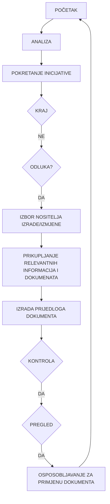
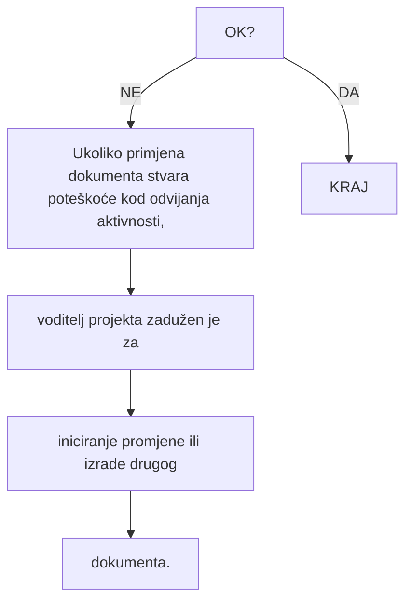

# UPRAVLJANJE DOKUMENTIMA

| Naziv dokumenta:        | Programski postupak PP-42-01 |
|-------------------------|------------------------------|
| Revizija broj:          | 6                            |
| Datum objavljivanja:    | 17.11.2017.                  |
| Kontrolirana kopija broj: |                             |

| Pripremio:              | Vladimir Križe, voditelj QA | 13.11.2017. |
|-------------------------|----------------------------|-------------|
| Pregledao:              | mr.sc. Ilijana Iveković, predstavnica direktora | 14.11.2017. |
| Odobrio:                | dr.sc. Nenad Debrecin, direktor | 15.11.2017. |


## 1. SVRHA

Postupkom se definiraju postupci i odgovornosti za upravljanje dokumentima,
neovisno o njihovom podrijetlu. Postupkom se, za sve dokumente utvrđuje:

- format i sadržaj
- jedinstven način označivanja
- postupak pripreme, pregleda i odobravanja
- postupak za periodički pregled i izmjene
- postupak objavljivanja, dostave i poništavanja starih revizija
- način i mjesto arhiviranja, čuvanja i izdavanja

## 2. PODRUČJE PRIMJENE

Postupak se može prema potrebi primjenjivati na sve dokumente izrađene u
Enconetu te dobivene od kupca ili trećih osoba, a posebno se primjenjuje na
dokumentaciju striktno vezanu za projekte, koja je zahtjevana prema
evidencijskoj lista IOD brojeva projekta.

## 3. REFERENCE

1. HRN EN ISO 9001:2015
   Sustavi upravljanja kvalitetom – Zahtjevi
   Upravljanje dokumentima

2. IAEA Leadership and Management for Safety, IAEA Safety Standards Series,
   No. GSR Part 2, IAEA Vienna, 2016.

3. American Code of Federal Regulation, 10CFR50 App. B, Criteria 6, Document
   Control

4. NQA-1, Requirement 6, Document Control

5. Enconet - Priručnik kvalitete PK
   Sustavi upravljanja kvalitetom – Zahtjevi
   Upravljanje dokumentima

6. Enconet - Programski postupak PP-42-02
   Upravljanje zapisima kvalitete


## 4. DEFINICIJE I KRATICE

| Abbreviation | Description                                |
|--------------|--------------------------------------------|
| ADM          | Administrator                             |
| ATR          | Autor (dokumenta)                         |
| DIR          | Direktor                                  |
| EN           | Europska norma                            |
| Enconet      | Enconet d.o.o.                            |
| HRN          | Hrvatska norma                            |
| IAEA         | Međunarodna agencija za atomsku energiju  |
| IOD          | Identifikacijska oznaka dokumenta         |
| ISO          | Međunarodna organizacija za normizaciju    |
| MKD          | Mjesto korištenja dokumenta               |
| OIU          | Odjel za inženjerske usluge                |
| ORG          | Organizacija poslovanja Enconeta          |
| PK           | Priručnik kvalitete                       |
| PO           | Primarna odgovornost                      |
| PP           | Programski postupak                       |
| QA           | Osiguravanje kvalitete                     |
| SO           | Sekundarna odgovornost                     |
| SUK          | Sustav kvalitete Enconeta                 |
| VP           | Voditelj projekta                         |
| VQA          | Voditelj QA poslova                        |


## 5. ODGOVORNOSTI

Direktor Enconeta je odgovoran da:
- potpisuje i odobrava objavljivanje dokumenata
- osigura odgovarajući prostor te uvjete arhiviranja i čuvanja dokumentacije
- izdaje nalog da se izradi popis deponiranih potpisa djelatnika i svi potrebni
  žigovi Enconeta

Voditelji projekata su odgovorni da:
- uspostave i obnavljaju popis dokumenata u svom području rada (kako internih
  tako i eksternih dokumenata)
- iniciraju pripremu (izradu), pregled i objavljivanje kako novih dokumenata tako
  i onih koji podliježu periodičkom pregledu i izmjenama
- objavljuju privremene dokumente u svom području rada
- provode i nadziru primjenu sustava označivanja i vođenja IOD brojeva za
  dokumente u njihovoj nadležnosti
- odobreni dokument s dostavnom listom kontroliranih kopija predaju
  administratoru radi objavljivanja
- nadziru i provode klasifikaciju dokumenata s obzirom na period čuvanja te ih
  dostavljaju administratoru radi pohranjivanja

Voditelj QA poslova je odgovoran da:
- nadzire primjenu ovog postupka na sve dokumente SUK-a
- obavlja pregled QA dokumenata prije objavljivanja
- vodi evidencijsku listu revizija dokumenata i privremenih dokumenata
- nadzire dostavu kontroliranih kopija i vodi evidenciju dostavnih lista
- nadzire primjenu postupka arhiviranja i klasificiranja dokumenata s obzirom
  na razdoblje čuvanja zapisa kvalitete
- vodi brigu o QA arhivi

Administrator je odgovoran da:
- pravovremeno dostavlja odobrene i objavljene dokumente (nove dokumente i
  revizije izvornika) na sva mjesta korištenja, prema dostavnoj listi kontroliranih
  kopija, a od korisnika traži povrat potpisane dostavne liste
- kod izdavanja nove revizije, poništava staru reviziju (izvornik) dokumenta
  žigom i dostavlja u QA arhivu
- arhivira, čuva i izdaje dokumente iz QA arhive u Enconetu

Svi djelatnici Enconeta odgovorni su da, u djelokrugu svoga rada, te kod
pohranjivanja i korištenja dokumentacije postupaju prema zahtjevima ovog
postupka.


## 6. POSTUPAK

Uspostava i održavanje sustava upravljanja dokumentima znači dokumentirano provođenje svih aktivnosti u postupanju s dokumentima koji mogu biti na bilo kojem nosaču zapisa. Sustavom se ostvaruje provođenje nadzora i provjere pripreme, pregleda, odobravanja, objavljivanja, dostave, promjena, poništavanja, čuvanja i arhiviranja dokumenata bitnih za djelotvornu primjenu SUK-a.

Tok izrade dokumenata SUK-a prikazan je u dijagramu toka životnog ciklusa dokumenta (Prilog 7.1) sa svrhom utvrđivanja svih nositelja radnji i njihovih odgovornosti za upravljanje dokumentima.

### 6.1 Grafičko-tablični prikaz dijagrama toka

#### 6.1.1 Grafički simboli u dijagramu toka

| Symbol | Description |
|--------|-------------|
| Elipsa | Simbol granica dijagrama toka. Simbol se koristi za prikazivanje početka i završetka procesa u dijagramu toka. |
| Pravokutnik | Simbolizira postupak, proces, aktivnost. Simbol se koristi kada se dešava promjena u nekom segmentu postupanja i za označivanje aktivnosti bilo koje vrste. |
| Romb | Simbol odlučivanja. Simbol se postavlja na mjesto u procesu na kojem se mora donijeti odluka. Izlaz iz simbola daje dvije mogućnosti: DA ili NE. |
| Strelica | Simbolizira smjer toka. |
| Krug | Simbol spojnice. Koristi se kada se u jednom formatu papira ne može prikazati cijeli dijagram toka. Svaki različiti izlaz ili ulaz treba imati različitu slovnu oznaku. |

#### 6.1.2 Analiza tekstom

Sastoji se od kratkog opisa svake faze u životnom toku dokumenta koja je istovjetna s pojedinim simbolima dijagrama toka.

#### 6.1.3 Matrica odgovornosti

U toku postupanja prati se svaka faza dokumenta i dvodimenzionalnim poljem označuje se tko je u njoj zadužen za koji posao i to:
---
Programski postupak                                                               Naziv dok: PP-42-01
UPRAVLJANJE DOKUMENTIMA                                                            Rev. 6        Str: 7/26

PO - primarno odgovoran

SO - sekundarno odgovoran

Voditelji projekata nadziru uspostavu i obnavljanje popisa dokumenata koji
podliježu kontroli u svom području rada. Imenuju osobu za kontrolu takvih
dokumenata i dostavu podataka administratoru radi vođenja glavnog popisa
dokumenata.

## 6.2 Glavni popis dokumenata (GPD) N/A

N/A (obsolete, canceled)

## 6.3     Sadržaj i format dokumenata

Dokumenti sustava kvalitete imaju definirani odgovarajući sadržaj primjeren razini
QA dokumenta, a izrađuju se u jedinstvenom formatu utvrđenom obrascima za
naslovnu i unutarnju stranu.

### 6.3.1 Sadržaj Priručnika kvalitete

Sadržaj i upravljanje Priručnikom kvalitete definirani su u samom Priručniku.

### 6.3.2 Sadržaj programskih postupaka i radnih uputa

Svaki programski postupak i radna uputa sadržavaju slijedeća poglavlja:

1. SVRHA
   Naznačuje se namjera i definira cilj radi kojeg se dokument izrađuje.

2. PODRUČJE PRIMJENE
    Definira se djelokrug rada, odjel, poslove i/ili osoblje na koje se dokument
    odnosi.

3. REFERENCE
    Popisuje se referentna dokumentacija koja je u vezi s dokumentom, te definira
    zahtjeve i druge relevantne podatke.

4. DEFINICIJE I KRATICE
    Definira se značenje specifičnih pojmova i/ili značenje kratica korištenih u
    dokumentu.

5. ODGOVORNOSTI
    Jasno se određuju pojedinačne odgovornosti i obveze za izvođenje
    specificiranih aktivnosti.

6. POSTUPAK
    Određuje se način izvođenja radnje s opisom pojedinačnih aktivnosti, Utvrđuje
    se što se mora napraviti, tko će to napraviti, kada, gdje i kako. Navodi se
---
Programski postupak                                                              Naziv dok: PP-42-01
UPRAVLJANJE DOKUMENTIMA                                                           Rev. 6       Str: 8/26

materijal, oprema i dokumenti koji će se koristiti, te kako će se proces
nadzirati, provjeriti i zapisati. Postupak se može prikazati i dijagramom toka.

7. PRILOZI
   Dokumentacija i obrasci kojima se potvrđuje da su aktivnosti propisane
   dokumentom provedene sukladno specificiranim zahtjevima.

### 6.3.3 Format dokumenata

Format naslovne i unutarnje strane Priručnika kvalitete definiran je u samom
Priručniku.

Format naslovne strane programskih postupaka i radnih uputa definiran je
obrascem OB-NST-002 (Prilog 7.2).

Format unutarnje strane programskih postupaka i radnih uputa definiran je
obrascem OB-UST-004 (Prilog 7.3).

### 6.4     Označavanje dokumenata

Prepoznavanje i sljedivost dokumenata u svakoj fazi postupanja kod upravljanja
dokumentima ostvaruje se jedinstvenim načinom označivanja dokumenata
identifikacijskom oznakom preko IOD broja dokumenta koji se upisuje na
naslovnoj strani dokumenta.

Ulazne dokumente/dopise vezane za projekte, administrator nakon zaprimanja
dostavlja odgovornom rukovodećem osoblju (direktor, voditelj projekta, voditelj
KFP, voditelj QA) od kojih dobiva IOD broj prema zahtjevu „Evidencijske liste IOD
brojeva QA zapisa projekta – kojem pripadaju".

#### 6.4.1 Identifikacijska oznaka dokumenta (IOD broj)

IOD broj strukturiran je od 6 polja različitog broja mjesta, tako da se stvara alfa-
numerička oznaka na sljedeći način:

```
                             (1.)  (2.)   (3.) (4.)     (5.)    (6.)
                          DD-NNN-BBB/GG-VVVBB-RBB
                                                                         status, revizija

vrsta dokumenta                                             sadržaj, vod. proj., broj
vrsta oznake

                 vrsta objekta                                      godina ugovora
                 vrsta projekta
                 vrsta entiteta                    redni broj dokumenta iz GIP-a
                 naručitelj-kupac
```

(1.) Polje - Vrsta dokumenta
---
Programski postupak                                                                 Naziv dok: PP-42-01
UPRAVLJANJE DOKUMENTIMA                                                              Rev. 6        Str: 9/26

Na 1. i 2. mjesto u IOD broju upisuje se dvoslovna oznaka vrste dokumenta ili vrste neke druge oznake prema odabiru iz Pojmovnika - Popisa pojmova i kratica.

Na 3. mjesto u IOD broju unosi se znak "-" radi razdvajanja.

(2.) Polje - Vrsta objekta

Od 4. do 6. mjesta u IOD broju upisuje se troslovna oznaka vrste objekta, projekta, naručitelja projekta (kupca) ili nekog drugog entiteta prema odabiru iz Pojmovnika.

Na 7. mjesto u IOD broju unosi se znak "-" radi razdvajanja.

(3.) Polje - Redni broj dokumenta

Od 8. do 10. mjesta u IOD broju upisuje se redni broj dokumenta za svako područje rada, ili broj projekta iz GIP-a za dokumentaciju vezanu direktno za određeni projekt.

Na 11. mjesto u IOD broju unosi se znak "/" radi razdvajanja fiksnog dijela od promjenjivog dijela IOD broja.

(4.) Polje - Godina

Na 12. i 13. mjesto u IOD broju upisuje se oznaka godine sastavljena od zadnja dva broja tekuće godine.

Na 14. mjesto u IOD broju unosi se znak "-" radi razdvajanja.

(5.) Polje - Sadržaj

Od 15. do 19. mjesta u IOD broju upisuje se alfa-numerička oznaka promjenjivog broja mjesta ovisno o specifičnoj djelatnosti. Odnosi se na sadržaj dokumenta ili vezu na neki drugi dokument, odnosno i za neke druge sadržaje ukoliko se pokaže potreba. Popunjavanje ovih mjesta ovisi o namjeni oznake i karakteru dokumenta. Za dokumentaciju vezanu direktno za neki određeni projekt upisuje se oznaka-skraćenica voditelja projekta, definirana u pojmovniku i redni broj vrste dokumenta. Na prvi ili jedini zapis te vrste piše se redni broj 01 te se slijedeći zapisi iste vrste nastavljaju 02, 03, 04...........

Na 20. mjesto u IOD broju (odnosno nakon zadnjeg mjesta u 5. polju) unosi se znak "-" radi razdvajanja.

(6.) Polje - Status

Od 21. do 23. mjesta u IOD broju (odnosno nakon znaka "-" razdvajanja) upisuje se status dokumenta koji jasno tumači njegovo stanje:

- dokument na snazi (jednoslovna oznaka "R" i broj revizije), za dokumentaciju vezanu direktno za neki određeni projekt
---
Programski postupak                                                          Naziv dok: PP-42-01
UPRAVLJANJE DOKUMENTIMA                                                      Rev. 6       Str: 10/26

## 6.4.2 Primjer označivanja QA dokumenata

Označivanje QA dokumenata izvodi se za onu QA dokumentaciju koja direktno pripada nekom projektu i koja se prilaže ostaloj projektnoj dokumentaciji koju vodi i održava administrator – tajnica Enconeta.

Priručnik kvalitete, programski postupci i radne upute ne označavaju se IOD brojem, jer imaju svoj sistem označavanja, prema popisu tih dokumenata na SUK-u.

## 6.4.3 Primjer označivanja dokumenata vezanih na proizvod/projekt

Označivanje dokumentacije koja se odnosi na konkretan proizvod/projekt temelji se na prepoznavanju i sljedivosti dokumenta od dostavljanja zahtjeva za ponudom, preko izrade i prihvaćanja ponude, do sklapanja i realizacije ugovora. Zato svi dokumenti za jedan projekt (Zahtjev za Ponudu/Upit, Ponuda, Ugovor/Narudžba, Plan realizacije projekta, Projekt i dr.) imaju isti redni broj (3. polje IOD broja prema točki 6.4.1), broj projekta iz GIP-a.

Voditelj projekta, prema određenoj evidencijskoj listi IOD brojeva projekta (vidi Prilog 7.4), određuje IOD brojeve za dokumente iz svoje nadležnosti te ih dostavlja administratoru radi urudžbiranja dokumenata. Slijede primjeri označavanja bitne dokumentacije projekta u NE Krško, broj projekta u GIP-u je 208, godine 2011, voditelj projekta je direktor DIR, redni broj vrste dokumenta bb, broj revizije projekta je Rbb:

| Administrator – Sekretarica | IOD |
|---------------------------|-----|
| 1. Zahtjev za ponudu | ZP-NEK-208/11-DIRbb-Rbb |
| 2. Ponuda br. 266/11 | PD-NEK-208/11-DIRbb-Rbb |
| 3. Ugovor br. 616/11 | UG-NEK-208/11-DIRbb-Rbb |
| Narudbenica | NR-NEK-208/11-DIRbb-Rbb |
| 4. Ugovor s dobavljačem | UGD-NEK-208/11-DIRbb-Rbb |
| 5. Zapisnik s dobavljačem | ZAD-NEK-208/11-DIRbb-Rbb |
| 6. Ocjena zahtjeva za proizvod OB-OZP-034 | OC-NEK-208/11-DIRbb-Rbb |
| 7. Plan izvedbe projekta OB-PIP-043 | PL-NEK-208/11-DIRbb-Rbb |
| 8. Praćenje uspješnosti projekta OB-PUP-039 | PUP-NEK-208/11-DIRbb-Rbb |
| 9. Zapisnik o primopredaji proizvoda/usluge OB-ZPP-035 | ZPP-NEK-208/11-DIRbb-Rbb |
| 10. Reklamacije OB-REK-014 | REK-NEK-208/11-DIRbb-Rbb |
| 11. Non – conformance report OB-NCR-016 | NCR-NEK-208/11-DIRbb-Rbb |
| 12. Zapis kvalitete | ZK-NEK-208/11-DIRbb-Rbb |
| 13. | |
---
Programski postupak                                                               Naziv dok: PP-42-01
UPRAVLJANJE DOKUMENTIMA                                                            Rev. 6       Str: 11/26

| QA Arhiva |  |
|------------|--|
| 14. Izvještaj | IZ-NEK-208/11-DIRbb-Rbb |
| 15. Stručna ocjena | SO-NEK-208/11-DIRbb-Rbb |
| 16. Elaborat | EL-NEK-208/11-DIRbb-Rbb |
| 17. Studija | ST-NEK-208/11-DIRbb-Rbb |
| 18. Status report | SR-NEK-208/11-DIRbb-Rbb |
| 19. Test report | TR-NEK-208/11-DIRbb-Rbb |
| 20. Outage (Remont) report | RE-NEK-208/11-DIRbb-Rbb |
| 21. Work report | WR-NEK-208/11-DIRbb-Rbb |
| 22. |  |
| 23. |  |

Dokumentacija po brojem 1-11 iz prethodne tablice je arhivirana kod administratora – sekretarice, a izvještaji pod brojem 12-19 arhivirani su u QA arhivi. Sva ostala projektna dokumentacija (ulazna dokumentacija, korespondencija, mailovi, proračuni, analize, nacrti, tabele, standardi itd) arhivirana je kod voditelja projekta. Urudžbirana i arhivirana projektna dokumentacija nije limitirana primjerima u ovoj tablici i prema karakteru projekta može biti proširena od strane voditelja projekta.

Svi dokumenti projekata vezani za NE Krško čuvaju se do kraja životnog vijeka NE Krško, dok se dokumentacija ostalih projekata čuva na rok od deset godina.

### 6.4.4 Primjer označivanja komercijalno – financijskih dokumenata

Voditelj KFP, prema potrebi, određuje IOD brojeve za dokumente iz svoje nadležnosti te ih dostavlja administratoru radi arhiviranja projektne dokumentacije.

### 6.4.5 Jedan ugovor - više nezavisnih projekata (NE Krško)

Voditelj projekta (ugovora s više projektnih nezavisnih cjelina) mora koordinirati izdavanje IOD brojeva za svoje dokumente. Za dokumentaciju koja se odnosi generalno na kompletan ugovor (PIP, OZP, PUP, NCR, itd), u polje broj 5 unosi se oznaka voditelja projekta. Za ostalu dokumentaciju (izvještaji, studije, elaborati, stručne ocjene, test report-i, work report-i, outage report-i, itd) u polje broj pet unosi se oznaka autora dokumenta.

Unutar jednog ugovora s više nezavisnih tehnoloških cjelina pojavljivat će se više istovrsnih izvještaja od različitih autora, status reporta – SR na primjer. U tom slučaju sva dosadašnja pravila i dalje vrijede, samo će se povećavati redni broj dokumenta i to bez obzira tko je autor dokumenta. Za ispravno evidentiranje rednog broja zadužen je voditelj projekta. Autori dokumenta moraju slijedeći redni broj tražiti i dobiti od voditelja projekta.

Primjer:
---
Programski postupak                                                                 Naziv dok: PP-42-01
UPRAVLJANJE DOKUMENTIMA                                                              Rev. 6        Str: 12/26
SR-NEK-304/16-AAAbb-Rbb

SR – vrsta izvještaja
NEK – naručitelj
304 – broj projekta prema GIP-u
16 – godina u kojoj se izvještaj izdaje
AAA- Inicijali glavnog autora izvještaja (RBA, BLU, MBA, DMU)
bb – redni broj izvještaja koji se uvećava za 1 za svaki novi SR bez obzira ne to
tko je autor
Rbb – broj revizije R00

Dakle,
Boško je pripremio status report    SR-NEK-304/16-BLU01-R00
Matija je pripremio status report   SR-NEK-304/16-MBA02-R00
Boškov slijedeći broj će biti       SR-NEK-304/16-BLU03-R00
Matijin slijedeći broj će biti      SR-NEK-304/16-MBA04-R00
XXX-ov slijedeći broj će biti       SR-NEK-304/16-XXX05-R00
YYY-ov slijedeći broj će biti       SR-NEK-304/16-YYY06-R00
Itd.

Za druge tipove dokumentacije vrijede ista pravila, a potrebno je promijeniti
kraticu za vrstu izvještaja (Test Report – TR, Remont Report – RE, Work Report
– WR itd.), pridodati kraticu za autora i dodijeliti broj izvještaja prema istom
sekvencijalnom principu numeriranja za tip izvještaja (ne prema autoru).

Direktor Enconeta imenuje voditelja projekta kao i izvršioce pod projekata kroz
ponudbeno-ugovornu dokumentaciju.

## 6.5 Priprema, pregled i odobravanje dokumenata

Prijedloge pisanih postupaka, radnih uputa i ostalih dokumenata izrađuje
osposobljeno i ovlašteno osoblje pojedinih odjela sukladno specificiranim radnim
nalozima.

Pregled i procjenu usklađenosti dokumenata s propisanim zahtjevima obavlja
stručna ovlaštena osoba koja je barem jednako osposobljena kao i autor
dokumenta. Ovisno o složenosti i sadržaju, dokument pregledava jedna ili više
stručnih osoba. Osoba koja pregledava dokument dostavlja autoru dokumenta
svoje primjedbe i prijedloge na tekst prijedloga dokumenta.

Na osnovu dobivenih primjedbi i prijedloga autor dokumenta prihvaća korisne,
opravdane i svrsishodne te vrši korekcije, ili odbacuje neprimjerene komentare i
izrađuje konačni tekst dokumenta za potpisivanje i odobravanje.

Priručnik kvalitete i programske postupke priprema odgovarajuće QA osoblje,
pregledava voditelj QA i/ili drugo imenovano osoblje a odobrava direktor
Enconeta.

Radne upute priprema stručno osoblje iz odjela, na čiju djelatnost se odnosi
radna uputa, pregledava voditelj QA a odobrava voditelj odgovarajućeg projekta
ili direktor Enconeta.
---
Programski postupak                                                                   Naziv dok: PP-42-01
UPRAVLJANJE DOKUMENTIMA                                                                Rev. 6        Str: 13/26

## 6.6     Potpisi i žigovi na dokumentima

Pojedine dokumente potpisuje ovlašteno osoblje Enconeta u skladu s ovim postupkom. Potpisi svih djelatnika Enconeta deponirani su na popisu u SUK-u, grupa 27, u kojem je navedeno ime i prezime, titula i funkcija djelatnika, te oblik vlastoručnog parafa i potpisa za ovjeravanje izrađenih dokumenata.

U prilogu 7.5 ovog postupka priloženi su svi žigovi Enconeta. Prikazan je oblik, sadržaj i dat način korištenja i čuvanja žigova. Detaljnija svrha korištenja nekih žigova data je u odgovarajućim postupcima.

## 6.7       Objavljivanje, dostava i poništavanje dokumenata

Korisnici i brojevi kontroliranih kopija priručnika kvalitete, programskih postupaka i radnih uputa su:

- QA arhiva Enconeta-ZG – kontrolirana kopija broj: 1
- QA arhiva odjela OIU na lokaciji NE Krško – kontrolirana kopija broj: 2
- Direktor Enconeta – kontrolirana kopija: 3
- QA Služba NEK.SKV na lokaciji Krško – kontrolirana kopija broj: 4

Vlasnici/nositelji pojedinih dokumenata (Voditelj projekta, voditelj QA poslova, stručna odgovorna osoba), odobrene dokumente s dostavnom listom kontroliranih kopija OB-DLK-010 (Prilog 7.6), predaju administratoru radi ovjere, urudžbiranja i dostave dokumenata korisnicima.

Administrator prije urudžbiranja i dostave treba provjeriti da li dokument ima naslov i naziv, IOD broj, broj važeće revizije, vlastoručne potpise osoba koje su dokument izradile, pregledale i odobrile, te da li su kompletirani svi prilozi.

Ukoliko nedostaje neki podatak ili postoji sumnja u njegovu vjerodostojnost, administrator provjerava stanje kod nadležnog voditelja projekta. Ukoliko nije moguće razriješiti nedoumicu o tome izvještava voditelja QA i/ili direktora Enconeta.

Prema priloženoj dostavnoj listi kontroliranih kopija administrator izrađuje kontrolirane kopije izvornika i na naslovnoj strani svake od njih upisuje odgovarajući broj kontrolirane kopije, te ih dostavlja svim korisnicima prema listi kontroliranih kopija, s naznakom da se postojeći dokument (ukoliko je već ranije dostavljen) povlači iz upotrebe i zamjenjuje novim.

Kad korisnici prime dokument s dostavnom listom, dostavnu listu potpisuju i vraćaju administratoru a staru nevažeću reviziju dokumenta uništavaju ili vidljivo označavaju da nije za upotrebu, te uklanjaju s mjesta korištenja.

Administrator predaje izvornik na mjesto čuvanja dokumenta (arhiva QA, centralna arhiva ili arhiva na nekoj drugoj lokaciji) a dostavnu listu kontroliranih kopija, potpisanu od korisnika, predaje voditelju QA radi vođenja evidencije.
---
Programski postupak                                                                 Naziv dok: PP-42-01
UPRAVLJANJE DOKUMENTIMA                                                              Rev. 6        Str: 14/26

Administrator žigom "PONIŠTENO" ovjerava izvornik stare revizije dokumenta koji se radi regulatornih, ugovornih ili stručnih razloga pohranjuje u odgovarajućoj arhivi Enconeta.

## 6.8      Periodički pregledi, izmjene, revizije i privremeni dokumenti

### 6.8.1     Periodički pregled i revizija dokumenata

Svi dokumenti sustava kvalitete podliježu periodičkom pregledu i reviziji.

Periodički pregled i revizija Priručnika kvalitete i programskih postupaka obavlja se, u pravilu, svake treće godine a prema potrebi i nalogu direktora Enconeta može se obaviti u bilo kojem trenutku. Periodički pregled i revizija ostalih dokumenata obavlja se prema potrebi i procjeni ovlaštenih osoba.

Dokument, podvrgnut periodičkom pregledu, prolazi isti postupak pregleda i odobravanja kao i izvorni dokument prema točki 6.5, a objavljivanje i dostava nove te poništavanje stare revizije dokumenta prema točki 6.6.

Revidirani dokument dobiva novu oznaku izdanja/revizije i novi datum izdavanja. Dio teksta koji se promijenio, u odnosu na staru reviziju, u novoj reviziji dokumenta označava se vertikalnom crtom na desnoj margini dokumenta.

### 6.8.2 Izmjene i revizije dokumenata

Svaki korisnik dokumenta, sa svog stanovišta, može inicirati izmjenu dokumenta popunjavanjem zahtjeva za izmjenom dokumenta na obrascu OB-ZIZ-012 (Prilog 7.7). Opravdanost zahtjeva za promjenom razmatra autor dokumenta i odgovorna osoba koja je odobrila njegovu primjenu.

Dokument koji se mijenja prolazi postupak pregleda, odobravanja, objavljivanja, dostave nove te poništavanja stare revizije na isti način kao i izvorni dokument prema točki 6.5, odnosno 6.6.

Promijenjeni dokument dobiva novu oznaku izdanja/revizije i novi datum izdavanja. Dio teksta koji se promijenio, u odnosu na staru reviziju, u novoj reviziji dokumenta označava se vertikalnom crtom na desnoj margini dokumenta.

### 6.8.3 Privremeni dokumenti

Pri određenim uvjetima mogu se privremeno koristiti neki dokumenti s jasno ograničenim vremenskim rokom korištenja, kako bi se omogućile i podržale određene aktivnosti privremenog trajanja ili do objavljivanja nove revizije postojećeg dokumenta. Privremeni dokument podliježe jednakom postupku kao i dokument trajnog karaktera ali s jasno naznačenim vremenskim rokom važenja i s oznakom "PRIVREMENO" u polju ovjerenom žigom za urudžbiranje. Nakon isteka roka dokument se povlači ili integrira u odgovarajući novi dokument, ili se obnavlja privremeni rok važenja dokumenta.
---
Programski postupak                                                                 Naziv dok: PP-42-01
UPRAVLJANJE DOKUMENTIMA                                                              Rev. 6        Str: 15/26
## 6.9      Arhiviranje, izdavanje i čuvanje dokumentacije

### 6.9.1     Arhiva i izdavanje dokumenata u sjedištu Enconeta

Arhiva QA dokumentacije Enconeta smještena je u sjedištu tvrtke. U «QA arhivi» se pohranjuje, čuva i izuzima radi korištenja sva dokumentacija Enconeta koja je, u sustavu upravljanja dokumentima, definirana kao zapis kvalitete (ZK), prema postupku PP-42-02 «Zapisi kvalitete». Sva ostala dokumentacija Enconeta koja nije zapis kvalitete (NZK) pohranjena je u «Centralnoj arhivi».

Zapisi kvalitete pohranjuju se kontinuirano kako nastaju t.j. nakon završetka pojedinih faza tehnološkog procesa i određenih QA aktivnosti. Ulažu se u označene registratore (papirnati zapisi) odnosno upisuju na elektronski medij (elektronski zapisi). Čuvaju se u odgovarajućim datotekama, kutijama, registratorima, na metalnim policama s posebnim mjerama zaštite, tako da se izbjegne propadanje i uništavanje, te spriječi njihov gubitak. Na svakoj polici nalazi se oznaka projekta / područja za koje se vode zapisi kvalitete.

### 6.9.2 Arhiva na lokaciji NE Krško

Na sve zapise kvalitete i kontrolirane kopije QA dokumentacije (priručnik kvalitete, programski postupci, itd.) koji se dostavljaju za korištenje i pohranjivanje u arhivu Enconeta na lokaciji NE Krško, primjenjuju se opći zahtjevi upravljanja dokumentima i podacima, te upravljanja zapisima kvalitete propisani normom (Ref. 1), smjernicom (Ref. 2) i SUK.

Na sve dokumente i zapise kvalitete, izrađene za potrebe obavljanja poslova i korištenje u NE Krško, primjenjuju se i posebni zahtjevi određeni u NEK QA Planu i pod nadzorom su QA službe NEK.

### 6.9.3 Čuvanje dokumenata

Dokumenti se pohranjuju i čuvaju na takav način da se mogu lako pronaći i da su u odgovarajućim okolišnim uvjetima kako bi se spriječilo oštećenje, propadanje i gubitak dokumenata.

Svi dokumenti koji su, prema postupku PP-42-02 «Upravljanje zapisima», (Ref. 5) razvrstani u ZK dokumente čuvaju se u QA arhivi. QA arhiva je zaključani prostor u kojem su dokumenti zaštićeni od propadanja i mogućih oštećenja (svjetlo, vlaga, požar, kukci, plijesan i t.d.). Ključevi QA arhive nalaze se kod administratora i/ili voditelja QA.

Razvrstavanje dokumenata u odnosu na klasu zapisa kvalitete i period čuvanja obavlja se prema postupku PP-42-02.

## 7.       PRILOZI

7.1      Dijagram toka životnog ciklusa dokumenta
7.2      Obrazac: OB-NST-002 Naslovna strana programskih postupaka i radnih uputa
7.3      Obrazac: OB-UST-004 Unutarnja strana programskih postupaka i radnih uputa
---
Programski postupak | Naziv dok: PP-42-01
UPRAVLJANJE DOKUMENTIMA | Rev. 6    Str: 16/26

7.4    Obrazac: OB-EVI-053 Evidencijska lista IOD brojeva QA dokumenata projekta
7.5    Pregled žigova Enconeta
7.6    Obrazac: OB-DLK-010 Dostavna lista kontroliranih kopija dokumenta
7.7    Obrazac: OB- ZIZ-012 Zahtjev za izmjenom dokumenta

7.1    Dijagram toka životnog ciklusa dokumenta

| DIJAGRAM TOKA | ANALIZA TEKSTOM | MAT. ODG. | DRUGI DOKUMENTI |
|----------------|------------------|-----------|------------------|
|                |                  | PO | SO   |                  |
---
| Programski postupak | Naziv dok: PP-42-01 |
| UPRAVLJANJE DOKUMENTIMA | Rev. 6    Str: 17/26 |



| DIJAGRAM TOKA | ANALIZA TEKSTOM | MAT. ODG. | DRUGI DOKUMENTI |
|---------------|-----------------|-----------|-----------------|
| POČETAK | - | - | - |
| ANALIZA | Analiza rezultata provjere, zahtjeva norme,ugovora, pritužbi klijenata ili zahtjeva direktora Enconeta, QA voditelja, voditelja projekta | VQA | DIR VP | - |
| POKRETANJE INICIJATIVE | Pokretanje inicijative za izradu novog ili izmjenu postojećeg dokumenta. | VQA | VP | PP-42-01 Upravljanje dokumentima |
| KRAJ | | | |
| ODLUKA? NE | Donošenje odluke o potrebi izrade odnosno izmjene dokumenta. | DIR | VQA VP | OB-ZIZ-012 |
| DA | | | |
| IZBOR NOSITELJA IZRADE/IZMJENE | Direktor u suradnji s voditeljem QA određuje nositelja izrade / izmjene dokumenta. | DIR | VQA VP | PP-42-01 Upravljanje dokumentima |
| PRIKUPLJANJE RELEVANTNIH INFORMACIJA I DOKUMENATA | Nositelj izrade dokumenta (autor) prikuplja sve potrebne informacije i dokumente vezane uz dokument koji je potrebno izraditi odnosno izmijeniti. | ATR | VP VQA | - |
| IZRADA PRIJEDLOGA DOKUMENTA | Na temelju prikupljenih informacija i dokumenata autor izrađuje prijedlog dokumenta. | ATR | VP VQA | PP-42-01 Upravljanje Dokumentima |
| NE KONTROLA | | | |
| DA | Autor dostavlja prijedlog dokumenta voditelju projekta koji provodi stručnu kontrolu | VP | VQA | PP-42-01 Upravljanje dokumentima |
| NE PREGLED | | | |
| DA | Kontrolirani dokument od strane voditelja projekta autor dostavlja voditelju QA koji provodi pregled sadržaja i oblika dokumenta, te direktoru koji odobrava dokument. | VQA DIR | | PP-42-01 Upravljanje dokumentima |
| OSPOSOBLJAVANJE ZA PRIMJENU DOKUMENTA | Autor provodi osposobljavanje korisnika za primjenu dokumenta. | ATR | VP VQA | PP-62-01 Izobrazba i uvježbavanje osoblja |
---
| Programski postupak | Naziv dok: PP-42-01 |
|------------------------|-------------------|
| UPRAVLJANJE DOKUMENTIMA | Rev. 6    Str: 18/26 |

| | PO | SO | |
|---|----|----|---|
| B → A | - | - | - |

| Aktivnost | Opis | Odgovornost | Suradnja | Dokumenti |
|-----------|------|--------------|----------|-----------|
| UPIS DOKUMENTA U GLAVNU POPIS DOKUMENATA ILI PROMJENA REVIZIJE | Administrator upisuje dokument u glavni popis dokumenata ili ukoliko se radi o promijenjenom dokumentu, novo stanje revizije. | ADM | - | OB-GPD-009 Glavni popis dokumenata |
| DOSTAVA NA MJESTO KORIŠTENJA | Voditelj QA izrađuje i vodi evidenciju dostavnih lista kontroliranih kopija. Administrator dostavlja dokumente prema dostavnoj listi na mjesto korištenja. | VQA ADM | VP | PP-42-01 Upravljanje dokumentima OB-DLK-010 Dostavna lista |
| UNIŠTAVANJE ZASTARJELOG DOKUMENTA | Ukoliko se radi o izmijenjenom dokumentu po predaji novog uništava se zastarjeli dokument. | MKD | VP VQA | PP-42-01 Upravljanje dokumentima |
| ARHIVIRANJE ZASTARJELOG DOKUMENTA U JEDNOM PRIMJERKU | Voditelj QA čuva zastarjeli i poništeni dokument u jednom primjerku u katalogu zastarjelih dokumenata. | VQA | - | OB-EVR-011 Evidencijska lista revizija dokumenata |
| PRIMJENA DOKUMENTA | Korisnici dokumenta primjenjuju dokument u skladu s uputama dobivenim pri osposobljavanju za primjenu dokumenta. | MKD | VQA VP | OB-PTR-007 Potvrda o razumijevanju dokumenta |
| PRAĆENJE PRIMJENE DOKUMENTA | Voditelj projekta odgovoran je da se svi dokumenti namijenjeni za njegovo područje rada primjenjuju. | VP | VQA ATR | PP-42-01 Upravljanje dokumentima |



| Odgovornost | Suradnja | Dokumenti |
|-------------|----------|-----------|
| VP | VQA | PP-42-01 Upravljanje dokumentima OB-ZIZ-012 Zahtjev za izmjenom dokumenta |
---
Programski postupak.                                                   Naziv dok: PP-42-01
UPRAVLJANJE DOKUMENTIMA                                                 Rev: 6     Str: 19/26

## 7.2    Obrazac: OB-NST-002 Naslovna strana PP i RU

ENCONET d.o.o.

(NASLOV
DOKUMENTA)

| Field | Value |
|-------|-------|
| Naziv dokumenta: | |
| Revizija broj: | |
| Datum objavljivanja: | |
| Kontrolirana kopija broj: | |

| Uloga | Ime i prezime, funkcija | Datum |
|-------|-------------------------|-------|
| Pripremio: | | |
| Pregledao: | | |
| Odobrio: | | |

Periodični pregled

| Pregledao | Datum | Slijedeći pregled |
|-----------|-------|-------------------|
| | | |
| | | |
| | | |
---
Programski postupak.                                   Naziv dok: PP-42-01
UPRAVLJANJE DOKUMENTIMA                                Rev: 6      Str: 20/26

### 7.3     Obrazac: OB-UST-004 Unutrašnja strana PP i RU

# 1.      (NASLOV POGLAVLJA)

## 1.1     (Naslov podpoglavlja)

(Tekst dokumenta)
---
Programski postupak.                                                 Naziv dok: PP-42-01
UPRAVLJANJE DOKUMENTIMA                                            Rev: 6    Str: 21/26

## 7.4 Obrazac: OB-EVI-053 Evidencijska lista IOD brojeva projekta

### EVIDENCIJSKA LISTA IOD brojeva QA zapisa PROJEKTA

Pripremio:                                                   Datum kreiranja:

Broj projekta:
Naziv projekta:

#### Administrativna arhiva

| Redni broj | Naziv dokumenta | IOD broj | Naziv datoteke (poveznica na digitalnu arhivu) |
|------------|-----------------|----------|------------------------------------------------|
| 1 | Zahtjev za ponudom | | |
| 2 | Ponuda | | |
| 3 | Ugovor / Narudžbenica | | |
| 4 | Ugovor s dobavljačem | | |
| 5 | Zapisnik s dobavljačem | | |
| 6 | Ocjena zahtjeva za proizvodom | | |
| 7 | Plan izvedbe projekta | | |
| 8 | Praćenje uspješnosti projekta | | |
| 9 | Zapisnik o primopredaji proizvoda/usluge | | |
| 10 | Reklamacije | | |
| 11 | Non-Conformance Report | | |
| 12 | Zapis kvalitete | | |
| 13 | | | |

#### QA arhiva

| Redni broj | Naziv dokumenta | IOD broj | Naziv datoteke (poveznica na digitalnu arhivu) |
|------------|-----------------|----------|------------------------------------------------|
| 14 | Izvještaj | | |
| 15 | Stručna ocjena | | |
| 16 | Elaborat | | |
| 17 | Studija | | |
| 18 | Status report | | |
| 19 | Test report | | |
| 20 | Outage report | | |
| 21 | Work Report | | |
| 22 | | | |
| 23 | | | |

Potpis QA
administratora/ice:_________________________ 

Potpis inženjera/ke za
programsku podršku:__________________________

Potpis
voditelja/ice projekta:_______________________

Odobrio
voditelj/ica QA:____________________________    Datum zatvaranja liste:

str. od
---
Programski postupak.                                                   Naziv dok: PP-42-01
UPRAVLJANJE DOKUMENTIMA                                                   Rev: 6    Str: 22/26

## 7.5 Pregled žigova ENCONET-a

### 1. Žigovi organizacije

Žig je pravokutnog oblika dimenzije 50 x 20
mm i služi za ovjeravanje dokumenata tvrtke
Enconet. Koriste se tri žiga:
Žig br. 1 – koristi i čuva direktor Enconeta
Žig br. 2 – koristi i čuva voditelj
           Računovodstva
Žig br. 3 – koristi i čuva tajnica

### 2. Žigovi za ulazne i izlazne račune

Žigovi su pravokutnog oblika dimenzije 40 x 30 mm i služe za ovjeravanje
računa, jedan za ulazne račune a drugi za izlazne račune. Koristi ih i čuva voditelj
računovodstva.

| U R :     | __________ | I R :     | __________ |
|-----------|------------|-----------|------------|
| ŠIFRA:    | __________ | ŠIFRA:    | __________ |
| ODOBRIO:  | __________ | ODOBRIO:  | __________ |
| TERETITI: | __________ | TERETITI: | __________ |

### 3. Žig za urudžbiranje

| ENCONET | POT: | Žig je pravokutnog oblika dimenzije 60 x 40 |
|---------|------|---------------------------------------------|
| RBR:    | DAT: | KLD: | mm i služi za ovjeravanje dokumenata kod |
| Predmet: |     | urudžbiranja. Koristi ga i čuva administrator. |
| IOD:    |     |                                             |

### 4. Žig za poništavanje

Žig je pravokutnog oblika dimenzije 40 x 5,5 mm i služi za poništavanje
dokumenata. Koristi ga i čuva administrator.

PONIŠTENO
---
Programski postupak.                                                           Naziv dok: PP-42-01
UPRAVLJANJE DOKUMENTIMA                                                         Rev: 6       Str: 23/26

## 5. Žig za potvrđivanje isplate

Žig je pravokutnog oblika dimenzije 33 x 5 mm i služi za potvrđivanje izvršenog plaćanja. Koristi ga i čuva šef računovodstva.

```
PLAĆENO
```

## 6. Žig za povjerljive dokumente

Žig je pravokutnog oblika dimenzije 45 x 5,5 mm i služi za ovjeravanje povjerljivih dokumenata. Koristi ga i čuva tajnica.

```
POVJERLJIVO
```

## 7. Žig za zaustavljanje radova

Žig je pravokutnog oblika dimenzije 47 x 7,5 mm i služi za potvrđivanje zaustavljanja radova u slučaju uočavanja značajnih nesukladnosti. Koristi ga i čuva voditelj QA.

```
QA  ZAUSTAVLJENI
    RADOVI
```

## 8. Žig za označivanje radnih kopija dokumenata

Žig je pravokutnog oblika dimenzije 46 X 18 mm. Služi za označavanje radnih kopija dokumenata. Koristi ga i čuva administrator.

```
RADNA KOPIJA
Kopirao/Potpis: ............................
Datum: ......................................
```
---
Programski postupak.                                                           Naziv dok: PP-42-01
UPRAVLJANJE DOKUMENTIMA                                                        Rev: 6       Str: 24/26

### 9. Žig za označavanje privremenog važenja

Žig je pravokutnog oblika dimenzije 46 X 18 mm. Služi za označavanje dokumenata s privremenim važenjem. Koristi ga i čuva administrator.

| PRIVREMENO |
|-------------|
| Važi od ................... do .............. |
| Potpis/datum: ................................. |

### 10. Žig s oznakom «NIJE PREGLEDANO»

Žig je pravokutnog oblika dimenzije 46 X 18 mm. Služi za označavanje nabavljenih i korištenih proizvoda koji, iz opravdanih razloga, nisu prošli prijemnu kontrolu. Koriste ga voditelji projekata a čuva administrator.

| NIJE PREGLEDANO |
|------------------|
| Za proizvod: ................................. |
| Odobrio/datum: ............................... |

### 11. Žig s oznakom «NABAVLJENO OD KUPCA»

Žig je pravokutnog oblika dimenzije 46 X 18 mm. Služi za označavanje proizvoda nabavljenih od kupca. Koriste ga voditelji projekata a čuva administrator.

| NABAVLJENO OD KUPCA |
|----------------------|
| Za proizvod: ................................. |
| Primio/datum: ................................ |
---
Programski postupak.                                                            Naziv dok: PP-42-01
UPRAVLJANJE DOKUMENTIMA                                                          Rev: 6        Str: 25/26

### 7.6      Obrazac: OB-DLK-010, R6 Dost. lista kontrol. kopija dokumenta

| Pripremio: VQA | Dostavna lista kontroliranih kopija dokumenata | Datum: |
|----------------|----------------------------------------------|--------|
| Potpis:        |                                              |        |

Oznaka - Naslov dokumenta:

| Br. KKD | Naslov primatelja / Ime i prezime primatelja | Ime / potpis primatelja / Datum |
|---------|----------------------------------------------|--------------------------------|
| 1       | QA arhiva Enconeta – (Lokacija: Zagreb)      | Vladimir Križe                 |
| 2       | QA arhiva Enconeta – (Lokacija NEK)          | Josip Vuković                  |
| 3       | Direktor Enconeta: dr.sc. Nenad Debrecin     | Nenad Debrecin                 |
| 4       | QA Služba NEK.SKV (Lokacija NEK)             | Janez Novak                    |

Opis promjene:

Zamjenjuju se i poništavaju slijedeći dokumenti:

Stare revizije dokumenata molimo UNIŠTITI

Potpisanu ORIGINAL dostavnu listu molimo VRATITI u Enconet                                str. od
---
Programski postupak.                                                        Naziv dok: PP-42-01
UPRAVLJANJE DOKUMENTIMA                                                      Rev: 6       Str: 26/26
7.7     Obrazac: OB-ZIZ-012, R6 Zahtjev za izmjenom dokumenta

| Zahtjev za izmjenom dokumenta | Datum: |
|-------------------------------|--------|
| Naslov/naziv dokumenta:       |        |
|                               | Rev:   | Datum: |
|                               | IOD:   |        |

| Strana: | Poglavlje: | Podpoglavlje: | Stavak: |
|---------|------------|----------------|---------|

Tekst koji se mijenja:

Obrazloženje:

| Predložio: | Potpis: | Datum: |
|------------|---------|--------|
| Prijedlog prihvaćen: | DA □ | NE □ |
| Obrazloženje: |

| Pregledao: | Odobrio: |
|------------|----------|
| Potpis:    | Potpis:  |
| Datum:     | Datum:   |

QA potvrdio:

Potpis:

Datum:                                                                                     str. od