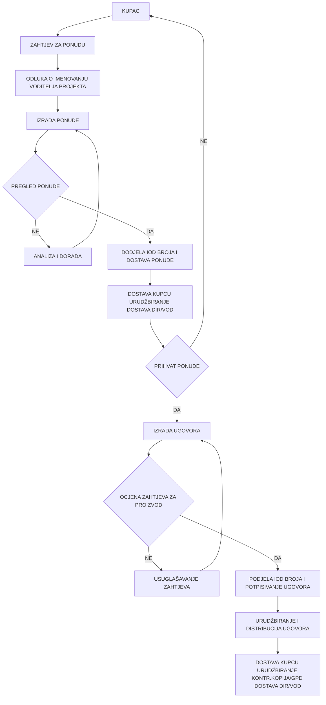

ENCONET d.o.o.

# PROCES MARKETINGA, UGOVARANJA I PRODAJE

| Naziv dokumenta:        | Programski postupak PP-72-01 |
|-------------------------|------------------------------|
| Revizija broj:          | 5                            |
| Datum objavljivanja:    | 17. 11. 2017.                |
| Kontrolirana kopija broj: |                             |

| Pripremio:              | Vladimir Križe, voditelj QA  | 13. 11. 2017. |
|-------------------------|------------------------------|----------------|
| Pregledao:              | Dubravka Dončević, voditelj KFP | 14. 11. 2017. |
| Pregledao:              | mr.sc. Ilijana Ivekovic, predstavnik direktora | 14. 11. 2017. |
| Odobrio:                | dr.sc. Nenad Debrecin, direktor | 15. 11. 2017. |

## Periodični pregled

| Pregledao: | Datum: | Slijedeći pregled: |
|------------|--------|---------------------|
|            |        |                     |
|            |        |                     |
|            |        |                     |
---
| Programski postupak | Oznaka dok.. PP-72-01 |
|------------------------|------------------------|
| PROCES MARKETINGA, UGOVARANJA I PRODAJE | Rev: 5 Str: 2/14 |

# SADRŽAJ

1. SVRHA......................................................................................................3

2. PODRUČJE PRIMJENE ..........................................................................3

3. REFERENCE............................................................................................3

4. DEFINICIJE I KRATICE ...........................................................................3

5. ODGOVORNOSTI....................................................................................4

6. POSTUPAK..............................................................................................4
   6.1 Proces marketinga, ugovaranja i prodaje.............................................4
   6.2 Praćenje tržišta i zadovoljstva kupaca ................................................5
   6.3 Komunikacija s kupcem........................................................................6
   6.4 Utvrđivanje zahtjeva za proizvod i izrada ponude ..............................6
   6.5 Ocjena zahtjeva za proizvod i sklapanje ugovora/narudžbe...............7
   6.6 Promjene i dopune ugovora ................................................................8
   6.7 Reklamacije i prigovori kupca ..............................................................9

7. PRILOZI .................................................................................................10
   7.1 Dijagram toka procesa ugovaranja i prodaje .....................................11
   7.2 Obrazac: OB-OZP-034, R5 - Ocjena zahtjeva za proizvod.................12
   7.3 Obrazac: OB-REK-014, R5 - Reklamacija kupca ................................13
   7.4 Obrazac: OB-KRE-029, R5 – Knjiga reklamacija ................................14

ENCONET d.o.o., Zagreb
---
Programski postupak                                                           Oznaka dok.. PP-72-01
PROCES MARKETINGA, UGOVARANJA I PRODAJE                                        Rev: 5           Str: 3/14

## 1. SVRHA

Postupkom se definiraju komunikacijske veze s kupcima te utvrđuju aktivnosti i odgovornosti u procesu marketinga (praćenje tržišta i zadovoljstva kupca) te procesu ugovaranja i prodaje (upit, ponuda, ugovor, promjene i dopune ugovora, reklamacije i prigovori kupaca).

## 2. PODRUČJE PRIMJENE

Postupak se primjenjuje na sve zahtjeve kojima se inicira ugovorni odnos.

## 3. REFERENCE

1. HRN EN ISO 9001:2015
   Sustavi upravljanja kvalitetom-Zahtjevi
   Procesi usmjereni na kupca

2. Enconet - Priručnik kvalitete PK
   Procesi usmjereni na kupca

3. IAEA Leadership and Management for Safety, IAEA Safety Standards Series,
   No. GSR Part 2, IAEA Vienna, 2016.

4. American Code of Federal Regulation, 10CFR50 App. B

## 4. DEFINICIJE I KRATICE

ADM – Administrator
DIR – Direktor Enconeta
VP - Voditelj projekta
VKF - Voditelj komercijalno financijskih poslova
ENC - Enconet
Enconet - Enconet d.o.o.
IAEA - Međunarodna agencija za atomsku energiju
IOD - Identifikacijska oznaka dokumenta
ISO - Međunarodna organizacija za normizaciju
KUP – Kupac
ORG - Organizacija poslovanja Enconeta
PK - Priručnik kvalitete
PO - Primarno odgovoran
PP - Programski postupak
PPO-Pravni poslovi
QA - Osiguravanje kvalitete
SUK - Sustav upravljanja kvalitetom Enconeta
SO - Sekundarno odgovoran

ENCONET d.o.o., Zagreb
---
Programski postupak                                                            Oznaka dok.. PP-72-01
PROCES MARKETINGA, UGOVARANJA I PRODAJE                                         Rev: 5           Str: 4/14

## 5. ODGOVORNOSTI

Direktor Enconeta prati podloge i analize o tržištu i zadovoljstvu kupaca te utvrđuje i donosi potrebne odluke i mjere. Odobrava ponude, te potpisuje ugovore u ime tvrtke s ugovornim strankama. Odobrava promjene i dopune ugovora, te potpisuje dodatke ugovoru u ime tvrtke. Odobrava rješavanje reklamacija kupca, te potrebne popravne i preventivne radnje. Odgovoran je da se zahtjevi kvalitete i primjena SUK-a odgovarajuće definiraju u ugovoru.

Voditelj projekta prikuplja i analizira informacije o tržištu i zadovoljstvu kupaca iz svoga područja rada. Odgovoran je da se svi zahtjevi za proizvod jednoznačno prenesu u odgovarajući dokument (ugovor/narudžbu). Odgovoran je za pregled ugovora i ocjenu zahtjeva za proizvod iz svog područja rada te održavanje zapisa o toj ocjeni. Odgovoran je za provedbu aktivnosti koje su posljedica odobrenih promjena odnosno dopuna ugovora te održavanje zapisa o tome. Odgovoran je za rješavanje reklamacija kupca, te provođenje popravnih i preventivnih radnji koje su posljedica tih aktivnosti.

Voditelj komercijalno financijskih poslova prikuplja i sistematizira sve podloge i analize o tržištu i zadovoljstvu kupaca. Odgovoran je za pregled ponude i ugovora te ocjenu zahtjeva za proizvod s komercijalno financijskog aspekta. Odgovoran je da se u ugovor ugrade svi potrebni elementi za reguliranje komercijalno financijskih pitanja. Zadužen je da vodi Knjigu reklamacija kao evidenciju reklamacija kupaca.

Ovlaštena osoba za pravne poslove odgovorna je da su ponuda i ugovor napisani u skladu s važećim zakonima i propisima te da su zaštićeni interesi Enconeta.

Voditelj QA poslova surađuje kod definiranja zahtjeva kvalitete kao ugovorne obveze. Odgovoran je za koordiniranje i nadzor rješavanja reklamacija kupaca, te potvrđivanje provedenih popravnih i preventivnih radnji.

Administrator je odgovoran za urudžbiranje, upis i dostavu dokumenata sukladno važećim postupcima.

## 6. POSTUPAK

### 6.1 Proces marketinga, ugovaranja i prodaje

Proces marketinga, ugovaranja i prodaje je proces usmjeren na kupca. Obuhvaća sve aktivnosti koje se odnose na:

a) praćenje tržišta i zadovoljstva kupaca
b) komunikaciju s kupcem
c) utvrđivanje zahtjeva za proizvod i izrada ponude
d) ocjenu zahtjeva za proizvod i sklapanje ugovora
e) promjene i dopune ugovora
f) reklamacije kupaca

ENCONET d.o.o., Zagreb
---
Programski postupak                                                               Oznaka dok.. PP-72-01
PROCES MARKETINGA, UGOVARANJA I PRODAJE                                           Rev:5             Str: 5/14

## 6.2      Praćenje tržišta i zadovoljstva kupaca

Zadovoljstvo kupca najvažniji je cilj i pokazatelj uspješnosti sustava za upravljanje kvalitetom. Glavno mjerilo zadovoljstva kupca je stupanj ispunjenja njegovih zahtjeva u odnosu na ono što očekuje od proizvoda / usluge i što od partnera realno može dobiti.

Zadovoljstvo kupaca može se ispitati samo uz njihovo angažiranje i sudjelovanje. Zato i metode prikupljanja i korištenja informacija mogu biti:

a) izravne
b) neizravne

Izravne metode jesu zamolbe ili ankete kupaca putem kojih oni sami kažu s čime su i koliko zadovoljni odnosno nezadovoljni. Enconet je razvio i koristi anketiranje kupaca putem obrasca OB-OZK-037 (Prilog u Radnoj uputi RU-82-01).

Neizravne metode ispitivanja zadovoljstva kupaca odnose se na opažanje i procjene ponašanja kupaca kroz rezultate prodaje i kontakte koji se s kupcima ostvaruju na njihovu inicijativu, dakle upite, reklamacije i određene zahtjeve. Enconet, između ostalih, koristi slijedeće neizravne metode:

- analiza broja, učestalosti, uzroka i troškova reklamacija kupaca
- analiza prijedloga kupaca
- analiza očekivanja kupaca
- analiza broja narudžbi i novih ugovora
- analiza preporuka drugim potencijalnim kupcima

Za dobijanje informacija o ukupnom stanju na tržištu a posebno u vezi konkurencije mogu se koristiti metode Benchmarkinga i drugi načini sakupljanja i analize dostupnih i raspoloživih informacija.

Enconet analizira i koristi informacije o zadovoljstvu kupaca kako bi poduzeo mjere za poboljšanje realizacije svojih procesa i kvalitete svojih proizvoda i usluga i time još više povećao zadovoljstvo kupaca.

Voditelji projekata prikupljaju i analiziraju informacije o kupcima iz svog područja rada i podloge o tome dostavljaju voditelju KFP.

Voditelj KFP sistematizira sve podloge i analize o zadovoljstvu kupaca i dostavlja direktoru na pregled i korištenje.

Na osnovu podloga i analiza o zadovoljstvu kupaca Direktor, prema potrebi, donosi odgovarajuće odluke.

Rezultati navedenih analiza o zadovoljstvu kupaca služe kao podloge za Direktorov pregled i izradu izvješća o stanju SUK-a. Oni su također i ulazni podaci Direktoru za donošenje odgovarajućih odluka o budućoj politici i mjerama nastupa prema kupcima i tržištu.

Detaljniji opis metoda, postupaka i odgovornosti u procesu praćenja tržišta i zadovoljstva kupaca dan je u Radnoj uputi RU-82-01 «Praćenje i mjerenje zadovoljstva kupaca».

ENCONET d.o.o., Zagreb
---
Programski postupak                                                              Oznaka dok.. PP-72-01
PROCES MARKETINGA, UGOVARANJA I PRODAJE                                          Rev:5             Str: 6/14

### 6.3 Komunikacija s kupcem

Ovisno o obimu i karakteru proizvoda, Enconet provodi različite postupke i metode komuniciranja s kupcem kao što su međusobne prezentacije, pisani dokumenti, službeni dopisi, e-mail i druga pošta, te neformalni usmeni i telefonski razgovori i slično.

Komunikacija s kupcem je stalna od upita preko izrade ponude i ugovora, realizacije i isporuke proizvoda te povratnih informacija kupca za vrijeme uporabe proizvoda do možebitnih reklamacija, prigovora ili prijedloga kupca. U svakoj navedenoj fazi koriste se najprimjereniji načini i metode komunikacije ovisno o tome da li se:

- prikupljaju informacije o proizvodu
- provodi postupak usuglašavanja kod izrade ponude, ugovora ili narudžbe, uključujući i dodatke ugovora
- prikupljaju povratne informacije od kupca, uključujući njegove reklamacije i prigovore odnosno prijedloge za poboljšanje

Ugovorom se definiraju ovlaštene osobe za komuniciranje s kupcem. No, ovisno o karakteru i sadržaju teme odnosno pitanja, nositelji komuniciranja od strane Enconeta mogu biti: direktor, predstavnik Direktora, voditelj odgovarajućeg projekta/posla, voditelj KFP, ovlaštena osoba za pravne poslove, voditelj QA i drugi.

### 6.4 Utvrđivanje zahtjeva za proizvod i izrada ponude

Direktor Enconeta pregledava sve zaprimljene dokumente i informacije od kupca u vezi s traženim proizvodom (zahtjev za ponudu, upit, tender, projektni zadatak, e-mail i druge bilješke nastale u komunikaciji s potencijalnim kupcem). Nakon pregleda donosi odluku o imenovanju voditelja projekta. Svu raspoloživu dokumentaciju i potrebne informacije upućuje voditelju posla, odnosno voditelju projekta, radi konačnog utvrđivanja zahtjeva za proizvod i izrade ponude.

Ako kupac nije dostavio zahtjeve za proizvod u dokumentiranom obliku (usmeni upit), voditelj projekta mora te zahtjeve evidentirati te tražiti i dobiti potvrdu od kupca prije prihvaćanja.

Voditelj projekta, na osnovu primljene dokumentacije i informacija, priprema tehnički dio ponude. Pritom komunicira s kupcem radi upotpunjavanja i razjašnjenja pojedinih zahtjeva za proizvod. Prijedlog ponude dostavlja drugim odgovornim osobama radi daljnje obrade.

Voditelj KFP nadopunjava ponudu sa komercijalno financijskim elementima (rokovi, cijena, uvjeti plaćanja itd).

Ovlaštena osoba za pravne poslove (osoba iz tvrtke ili posebno angažirana stručna osoba izvana) utvrđuje pravne aspekte ponude, (poštivanje zakona i propisa te zaštita interesa tvrtke).

Voditelj QA pregledava i parafira prijedlog ponude sa stanovišta poštivanja zahtjeva koji se odnose na kvalitetu proizvoda.

ENCONET d.o.o., Zagreb
---
Programski postupak                                                              Oznaka dok.. PP-72-01
PROCES MARKETINGA, UGOVARANJA I PRODAJE                                          Rev:5             Str: 7/14

Nakon svih pregleda, voditelj projekta dopunjava prijedlog te izrađuje konačni prijedlog ponude i dodjeljuje IOD broj.

Ponuda mora minimalno sadržavati slijedeće podatke:
-ime i adresa kupca
-broj ponude (veza s brojem zahtjeva za ponudu)
-datum ponude
-vrijednost ponude
-opis i opseg poslova
-rok izvedbe poslova
-rokovi i način plaćanja
-ostali uvjeti (standardi, specifikacije, opći uvjeti i sl.)
-opcija ponude (rok nakon kojega ponuda više nije važeća)

U slučaju da kupac želi ponudu na svojim standardnim obrascima, Enconet će ponudu učiniti na obrascima kupca.
U ponudi mora biti eksplicitno navedeno ukoliko bilo koji tehnički ili QA zahtjev naveden u zahtjevu za ponudu od strane naručitelja / kupca, Enconet nije u mogućnosti izvesti u potpunosti.

Direktor Enconeta pregledava i odobrava konačni dokument ponude te svojim potpisom potvrđuje:
- sukladnost sa zahtjevima koje postavlja kupac uključujući i radnje poslije isporuke
- sukladnost sa zahtjevima koje kupac nije naveo ali su nužni za utvrđenu namjenu
- usklađenost sa zahtjevima zakona i propisa koji se odnose na proizvod

Administrator dostavlja potencijalnom kupcu jedan primjerak odobrene i potpisane ponude a drugi urudžbira kao kontrolirani dokument-zapis i uvodi ga u glavni popis dokumenata (GPD), te dostavlja voditelju posla odnosno voditelju projekta koji je nositelj ponude.

U slučaju da dođe do dodatnih zahtjeva za proizvod od strane kupca ili zahtjeva za promjenu ponude od strane Enconeta (promjena regulative, predviđeni tehnički problemi prilikom pripreme i izvedbe, i sl.), izdaje se aneks ponudi, koji se proceduralno obrađuje isto kao i inicijalna ponuda.

## 6.5 Ocjena zahtjeva za proizvod i sklapanje ugovora/narudžbe

Na temelju prihvaćene ponude, kupac izrađuje ugovor odnosno narudžbu. Ponuda je sastavni dio ugovora. Prije prihvaćanja ugovora/narudžbe, odnosno obveze na isporuku proizvoda, Enconet mora pregledati i ocijeniti zahtjeve koji se odnose na proizvod kako bi se potvrdilo i osiguralo:
- da su svi zahtjevi za proizvod jasno definirani i prenijeti u ugovor
- da su, u procesu ugovaranja, razriješene sve razlike između zahtjeva u ponudi i zahtjeva u ugovoru
- da je Enconet sposoban zadovoljiti te zahtjeve

ENCONET d.o.o., Zagreb
---
Programski postupak                                                             Oznaka dok.. PP-72-01
PROCES MARKETINGA, UGOVARANJA I PRODAJE                                         Rev:5            Str: 8/14

Voditelj projekta koji je izradio ponudu, organizira i provodi pregled i ocjenu zahtjeva za proizvod. Pritom pregledava cjelokupnu dokumentaciju koja je nastala u procesu ugovaranja i prodaje te u rubrici I u obrascu OB-OZP-034 ocjenjuje tehničke zahtjeve za proizvod.

Voditelj KFP pregledava ugovorne zahtjeve za proizvod sa stanovišta roka i načina isporuke, cijene, načina i uvjeta plaćanja itd. te svoju ocjenu upisuje u rubriku II u obrascu OB-OZP-034.

Ovlaštena osoba za pravna pitanja pregledava ugovorne zahtjeve za proizvod sa stanovišta primjene određenih zakonskih normi/propisa i zaštite interesa tvrtke te svoju ocjenu upisuje u rubriku III u obrascu OB-OZP-034.

Voditelj QA poslova pregledava ugovor sa stanovišta zahtjeva kvalitete te svoju ocjenu upisuje u rubriku IV u obrascu OB-OZP-034.

Ako se zahtjevi za proizvod promijene, voditelj projekta osigurava da se odgovarajuća dokumentacija izmjeni i da odgovarajuće osoblje bude upoznato s promijenjenim zahtjevima.

Zbog mogućih promjena zahtjeva kupca u vremenskom periodu između slanja ponude i sklapanja ugovora, obrazac OB-OZP-034 će se potpisivati u oba slučaja, prilikom slanja ponude i prilikom sklapanja ugovora. Iako se ponuda smatra sastavnim dijelom ugovora, na taj se način još jednom želi obratiti pažnja na moguće nastale promjene. U obrascu OB-OZP-034 će se projekt / posao također definirati oznakama zahtjeva za ponudu, ponude, GIP-a i ugovora, da bi se olakšala i ubrzala identifikacija ključnih dokumenata prilikom pregleda i ocjene.

Nakon svih navedenih pregleda i ocjena voditelj projekta, prema potrebi i u konzultaciji s kupcem, poduzima dodatne radnje za dopunu odnosno doradu ugovora i dodjeljuje IOD broj dokumenta.

Direktor Enconeta pregledava sve zapise iz procesa ugovaranja, ocjene zahtjeva za proizvod kao i konačni prijedlog ugovora te svojim potpisom potvrđuje da su sva usuglašavanja i dogovori s kupcem okončani.

Administrator dostavlja kupcu jedan primjerak potpisanog ugovora a drugi urudžbira kao kontrolirani dokument-zapis, uvodi ga u glavni popis dokumenata (GPD) te dostavlja voditelju projekta/posla koji je nositelj posla.

Rezultati ocjene zahtjeva koji se odnose na proizvod i radnje koje proizlaze iz te ocjene vode se kao zapisi kvalitete na obrascu OB-OZP-034.

## 6.6 Promjene i dopune ugovora

Promjene i dopune ugovora mogu biti zahtjevane od strane kupca odnosno Enconeta kao izvršitelja. Mogu se provoditi nakon pisane suglasnosti svih ugovornih strana tako da sve zainteresirane strane budu upoznate s elementima i karakterom promjena, te posljedicama njihove provedbe.

ENCONET d.o.o., Zagreb
---
Programski postupak                                                               Oznaka dok.. PP-72-01
PROCES MARKETINGA, UGOVARANJA I PRODAJE                                            Rev:5            Str: 9/14

Voditelj projekta odgovoran je za provedbu aktivnosti nastalih kao posljedica usuglašenih i odobrenih promjena, odnosno dopuna ugovora.

Rezultat promjena u ugovoru je dopuna/aneks postojećeg ugovora ili novi ugovor, koji će se proceduralno tretirati kao i svaki drugi ugovor.

Sva dokumentacija vezana za postupak usuglašavanja i definiranja promjene, te dopuna/aneks postojećem ugovoru ili novi ugovor čuvaju se kao zapisi kvalitete jednako kao i postojeći ugovor.

## 6.7 Reklamacije i prigovori kupca

Reklamacijom ili prigovorom kupac proizvoda ili usluge prijavljuje odstupanje od definiranih ili očekivanih karakteristika. Reklamaciju ili prigovor kupac može dati u pisanom obliku, telefonom, usmeno ili na neki drugi način. Djelatnik Enconeta, koji prima reklamaciju ili prigovor, treba prikupiti što više podataka o uočenom problemu kako bi se što točnije i brže mogao utvrditi način njezinog rješavanja.

Djelatnik koji je zaprimio reklamaciju ili prigovor popunjava rubrike I Podaci o kupcu i II Opis reklamacije u obrascu OB-REK-014 priloženom u točki 7. ovog postupka. Obrazac se dostavlja direktoru Enconeta koji određuje nositelja rješavanja reklamacije.

Nositelj rješavanja reklamacije dodjeljuje IOD broj, pregledava opis reklamacije te u rubrici III Poduzeta popravna radnja, utvrđuje način rješavanja reklamacije odnosno popravnu radnju, vodeći računa o slijedećem:

reklamaciju treba riješiti u što kraćem vremenu i na zadovoljstvo kupca;
- treba spriječiti eventualne štete;
- reklamaciju treba rješavati na takav način da se ne šteti ugledu tvrtke.

Daljnje aktivnosti provode se sukladno definiranom načinu i postupku rješavanja popravne radnje.

Voditelj projekta odnosno nositelj rješavanja reklamacije može, prema potrebi, predložiti preventivnu radnju koju treba poduzeti u odgovarajućem roku, kako bi se spriječilo ponavljanje iste reklamacije.

Direktor Enconeta, nakon usuglašavanja s voditeljem QA i drugim stručnim osobama, odobrava preventivnu radnju.

Voditelj QA, nakon završetka potrebnih popravnih i preventivnih radnji, potvrđuje provedbu traženih radnji i zaključuje reklamaciju.

Voditelj QA poslova nadzire provođenje postupka, vodi i evidentira status reklamacija, te izvješćuje direktora Enconeta o provedenoj analizi i rezultatima.

Voditelj KFP vodi Knjigu reklamacija na obrascu OB-KRE-029.

Reklamacije kupaca predstavljaju važan element u ocjeni QAS od strane direktora, te su podloga za donošenje odluka o održavanju i unapređenju sustava.

Reklamacije kupaca i pripadajuća dokumentacija vode se i čuvaju kao zapisi o kvaliteti.

ENCONET d.o.o., Zagreb
---
| Programski postupak | Oznaka dok.. PP-72-01 |
|------------------------|------------------------|
| PROCES MARKETINGA, UGOVARANJA I PRODAJE | Rev:5 Str: 10/14 |

## 7. PRILOZI

7.1 Dijagram toka aktivnosti ugovaranja i prodaje
7.2 Obrazac: OB-OZP-034 Ocjena zahtjeva za proizvod
7.3 Obrazac: OB-REK-014 Reklamacija kupca
7.4 Obrazac: OB-KRE-029 Knjiga reklamacija

ENCONET d.o.o., Zagreb
---
Programski postupak                                    Oznaka dok.. PP-72-01
PROCES MARKETINGA, UGOVARANJA I PRODAJE             Rev: 5         Str: 11/14

## 7.1 Dijagram toka procesa ugovaranja i prodaje

| PO  | SO           |
|-----|--------------|
| ENC | KUP          |
| KUP | ENC          |
| DIR | ADM          |
| VP  | DIR VKF, PPO VQA |
| VP  | ADM          |
| KUP |              |
| KUP VP | DIR       |
| VP VKF, PPO VQA | KUP |
| VP DIR |           |
| VP  | ADM          |

ENCONET d.o.o., Zagreb
---
Programski postupak                                                                                 Oznaka dok.. PP-72-01
PROCES MARKETINGA, UGOVARANJA I PRODAJE                                                             Rev:       5          Str: 12/14

### 7.2        Obrazac: OB-OZP-034, R5 - Ocjena zahtjeva za proizvod

| PREGLED / OCJENA | IOD: OC- |
| ZAHTJEVA ZA PROIZVOD | Rev: |
|  | Datum: |

Naziv proizvoda/projekta:              .........................................................................................................................

Zahtjev za ponudu:          ………………………………………………………………………………………………….

Ponuda:       ………………………………………………………………………………………………………………

Oznaka projekta iz GIP-a:            ………………………………………………………………………………………….

Ugovor:       ……………………………………………………………………………………………………………….

Ovim dokumentom se potvrđuje:
   - da su zahtjevi za proizvod u Ponudi jasno definirani i prenijeti u Ugovor
   - da su, u procesu ugovaranja, razlike između Ponude i Ugovora razriješene
   - da je Enconet sposoban ispuniti tražene zahtjeve

#### 0 Imenovanje

Voditelj projekta________________________________________

Vršitelj poslova ___________________________ za podprojekt_______________________________

Vršitelj poslova ___________________________ za podprojekt_______________________________

Vršitelj poslova ___________________________ za podprojekt_______________________________

Direktor Enconeta: Tomislav Bajs _____________________________Datum:____________________

#### I Tehnički zahtjevi
Odgovorna osoba:......................................Potpis-Ponuda:.......................................Datum:..........................
Odgovorna osoba:......................................Potpis-Ugovor:........................................Datum:..........................

#### II Komercijalno financijski zahtjevi
Odgovorna osoba:......................................Potpis-Ponuda:........................................Datum:.........................
Odgovorna osoba:......................................Potpis-Ugovor:.........................................Datum:.........................

#### III Pravni zahtjevi
Odgovorna osoba:.......................................Potpis-Ponuda:........................................Datum:........................
Odgovorna osoba:.......................................Potpis-Ugovor:.........................................Datum:........................

#### IV QA zahtjevi
Voditelj QA:.................................................Potpis-Ponuda:.........................................Datum:........................
Voditelj QA:.................................................Potpis-Ugovor:.........................................Datum:........................

ENCONET d.o.o., Zagreb
---
Programski postupak                                                 Oznaka dok.. PP-72-01
PROCES MARKETINGA, UGOVARANJA I PRODAJE                    Rev: 5        Str: 13/14

### 7.3 Obrazac: OB-REK-014, R5 - Reklamacija kupca

| REKLAMACIJA KUPCA | IOD: REK- |
|-------------------|-----------|
|                   | Rev:      |
|                   | Datum:    |

#### I Podaci o kupcu

Naziv:................................................................................................................................................................

Ime osobe koja je prijavila reklamaciju:....................................................................Tel:................................

Ugovor / narudžba broj:....................................................................................................................................

Ref:..................................................................................................................................................................

#### II Opis reklamacije

Primio:........................................................Potpis:.............................................Datum:.................................

#### III Poduzeta popravna radnja

Nositelj aktivnosti:.......................................Potpis:..............................................Datum:...............................

Odgovorna osoba:......................................Potpis:..............................................Datum:...............................

#### IV Potrebna preventivna radnja

Odg. osoba za prev. radnju:.........................................Potpis:................................Datum:............................

Rok za provedbu preventivne radnje:..............................................................................................................

Direktor Enconeta:........................................................Potpis:...............................Datum:.............................

#### V Popravna / preventivna radnja provedena

Voditelj QA poslova:.....................................................Potpis:...............................Datum:.............................

ENCONET d.o.o., Zagreb
---
Programski postupak                                                   Oznaka dok.. PP-72-01
PROCES MARKETINGA, UGOVARANJA I PRODAJE                               Rev: 5          Str: 14/14

### 7.4     Obrazac: OB-KRE-029, R5 – Knjiga reklamacija

| Pripremio:                      | KNJIGA            | IOD:             |
|:--------------------------------|:-----------------:|:-----------------|
| Odobrio:                        | REKLAMACIJA       | Rev:             |
| Potpis:                         |                   | Datum:           |

| Br. | DOKUMENT / IOD | Datum | Status |
|-----|----------------|-------|--------|
|     |                |       |        |
|     |                |       |        |
|     |                |       |        |
|     |                |       |        |
|     |                |       |        |
|     |                |       |        |
|     |                |       |        |
|     |                |       |        |
|     |                |       |        |
|     |                |       |        |
|     |                |       |        |
|     |                |       |        |
|     |                |       |        |
|     |                |       |        |
|     |                |       |        |
|     |                |       |        |
|     |                |       |        |

Napomena:

str. od

ENCONET d.o.o., Zagreb