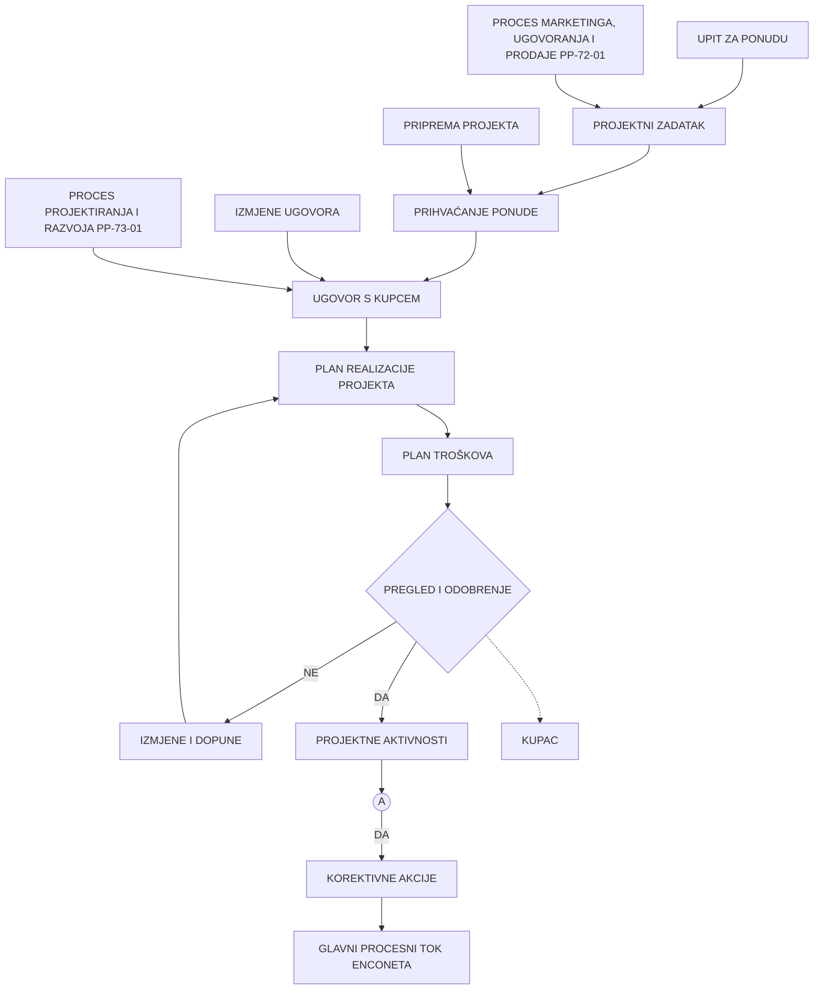
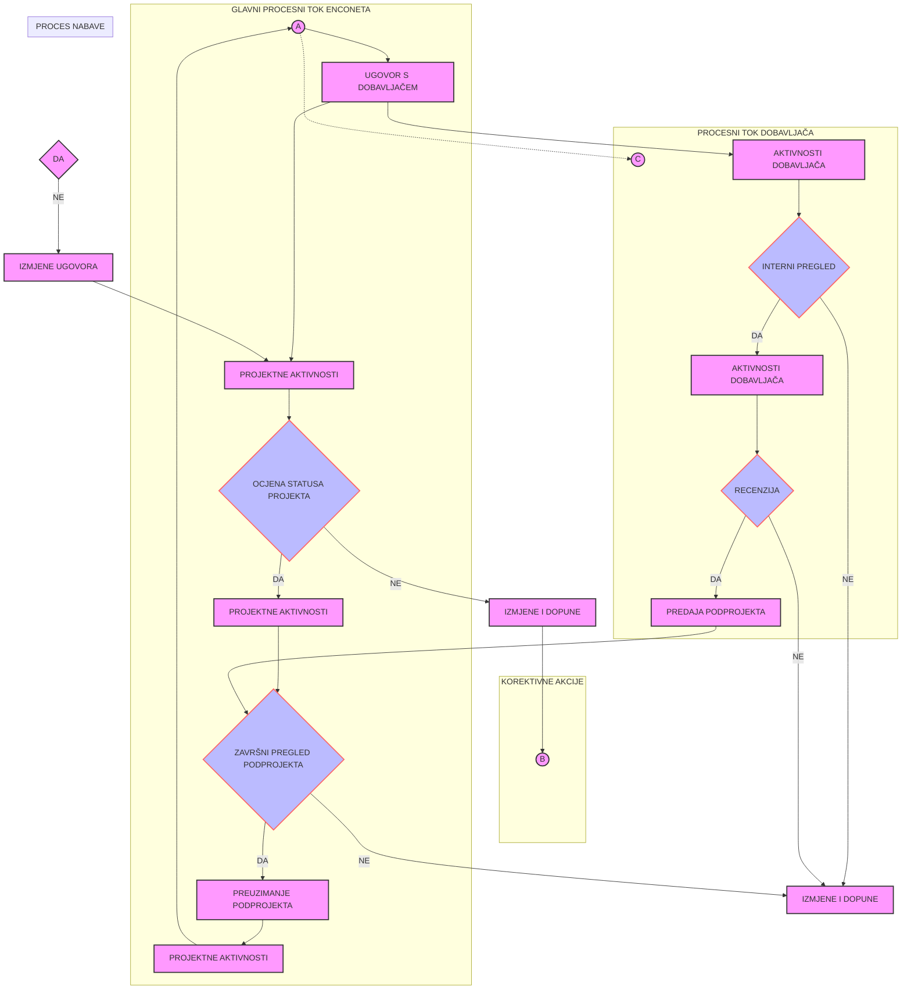
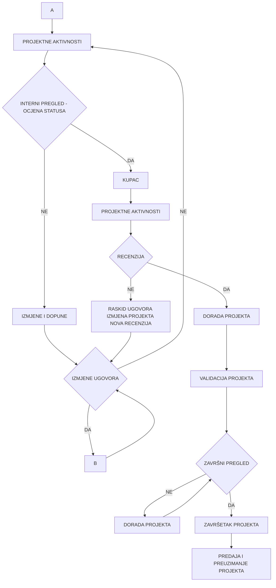

ENCONET d.o.o.

# PROCES PROJEKTIRANJA I RAZVOJA

| Naziv dokumenta:          | Programski postupak PP-73-01 |
|---------------------------|------------------------------|
| Revizija broj:            | 6                            |
| Datum objavljivanja:      | 17.11.2017.                  |
| Kontrolirana kopija broj: | ...........                  |

| Pripremio:                                | Datum       |
|-------------------------------------------|-------------|
| Vladimir Križe, voditelj QA                | 13. 11. 2017. |

| Pregledao:                                | Datum       |
|-------------------------------------------|-------------|
| mr.sc. Davor Šinka, stručni suradnik       | 14. 11. 2017. |

| Pregledao:                                | Datum       |
|-------------------------------------------|-------------|
| mr.sc. Ilijana Ivekovic, predstavnik direktora | 14. 11. 2017. |

| Odobrio:                                  | Datum       |
|-------------------------------------------|-------------|
| dr.sc. Nenad Debrecin, direktor            | 15. 11. 2017. |

## Periodični pregled

| Pregledao: | Datum: | Slijedeći pregled: |
|------------|--------|---------------------|
|            |        |                     |
|            |        |                     |
|            |        |                     |
---
| Programski postupak | Oznaka dok: | PP-73-01 |
|------------------------|--------------|-----------|
| PROCES PROJEKTIRANJA I RAZVOJA | Rev. 6 | Str: 2/19 |

# SADRŽAJ

1. SVRHA......................................................................................................3

2. PODRUČJE PRIMJENE ..........................................................................3

3. REFERENCE............................................................................................3

4. DEFINICIJE I KRATICE ...........................................................................3

5. ODGOVORNOSTI ....................................................................................4

6. POSTUPAK..............................................................................................4
6.1 Proces projektiranja i razvoja................................................................4
6.2 Izrada plana realizacije projektiranja i razvoja .....................................4
6.3 Utvrđivanje ulaznih podataka za projektiranje i razvoj........................5
6.4 Rezultati (izlazni podaci) projektiranja i razvoja ..................................6
6.5 Ocjena projektiranja i razvoja................................................................6
6.6 Ovjera/verifikacija projektiranja i razvoja .............................................6
6.7 Potvrđivanje prihvatljivosti/validacija projektiranja i razvoja .............8
6.8 Upravljanje promjenama u projektiranju i razvoju...............................9
6.9 Zaustavljanje procesa i daljnjih radova ................................................9
6.10 Proces projektiranja i razvoja softvera ...............................................10
6.11 Izdavanje izvještaja Enconeta o izvršenim radovima ........................10

7. PRILOZI .................................................................................................11
7.1 Dijagram toka projektiranja i razvoja.......................................................12
7.2 Obrazac: OB-NSP-022, R6 Naslovna strana projekta............................15
7.3 Obrazac: OB-USP-023, R6 Unutrašnja strana projekta .........................16
7.4 Obrazac: OB-INP-021, R6 Izvješće o internom pregledu ......................17
7.5 Obrazac: OB-ZPP-035, R6 Zapisnik o primopredaji proizvoda/usluge 18
7.6 Obrazac: OB-PIP-043, R6 Plan izvedbe projekta ...................................19

ENCONET d.o.o., Zagreb
---
Programski postupak                                                         Oznaka dok: PP-73-01
PROCES PROJEKTIRANJA I RAZVOJA                                               Rev. 6     Str: 3/19

## 1. SVRHA

Postupkom se utvrđuju aktivnosti i odgovornosti u procesu projektiranja i razvoja kao i njegovih izmjena ili modifikacija.

## 2. PODRUČJE PRIMJENE

Postupak se primjenjuje na sve projekte (studije, elaborate, stručne analize, računalne programe, te konzalting usluge projektnog, razvojnog ili uslužnog tipa) koje Enconet radi za kupca ili za vlastite potrebe.

## 3. REFERENCE

1. HRN EN ISO 9001:2015
   Sustavi upravljanja kvalitetom-Zahtjevi
   Projektiranje i razvoj

2. Enconet - Priručnik kvalitete PK
   Projektiranje i razvoj

3. IAEA Leadership and Management for Safety, IAEA Safety Standards Series,
   No. GSR Part 2, IAEA Vienna, 2016.

4. Enconet – Programski postupak PP-42-01
   "Upravljanje dokumentima"

5. Enconet – Programski postupak PP-72-01
   "Proces marketinga, ugovaranja i prodaje"

6. Enconet – Programski postupak PP-74-01
   "Proces nabave i ocjenjivanja dobavljača"

7. Enconet – Programski postupak PP-83-01
   "Upravljanje nesukladnim proizvodom"

8. Enconet – Programski postupak PP-85-01
   "Popravne i preventivne radnje"

9. ISO/IEC 90003:2004 – Software engineering Guidelines for the application of
   ISO 9001:2000 to computer software

10. USA standard, 10CFR50 App. B

## 4. DEFINICIJE I KRATICE

EN – Europska norma
Enconet - Enconet d.o.o.
HRN – Hrvatska norma
IAEA - Međunarodna agencija za atomsku energiju
IOD - Identifikacijska oznaka dokumenta
ISO - Međunarodna organizacija za normizaciju
ORG – Organizacija poslovanja E nconeta
PK  – Priručnik kvalitete
PP  – Programski postupak
QA  – Osiguravanje kvalitete
SUK – Sustav upravljanja kvalitetom

ENCONET d.o.o., Zagreb
---
Programski postupak                                                             Oznaka dok:   PP-73-01
PROCES PROJEKTIRANJA I RAZVOJA                                                  Rev.     6     Str:   4/19

## 5.      ODGOVORNOSTI

Direktor Enconeta odgovoran je za imenovanje voditelja projekta, njegove zamjene te za odobravanje i potvrđivanje projekta i izmjena ili modifikacija projekta.

Voditelj projekta odgovoran je za izradu Plana realizacije projekta; formiranje projektnog tima i koordinaciju njegovoga rada; provođenje projektnih aktivnosti sukladno utvrđenom Planu realizacije projekta; primjenu odgovarajućih zakona, propisa, standarda, te ispunjavanje ugovornih obveza i zahtjeva kvalitete u izvedbi projekta; iniciranje aktivnosti pregleda, ovjere i potvrđivanja projekta te primopredaje projekta kupcu. Posebno je odgovoran da održava sve zapise za svaki projekt od zahtjeva za ponudu/upita, ponude i ugovora/narudžbe preko plana i realizacije projekta sa svim pregledima, ovjerama i potvrdama do korespondencije s kupcem i zapisnika o primopredaji.

Voditelj QA poslova odgovoran je za interne provjere u procesu projektiranja i razvoja te provjeru da su sve popravne radnje i nesukladnosti na projektu provedene i zaključene.

## 6.      POSTUPAK

### 6.1     Proces projektiranja i razvoja

Osnovni proizvod Enconeta je «projekt» (projekt, studija, elaborat, stručna analiza, računalni program, konzalting i druge inženjerske usluge). Zato postupak realizacije projektiranja i razvoja znači i postupak realizacije proizvoda.

Priprema projekta počinje definiranjem projektnog zadatka, a završava potpisivanjem ugovora s kupcem. Sve aktivnosti izrade, pregleda, usuglašavanja i dokumentiranja obavljaju se prema zahtjevima postupka PP-72-01 (Ref. 5).

Proces projektiranja i razvoja obuhvaća slijedeće aktivnosti:

a) izradu plana realizacije projektiranja i razvoja
b) utvrđivanje ulaznih podataka za projektiranje i razvoj
c) izradu rezultata (izlaznih podataka) projektiranja i razvoja
d) ocjenu projektiranja i razvoja
e) provjera i ovjera/verifikacija projektiranja i razvoja
f) potvrđivanje prihvatljivosti/validacija projektiranja i razvoja
g) upravljanje promjenama u projektiranju i razvoju
h) identificiranje kritičnih točaka projekta (materijalni, terminski, ljudski), i određivanje utjecaja na projekt svake od njih, kao i vjerojatnost pojave

Format naslovne strane projekta definiran je obrascem OB-NSP-022, a unutarnje strane obrascem OB-USP-023 koji su priloženi u točki 7. ovog postupka.

### 6.2     Izrada plana realizacije projektiranja i razvoja

Djelotvorna izvedba projekta zahtijeva izradu Plana realizacije projekta kako bi se pravovremeno predvidjeli i utvrdili potrebni elementi kao što su:

a) terminski plan projekta po fazama (ako je svrsishodno)

ENCONET d.o.o., Zagreb
---
Programski postupak                                                              Oznaka dok: PP-73-01
PROCES PROJEKTIRANJA I RAZVOJA                                                    Rev. 6         Str: 5/19

b) kratki opis te ulazni i izlazni podaci za svaku fazu (dio procesa)
c) kontrolne točke za provjere, ovjeru, potvrđivanje prihvatljivosti, završni
   pregled i isporuku projekta
d) specifikacija i narudžba potrebne mjerne i druge opreme sa svim zahtjevima
   uključujući kalibraciju i rekalibraciju
e) definiranje tko, što, gdje i kada, s kojom mjernom opremom i po kojem
   postupku mjeri, koji su kriteriji prihvatljivosti te tko ih je definirao (kupac,
   zakon, standard/norma, Enconet i sl.)
f) imenovanje internih i vanjskih učesnika projektnog tima (po fazama), te
   njihove odgovornosti i ovlasti. Jedan od učesnika projektnog tima treba biti
   predstavnik QA službe
g) utvrđivanje i osiguranje veza i komunikacija s kupcem (vidi PP-72-01 točka
   6.3) i između internih i vanjskih grupa (timova) koji su uključeni u aktivnosti
h) predviđanje ažuriranja izlaznih podataka
i) planiranje i utvrđivanje troškova

Kod izrade Plana realizacije svakog projekta, voditelj projekta će polaziti od
politike i ciljeva kvalitete utvrđenih u Priručniku kvalitete (PK5.3 i PK5.4) i drugim
dokumentima, a posebno će voditi računa o zahtjevima za konkretan projekt.
Plan realizacije projekta izraditi će u dokumentiranoj formi a sadržaj Plana, točka
6.2 a) do 6.2 i) ovisi o karakteru, obimu i složenosti projekta. Za male i
jednostavne projekte Plan projekta se može izraditi pomoću obrasca: OB-PIP-
043 «Plan izvedbe projekta», koji je priložen u Prilogu ovog postupka.

Ovisno o veličini i složenosti projekta, te broju unutrašnjih i vanjskih suradnika,
voditelj projekta utvrđuje i osigurava djelovanje veza i komunikacija tijekom
realizacije projekta. Razni postupci za veze i komunikacije služe za međusobno
informiranje o podacima i rješenjima, raščišćavanje nejasnih pitanja,
prijem/predaju ulaznih/izlaznih podataka, izvješćivanje i t.d. Metode veza i
komuniciranja mogu biti: izravni razgovori (sastanci), pismeni dopisi, telefonski
razgovori, e-mail pošta, razne prezentacije i slično.

Voditelj projekta voditi će i ažurirati Popis i status svih projekata.

## 6.3 Utvrđivanje ulaznih podataka za projektiranje i razvoj

Ulazni podaci za projektiranje i razvoj povezani su sa zahtjevima kupca za
proizvod koji su definirani u Ugovoru. U prvoj fazi utvrđivanja ulaznih podataka za
projektiranje i razvoj treba, ako je svrsishodno, izraditi specifikaciju za proizvod.

Kako bi ulazni podaci bili potpuni, nedvosmisleni i međusobno neproturječni, sve
nejasne i sporne zahtjeve treba rješavati u komunikaciji s kupcem. Jedino tako
utvrđeni ulazni zahtjevi osiguravaju efikasnu realizaciju proizvoda u cilju
zadovoljenja zahtjeva i očekivanja kupaca.

Ulazni podaci za projektiranje i razvoj, osim ostalog, moraju sadržavati:

- zahtjeve na funkciju i karakteristike proizvoda
- odgovarajuće zakonske i pravne zahtjeve
- podatke od prijašnjih sličnih projekata, kada su primjenjivi

ENCONET d.o.o., Zagreb
---
# Programski postupak
## PROCES PROJEKTIRANJA I RAZVOJA

Oznaka dok: PP-73-01
Rev. 6      Str: 6/19

Prije same primjene u procesu projektiranja i razvoja, ulazne podatke treba pregledati, ocijeniti i potvrditi da su potpuni, nedvosmisleni i neproturječni.

Voditelj projekta odgovoran je za postupak rješavanja nejasnoća i utvrđivanje ulaznih podataka za projektiranje i razvoj. Dužan je dati ocjenu ulaznih podataka i zahtjeva za projektiranje i razvoj/proizvod u rubrici I «Tehnički zahtjevi» obrasca OB-OZP-034 «Ocjena zahtjeva za proizvod», priloženog u postupku PP-72-01 «Proces marketinga, ugovaranja i prodaje». Odgovoran je za održavanje svih zapisa o usuglašavanju, utvrđivanju i ocjeni ulaznih podataka.

### 6.4 Rezultati (izlazni podaci) projektiranja i razvoja

Rezultati (izlazni podaci) projektiranja i razvoja, koji su sadržani u projektno-tehničkoj dokumentaciji za određeni proizvod, moraju jasno i nedvosmisleno definirati proizvod sa svim potrebnim karakteristikama. Njihov obim i oblik ovisi o karakteru i složenosti projekta ali moraju:

- biti u obliku koji omogućava verifikaciju projektiranja i razvoja u skladu s podacima za projektiranje i razvoj
- biti odobreni prije objavljivanja
- ispuniti zahtjeve ulaznih podataka za projektiranje i razvoj
- dati potrebne informacije za nabavu i realizaciju proizvoda
- definirati kriterije prihvatljivosti ili na njih upućivati
- utvrditi karakteristike proizvoda koje su bitne za njegovu sigurnu i ispravnu uporabu

Voditelj projekta odgovoran je da rezultati projektiranja i razvoja (izlazni podaci) ispunjavaju navedene zahtjeve.

### 6.5 Ocjena projektiranja i razvoja

Kontinuirana provjera stanja i rezultata projektiranja i razvoja obavlja se tijekom realizacije pojedinih faza procesa projektiranja i razvoja. Za takvu provjeru odgovoran je izvršitelj svake pojedine faze odnosno dijela procesa projektiranja i razvoja.

Sustavne provjere i, ako je potrebno, ocjene projektiranja i razvoja provode se u primjerenim fazama. U skladu s utvrđenim Planom realizacije projekta (točka 6.2) potrebno je:

- ocijeniti mogućnosti za ispunjavanje zahtjeva projektiranja
- identificirati probleme i predložiti radnje za njihovo uklanjanje

Voditelj projekta odgovoran je za donošenje ocjene projektiranja i razvoja, poduzimanje potrebnih radnji i održavanje zapisa o tim ocjenama i radnjama.

### 6.6 Ovjera/verifikacija projektiranja i razvoja

Tijekom odvijanja procesa, Direktor Enconeta osigurava provjeru, i ovjeru odnosno verifikaciju projektiranja i razvoja da se utvrdi:

a) kako napreduje realizacija projekta

ENCONET d.o.o., Zagreb
---
Programski postupak                                                             Oznaka dok: PP-73-01
PROCES PROJEKTIRANJA I RAZVOJA                                                  Rev. 6        Str: 7/19

b) da li rezultati projektiranja i razvoja (izlazni podaci) udovoljavaju ulaznim
   podacima i zahtjevima

U tu svrhu, provode se interne i/ili vanjske neovisne provjere, i ovjere/verifikacije
projekta, po određenim fazama i/ili na kraju procesa projektiranja i razvoja. Na
osnovu rezultata ovih aktivnosti provode se potrebne popravne radnje i dorade
projekta. Tada se može obaviti završni pregled i potvrditi prihvatljivost projekta.

Radi pregleda i verifikacije voditelj projekta je dužan da nultu (preliminarnu)
reviziju projekta, odnosno pojedine faze projekta, dostavi:

- stručnoj neovisnoj osobi unutar Enconeta, ako je određena,
- voditelju QA u Enconetu,
- kupcu,
- recenzentu, ako je određen od strane kupca

Rezultate pregleda, učesnici dostavljaju voditelju projekta, u pismenom obliku.

Voditelj projekta je odgovoran da rezultate svih pregleda (nalaza) analizira te
putem odgovarajućeg zapisa dokumentira svoje očitovanje o svim primjedbama i
prijedlozima s naznakom koje su od njih prihvatljive a koje nisu. Takav zapis
mora se održavati jer predstavlja sljedivu vezu između stare i nove revizije
projekta odnosno faze projekta. Ako neki učesnik pregleda svoje mišljenje
dade usmeno, voditelj projekta će, ako je to svrsishodno, obraditi i dokumentirati
prihvatljivost i takvog prijedloga.

Na osnovu rezultata internih i vanjskih pregleda (nalaza) i svojih zapisa voditelj
projekta, prema postupku PP-83-01 "Upravljanje nesukladnim proizvodom",
identificira i dokumentira sve nađene nesukladnosti. U daljnjem procesu
rješavanja nesukladnosti, a prema potrebi, inicira i provodi potrebne popravne
odnosno preventivne radnje prema postupku PP-85-01 "Popravne i preventivne
radnje" s ciljem da se:

a) riješe nađene nesukladnosti i izradi nova revizija projekta
b) osigura da se iste ili slične nesukladnosti ne ponove na budućim projektima.

U novoj reviziji projekta voditelj će, ako ocijeni za potrebno, na svrsishodan
način, naznačiti promjene u odnosu na prethodnu reviziju. Praktično
rješenje je, da se prije Sadržaja, doda sekcija "Informacija o reviziji", s
odgovarajućim opisom promjena.

Interne neovisne preglede stručnog dijela projektiranja i razvoja, ako je
potrebno, provodi ovlaštena osoba koja nije sudjelovala u izvedbi onog dijela
projekta za kojeg se obavlja provjera. QA inženjer provodi interni pregled projekta
sa stanovišta zadovoljenja zahtjeva kvalitete. Rezultati internih provjera upisuju
se u Izvješće o internom pregledu na obrascu OB-INP-021.

Pregled završne dokumentacije koja se odnosi na „safety related" funkcije
struktura, sistema i komponenti mora izvoditi nominirana, nezavisna i kvalificirana
osoba koja nije uključena u izvedbu projekta i dokumentacije. Nadležnost,
obaveze i kvalificiranost nezavisne osobe zadužene za pregled moraju biti jasno
definirani i specificirani.

ENCONET d.o.o., Zagreb
---
Programski postupak                                                             Oznaka dok: PP-73-01
PROCES PROJEKTIRANJA I RAZVOJA                                                   Rev. 6         Str: 8/19

Vanjsku neovisnu ovjeru/verifikaciju projektiranja i razvoja provodi kupac i/ili recenzent. Recenzent je neovisna ovlaštena osoba/institucija, koja nije sudjelovala u izvedbi onog dijela projekta za koji se obavlja ovjera/verifikacija projektiranja i razvoja. Osobu/instituciju koja obavlja recenziju određuje kupac.

Rezultate vanjske ovjere/verifikacije kupac odnosno recenzent daje u pismenom obliku. U pismenom izvješću o obavljenom pregledu odnosno ovjeri/verifikaciji projektiranja i razvoja, navodi se stranica, poglavlje, točka i stavak na koji se odnosi primjedba, zahtjev za doradom ili odstupanje od zakonskih, ugovornih ili zahtjeva kvalitete. Također, izvješće se mora referirati na one kriterije prihvatljivosti prema kojima se uspoređuju projektni rezultati i podaci, te treba navesti i identifikacijsku oznaku radnog dokumenta koji je pregledavan. Ovjera/verifikacija projektiranja i razvoja može biti provedena korištenjem raznih metoda što ovisi o obimu i složenosti projekta.

Posebne projektne aktivnosti predstavljaju izvedba, nadzor, pregled i preuzimanje dijela projekta/podprojekta ugovorenog s vanjskom institucijom odnosno dobavljačem, a za potrebe izvedbe glavnog projekta ugovorenog s kupcem. U takvom slučaju voditelj projekta mora posebnu pozornost posvetiti projektnim međuvezama, ispunjavanju zahtjeva kvalitete prema glavnom ugovoru, te provođenju provjere, ovjere i potvrđivanja podprojekta kod podugovarača sukladno zahtjevima kupca. Aktivnosti se provode prema zahtjevima postupka PP-74-01 (Ref. 6).

## 6.7 Potvrđivanje prihvatljivosti/validacija projektiranja i razvoja

Postupak potvrđivanja prihvatljivosti ili validacija projektiranja i razvoja, Enconet provodi kako bi se osiguralo i potvrdilo da proizvod/projekt može ispuniti zahtjeve za namijenjenu ili predviđenu uporabu. Postupak potvrđivanja prihvatljivosti projekta obavlja se u cijelosti prije isporuke, a kada postoje razlozi da to nije moguće napraviti, onda validaciju treba provesti za onaj dio proizvoda/projekta za kojega je to moguće (djelomična validacija).

U svrhu potvrđivanja projekta, a prije završnog pregleda i isporuke kupcu, voditelj QA mora od voditelja projekta dobiti sve rezultate internih faznih pregleda, mišljenja kupca i vanjske recenzije te provjeriti i utvrditi da su sve prijavljene popravne i preventivne radnje i nesukladnosti na projektu zaključene.

Završni pregled obavlja i projekt potpisuje direktor Enconeta, ili druga ovlaštena osoba čime potvrđuje prihvatljivost projekta da može ispuniti zahtjeve za određenu primjenu ili predviđenu uporabu.

Voditelj projekta dodjeljuje IOD broj projekta. Odgovoran je da, uz «Zapisnik o primopredaji prizvoda/usluge» (obrazac: OB-ZPP-035), odnosno «Dostavnu listu kontroliranih kopija dokumenta» (obrazac OB-DLK-010) preda kupcu traženi broj primjeraka projekta. Odgovoran je da, uz ostale zapise na projektu, održava i zapise o svim unutrašnjim i vanjskim provjerama, ovjeri/verifikaciji, potvrđivanju prihvatljivosti/validaciji, zapis o primopredaji i izvršenim radnjama, koje su iz toga proizašle. Administrator urudžbira projekt kao kontrolirani dokument (ZK1).

ENCONET d.o.o., Zagreb
---
Programski postupak                                                            Oznaka dok: PP-73-01
PROCES PROJEKTIRANJA I RAZVOJA                                                  Rev. 6         Str: 9/19

## 6.8 Upravljanje promjenama u projektiranju i razvoju

Izmjene ili modifikacije projektnih zadataka identificiraju se, dokumentiraju i odobravaju od ovlaštene osobe po istom postupku kao i osnovni projekt.

Voditelj projekta, kada je to svrsishodno, provodi ili organizira provođenje postupka ocjene, ovjere i utvrđivanja prihvatljivosti promjene.

Ocjena promjene sadrži i ocjenu posljedica promjene na ranije isporučene iste ili slične projekte i njihove pojedine dijelove.

Direktor Enconeta odobrava promjene projekta prije primjene.

Voditelj projekta odgovoran je da se promjene projekta unesu u odgovarajuće dokumente i da se sve osobe i organizacije, na koje se odnosi promjena, odmah obavijeste o promjeni te da održava zapise o rezultatima ocjene promjena i potrebnih radnji.

## 6.9 Zaustavljanje procesa i daljnjih radova

Izdavanje naloga i provođenje zaštitne mjere zaustavljanja procesa i daljnjih radova primjenjuje se samo u slučajevima stvarne ili potencijalne nesukladnosti koja može izazvati znatne materijalne štete i gubitke radi nekvalitete, te ugroziti sigurnost ljudi i izazvati trajne posljedice u okolišu. Takav slijed događanja neminovno bi doveo do značajnog gubitka ugleda tvrtke, a posljedice bi dugoročno utjecale na neostvarivanje politike i ciljeva kvalitete.

Pokretanje takve zaštitne mjere može biti inicirano nizom prethodnih aktivnosti kojima se utvrdilo određeno stanje štetno za kvalitetu, a popravne i/ili preventivne radnje nisu provedene ili su bile neučinkovite. Također, može biti izazvano analizom provedenom radi pronalaženja uzroka nesukladnosti ili reklamacija kupaca, a da se kroz duže vrijeme nije donijelo ili nije moglo donijeti odgovarajuće rješenje.

Voditelj QA poslova izdaje nalog o zaustavljanju procesa i daljnjih radova odnosno zabranu korištenja određenog proizvoda i/ili dokumentacije. Nalog se upisuje u obrascu OB-NCR-016 i rješava prema postupku PP-83-01 (Ref. 7), a na dokumentaciju se utiskuje žig "QA zaustavljeni radovi" određenog oblika i načina korištenja prema postupku PP-42-01 (Ref. 4) odnosno naljepnica istog sadržaja na nesukladni proizvod. Dokumentacija odnosno proizvod povlači se iz korištenja i čuva na izoliranom mjestu kako bi se onemogućilo nehotično korištenje.

Nakon što su provedene popravne i/ili preventivne radnje, prikupljeni zapisi kvalitete za potvrđivanje rješenja nesukladnosti, voditelj QA poslova zaključuje obrazac OB-NCR-016 i ukida zaštitnu mjeru zaustavljanja radova.

ENCONET d.o.o., Zagreb
---
Programski postupak                                                             Oznaka dok: PP-73-01
PROCES PROJEKTIRANJA I RAZVOJA                                                  Rev. 6        Str: 10/19

## 6.10 Proces projektiranja i razvoja softvera

Izrada softvera nije osnovna djelatnost Enconeta. Međutim, isporuka softvera
određene namjene, može se pojaviti kao dio ugovorne obveze Enconeta prema
kupcu. U tom slučaju, takav softverski proizvod Enconet može:

- nabaviti na tržištu kao gotov proizvod,
- nabaviti na tržištu te doraditi za potrebe korisnika,
- nabaviti od odobrenog dobavljača.

U svakom slučaju Enconet je odgovoran za zadovoljenje propisanih zahtjeva.
Osim zahtjeva, propisanih u standardima i postupcima iz točke 3 ovog postupka
(vrijede za cjelokupni asortiman), Enconet će se pridržavati i specifičnih zahtjeva
koje, za projektiranje i razvoj softvera, propisuje međunarodna norma ISO/IEC
90003 «Software engineering – Gudeline for the application of ISO
9001:2000 to computer software».

Enconet će osigurati da se njegovi dobavljači softvera pridržavaju navedenih
zahtjeva te da se, kao i ostali dobavljači, vrednuju i ocjenjuju prema postupku
PP-74-01, «Proces nabave i ocjenjivanja dobavljača».

Zavisno od namjene i složenosti te od toga da li je softver nabavljen na tržištu (sa
ili bez dorade) ili je nabavljen od odobrenog dobavljača, voditelj projekta je
odgovoran da planira i provodi potrebne aktivnosti (komunikacija, izbor, nabava,
pregled i preuzimanje, dorada, nadzor, instalacija i testiranje te izrada uputa za
korištenje i održavanje), u skladu s navedenim zahtjevima kako bi se osiguralo i
dokumentiralo:
- da je, na svrsishodan način, proveden postupak verifikacije softvera, a
  minimalno test prihvatljivosti u uvjetima korisnika, kojim se verificira i
  potvrđuje prihvatljivost softvera u odnosu na kriterije prihvatljivosti,
- da se razne verzije softvera jednoznačno identificiraju i dokumentiraju i
  tako osigurava upravljanje konfiguracijom,
- da je definiran postupak odnosno upute (Priručnik) za korištenje i
  održavanje softvera do trenutka povlačenja verzije iz uporabe.

## 6.11 Izdavanje izvještaja Enconeta o izvršenim radovima

Po završetku ugovorenih radova (projekta), Enconet u dogovoru s naručiteljem
(kupcem) izrađuje završni konačni izvještaj. Format naslovne strane izvještaja
prikazan je na obrascu OB-NSP-022, Naslovna strana projekta. Potpisnici su
voditelj (autor), suradnici, QA inženjer (voditelj) i direktor Enconeta. Za NE Krško
izrađuju se dvije vrste izvještaja i to „Status Report" i „Outage Report". Format i
sadržaj izvještaja usklađuju se sa specifikom područja radova (projekta) i
posebnim zahtjevima predstavnika NE Krško.

ENCONET d.o.o., Zagreb
---
Programski postupak                                                      Oznaka dok: PP-73-01
PROCES PROJEKTIRANJA I RAZVOJA                                            Rev. 6          Str: 11/19

## 7. PRILOZI

7.1     Dijagram toka projektiranja i razvoja
7.2     Obrazac: OB-NSP-022              Naslovna strana projekta
7.3     Obrazac: OB-USP-023              Unutrašnja strana projekta
7.4     Obrazac: OB-INP-021              Izvješće o internom pregledu
7.5     Obrazac: OB-ZPP-035              Zapisnik o primopredaji proizvoda/usluge
7.6     Obrazac: OB-PIP-043              Plan izvedbe projekta

_______________________________________________________________
ENCONET d.o.o., Zagreb
---
Programski postupak                                                      Oznaka dok:        PP-73-01
PROCES PROJEKTIRANJA I RAZVOJA                                            Rev. 6            Str: 12/19

### 7.1 Dijagram toka projektiranja i razvoja

ENCONET d.o.o., Zagreb
---
Programski postupak | Oznaka dok: PP-73-01
PROCES PROJEKTIRANJA I RAZVOJA | Rev. 6 | Str: 13/19

ENCONET d.o.o., Zagreb
---

Programski postupak
PROCES PROJEKTIRANJA I RAZVOJA

Oznaka dok: PP-73-01
Rev. 6 Str: 14/19

KOREKTIVNE AKCIJE GLAVNI PROCESNI TOK ENCONETA

[The flowchart above represents the main process flow of ENCONET's project design and development process, including corrective actions.]

ENCONET d.o.o., Zagreb
---
Programski postupak                                                         Oznaka dok: PP-73-01
PROCES PROJEKTIRANJA I RAZVOJA                                               Rev: 6        Str: 15/19

### 7.2 Obrazac: OB-NSP-022, R6 Naslovna strana projekta

ENCONET d.o.o.

**(NASLOV DOKUMENTA)**

| Polje | Vrijednost |
|-------|------------|
| Naručitelj: | (naziv tvrtke) |
| Ugovor broj: | (broj ugovora) |
| Vrsta dokumenta: | (studija, projektna dokumentacija itd.) |
| Revizija broj: | (broj) |
| Kontrolirana kopija broj: | (broj) |
| IOD: | (IOD broj dokumenta) |
| Datum: | (datum objavljivanja) |

| Uloga | Ime i prezime |
|-------|---------------|
| Voditelj: | (ime i prezime, titula) |
| Suradnici: | (ime i prezime, titula)   (ime i prezime, titula) |

| Uloga | Potpis |
|-------|--------|
| Voditelj QA: | (Potpis)   _________________________   (ime i prezime, titula) |
| Direktor: | (Potpis)   _________________________   (ime i prezime, titula) |

(Zagreb, mjesec, godina)

----

ENCONET d.o.o., Zagreb
---
| Programski postupak | Oznaka dok: | PP-73-01 |
|------------------------|--------------|-----------|
| PROCES PROJEKTIRANJA I RAZVOJA | Rev: 6 | Str: 16/19 |

### 7.3 Obrazac: OB-USP-023, R6 Unutrašnja strana projekta

1. (NASLOV POGLAVLJA)

1.1 (Naslov podpoglavlja)

(Tekst dokumenta)

----

ENCONET d.o.o., Zagreb
---
| Programski postupak | Oznaka dok: | PP-73-01 |
|------------------------|--------------|------------|
| PROCES PROJEKTIRANJA I RAZVOJA | Rev: 6 | Str: 17/19 |

### 7.4 Obrazac: OB-INP-021, R6 Izvješće o internom pregledu

| IOD: |
|------|
| IZVJEŠĆE O INTERNOM PREGLEDU |

Datum:

#### I. Provjeravano područje / aktivnost

Referentni dokumenti:

#### II. Utvrđeno stanje

| Provjerio: | Potpis: | Datum: |
|------------|---------|--------|
|            |         |        |

| Odgovorna osoba: | Potpis: | Datum: |
|-------------------|---------|--------|
|                   |         |        |

#### III. Predložena popravna / preventivna radnja

| Predložio: | Potpis: | Datum: |
|------------|---------|--------|
|            |         |        |

#### IV. Napomena

| Izvjestio: | Potpis: | Datum: |
|------------|---------|--------|
|            |         |        |

#### V. Zaključak

| Voditelj QA poslova: | Potpis: | Datum: |
|----------------------|---------|--------|
|                      |         |        |

----

ENCONET d.o.o., Zagreb
---

Programski postupak                                                       Oznaka dok:         PP-73-01
PROCES PROJEKTIRANJA I RAZVOJA                                             Rev:    6          Str: 18/19
7.5 Obrazac: OB-ZPP-035, R6 Zapisnik o primopredaji proizvoda/usluge

# ZAPISNIK
O PRIMOPREDAJI PROIZVODA / USLUGE

IOD: ZPP-

1. Naručitelj:                   (Naziv/adresa Naručitelja)

2. Izvršitelj:                   ENCONET d.o.o., Miramarska 20, Zagreb

3. Ugovor/Narudžba:              (Broj Ugovora/Narudžbe)

4. Naziv proizvoda/usluge: (Naziv/opis proizvoda/usluge)

5 Datum izvršenja:               (Datum)

6. Proizvod/usluga je izvršena sukladno s kriterijima prihvaćanja odnosno zahtjevima iz
   Ugovora/Narudžbe

7. Datum ovog Zapisnika smatra se datumom preuzimanja proizvoda/usluge od strane
   Naručitelja.

8. Zapisnik je sastavljen u 2 (dva) istovjetna primjerka, koji svojim potpisom ovjeravaju
   obje strane kao dokaz o izvršenom odnosno preuzetom proizvodu/usluzi.

9. PRIMOPREDAJA:

   Za (Naziv Naručitelja)

   Primio:               (Ime i prezime, funkcija)                 Potpis ____________________

   Za ENCONET d.o.o.

   Predao:               (Ime i prezime, funkcija)                 Potpis ____________________

Zagreb, (Datum)

_____________________________________________________________________
                                     ENCONET d.o.o., Zagreb

---
Programski postupak                                                         Oznaka dok:        PP-73-01
PROCES PROJEKTIRANJA I RAZVOJA                                               Rev:    6         Str: 19/19

7.6 Obrazac: OB-PIP-043, R6 Plan izvedbe projekta

PLAN IZVEDBE PROJEKTA                                                IOD: PL-

1. Oznaka/naziv projekta:

2. Zahtjevi za projekt:

3. Faze, rokovi (terminski plan) i učesnici:

| Rbr faze | Naziv/kratki opis faze (točke sadržaja) projekta | Rok izvršenja | Učešće u projektu |
|----------|--------------------------------------------------|---------------|-------------------|
|          |                                                  |               | Učesnik | % |
|          |                                                  |               |         |   |
|          |                                                  |               |         |   |
|          |                                                  |               |         |   |
|          |                                                  |               |         |   |

4. Kontrolne točke i kriteriji prihvatljivosti:
   -
   -
   -
   -
5. Praćenje i nadzor izvedbe projekta:
   a) Stručno praćenje i nadzor: (voditelj projekta)
   b) QA nadzor: QA inženjer, voditelj QA

6. Komunikacija (odgovorne osobe):
   - Enconet:
   - Kupac:

7. Referentna dokumentacija:
   - Ugovor/narudžba br:
   - Sustav upravljanja kvalitetom Enconeta - SUK
     (ISO 9001:2015; 10CFR50, App B;
     IAEA Safety Standards Series, No. GSR Part 2)
   -

Datum:                                                           Voditelj Projekta:

                                                           ________________________________
                                                                     (Ime i prezime)

_____________________________________________________________________
                                       ENCONET d.o.o., Zagreb