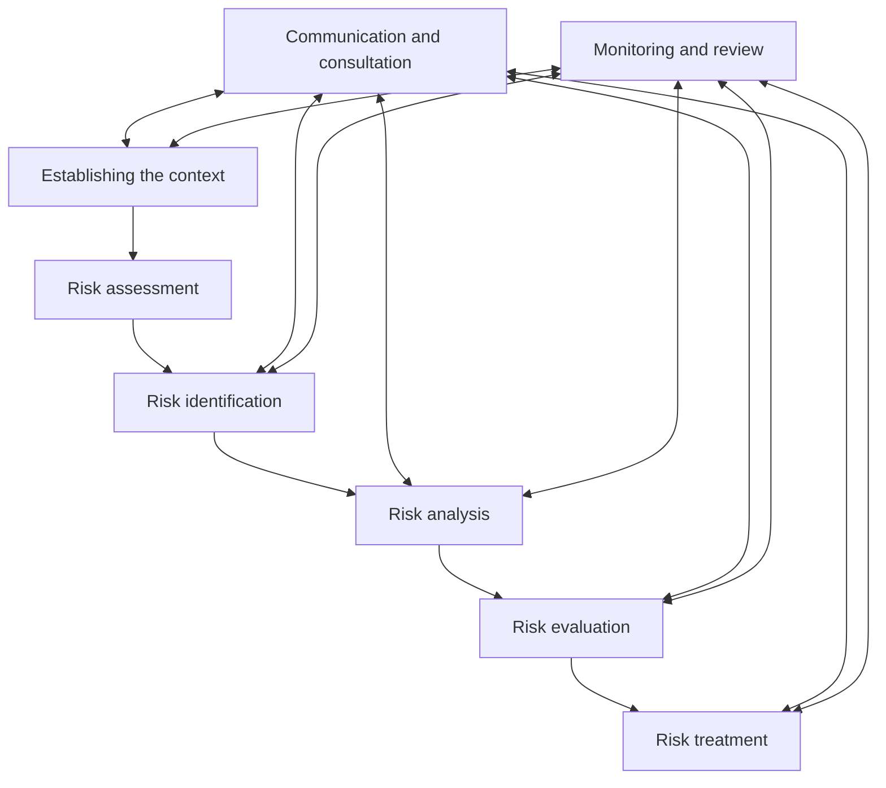

ENCONET d.o.o.

# UPRAVLJANJE RIZICIMA

| Naziv dokumenta:         | Programski postupak PP-85-02 |
|--------------------------|------------------------------|
| Revizija broj:           | 2                            |
| Datum objavljivanja:     | 19.10.2018.                  |
| Kontrolirana kopija broj: |                              |

| Uloga     | Ime i prezime                                 | Datum      |
|-----------|-----------------------------------------------|------------|
| Pripremio | Vladimir Križe, voditelj QA                   | 09.10.2018. |
| Pregledao | dr. sc. Davor Šinka, stručni suradnik         | 16.10.2018. |
| Pregledao | mr. sc. Ilijana Iveković, predstavnik direktora | 16.10.2018. |
| Odobrio   | dr. sc. Nenad Debrecin, direktor              | 18.10.2018. |

## Periodični pregled

| Pregledao | Datum | Sljedeći pregled |
|-----------|-------|------------------|
|           |       |                  |
|           |       |                  |
|           |       |                  |
---
Programski postupak | Oznaka dok: PP-85-02
UPRAVLJANJE RIZICIMA | Rev. 2 | Str: 2/13

# SADRŽAJ

1. SVRHA......................................................................................................3

2. PODRUČJE PRIMJENE ...........................................................................3

3. REFERENCE.............................................................................................3

4. DEFINICIJE I KRATICE ............................................................................3

5. ODGOVORNOSTI.....................................................................................3

6. POSTUPAK UPRAVLJANJA RIZICIMA ..................................................5
6.1 Proces upravljanja rizicima ....................................................................5
6.2 Identifikacija rizika..................................................................................5
6.3 Procjena vjerojatnosti ............................................................................5
6.4 Procjena posljedica................................................................................6
6.5 Ocjena (evaluation) rizika ......................................................................6
6.6 Obrada (treatment) rizika .......................................................................6

7. PRILOZI ....................................................................................................6

ENCONET d.o.o., Zagreb
---
Programski postupak                                    Oznaka dok: PP-85-02
UPRAVLJANJE RIZICIMA                                    Rev. 2      Str: 3/13

## 1. SVRHA

Postupak je napisan sa svrhom da se odrede sve aktivnosti u procesu upravljanja rizicima koji se mogu pojaviti u poslovnim procesima Enconeta.

## 2. PODRUČJE PRIMJENE

Postupak se primjenjuje na sve proizvode i usluge firme Enconet (projekte, studije, elaborate, stručne analize, računalne programe, te konzalting usluge projektnog, razvojnog ili uslužnog tipa) koje se rade za kupca ili za vlastite potrebe, kod kojih se utvrdi odstupanje od zahtjeva definiranih u provođenju sustava upravljanja, uključivši i popratnu dokumentaciju.

## 3. REFERENCE

1. HRN EN ISO 9001:2015
   Sustavi upravljanja kvalitetom-Zahtjevi

2. PK-SUK-001
   Priručnik kvalitete norma-ISO 9001:2015

3. Upravljanje rizicima ISO 31000:2009

## 4. DEFINICIJE I KRATICE

| Kratica | Značenje                        |
|---------|----------------------------------|
| EN      | Europska norma                   |
| HRN     | Hrvatska norma                   |
| PK      | Priručnik kvalitete              |
| PP      | Programski postupak              |
| QA      | Osiguranje kvalitete             |
| SUK     | Sustav upravljanja kvalitetom    |

## 5. ODGOVORNOSTI

### Direktor Enconeta

Odgovoran je za cjelokupni proces upravljanja rizicima.

### Voditelj projekta

Za projekte za koji su zaduženi, voditelji projekta dužni su izvesti ocjenu (procjenu, assessment) rizika i rezultate predstaviti predstavniku direktora za nadzor SUK-a, da bi se rezultati ocjene (procjene, assessment) obradili i provele akcije u smislu ublažavanja posljedica rizika ili potpunog uklanjanja uzroka rizika.

ENCONET d.o.o., Zagreb
---
Programski postupak                                                            Oznaka dok: PP-85-02
UPRAVLJANJE RIZICIMA                                                            Rev. 2         Str: 4/13

Svaki voditelj projekta dužan je učiniti ocjenu (procjenu, assessment) rizika za projekt za koji je zadužen kao i predložiti akcije potrebne da se negativne posljedice rizika maksimalno umanje ili kompletno uklone. Tijekom postupka potrebno je uzeti u obzir i koristiti sve elemente koji omogućuju efikasnost i vjerodostojnost rezultata, kao što su:

- Uspostava konteksta
- Komunikacija i konzultacije
- Praćenje i preispitivanje

Postupak ocjene (procjene, assessment) se izvodi po slijedećim fazama:

- Identifikacija rizika
- Analiza rizika (procjena vjerojatnosti i posljedica)
- Ocjena (evaluation) rizika

Predstavnik direktora za nadzor SUK-a

Rezultati ocjene (procjene, assessment) rizika proslijeđuju se predstavniku direktora za nadzor SUK-a koji u suradnji s voditeljem projekta provodi obradu (treatment) rizika u smislu ublažavanja posljedica rizika ili potpunog uklanjanja uzroka rizika.
Ukoliko su rizici neprihvatljivi, određuju se korektivne mjere i postupak se ponavlja dok se rizici ne smanje do razumnog i prihvatljivog nivoa.
Predstavnik direktora za nadzor SUK-a je vlasnik procesa i odgovoran je za nadzor provedbe opisanog procesa te održavanje dokumentiranog postupka.

Voditelj osiguranja kvalitete

Prati izvođenje procesa, po potrebi sudjeluje u fazi procjene (assessment) i obrade (treatment). Arhivira rezultate kao zapise kvalitete.

ENCONET d.o.o., Zagreb
---
Programski postupak                                                            Oznaka dok: PP-85-02
UPRAVLJANJE RIZICIMA                                                           Rev. 2         Str: 5/13

## 6. POSTUPAK UPRAVLJANJA RIZICIMA

### 6.1 Proces upravljanja rizicima

### 6.2 Identifikacija rizika

Za svaki projekt potrebno je procijeniti koje kategorije rizika su primjerene i stoga ih je potrebno detaljno analizirati i evaluirati.
U tablici 1. Identifikacija rizika navedene sve moguće (generičke) kategorije rizika uz dodatno objašnjenje koji su to elementi koji bi mogli određenu kategoriju postaviti u kritičnu zonu i zahtijevati primjenu kompletnog postupka procjene prilika.

### 6.3 Procjena vjerojatnosti

Za identificiranu kategoriju potencijalnog rizika i element koji bi tu kategoriju mogao svrstati u kritičnu zonu, potrebno je procijeniti vjerojatnost takve pretpostavke.

ENCONET d.o.o., Zagreb
---
Programski postupak                                                             Oznaka dok: PP-85-02
UPRAVLJANJE RIZICIMA                                                             Rev. 2      Str: 6/13

U tablici 2. Procjena vjerojatnosti navedene su kvalitativne mjere u pet kategorija koji određuju procjenu vjerojatnosti da se dogode neželjeni događaji koji mogu ugroziti izvedbu projekta. Kvalitativne mjere (1, 2, 3, 4 ,5) se koriste u tablici 4. Ocjena (evaluation) rizika, gdje se određuju moguće posljedice rizičnog događaja, ukoliko se ne primjene korektivne mjere da se rizici umanje ili uklone.

## 6.4 Procjena posljedica

Posljedice neželjenog događaja procjenjuju se na temelju tablice 3. Procjena posljedica, koja također određuje pet stupnjeva kvalitativnih mjera. Kvalitativne mjere (1, 2, 3, 4 ,5) se koriste u tablici 4. Ocjena (evaluation) rizika, za konačnu ocjenu nivoa posljedica rizika.

## 6.5 Ocjena (evaluation) rizika

Posljedice procijenjenog rizika određuju se u tablici 4. Ocjena (evaluation) rizika. Na temelju nivoa kvalitativnih mjera iz tablica 2. Procjena vjerojatnosti i 3. Procjena posljedica, određuju se moguće posljedice ukoliko se izvor rizika ne smanji ili ukloni.

## 6.6 Obrada (treatment) rizika

Obzirom na nivo i ozbiljnost posljedica rizika, tablica 5. Obrada (treatment) rizika određuje akcije u smislu ublažavanja ili, ukoliko je to moguće, otklanjanja rizika, koji može biti visoki, srednji ili niski.

## 7. PRILOZI

7.1 Identifikacija rizika
7.2 Procjena vjerojatnosti rizika
7.3 Procjena posljedica rizika
7.4 Ocjena (evaluation) rizika
7.5 Obrada (treatment) rizika
7.6 Ocjena projekta – ZAPIS KVALITETE

ENCONET d.o.o., Zagreb
---
Programski postupak                                                 Oznaka dok:    PP-85-02
UPRAVLJANJE RIZICIMA                                                Rev: 2         Str: 7/13

7.1    Identifikacija rizika

1. Identifikacija rizika

Uobičajeno se u literaturi navode 22 vrste, odnosno izvora rizika koji se mogu pripisati
bilo kojem projektu. Ti su rizici popisani i objašnjeni u donjoj tablici.

| Br. | Kategorija rizika | Objašnjenje |
|-----|-------------------|-------------|
| 1 | Podrška menadžmenta | Podrška menadžmenta je ključni element za uspješnost projekta. Menadžment ne smije zanemarivati projektne sastanke i komunikaciju. Eventualna neslaganja oko ključnih pitanja na projektu moraju se minimizirati. |
| 2 | Opseg | Opseg projekta mora biti precizno definiran. Opseg mora biti izvršen u cijelosti. Posebna je opasnost od kontinuiranih (puzajućih) promjena opsega koje napuhavaju projekt. |
| 3 | Upravljanje troškovima | Troškove projekta potrebno je što je moguće točnije procijeniti. Za vrijeme provedbe projekta potrebno je troškovima upravljati. S time u svezi potrebno je izgraditi sistematičan pristup procjeni i upravljanju troškovima. |
| 4 | Upravljanje promjenama | Za vrijeme provedbe projekta javljaju se zahtjevi za promjenama. Ti zahtjevi utječu na opseg i potom na troškove projekta. S time u svezi potrebno je izgraditi sistematičan pristup upravljanju promjenama. |
| 5 | Dionici | Negativan stav dionika spram projekta je jedan od najznačajnijih rizika projekta. Nejasna očekivanja, izostavljanje (nepozivanje) važnih dionika, nerazumijevanja i potencijalni sukobi među dionicima glavni su izvori ove kategorije rizika. |
| 6 | Komunikacija | Kvaliteta komunikacije na provedbi projekta iznimno je važan izvor rizika projekta. Komunikacija ne smije biti podcijenjena, niti precijenjena. |
| 7 | Ljudski resursi i projektni tim | Nedostatak ljudskih resursa, neadekvatne vještine, neiskustvo, nesklonost projektu, niska motivacija, nedostatak edukacijskih programa i slično, izvori su uzroci su ove kategorije rizika. |
| 8 | Arhitektura proizvoda | Oblik i sadržaj (arhitektura) proizvoda koji predstavlja rezultat projekta moraju biti jasno definirani. Proizvod koji predstavlja rezultat projekta mora biti jasno definiran. Ako je proizvod studija, onda se radi o obliku i sadržaju studije. |
| 9 | Dizajn proizvoda | Dizajn proizvoda mora biti jasno određen. Ako je proizvod studija, onda je njen dizajn određen odgovarajućom QA procedurom. |
| 10 | Tehnologija | Odnosi se na kvalitetu komponenti koje čine proizvod. Ako je proizvod studija, onda su to separati koje izrađuju podizvođači. |
| 11 | Integracija | Potrebno je razmotriti probleme koji se mogu pojaviti u postupku integracije komponenti u krajnji proizvod. Ako je proizvod studija, onda se radi o integraciji separata u okviru studije. |
| 12 | Zahtjevi | Zahtjevi na projektu moraju biti u skladu sa strategijom tvrtke. Zahtjevi moraju biti u skladu s pravilima struke (propisima). Zahtjevi ne smiju biti nejasni i tako otvoriti mogućnost različitim interpretacijama. |
| 13 | Odlučivanje i rješavanje problema | Kašnjenje u donošenju odluka vezanih za projekt kao i nepravovremeno (nekvalitetno) rješavanje problema na projektu glavni su izvori ove kategorije rizika. |
| 14 | Nabava | Skup rizika vezanih za nabavu podrazumijevaju: nejasan opseg nabave, konflikti s dobavljačima, konflikti među dobavljačima, kašnjenja s isporukama, nekvalitetne isporuke, neprihvatljivi uvjeti nabave i slično. |
| 15 | Nadležnosti | Nadležnosti svakog sudionika na projektu moraju biti jasno definirane. |
| 16 | Odobrenja | Odgode različitih odobrenja koje se odnose na projekt (odgode rokova) glavni su izvori ove kategorije rizika. |
| 17 | Organizacija | Organizacija na provedbi projekta treba biti jasno definirana. |
| 18 | Vanjski uzroci | Promjene regulative, viša sila, tržište, tehnološki razvoj i promjena poslovne politike tvrtke čine vanjske rizike projekta. |
| 19 | Upravljanje projektom | Osnovni zahtjev je da se treba pridržavati zacrtane metodologije rada. Ne smije se gubiti kontrola nad projektom. Potrebno je izgraditi sustav upravljanja projektom. |
| 20 | Sekundarni uzroci | Prebacivanje rizika provedbe projekta na nabavu predstavlja sekundarni uzrok koji može ugroziti projekt. Ovaj rizik se vrlo često previđa. |
| 21 | Prihvaćanje proizvoda od strane kupaca | Potrebno je detektirati uzroke koji mogu dovesti do toga da kupci ne prihvate proizvod koji predstavlja rezultat projekta. |
| 22 | Komercijalni uzroci | Potrebno je detektirati uzroke koji mogu dovesti do komercijalnog neuspjeha proizvoda koji predstavlja rezultat projekta. |

ENCONET d.o.o., Zagreb
---
Programski postupak                                                 Oznaka dok:    PP-85-02
UPRAVLJANJE RIZICIMA                                                Rev: 2        Str: 8/13

## 7.2    Procjena vjerojatnosti rizika

### 2. Procjena vjerojatnosti rizika

Vezano za procjenu vjerojatnosti neželjenih događaja koji mogu ugroziti provedbu projekta primjenjuje se sljedeća kvalitativna tablica.

| Kvalitativna mjera | Opis mjere | Objašnjenje |
|-------------------|------------|-------------|
| 5 | Gotovo sigurno | Neželjeni događaj se vrlo često pojavljuje |
| 4 | Vrlo vjerojatno | Neželjeni događaj se često pojavljuje |
| 3 | Moguće | Pojava neželjenog događaja se očekuje |
| 2 | Malo vjerojatno | Neželjeni događaj se može pojaviti, ali rijetko |
| 1 | Gotovo nikada | Neželjeni događaj se može pojaviti, ali samo u rijetkim (specifičnim) uvjetima |

ENCONET d.o.o., Zagreb
---
Programski postupak                                   Oznaka dok:    PP-85-02
UPRAVLJANJE RIZICIMA                                   Rev: 2         Str: 9/13

### 7.3 Procjena posljedica rizika

#### 3. Procjena posljedica rizika

Posljedice neželjenog događaja procjenjuju se na temelju sljedeće kvalitativne tablice.

| Kvalitativna mjera | Opis mjere | Financijski gubitak | Gubitak reputacije | Stupanj nesuglasnosti |
|:-------------------|:-----------|:--------------------|:-------------------|:----------------------|
| 1 | Zanemarivo | Zanemariv gubitak | Zanemariv gubitak | Zanemarive nesukladnosti |
| 2 | Manje značajno | Manji gubitak | Manji gubitak | Manje nesukladnosti |
| 3 | Značajno | Značajan gubitak | Značajan gubitak | Značajne nesukladnosti |
| 4 | Vrlo značajno | Veliki gubitak | Veliki gubitak | Velike nesukladnosti |
| 5 | Kritično | Kritični gubitak | Kritični gubitak | Kritične nesuglasnosti |

ENCONET d.o.o., Zagreb
---
Programski postupak                                                     Oznaka dok:     PP-85-02
UPRAVLJANJE RIZICIMA                                                     Rev:    2      Str: 10/13

### 7.4     Ocjena (evaluation) rizika

#### 4. Ocjena (evaluation) rizika
Rizik se ocjenjuje (evaluira) temeljem sljedeće matrice dimenzije 5×5.

| Vjerojatnost | Zanemarivo | Manje značajno | Značajno | Vrlo značajno | Kritično |
|--------------|------------|----------------|----------|---------------|----------|
|              | 1          | 2              | 3        | 4             | 5        |
| 5            | 5          | 10             | 15       | 20            | 25       |
| 4            | 4          | 8              | 12       | 16            | 20       |
| 3            | 3          | 6              | 9        | 12            | 15       |
| 2            | 2          | 4              | 6        | 8             | 10       |
| 1            | 1          | 2              | 3        | 4             | 5        |

| Vrijednost | Razina rizika |
|------------|---------------|
| ≥15        | Visoki rizik  |
| 5-12       | Srednji rizik |
| ≤4         | Niski rizik   |

ENCONET d.o.o., Zagreb
---
Programski postupak                                   Oznaka dok:    PP-85-02
UPRAVLJANJE RIZICIMA                                 Rev: 2        Str: 11/13

## 7.5    Obrada (treatment) rizika

### 5. Obrada (treatment) rizika

Gore ocijenjeni (evaluirani) rizici obrađuju se prema donjoj tablici.

| Razina rizika | Opis postupanja |
|---------------|-----------------|
| Visoki rizik  | Zahtijeva se hitno djelovanje. Voditelj projekta mora izraditi plan za upravljanje rizicima na projektu. Zahtijeva se aktivno uključenje menadžmenta. |
| Srednji rizik | Voditelj projekta mora posvetiti posebnu pozornost rizicima na projektu. Zahtijeva se da menadžment bude informiran. |
| Niski rizik   | Voditelj projekta upravlja rizicima na rutinski način. |

ENCONET d.o.o., Zagreb
---
Programski postupak                                                 Oznaka dok:    PP-85-02
UPRAVLJANJE RIZICIMA                                                Rev: 2        Str: 12/13

## 7.6    Ocjena projekta – ZAPIS KVALITETE

Naziv projekta:
Obveza Enconeta:
Ugovor br.:
Projektni tim Enconeta:

### 1. Identifikacija rizika

| Br. | Kategorija rizika | Identifikacija |
|-----|-------------------|----------------|
| 1   | Podrška menadžmenta |               |
| 2   | Opseg |               |
| 3   | Upravljanje troškovima |               |
| 4   | Upravljanje promjenama |               |
| 5   | Dionici |               |
| 6   | Komunikacija |               |
| 7   | Ljudski resursi i projektni tim |               |
| 8   | Arhitektura proizvoda |               |
| 9   | Dizajn proizvoda |               |
| 10  | Tehnologija |               |
| 11  | Integracija |               |
| 12  | Zahtjevi |               |
| 13  | Odlučivanje i rješavanje problema |               |
| 14  | Nabava |               |
| 15  | Nadležnosti |               |
| 16  | Odobrenja |               |
| 17  | Organizacija |               |
| 18  | Vanjski uzroci |               |
| 19  | Upravljanje projektom |               |
| 20  | Sekundarni uzroci |               |
| 21  | Prihvaćanje proizvoda od strane kupaca |               |
| 22  | Komercijalni uzroci |               |

### 2. Procjena vjerojatnosti uzroka

| Kvalitativna mjera | Opis mjere | Procjena uzroka |
|--------------------|------------|-----------------|
| 5 | Gotovo sigurno |                 |
| 4 | Vrlo vjerojatno |                 |
| 3 | Moguće |                 |
| 2 | Malo vjerojatno |                 |
| 1 | Gotovo nikada |                 |

### 3. Procjena posljedica

| Kvalitativna mjera | Opis mjere | Financijski gubitak | Gubitak reputacije | Stupanj nesuglasnosti |
|--------------------|------------|---------------------|--------------------|-----------------------|
| 1 | Zanemarivo |                     |                    |                       |
| 2 | Manje značajno |                     |                    |                       |
| 3 | Značajno |                     |                    |                       |
| 4 | Vrlo značajno |                     |                    |                       |
| 5 | Kritično |                     |                    |                       |

ENCONET d.o.o., Zagreb
---
Programski postupak                                                 Oznaka dok:    PP-85-02
UPRAVLJANJE RIZICIMA                                                Rev: 2         Str: 13/13

## 4. Ocjena rizika

| Br. | Kategorija rizika | Ocjena |
|-----|-------------------|--------|
| 1   | Podrška menadžmenta |        |
| 2   | Opseg |        |
| 3   | Upravljanje troškovima |        |
| 4   | Upravljanje promjenama |        |
| 5   | Dionici |        |
| 6   | Komunikacija |        |
| 7   | Ljudski resursi i projektni tim |        |
| 8   | Arhitektura proizvoda |        |
| 9   | Dizajn proizvoda |        |
| 10  | Tehnologija |        |
| 11  | Integracija |        |
| 12  | Zahtjevi |        |
| 13  | Odlučivanje i rješavanje problema |        |
| 14  | Nabava |        |
| 15  | Nadležnosti |        |
| 16  | Odobrenja |        |
| 17  | Organizacija |        |
| 18  | Vanjski uzroci |        |
| 19  | Upravljanje projektom |        |
| 20  | Sekundarni uzroci |        |
| 21  | Prihvaćanje proizvoda od strane kupaca |        |
| 22  | Komercijalni uzroci |        |

| Vjerojatnost | Zanemarivo | Manje značajno | Značajno | Vrlo značajno | Kritično |
|--------------|------------|----------------|----------|---------------|----------|
|              | 1          | 2              | 3        | 4             | 5        |
| 5            |            |                |          |               |          |
| 4            |            |                |          |               |          |
| 3            |            |                |          |               |          |
| 2            |            |                |          |               |          |
| 1            |            |                |          |               |          |

## 5. Postupanje s rizicima

| Razina rizika | Postupanje |
|---------------|------------|
| Visoki rizik  | Zahtijeva se hitno djelovanje. Voditelj projekta mora izraditi plan za upravljanje rizicima na projektu. Zahtijeva se aktivno uključenje menadžmenta. |
| Srednji rizik | Voditelj projekta mora posvetiti posebnu pozornost rizicima na projektu. Zahtijeva se da menadžment bude informiran. |
| Niski rizik   | Voditelj projekta upravlja rizicima na rutinski način. |

## 6. Poduzete akcije

___________________________________________________________________________
___________________________________________________________________________
___________________________________________________________________________

___________________________________________________________________________
ENCONET d.o.o., Zagreb