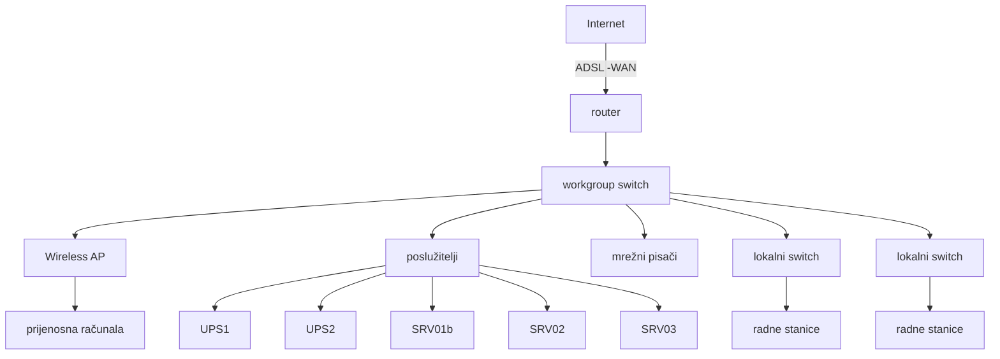

ENCONET d.o.o. logo

# ODRŽAVANJE RAČUNALNE INFRASTRUKTURE

| Vrsta i oznaka dokumenta: | Radna uputa RU-42-03 |
|---------------------------|----------------------|
| Revizija broj:            | 2                    |
| Datum objavljivanja:      | 17.11.2017.          |

Kontrolirana kopija broj: ....

| Pripremio: | (Josip Skupnjak, stručni suradnik) | 13.11.2017. Datum |
|------------|-------------------------------------|-------------------|
| Pregledao: | (Vladimir Krže, voditelj QA)        | 14.11.2017. Datum |
| Odobrio:   | (dr.sc. Nenad Debrecin, direktor)   | 15.11.2017. Datum |

## Periodični pregled

| Pregledao: | Datum: | Slijedeći pregled: |
|------------|--------|---------------------|
|            |        |                     |
|            |        |                     |
|            |        |                     |
---
RADNA UPUTA                                                                                                                     naziv dok: RU-42-03
Održavanje računalne infrastrukture                                                                                               rev: 2               str: 2/21

## SADRŽAJ

1. Svrha.............................................................................................................................................. 4
2. Područje primjene ......................................................................................................................... 4
3. Odgovornosti ................................................................................................................................. 4
4. Reference....................................................................................................................................... 5
5. Opis računalne mreže .................................................................................................................... 6
6. Poslužitelj srv01b .......................................................................................................................... 9
   6.1 Organiziranje prostora za privatne podatke ( mapa WG_private )...................................... 10
   6.2 Prostor za pojednostavljenu razmjenu dokumenata (mape WG_public-read_write i
   WG_public\read_write_unrestrict.del!)......................................................................................... 10
      6.2.1 Mapa WG_public-read_write...................................................................................... 10
      6.2.2 Mapa WG_public-read_write_unrestrict.del!............................................................. 11
   6.3 Pristup resursima od zajedničkog interesa (mapa WG_public-read_only ) ........................ 11
7. Sustav za čuvanje pričuvnih kopija (korisničkih) podataka........................................................ 12
   7.1 Podešavanje automatskog pokretanja programa SyncToy prilikom gašenja računala. ....... 12
8. Praćenje rada računalnog sustava i pohrane pričuvnih kopija podataka..................................... 14
   8.1 Praćenje rada od strane korisnika radnih stanica................................................................. 14
   8.2 Praćenje rada računalnog sustava i stanja poslužitelja srv01b ............................................ 14
9. Prilozi .......................................................................................................................................... 15

ENCONET d.o.o. Zagreb
---
RADNA UPUTA                                                                                                               naziv dok: RU-42-03
Održavanje računalne infrastrukture                                                                                         rev: 2             str: 3/21

Popis tablica:
Tablica 1: Pregled poslužitelja ............................................................................................................. 7
Tablica 2: Izgled tabele za administratorsku evidenciju stanja poslužitelja ...................................... 15
Tablica 3: Pregled komponenata računalne mreže ............................................................................ 16
Tablica 4: Pregled računalne opreme ................................................................................................ 20

Popis slika:
Slika 1: Shematski prikaz lokalne mreže naše tvrtke............................................................................. 6
Slika 2: Podešavanje pokretanja programa 'SyncToy'........................................................................ 13

ENCONET d.o.o. Zagreb
---
RADNA UPUTA                                                                                   naziv dok: RU-42-03
Održavanje računalne infrastrukture                                                             rev: 2         str: 4/21

# 1. Svrha

Ovaj dokument opisuje računalnu mrežu tvrtke Enconet d.o.o. Daje pregled i organizaciju poslužitelja tvrtke te njihovu namjenu, kao i pregled računalne opreme. Ima zadatak upoznati uposlenike sa važnošću brige o vlastitim dokumentima, kao o drugima koji su im dati na raspolaganje. U svrhu toga se opisuje način održavanja pričuvnih kopija podataka sa računala korisnika te čuvanje baze glavnog popisa dokumenata (GPD).

Zbog promjena u strukturi i organizaciji tvrtke kao i zbog promjena u računalnim tehnologijama, dokument po svom obimu i sadržaju zamjenjuje stare dokumente (radne upute) koji prestaju biti važeći te se više ne primjenjuju. :

1. RU-42-01,R0 (Održavanje back-up kopija GPD-a)

2. RU-42-02,R0 (Izrada i održavanje sigurnosnih kopija)

3. RU-63-01,R0 (Preventivno održavanje računalne opreme i mreže)

# 2. Područje primjene

Područje primjene se odnosi na podršku u preventivnom održavanju:
- pričuvnih kopija korisničkih podataka svih radnih stanica
- pričuvnih kopija baze glavnog popisa dokumenata i drugih podataka na poslužiteljima

# 3. Odgovornosti

Za brigu o vlastitim podacima, radu povjerene im opreme te za praćenje rada sustava za čuvanje pričuvnih kopija vlastitih dokumenata, kako je opisano u točki 8.1 odgovorni i zaduženi su svi korisnici.

Za brigu o radu poslužitelja, mreže, tj. sustava u cjelini, kako je opisano u točki 8.2 odgovoran je administrator računalnog sustava.

ENCONET d.o.o. Zagreb
---
| RADNA UPUTA | naziv dok: RU-42-03 |
|---------------|----------------------|
| Održavanje računalne infrastrukture | rev: 2    str: 5/21 |

## 4. Reference

1. Enconet - Priručnik kvalitete PK
   Zahtjevi koji se odnose na dokumentaciju

2. Enconet - Programski postupak PP - 42 - 01
   Upravljanje dokumentima

ENCONET d.o.o. Zagreb
---
RADNA UPUTA                                                                                        naziv dok: RU-42-03
Održavanje računalne infrastrukture                                                                 rev: 2          str: 6/21

## 5. Opis računalne mreže

Struktura naše lokalne mreže - LAN (Local Area Network), izgleda kako je prikazano (Slika 1: Shematski prikaz lokalne mreže)

Slika 1: Shematski prikaz lokalne mreže naše tvrtke

ENCONET d.o.o. Zagreb
---
RADNA UPUTA                                                                                      naziv dok: RU-42-03
Održavanje računalne infrastrukture                                                               rev: 2          str: 7/21

Prikazani su karakteristični elementi sustava - radne stanice tj. desktop ili prijenosna računala pojedinih korisnika (na slici: 4 i 8), mrežni pisači (5), poslužitelji (3), uređaji za preklapanje i usmjeravanje mrežnog prometa (1, 2, 6 i 7). Infrastruktura na slici prikazana crvenom bojom je ilustracija lokalnog, a zelenom, vanjskog protoka podataka. Plavom bojom su označene linije besprekidnog napajanja energijom. Detaljan i pregledan popis komponenata u mreži dat je tabelarno u prilogu (Tablica 3: Pregled komponenata računalne mreže).

Vezu sa svijetom omogućava usmjerivač (1 –ADSL/WAN router). Svaki uređaj u mreži ima svoju jedinstvenu IP adresu. No, ponuditelj usluge spajanja za Internet (u našem slučaju to je tvrtka T-com) nije u mogućnosti omogućiti cijelu klasu adresa korisnicima na uporabu, te se zbog toga pribjeglo NAT (Network Address Translation) mehanizmu prebacivanja javnih adresa u privatne (za javne adrese kaže se da je to 'vanjska' mreža, a za privatne adrese da je to 'unutarnja' mreža). O tome brine namjenski uređaj router/firewall (1) koji osim prevođenja IP adresa ima i ostale elemente zaštite unutarnje mreže, kao što je zaštita od DoS napada i slično.

U prilogu (Tablica 3: Pregled komponenata računalne mreže) se daje uvid i u IP adrese dodijeljene pojedinim uređajima u mreži. Privatne IP adrese su fiksno određene (postavljene na mrežnom adapteru svakog uređaja) u području od 192.168.0.1 do 192.168.0.255. Dinamičko dodjeljivanje (DHCP) je onemogućeno. Prijenosni uređaji spojeni na wireless AP (6) se nalaze u izoliranom adresnom prostoru koji se dinamički dodjeljuje (poseban DHCP servis wireless routera) i ne mogu pristupiti uređajima iz prve skupine –moguća je samo veza prema Internetu. Ova postavka je definirana u workgroup switchu (2) formiranjem tri port-based VLAN (Virtual Local Area Network) grupe.

U dokumentu Enconet -InfoConfig.xls se nalazi detaljan plan konfiguracijskih postavki računalne i telefonske infrastrukture.

Prema shemi na slici poslužitelji (3) su u unutarnjoj mreži. Namjene i organizacija poslužitelja je prikazana u tablici (Tablica 1):

Tablica 1: Pregled poslužitelja

| Naziv poslužitelja | IP adresa    | Namjena i opis |
|-------------------|--------------|----------------|
| Srv01b            | 192.168.0.15 | Pohrana pričuvnih kopija podataka sa svih radnih stanica u mreži, file sharing poslužitelj. Operativni sustav: MS Windows 2003, Server |
| Srv03             | 192.168.0.65 | Torrent i file sharing poslužitelj. Operativni sustav: MS Windows XP |

ENCONET d.o.o. Zagreb
---
RADNA UPUTA                                                                                     naziv dok: RU-42-03
Održavanje računalne infrastrukture                                                              rev: 2         str: 8/21

Radne stanice (Slika 1, komponente označene brojem 4) su osobna ili prijenosna računala pojedinih
korisnika s operativnim sustavom MS Windows XP ili MS Windows 7. Na svakom računalu su
otvorena barem dva profila od kojih je uvijek samo jedan administratorski a svakodnevna upotreba
se odvija u tkzv. user profilu. Ovaj mehanizam se uvodi iz sigurnosnih razloga da bi se smanjila
mogućnost neželjenog instaliranja štetnih programa na računala korisnika (virusi, spyware). U tablici
(Tablica 3) iz priloga je prikazan popis korisnika koji koriste radne stanice u mreži. Sve radne
stanice participiraju u formiranoj radnoj grupi (Microsoftov 'File & Sharing' servis – workgroup),
naziva ENCONET_WG. U dokumentu Enconet -PswList.xls se nalazi popis korisničkih i
administratorskih profila na radnim stanicama u mreži, popis korisničkih profila na poslužiteljima te
sve pridružene zaporke. Ovaj dokument je u posjedu administratora sustava i direktora tvrtke. U
tablici (Tablica 4) se nalazi popis računalne opreme, evidentiran po korisnicima.

ENCONET d.o.o. Zagreb
---
RADNA UPUTA                                                                                     naziv dok: RU-42-03
Održavanje računalne infrastrukture                                                               rev: 2         str: 9/21

## 6. Poslužitelj srv01b

Centralno mjesto radne grupe ENCONET_WG je računalo, poslužitelj, srv01b. Zamišljeno je da se koristi kao tzv. file sharing server. Datotečni sustav i organizacija korisnika na ovom poslužitelju je izvršena tako da se zadovolje slijedeći ciljevi:

1. Automatizirati svakodnevno kreiranje pričuvnih kopija korisničkih dokumenata.
   Svakom je korisniku radne grupe na poslužitelju je kreiran zasebni, privatni prostor –mape za pohranu. Pristup ovom prostoru je dozvoljen samo njemu a osnovna namjena mu je čuvanje sigurnosnih kopija podataka s njegove radne stanice.

2. Unaprijediti i pojednostaviti razmjenu dokumenata u našoj organizaciji.
   Za ovu svrhu su na poslužitelju kreirane dijeljene mape kojima pristupaju svi korisnici grupe i koje bi trebale služiti za brzu razmjenu datoteka.

3. Olakšati pristup resursima od zajedničkog interesa
   Razne dokumente (publikacije, stručna literatura, standardi…) koje, u većoj ili manjoj mjeri, koriste svi uposlenici, valja držati na ovom mjestu.

Vezano za navedeno u stavci 1, kreirana je mapa WG_private (\\Srv01b\WG_private), u kojoj se nalaze podmape dodijeljene pojedinim korisnicima, npr. b_lukic, b_vrdoljak…itd.

Za ostvarivanje zadaća u stavkama 2 i 3, u javnoj zoni (\\Srv01b\WG_public), imamo tri razine pristupa koje omogućuju svima:
 -čitanje i pisanje read_write (ograničeno brisanje) (\\Srv01b\WG_public\read_write),
 -čitanje i pisanje read_write_unrestrict.del! ( \\Srv01b\WG_public\read_write_unrestrict.del),
 -čitanje read_only (zadaća pod 3) (\\Srv01b\WG_public\read_only)

Osim spomenutog, na poslužitelju su organizirane posebne grupe koje imaju nešto drugačiji režim i pravila korištenja. Radi se o grupama SUK, Administracija i Arhiva.
 • Specifičnost grupe SUK (skraćenica od 'Sustav Upravljanja Kvalitetom') je u tome što se koristi za dokumente koji su dozvoljeni za čitanje svim uposlenicima ali ih mijenjati mogu samo određeni korisnici.
 • Grupa 'Administracija' pripada izdvojenoj skupini korisnika, tj. sadrži dokumente koji su u domeni samo uposlenika u administraciji.
 • Grupa 'Arhiva' također pripada izdvojenoj skupini korisnika zaduženih za brigu o spremanju finalnih dokumenata ('proizvoda') tvrtke

Administrator poslužitelja određuje na koji način će se koristiti poslužitelj, i u tu svrhu kreira korisničke profile.
Svaki korisnik grupe definiran je korisničkim profilom. Korisnički profil je mjesto za određivanje prava, načina i razine pristupa određenim resursima servera i mreže. Organiziranjem korisnika u grupe mogu se na jednom mjestu određivati i definirati zajednička pristupna pravila za više korisnika.
U našoj mreži (ENCONET_WG), svi korisnici su članovi grupe WGusers.

ENCONET d.o.o. Zagreb
---
RADNA UPUTA                                                                                     naziv dok: RU-42-03
Održavanje računalne infrastrukture                                                             rev: 2         str: 10/21

## 6.1 Organiziranje prostora za privatne podatke ( mapa WG_private )

Svaki član radne grupe (workgroup ENCONET_WG) ovdje ima svoju mapu. Pristup sadržajima
unutar te mape je dozvoljen samo njemu.

Zamišljeno je da svaki korisnik ovaj 'privatni prostor' koristi za:

- sigurnosnu pohranu (backup) sadržaja sa svog računala (u ovu svrhu je kreirana podmapa
  sync)
- dodatni diskovni prostor, mapirani mrežni disk (u ovu svrhu će se koristiti podmapa home)

Korisniku je dozvoljeno:

- čitanje postojećih datoteka, listanje mapa, kopiranje sadržaja na vlastito računalo
- kreiranje novih datoteka i mapa (dakle, osim predefiniranih mapa sync i home, mogu se
  kreirati nove), brisanje i mijenjanje postojećih dokumenata, tj. kopiranje s vlastitog
  računala

Onemogućeno je:

- Izvršavanje programa (*.exe, *.com i sl. datoteke): korisnici i ovdje mogu držati izvršive
  datoteke (programe), ali je njihovo pokretanje moguće samo u okruženju vlastitog računala.
- Brisanje mapa sync i home, ali ne i njihovog sadržaja –zato valja pozornost posvetiti ovoj
  činjenici (naročito je to važno za mapu sync jer se u njoj nalazi backup)

## 6.2 Prostor za pojednostavljenu razmjenu dokumenata (mape WG_public-read_write i WG_public\read_write_unrestrict.del!)

Za ovu svrhu su organizirane dvije mape koje se razlikuju samo u definiciji prava korisnicima da
izbrišu sadržaje koji se u njima nalaze.

### 6.2.1 Mapa WG_public-read_write

Ova mapa, tj. njeni sadržaji (datoteke, programi, podmape), je dostupna svim članovima radne
grupe (workgroup ENCONET_WG), na način, tj. moguće je:

- čitanje postojećih datoteka, listanje mapa, kopiranje sadržaja na vlastito računalo
- kreiranje novih datoteka i mapa, kopiranje sadržaja s vlastitog računala
- brisati i mijenjati postojeće datoteke i mape mogu samo njihovi vlasnici, tj. članovi grupe
  koji su ih kreirali ili u ovaj prostor kopirali.

ENCONET d.o.o. Zagreb
---
RADNA UPUTA                                                                                     naziv dok: RU-42-03
Održavanje računalne infrastrukture                                                             rev: 2         str: 11/21

Izvršavanje programa (*.exe, *.com i sl. datoteke) je onemogućeno: korisnici bi ih trebali kopirati na
svoje računalo i pokretati iz svog okruženja

### 6.2.2 Mapa WG_public-read_write_unrestrict.del!

Ova mapa, tj. njeni sadržaji (datoteke, programi, podmape), je dostupna svim članovima radne
grupe (workgroup ENCONET_WG), na način, tj. moguće je:

- čitanje postojećih datoteka, listanje mapa, kopiranje sadržaja na vlastito računalo
- kreiranje novih datoteka i mapa, kopiranje sadržaja s vlastitog računala
- brisanje i mijenjanje postojećih sadržaja je dozvoljeno svima!

Izvršavanje programa (*.exe, *.com i sl. datoteke) je onemogućeno: korisnici bi ih trebali kopirati na
svoje računalo i pokretati iz svog okruženja

### 6.3 Pristup resursima od zajedničkog interesa (mapa WG_public-read_only )

Ova mapa, tj. njeni sadržaji (datoteke, programi, podmape), je dostupna svim članovima radne
grupe (workgroup ENCONET_WG), a dozvoljeno je:

- čitanje postojećih datoteka, listanje mapa, kopiranje svih sadržaja na vlastito računalo

Samo administrator grupe (WGadmin) može kreirati nove ili kopirati, brisati i mijenjati
postojeće datoteke i mape.

Izvršavanje programa (*.exe, *.com i sl. datoteke) je omogućeno samo iz mape installers, software
downloads, drivers.

ENCONET d.o.o. Zagreb
---
| RADNA UPUTA | naziv dok: RU-42-03 |
|-----------------|----------------------|
| Održavanje računalne infrastrukture | rev: 2 str: 12/21 |

## 7. Sustav za čuvanje pričuvnih kopija (korisničkih) podataka

Svaki korisnik računala (radne stanice) u suradnji s administratorom određuje koje podatke će održavati kao sigurnosne kopije. To su npr. podaci iz sistemskih mapa 'My Documents', 'Favorites', i 'Desktop'. Zatim, tu spadaju mape s elektroničkom poštom i adresar. Podatke, koje žele čuvati, korisnici na svojim računalima trebaju organizirati u smislene cjeline tj. podijeliti ih po mapama kako bi se izbjeglo spremanje cijelih diskova ili velikih količina 'nepotrebnih' podataka.

Nakon što se izvršila organizacija, administrator pristupa podešavanju programa 'SyncToy'. Za svakog korisnika izradi backup profil, tj. definira način izrade backup-a. Ovo je dovoljno učiniti jednom, a postavke se upisuju u tablicu koju svaki korisnik ima uz svoje računalo (Error! Reference source not found.).

Program 'SncToy' ima zadaću da u pravilnom vremenskom režimu, svakodnevno, nove podatke prepiše u privatni prostor svakog korisnika na računalu srv01b. Zbog toga se treba i pokretati svakodnevno –npr. prilikom gašenja računala (podešavanje je opisano u sekciji 7.1).

### 7.1 Podešavanje automatskog pokretanja programa SyncToy prilikom gašenja računala.

U ovu svrhu se koristi Group Policy Editor kao sučelje za podešavanje i upravljanje izvođenja tkzv. shut-down skripte tj. određujemo što će računalo izvršavati prilikom gašenja računala. Na ovom mjestu pozivamo naše prethodno organizirane SyncToy backup profile.

Podešavanje se izvodi na slijedeći način (Slika 2):
1. klik na Start, zatim Run, utipkati gpedit.msc
2. u grupi User Configuration kliknuti na Windows Settings i otvoriti Scripts (Logon/Logoff)
3. izabrati Logoff Properties
4. upisati novu skriptu (dugme Add...) tj. upisati prečac programa SyncToy:
   - u polje Script Name upisati (koristiti Browse...) C:\Program Files\SyncToy 2.1\SyncToyCmd.exe
   - u polje Script Parameters upisati –R
5. Potvrditi unos postavki klikom na OK dugme, zatvoriti Group Policy Editor

ENCONET d.o.o. Zagreb
---
RADNA UPUTA                                                  naziv dok: RU-42-03
Održavanje računalne infrastrukture                                     rev: 2      str: 13/21

| Group Policy                                                                                |
|--------------------------------------------------------------------------------------------|
| File Action View Help                                                                       |
| Local Computer Policy    Scripts (Logon/Logoff)                                             |
| Computer Configuration     Name                                                             |
|   Software Settings      Logoff    Logon                                                    |
|   Windows Settings                 Logoff                                                   |
|   Administrative Templates                                                                  |
| User Configuration        Display Properties                                                |
|   Software Settings                                                                         |
|   Windows Settings        Description:                                                      |
|     Scripts (Logon/Logoff) Contains user logoff scripts.                                    |
|     Security Settings                                                                       |
|     Internet Explorer Maint                                                                 |
|   Administrative Templates                                                                  |
|                           Logoff Properties                                                 |
|                             Scripts                                                         |
|                                                                                             |
|                               Logoff Scripts for Local Computer                             |
|                               Name                      Parameters                          |
|                               C:\Program Files\SyncT                                        |
|                                                                        Up                   |
|                                                                        Down                 |
|                                                                        Add                  |
|                                                                        Edit                 |
|                                                                        Remove               |
|                           To view the script files stored in this Group Policy Object, press|
|                           the button below                                                  |
|                                 Show Files                                                  |
| Extended   Standard                                                                         |
|                                                                                             |
| Run                       Edit Script                                                       |
| Type the name of a program, folder, document, or   Script Name:                             |
| Internet resource, and Windows will open it for you.  C:\Program Files\SyncToy 2.1\SyncToyCm|
| Open: gpedit.msc                                    Script Parameters:                      |
|                                                     R                                       |
| OK   Cancel   Browse...                             OK   Cancel                             |

Slika 2: Podešavanje pokretanja programa 'SyncToy'

Sada će operativni sustav, svaki puta prije gašenja računala, izvršiti aktivnosti predefinirane u
programu SyncToy, tj. izvršiti spremanje sigurnosnih kopija podataka na server srv01b.

ENCONET d.o.o. Zagreb
---
RADNA UPUTA                                                                                  naziv dok: RU-42-03
Održavanje računalne infrastrukture                                                          rev: 2         str: 14/21

## 8. Praćenje rada računalnog sustava i pohrane pričuvnih kopija podataka

### 8.1 Praćenje rada od strane korisnika radnih stanica

Korisnici prate rad programa SyncToy na svom računalu, tj. da li se podaci/mape koji su definirani u njihovom back-up profilu kopiraju u odgovarajući prostor na poslužitelju srv01b. Na primjer, za prethodni dan pogledaju što se nalazi u njihovom prostoru za privatne podatke na poslužitelju, provjere datume na mapama i datotekama koje su mijenjali. Također, prate stanje svojeg računala i rad programa koje koriste. O svim uočenim nedostacima izvještavaju administratora sustava.

### 8.2 Praćenje rada računalnog sustava i stanja poslužitelja srv01b

Oprema (računala, pisači, mrežni uređaji) treba biti konfigurirana i održavati se na potrebnom stupnju upotrebljivosti kako bi se osigurao rad operativnih aplikacija, sigurnost pohranjenih podataka i informacija te pouzdanost u razmjeni podataka i informacija između osoblja ENCONET doo kao i sa vanjskim suradnicima. Uvedene su adekvatne mjere zaštite kontrole pristupa računalima i informacijama i podacima, kao što su zaštita lozinkom i ograničenje pristupa. Vodi se briga o radu poslužitelja o čemu administrator vodi evidenciju (Tablica 2).

Također, administrator sustava povremeno prati korisničke aktivnosti vezane za pohranu njihovih pričuvnih kopija podataka na poslužitelj srv01b.

ENCONET d.o.o. Zagreb
---
RADNA UPUTA                                                                  naziv dok: RU-42-03
Održavanje računalne infrastrukture                                          rev: 2        str: 15/21

## 9. Prilozi

Tablica 2: Izgled tabele za administratorsku evidenciju stanja poslužitelja

| Evidencija stanja poslužitelja |
|--------------------------------|
| Poslužitelj: ............       | Administrator: .......... |
| stanje pričuvnih kopija korisničkih podataka / primjedbe i komentari na rad poslužitelja i opreme (UPS) / | potpis i datum |

ENCONET d.o.o. Zagreb
---
RADNA UPUTA                                                   naziv dok: RU-42-03
Održavanje računalne infrastrukture                                      rev: 2        str: 16/21

Tablica 3: Pregled komponenata računalne mreže

| korisnik / uređaj | naziv komponente (host name) u mreži ENCONET_WG | opis | IP adresa | MAC adresa | broj na priključnom panelu/zidu | broj na workgroup switchu |
|-------------------|------------------------------------------------|------|-----------|------------|----------------------------------|---------------------------|
| DSL-584T ADSL Router | | priključak na Iskon ADSL | 192.168.0.01 | 00-1C-F0-92-B2-3B | izravna veza | 1 |
| DI-624+ Wireless Broadband Router | | Enconet_Wireless AP | 192.168.0.03 | 00-13-46-45-5C-D6 | izravna veza | 13 |
| 24+2G PoE Management Switch SP1659P | | | 192.168.0.04 | 00-11-3B-09-F8-4E | / | / |
| Server srv01b (Win2003 server) | srv01.enconet.local | | 192.168.0.15 | 00-11-11-EF-B7-D0 | 14 | 25 |
| HP LaserJet 4000 | | laser CB printer | 192.168.0.31 | 00-60-B0-B7-E1-29 | 38 | 10 |
| SUN terminal (dio RODOS sustava) | rodos6.enconet.local | | 192.168.0.50 | 00-1B-21-0F-19-AD | 11 | 21 |
| Andrea Pirša | wks77 | | 192.168.0.52 | 00-0B-6A-B4-EC-81 | 44 | 8 |
| Dubravka Dončević | WKS07 | | 192.168.0.53 | 00-1B-78-3D-96-3B | 4 | 9 |

ENCONET d.o.o. Zagreb
---
RADNA UPUTA                                                 naziv dok: RU-42-03
Održavanje računalne infrastrukture                                    rev: 2     str: 17/21

| korisnik / uređaj | naziv komponente (host name) u mreži ENCONET_WG | opis | IP adresa | MAC adresa | broj na priključnom panelu/zidu | broj na workgroup switchu |
|-------------------|------------------------------------------------|------|-----------|------------|----------------------------------|---------------------------|
| Josip Skupnjak | WKS01 | | 192.168.0.54 | 00-50-BA-AA-4C-DA | 26 | 2 |
| Davor Šinka | | | 192.168.0.55 | 00-0E-7B-35-B3-93 | 26 | 2 |
| Matija Balić | wks12.enconet.local | | 192.168.0.56 | 00-1D-92-74-8A-57 | 28 | 4 |
| Boško Lukić | wks11.enconet.local | | 192.168.0.57 | 00-13-20-20-C7-14 | 28 | 4 |
| Vlado Križe | | | 192.168.0.59 | | 45 | 22 |
| Josip Vuković | ATHLON | | 192.168.0.61 | 00-0C-F1-7F-62-3B | 7 | 5 |
| Damir Konjarek | | | 192.168.0.62 | 00-19-D1-61-A1-73 | 8 | 7 |
| Ilijana Iveković | | | 192.168.0.63 | 00-21-5A-72-EF-92 | 5 | 3 |
| Josip Skupnjak | J_Skupnjak_NB | | 192.168.0.64 | | 26 | 2 |

ENCONET d.o.o. Zagreb
---
RADNA UPUTA                                                   naziv dok: RU-42-03
Održavanje računalne infrastrukture                                      rev: 2    str: 18/21

| korisnik / uređaj | naziv komponente (host name) u mreži ENCONET_WG | opis | IP adresa | MAC adresa | broj na priključnom panelu/zidu | broj na workgroup switchu |
|-------------------|----------------------------------------------|------|-----------|------------|--------------------------------|---------------------------|
| srv03 -torrent server (bivši HFS web server) | srv03 | nalazi se uz OKI printer | 192.168.0.65 | 00-50-BA-06-01-10 | | |
| Dejan Škanata | dejan-tecra | | 192.168.0.66 | 00-23-18-93-34-55 | 30 | 6 |
| Barbara Vrdoljak | wks06b.enconet.local | | 192.168.0.69 | 00-21-5A-1F-A7-1F | 25 | 16 |
| OKI C5750 (dio RODOS sustava) | | laser printer, kolorac | 192.168.0.70 | 00-80-87-6B-E5-B7 | 38 | 10 |
| HP DeskJet 6127 | | ink jet printer, kolorac | 192.168.0.71 | 00-30-6E-2F-DC-EC | 38 | 10 |
| HP LaserJet P2015 | NPIE949CF | laser CB printer | 192.168.0.72 | 00-14-38-E9-49-CF | 38 | 10 |
| HP Officejet 7000 E809a (A3) | HPBE9BDB | | 192.168.0.77 | | 38 | |
| Ivan Horvatović | I_HORVATOVIC_PC | | 192.168.0.98 | 00-21-5A-1F-A6-89 | 38 | 10 |
| Igor Domančić | I_DOMANCIC-PC | | 192.168.0.99 | 00-21-5A-1F-A4-DB | 38 | 10 |

ENCONET d.o.o. Zagreb
---
RADNA UPUTA                                                 naziv dok: RU-42-03
Održavanje računalne infrastrukture                                    rev: 2     str: 19/21

| korisnik / uređaj | naziv komponente (host name) u mreži ENCONET_WG | opis | IP adresa | MAC adresa | broj na priključnom panelu/zidu | broj na workgroup switchu |
|-------------------|------------------------------------------------|------|-----------|------------|----------------------------------|---------------------------|
|                   |                                                |      |           |            |                                  |                           |
|                   |                                                |      |           |            |                                  |                           |
|                   |                                                |      |           |            |                                  |                           |
|                   |                                                |      |           |            |                                  |                           |

ENCONET d.o.o. Zagreb
---
RADNA UPUTA                                                                              naziv dok: RU-42-03
Održavanje računalne infrastrukture                                                      rev: 2          str: 20/21

Tablica 4: Pregled računalne opreme

| Korisnik /računalo | Procesor, radni takt, RAM | Tvrdi diskovi, optički pogoni | Monitor /rezolucija | Drugo... | Napomena |
|-------------------|---------------------------|------------------------------|---------------------|----------|-----------|
| Barbara Vrdoljak | Intel Pentium Dual CPU@2GHz; 2GB RAM | HD1: 232GB CD/DVD pržilica | monitor LG (19") | scanner: Canon Lide20; | Novi HP Compaq... |
| Matija Balić | Intel Core 2 Quad@2,44GHz; 2 GB RAM | HD: 135GB DVDRom/CD pržilica | Samsung SyncMaster 710N (17") | | Novi HP Compaq... |
| Vlado Križe | Intel Pentium 4 @ 3GHz; 1GB RAM | HD: 110GB; 2xDVD/RW | lampaš monitor Hansol 920D (19") | | bivše Ilijanino računalo |
| Ilijana Iveković | Intel Pentium Dual CPU E2180@2GHz; 2GB RAM | HD: 232GB; CD/DVD | Philips 190S (19") | | Novi HP Compaq... |
| Boško Lukić | Intel Pentium 4, 3GHz, 1GB | HD: 149,04GB CD pržilica | Samsung SyncMaster 710N (17") | | |
| Dejan Škanata | Laptop: Toshiba, Intel Celeron | HD: 40GB DVDRom/CD pržilica | | | |
| Davor Šinka | Intel Pentium Mobile 1,2GHz, 1,23GB | HD: 40GB DVDRom/CD pržilica | Samsung SyncMaster 931BF (19") | docking station | |
| Josip Skupnjak | Intel Pentium 4, 1,8GHz, 512MB | HD1: 74,52GB, HD2: 76,33GB CDRom, CD/DVD pržilica | Compaq TFT7020 (17") (1280x1024) | | |
| Dubravka Dončević | AMD Athlon 64x2, 2,19GHz, 896MB | HD: 149,05GB CD/DVD pržilica | Sony (1152x864) (19") | lokalni printer: HPlj.2200 E-Zaba card reader | |
| Andrea Pirša | Intel Celeron@2,66GHz; 504MB RAM | HD1: 80GB, HD2: 120GB, HD3: 170GB CDrom, CD/DVD pržilica | Acer AL1716 (17") (1024x768) | lokalni printer: Epson LQ-570; lokalni scanner/printer: CanonMX700; E-Zaba card reader | |
| Damir Konjarek | Intel Pentium D @ 3,2GHz, 1,98GB RAM | HD1= HD2= 160GB (SATA) HD3 (na popravku)=1TB HD4=HD5= 320GB (na faxu) CD/DVD pržilica | Sony SDM-X93 (19") (1280x1024) | UPS | |

ENCONET d.o.o. Zagreb
---
RADNA UPUTA                                                naziv dok: RU-42-03
Održavanje računalne infrastrukture                                   rev: 2    str: 21/21

| Korisnik/Uređaj        | Procesor                    | Disk/Optički uređaj                  | Monitor/Ostalo           |
|------------------------|----------------------------|--------------------------------------|--------------------------|
| Josip Vuković          | Intel Pentium 4 @ 2,4GHz,   | HD: 80GB                             | Acer AL1716 (17")        |
|                        | 1GB RAM                    | CD/DVD rom                           | (1280x1024)              |
| Server 01b (MS         | Intel Pentium 4, 3,2GHz,    | HD1= HD2=186,31GB;                   | UPS                      |
| Win2003 server)        | 1GB                        | HD3=298,09GB; CD/DVD                 |                          |
|                        |                            | pržilica x2                          |                          |
| Server 03 (win XP)     | Intel Pentium III, 598MHz,  | HD1= 19,11GB,                        |                          |
| **                     | 256MB                      | HD2=74,53GB;                         |                          |
|                        |                            | CD pržilica x2                       |                          |

ENCONET d.o.o. Zagreb