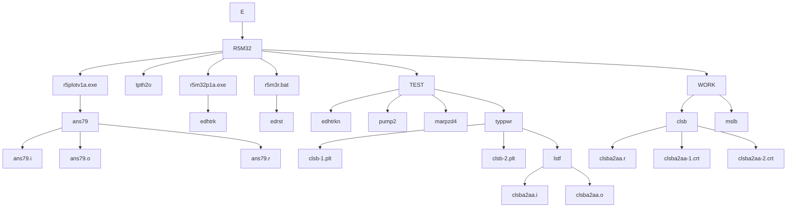
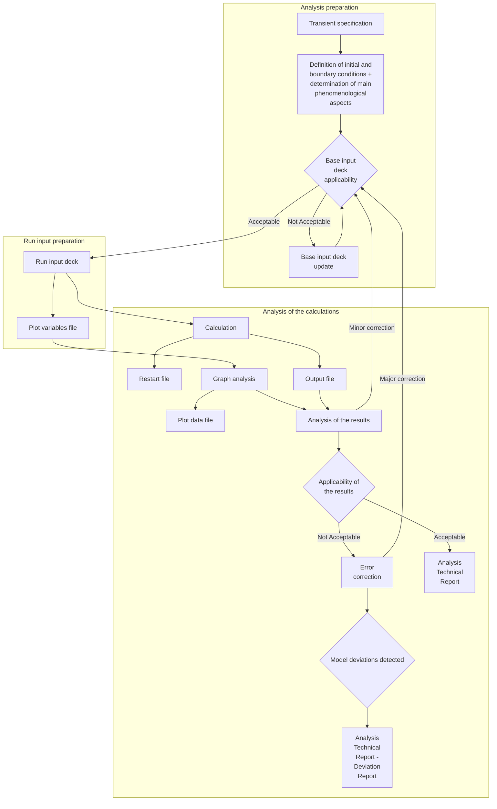

ENCONET d.o.o.

# PROCEDURE FOR THE RELAP5 TRANSIENT ANALYSES

| Title:                | Radna uputa RU-73-04 |
|:----------------------|:---------------------|
| Revision No.:         | 2                    |
| Date Released:        | 17.11.2017.          |
| Controlled Copy No.:  |                      |

| Prepared:                                        | 13.11.2017. |
|:-------------------------------------------------|:------------|
| mr.sc. Ilijana Iveković, Project Engineer        | Date        |

| Reviewed:                                        | 14.11.2017. |
|:-------------------------------------------------|:------------|
| Vladimir Križe, dipl.ing., QA Leader             | Date        |

| Approved:                                        | 15.11.2017. |
|:-------------------------------------------------|:------------|
| dr.sc. Nenad Debrecin, Project Manager, Director | Date        |

## Periodični pregled

| Pregledao: | Datum: | Slijedeći pregled: |
|:-----------|:-------|:-------------------|
|            |        |                    |
|            |        |                    |
|            |        |                    |
---
| Radna uputa | Naziv dok: RU-73-04 |
|-------------|---------------------|
| PROCEDURE FOR THE TRANSIENT ANALYSES | Rev.2     Page 2 of 60 |

# Summary

This document presents the procedure developed to perform accident/transient analyses in nuclear power plants or experimental facilities using RELAP5 computer code family (RELAP5/mod3.2, RELAP5/mod3.3, RELAP5/SCDAPSIM).

ENCONET d.o.o., Zagreb
---
# TABLE OF CONTENTS

## 1 INTRODUCTION ..................................................................................................... 6

### 1.1 PURPOSE....................................................................................................................... 6
### 1.2 SCOPE........................................................................................................................... 6

## 2 ABBREVIATIONS AND DEFINITIONS .............................................................. 7

### 2.1 ABBREVIATIONS........................................................................................................... 7
### 2.2 DEFINITIONS................................................................................................................. 7

## 3 RESPONSIBILITIES............................................................................................... 10

### 3.1 NODALIZATION DEVELOPER....................................................................................... 10
### 3.2 NODALIZATION SUPERVISOR...................................................................................... 10
### 3.3 RELAP ANALYST ...................................................................................................... 11
### 3.4 RELAP SOFTWARE ENGINEER ................................................................................... 11

## 4 INSTRUCTIONS...................................................................................................... 12

### 4.1 INSTALLATION AND SETUP ......................................................................................... 12
#### 4.1.1 RELAP5 program.......................................................................................... 12
#### 4.1.2 RELAP5 Plot Program .................................................................................. 14
#### 4.1.3 Base RELAP5 files........................................................................................ 14
### 4.2 TRANSIENT ANALYSIS INSTRUCTIONS ........................................................................ 17
#### 4.2.1 Transient Analysis Preparation...................................................................... 17
#### 4.2.2 RELAP5 Transient Analysis ......................................................................... 18
### 4.3 DOCUMENTATION....................................................................................................... 22
#### 4.3.1 RELAP5 Nodalization Notebook .................................................................. 22
#### 4.3.2 Steady-State Technical Report ...................................................................... 23
#### 4.3.3 RELAP5 Analysis Workbook ....................................................................... 23
#### 4.3.4 RELAP5 Analysis Technical Report............................................................. 24

## 5 REFERENCES ......................................................................................................... 25

## 6 APPENDICES........................................................................................................... 26

### 6.1. RELAP5 Installation and Analysis Folder Structure

ENCONET d.o.o., Zagreb
---
Radna uputa                                                    Naziv dok: RU-73-04
PROCEDURE FOR THE TRANSIENT ANALYSES                           Rev.2    Page 4 of 60

6.2. RELAP5 Testing Instructions

6.3. RELAP5 DOS Script File

6.4. Base Input Deck Conventions

6.5. Transient Analysis Flowchart

6.6. Base Input Deck Applicability Format

6.7. Plot Variables File

6.8. Run Input Deck Conventions

6.9. Run Input Deck Example

6.10. RELAP5 Nodalization Developer Worksheet Format

6.11. RELAP5 Analyst Worksheet Format

ENCONET d.o.o., Zagreb
---
Radna uputa                                                Naziv dok: RU-73-04
PROCEDURE FOR THE TRANSIENT ANALYSES                       Rev.2    Page 5 of 60

## LIST OF TABLES

N/A

## LIST OF FIGURES

N/A

ENCONET d.o.o., Zagreb
---

Radna uputa                                                    Naziv dok: RU-73-04
PROCEDURE FOR THE TRANSIENT ANALYSES                           Rev.2     Page 6 of 60

# 1 INTRODUCTION

## 1.1 Purpose

The purpose of the procedure is to provide systematic approach to the accident/transient analyses using RELAP5 computer code. It is also intended to describe necessary requirements for the preparation of the input models, documentation and output results. This procedure affects personnel involved in the development and maintenance of the RELAP5 input models and plant analysis using RELAP5 program.

## 1.2 Scope

This procedure gives the instructions for specific activities for performing accident / transient analysis using RELAP5 computer code.

ENCONET d.o.o., Zagreb

---
Radna uputa                                                                         Naziv dok: RU-73-04
PROCEDURE FOR THE TRANSIENT ANALYSES                                                Rev.2     Page 7 of 60

## 2     ABBREVIATIONS AND DEFINITIONS

### 2.1    Abbreviations

| Abbreviation | Full Form |
|--------------|-----------|
| AFW          | Auxiliary Feedwater |
| ASME         | American Society of Mechanical Egineers |
| IAPWS        | International Association for the Properties of Water and Steam |
| ID           | Identification Data |
| FW           | Feedwater system |
| HPGL         | Hewlett Packard Graphic Language |
| HPIS         | High Pressure Injection System |
| LPIS         | Low Pressure Injection System |
| NPP          | Nuclear Power Plant |
| PRZ          | Pressurizer |
| RELAP        | Reactor Excursion and Leak Analysis Program |
| SG           | Steam Generator |
| WMF          | Windows Metafile |
| TIFF         | Tag Image File Format |

### 2.2    Definitions

1. Authentication process - automatic verification process done by program itself
   which ensures that program and all auxiliary files have remained unchanged
   from the moment of creation.

2. Base deck directory - directory created for each base input deck revision.

3. Base input deck - input file for RELAP5 calculation of steady-state with all
   required data for the control volumes, junctions, heat structures, control
   variables, trips, control and material tables.

4. Base output - ASCII output file as described in Vol.2, ch. 8.3 Ref. [1], created
   after the RELAP5 calculation of steady-state using base input deck.

ENCONET d.o.o., Zagreb
---
Radna uputa                                                                              Naziv dok: RU-73-04
PROCEDURE FOR THE TRANSIENT ANALYSES                                                     Rev.2      Page 8 of 60

5. Base restart - binary file as described in Vol.2, Appendix A, of Ref. [1], created after RELAP5 calculation of steady-state using base input deck.

6. Boundary conditions - assumptions used to represent plant systems not explicitly included in the mathematical model (availability and functionality of the plant systems).

7. Comment card - line of text in input file without any significance for the program, but with helpful information for file contents understanding.

8. File identifier - part of file name preceding file name separator ( . - point in the case of DOS and UNIX systems).

9. File type - part of the file name following file name separator ( . - point in the case of DOS and UNIX systems).

10. Initial conditions - reference values that define plant operating status before transient initiation.

11. Input deck - computer file that contains input data for specific computer program.

12. Input deck maintenance - introduction of minor changes or fixes.

13. Plot data file - output file of the RELAP plot program that contains time variation of the parameters from RELAP5 calculation, as selected in plot variables file.

14. Plot variables file - input to the RELAP plot program that contains RELAP5 variables that will be extracted from RELAP5 restart file and available for plotting using RELAP plot program.

15. RELAP5 nodalization - thermohydraulic system representation adjusted for calculations with RELAP5 program.

16. RELAP5 notebook - compilation of worksheets created by nodalization developers during the preparation of base input deck.

ENCONET d.o.o., Zagreb
---
Radna uputa                                                                             Naziv dok: RU-73-04
PROCEDURE FOR THE TRANSIENT ANALYSES                                                    Rev.2     Page 9 of 60

17. Relevant phenomenological aspect - physical phenomena important for the
    understanding of the NPP transient and evaluation of the safety margins.

18. RELAP5 root directory - directory where RELAP5 executable version, steam
    tables file and RELAP5 plot program are stored.

19. Run input deck - input file for RELAP5 transient calculation.

20. Run output - ASCII output file as described in Vol.2, ch. 8.3, Ref. [1] , created
    after the RELAP5 transient calculation using run input deck.

21. Run restart - binary file as described in Vol.2, Appendix A, of Ref. [1], created
    after RELAP5 transient calculation using run input deck file.

22. Script - set of operating system commands used to perform required task (e.g.
    run of RELAP5 computer program).

23. Steady-state - stabilized condition of system characterized by minimum
    variation of parameters with time.

24. Steam tables file - binary format file readable by RELAP5 program that
    contains properties of water and steam for a range of conditions

25. User qualification - demonstration of persons ability to select suitable models,
    discretization and boundary conditions for computer program, that is, to use
    computer program with sufficient accuracy and minimum possibility of
    misjudgment.

26. Working directory - directory created for each transient analysis.

ENCONET d.o.o., Zagreb
---
Radna uputa                                                                           Naziv dok: RU-73-04
PROCEDURE FOR THE TRANSIENT ANALYSES                                                  Rev.2     Page 10 of 60

## 3     RESPONSIBILITIES

### 3.1     Nodalization Developer

1. preparation of base input deck
2. preparation of worksheets for RELAP5 notebook
3. maintenance (minor revisions) of the base input deck

**Qualifications:**
1. knowledge of the RELAP5 physical models and user guidelines
2. detailed knowledge of the plant design documents and plant itself
3. experience with modeling of certified benchmarks or experiments on test facilities
   is recommended

### 3.2     Nodalization Supervisor

1. supervision of the preparation and the maintenance (minor revisions) of the base
   input deck
2. approval of RELAP5 notebook
3. creation and maintenance of base restart file
4. verification of the applicability of the base input deck to the specific transient
   analysis
5. coverage of the international experience in the use of the RELAP5 program

**Qualifications:**
1. knowledge of the physical models incorporated in the RELAP5 program and
   detailed knowledge on the modeling options in RELAP5
2. detailed knowledge of the plant design documents and plant itself
3. experience with modeling of certified benchmarks or experiments on test facilities
   is recommended

ENCONET d.o.o., Zagreb
---
Radna uputa                                                                         Naziv dok: RU-73-04
PROCEDURE FOR THE TRANSIENT ANALYSES                                                Rev.2     Page 11 of 60

### 3.3    RELAP Analyst

1. definition of boundary and initial conditions for specific transient analysis
2. preparation of the run input deck and running of RELAP5 calculations
3. analysis of the RELAP5 runs of the plant transient
4. preparation of the analysis technical report

#### Qualifications

1. engineer familiar with the RELAP5 program
2. detailed knowledge of the plant design documents and plant itself

### 3.4    RELAP Software Engineer

1. installation and maintenance of RELAP5 and RELAP5 plot programs
2. testing of RELAP5 program and RELAP5 plot programs
3. preparation of RELAP5 script file
4. modifications of software

#### Qualifications:
1. knowledge of the RELAP5 program structure
2. knowledge of programming languages (FORTRAN and C/C++) and operating
   systems

ENCONET d.o.o., Zagreb
---
Radna uputa                                                                          Naziv dok: RU-73-04
PROCEDURE FOR THE TRANSIENT ANALYSES                                                 Rev.2     Page 12 of 60

# 4     INSTRUCTIONS

## 4.1    Installation and Setup

### 4.1.1      RELAP5 program
#### 4.1.1.1.     RELAP5 program shall be installed by RELAP software engineer in following steps:

1. RELAP5 root directory shall be created and named R5MnnnTT, where nnnTT is variable number of alpha-numerical characters reserved for the identification of the program program version. Number of places for nnn and TT is not restricted, but dedicated abbreviation is assigned and recorded by ENCONET Technical Project Leader. It is dependent on the code version used e.g. R5M33 is regular name for the RELAP5/mod33, R5M34scdapsim for RELAP5/SCDAPSIM for 3.4 version installation.

2. RELAP5 program shall be placed in the RELAP5 root directory and named according to following conventions:
   a. first 3 characters are fixed for RELAP5 - r5m,
   b. characters between position 3 and last 3 places before extension .exe are reserved for mod description that shall be consistent with name defined in paragraph 1 above (4.1.1.1-1),
   c. last 3 characters before extension are reserved for executable version description, e.g. r5m32p1a.exe is regular name of executable version of RELAP5/mod32 program.

3. RELAP5 steam tables shall be placed in the RELAP5 root directory and named tpfh2o if they are used with any RELAP5/mod3 based code with ASME-67 formulation or tpfh2onew for IAPSW-95 formulation

4. RELAP5 script program shall be placed in the RELAP5 root directory and named r5m3r.bat or r5sim.bat depending of the RELAP5 version.

5. RELAP5 root directory shall be written in PATH variable.

6. All files in RELAP5 root directory shall be write-protected for all other users.

7. Subdirectory for the testing of RELAP5 program shall be created in RELAP5 root directory and named TEST.

8. TEST directory shall contain results of RELAP5 testing according to Appendix 6.2.

9. Work subdirectories shall be defined in the RELAP5 root directory for the RELAP5 analyses.

ENCONET d.o.o., Zagreb
---
Radna uputa                                                                           Naziv dok: RU-73-04
PROCEDURE FOR THE TRANSIENT ANALYSES                                                  Rev.2      Page 13 of 60

### 4.1.1.2. RELAP5 shall satisfy following requirements:

1. Executable version shall be frozen and protected by authentication process.

2. Source code version, time, date and size of executable version shall be written at the beginning of each RELAP5 created output and in the header of RELAP5 restart file.

3. Base input deck and run input deck ID shall be automatically included in every RELAP5 created output and restart file.

### 4.1.1.3. RELAP5 script program to perform RELAP5 calculations shall be written.

### 4.1.1.4. RELAP5 script program shall be stored in RELAP5 root directory.

### 4.1.1.5. RELAP5 script program shall require as input arguments only run input deck ID and base input deck ID

### 4.1.1.6. RELAP5 script program shall satisfy following conventions:

1. Input files for RELAP5 program shall be file type i.

2. Output files of RELAP5 program shall have same name as input deck ID and file type o.

3. Restart files of RELAP5 program shall have same name as input deck ID and file type r.

4. All other files shall be deleted after the end of RELAP5 calculation.

### 4.1.1.7. RELAP5 script program shall be invoked from operating system command line by input of command:

r5m3r (r5sim) input_ ID ..\base_input_ID

where input _ID stands for run input deck ID and
base_input_ID stands for base input deck ID.

### 4.1.1.8. RELAP5 script program is presented in Appendix 6.3.

ENCONET d.o.o., Zagreb
---
Radna uputa                                                                            Naziv dok: RU-73-04
PROCEDURE FOR THE TRANSIENT ANALYSES                                                   Rev.2     Page 14 of 60

### 4.1.2      RELAP5 Plot Program

#### 4.1.2.1.     RELAP5 plot program shall be installed in following steps:

1. RELAP5 plot program shall be placed in the RELAP5 root directory.
2. RELAP5 plot program shall be write-protected from other users.
3. RELAP5 plot program shall satisfy following requirements:
   a. Executable version shall be frozen and protected by authentication process.
   b. RELAP5 plot program shall not change nor modify the results of the RELAP5 calculations.
   c. All types of RELAP5 plot program generated outputs (screen graphics, plots, vector file formats, HPGL files and binary-plot file) shall contain:
      - version of RELAP5 program that generated plot records;
      - time and the date when plot records were generated by RELAP5 program;
      - ID of the run input deck used to run RELAP5 program;
      - ID of the base input deck used to run RELAP5 program.

#### 4.1.2.2.     RELAP5 plot program shall be used for:

1. the creation of graphs on computer screen
2. the creation of hardcopy of graphs
3. the creation of graph output in at least one standard picture file format (WMF, HPGL, postscript, PCX, TIFF, etc.)
4. the generation of file with all plot data
5. the generation of ASCII file for each plot variable

### 4.1.3      Base RELAP5 files

#### 4.1.3.1.     Base input deck shall be created by nodalization developers.

##### 4.1.3.1.1. Base input deck shall be complete and prepared to represent model of respective NPP in compliance with Ref. [2].

##### 4.1.3.1.2. The development of base input deck shall be documented by RELAP5 nodalization notebook as specified in 4.3.1.

##### 4.1.3.1.3. Compliance of base input deck models to the NPPsystems, setpoints and geometrical zones shall be summarized in Steady-State Technical Report as specified in 4.3.2.

ENCONET d.o.o., Zagreb
---
Radna uputa                                                                              Naziv dok: RU-73-04
PROCEDURE FOR THE TRANSIENT ANALYSES                                                     Rev.2      Page 15 of 60

#### 4.1.3.1.4. Base input deck ID shall be defined by nodalization supervisor with maximum of 8 characters:

1. characters 1 to 5 shall be used for the abbreviation of reference plant data, (e.g. P1n00 shall represent plant configuration for the version 00 of nominal condditions, P1h1a for version 1a of hot shutdown conditions, etc.)

2. characters 6 to 8 shall be used for numbering of base input deck revisions, (e.g. e0a may stand for 0 revision for end of life configuration and b0a for beginning of life)

#### 4.1.3.1.5. Base input deck shall be file type i.

#### 4.1.3.1.6. Base input deck shall be stored in work directory for each NPP modelled. Backup copies shall be stored on:

1. a CD that shall be kept together with the master version of RELAP5 notebook

2. at least one other removable computer storage media.

3. protected web site http://enconet.no-ip.biz/ifolder

#### 4.1.3.1.7. Base input deck shall be write-protected by nodalization supervisor.

#### 4.1.3.1.8. Base input deck data shall be in compliance with Ref. [1] depending on the code version used. Additional input conventions that shall be part of this procedure are reported in Appendix 6.4.

#### 4.1.3.1.9. Base input deck shall be qualified on the steady-state level, that is:

1. geometrical fidelity with the plant is achieved and well documented (verified by the base input deck notebook that ensures all the input data are traceable and close physical representation of the actual plant).

2. referenced steady-state condition is satisfactory reproduced (that is, difference between calculation results and reference is within predefined limits as verified by Steady-State Technical Report).

ENCONET d.o.o., Zagreb
---
Radna uputa                                                                               Naziv dok: RU-73-04
PROCEDURE FOR THE TRANSIENT ANALYSES                                                      Rev.2      Page 16 of 60

### 4.1.3.2. Base Output

4.1.3.2.1. Base output shall be created by calculation of RELAP5 with base input deck as input.

4.1.3.2.2. Nodalization supervisor shall store base output in C1work directory as read-only file.

4.1.3.2.3. By RELAP5 script file default base output shall have same file ID as base input deck.

4.1.3.2.4. File type shall be file type o.

4.1.3.2.5. Base output is used for the steady-state qualification of base input deck.

4.1.3.2.6. Base output shall be created for each version or revision of base input deck

### 4.1.3.3. Base Restart

4.1.3.3.1. Base restart shall be created by calculation of RELAP5 with base input deck as input.

4.1.3.3.2. Nodalization supervisor shall store base restart in work directory as read-only file.

4.1.3.3.3. By RELAP5 script file default base restart shall have same file ID as base input deck.

4.1.3.3.4. File type shall be file type r.

4.1.3.3.5. Base restart is used for the transient calculations together with run input deck as inputs to the script file.

4.1.3.3.6. Base restart shall be created for each version or revision of base input deck.

ENCONET d.o.o., Zagreb
---
Radna uputa                                                                            Naziv dok: RU-73-04
PROCEDURE FOR THE TRANSIENT ANALYSES                                                   Rev.2     Page 17 of 60

## 4.2 Transient Analysis Instructions

Simplified transient analysis flowchart is presented in Appendix 6.5.

### 4.2.1 Transient Analysis Preparation

#### 4.2.1.1. Transient analysis preparation shall be done by RELAP5 analyst and documented on RELAP5 analyst worksheets. RELAP5 analyst shall define transient analysis ID as 4 character word, possibly as abbreviation of transient name, e.g. CLSB for Cold Leg Small Break LOCA. Assigned abbreviation shall be approved by ENCONET Technical Project Leader.

#### 4.2.1.2. Initial and boundary conditions shall be defined according to the transient specifications:

1. Initial conditions:

   a. reactor power
   b. primary system loop flow
   c. hot leg temperature and cold leg temperature (or average temperature)
   d. primary system pressure
   e. SG secondary side pressure
   f. SGs secondary side level
   g. PRZ level
   h. Steam flow to turbine
   i. FW flow

2. Boundary conditions:
   a. transient initiation
   b. identification of the relevant plant systems for the transient
   c. availability of the plant systems
   d. relevant protection and system actuation setpoints for the transient

ENCONET d.o.o., Zagreb
---
Radna uputa                                                                              Naziv dok: RU-73-04
PROCEDURE FOR THE TRANSIENT ANALYSES                                                     Rev.2     Page 18 of 60

### 4.2.1.3. Definition of main phenomena and relevant phenomenological aspects of the transient:

1. Main phenomena shall be identified:
   a. from available literature (FSAR, IAEA Technical Documents, OECD CSNI working reports, petc.).
   b. by expert consultation (qualified user of RELAP5 program)

2. Relevant thermohydraulic aspects shall be defined for main phenomena (e.g. if core dryout is identified as main phenomena than relevant thermohydraulic aspects may be rod surface temperature and core level).

### 4.2.1.4. Base input deck applicability shall be verified by:

1. Comparison of initial conditions as defined in 4.2.1.2-1 to the Steady-State Technical Report.
   a. Identification of RELAP5 components for each relevant plant system as defined in 4.2.1.2-2 in Steady-State Technical Report.
   b. Confirmation of relevant protection and system actuation setpoints as defined in 4.2.1.2-2 with Steady-State Technical Report.
   c. The results of steps 4.2.1.2 and 4.2.1.3 shall be submitted to the nodalization supervisor in format presented in Appendix 6.6.
   d. Nodalization supervisor shall verify base input deck applicability according to format presented in Appendix 6.6.
   e. RELAP5 analyst shall proceed with transient analysis only if base input deck is approved as applicable.

2. Transient working directory for transient analysis shall be defined as subdirectory of the work directory with the same name as transient analysis ID.

### 4.2.2 RELAP5 Transient Analysis

#### 4.2.2.1. Plot variables files shall be created in transient working directory.

1. Plot variables file type shall be PLT.
2. Plot variables file name shall be the same as transient ID with numbered sufix separated with - (minus sign), e.g. if transient analysis ID is CLSB, than plot variables files names may be CLSB-1, CLSB-2, etc. in ascending order.
3. Format of plot variable file is presented in Appendix 6.7.

ENCONET d.o.o., Zagreb
---
Radna uputa                                                                              Naziv dok: RU-73-04
PROCEDURE FOR THE TRANSIENT ANALYSES                                                     Rev.2      Page 19 of 60

4. RELAP5 variables important for analysis of RELAP5 calculations
   shall be identified using instructions from Ref. [1] (vol. 2, Appendix
   A, pg. 27) for input of minor edit requests:
   a.      RELAP5 variables that are representative for relevant
           thermohydraulic aspects shall be stored in plot variables files
           with suffix -1, e.g. file name will be CLSB-1.PLT. This file
           shall be submitted to ENCONET Technical Project Leader for
           approval.
   b.      Additional RELAP5 variables that may be used for analysis of
           RELAP5 calculations shall be stored in plot variables file with
           the suffixes following in ascending order, e.g. CLSB-2.PLT,
           CLSB-3.PLT etc.
4.2.2.2.     Run input deck shall be created in transient working directory for
             each RELAP5 run.
             − Run input deck shall be input file for restart of RELAP5 run as
                 specified in Ref. [1].
4.2.2.3.     Run input deck shall represent restart modification of base input
             file in compliance with Ref. [1] Vol 2.

1. The development of run input deck shall be documented by RELAP5
   Analyst Worksheets.
2. Compliance of run input deck and base input deck models to the
   transient specifications shall be summarized in RELAP5 Analysis
   Technical Report as specified in 4.3.4.
3. Each run input deck ID shall be defined by RELAP5 analyst with
   maximum of 8 characters:
   a.      characters 1 to 4 shall be the same as transient ID defined in
           4.2.1.1, e.g. if run input deck is prepared for transient analysis
           from example from 2, than ID CLSB shall be used.
   b.      character 5 shall be used for the location of transient initiator:
           − if the initiator is in loop with PRZ, than A shall be used
           − if the initiator is in loop without the PRZ, than B shall be
               used
           − if the initiator is common to both loops, than C shall be used
   c.      characters 6 to 8 shall be used to define specific choices:
           − size of the break
           − availability of the systems
           − RELAP5 input choices,
           − corrective actions according to 4.2.2.5-4, etc.
4. Run input deck file type shall be file type i.

ENCONET d.o.o., Zagreb
---
Radna uputa                                                    Naziv dok: RU-73-04
PROCEDURE FOR THE TRANSIENT ANALYSES                        Rev.2     Page 20 of 60

5. Run input deck shall be stored in transient working directory. Backup copies shall be stored on:
   a. a diskette that is kept together with the RELAP5 analysis workbook
   b. at least one other removable computer storage media.
   c. protected web site http://enconet.no-ip.biz/ifolder

6. Run input deck preparation shall include:
   a. introduction of the parameter changes in the base input deck that shall be altered to satisfy transient definition and required boundary conditions as identified in 4.2.1.4.
   b. identification and input (as minor edits) of RELAP transient characteristic variables that characterize main phenomenological aspects as identified in 4.2.2.1-4a.
   c. Run input deck data shall be in compliance with Ref. [1]. Additional input conventions that shall be part of this procedure are reported in Appendix 6.8

7. Example of run input deck is presented in Appendix 6.9.

### 4.2.2.4. RELAP5 calculations

1. RELAP5 calculations shall be invoked from transient working directory by RELAP5 script file as specified in 4.1.1.7.

2. RELAP5 calculations may result in:
   a. successful finish on trip 600 without errors in case which analyst shall proceed to 4.2.2.5;
   b. failure of the calculation with error reported in Vol. 2, ch. 8.3.4 of Ref. [1]. Changes as suggested from the manual shall be introduced;
   c. program fails in spite the suggestions from Ref. [1], or with unknown error, in case which input file shall be saved and problem reported to nodalization supervizor and RELAP5 software engineer. Analysis shall be continued only after nodalization supervizer provides the approval for the changes aimed to provide soultion in particular case.

### 4.2.2.5. Analysis of the calculations

1. RELAP5 output analysis shall include:
   a. check of trip status
   b. characteristic variables analysis
   c. boundary conditions compliance
   d. check of mass error

ENCONET d.o.o., Zagreb
---
Radna uputa                                                    Naziv dok: RU-73-04
PROCEDURE FOR THE TRANSIENT ANALYSES                        Rev.2     Page 21 of 60

2. RELAP5 graphs analysis shall include:
   a. running of RELAP5 plot program with all plot variables file and run restart.
   b. creation of hard copies for representative variables graphs as defined in 4.2.2.1-4a.
   c. creation of plot data file for plot variable file defined in 4.2.2.1-4a.
   d. visual observation for the rest of plot variables files.

3. The results of the analysis of RELAP5 calculation shall be considered satisfactory if:
   a. trip status is in accordance with 4.2.1.2-2
   b. relative mass error is less than 1%
   c. the prediction of relative thermohydraulic aspects is explained and justified
   d. If all off the above terms a, b and c are fulfilled, RELAP5 analyst shall proceed with step 6.

4. The results of the analysis of RELAP5 calculation shall be considered doubtful if:
   a. Trip status is not in accordance with 4.2.1.2-2. Corrective action should be to adjust trips in run input deck according to 4.2.1.2-2.
   b. Relative mass error is greater than 1%. Corrective action is to decrease maximum time step size according to the specifications from Vol. 2, Appendix A, ch.3 of Ref. [1].
   c. The prediction of relative thermohydraulic aspects is not completely understood. Corrective action is to consult literature or qualified user - expert.
   d. One or some of the parameters show erratic behavior or unexplainable oscillations. Corrective actions should be performed in following order:
      i) to decrease maximum time step size;
      ii) to run parametric study for critical parameters;
      iii) to request renodalization or update of base input deck after consultation with qualified user.
      iv) Should none of the corrective actions lead to fulfillment of requests from 3 RELAP5 analyst should proceed to 5.

ENCONET d.o.o., Zagreb
---
Radna uputa                                                                            Naziv dok: RU-73-04
PROCEDURE FOR THE TRANSIENT ANALYSES                                                   Rev.2     Page 22 of 60

5. The results of the analysis shall be considered unsatisfactory if:
   1.       none of the corrective actions succeeded.
   2.       some of the relevant thermohydraulic aspects is predicted
            outside the RELAP5 mathematical model applicability as
            described in Vol. 1 of Ref. [1].
   3.       should the analysis be considered unsatisfactory, RELAP5
            analyst shall proceed with 6. RELAP5 Analysis Technical
            Report – Deviation Report according to 4.3.4, should
            contain information of the problems encountered during the
            analysis. RELAP5 analyst shall initiate steady-state report
            update of know restrictions in the use of the program and
            base input deck.
6. RELAP5 analyst shall store all run input and output files in the
   transient working directory. Separate backup copies shall be stored on
   some removable computer storage media.
7. RELAP5 analyst shall be allowed to delete run restart file after the
   plot data file with variables specified in 4.2.2.1-4 are created.
8. Final output forms of the RELAP5 transient analysis shall be
   prepared:
   a.     RELAP5 Workbook as specified in 4.3.3.
   b.     backup copies of all transient run input decks, run outputs and
          plot data files specified in 4.2.2.1-4 a on some removable
          computer storage media.
   c.     RELAP5 Analysis Technical Report as specified in 4.3.4.

4.3   Documentation

   4.3.1      RELAP5 Nodalization Notebook

   4.3.1.1.   RELAP5 Nodalization Notebook is document compiled from worksheets
              created by nodalization developers that were used for calculation of
              RELAP5 base input deck. RELAP5 notebook worksheet is presented in
              Appendix 6.10.
   4.3.1.2.   RELAP5 notebook shall contain:

              1.   name, time, date and size of the latest revision of the base input deck
                   file and base restart;
              2.   disc with the base input deck file and corresponding output file of
                   the steady-state run;
              3.   schematic drawing of the nodalization;

                                ENCONET d.o.o., Zagreb
---
Radna uputa                                                    Naziv dok: RU-73-04
PROCEDURE FOR THE TRANSIENT ANALYSES                       Rev.2    Page 23 of 60

4. list of used abbreviations;
5. list of commonly used formulas and conversion factors;
6. worksheets that describe setup of the input deck with used
   references;

4.3.1.3. Each worksheet shall be independently reviewed.

4.3.1.4. Final release of each version of RELAP5 Nodalization Notebook shall be
         processed as a new revision of Technical Report and approved.

4.3.2   Steady-State Technical Report

4.3.2.1. Steady-State Technical Report shall describe steady-state qualification of
         base input deck.

4.3.2.2. Steady-State Technical Report shall contain:

1. main assumptions and guidelines used during the development of
   the nodalization;
2. choice of the referenced initial and boundary conditions;
3. geometrical correspondence between plant zones and control
   volumes;
4. modeled plant systems setpoints;
5. known restrictions in the use of the RELAP5 program and base
   input deck model;
6. results of the steady state calculation and comparison with reference
   data;
7. printout of the base input deck.

4.3.3   RELAP5 Analysis Workbook

4.3.3.1. RELAP5 Analysis Workbook shall be compilation of RELAP5 analyst
         worksheets that were created during the transient analysis. RELAP5
         analyst worksheet format is presented in Appendix 6.11.

4.3.3.2. RELAP5 Analysis Workbook shall contain RELAP5 analyst worksheets
         with notes of the activities described in 4.2:

1. notes on the transient specifications;
2. definition of boundary and initial conditions;
3. identification of main phenomenological aspects;
4. approval of base input deck applicability;
5. description of inputs for run input decks and plot variables file;

ENCONET d.o.o., Zagreb
---
Radna uputa                                                                            Naziv dok: RU-73-04
PROCEDURE FOR THE TRANSIENT ANALYSES                                                   Rev.2     Page 24 of 60

6. graphs of main plot variables for each run;
7. explanations for introduced changes;
8. notes of the graphs analysis.

### 4.3.4 RELAP5 Analysis Technical Report

#### 4.3.4.1. RELAP5 Analysis Technical Report shall cover transient analysis using RELAP5 program.

#### 4.3.4.2. RELAP5 Analysis Technical Report shall comply with the ENCONET Technical Report procedure.

#### 4.3.4.3. RELAP5 technical report shall be prepared based on RELAP Analysis Workbook as it is defined in 4.3.3 and other relevant reference and shall contain:

1. initial and boundary conditions compliance, as prepared for run input deck;
2. compliance of base input deck according to this specification (as approved by nodalization supervisor);
3. main phenomenological aspects of the transient shall be stated;
4. changes that affect base input deck assumptions shall be summarized;
5. evaluation of parametric study, if such exists;
6. conclusions on the analysis (including outcomes as defined in 5);
7. graphs of relevant parameters for base case calculation;
8. graphs relevant for parametric study as separate attachment.

ENCONET d.o.o., Zagreb
---
Radna uputa                                                                    Naziv dok: RU-73-04
PROCEDURE FOR THE TRANSIENT ANALYSES                                           Rev.2     Page 25 of 60

## 5     REFERENCES

[1] RELAP5/MOD3.2 Code Manual, Nuclear Safety Analysis Division, INEL,
     Prepared for US NRC, NUREG/CR-5535.

[2] A methodology for the qualification of thermalhydraulic code nodalizations,
     Bonuccelli M., F. D'Auria, N. Debrecin, G.M. Galassi, Proc. of NURETH-6
     Conference, Grenoble (F), October 5-8, 1993.

[3] ENCONET Nuklearni QA Plan, NP-SUK-001

[4] ENCONET, PRIRUČNIK KVALITETE NORMA - ISO 9001:2015, PK-SUK-
     001

[5] HRN EN ISO 9001:2015

[6] IAEA Leadership and Management for Safety, IAEA Safety Standards Series, No.
     GSR Part 2, IAEA Vienna, 2016.

ENCONET d.o.o., Zagreb
---
Radna uputa                                                   Naziv dok: RU-73-04
PROCEDURE FOR THE TRANSIENT ANALYSES                          Rev.2     Page 26 of 60

## 6 APPENDICES

6.1. RELAP5 Installation and Analysis Folder Structure
6.2. RELAP5 Testing Instructions
6.3. RELAP5 DOS Script File
6.4. Base Input Deck Conventions
6.5. Transient Analysis Flowchart
6.6. Base Input Deck Applicability Format
6.7. Plot Variables File
6.8. Run Input Deck Conventions
6.9. Run Input Deck Example
6.10. RELAP5 Nodalization Developer Worksheet Format
6.11. RELAP5 Analyst Worksheet Format

ENCONET d.o.o., Zagreb
---
| Radna uputa | Naziv dok: RU-73-04 |
|-------------|---------------------|
| PROCEDURE FOR THE TRANSIENT ANALYSES | Rev.2     Page 27 of 60 |

# Appendix

## 6.1 RELAP5 Installation and Analysis Folder Structure

ENCONET d.o.o., Zagreb
---
Radna uputa                                                                 Naziv dok: RU-73-04
PROCEDURE FOR THE TRANSIENT ANALYSES                                        Rev.2       Page 28 of 60



ENCONET d.o.o., Zagreb
---
| Radna uputa | Naziv dok: RU-73-04 |
|-------------|---------------------|
| PROCEDURE FOR THE TRANSIENT ANALYSES | Rev.2     Page 29 of 60 |

# Appendix

## 6.2 RELAP5 Testing Instructions

ENCONET d.o.o., Zagreb
---
Radna uputa                                                                    Naziv dok: RU-73-04
PROCEDURE FOR THE TRANSIENT ANALYSES                                           Rev.2     Page 30 of 60

6.2.1.    RELAP5 computer program shall be tested for all intended applications by
          RELAP5 software engineer.

6.2.2.    The extent of testing may include:
          1.   Verification tests were performed by program developer, to demonstrate
               the capability of a computer program to produce valid results using 5
               characteristic test input decks. These inputs decks cover almost all aspects
               of code usage and running options (new, restart, strip, steady state
               initialization) and they are, together with corresponding outputs, part of
               official package distribution.
          2.   In-use tests, covered by this procedure, should be performed by RELAP5
               software engineer to confirm acceptable performance of RELAP5 program
               in the operating system and should be used when RELAP5 program is
               installed on different computers, or when significant hardware or
               supporting software changes are made. Same input decks should be used as
               for verification tests from 6.2.2-1.

6.2.3.    The headers of 7 verification input decks are shown hereafter:

ans79.i
```
= Long term decay heat study
*                             Configuration Control Problem
*   Input contains minimum hydrodynamics to allow testing of reactor
*   kinetics and decay heat calculation for long time periods.
* * * * * * * * * * * * * * * * * * * * * * * * * * * * * * * * * * *
```

edhtrk.i
```
=edward's pipe problem base case with extras
*                             Configuration Control Problem
*          This problem has the hydrodynamic components from the Edward's
*   Pipe Blowdown plus heat structures coupled to the pipe, a heat
*   structure with a simple analytic solution, control components with
*   analytic solutions, reactor kinetics, and a few trips.   This
*   artificial problem is used to check the coding of several models.
*   The results of this problem still match the Edward"s Pipe data
*   reasonably well.
* * * * * * * * * * * * * * * * * * * * * * * * * * * * * * * * * * *
```

ENCONET d.o.o., Zagreb
---
Radna uputa                                                              Naziv dok: RU-73-04
PROCEDURE FOR THE TRANSIENT ANALYSES                                     Rev.2   Page 31 of 60

## edrst.i

* problem does an input check only with extensive optional printout.
* Configuration Control Problem
* The edhtrk problem runs to 0.5 s and writes a restart tape.
* This problem restarts that problem at 0.2 s and runs to 0.5 s.
* Problem results at the end of this and the edhtrk problem should
* have identical simulation results.

## edhtrkn.i

=edward's pipe problem base case with extras
* Configuration Control Problem
* This problem is the same as edhtrk except that nearly implicit
* advancement is used instead of semi-implicit advancement.
* * * * * * * * * * * * * * * * * * * * * * * * * * * * * * * * * * *

## pump2.i

=Two loops with pumps
* Configuration Control Problem
* This problem has two mostly identical loops, each with friction,
* an orifice, and a pump. Builtin pump data are used. The first loop
* uses an implied motor. The second loop uses pump motor torque data
* to represent an induction motor. The pump is initially at rest.
* The pump accelerates to near synchronous speed and fluid is
* accelerated, reaching near steady state. The pump is then tripped,
* resulting in decreasing pump speed and fluid velocities. The second
* problem is identicdal to the first except that shaft and generator
* (acting as motor) components are used.
* * * * * * * * * * * * * * * * * * * * * * * * * * * * * * * * * * *

## marpzd4.i

= EHWR-NPR Pressurizer Model
* Configuration Control Problem
* Simulates behavior of gas driven pressurizer. Using boundary
* conditions, a forced small compression is followed by a large
* expansion. Pressurizer component is not being used. Gas conditions
* drop below the triple point of water.
* * * * * * * * * * * * * * * * * * * * * * * * * * * * * * * * * * *

ENCONET d.o.o., Zagreb
---
Radna uputa                                                                        Naziv dok: RU-73-04
PROCEDURE FOR THE TRANSIENT ANALYSES                                               Rev.2     Page 32 of 60

typpwr.i
```
=typical pwr model -- 4 inch cold leg break 36.05 check case
*                                Configuration Control Problem
*            This problem is a simulation of a four loop presurized reactor
*    undergoing a small break.   Loop containing break is modeled as a
*    single loop but the other three loops are coalesced into one loop.
*    Modeling does not now follow all recommended modeling practices but
*    problem is still good test of many features of code.   Problem uses
*    standard matrix techniques.
* * * * * * * * * * * * * * * * * * * * * * * * * * * * * * * * * * *
```

6.2.4.     In addition to original distribution tests, RELAP5 program shall be tested using
           OECD/CSNI ISP26 benchmark input deck for LSTF experimental facility. This
           input deck can be used for verification testing as well as for in-use testing
           (reference data were produced with developers exe version for the Windows
           environment for mod3).

6.2.5.     The acceptance criteria of the conducted testing may be based on:
           1.    hand calculation,
           2.    documented results from other verified programs,
           3.    empirical data or published data in technical literature,
           4.    similarity with reference output files from 6.2.2-1 and 6.2.4.

6.2.6.     Testing procedure for installation of RELAP5 program shall be based on 6.2.5-4.
           For each of the basic test input decks, and for LSTF input deck, the calculation
           shall be performed and the results shall be checked against reference output files
           (output files are part of original distribution, and for LSTF input deck, output was
           produced developers version and checked against experimental results). The
           checking shall include all important variables:

           1.       fluid temperatures and pressures,
           2.       heat structure temperatures,
           3.       steam and water velocities,
           4.       reactor kinetics produced power where applicable,
           5.       mass errors and used time steps reported by code.

ENCONET d.o.o., Zagreb
---
Radna uputa                                                    Naziv dok: RU-73-04
PROCEDURE FOR THE TRANSIENT ANALYSES                       Rev.2     Page 33 of 60

6.2.7. RELAP5 program testing should prove that:

1. the code is properly installed,
2. there is no any adverse interaction of executable version of the program and operating system,
3. compiler options and compiler mathematical functions are working well
4. no errors were introduced due to nonstandard compiler features, and/or hardware implementations of floating point calculation e.g. computer word size.

6.2.8. Due to internally used 64-bit calculation at least 6-7 significant digits shall be used as a success criteria for output results. In special case of PC version the output results should be the same on all Pentium class of computers and file compare (DOS fc) utility may be used for global checking. In case of similar UNIX based computers (similar architecture and word size, IEEE floating point implementation) diff utility may be used for global checking of output files.

6.2.9. The testing shall be conducted, and the testing results shall be verified, documented, stored and controlled.

ENCONET d.o.o., Zagreb
---
| Radna uputa | Naziv dok: RU-73-04 |
|-------------|---------------------|
| PROCEDURE FOR THE TRANSIENT ANALYSES | Rev.2    Page 34 of 60 |

# Appendix

## 6.3 RELAP5 DOS Script Files

ENCONET d.o.o., Zagreb
---
Radna uputa                                                                 Naziv dok: RU-73-04
PROCEDURE FOR THE TRANSIENT ANALYSES                                        Rev.2     Page 35 of 60

## RELAP5/mod3.3 script file

### r5m33.bat
```
copy %1.r %1.r.old
copy %1.o %1.o.old
copy %1.scn %1.scn.old
del %1.r
del %1.o
del %1.scn
c:\r5m33\exe\r5m33p03il2 -i %1.i -o %1.o -r %1.r -Z c:\r5m33\exe\tpfh2onew
copy screen %1.scn
del screen
```

### r5m33rst.bat
```
copy %1.r %1.r.old
copy %1.o %1.o.old
copy %1.scn %1.scn.old
del %1.r
del %1.o
del %1.scn
copy %2.r %1.r
c:\r5m33\exe\r5m33p03il2 -i %1.i -o %1.o -r %1.r -Z c:\r5m33\exe\tpfh2onew
copy screen %1.scn
del screen
```

## RELAP5/SCDAPSIM script file

### r5sim.bat
```
move %1.r %1.r.old
move %1.o %1.o.old
call D:\R5Scdap\rslicense
C:\R5Scdap\relap5 -i %1.i -o %1.o -r %1.r -w C:\R5Scdap\tpfh2o
```

### r5simrst.bat
```
move %1.r %1.r.old
move %1.o %1.o.old
copy %2.r %1.r
call rslicense
c:\R5Scdap_bi9\relap5 -i %1.i -o %1.o -r %1.r
```

### r5simstrip.bat
```
move %1.sto %1.sto.old
move %1.s %1.s.old
call rslicense
c:\R5Scdap\relap5 -i %1.i -o %1.sto -r %2.r -s %1.s
```

ENCONET d.o.o., Zagreb
---
| Radna uputa | Naziv dok: RU-73-04 |
|-------------|---------------------|
| PROCEDURE FOR THE TRANSIENT ANALYSES | Rev.2     Page 36 of 60 |

# Appendix

## 6.4 Base Input Deck Conventions

ENCONET d.o.o., Zagreb
---
Radna uputa                                                    Naziv dok: RU-73-04
PROCEDURE FOR THE TRANSIENT ANALYSES                        Rev.2     Page 37 of 60

6.4.1. Title card (as defined in Vol.2, Appendix A, ch. 1.3 of Ref. [1]) of base input deck shall contain base input deck ID in columns 2 to 9:

| 1 | 2 | 3 | 4 | 5 | 6 | 7 | 8 | 9 | 10 | 11 | 12 | 13 | 14 | 15 | 16 | 17 | 18 | 19 | 20 | 21 | 22 | 23 | 24 |
|---|---|---|---|---|---|---|---|---|----|----|----|----|----|----|----|----|----|----|----|----|----|----|----| 
| = | c | 1 | n | 0 | 0 | e | 0 | a |    |    |    |    |    |    |    |    |    |    |    |    |    |    |    |

6.4.2. Comments in base input deck should be identified with one * (asterisk) sign only. Usage of more than one asterisk (*) sign is not recommended.

6.4.3. Comments after title card should contain basic information about the nodalization and reference initial conditions.

6.4.4. Base input deck shall have specified RUN option on card 100 (problem type and option card). Base input deck shall be used for steady-state calculations only.

6.4.5. Basic input deck should have trips in expanded format (Vol. 2., Appendix A, ch. 5, Ref. [1]) defined for normal operation:

1. variable trips numbers within predefined range (specified in steady-state report) used to enable protective plant functions or systems, should be grouped, e.g. from 551 to 590;
2. variable trips numbers within predefined range (specified in steady-state report) used to define delays for setpoints of plant protection functions and systems, should be grouped, e.g. from 901 to 949;
3. variable trips numbers within predefined range (specified in steady-state report) used to define setpoints and limitations, should be grouped, e.g. from 101 to 498;
4. logical trips should be used to model Boolean algebra operations;
5. trip number 500 should be reserved for transient initiation;
6. trip numbers 598, 599 and 600 should be used to define end of calculation.

6.4.6. Each variable trip card should end with comment at the end of line that describes trip purpose or status, e.g. HPIS pump 1 disabled, low-1 PRZ pressure trip.

6.4.7. Each set of logical trip cards should contain comments that describe purpose of logic cards

6.4.8. Specific conventions for each base input deck shall be specified in corresponding Steady-State Technical Report.

ENCONET d.o.o., Zagreb
---
| Radna uputa | Naziv dok: RU-73-04 |
|-------------|---------------------|
| PROCEDURE FOR THE TRANSIENT ANALYSES | Rev.2    Page 38 of 60 |

## Appendix

### 6.5 Transient Analysis Flowchart

ENCONET d.o.o., Zagreb
---
Radna uputa
PROCEDURE FOR THE TRANSIENT ANALYSES

Naziv dok: RU-73-04
Rev.2    Page 39 of 60



ENCONET d.o.o., Zagreb
---
| Radna uputa | Naziv dok: RU-73-04 |
|-------------|---------------------|
| PROCEDURE FOR THE TRANSIENT ANALYSES | Rev.2    Page 40 of 60 |

# Appendix

## 6.6 Base Input Deck Applicability Format

ENCONET d.o.o., Zagreb
---
Radna uputa                                                    Naziv dok: RU-73-04
PROCEDURE FOR THE TRANSIENT ANALYSES                        Rev.2    Page 41 of 60

| Transient ID: | RELAP5/MOD3.2 |
|---------------|----------------|
| Description:  | TRANSIENT ANALYSIS WORKSHEET<br>Base Input Deck Applicability Form |
| Initial Condition Compliance | Page: |

Base input deck ID: ______________________________

| Initial conditions: | Unit | Transient | Base Input Deck |
|---------------------|------|-----------|-----------------|
| 1) reactor power |  |  |  |
| 2) primary system loop<br>flow |  |  |  |
| 3) hot leg temperature<br>cold leg temperature<br>(or average temperature) |  |  |  |
| 4) primary system pressure |  |  |  |
| 5) SG secondary side<br>pressure |  |  |  |
| 6) SGs secondary side level |  |  |  |
| 7) PRZ level |  |  |  |
| 8) Steam flow to turbine |  |  |  |
| 9) FW flow |  |  |  |

1. Initial Conditions Check (check appropriate box)

1.a) No revison □    1.b) Minor revision needed □    1.c) Major revision needed□

Notes:

ENCONET d.o.o., Zagreb
---
Radna uputa                                                    Naziv dok: RU-73-04
PROCEDURE FOR THE TRANSIENT ANALYSES                        Rev.2    Page 42 of 60

| Boundary Condition Compliance | Page: |
|--------------------------------|-------|

State in this section major boundary conditions for transient analysis and check for each possibility to be altered in run input deck - like HPIS loop 1 unavailable, backup heaters switched off, letdown isolation on SI signal etc...

| Transient Boundary Condition | Model available in Base Input Deck (Yes/No) |
|------------------------------|---------------------------------------------|
| 1) ECCS loop 1 unavailable   | Y                                           |
| 2) PRZ backup heaters switched off at reactor trip | Y                     |
| etc                          |                                             |

2. Boundary Conditions Check (check appropriate box)

- [ ] 2.a) No revison
- [ ] 2.b) Minor revision needed
- [ ] 2.c) Major revision needed

Notes:

| Transient Literature Identification | Page: |
|-------------------------------------|-------|

Identify available literature (FSAR, IAEA Technical Documents, CSNI working reports, articles in journals or proceedings etc.) with the description of the similar transient scenarios

Literature:

ENCONET d.o.o., Zagreb
---
Radna uputa                                                                 Naziv dok: RU-73-04
PROCEDURE FOR THE TRANSIENT ANALYSES                                    Rev.2    Page 43 of 60

| Transient ID: | RELAP5/MOD3.2 |
|---------------|----------------|
| Description:  | TRANSIENT ANALYSIS WORKSHEET<br>Base Input Deck Applicability Form |

### Identification of the main phenomena

Frome the available literature prepare short description of the expected transient scenario and identify main phenomena, along with relevant parameters that could be used for the monitoring of the phenomena like PRZ level, intermediate leg pressure drop, void content in hot legs etc...) Use extra pages if needed

### Transient Description

ENCONET d.o.o., Zagreb
---
Radna uputa                                                   Naziv dok: RU-73-04
PROCEDURE FOR THE TRANSIENT ANALYSES                                     Rev.2    Page 44 of 60

| Transient ID: | RELAP5/MOD3.2 |
|---------------|----------------|
| Description:  | TRANSIENT ANALYSIS WORKSHEET |
|               | Base Input Deck Applicability Form |

| Phenomena | Model available (Yes/No) | Relevant Parameters |
|-----------|--------------------------|---------------------|
|           |                          |                     |

If N/A is checked, explain why base input deck is not applicable for the transient analysis. If this is the case Technical Project Leader shall be consulted

3. Phenomena CapabilityCheck (check appropriate box)

3.a) No revison □   3.b) Minor revision needed □   3.c) Major revision needed □   3.d) N/A □

Notes:

If answers to 1a), 2a)and 3a) are checked, analyst may proceed with the analysis- Chek box Run Input Deck Preparation.
If any other boxes are checked under 1 and 2, nodalization supervisor should be notified and model update shall be performed.
Check box – Update base input deck. Upon receipt of updated base input deck this work sheet shall be filled again for new revision of the base input deck

Run Input Deck Preparation □                       Base Input Deck Update □

Author: ________________________    Date: ___/___/___            © ENCONET

Approved by: ____________________    Date: ___/___/___

ENCONET d.o.o., Zagreb
---
| Radna uputa | Naziv dok: RU-73-04 |
|-------------|---------------------|
| PROCEDURE FOR THE TRANSIENT ANALYSES | Rev.2    Page 45 of 60 |

# Appendix

## 6.7 Plot Variables File

ENCONET d.o.o., Zagreb
---
Radna uputa                                               Naziv dok: RU-73-04
PROCEDURE FOR THE TRANSIENT ANALYSES                      Rev.2   Page 46 of 60

* small break in PRZ, size 1 mm

=P1n00e0a runid:P1sba1h0
p
069010000                * pressurizer pressure
p
429010000                * sg1 pressure
p
529010000                * sg2 pressure
tempf
277010000        * cold leg 1 liq. temp.
tempf
377010000        * cold leg 2 liq. temp.
tempf
203010000        * hot leg 1 liq.temp.
tempf
303010000        * hot leg 2 liq. temp.
mflowj
279010000        * cold leg 1 mass flow
mflowj
379010000        * cold leg 2 mass flow
cntrlvar
305              * max. tavg
mflowj
451010000        * steam flow sg 1
mflowj
409010000        * fw flow sg 1
mflowj
551010000        * steam flow sg 2
mflowj
509010000        * fw flow sg 2
mflowj
447010000        * afw flow sg 1
mflowj
547010000        * afw flow sg 1
cntrlvar
004              * pressurizer level (based on dp)
cntrlvar
043              * sg1 nr level (based on dp)
cntrlvar
053              * sg2 nr level (based on dp)
cntrlvar
005              * core level
mflowj
992000000        * break flow
voidfj
992000000        * liquid fraction at break
cntrlvar
901              * core power
cntrlvar
904              * sg 1 exchanged power
cntrlvar
905              * sg 2 exchanged power
cntrlvar
935              * heat losses
cntrlvar
908              * prz heaters power
httemp
111900116        * rod temperature
httemp

ENCONET d.o.o., Zagreb
---
Radna uputa                                               Naziv dok: RU-73-04
PROCEDURE FOR THE TRANSIENT ANALYSES                      Rev.2    Page 47 of 60

| Variable     | Description                           |
|--------------|---------------------------------------|
| 111900616    | * rod temperature                     |
| httemp       |                                       |
| 111901216    | * rod temperature                     |
| cntrlvar     |                                       |
| 803          | * total eccs flow integral            |
| cntrlvar     |                                       |
| 801          | * total break flow integral           |
| cntrlvar     |                                       |
| 835          | * total prz valves flow integral      |
| cntrlvar     |                                       |
| 847          | * total sg1 valves flow integral      |
| cntrlvar     |                                       |
| 857          | * total sg2 valves flow integral      |
| cntrlvar     |                                       |
| 857          | * total sg2 valves flow integral      |
| cntrlvar     |                                       |
| 751          | * total hpis flow                     |
| cntrlvar     |                                       |
| 753          | * total acc flow                      |
| cntrlvar     |                                       |
| 755          | * total lpis flow                     |
| cntrlvar     |                                       |
| 191          | *                                     |
| cntrlvar     |                                       |
| 194          | *                                     |
| cntrlvar     |                                       |
| 195          | *                                     |
| mflowj       |                                       |
| 091000000    | * cvcs flow                           |
| mflowj       |                                       |
| 095000000    | * letdown flow                        |
| mflowj       |                                       |
| 084010000    | * spray flow                          |
| mflowj       |                                       |
| 082000000    | * spray 1 flow                        |
| mflowj       |                                       |
| 083000000    | * spray 2 flow                        |
| mflowj       |                                       |
| 611000000    | * steam dump flow                     |

ENCONET d.o.o., Zagreb
---
| Radna uputa | Naziv dok: RU-73-04 |
|-------------|---------------------|
| PROCEDURE FOR THE TRANSIENT ANALYSES | Rev.2    Page 48 of 60 |

# Appendix

## 6.8 Run Input Deck Conventions

ENCONET d.o.o., Zagreb
---
Radna uputa                                                                            Naziv dok: RU-73-04
PROCEDURE FOR THE TRANSIENT ANALYSES                                                   Rev.2     Page 49 of 60

### 6.8.1. Title card (as defined in Vol.2, Appendix A, ch. 1.3 of Ref. [1]) of run input deck:

1. columns 2 to 9 shall contain base input deck ID as specified in 6.4.1.
2. 8 characters in columns 17 to 24 shall contain run input deck ID as specified in 3.
3. other columns shall be at present status without any significance

| 1 | 2 | 3 | 4 | 5 | 6 | 7 | 8 | 9 | 10 | 11 | 12 | 13 | 14 | 15 | 16 | 17 | 18 | 19 | 20 | 21 | 22 | 23 | 24 |
|---|---|---|---|---|---|---|---|---|----|----|----|----|----|----|----|----|----|----|----|----|----|----|----| 
| = | P | 1 | n | 0 | 0 | e | 0 | a |    | R  | U  | N  | I  | D  | :  | c  | l  | s  | b  | a  | 1  | h  | 0  |

### 6.8.2. Comments in run input deck should be identified with only one * (asterisk) sign only. Usage of more than one asterisk (*) sign is not recommended.

### 6.8.3. Comments after title card should contain brief section of comments that describe transient that is analyzed, boundary conditions and comments relevant to the specific input.

### 6.8.4. Run input deck shall have specified:

1. RESTART option on card 100 (problem type and option card)
2. end of steady-state restart number on card 103, as specified in Vol.2, Appendix A, ch. 2.5 Ref. [1].

### 6.8.5. Following parameters shall be allowed to be changed in run input deck (in agreement with the input requirements from Vol.2 Appendix A, Ref. [1]:

1. time step control cards (card numbers from 201 to 299)
2. minor edit requests should specify same variables as specified in 4.2.2.1-4a
3. plant protective functions, systems or setpoints may be enabled or disabled using variable trips from 6.4.5-1, 2 and 3 (see format of variable trips in Vol. 2, ch. 5.3 of Appendix A of Ref. [1]), as specified in steady-state report. If the system has to be disabled, additive constant should be set erroneously large (1.E6 for example).
4. logical trips from 6.4.5-3 (see format of logical trips in Vol. 2, Appendix A, ch. 5.4 of Ref. [1]), should not be changed, unless required by transient specifications and approved by nodalization supervizor.
5. dedicated trip numbers as specified in steady-state report should be used for transient initiation.
6. trip numbers 598 should be used to define end of calculation on calculation CPU time limit
7. trip number 599 should be used to define end of calculation on transient time limit
8. break valve model may be changed according to the transient specifications
9. time-dependent junction models for HPIS, LPIS, AFW and FW may be changed with nodalization supervizor approval

ENCONET d.o.o., Zagreb
---
| Radna uputa | Naziv dok: RU-73-04 |
|-------------|---------------------|
| PROCEDURE FOR THE TRANSIENT ANALYSES | Rev.2     Page 50 of 60 |

10. general table for reactor scram curve may be changed.
11. reactor kinetics data may be changed

6.8.6. Each variable trip card should end with comment at the end of line that describes
       trip purpose or status, e.g. HPIS pump 1 disabled.

6.8.7. Each set of logical trip cards should contain comments that describe purpose of
       logic cards.

ENCONET d.o.o., Zagreb
---
| Radna uputa | Naziv dok: RU-73-04 |
|-------------|---------------------|
| PROCEDURE FOR THE TRANSIENT ANALYSES | Rev.2    Page 51 of 60 |

## Appendix

### 6.9 Run Input Deck Example

ENCONET d.o.o., Zagreb
---
Radna uputa                                                                               Naziv dok: RU-73-04
PROCEDURE FOR THE TRANSIENT ANALYSES                                                      Rev.2     Page 52 of 60

= P1n00e0a runid:P1sba1h0
*
* both eccs trains available
* afw modulated between 10 and 10.5 m
* break of instrument line in PRZ id=0.375" (7.126e-5m2)
* 2 charging pumps available
* fixed core power until trip (no rod control)
*
*---------------------------------------------------------------------------
*                                      input options
*---------------------------------------------------------------------------
100    restart      transnt        * normal run

102    si   si      * si units

103    5378

*104    none         * no restart

*-----------------------------------------------------------------------
*
*               time step control cards
*
*       tend         min.dt        max.dt      dtcnt        plt         maj.edt       rst
*-----------------------------------------------------------------------
201       200.       1.e-7          0.1        00003         50          2000         2000
202     1200.        1.e-8          0.2        00003           5         5000         5000
203     2200.        1.e-8          0.5        00003           5         2000         2000
204    50200.        1.e-8          0.5        00003         20         25000        25000

*-----------------------------------------------------------------------
*                            reactor trip delays & time trips
*-----------------------------------------------------------------------

20600000     expanded      * expanded trip set

*    beginning of point kinetics calculation
20604900 time 0        ge null         0         1.e6        n * disabled

*    rod control system active
20604910 time 0        ge timeof 490             1.e6        n * disabled

*            b r e a k
20605000 time          0 gt null          0    200.     l * break openning

20605400 time          0 gt timeof 1657          5.e6    l * afw03c pump stopped

20605980 time          0 ge timeof 1633          300.     l * end of transient
20605990 cputime 0 gt null                0 200000.       l * end of transient

600 598         599

*-----------------------------------------------------------------------
*    break
*-----------------------------------------------------------------------
9920000     break1         valve        * change cv942 when break volume origin changed
9920101     067110002 991010001 7.126e-5            1.       1.      01000100 *pv term included
9920300     trpvlv
9920301     500
9920201     1      0.0     0.0          0.0

9930000     break1         valve        * change cv942 when break volume origin changed
9930101     067110002 991010001 7.126e-5            1.       1.      01000100 *pv term included
9930300     trpvlv
9930301     499 * always false
9930201     1      0.0     0.0          0.0

*
20503190     cvcssum       sum       1.      0.0     0 3 0.     200. * (in % of max. 2 pump flows)
20503191     0.      1.0     cntrlvar            314    * prz control flow
20503192             1.0     cntrlvar            317    * fixed flow eq. to letdown

*------------------------------------------------------
*       break energy loss
*------------------------------------------------------

ENCONET d.o.o., Zagreb
---
Radna uputa                                                        Naziv dok: RU-73-04
PROCEDURE FOR THE TRANSIENT ANALYSES                               Rev.2     Page 53 of 60

* cv 942 break origin volume 1

20509420 brkvol1 mult               1.0          0.      1
20509421 p      067110000

*-------------------------------------------------------------
*    core power table - use this general table non/kinetics cases
*-------------------------------------------------------------
20299900     power          551
20299901     -1.       1994.e6
20299902       0.0000000e+00       0.1994001e+10
20299903       0.5000000e+00       0.1998664e+10
20299904       0.1000000e+01       0.1865687e+10
20299905       0.1500000e+01       0.1531783e+10
20299906       0.2000000e+01       0.1223560e+10
20299907       0.2500000e+01       0.9315222e+09
20299908       0.3000000e+01       0.6217811e+09
20299909       0.3500000e+01       0.3193803e+09
20299910       0.4000000e+01       0.2046728e+09
20299911       0.4500000e+01       0.1945384e+09
20299912       0.5000000e+01       0.1894401e+09
20299913       0.5500000e+01       0.1853566e+09
20299914       0.6000000e+01       0.1818075e+09
20299915       0.6500000e+01       0.1787893e+09
20299916       0.7000000e+01       0.1760267e+09
20299917       0.7500000e+01       0.1735474e+09
20299918       0.8000000e+01       0.1711212e+09
20299919       0.8500000e+01       0.1687067e+09
20299920       0.9000000e+01       0.1662721e+09
20299921       0.9500000e+01       0.1638462e+09
20299922       0.1000000e+02       0.1614368e+09
20299923       0.1500000e+02       0.1444986e+09
20299924       0.2000000e+02       0.1349297e+09
20299925       0.2500000e+02       0.1276673e+09
20299926       0.3000000e+02       0.1227926e+09
20299927       0.3500000e+02       0.1190608e+09
20299928       0.4000000e+02       0.1155608e+09
20299929       0.5000000e+02       0.1088194e+09
20299930       0.6000000e+02       0.1029151e+09
20299931       0.7000000e+02       0.9798326e+08
20299932       0.8000000e+02       0.9405626e+08
20299933       0.9000000e+02       0.8737164e+08
20299934       0.1000000e+03       0.7816739e+08
20299935       0.1200000e+03       0.6868486e+08
20299936       0.1400000e+03       0.6380549e+08
20299937       0.1600000e+03       0.6070948e+08
20299938       0.1800000e+03       0.5847298e+08
20299939       0.2000000e+03       0.5675137e+08
20299940       0.2200000e+03       0.5535665e+08
20299941       0.2400000e+03       0.5419100e+08
20299942       0.2600000e+03       0.5318992e+08
20299943       0.2800000e+03       0.5231191e+08
20299944     300.0       5.1293348e+07
20299945     340.0       5.0042124e+07
20299946     380.0       4.8948600e+07
20299947     420.0       4.7975652e+07
20299948     460.0       4.7097560e+07
20299949     500.0       4.6295964e+07
20299950     550.0       4.5381352e+07
20299951     600.0       4.4546108e+07
20299952     650.0       4.3776336e+07
20299953     700.0       4.3061464e+07
20299954     750.0       4.2393592e+07
20299955     800.0       4.1766436e+07
20299956     850.0       4.1174948e+07
20299957     900.0       4.0615068e+07
20299958     950.0       4.0083448e+07
20299959     1000.0      3.9577260e+07
20299960     1050.0      3.9094136e+07
20299961     1100.0      3.8632072e+07
*end
.

ENCONET d.o.o., Zagreb
---
| Radna uputa | Naziv dok: RU-73-04 |
|-------------|---------------------|
| PROCEDURE FOR THE TRANSIENT ANALYSES | Rev.2    Page 54 of 60 |

# Appendix

## 6.10 RELAP5 Nodalization Developer Worksheet Format

ENCONET d.o.o., Zagreb
---
Radna uputa                                                 Naziv dok: RU-73-04
PROCEDURE FOR THE TRANSIENT ANALYSES                                   Rev.2    Page 55 of 60

| RELAP5/MOD3 INPUT DATA DEVELOPMENT rev. 0 | Page: |
|-------------------------------------------|-------|
| Parameter Type:                           | Card Id: |
| Description:                              |       |

Calculations, Comments and Figures:

References (Title, Page number and revision):

| Author:    | Date: __/__/____ | © ECONET |
|------------|------------------|----------|
| Reviewer:  | Date: __/__/____ |          |

ENCONET d.o.o., Zagreb
---
| Radna uputa | Naziv dok: RU-73-04 |
|-------------|---------------------|
| PROCEDURE FOR THE TRANSIENT ANALYSES | Rev.2    Page 56 of 60 |

# Appendix

## 6.11 RELAP5 Analyst Worksheet Format

ENCONET d.o.o., Zagreb
---
Radna uputa                                                    Naziv dok: RU-73-04
PROCEDURE FOR THE TRANSIENT ANALYSES                        Rev.2    Page 57 of 60

| Transient ID: | RELAP5/MOD3.2 |
|---------------|----------------|
| Description:  | TRANSIENT ANALYSIS WORKSHEET |
| Run Input Deck ID | Page: |

Initial Conditions
List is opened beyond mandatory items 1-20 and may be extended on more pages if needed

| Initial Condition | Value | Unit | Note |
|-------------------|-------|------|------|
| 1. Core power | | | |
| 2. Peak linear core power | | | |
| 3. PRZ pressure | | | |
| 4. PRZ level | | | |
| 5. RCS average temperature | | | |
| 6. Hot leg temperature | | | |
| 7. Cold leg temperature | | | |
| 8. Loop flow rate | | | |
| 9. Core flow rate | | | |
| 10. RCS boron concentration | | | |
| 11. SG pressure | | | |
| 12. SG level | | | |
| 13. FW temperature | | | |
| 14. FW flow | | | |
| 15. Acc. pressure | | | |
| 16. Acc. level | | | |
| 17. Acc. water temperature | | | |
| 18. Acc. boron concentration | | | |
| 19. RWST temperature | | | |
| 20. RWST boron concentration | | | |

| © ENCONET |
|------------|
| Author: __________________ Date: ___/___/___ |

ENCONET d.o.o., Zagreb
---
Radna uputa                                                                                         Naziv dok: RU-73-04
PROCEDURE FOR THE TRANSIENT ANALYSES                                                                Rev.2       Page 58 of 60

| Transient ID: | RELAP5/MOD3.2 |
|---------------|----------------|
| Description:  | TRANSIENT ANALYSIS WORKSHEET |
| Run Input Deck ID | Page: |

Boundary Conditions
Availability of the systems as well as the ratio of capacity relative to nominal should be specified. Any assumptions related to the
start or trip of any system other than "act as prescribed" should be specified . List is opened beyond mandatory items 1-19 and
may be extended on more pages if needed.

| Boundary Condition | Specification | Note |
|---------------------|---------------|------|
| 1. Core life (EOL/MOL/BOL) | | |
| 2. Core decay power | | |
| 3. SCRAM | | |
| 4. CCP | | |
| 5. HPIS | | |
| 6. Accumulators | | |
| 7. LPIS | | |
| 8. PRZ PORV | | |
| 9. PRZ safety valves | | |
| 10. PRZ spray | | |
| 11. RCP trip | | |
| 12. Letdown | | |
| 13. SG PORV | | |
| 14. SG safety valves | | |
| 15. Steam dump | | |
| 16. FW | | |
| 17. AFW | | |
| 18. MSIV | | |
| 19. Turbine | | |

© ENCONET

Author: ______________________ Date: ___/___/___

ENCONET d.o.o., Zagreb
---
Radna uputa                                                 Naziv dok: RU-73-04
PROCEDURE FOR THE TRANSIENT ANALYSES                                   Rev.2     Page 59 of 60

| Transient ID: | RELAP5/MOD3.2 |
|---------------|---------------|
| Description:  | TRANSIENT ANALYSIS WORKSHEET |
| Run Input Deck ID | Page: |

Notes, Analysis, Comments on Results

[Large blank space for writing notes]

© ENCONET

| Author: | Date: /     /    / |
|---------|---------------------|

ENCONET d.o.o., Zagreb
---
Radna uputa                                                 Naziv dok: RU-73-04
PROCEDURE FOR THE TRANSIENT ANALYSES                                   Rev.2     Page 60 of 60

| Transient ID: | RELAP5/MOD3.2 |
|---------------|---------------|
| Description:  | TRANSIENT ANALYSIS WORKSHEET |
| Run Input Deck ID | Page: |

Analysis Results (Graphs)

[Large blank space for graphs/analysis results]

| © ENCONET |
|------------|
| Author: ______________________ Date: ___/___/___ |

ENCONET d.o.o., Zagreb