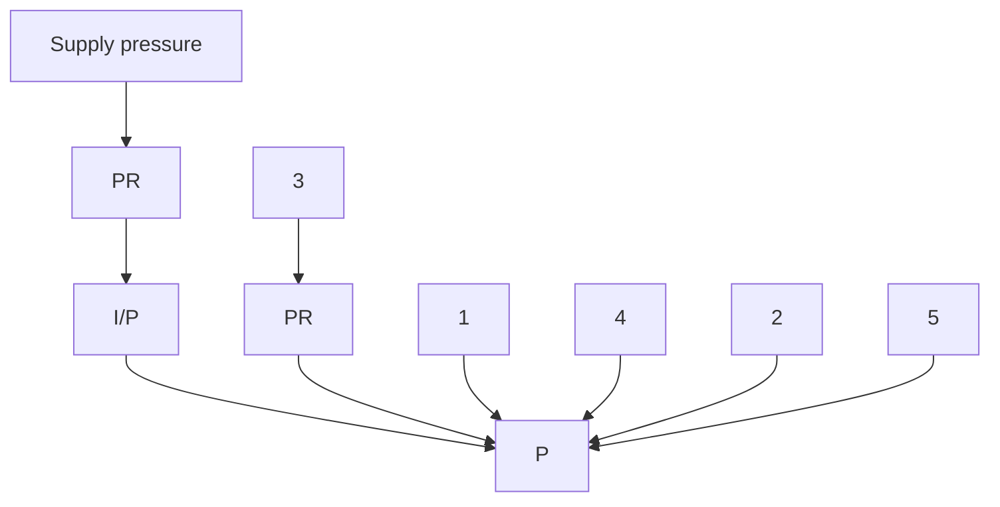

ENCONET d.o.o.

# GENERIC PROCEDURE FOR AOV DIAGNOSTIC TESTING

| Field | Value |
|-------|-------|
| Naziv Dokumenta: | Radna Uputa RU-74-01 |
| Revizija: | 2 |
| Stupa na snagu: | 17.11.2017. |

Kontrolirana kopija broj:

| Role | Name | Date |
|------|------|------|
| Prepared by: | Boško Lukić, mag. ing. stroj. | 13.11.2017. |
| Reviewed by: | Vladimir Križe, mag. ing. stroj. | 14.11.2017. |
| Approved by: | dr.sc. Nenad Debrecin, dipl. ing. | 15.11.2017. |

Periodični pregled

| Pregledao | Datum | Slijedeći pregled |
|-----------|-------|-------------------|
|           |       |                   |
|           |       |                   |
|           |       |                   |
---
TEST PROCEDURE                                                                                                            ENCONET d.o.o.

# TABLE OF CONTENTS

1. PURPOSE AND SCOPE ..................................................................................... 2
   1.1 PURPOSE..................................................................................................... 2
   1.2 SCOPE.......................................................................................................... 2

2. REFERENCES .................................................................................................... 3

3. RESPONSIBILITIES ............................................................................................ 4

4. DEFINITIONS AND ABBREVIATIONS ................................................................ 7
   4.1 DEFINITIONS................................................................................................ 7
   4.2 ABBREVIATIONS.......................................................................................... 9

5. PRECAUTIONS AND LIMITATIONS ................................................................. 10

6. PREREQUISITES .............................................................................................. 12

7. PROCEDURE INSTRUCTION........................................................................... 13
   7.1 Universal System Setup .............................................................................. 13
      7.1.1 AOV Database Setup............................................................................ 13
      7.1.2 Transducer Data Setup......................................................................... 13
   7.2 Instrumentation Setup ................................................................................. 14
   7.3 As Found Test Setup................................................................................... 18
   7.4 As Found Test Performance........................................................................ 18
   7.5 As Left Test Setup ....................................................................................... 20
   7.6 As Left Test Performance............................................................................ 20

8. ACCEPTANCE CRITERIA................................................................................. 22

9. APPENDIX......................................................................................................... 26
---
TEST PROCEDURE                                                                           ENCONET d.o.o.

# 1. PURPOSE AND SCOPE

## 1.1 PURPOSE

This test procedure provides instructions to field personnel for the installation and acquisition of Air Operated Valves (AOV) diagnostic signatures by using CRANE NUCLEAR's UDS on selected AOV's. These signatures are used to evaluate the conditions of the AOV as well as determine if the AOV is functioning within design specifications.

Diagnostic Test should be performed on all Category 1 and Category 2 AOVs, unless existing site programs and normal plant operation provide adequate demonstration of AOV capability via periodic cycling. Diagnostic testing is performed with the intent to:

- Verify the functional capability
- Validate DBR design inputs
- Confirm required operating set-points
- Establish a reference for periodic testing.

## 1.2 SCOPE

AOVs, included in the AOV Program, are Category 1 and Category 2 air-operated valves, according to JOG AOV Program.

This test procedure may be used to perform following:

- As-Found baseline testing
- As-Left baseline testing
- Post-maintenance testing
- Troubleshooting
- Set-point control
- Periodic verification testing.

Page 2
---
TEST PROCEDURE                                                                   ENCONET d.o.o.

## 2. REFERENCES

- JOG AOV Program, March 2001, Rev. 1

- Data acquisition & Basic analysis for AOV,
  CRANE NUCLEAR, November 2005., Rev. 6

- Advanced signature analysis for AOV,
  CRANE NUCLEAR, March 2001., Rev. 1

- Air Operated Valves Universal Diagnostic System,
  CRANE NUCLEAR – User's Manual (Ver. 3.1)

- CRANE NUCLEAR Procedures UTP-2.1, Rev. 2

- HRN EN ISO 9001:2015

- Enconet - Priručnik kvalitete PK-SUK-001, NP-SUK-001

- IAEA Leadership and Management for Safety, IAEA Safety Standards Series,
  No. GSR Part 2, IAEA Vienna, 2016.
---
TEST PROCEDURE                                                                            ENCONET d.o.o.

### 3.       RESPONSIBILITIES

#### Test Leader

Test Supervisor has primary oversight and assessment responsibility for the Test
Program. This responsibility includes, but is not limited to, the following duties:

- Establish the Test Program scope criteria, giving appropriate consideration to
safety-significant AOVs as well as those affecting plant performance and reliability.

- Ensure Test Program technical documents, roles and responsibilities, and related
program procedures are kept up-to-date and are consistent with other controlled
documents.

- Ensure AOV Program requirements are implemented in appropriate station
processes, procedures, and documents.

- Ensure Test program deficiencies, their potential consequences, and proposed
resolutions are effectively communicated to station management.

- Provide oversight of maintenance and testing of AOVs.

- Provide supplemental recommendations for the type and scope of component
related training relevant to engineering, operations, and maintenance personnel.

- Provide principal interface with regulatory and oversight organizations for
resolving Test Program issues.

- Monitor and optimize Component Health. Issue Test Program Health Reports or
Performance Indicators as required to effectively communicate program health in a
timely manner.
---
TEST PROCEDURE                                                                          ENCONET d.o.o.

## Test Engineer

This may include, but is not limited to, the following typical duties:

- Categorize the Test Program based on the scope criteria. Identify this in the site's bases documents.

- Provide component expertise and field support to resolve AOV performance issues.

- Ensure the requirements of the PM Template are met and adjust frequency/scope based on component condition feedback.

- Provide technical guidance for AOV diagnostic testing and test trace interpretation.

- Maintain an appropriate AOV database. As a minimum, the database should contain data related to actuator and valve specifications, installed valve configurations, component identifiers, and so forth.

- Support on-line and outage AOV maintenance activities.

- Review relevant Test Program documents and procedures including AOV-specific maintenance procedures.

- Review AOV-related design documents.

- Provide Maintenance with AOV Set point Data Sheets.

- Trend and evaluate AOV performance and test data.

- Identify and define AOV test requirements and acceptance criteria.

- Monitor obsolete component replacement needs.
---
TEST PROCEDURE                                                                          ENCONET d.o.o.

## AOV Engineer

The assigned engineer should be fully trained and qualified in a timely manner. This person shall be engaged in the Test Program in order to support duties such as:

- Able to assist Maintenance in test performance and data collection.

- Capable of reviewing and analyzing diagnostic traces.

- Provide component expertise to resolve AOV performance issues.

- Comparison of current test data to past test results (if available).

- Coordinate activities related to routine testing, corrective and preventive maintenance.

- Identifying needed revisions to engineering drawings, standards and other engineering output documents.

- Provides test data to the Test Leader as formal input to trending reports.

## Maintenance Personnel

These individuals perform testing and conduct preventive and corrective maintenance on AOVs. The Maintenance personnel provide continuous feedback to the AOV Program.
---
TEST PROCEDURE                                                                            ENCONET d.o.o.

## 4. DEFINITIONS AND ABBREVIATIONS

### 4.1 DEFINITIONS

**Actuator force**

This force is the amount of force that a sliding stem actuator is capable of applying to the positioning of an end use component.

**AOV program**

Program developed to specify requirements that should be satisfied to provide assurance that AOVs in the scope are capable of performing their intended safety-significant functions.

**Bench Set**

Bench Set is a specification that is used to verify proper actuator operation. Bench set is expressed as the pressure range from the start of the actuator stroke to the valve's rated travel.

**Cage-guided valve**

This type of valve uses a cage for plug guiding and alignment.

**Closure member**

This is a moveable part of a valve that is positioned in the flow path to modify the rate of flow through the valve.

**Control valve**

A power-operated device that modulates the fluid flow rate in a process control system. It consists of a valve connected to an actuator mechanism that is capable of changing the position of a flow-controlling element in the valve in response to a signal from the controlling system.

**Direct-acting actuator**

An actuator in which the actuator stem extends toward the control valve in response to an increasing input signal.
---
TEST PROCEDURE                                                                            ENCONET d.o.o.

## Fail-closed (FC)

A condition in which the valve port remains closed in the event of loss of supply pressure.

## Fail, mode

The position to which a valve returns on the loss of supply pressure. For example, in spring-return and spring-bias actuators, the springs permit fail-open or fail-closed operation.

## Fail-open (FO)

- condition in which the valve port remains open in the event of the loss of supply pressure.

## Normally closed control valve (NC)

- valve that closes when actuator pressure is reduced to atmospheric pressure.

## Normally open control valve (NO)

- valve that opens when actuator pressure is reduced to atmospheric pressure.

## Reverse-acting actuator

An actuator construction in which the actuator stem retracts away from the control valve with increasing diaphragm pressure.

## Seat load

The contact force between the seat and the valve disk, ball, or plug. (In practice, the selection of an actuator for a given control valve is based on how much force is required to overcome static and dynamic unbalance with an allowance made for seat load.)

## Set point

Set point is desired value for the controlled variable. The set point is an input variable that can be manually or automatically set and is expressed in the same units as the controlled variable, for example, degrees F, standard cubic feet/hour (SCFH), psig.
---
TEST PROCEDURE                                                                          ENCONET d.o.o.

### Sliding stem control valve

A valve construction style in which the valve closure member (plug) moves in a linear path.

### Test Package

Test package includes all required documents that cover all useful information for testing performance.

### Trim, balanced

Trim that uses some design technique to minimize pressure unbalance across the valve plug. This technique reduces the actuator force that is necessary to throttle and seat the plug.

### 4.2     ABBREVIATIONS

AOV – Air Operated Valve

ATC – Air to Close

ATO – Air to Open

DAM – Data Acquisition Module

DP – Differential Pressure

COC – Closed to Open to Closed

OC – Open to Close

OCO - Open to Close to Open

PSI – Pounds per square inch

I/P – Current to pressure transducer

P/I – Pressure to current transducer

SAM – Signature Analysis Module

UDS – Universal Diagnostic System
---
TEST PROCEDURE                                                                             ENCONET d.o.o.

## 5. PRECAUTIONS AND LIMITATIONS

### 5.1
When testing an AOV, pay attention to the air pressure applied to the various devices. At no time should greater than maximum allowable pressure be applied to a device. If a device has been over-pressurized, then an operability determination must be completed.

### 5.2
All equipment should be protected with plastic bags prior to entering a contamination area. The limit for operating SAM and DAM in sealed plastic bags (no air circulation) is approximately one hour. There is no time limitation for equipment operating in a non-sealed bag with air circulation.

### 5.3
Ensure all control power is removed before installing or removing wiring to switches or solenoid valves. Observe safety precautions for working on energized electrical equipment.

### 5.4
Ensure all plant supply and instrument air lines are isolated prior to breaching. If the supply or instrument air lines cannot be isolated and a resolution has not been established, contact the Valve engineer for further directions.

### 5.5
Be sure the cable connection of all equipment is complete before energizing test equipment. Allow a twenty minute warm-up time for the DAM and five minute for the SAM, before taking any signatures.

### 5.6
An engineering evaluation of degradations should be performed to determine required corrective actions. Operability of the actuator must be determined by the Valve engineer.

### 5.7
Any temporary pneumatic supplies must be clean and filtered.

### 5.8
This test procedure does not cover every circumstance or difficulty. When a problem is discovered, work shall stop. Test engineer are responsible for notifying the Valve engineer and/or Test coordinator to be sure that all deficiencies discovered must be recorded on the Field Data Sheets.
---
# TEST PROCEDURE                                                ENCONET d.o.o.

5.9   Before any test is performed on a valve, the responsible engineer or
      technician must assure that all plant and/or corporate safety policies and
      procedures have been read, understood, and will be adhered to.

5.10  All air supplied to the CRANE NUCLEAR Diagnostic System must be clean,
      filtered air.

5.11  The system needs to stroke the valve over its full range. To properly adjust
      the travel transducer, ensure that there are no mechanical obstructions in the
      valve assembly or fingers in the way.

5.12  To prevent electrical injury to personnel and damage to equipment, make
      sure that electrical power is disconnected before connecting the current input
      cable.

5.13  Personal injury or equipment damage may result from inadvertent operation
      of the test valve. Be sure signals generated by CRANE UDS software are at
      zero (0) before supplying power to the data acquisition box.

5.14  When the "Start" button is pressed, the valve will begin to move. Keep hands
      and fingers away from areas where they can be pinched. Exercise all nor-
      mal precautions used when testing control valves.

5.15  All normal plant procedures need to be followed, required lockouts done, and
      pertinent permits obtained before starting to test a valve.

5.16  Leaks can affect test results and valve operation. Carefully, leak check all
      pressure transducers connections and any other temporary air line
      connection.

5.17  Since the Lucas 100 and 30 psig pressure transducers are of the same size
      and shape, ensure that the Lucas 30 psig transducer is ONLY installed on the
      Instrument/Signal Port (I/P Signal Pressure). The other ports typically
      produce pressure much greater then 30 psig, which could potentially damage
      Lucas 30 psig pressure transducer.
---
TEST PROCEDURE                                                                           ENCONET d.o.o.

## 6. PREREQUISITES

6.1 Before commencing any work in accordance with this procedure, a Work Order must be issued and approved by responsible person.

6.2 To aid in preparation, testing and analysis, electrical schematic, loop diagrams, P&IDs, valve drawings, and any pertinent AOV maintenance records are necessary.

6.3 A list of actuator sizes and types, and AOV identification numbers are required to serve as the basis for the filling system used to store and track data packages.

6.4 A subsequent walk-down of all valves to be tested is required to determine working conditions, accessibility to lighting and power outlets and the need for scaffolding or any other special work conditions.

6.5 Verify the calibration of all equipment before its use.

6.6 All calibrated tools and equipment that are used, shall be recorded on appropriate Field Data Sheets.

6.7 Steps not used during the test shall be marked "N/A".

6.8 Request an equipment clearance (e.g. test tag) for the task specified on the work package.

6.9 For steps in this procedure where direct verbal communication cannot be maintained between all personnel involved in the test, establish communications (radio, intercom, phone) prior to starting those steps.

6.10 To establish communication between the SAM and the DAM, the DAM must be turned on approximately forty (40) seconds prior to executing the universal software.
---
TEST PROCEDURE                                                                       ENCONET d.o.o.

## 7. PROCEDURE INSTRUCTION

Section 7.1 is required before using the CRANE UDS for the first time at a site and should be completed on the main computer to reduce time spent on valve. If the valve database has already been established, proceed to Section 7.2.

Since AOV UDS is a software/hardware package which is inseparable, procedure for each part of the package shall be described.

### 7.1 Universal System Setup

#### 7.1.1 AOV Database Setup

7.1.1.1 From the main menu select Data    Maintenance.

7.1.1.2 Select the AOV Database Editor. This function allows the user to add new AOVs, edit or delete.

7.1.1.3 Add all desired AOV information by choosing NEW from Database Editor menu.

7.1.1.4 Enter the AOV ID, Function and Test Directory, and all related information under AOV Properties. Choose OK to continue.

7.1.1.5 For all new AOVs repeat previous steps.

7.1.1.6 Use the Export/Import option to transfer the database to the SAM.

#### 7.1.2 Transducer Data Setup

NOTE: There are two databases to choose from, permanent or local. The Local Database is a list of temporarily installed transducers, and the Permanent Database which is a list of permanently installed transducers for that particular AOV.
---
TEST PROCEDURE                                                                            ENCONET d.o.o.

7.1.2.1 From the main menu select the Transducer icon.

7.1.2.2 From the submenu select NEW to add a new transducer or Edit to change
        already saved information.

7.1.2.3 Add the transducer information such as: span number, serial number and
        calibration due data.

7.1.2.4 Repeat steps .2 and .3 for all available transducers on site.

7.1.2.5 Export the transducer database to the SAM by using the Export/Import option.

7.2    Instrumentation Setup

7.2.1 Conduct the pre job briefing.

7.2.2 Notify responsible person prior to starting work. Inform of any external
      switches that may be installed on the AOV used as interlocks that could
      potentially actuate other devices.

7.2.3 Collect the appropriate sensors needed for testing.

7.2.4 If required by system outages to provide an alternative air source, a
      compressor or alternate air source may be utilized with plant approval and
      proper filtration and pressure regulation is installed.

7.2.5 Record the tag number of the AOV being worked in the appropriate Field Data
      sheet. Verify the tag number of the AOV is identical to the tag number shown
      on the Work Package. If the tag number is different, contact the Test
      Coordinator.

7.2.6 For a linear AOV, examine the valve stem to positioner attachment and
      determine the best location for the stem attachment.

7.2.7 Attach the displacement transducer to the side of the actuator or valve body
      using the Transducer Mounting fixture and quick disconnect strap. Align
      directly over the Stem Attachment, and adjust so that the transducer cable will
      not be overextended when the valve is seated, and secure the quick
      disconnect strap.
---
TEST PROCEDURE                                                                                 ENCONET d.o.o.

7.2.8 Connect the transducer lanyard (string) to the Stem Attachment. Temporary
      fittings will be installed to the positioner to facilitate the installation of the Lucas
      Pressure Transducer.

7.2.9 Examine the valve positioner and identify the signal pressure gauge. If a small
      pressure gauge is not present on the positioner, examine the tubing
      connecting the I/P transducer to the positioner for a tee or similar access point.
      Consult the manufacturer's maintenance literature if there is difficulty
      identifying this port.

7.2.10 Connect the signal pressure transducer (Lucas 30 psig) to this pneumatic line.

7.2.11 Examine the valve positioner and identify the diaphragm pressure gauge. If
       the small pressure gauge is not present on the positioner, examine the tubing
       connecting the diaphragm housing of a diaphragm actuator to the positioner
       for a tee or similar access point. Consult the manufacturer's maintenance
       literature if there is difficulty identifying these ports.

7.2.12 Connect the diaphragm pressure transducer (Lucas 100 psig) to the
       pneumatic lines.

7.2.13 Examine the valve positioner and identify the supply pressure port or
       connection to the positioner for a gauge, tee or similar access point. Consult
       the manufacturer's maintenance literature if there is difficulty identifying this
       port.

7.2.14 Connect the supply pressure transducer (Lucas 100 psig) to the pneumatic
       line.

7.2.15 Verify that the pressure transducers are installed in accordance with Table 1
       on page 17, and securely connected.

7.2.16 Turn on the air supply to the valve and check all pressure transducers and
       bypass lines connections for leaks.

7.2.17 Correct any air leaks before proceeding.

7.2.18 If the existing plant I/P cannot be used or the AOV does not have an I/P and a
       temporary I/P is to be installed, proceed to the step 7.2.23.

Page 15
---
TEST PROCEDURE                                                                             ENCONET d.o.o.

7.2.19 To install temporary I/P verify that the instrument air is isolated and disconnect
        the existing plant's I/P at the input side of the device.

7.2.20 Use appropriate fittings and tubing's in order to connect the temporary I/P
        correctly to the instrument side of the AOV positioner.

7.2.21 Turn on the instrument air to the valve and check all the connections on the I/P
        and to the positioner for leaks.

7.2.22 Correct any air leaks before proceeding.

7.2.23 Install any other transducers that may be required for testing.

7.2.24 Connect the all cables from the sensors to the DAM.

7.2.25 Connect the communication cable from the DAM to the SAM.

7.2.26 Energize the DAM and then the SAM. Allow a 20 minute warm up time for the
        DAM prior to collecting data.

7.2.27 From the main menu on the computer run the AOV Selection program.

7.2.28 Select the AOV which is going to be tested from the active AOV list.

7.2.29 If the desired AOV is not listed, check the path to the AOV test directory to be
        sure the computer is looking in the right place. The AOV may be stored in
        another database.

7.2.30 Press enter to accept the highlighted AOV and return to the main menu.

7.2.31 From main menu select Channel Configure. The master list of transducers
        used at the plant should be created before using the Channel Configure.

7.2.32 In the Test Selection screen select what type of test is to be performed. In our
        case it is Baseline Test.

7.2.33 In the Transducer Channel Configuration screen set up the system
        configuration.

7.2.34 To configure the UDS click on the AUTO CONFIGURE button. The UDS
        software will automatically setup the Transducer to Channel Configuration
        screen based on the module detected.
---
TEST PROCEDURE                                                                               ENCONET d.o.o.

7.2.35 Associating a Transducer with the channel should be performed following the
Channel Configuration. See Table 1.

Table 1

| Channel | Universal | Encoder Module |
|---------|-----------|-----------------|
| Name | Module | |
| Diaphragm Pressure | Lucas 100 psig | N/A |
| I/P Signal Pressure | Lucas 30 psig | N/A |
| Supply Pressure | Lucas 100 psig | N/A |
| Position | N/A | HS Encoder |

7.2.36 For Data Acquisition return to the "Transducer to Channel Configuration"
screen. As-Found Testing is described in section 7.3.

7.2.37 Functional Block Diagram

1 – Diaphragm pressure transducer
2 – I/P pressure transducer
3 – Supply pressure transducer
4 – Travel transducer
5 – Lock-up test valve
P – Positioner
PR – Pressure Regulator
I/P – Current to pressure transducer
---
TEST PROCEDURE                                                                               ENCONET d.o.o.

## 7.3      As Found Test Setup

7.3.1 If required, perform appropriate steps within Sections 7.1 and 7.2 to input AOV
       information and to setup the Universal System for testing. Verify that the
       information entered in step 7.1.1.3 matches the design information in the work
       package.

7.3.2 Record AOV and equipment information in the Field Data Sheet 1.

7.3.3 Determine the Acquisition Type to be either Test or Live Display. If using Test
       mode, select the test type to be used.

## 7.4      As Found Test Performance

7.4.1 Once the AOV acquisition and test type has been selected, the channel
       configured and the transducers associated, enter the Acquisition Setup menu
       by clicking the Acquire Signature button. Select the parameters desired for the
       test and click OK.

7.4.2 Select either EXTEND or RETRACT describing encoder action on closing,
       reset the HS Encoder reference to zero.

7.4.3 If the test is being controlled by the UDS, verify that the valve went full closed.
       If full closed, continue with step 8.4.4. If the valve is still open, verify that the
       right input range (mA) was entered. Repeat step 8.4.1.

7.4.4 Stroke the valve by using the UDS current output through the plants I/P or
       through the remote I/P transducer for the predefined test or by the dictating
       authority (i.e. Control Room or pneumatic switch) if using Live Display.

7.4.5 Analyze the signatures. If the data is acceptable, proceed to step 7.4.7.

Page 18
---
TEST PROCEDURE                                                                            ENCONET d.o.o.

7.4.6 If the data acquisition is not acceptable then repeat steps 7.3.1 through 7.4.5
      as necessary.

7.4.7 If the As-Found data is acceptable and the As-Left test is to be conducted
      upon completion of the As-Found test, then proceed to Section As-Left Test
      Setup, otherwise proceed to the next step.

7.4.8 If the As-Left test is to be conducted later, or if maintenance of the actuator or
      valve is required, perform the following:

7.4.8.1 De-energize the test equipment and remove the air and any power supplied
        to the valve.

7.4.8.2 Remove all equipment and restore the actuator, and reconnect all plant air
        lines.

7.4.8.3 Restore the actuator to its normal condition unless directed to do
        otherwise.

7.4.8.4 If necessary, contact AOV Engineer to resolve any operability problems.

7.4.8.5 If required, contact responsible person to stroke the valve one complete
        cycle to verify proper operation.

7.4.8.6 Complete analyses of the As-Found data, print report and attach to the
        Field Data Sheet, or place in the work package.

7.4.8.7 If applicable, and data/results are acceptable release Equipment Clearance
        (i.e. Test Tags). Notify responsible person that test is complete.

7.4.8.8 It would be useful to transfer applicable AOV UDS data to the permanent
        storage medium.

7.4.8.9 Complete Field Data Sheet and return documentation to the Valve
        Engineering for review and disposition.
---
TEST PROCEDURE                                                                            ENCONET d.o.o.

## 7.5     As Left Test Setup

NOTE: Be sure that all maintenance on the actuator and valve is performed before the AS-LEFT test, and is properly documented.

7.5.1 If required, performed appropriate steps within section 7.1 and 7.2 to input AOV information and to set-up the UDS for testing. Verify that the information entered in step 7.1.1.3 matches the design information in the work package.

7.5.2 Record AOV and equipment information in the Field Data Sheet.

7.5.3 If required, based on As-Found test results, or previous maintenance, perform an I/P, Positioner calibration, Bench-set, travel adjustment, etc., using the Calibrate function of the AOV UDS Software, plant data and plant procedures.

7.5.4 Determine the Acquisition type to be either Test or Live Display. If using Test mode, select the test type to be used.

## 7.6     As Left Test Performance

7.6.1 Once the AOV, acquisition and test type has been selected, the channel configured and the transducers associated, enter the Acquisition Setup menu by clicking the Acquire Signatures button. Select the parameters desired for the test and click OK.

7.6.2 Select either EXTEND or RETRACT describing encoder action on closing, reset the HS encoder reference to zero.

7.6.3 Verify that the valve went full closed. If full closed, continue with step 7.6.4. If the valve is still open, verify that the right input range (ma) was entered. Repeat step 7.6.1.

7.6.4 Stroke the valve by using the UDS current output through the plants I/P or through the remote I/P transducer for the predefined test, or from the Control Room.
---
TEST PROCEDURE                                                                             ENCONET d.o.o.

7.6.5 Analyze the signatures. If the data is acceptable, Initial/Date in Field Data
      Sheet and proceed to step 7.6.7, or select a different test type and repeat step
      7.3.4, and steps 7.5.4 through 7.6.4.

7.6.6 If the data acquisition is not acceptable, or adjustment to the AOV is required
      then repeat steps 7.5.1 through 7.6.5 as necessary.

Page 21
---
TEST PROCEDURE                                                                             ENCONET d.o.o.

## 8. ACCEPTANCE CRITERIA

Acceptance criteria encompass the set of critical parameters for selected diagnostic testing type. Critical parameters of all tested valves must be within prescribed limits in order to declare the valve capable of fulfilling its intended safety function between outages. Otherwise, affected valves must be scheduled for repair or other corrective activities.

These parameters, with acceptable margins, are listed below:

### Baseline Test

- **Measured Total Travel**: Difference between measured position at minimum and maximum control signal. Up to 0,125" of normal travel.

- **Signal at Minimum Travel**: Calibration, ATO 4,1 – 4,5; ATC 19,5 – 19,9 mA.

- **Signal at Maximum Travel**: ATO 19,6 – 20,2 mA; ATC 3,8 – 4,4 mA.

- **Signal at Nominal Travel**: ATO 20 mA; ATC 4 mA.

- **Dynamic Linearity Error**: Maximum deviation of average up and down scale quasi-static travel data from an ideal straight line calculated from a linear regression of the valve travel and control signal data. Most control valves with positioner will have a linearity error less than 2%.

- **Friction**: Friction is the total net friction force in the valve assembly that acts in the direction opposite motion. Average friction value should be within +/- 25% of the manufacturer's specified friction level. Calculated in the 6% to 94% range of travel.

- **Bench-Set**: High and low values of pressure applied to diaphragm actuator to produce the nominal valve travel. The measured bench-set range should agree within +/- 10% of the specified range.

- **Spring Rate**: Change in spring force per change in spring length. Spring rate values should agree within +/- 10% of manufacturer's specified spring rate.
---
TEST PROCEDURE                                                                            ENCONET d.o.o.

**Signal Pressure at Min, Max and Nom travel**: Signal transducer output pressure (input to the positioner) at seat contact, measured total travel and nominal travel. Min ATO 3,2 – 3,5 psig; ATC 14,5 – 14,8 psig; Max ATO 14,5 – 14,8 psig; Nom ATO 15 PSI, ATC 3 PSI.

**I/P Output Pressure at Min and Max Signal**: Signal transducer output pressure at the endpoints of the signal transducer's nominal input range. 4-20 mA input signal, 3-15 psig output. Min and Max +/-0,25 psig (2% fs).

**Air Supply Decrease**: Percent decrease of air supply measured during the duration of the test. No greater than 10% loss of air supply for the duration of test.

**Dynamic Hysteresis Plus Dead band Error (DHPDBE)**: Difference in position of increasing and decreasing signal position at same input control signal near quasi-static test. Small single actuator <5%, Large and double actuator <12%.

**Seat Load**: Actuator plus spring, and spring only, are two cases of seat loading. Spring only significant in valves ability to shut-off in fail mode. Valve specific.

**Positioner DHPDBE**: Difference of valve position during increasing and decreasing signal at same I/P output pressure. Small diaphragm <5%, large and double <10%.

**Positioner Dynamic Linearity Error**: Deviation of average up and down scale in quasi-static travel from a ideal straight line. No greater then 2%.

**Positioner Balance Pressure**: Average pressure between top and bottom cylinders. Greater than 60% of air supply.

**I/P DHPDBE**: Difference between output pressure at increasing and decreasing signal motion at same input signal. Less than 1%FS.

**I/P Dynamic Linearity Error**: Maximum deviation of average up and down scale I/P output pressure from a ideal straight line. No greater than 1%FS.

Page 23
---
TEST PROCEDURE                                                                           ENCONET d.o.o.

## HDRL Test

Hysteresis Plus Dead bend Error: Crucial control less than 1%, not crucial less than 2,5%.

Repeatability Error: Crucial valves less than 0,5%, not critical 1,5%.

Linearity Error: Positioner should have a linearity error less than 2%.

## Step Response Test

Dead Time: Interval of time between start of input change and 1% of final steady state travel.

Response Time: Interval of time between start of input signal change and 63,2% of steady state travel.

Rise Time: Time required for valve travel from 10% to 90% of final steady state travel.

Total Time: Time of start of input signal and 98% of steady state travel.

## Step Sensitivity Test

Step Sensitivity Test evaluates valve response to proportioning signal that occurs as a valve is controlled onto a new set-point. Positioning sensitivity should be about 1/3 of the overall accuracy desired for the control loop. (+/- 10% of positioning error.)

Test evaluates 4 parameters: Actual step (in), Ideal step (in), Step error (in), Step error (%).

## Step Resolution Test

Step Resolution Test evaluates ability of the valve to respond to dithering steps about a set-point. Valve position and control signal are recorded as a function of time.
---
TEST PROCEDURE                                                                          ENCONET d.o.o.

Test evaluates 4 parameters: Actual step (in), Ideal step (in), Step error (in), Step error (%). Signal step change should be ½ the loop accuracy with +/-10% positioning error.

## Frequency Response Test

This test evaluates the ability of the valve to respond to a variable frequency sinusoidal input signal. Higher frequency response provides better control characteristics. Frequency of 0,1 – 1 – 2 Hz, at 50% of span
---
TEST PROCEDURE                                                ENCONET d.o.o.

## 9. APPENDIX

N/A