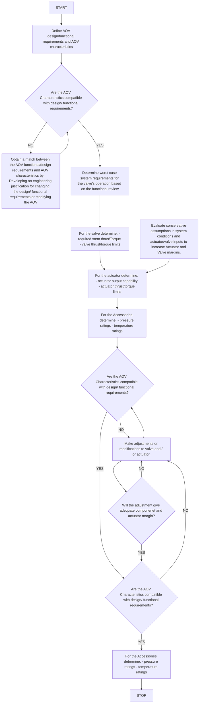

ENCONET d.o.o.

# DESIGN BASIS REVIEW  PROCEDURE

| Field | Value |
|-------|-------|
| Naziv Dokumenta: | Radna Uputa RU-74-02 |
| Revizija: | 2 |
| Stupa na snagu: | 17.11.2017. |
| Kontrolirana kopija broj: | |

| Role | Name | Date |
|------|------|------|
| Prepared by: | Boško Lukić, mag. ing. stroj. | 13.11.2017. |
| Reviewed by: | Vladimir Križe, mag. ing. stroj. | 14.11.2017. |
| Approved by: | dr. sc. Nenad Debrecin, dipl. ing. | 15.11.2017. |

## Periodični pregled

| Pregledao: | Datum: | Slijedeći pregled: |
|------------|--------|---------------------|
|            |        |                     |
|            |        |                     |
|            |        |                     |
---
DESIGN BASIS REVIEW                                                             ENCONET d.o.o.

## SUMMARY

Proper engineering evaluation and setup of air-operated valves (AOV) is critical to the safe operation of a nuclear power plant. This document provides a methodology of AOVs engineering evaluation (Design Basis Review) which encompasses design basis system condition, required thrust and/or torque, air actuator output thrust/torque capability and operating margins.

The method presented incorporate lessons learned and tools developed as part of the EPRI Motor Operated Valve Performance Prediction Research Program and during EPRI pilot AOV programs implemented at several nuclear power plants.
---
DESIGN BASIS REVIEW                   ENCONET d.o.o.

## KEY WORDS

- Actuator
- AOV
- Ball Valve
- Butterfly Valve
- Design Basis
- Globe Valve
- Evaluation
- Friction
- Spring
---
DESIGN BASIS REVIEW                                                                                        ENCONET d.o.o.

# TABLE OF CONTENTS

1. PURPOSE AND SCOPE ...................................................................................... 4
   1.1    PURPOSE...................................................................................................... 4
   1.2    SCOPE.......................................................................................................... 4

2. DESIGN BASIS REVIEW...................................................................................... 6
   2.1    DESIGN BASIS METHODOLOGY................................................................ 6
   2.2    ENGINEERING EVALUATION...................................................................... 8
   2.3    CALCULATION OF REQUIRED THRUST AND TORQUE ........................... 9
      2.3.1    Minimum Required Thrust for Globe Valves ........................................... 9
      2.3.2    Minimum Required Thrust for Gate Valves ........................................... 12
      2.3.3    Total Required Torque for Ball Valves .................................................. 13
      2.3.4    Butterfly valves...................................................................................... 14

3. RESULTS OF EVALUATION.............................................................................. 15

4. REFERENCES ................................................................................................... 16

5. APPENDIX.......................................................................................................... 17

Page 3
---
# DESIGN BASIS REVIEW ENCONET d.o.o.

## 1. PURPOSE AND SCOPE

### 1.1 PURPOSE

The purpose of this document is to present methodology for:

- Defining the functional and design requirements for an air-operated valve (AOV) and its accessories including code requirements and design basis/normal operating conditions.

- Evaluating valve design features that can affect AOV operation and calculating valve thrust/torque requirements.

- Evaluating air actuator design features that can affect AOV operation, calculating the actuator output thrust/torque, and evaluating the compatibility of the actuator and the valve.

- Evaluating the available margin between the actuator output thrust/torque and the required stem thrust/torque (i.e. capability margin), and evaluating valve/actuator survivable thrust and torque.

### 1.2 SCOPE

This document is applicable to the following valve designs:

- Globe Valves (Balanced and Unbalanced, 2-way,3-way, Piloted, Double seated)

- Gate Valves (Solid wedge, Flexible wedge, Anchor/Darling double disk, Aloyco split wedge)

- Butterfly Valves (Symmetric disk and single offset)

- Ball Valves (Floating ball and Trunnion)

Page 4
---
DESIGN BASIS REVIEW                                                           ENCONET d.o.o.

This document is, also, applicable to the following air actuator types:

➤ Diaphragm

➤ Piston

➤ Rack and Pinion

➤ Scotch Yoke

These actuators encompass the majority of air actuators found in the nuclear industry.
---
DESIGN BASIS REVIEW                                                             ENCONET d.o.o.

## 2. DESIGN BASIS REVIEW

The Design Basis Review consists of both a system level and component level review. The system design basis review identifies the worst case operating conditions for which AOV must operate and maintain position to perform its safety significant function. Elements of system design basis review are functional review and calculation of parameters.

Functional review includes: general valve information, description of valve function(s) within its system and detailed discussion of each operational evolution in which the valve is required to reposition.

Calculation of parameters is based on one or more of the scenarios established in functional review and identifies: upstream and downstream pressure, process fluid, flow direction, maximum expected differential pressure.

Component level review includes determination of minimum required thrust/torque to open/close the valve under worst case operating conditions and assessment of actuator output capability

### 2.1 DESIGN BASIS METHODOLOGY

The methodology of the evaluation is conducted in accordance with the flowchart shown in Fig. 1.1.

This methodology is fully compliant with the suggestions and recommendations of EPRI listed in the document EPRI Air-Operated Valves Evaluation Guide [1].
---
DESIGN BASIS REVIEW                                ENCONET d.o.o.

Figure 1.1   DBR Methodology
---
DESIGN BASIS REVIEW                                                               ENCONET d.o.o.

## 2.2 ENGINEERING EVALUATION

For each of valves, selected for evaluation, following activities will be performed:

> System level review:

- relevant system components
- type of fluid
- upstream and downstream pressure
- differential pressure
- maximum expected differential pressure.

> Component level review:

- description of valve function
- detailed discussion of each operational evolution in which the valve is required to reposition
- determination of upstream and downstream pressure and calculation of maximum expected differential pressure
- determination of minimum required thrust/torque
- evaluation of actuator output capability.

Evaluation of AOVs will be performed according to EPRI AOV Evaluation Guide.
---
DESIGN BASIS REVIEW                                               ENCONET d.o.o.

## 2.3 CALCULATION OF REQUIRED THRUST AND TORQUE

### 2.3.1 Minimum Required Thrust for Globe Valves

**Opening stroke**: FO = FDS + FP + FUS + FSR + FDF + FDP

FDS – disc and stem weight

FP – packing friction

FUS – friction at upper seal

FSR – stem rejection

FDF – disc to body friction

FDP – stem thrust due to DP

**Stem rejection load**

FSR = PB x (dS2 x π)/4

PB – bonnet pressure

dS – stem diameter

**Differential Pressure:**

FDP = ΔP (π/4)(dDP)2

**Closing stroke**: FC = FDS + FP + FUS + FSR + FDF + FDP + FSL

FSL – sealing load (closing only)

FSL = (SSEAT x ASEAT) x (sin θ + μs cos θ)

Page 9
---
DESIGN BASIS REVIEW                                                                ENCONET d.o.o.

SSEAT – required seating stress                     ASEAT – seat interface contact area
θ – disc half wage angle                            μs – disc-to-seat coefficient of friction

### Diaphragm Actuator Force (FA)

The diaphragm actuator force is calculated by multiplying the required air pressure in diaphragm chamber (psig) by effective diaphragm area (EDA, in2).

### Air usage

Following calculation is performed in accordance with Valve Handbook Section 10.1.5. [2]

The term air usage refers to the amount of air used by pneumatic actuator to stroke the valve after the valve is stroked, the air usage stops until the valve is stroked again. For spring-return (single-acting) diaphragm, no air is used on the side of the diaphragm. When the actuator is fully stroked, the air usage is the amount of the actuator's free-air volume at the pressure given.

$$V_1 = V_2 \frac{P_2}{P_1}$$

V1 = free-air volume (standard cubic feet), volume rate at standard atmospheric temperature 21°C and pressure 14.7 psia (1.01325 bar abs)

V2 = vessel volume (diaphragm chamber volume)

P1 = atmospheric pressure (14.7 psia)

P2 = absolute vessel pressure (psia)

V2 = EDA × VT

EDA - effective diaphragm area (inch2)

VT - valve travel (inch)

Page 10
---
DESIGN BASIS REVIEW                                                                  ENCONET d.o.o.

## Maximum Spring Force (FMS)

$$F_{MS} = (BS_1 \times EDA) + (SR \times VT)$$

BS1 - lower bench set (psig)
EDA - effective diaphragm area (inch²)
SR - spring rate (lb/inch)
VT - valve travel (inch)

## Packing Friction Force

$$F_P = G_{stress}υπd_sH_pμ_{up}$$

ds - stem diameter at the packing;    Gstress - gland stress (psi)
υ – packing stress ratio;             Hp – height of the packing (inch)
μup - coefficient of friction

$$G_{stress} = (T_{bolt} N_{bolt}) / (D_{bolt} K_{lube} A_p)$$

Tbolt – gland bolt torque value, lb-in; Nbolt – number of glands bolts

Dbolt – gland bolt diameter; Klube – lubrication factor between a gland bolt and nut

Ap = [(ds + 2Wp)² – ds²] π/4 - cross sectional area of the packing, in²
Wp – width of the packing, in

In order to fulfill valve intended function, diaphragm actuator force (FA) must overcome all other forces (FO or FC) acting on valve under given conditions.
---
DESIGN BASIS REVIEW                                                       ENCONET d.o.o.

### 2.3.2 Minimum Required Thrust for Gate Valves

Required thrust for gate valves can be evaluated using the EPRI MOV Performance Prediction Methodology.

Sealing Load (closing only)

$$F_{SL} = 2[S_{seat} \times A_{seat} - DP(d_{MS}^2\pi)/4][(sin\theta + \mu cos\theta)]$$

Required opening thrust

$$F_o = F_p + (d_s^2\pi)/4 \times P_{up} + (d_{MS}^2\pi)/4 \times VF \times DP$$

Required closing thrust

$$F_c = F_p - (d_s^2\pi)/4 \times P_{up} + (d_{MS}^2\pi)/4 \times VF \times DP$$

$F_p$ - packing load (lb)

$d_s$ - stem diameter (inch)

$P_{up}$ - upstream pressure (psig)

$d_{MS}$ - mean seat diameter of valve seat (inch)

DP - differential pressure (psig)

VF - valve factor - dimensionless

Page 12
---
DESIGN BASIS REVIEW                                                            ENCONET d.o.o.

### Valve factor

VF = μs/(cosϕ + μssinϕ) - for opening
VF = μs/(cosϕ - μssinϕ) - for closing

μs - disc to seat friction coefficient

ϕ - wedge half angle (°)

### Unwedging load (only for opening)

Fuw = Fct x B + Fp(1 - B) + (DP)(π/4)( dMS² x C - dS²)

B,C - constants depend on the half wedge angle

Fct - maximum allowable closure thrust (lb)

### 2.3.3 Total Required Torque for Ball Valves

#### Opening

To = Tp + Tss + Tds + Th - floating ball

To = Tp + Tss + Tb + Th   - trunnion ball

#### Closing

Tc = Tp + Tss + Tds   - floating ball

Tc = Tp + Tss + Tb    - trunnion ball

Tp - packing torque; Tss - static seat torque; Tds - dynamic seat torque

Tb - bearing torque

Page 13
---
DESIGN BASIS REVIEW                                                              ENCONET d.o.o.

$$T_{ds} = [DP(\pi/4)(d_{MS}^2)d_b]/\sqrt{(db2 - d_{MS}^2)}$$

$$T_b = DP(\pi/4)(d_{MS}^2)\mu_b(d_s/24)$$

Hydrodinamic Torque (opening only)

$$T_H = (DP/12)(HTF/100)(d_p)^3$$

HTF - hydrodynamic torque factor

### 2.3.4 Butterfly valves

The torque required to actuate butterfly valves can be predicted using the
EPRI MOV Performance Prediction Methodology
---
DESIGN BASIS REVIEW                                                                ENCONET d.o.o.

## 3. RESULTS OF EVALUATION

Results of engineering evaluation of selected AOVs will be presented in hard copy form of Work Report with the corresponding document number.

Results of engineering evaluation will contain all relevant information of each of selected AOVs such as position in related system, building, room, elevation, fluid type, description of operating conditions and one or more worst case scenarios.

Results will also contain detailed information of valves parameters such as bench set, spring rate, travel, diaphragm pressure, etc.

Other relevant information, such as type of valve (balanced or unbalanced, flow-under or over-the-seat) and actuator type (direct or reverse acting) will also be obtained in order to perform correct engineering evaluation of each of selected AOVs.

Final results (thrust and torque) with conclusions of performed evaluation will be given in order to determine the actual valves condition, functionality and actuator output capability.

If engineering evaluation shows the impossibility of valves to fulfill their intended function, recommendation of required maintenance activities will be given with the aim of achieving full operating capability of valve and actuator.

All relevant information have been found in NEK MECL Database and ING.MOD hard copy documentation.
---
DESIGN BASIS REVIEW                                                            ENCONET d.o.o.

## 4. REFERENCES

[1]     EPRI Air-operated Valves Evaluation Guide; TR-107322, May 1999.

[2]     Skousen, P. L.: Valve Handbook; Second Edition, 2004.

[3]     EPRI MOV Performance Prediction Methodology

[4]     HRN EN ISO 9001:2015

[5]     Enconet - Priručnik kvalitete PK-SUK-001, NP-SUK-001

[6]     IAEA Leadership and Management for Safety, IAEA Safety Standards Series,
        No. GSR Part 2, IAEA Vienna, 2016.

Page 16
---
DESIGN BASIS REVIEW                                                ENCONET d.o.o.

## 5. APPENDIX

N/A