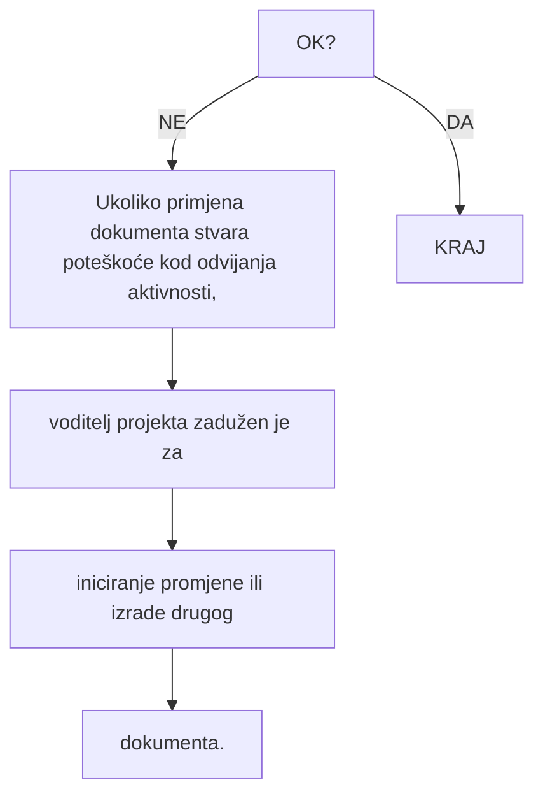

# RUN-20261007-03 - collected vendor crumbs

Source: DOC-0004, UPRAVLJANJE DOKUMENTIMA.

148 live vendor crumbs and 292 exact chapter links. Full-source direct-control and intent review. Empty forms show prescribed workflow, not completed work records. Applicability and conformance remain undecided.

[Registered source](<../../../raw/PP-42-01,R6 UPRAVLJANJE DOKUMENTIMA.md>)

## 1. CRUMB-DOC-0004-APP_B_VI-0001

supporting_control: Postupak ima oznaku PP-42-01, reviziju 6 i datum izdanja.

Source heading: UPRAVLJANJE DOKUMENTIMA

~~~~text
| Naziv dokumenta:        | Programski postupak PP-42-01 |
~~~~

Source heading: UPRAVLJANJE DOKUMENTIMA

~~~~text
| Revizija broj:          | 6                            |
~~~~

Source heading: UPRAVLJANJE DOKUMENTIMA

~~~~text
| Datum objavljivanja:    | 17.11.2017.                  |
~~~~

## 2. CRUMB-DOC-0004-APP_B_VI-0002

candidate_lead: Broj kontrolirane kopije nije popunjen u naslovnoj tablici.

Source heading: UPRAVLJANJE DOKUMENTIMA

~~~~text
| Kontrolirana kopija broj: |                             |
~~~~

## 3. CRUMB-DOC-0004-APP_B_VI-0003

supporting_control: Naveden je QA autor s datumom pripreme.

Source heading: UPRAVLJANJE DOKUMENTIMA

~~~~text
| Pripremio:              | Vladimir Križe, voditelj QA | 13.11.2017. |
~~~~

## 4. CRUMB-DOC-0004-APP_B_VI-0004

supporting_control: Naveden je pregled predstavnice direktora s datumom.

Source heading: UPRAVLJANJE DOKUMENTIMA

~~~~text
| Pregledao:              | mr.sc. Ilijana Iveković, predstavnica direktora | 14.11.2017. |
~~~~

## 5. CRUMB-DOC-0004-APP_B_VI-0005

supporting_control: Naveden je direktor kao odobravatelj s datumom.

Source heading: UPRAVLJANJE DOKUMENTIMA

~~~~text
| Odobrio:                | dr.sc. Nenad Debrecin, direktor | 15.11.2017. |
~~~~

## 6. CRUMB-DOC-0004-APP_B_VI-0006

objective_control: Upravljanje dokumentom određuje format i sadržaj.

Source heading: 1. SVRHA

~~~~text
Postupkom se definiraju postupci i odgovornosti za upravljanje dokumentima,
neovisno o njihovom podrijetlu. Postupkom se, za sve dokumente utvrđuje:
~~~~

Source heading: 1. SVRHA

~~~~text
- format i sadržaj
~~~~

## 7. CRUMB-DOC-0004-APP_B_VI-0007

objective_control: Dokument mora imati jedinstvenu oznaku.

Source heading: 1. SVRHA

~~~~text
Postupkom se definiraju postupci i odgovornosti za upravljanje dokumentima,
neovisno o njihovom podrijetlu. Postupkom se, za sve dokumente utvrđuje:
~~~~

Source heading: 1. SVRHA

~~~~text
- jedinstven način označivanja
~~~~

## 8. CRUMB-DOC-0004-APP_B_VI-0008

objective_control: Propisana je priprema, pregled i odobrenje.

Source heading: 1. SVRHA

~~~~text
Postupkom se definiraju postupci i odgovornosti za upravljanje dokumentima,
neovisno o njihovom podrijetlu. Postupkom se, za sve dokumente utvrđuje:
~~~~

Source heading: 1. SVRHA

~~~~text
- postupak pripreme, pregleda i odobravanja
~~~~

## 9. CRUMB-DOC-0004-APP_B_VI-0009

objective_control: Propisan je periodični pregled i izmjena.

Source heading: 1. SVRHA

~~~~text
Postupkom se definiraju postupci i odgovornosti za upravljanje dokumentima,
neovisno o njihovom podrijetlu. Postupkom se, za sve dokumente utvrđuje:
~~~~

Source heading: 1. SVRHA

~~~~text
- postupak za periodički pregled i izmjene
~~~~

## 10. CRUMB-DOC-0004-APP_B_VI-0010

objective_control: Propisana je dostava i poništenje starih revizija.

Source heading: 1. SVRHA

~~~~text
Postupkom se definiraju postupci i odgovornosti za upravljanje dokumentima,
neovisno o njihovom podrijetlu. Postupkom se, za sve dokumente utvrđuje:
~~~~

Source heading: 1. SVRHA

~~~~text
- postupak objavljivanja, dostave i poništavanja starih revizija
~~~~

## 11. CRUMB-DOC-0004-APP_B_XVII-0001

objective_control: Određuje se mjesto i način arhiviranja, čuvanja i izdavanja.

Source heading: 1. SVRHA

~~~~text
Postupkom se definiraju postupci i odgovornosti za upravljanje dokumentima,
neovisno o njihovom podrijetlu. Postupkom se, za sve dokumente utvrđuje:
~~~~

Source heading: 1. SVRHA

~~~~text
- način i mjesto arhiviranja, čuvanja i izdavanja
~~~~

## 12. CRUMB-DOC-0004-APP_B_VI-0011

objective_control: Postupak obuhvaća interne, kupčeve i vanjske dokumente te posebno projektnu dokumentaciju.

Source heading: 2. PODRUČJE PRIMJENE

~~~~text
Postupak se može prema potrebi primjenjivati na sve dokumente izrađene u
Enconetu te dobivene od kupca ili trećih osoba, a posebno se primjenjuje na
dokumentaciju striktno vezanu za projekte, koja je zahtjevana prema
evidencijskoj lista IOD brojeva projekta.
~~~~

## 13. CRUMB-DOC-0004-APP_B_VI-0012

candidate_lead: Navode se regulatorne i standardne reference; objective evidence not shown samim popisom.

Source heading: 3. REFERENCE

~~~~text
1. HRN EN ISO 9001:2015
~~~~

Source heading: 3. REFERENCE

~~~~text
   Sustavi upravljanja kvalitetom – Zahtjevi
   Upravljanje dokumentima
~~~~

Source heading: 3. REFERENCE

~~~~text
2. IAEA Leadership and Management for Safety, IAEA Safety Standards Series,
~~~~

Source heading: 3. REFERENCE

~~~~text
   No. GSR Part 2, IAEA Vienna, 2016.
~~~~

Source heading: 3. REFERENCE

~~~~text
3. American Code of Federal Regulation, 10CFR50 App. B, Criteria 6, Document
~~~~

Source heading: 3. REFERENCE

~~~~text
   Control
~~~~

Source heading: 3. REFERENCE

~~~~text
4. NQA-1, Requirement 6, Document Control
~~~~

Source heading: 3. REFERENCE

~~~~text
5. Enconet - Priručnik kvalitete PK
~~~~

Source heading: 3. REFERENCE

~~~~text
   Sustavi upravljanja kvalitetom – Zahtjevi
   Upravljanje dokumentima
~~~~

Source heading: 3. REFERENCE

~~~~text
6. Enconet - Programski postupak PP-42-02
~~~~

Source heading: 3. REFERENCE

~~~~text
   Upravljanje zapisima kvalitete
~~~~

## 14. CRUMB-DOC-0004-APP_B_I-0001

objective_control: Direktor potpisuje i odobrava objavu dokumenata.

Source heading: 5. ODGOVORNOSTI

~~~~text
Direktor Enconeta je odgovoran da:
~~~~

Source heading: 5. ODGOVORNOSTI

~~~~text
- potpisuje i odobrava objavljivanje dokumenata
~~~~

## 15. CRUMB-DOC-0004-APP_B_XVII-0002

objective_control: Direktor osigurava prostor i uvjete za čuvanje dokumentacije.

Source heading: 5. ODGOVORNOSTI

~~~~text
Direktor Enconeta je odgovoran da:
~~~~

Source heading: 5. ODGOVORNOSTI

~~~~text
- osigura odgovarajući prostor te uvjete arhiviranja i čuvanja dokumentacije
~~~~

## 16. CRUMB-DOC-0004-APP_B_VI-0013

objective_control: Direktor nalaže evidenciju deponiranih potpisa i potrebne žigove.

Source heading: 5. ODGOVORNOSTI

~~~~text
Direktor Enconeta je odgovoran da:
~~~~

Source heading: 5. ODGOVORNOSTI

~~~~text
- izdaje nalog da se izradi popis deponiranih potpisa djelatnika i svi potrebni
~~~~

Source heading: 5. ODGOVORNOSTI

~~~~text
  žigovi Enconeta
~~~~

## 17. CRUMB-DOC-0004-APP_B_VI-0014

objective_control: Voditelji održavaju popis internih i vanjskih dokumenata svog područja.

Source heading: 5. ODGOVORNOSTI

~~~~text
Voditelji projekata su odgovorni da:
~~~~

Source heading: 5. ODGOVORNOSTI

~~~~text
- uspostave i obnavljaju popis dokumenata u svom području rada (kako internih
~~~~

Source heading: 5. ODGOVORNOSTI

~~~~text
  tako i eksternih dokumenata)
~~~~

## 18. CRUMB-DOC-0004-APP_B_VI-0015

objective_control: Voditelji iniciraju izradu i preglede novih ili revidiranih dokumenata.

Source heading: 5. ODGOVORNOSTI

~~~~text
Voditelji projekata su odgovorni da:
~~~~

Source heading: 5. ODGOVORNOSTI

~~~~text
- iniciraju pripremu (izradu), pregled i objavljivanje kako novih dokumenata tako
~~~~

Source heading: 5. ODGOVORNOSTI

~~~~text
  i onih koji podliježu periodičkom pregledu i izmjenama
~~~~

## 19. CRUMB-DOC-0004-APP_B_VI-0016

objective_control: Voditelji objavljuju privremene dokumente u svojem području.

Source heading: 5. ODGOVORNOSTI

~~~~text
Voditelji projekata su odgovorni da:
~~~~

Source heading: 5. ODGOVORNOSTI

~~~~text
- objavljuju privremene dokumente u svom području rada
~~~~

## 20. CRUMB-DOC-0004-APP_B_VI-0017

objective_control: Voditelji nadziru označivanje i evidenciju IOD brojeva.

Source heading: 5. ODGOVORNOSTI

~~~~text
Voditelji projekata su odgovorni da:
~~~~

Source heading: 5. ODGOVORNOSTI

~~~~text
- provode i nadziru primjenu sustava označivanja i vođenja IOD brojeva za
~~~~

Source heading: 5. ODGOVORNOSTI

~~~~text
  dokumente u njihovoj nadležnosti
~~~~

## 21. CRUMB-DOC-0004-APP_B_VI-0018

objective_control: Odobren dokument i dostavna lista predaju se administratoru za objavu.

Source heading: 5. ODGOVORNOSTI

~~~~text
Voditelji projekata su odgovorni da:
~~~~

Source heading: 5. ODGOVORNOSTI

~~~~text
- odobreni dokument s dostavnom listom kontroliranih kopija predaju
~~~~

Source heading: 5. ODGOVORNOSTI

~~~~text
  administratoru radi objavljivanja
~~~~

## 22. CRUMB-DOC-0004-APP_B_XVII-0003

objective_control: Voditelji klasificiraju rok čuvanja i dostavljaju dokumentaciju za pohranu.

Source heading: 5. ODGOVORNOSTI

~~~~text
Voditelji projekata su odgovorni da:
~~~~

Source heading: 5. ODGOVORNOSTI

~~~~text
- nadziru i provode klasifikaciju dokumenata s obzirom na period čuvanja te ih
~~~~

Source heading: 5. ODGOVORNOSTI

~~~~text
  dostavljaju administratoru radi pohranjivanja
~~~~

## 23. CRUMB-DOC-0004-APP_B_I-0002

objective_control: QA voditelj nadzire primjenu postupka na dokumente sustava.

Source heading: 5. ODGOVORNOSTI

~~~~text
Voditelj QA poslova je odgovoran da:
~~~~

Source heading: 5. ODGOVORNOSTI

~~~~text
- nadzire primjenu ovog postupka na sve dokumente SUK-a
~~~~

## 24. CRUMB-DOC-0004-APP_B_VI-0019

objective_control: QA pregleda dokumente prije objave.

Source heading: 5. ODGOVORNOSTI

~~~~text
Voditelj QA poslova je odgovoran da:
~~~~

Source heading: 5. ODGOVORNOSTI

~~~~text
- obavlja pregled QA dokumenata prije objavljivanja
~~~~

## 25. CRUMB-DOC-0004-APP_B_VI-0020

objective_control: QA vodi listu revizija i privremenih dokumenata.

Source heading: 5. ODGOVORNOSTI

~~~~text
Voditelj QA poslova je odgovoran da:
~~~~

Source heading: 5. ODGOVORNOSTI

~~~~text
- vodi evidencijsku listu revizija dokumenata i privremenih dokumenata
~~~~

## 26. CRUMB-DOC-0004-APP_B_VI-0021

objective_control: QA nadzire dostavu kontroliranih kopija i evidenciju lista.

Source heading: 5. ODGOVORNOSTI

~~~~text
Voditelj QA poslova je odgovoran da:
~~~~

Source heading: 5. ODGOVORNOSTI

~~~~text
- nadzire dostavu kontroliranih kopija i vodi evidenciju dostavnih lista
~~~~

## 27. CRUMB-DOC-0004-APP_B_XVII-0004

objective_control: QA nadzire arhiviranje i klasifikaciju rokova čuvanja.

Source heading: 5. ODGOVORNOSTI

~~~~text
Voditelj QA poslova je odgovoran da:
~~~~

Source heading: 5. ODGOVORNOSTI

~~~~text
- nadzire primjenu postupka arhiviranja i klasificiranja dokumenata s obzirom
~~~~

Source heading: 5. ODGOVORNOSTI

~~~~text
  na razdoblje čuvanja zapisa kvalitete
~~~~

## 28. CRUMB-DOC-0004-APP_B_I-0003

objective_control: QA voditelj odgovara za QA arhivu.

Source heading: 5. ODGOVORNOSTI

~~~~text
Voditelj QA poslova je odgovoran da:
~~~~

Source heading: 5. ODGOVORNOSTI

~~~~text
- vodi brigu o QA arhivi
~~~~

## 29. CRUMB-DOC-0004-APP_B_VI-0022

objective_control: Administrator pravodobno dostavlja dokumente i traži povrat potpisane dostavne liste.

Source heading: 5. ODGOVORNOSTI

~~~~text
Administrator je odgovoran da:
~~~~

Source heading: 5. ODGOVORNOSTI

~~~~text
- pravovremeno dostavlja odobrene i objavljene dokumente (nove dokumente i
~~~~

Source heading: 5. ODGOVORNOSTI

~~~~text
  revizije izvornika) na sva mjesta korištenja, prema dostavnoj listi kontroliranih
  kopija, a od korisnika traži povrat potpisane dostavne liste
~~~~

## 30. CRUMB-DOC-0004-APP_B_VI-0023

objective_control: Administrator označuje staru reviziju poništenom i predaje je u arhivu.

Source heading: 5. ODGOVORNOSTI

~~~~text
Administrator je odgovoran da:
~~~~

Source heading: 5. ODGOVORNOSTI

~~~~text
- kod izdavanja nove revizije, poništava staru reviziju (izvornik) dokumenta
~~~~

Source heading: 5. ODGOVORNOSTI

~~~~text
  žigom i dostavlja u QA arhivu
~~~~

## 31. CRUMB-DOC-0004-APP_B_XVII-0005

objective_control: Administrator arhivira, čuva i izdaje dokumente.

Source heading: 5. ODGOVORNOSTI

~~~~text
Administrator je odgovoran da:
~~~~

Source heading: 5. ODGOVORNOSTI

~~~~text
- arhivira, čuva i izdaje dokumente iz QA arhive u Enconetu
~~~~

## 32. CRUMB-DOC-0004-APP_B_VI-0024

objective_control: Svi zaposlenici primjenjuju postupak pri korištenju i pohrani dokumenata.

Source heading: 5. ODGOVORNOSTI

~~~~text
Svi djelatnici Enconeta odgovorni su da, u djelokrugu svoga rada, te kod
pohranjivanja i korištenja dokumentacije postupaju prema zahtjevima ovog
postupka.
~~~~

## 33. CRUMB-DOC-0004-APP_B_VI-0025

objective_control: Životni ciklus svih nositelja dokumentacije obuhvaća nadzor pripreme, odobrenja, promjena i čuvanja.

Source heading: 6. POSTUPAK

~~~~text
Uspostava i održavanje sustava upravljanja dokumentima znači dokumentirano provođenje svih aktivnosti u postupanju s dokumentima koji mogu biti na bilo kojem nosaču zapisa. Sustavom se ostvaruje provođenje nadzora i provjere pripreme, pregleda, odobravanja, objavljivanja, dostave, promjena, poništavanja, čuvanja i arhiviranja dokumenata bitnih za djelotvornu primjenu SUK-a.
~~~~

## 34. CRUMB-DOC-0004-APP_B_I-0004

supporting_control: Dijagram životnog ciklusa određuje nositelje radnji i odgovornosti.

Source heading: 6. POSTUPAK

~~~~text
Tok izrade dokumenata SUK-a prikazan je u dijagramu toka životnog ciklusa dokumenta (Prilog 7.1) sa svrhom utvrđivanja svih nositelja radnji i njihovih odgovornosti za upravljanje dokumentima.
~~~~

## 35. CRUMB-DOC-0004-APP_B_I-0005

objective_control: Matrica svakoj fazi dodjeljuje primarnu i sekundarnu odgovornost.

Source heading: 6.1.3 Matrica odgovornosti

~~~~text
U toku postupanja prati se svaka faza dokumenta i dvodimenzionalnim poljem označuje se tko je u njoj zadužen za koji posao i to:
---
Programski postupak                                                               Naziv dok: PP-42-01
UPRAVLJANJE DOKUMENTIMA                                                            Rev. 6        Str: 7/26
~~~~

Source heading: 6.1.3 Matrica odgovornosti

~~~~text
PO - primarno odgovoran
~~~~

Source heading: 6.1.3 Matrica odgovornosti

~~~~text
SO - sekundarno odgovoran
~~~~

## 36. CRUMB-DOC-0004-APP_B_I-0006

objective_control: Voditelj projekta imenuje kontrolora dokumentacije i organizira podatke za administratora.

Source heading: 6.1.3 Matrica odgovornosti

~~~~text
Voditelji projekata nadziru uspostavu i obnavljanje popisa dokumenata koji
podliježu kontroli u svom području rada. Imenuju osobu za kontrolu takvih
dokumenata i dostavu podataka administratoru radi vođenja glavnog popisa
dokumenata.
~~~~

## 37. CRUMB-DOC-0004-APP_B_VI-0026

candidate_lead: Sekcija GPD označena je obsolete/canceled; provjeriti odnos s GPD obvezama u drugim dokumentima.

Source heading: 6.2 Glavni popis dokumenata (GPD) N/A

~~~~text
N/A (obsolete, canceled)
~~~~

## 38. CRUMB-DOC-0004-APP_B_VI-0027

objective_control: Razina QA dokumenta određuje sadržaj, a obrasci jedinstven format.

Source heading: 6.3     Sadržaj i format dokumenata

~~~~text
Dokumenti sustava kvalitete imaju definirani odgovarajući sadržaj primjeren razini
QA dokumenta, a izrađuju se u jedinstvenom formatu utvrđenom obrascima za
naslovnu i unutarnju stranu.
~~~~

## 39. CRUMB-DOC-0004-APP_B_VI-0028

supporting_control: Kontrola priručnika definirana je u samom priručniku.

Source heading: 6.3.1 Sadržaj Priručnika kvalitete

~~~~text
Sadržaj i upravljanje Priručnikom kvalitete definirani su u samom Priručniku.
~~~~

## 40. CRUMB-DOC-0004-APP_B_V-0001

objective_control: Svaki postupak i uputa navode svrhu i cilj.

Source heading: 6.3.2 Sadržaj programskih postupaka i radnih uputa

~~~~text
Svaki programski postupak i radna uputa sadržavaju slijedeća poglavlja:
~~~~

Source heading: 6.3.2 Sadržaj programskih postupaka i radnih uputa

~~~~text
1. SVRHA
~~~~

Source heading: 6.3.2 Sadržaj programskih postupaka i radnih uputa

~~~~text
   Naznačuje se namjera i definira cilj radi kojeg se dokument izrađuje.
~~~~

## 41. CRUMB-DOC-0004-APP_B_V-0002

objective_control: Postupak određuje djelokrug, osoblje i poslove primjene.

Source heading: 6.3.2 Sadržaj programskih postupaka i radnih uputa

~~~~text
2. PODRUČJE PRIMJENE
~~~~

Source heading: 6.3.2 Sadržaj programskih postupaka i radnih uputa

~~~~text
    Definira se djelokrug rada, odjel, poslove i/ili osoblje na koje se dokument
    odnosi.
~~~~

## 42. CRUMB-DOC-0004-APP_B_V-0003

objective_control: Postupak navodi relevantne zahtjeve i referentne dokumente.

Source heading: 6.3.2 Sadržaj programskih postupaka i radnih uputa

~~~~text
3. REFERENCE
~~~~

Source heading: 6.3.2 Sadržaj programskih postupaka i radnih uputa

~~~~text
    Popisuje se referentna dokumentacija koja je u vezi s dokumentom, te definira
    zahtjeve i druge relevantne podatke.
~~~~

## 43. CRUMB-DOC-0004-APP_B_V-0004

objective_control: Objašnjavaju se specifični pojmovi i kratice.

Source heading: 6.3.2 Sadržaj programskih postupaka i radnih uputa

~~~~text
4. DEFINICIJE I KRATICE
~~~~

Source heading: 6.3.2 Sadržaj programskih postupaka i radnih uputa

~~~~text
    Definira se značenje specifičnih pojmova i/ili značenje kratica korištenih u
    dokumentu.
~~~~

## 44. CRUMB-DOC-0004-APP_B_I-0007

objective_control: Postupak jasno određuje pojedinačne odgovornosti za aktivnosti.

Source heading: 6.3.2 Sadržaj programskih postupaka i radnih uputa

~~~~text
5. ODGOVORNOSTI
~~~~

Source heading: 6.3.2 Sadržaj programskih postupaka i radnih uputa

~~~~text
    Jasno se određuju pojedinačne odgovornosti i obveze za izvođenje
    specificiranih aktivnosti.
~~~~

## 45. CRUMB-DOC-0004-APP_B_V-0005

objective_control: Opis izvedbe određuje tko, što, kada, gdje i kako, uz potrebnu opremu i nadzor.

Source heading: 6.3.2 Sadržaj programskih postupaka i radnih uputa

~~~~text
6. POSTUPAK
~~~~

Source heading: 6.3.2 Sadržaj programskih postupaka i radnih uputa

~~~~text
    Određuje se način izvođenja radnje s opisom pojedinačnih aktivnosti, Utvrđuje
    se što se mora napraviti, tko će to napraviti, kada, gdje i kako. Navodi se
---
Programski postupak                                                              Naziv dok: PP-42-01
UPRAVLJANJE DOKUMENTIMA                                                           Rev. 6       Str: 8/26
~~~~

Source heading: 6.3.2 Sadržaj programskih postupaka i radnih uputa

~~~~text
materijal, oprema i dokumenti koji će se koristiti, te kako će se proces
nadzirati, provjeriti i zapisati. Postupak se može prikazati i dijagramom toka.
~~~~

## 46. CRUMB-DOC-0004-APP_B_XVII-0006

objective_control: Prilozi i obrasci potvrđuju izvedbu propisanih aktivnosti.

Source heading: 6.3.2 Sadržaj programskih postupaka i radnih uputa

~~~~text
7. PRILOZI
~~~~

Source heading: 6.3.2 Sadržaj programskih postupaka i radnih uputa

~~~~text
   Dokumentacija i obrasci kojima se potvrđuje da su aktivnosti propisane
   dokumentom provedene sukladno specificiranim zahtjevima.
~~~~

## 47. CRUMB-DOC-0004-APP_B_VI-0029

objective_control: Format naslovne i unutarnje strane određuju odobreni obrasci.

Source heading: 6.3.3 Format dokumenata

~~~~text
Format naslovne i unutarnje strane Priručnika kvalitete definiran je u samom
Priručniku.
~~~~

Source heading: 6.3.3 Format dokumenata

~~~~text
Format naslovne strane programskih postupaka i radnih uputa definiran je
obrascem OB-NST-002 (Prilog 7.2).
~~~~

Source heading: 6.3.3 Format dokumenata

~~~~text
Format unutarnje strane programskih postupaka i radnih uputa definiran je
obrascem OB-UST-004 (Prilog 7.3).
~~~~

## 48. CRUMB-DOC-0004-APP_B_VI-0030

objective_control: Jedinstveni IOD na naslovnoj strani osigurava identitet i sljedivost dokumenta.

Source heading: 6.4     Označavanje dokumenata

~~~~text
Prepoznavanje i sljedivost dokumenata u svakoj fazi postupanja kod upravljanja
dokumentima ostvaruje se jedinstvenim načinom označivanja dokumenata
identifikacijskom oznakom preko IOD broja dokumenta koji se upisuje na
naslovnoj strani dokumenta.
~~~~

## 49. CRUMB-DOC-0004-APP_B_XVII-0007

objective_control: Ulazni projektni dokument dobiva IOD prema projektnoj listi preko odgovornog rukovodstva.

Source heading: 6.4     Označavanje dokumenata

~~~~text
Ulazne dokumente/dopise vezane za projekte, administrator nakon zaprimanja
dostavlja odgovornom rukovodećem osoblju (direktor, voditelj projekta, voditelj
KFP, voditelj QA) od kojih dobiva IOD broj prema zahtjevu „Evidencijske liste IOD
brojeva QA zapisa projekta – kojem pripadaju".
~~~~

## 50. CRUMB-DOC-0004-APP_B_VI-0031

objective_control: IOD koristi šest polja, uključujući dokument, predmet, godinu i revizijski status.

Source heading: 6.4.1 Identifikacijska oznaka dokumenta (IOD broj)

~~~~text
IOD broj strukturiran je od 6 polja različitog broja mjesta, tako da se stvara alfa-
numerička oznaka na sljedeći način:
~~~~

Source heading: 6.4.1 Identifikacijska oznaka dokumenta (IOD broj)

~~~~text
```
                             (1.)  (2.)   (3.) (4.)     (5.)    (6.)
                          DD-NNN-BBB/GG-VVVBB-RBB
                                                                         status, revizija
~~~~

## 51. CRUMB-DOC-0004-APP_B_VI-0032

objective_control: Vrsta dokumenta bira se dvoslovnom oznakom iz pojmovnika.

Source heading: 6.4.1 Identifikacijska oznaka dokumenta (IOD broj)

~~~~text
Na 1. i 2. mjesto u IOD broju upisuje se dvoslovna oznaka vrste dokumenta ili vrste neke druge oznake prema odabiru iz Pojmovnika - Popisa pojmova i kratica.
~~~~

## 52. CRUMB-DOC-0004-APP_B_VI-0033

objective_control: Oznaka objekta, projekta ili kupca bira se iz pojmovnika.

Source heading: 6.4.1 Identifikacijska oznaka dokumenta (IOD broj)

~~~~text
Od 4. do 6. mjesta u IOD broju upisuje se troslovna oznaka vrste objekta, projekta, naručitelja projekta (kupca) ili nekog drugog entiteta prema odabiru iz Pojmovnika.
~~~~

## 53. CRUMB-DOC-0004-APP_B_XVII-0008

objective_control: Projektna dokumentacija vezana je za broj projekta iz GIP-a.

Source heading: 6.4.1 Identifikacijska oznaka dokumenta (IOD broj)

~~~~text
Od 8. do 10. mjesta u IOD broju upisuje se redni broj dokumenta za svako područje rada, ili broj projekta iz GIP-a za dokumentaciju vezanu direktno za određeni projekt.
~~~~

## 54. CRUMB-DOC-0004-APP_B_VI-0034

objective_control: IOD uključuje godinu izdavanja.

Source heading: 6.4.1 Identifikacijska oznaka dokumenta (IOD broj)

~~~~text
Na 12. i 13. mjesto u IOD broju upisuje se oznaka godine sastavljena od zadnja dva broja tekuće godine.
~~~~

## 55. CRUMB-DOC-0004-APP_B_XVII-0009

objective_control: Sadržajno polje povezuje voditelja i slijed iste vrste projektnih zapisa.

Source heading: 6.4.1 Identifikacijska oznaka dokumenta (IOD broj)

~~~~text
Od 15. do 19. mjesta u IOD broju upisuje se alfa-numerička oznaka promjenjivog broja mjesta ovisno o specifičnoj djelatnosti. Odnosi se na sadržaj dokumenta ili vezu na neki drugi dokument, odnosno i za neke druge sadržaje ukoliko se pokaže potreba. Popunjavanje ovih mjesta ovisi o namjeni oznake i karakteru dokumenta. Za dokumentaciju vezanu direktno za neki određeni projekt upisuje se oznaka-skraćenica voditelja projekta, definirana u pojmovniku i redni broj vrste dokumenta. Na prvi ili jedini zapis te vrste piše se redni broj 01 te se slijedeći zapisi iste vrste nastavljaju 02, 03, 04...........
~~~~

## 56. CRUMB-DOC-0004-APP_B_VI-0035

objective_control: Status na snazi određuje se oznakom R i brojem revizije.

Source heading: 6.4.1 Identifikacijska oznaka dokumenta (IOD broj)

~~~~text
Od 21. do 23. mjesta u IOD broju (odnosno nakon znaka "-" razdvajanja) upisuje se status dokumenta koji jasno tumači njegovo stanje:
~~~~

Source heading: 6.4.1 Identifikacijska oznaka dokumenta (IOD broj)

~~~~text
- dokument na snazi (jednoslovna oznaka "R" i broj revizije), za dokumentaciju vezanu direktno za neki određeni projekt
~~~~

## 57. CRUMB-DOC-0004-APP_B_XVII-0010

objective_control: QA projektna dokumentacija priliježe ostaloj projektnoj evidenciji koju održava administrator.

Source heading: 6.4.2 Primjer označivanja QA dokumenata

~~~~text
Označivanje QA dokumenata izvodi se za onu QA dokumentaciju koja direktno pripada nekom projektu i koja se prilaže ostaloj projektnoj dokumentaciji koju vodi i održava administrator – tajnica Enconeta.
~~~~

## 58. CRUMB-DOC-0004-APP_B_VI-0036

objective_control: Priručnik, postupci i upute koriste vlastiti sustav oznaka, ne projektni IOD.

Source heading: 6.4.2 Primjer označivanja QA dokumenata

~~~~text
Priručnik kvalitete, programski postupci i radne upute ne označavaju se IOD brojem, jer imaju svoj sistem označavanja, prema popisu tih dokumenata na SUK-u.
~~~~

## 59. CRUMB-DOC-0004-APP_B_XVII-0011

objective_control: Zahtjev, ponuda, ugovor, plan i projekt povezani su zajedničkim projektnim brojem.

Source heading: 6.4.3 Primjer označivanja dokumenata vezanih na proizvod/projekt

~~~~text
Označivanje dokumentacije koja se odnosi na konkretan proizvod/projekt temelji se na prepoznavanju i sljedivosti dokumenta od dostavljanja zahtjeva za ponudom, preko izrade i prihvaćanja ponude, do sklapanja i realizacije ugovora. Zato svi dokumenti za jedan projekt (Zahtjev za Ponudu/Upit, Ponuda, Ugovor/Narudžba, Plan realizacije projekta, Projekt i dr.) imaju isti redni broj (3. polje IOD broja prema točki 6.4.1), broj projekta iz GIP-a.
~~~~

## 60. CRUMB-DOC-0004-APP_B_I-0008

objective_control: Voditelj određuje projektne IOD brojeve i šalje ih administratoru.

Source heading: 6.4.3 Primjer označivanja dokumenata vezanih na proizvod/projekt

~~~~text
Voditelj projekta, prema određenoj evidencijskoj listi IOD brojeva projekta (vidi Prilog 7.4), određuje IOD brojeve za dokumente iz svoje nadležnosti te ih dostavlja administratoru radi urudžbiranja dokumenata. Slijede primjeri označavanja bitne dokumentacije projekta u NE Krško, broj projekta u GIP-u je 208, godine 2011, voditelj projekta je direktor DIR, redni broj vrste dokumenta bb, broj revizije projekta je Rbb:
~~~~

## 61. CRUMB-DOC-0004-APP_B_IV-0001

supporting_control: Primjer IOD sustava povezuje zahtjev, ponudu, ugovor i narudžbu.

Source heading: 6.4.3 Primjer označivanja dokumenata vezanih na proizvod/projekt

~~~~text
| 1. Zahtjev za ponudu | ZP-NEK-208/11-DIRbb-Rbb |
~~~~

Source heading: 6.4.3 Primjer označivanja dokumenata vezanih na proizvod/projekt

~~~~text
| 2. Ponuda br. 266/11 | PD-NEK-208/11-DIRbb-Rbb |
~~~~

Source heading: 6.4.3 Primjer označivanja dokumenata vezanih na proizvod/projekt

~~~~text
| 3. Ugovor br. 616/11 | UG-NEK-208/11-DIRbb-Rbb |
~~~~

Source heading: 6.4.3 Primjer označivanja dokumenata vezanih na proizvod/projekt

~~~~text
| Narudbenica | NR-NEK-208/11-DIRbb-Rbb |
~~~~

## 62. CRUMB-DOC-0004-APP_B_VII-0001

supporting_control: Primjer oznaka obuhvaća ugovor i zapisnik s dobavljačem.

Source heading: 6.4.3 Primjer označivanja dokumenata vezanih na proizvod/projekt

~~~~text
| 4. Ugovor s dobavljačem | UGD-NEK-208/11-DIRbb-Rbb |
~~~~

Source heading: 6.4.3 Primjer označivanja dokumenata vezanih na proizvod/projekt

~~~~text
| 5. Zapisnik s dobavljačem | ZAD-NEK-208/11-DIRbb-Rbb |
~~~~

## 63. CRUMB-DOC-0004-APP_B_III-0001

supporting_control: Predviđena je oznaka zapisa o ocjeni zahtjeva za proizvod.

Source heading: 6.4.3 Primjer označivanja dokumenata vezanih na proizvod/projekt

~~~~text
| 6. Ocjena zahtjeva za proizvod OB-OZP-034 | OC-NEK-208/11-DIRbb-Rbb |
~~~~

## 64. CRUMB-DOC-0004-APP_B_III-0002

supporting_control: Plan izvedbe i praćenje uspješnosti imaju projektne oznake.

Source heading: 6.4.3 Primjer označivanja dokumenata vezanih na proizvod/projekt

~~~~text
| 7. Plan izvedbe projekta OB-PIP-043 | PL-NEK-208/11-DIRbb-Rbb |
~~~~

Source heading: 6.4.3 Primjer označivanja dokumenata vezanih na proizvod/projekt

~~~~text
| 8. Praćenje uspješnosti projekta OB-PUP-039 | PUP-NEK-208/11-DIRbb-Rbb |
~~~~

## 65. CRUMB-DOC-0004-APP_B_XIV-0001

supporting_control: Predviđena je oznaka zapisnika primopredaje.

Source heading: 6.4.3 Primjer označivanja dokumenata vezanih na proizvod/projekt

~~~~text
| 9. Zapisnik o primopredaji proizvoda/usluge OB-ZPP-035 | ZPP-NEK-208/11-DIRbb-Rbb |
~~~~

## 66. CRUMB-DOC-0004-APP_B_XV-0001

supporting_control: Reklamacije i NCR imaju identificirane projektne oznake.

Source heading: 6.4.3 Primjer označivanja dokumenata vezanih na proizvod/projekt

~~~~text
| 10. Reklamacije OB-REK-014 | REK-NEK-208/11-DIRbb-Rbb |
~~~~

Source heading: 6.4.3 Primjer označivanja dokumenata vezanih na proizvod/projekt

~~~~text
| 11. Non – conformance report OB-NCR-016 | NCR-NEK-208/11-DIRbb-Rbb |
~~~~

## 67. CRUMB-DOC-0004-APP_B_XVII-0012

supporting_control: Primjeri označivanja obuhvaćaju QA zapise, ocjene, izvješća, studije i testne izvještaje.

Source heading: 6.4.3 Primjer označivanja dokumenata vezanih na proizvod/projekt

~~~~text
| 12. Zapis kvalitete | ZK-NEK-208/11-DIRbb-Rbb |
~~~~

Source heading: 6.4.3 Primjer označivanja dokumenata vezanih na proizvod/projekt

~~~~text
| 14. Izvještaj | IZ-NEK-208/11-DIRbb-Rbb |
~~~~

Source heading: 6.4.3 Primjer označivanja dokumenata vezanih na proizvod/projekt

~~~~text
| 15. Stručna ocjena | SO-NEK-208/11-DIRbb-Rbb |
~~~~

Source heading: 6.4.3 Primjer označivanja dokumenata vezanih na proizvod/projekt

~~~~text
| 16. Elaborat | EL-NEK-208/11-DIRbb-Rbb |
~~~~

Source heading: 6.4.3 Primjer označivanja dokumenata vezanih na proizvod/projekt

~~~~text
| 17. Studija | ST-NEK-208/11-DIRbb-Rbb |
~~~~

Source heading: 6.4.3 Primjer označivanja dokumenata vezanih na proizvod/projekt

~~~~text
| 18. Status report | SR-NEK-208/11-DIRbb-Rbb |
~~~~

Source heading: 6.4.3 Primjer označivanja dokumenata vezanih na proizvod/projekt

~~~~text
| 19. Test report | TR-NEK-208/11-DIRbb-Rbb |
~~~~

Source heading: 6.4.3 Primjer označivanja dokumenata vezanih na proizvod/projekt

~~~~text
| 20. Outage (Remont) report | RE-NEK-208/11-DIRbb-Rbb |
~~~~

Source heading: 6.4.3 Primjer označivanja dokumenata vezanih na proizvod/projekt

~~~~text
| 21. Work report | WR-NEK-208/11-DIRbb-Rbb |
~~~~

## 68. CRUMB-DOC-0004-APP_B_XI-0001

candidate_lead: Test Report je predviđen kao identificiran projektni zapis, ne kao dokaz izvedenog testa.

Source heading: 6.4.3 Primjer označivanja dokumenata vezanih na proizvod/projekt

~~~~text
| 19. Test report | TR-NEK-208/11-DIRbb-Rbb |
~~~~

## 69. CRUMB-DOC-0004-APP_B_XVII-0013

objective_control: Postupak određuje arhive kod administratora, QA i voditelja projekta za različite vrste dokumentacije.

Source heading: 6.4.3 Primjer označivanja dokumenata vezanih na proizvod/projekt

~~~~text
Dokumentacija po brojem 1-11 iz prethodne tablice je arhivirana kod administratora – sekretarice, a izvještaji pod brojem 12-19 arhivirani su u QA arhivi. Sva ostala projektna dokumentacija (ulazna dokumentacija, korespondencija, mailovi, proračuni, analize, nacrti, tabele, standardi itd) arhivirana je kod voditelja projekta. Urudžbirana i arhivirana projektna dokumentacija nije limitirana primjerima u ovoj tablici i prema karakteru projekta može biti proširena od strane voditelja projekta.
~~~~

## 70. CRUMB-DOC-0004-APP_B_XVII-0014

objective_control: Dokumenti NE Krško čuvaju se do kraja vijeka elektrane; ostali projekti deset godina.

Source heading: 6.4.3 Primjer označivanja dokumenata vezanih na proizvod/projekt

~~~~text
Svi dokumenti projekata vezani za NE Krško čuvaju se do kraja životnog vijeka NE Krško, dok se dokumentacija ostalih projekata čuva na rok od deset godina.
~~~~

## 71. CRUMB-DOC-0004-APP_B_I-0009

objective_control: KFP određuje oznake svojih dokumenata i predaje ih administratoru.

Source heading: 6.4.4 Primjer označivanja komercijalno – financijskih dokumenata

~~~~text
Voditelj KFP, prema potrebi, određuje IOD brojeve za dokumente iz svoje nadležnosti te ih dostavlja administratoru radi arhiviranja projektne dokumentacije.
~~~~

## 72. CRUMB-DOC-0004-APP_B_XVII-0015

objective_control: Kod ugovora s više projekata oznaka razlikuje zajednički dokument od dokumenta pojedinog autora.

Source heading: 6.4.5 Jedan ugovor - više nezavisnih projekata (NE Krško)

~~~~text
Voditelj projekta (ugovora s više projektnih nezavisnih cjelina) mora koordinirati izdavanje IOD brojeva za svoje dokumente. Za dokumentaciju koja se odnosi generalno na kompletan ugovor (PIP, OZP, PUP, NCR, itd), u polje broj 5 unosi se oznaka voditelja projekta. Za ostalu dokumentaciju (izvještaji, studije, elaborati, stručne ocjene, test report-i, work report-i, outage report-i, itd) u polje broj pet unosi se oznaka autora dokumenta.
~~~~

## 73. CRUMB-DOC-0004-APP_B_VI-0037

objective_control: Redni broj vrste izvještaja povećava se bez obzira na autora, uz odgovornost voditelja.

Source heading: 6.4.5 Jedan ugovor - više nezavisnih projekata (NE Krško)

~~~~text
Unutar jednog ugovora s više nezavisnih tehnoloških cjelina pojavljivat će se više istovrsnih izvještaja od različitih autora, status reporta – SR na primjer. U tom slučaju sva dosadašnja pravila i dalje vrijede, samo će se povećavati redni broj dokumenta i to bez obzira tko je autor dokumenta. Za ispravno evidentiranje rednog broja zadužen je voditelj projekta. Autori dokumenta moraju slijedeći redni broj tražiti i dobiti od voditelja projekta.
~~~~

## 74. CRUMB-DOC-0004-APP_B_VI-0038

supporting_control: Primjer pokazuje jedinstveno sekvencijalno označivanje statusnih izvještaja različitih autora.

Source heading: 6.4.5 Jedan ugovor - više nezavisnih projekata (NE Krško)

~~~~text
Primjer:
---
Programski postupak                                                                 Naziv dok: PP-42-01
UPRAVLJANJE DOKUMENTIMA                                                              Rev. 6        Str: 12/26
SR-NEK-304/16-AAAbb-Rbb
~~~~

Source heading: 6.4.5 Jedan ugovor - više nezavisnih projekata (NE Krško)

~~~~text
SR – vrsta izvještaja
NEK – naručitelj
304 – broj projekta prema GIP-u
16 – godina u kojoj se izvještaj izdaje
AAA- Inicijali glavnog autora izvještaja (RBA, BLU, MBA, DMU)
bb – redni broj izvještaja koji se uvećava za 1 za svaki novi SR bez obzira ne to
tko je autor
Rbb – broj revizije R00
~~~~

Source heading: 6.4.5 Jedan ugovor - više nezavisnih projekata (NE Krško)

~~~~text
Dakle,
Boško je pripremio status report    SR-NEK-304/16-BLU01-R00
Matija je pripremio status report   SR-NEK-304/16-MBA02-R00
Boškov slijedeći broj će biti       SR-NEK-304/16-BLU03-R00
Matijin slijedeći broj će biti      SR-NEK-304/16-MBA04-R00
XXX-ov slijedeći broj će biti       SR-NEK-304/16-XXX05-R00
YYY-ov slijedeći broj će biti       SR-NEK-304/16-YYY06-R00
Itd.
~~~~

## 75. CRUMB-DOC-0004-APP_B_XVII-0016

objective_control: Isti slijed označivanja primjenjuje se na testne, radne i remontne izvještaje.

Source heading: 6.4.5 Jedan ugovor - više nezavisnih projekata (NE Krško)

~~~~text
Za druge tipove dokumentacije vrijede ista pravila, a potrebno je promijeniti
kraticu za vrstu izvještaja (Test Report – TR, Remont Report – RE, Work Report
– WR itd.), pridodati kraticu za autora i dodijeliti broj izvještaja prema istom
sekvencijalnom principu numeriranja za tip izvještaja (ne prema autoru).
~~~~

## 76. CRUMB-DOC-0004-APP_B_I-0010

objective_control: Direktor imenuje voditelja i izvršitelje potprojekata kroz ugovornu dokumentaciju.

Source heading: 6.4.5 Jedan ugovor - više nezavisnih projekata (NE Krško)

~~~~text
Direktor Enconeta imenuje voditelja projekta kao i izvršioce pod projekata kroz
ponudbeno-ugovornu dokumentaciju.
~~~~

## 77. CRUMB-DOC-0004-APP_B_VI-0039

objective_control: Dokumente priprema osposobljeno i ovlašteno osoblje prema radnom nalogu.

Source heading: 6.5 Priprema, pregled i odobravanje dokumenata

~~~~text
Prijedloge pisanih postupaka, radnih uputa i ostalih dokumenata izrađuje
osposobljeno i ovlašteno osoblje pojedinih odjela sukladno specificiranim radnim
nalozima.
~~~~

## 78. CRUMB-DOC-0004-APP_B_VI-0040

objective_control: Pregled provodi ovlaštena osoba barem jednako osposobljena kao autor.

Source heading: 6.5 Priprema, pregled i odobravanje dokumenata

~~~~text
Pregled i procjenu usklađenosti dokumenata s propisanim zahtjevima obavlja
stručna ovlaštena osoba koja je barem jednako osposobljena kao i autor
dokumenta. Ovisno o složenosti i sadržaju, dokument pregledava jedna ili više
stručnih osoba. Osoba koja pregledava dokument dostavlja autoru dokumenta
svoje primjedbe i prijedloge na tekst prijedloga dokumenta.
~~~~

## 79. CRUMB-DOC-0004-APP_B_VI-0041

objective_control: Autor obrađuje primjedbe i priprema konačni tekst za odobrenje.

Source heading: 6.5 Priprema, pregled i odobravanje dokumenata

~~~~text
Na osnovu dobivenih primjedbi i prijedloga autor dokumenta prihvaća korisne,
opravdane i svrsishodne te vrši korekcije, ili odbacuje neprimjerene komentare i
izrađuje konačni tekst dokumenta za potpisivanje i odobravanje.
~~~~

## 80. CRUMB-DOC-0004-APP_B_I-0011

objective_control: QA priprema i pregledava priručnik i postupke, a direktor ih odobrava.

Source heading: 6.5 Priprema, pregled i odobravanje dokumenata

~~~~text
Priručnik kvalitete i programske postupke priprema odgovarajuće QA osoblje,
pregledava voditelj QA i/ili drugo imenovano osoblje a odobrava direktor
Enconeta.
~~~~

## 81. CRUMB-DOC-0004-APP_B_I-0012

objective_control: Stručno osoblje izrađuje radnu uputu, QA pregledava, a projektni voditelj ili direktor odobrava.

Source heading: 6.5 Priprema, pregled i odobravanje dokumenata

~~~~text
Radne upute priprema stručno osoblje iz odjela, na čiju djelatnost se odnosi
radna uputa, pregledava voditelj QA a odobrava voditelj odgovarajućeg projekta
ili direktor Enconeta.
---
Programski postupak                                                                   Naziv dok: PP-42-01
UPRAVLJANJE DOKUMENTIMA                                                                Rev. 6        Str: 13/26
~~~~

## 82. CRUMB-DOC-0004-APP_B_VI-0042

objective_control: Popis deponiranih potpisa povezuje ime, titulu, funkciju i izgled potpisa.

Source heading: 6.6     Potpisi i žigovi na dokumentima

~~~~text
Pojedine dokumente potpisuje ovlašteno osoblje Enconeta u skladu s ovim postupkom. Potpisi svih djelatnika Enconeta deponirani su na popisu u SUK-u, grupa 27, u kojem je navedeno ime i prezime, titula i funkcija djelatnika, te oblik vlastoručnog parafa i potpisa za ovjeravanje izrađenih dokumenata.
~~~~

## 83. CRUMB-DOC-0004-APP_B_VI-0043

objective_control: Prilog određuje svrhu, korištenje i čuvanje žigova.

Source heading: 6.6     Potpisi i žigovi na dokumentima

~~~~text
U prilogu 7.5 ovog postupka priloženi su svi žigovi Enconeta. Prikazan je oblik, sadržaj i dat način korištenja i čuvanja žigova. Detaljnija svrha korištenja nekih žigova data je u odgovarajućim postupcima.
~~~~

## 84. CRUMB-DOC-0004-APP_B_VI-0044

objective_control: Kontrolirane kopije imaju definirane korisnike i brojeve.

Source heading: 6.7       Objavljivanje, dostava i poništavanje dokumenata

~~~~text
Korisnici i brojevi kontroliranih kopija priručnika kvalitete, programskih postupaka i radnih uputa su:
~~~~

Source heading: 6.7       Objavljivanje, dostava i poništavanje dokumenata

~~~~text
- QA arhiva Enconeta-ZG – kontrolirana kopija broj: 1
~~~~

Source heading: 6.7       Objavljivanje, dostava i poništavanje dokumenata

~~~~text
- QA arhiva odjela OIU na lokaciji NE Krško – kontrolirana kopija broj: 2
~~~~

Source heading: 6.7       Objavljivanje, dostava i poništavanje dokumenata

~~~~text
- Direktor Enconeta – kontrolirana kopija: 3
~~~~

Source heading: 6.7       Objavljivanje, dostava i poništavanje dokumenata

~~~~text
- QA Služba NEK.SKV na lokaciji Krško – kontrolirana kopija broj: 4
~~~~

## 85. CRUMB-DOC-0004-APP_B_VI-0045

objective_control: Objava zahtijeva odobren dokument i listu kontroliranih kopija.

Source heading: 6.7       Objavljivanje, dostava i poništavanje dokumenata

~~~~text
Vlasnici/nositelji pojedinih dokumenata (Voditelj projekta, voditelj QA poslova, stručna odgovorna osoba), odobrene dokumente s dostavnom listom kontroliranih kopija OB-DLK-010 (Prilog 7.6), predaju administratoru radi ovjere, urudžbiranja i dostave dokumenata korisnicima.
~~~~

## 86. CRUMB-DOC-0004-APP_B_VI-0046

objective_control: Administrator prije dostave provjerava oznaku, reviziju, potpise i potpune priloge.

Source heading: 6.7       Objavljivanje, dostava i poništavanje dokumenata

~~~~text
Administrator prije urudžbiranja i dostave treba provjeriti da li dokument ima naslov i naziv, IOD broj, broj važeće revizije, vlastoručne potpise osoba koje su dokument izradile, pregledale i odobrile, te da li su kompletirani svi prilozi.
~~~~

## 87. CRUMB-DOC-0004-APP_B_VI-0047

objective_control: Nejasne ili nedostajuće podatke rješava projektni voditelj, uz eskalaciju QA ili direktoru.

Source heading: 6.7       Objavljivanje, dostava i poništavanje dokumenata

~~~~text
Ukoliko nedostaje neki podatak ili postoji sumnja u njegovu vjerodostojnost, administrator provjerava stanje kod nadležnog voditelja projekta. Ukoliko nije moguće razriješiti nedoumicu o tome izvještava voditelja QA i/ili direktora Enconeta.
~~~~

## 88. CRUMB-DOC-0004-APP_B_VI-0048

objective_control: Kontrolirane kopije označavaju se brojem i zamjenjuju stari dokument.

Source heading: 6.7       Objavljivanje, dostava i poništavanje dokumenata

~~~~text
Prema priloženoj dostavnoj listi kontroliranih kopija administrator izrađuje kontrolirane kopije izvornika i na naslovnoj strani svake od njih upisuje odgovarajući broj kontrolirane kopije, te ih dostavlja svim korisnicima prema listi kontroliranih kopija, s naznakom da se postojeći dokument (ukoliko je već ranije dostavljen) povlači iz upotrebe i zamjenjuje novim.
~~~~

## 89. CRUMB-DOC-0004-APP_B_VI-0049

objective_control: Korisnik potvrđuje primitak i uklanja staru reviziju s mjesta korištenja.

Source heading: 6.7       Objavljivanje, dostava i poništavanje dokumenata

~~~~text
Kad korisnici prime dokument s dostavnom listom, dostavnu listu potpisuju i vraćaju administratoru a staru nevažeću reviziju dokumenta uništavaju ili vidljivo označavaju da nije za upotrebu, te uklanjaju s mjesta korištenja.
~~~~

## 90. CRUMB-DOC-0004-APP_B_XVII-0017

objective_control: Izvornik i potpisana dostavna lista predaju se u određenu arhivu i QA evidenciju.

Source heading: 6.7       Objavljivanje, dostava i poništavanje dokumenata

~~~~text
Administrator predaje izvornik na mjesto čuvanja dokumenta (arhiva QA, centralna arhiva ili arhiva na nekoj drugoj lokaciji) a dostavnu listu kontroliranih kopija, potpisanu od korisnika, predaje voditelju QA radi vođenja evidencije.
---
Programski postupak                                                                 Naziv dok: PP-42-01
UPRAVLJANJE DOKUMENTIMA                                                              Rev. 6        Str: 14/26
~~~~

## 91. CRUMB-DOC-0004-APP_B_VI-0050

objective_control: Poništeni izvornik stare revizije pohranjuje se radi potrebnih regulatornih i ugovornih razloga.

Source heading: 6.7       Objavljivanje, dostava i poništavanje dokumenata

~~~~text
Administrator žigom "PONIŠTENO" ovjerava izvornik stare revizije dokumenta koji se radi regulatornih, ugovornih ili stručnih razloga pohranjuje u odgovarajućoj arhivi Enconeta.
~~~~

## 92. CRUMB-DOC-0004-APP_B_VI-0051

objective_control: Dokumenti sustava podliježu periodičkom pregledu.

Source heading: 6.8.1     Periodički pregled i revizija dokumenata

~~~~text
Svi dokumenti sustava kvalitete podliježu periodičkom pregledu i reviziji.
~~~~

## 93. CRUMB-DOC-0004-APP_B_VI-0052

objective_control: Priručnik i postupci pregledavaju se u pravilu svake tri godine i po potrebi ranije.

Source heading: 6.8.1     Periodički pregled i revizija dokumenata

~~~~text
Periodički pregled i revizija Priručnika kvalitete i programskih postupaka obavlja se, u pravilu, svake treće godine a prema potrebi i nalogu direktora Enconeta može se obaviti u bilo kojem trenutku. Periodički pregled i revizija ostalih dokumenata obavlja se prema potrebi i procjeni ovlaštenih osoba.
~~~~

## 94. CRUMB-DOC-0004-APP_B_VI-0053

objective_control: Periodički revidiran dokument prolazi kontrolu i dostavu kao izvornik.

Source heading: 6.8.1     Periodički pregled i revizija dokumenata

~~~~text
Dokument, podvrgnut periodičkom pregledu, prolazi isti postupak pregleda i odobravanja kao i izvorni dokument prema točki 6.5, a objavljivanje i dostava nove te poništavanje stare revizije dokumenta prema točki 6.6.
~~~~

## 95. CRUMB-DOC-0004-APP_B_VI-0054

objective_control: Nova revizija dobiva datum, oznaku i označene promijenjene dijelove.

Source heading: 6.8.1     Periodički pregled i revizija dokumenata

~~~~text
Revidirani dokument dobiva novu oznaku izdanja/revizije i novi datum izdavanja. Dio teksta koji se promijenio, u odnosu na staru reviziju, u novoj reviziji dokumenta označava se vertikalnom crtom na desnoj margini dokumenta.
~~~~

## 96. CRUMB-DOC-0004-APP_B_VI-0055

objective_control: Korisnik inicira izmjenu preko OB-ZIZ-012, a autor i odobravatelj ocjenjuju opravdanost.

Source heading: 6.8.2 Izmjene i revizije dokumenata

~~~~text
Svaki korisnik dokumenta, sa svog stanovišta, može inicirati izmjenu dokumenta popunjavanjem zahtjeva za izmjenom dokumenta na obrascu OB-ZIZ-012 (Prilog 7.7). Opravdanost zahtjeva za promjenom razmatra autor dokumenta i odgovorna osoba koja je odobrila njegovu primjenu.
~~~~

## 97. CRUMB-DOC-0004-APP_B_VI-0056

objective_control: Izmjena zahtijeva ponovljen pregled, odobrenje i zamjenu stare kopije.

Source heading: 6.8.2 Izmjene i revizije dokumenata

~~~~text
Dokument koji se mijenja prolazi postupak pregleda, odobravanja, objavljivanja, dostave nove te poništavanja stare revizije na isti način kao i izvorni dokument prema točki 6.5, odnosno 6.6.
~~~~

## 98. CRUMB-DOC-0004-APP_B_VI-0057

objective_control: Promjena ima novo izdanje i datum, uz označen tekst izmjene.

Source heading: 6.8.2 Izmjene i revizije dokumenata

~~~~text
Promijenjeni dokument dobiva novu oznaku izdanja/revizije i novi datum izdavanja. Dio teksta koji se promijenio, u odnosu na staru reviziju, u novoj reviziji dokumenta označava se vertikalnom crtom na desnoj margini dokumenta.
~~~~

## 99. CRUMB-DOC-0004-APP_B_VI-0058

objective_control: Privremeni dokument odobrava se redovno, ima rok i oznaku PRIVREMENO te se po isteku povlači ili obnavlja.

Source heading: 6.8.3 Privremeni dokumenti

~~~~text
Pri određenim uvjetima mogu se privremeno koristiti neki dokumenti s jasno ograničenim vremenskim rokom korištenja, kako bi se omogućile i podržale određene aktivnosti privremenog trajanja ili do objavljivanja nove revizije postojećeg dokumenta. Privremeni dokument podliježe jednakom postupku kao i dokument trajnog karaktera ali s jasno naznačenim vremenskim rokom važenja i s oznakom "PRIVREMENO" u polju ovjerenom žigom za urudžbiranje. Nakon isteka roka dokument se povlači ili integrira u odgovarajući novi dokument, ili se obnavlja privremeni rok važenja dokumenta.
---
Programski postupak                                                                 Naziv dok: PP-42-01
UPRAVLJANJE DOKUMENTIMA                                                              Rev. 6        Str: 15/26
~~~~

## 100. CRUMB-DOC-0004-APP_B_XVII-0018

objective_control: QA zapisi i ostala dokumentacija odvojeni su između QA i centralne arhive.

Source heading: 6.9.1     Arhiva i izdavanje dokumenata u sjedištu Enconeta

~~~~text
Arhiva QA dokumentacije Enconeta smještena je u sjedištu tvrtke. U «QA arhivi» se pohranjuje, čuva i izuzima radi korištenja sva dokumentacija Enconeta koja je, u sustavu upravljanja dokumentima, definirana kao zapis kvalitete (ZK), prema postupku PP-42-02 «Zapisi kvalitete». Sva ostala dokumentacija Enconeta koja nije zapis kvalitete (NZK) pohranjena je u «Centralnoj arhivi».
~~~~

## 101. CRUMB-DOC-0004-APP_B_XVII-0019

objective_control: Zapisi se kontinuirano ulažu u označene registratore ili elektronički medij.

Source heading: 6.9.1     Arhiva i izdavanje dokumenata u sjedištu Enconeta

~~~~text
Zapisi kvalitete pohranjuju se kontinuirano kako nastaju t.j. nakon završetka pojedinih faza tehnološkog procesa i određenih QA aktivnosti. Ulažu se u označene registratore (papirnati zapisi) odnosno upisuju na elektronski medij (elektronski zapisi). Čuvaju se u odgovarajućim datotekama, kutijama, registratorima, na metalnim policama s posebnim mjerama zaštite, tako da se izbjegne propadanje i uništavanje, te spriječi njihov gubitak. Na svakoj polici nalazi se oznaka projekta / područja za koje se vode zapisi kvalitete.
~~~~

## 102. CRUMB-DOC-0004-APP_B_XVII-0020

objective_control: Posebne mjere pohrane štite zapise, a police su označene projektom ili područjem.

Source heading: 6.9.1     Arhiva i izdavanje dokumenata u sjedištu Enconeta

~~~~text
Zapisi kvalitete pohranjuju se kontinuirano kako nastaju t.j. nakon završetka pojedinih faza tehnološkog procesa i određenih QA aktivnosti. Ulažu se u označene registratore (papirnati zapisi) odnosno upisuju na elektronski medij (elektronski zapisi). Čuvaju se u odgovarajućim datotekama, kutijama, registratorima, na metalnim policama s posebnim mjerama zaštite, tako da se izbjegne propadanje i uništavanje, te spriječi njihov gubitak. Na svakoj polici nalazi se oznaka projekta / područja za koje se vode zapisi kvalitete.
~~~~

## 103. CRUMB-DOC-0004-APP_B_XVII-0021

objective_control: Na QA arhivu u Krškom primjenjuju se opći zahtjevi upravljanja zapisima.

Source heading: 6.9.2 Arhiva na lokaciji NE Krško

~~~~text
Na sve zapise kvalitete i kontrolirane kopije QA dokumentacije (priručnik kvalitete, programski postupci, itd.) koji se dostavljaju za korištenje i pohranjivanje u arhivu Enconeta na lokaciji NE Krško, primjenjuju se opći zahtjevi upravljanja dokumentima i podacima, te upravljanja zapisima kvalitete propisani normom (Ref. 1), smjernicom (Ref. 2) i SUK.
~~~~

## 104. CRUMB-DOC-0004-APP_B_XVII-0022

objective_control: Dokumenti za rad u Krškom dodatno slijede NEK QA Plan i QA nadzor.

Source heading: 6.9.2 Arhiva na lokaciji NE Krško

~~~~text
Na sve dokumente i zapise kvalitete, izrađene za potrebe obavljanja poslova i korištenje u NE Krško, primjenjuju se i posebni zahtjevi određeni u NEK QA Planu i pod nadzorom su QA službe NEK.
~~~~

## 105. CRUMB-DOC-0004-APP_B_XVII-0023

objective_control: Pohrana omogućuje pronalaženje i zaštitu od oštećenja i gubitka.

Source heading: 6.9.3 Čuvanje dokumenata

~~~~text
Dokumenti se pohranjuju i čuvaju na takav način da se mogu lako pronaći i da su u odgovarajućim okolišnim uvjetima kako bi se spriječilo oštećenje, propadanje i gubitak dokumenata.
~~~~

## 106. CRUMB-DOC-0004-APP_B_XVII-0024

objective_control: QA arhiva zaključana je i štiti od svjetla, vlage, požara i biološkog propadanja.

Source heading: 6.9.3 Čuvanje dokumenata

~~~~text
Svi dokumenti koji su, prema postupku PP-42-02 «Upravljanje zapisima», (Ref. 5) razvrstani u ZK dokumente čuvaju se u QA arhivi. QA arhiva je zaključani prostor u kojem su dokumenti zaštićeni od propadanja i mogućih oštećenja (svjetlo, vlaga, požar, kukci, plijesan i t.d.). Ključevi QA arhive nalaze se kod administratora i/ili voditelja QA.
~~~~

## 107. CRUMB-DOC-0004-APP_B_I-0013

objective_control: Ključeve QA arhive drže administrator ili QA voditelj.

Source heading: 6.9.3 Čuvanje dokumenata

~~~~text
Svi dokumenti koji su, prema postupku PP-42-02 «Upravljanje zapisima», (Ref. 5) razvrstani u ZK dokumente čuvaju se u QA arhivi. QA arhiva je zaključani prostor u kojem su dokumenti zaštićeni od propadanja i mogućih oštećenja (svjetlo, vlaga, požar, kukci, plijesan i t.d.). Ključevi QA arhive nalaze se kod administratora i/ili voditelja QA.
~~~~

## 108. CRUMB-DOC-0004-APP_B_XVII-0025

objective_control: Klasa i vrijeme čuvanja određuju se kroz PP-42-02.

Source heading: 6.9.3 Čuvanje dokumenata

~~~~text
Razvrstavanje dokumenata u odnosu na klasu zapisa kvalitete i period čuvanja obavlja se prema postupku PP-42-02.
~~~~

## 109. CRUMB-DOC-0004-APP_B_VI-0059

objective_control: Analiza provjera, ugovora i pritužbi inicira potrebu za dokumentom.

Source heading: 7.       PRILOZI

~~~~text
| ANALIZA | Analiza rezultata provjere, zahtjeva norme,ugovora, pritužbi klijenata ili zahtjeva direktora Enconeta, QA voditelja, voditelja projekta | VQA | DIR VP | - |
~~~~

## 110. CRUMB-DOC-0004-APP_B_VI-0060

objective_control: QA pokreće inicijativu za novu ili izmijenjenu dokumentaciju.

Source heading: 7.       PRILOZI

~~~~text
| POKRETANJE INICIJATIVE | Pokretanje inicijative za izradu novog ili izmjenu postojećeg dokumenta. | VQA | VP | PP-42-01 Upravljanje dokumentima |
~~~~

## 111. CRUMB-DOC-0004-APP_B_VI-0061

objective_control: Direktor odlučuje o potrebi izrade ili izmjene.

Source heading: 7.       PRILOZI

~~~~text
| ODLUKA? NE | Donošenje odluke o potrebi izrade odnosno izmjene dokumenta. | DIR | VQA VP | OB-ZIZ-012 |
~~~~

## 112. CRUMB-DOC-0004-APP_B_VI-0062

objective_control: Direktor i QA biraju nositelja izrade.

Source heading: 7.       PRILOZI

~~~~text
| IZBOR NOSITELJA IZRADE/IZMJENE | Direktor u suradnji s voditeljem QA određuje nositelja izrade / izmjene dokumenta. | DIR | VQA VP | PP-42-01 Upravljanje dokumentima |
~~~~

## 113. CRUMB-DOC-0004-APP_B_VI-0063

objective_control: Autor prikuplja relevantne podloge.

Source heading: 7.       PRILOZI

~~~~text
| PRIKUPLJANJE RELEVANTNIH INFORMACIJA I DOKUMENATA | Nositelj izrade dokumenta (autor) prikuplja sve potrebne informacije i dokumente vezane uz dokument koji je potrebno izraditi odnosno izmijeniti. | ATR | VP VQA | - |
~~~~

## 114. CRUMB-DOC-0004-APP_B_VI-0064

objective_control: Autor izrađuje prijedlog na temelju podloga.

Source heading: 7.       PRILOZI

~~~~text
| IZRADA PRIJEDLOGA DOKUMENTA | Na temelju prikupljenih informacija i dokumenata autor izrađuje prijedlog dokumenta. | ATR | VP VQA | PP-42-01 Upravljanje Dokumentima |
~~~~

## 115. CRUMB-DOC-0004-APP_B_VI-0065

objective_control: Voditelj projekta provodi stručnu kontrolu prijedloga.

Source heading: 7.       PRILOZI

~~~~text
| DA | Autor dostavlja prijedlog dokumenta voditelju projekta koji provodi stručnu kontrolu | VP | VQA | PP-42-01 Upravljanje dokumentima |
~~~~

## 116. CRUMB-DOC-0004-APP_B_VI-0066

objective_control: QA pregledava sadržaj i oblik, a direktor odobrava.

Source heading: 7.       PRILOZI

~~~~text
| DA | Kontrolirani dokument od strane voditelja projekta autor dostavlja voditelju QA koji provodi pregled sadržaja i oblika dokumenta, te direktoru koji odobrava dokument. | VQA DIR | | PP-42-01 Upravljanje dokumentima |
~~~~

## 117. CRUMB-DOC-0004-APP_B_VI-0067

objective_control: Administrator evidentira dokument ili promijenjenu reviziju u GPD.

Source heading: 7.       PRILOZI

~~~~text
| UPIS DOKUMENTA U GLAVNU POPIS DOKUMENATA ILI PROMJENA REVIZIJE | Administrator upisuje dokument u glavni popis dokumenata ili ukoliko se radi o promijenjenom dokumentu, novo stanje revizije. | ADM | - | OB-GPD-009 Glavni popis dokumenata |
~~~~

## 118. CRUMB-DOC-0004-APP_B_VI-0068

objective_control: QA vodi dostavne liste, a administrator dostavlja na mjesto korištenja.

Source heading: 7.       PRILOZI

~~~~text
| DOSTAVA NA MJESTO KORIŠTENJA | Voditelj QA izrađuje i vodi evidenciju dostavnih lista kontroliranih kopija. Administrator dostavlja dokumente prema dostavnoj listi na mjesto korištenja. | VQA ADM | VP | PP-42-01 Upravljanje dokumentima OB-DLK-010 Dostavna lista |
~~~~

## 119. CRUMB-DOC-0004-APP_B_VI-0069

objective_control: Nakon predaje izmjene uklanja se zastarjeli dokument.

Source heading: 7.       PRILOZI

~~~~text
| UNIŠTAVANJE ZASTARJELOG DOKUMENTA | Ukoliko se radi o izmijenjenom dokumentu po predaji novog uništava se zastarjeli dokument. | MKD | VP VQA | PP-42-01 Upravljanje dokumentima |
~~~~

## 120. CRUMB-DOC-0004-APP_B_VI-0070

objective_control: Jedna poništena kopija čuva se u katalogu zastarjelih dokumenata.

Source heading: 7.       PRILOZI

~~~~text
| ARHIVIRANJE ZASTARJELOG DOKUMENTA U JEDNOM PRIMJERKU | Voditelj QA čuva zastarjeli i poništeni dokument u jednom primjerku u katalogu zastarjelih dokumenata. | VQA | - | OB-EVR-011 Evidencijska lista revizija dokumenata |
~~~~

## 121. CRUMB-DOC-0004-APP_B_II-0001

objective_control: Autor osposobljava korisnike za primjenu dokumenta.

Source heading: 7.       PRILOZI

~~~~text
| OSPOSOBLJAVANJE ZA PRIMJENU DOKUMENTA | Autor provodi osposobljavanje korisnika za primjenu dokumenta. | ATR | VP VQA | PP-62-01 Izobrazba i uvježbavanje osoblja |
~~~~

## 122. CRUMB-DOC-0004-APP_B_V-0006

objective_control: Korisnici primjenjuju dokument prema dobivenoj obuci.

Source heading: 7.       PRILOZI

~~~~text
| PRIMJENA DOKUMENTA | Korisnici dokumenta primjenjuju dokument u skladu s uputama dobivenim pri osposobljavanju za primjenu dokumenta. | MKD | VQA VP | OB-PTR-007 Potvrda o razumijevanju dokumenta |
~~~~

## 123. CRUMB-DOC-0004-APP_B_I-0014

objective_control: Voditelj projekta prati primjenu dokumenata svojeg područja.

Source heading: 7.       PRILOZI

~~~~text
| PRAĆENJE PRIMJENE DOKUMENTA | Voditelj projekta odgovoran je da se svi dokumenti namijenjeni za njegovo područje rada primjenjuju. | VP | VQA ATR | PP-42-01 Upravljanje dokumentima |
~~~~

## 124. CRUMB-DOC-0004-APP_B_VI-0071

supporting_control: Poteškoće u primjeni pokreću izmjenu dokumenta.

Source heading: 7.       PRILOZI

~~~~text

~~~~

## 125. CRUMB-DOC-0004-APP_B_VI-0072

supporting_control: Predložak naslovne strane sadrži identitet, reviziju, datum i broj kopije; nije popunjeni zapis.

Source heading: 7.2    Obrazac: OB-NST-002 Naslovna strana PP i RU

~~~~text
| Naziv dokumenta: | |
~~~~

Source heading: 7.2    Obrazac: OB-NST-002 Naslovna strana PP i RU

~~~~text
| Revizija broj: | |
~~~~

Source heading: 7.2    Obrazac: OB-NST-002 Naslovna strana PP i RU

~~~~text
| Datum objavljivanja: | |
~~~~

Source heading: 7.2    Obrazac: OB-NST-002 Naslovna strana PP i RU

~~~~text
| Kontrolirana kopija broj: | |
~~~~

## 126. CRUMB-DOC-0004-APP_B_VI-0073

supporting_control: Predložak zahtijeva uloge pripreme, pregleda i odobrenja.

Source heading: 7.2    Obrazac: OB-NST-002 Naslovna strana PP i RU

~~~~text
| Uloga | Ime i prezime, funkcija | Datum |
~~~~

Source heading: 7.2    Obrazac: OB-NST-002 Naslovna strana PP i RU

~~~~text
| Pripremio: | | |
~~~~

Source heading: 7.2    Obrazac: OB-NST-002 Naslovna strana PP i RU

~~~~text
| Pregledao: | | |
~~~~

Source heading: 7.2    Obrazac: OB-NST-002 Naslovna strana PP i RU

~~~~text
| Odobrio: | | |
~~~~

## 127. CRUMB-DOC-0004-APP_B_VI-0074

supporting_control: Predložak periodičnog pregleda predviđa preglednika, datum i idući pregled.

Source heading: 7.2    Obrazac: OB-NST-002 Naslovna strana PP i RU

~~~~text
| Pregledao | Datum | Slijedeći pregled |
~~~~

## 128. CRUMB-DOC-0004-APP_B_XVII-0026

supporting_control: Evidencijski predložak povezuje projekt, dokument, IOD i digitalnu arhivu.

Source heading: EVIDENCIJSKA LISTA IOD brojeva QA zapisa PROJEKTA

~~~~text
Pripremio:                                                   Datum kreiranja:
~~~~

Source heading: EVIDENCIJSKA LISTA IOD brojeva QA zapisa PROJEKTA

~~~~text
Broj projekta:
Naziv projekta:
~~~~

Source heading: Administrativna arhiva

~~~~text
| Redni broj | Naziv dokumenta | IOD broj | Naziv datoteke (poveznica na digitalnu arhivu) |
~~~~

## 129. CRUMB-DOC-0004-APP_B_XVII-0027

supporting_control: Projektna evidencija predviđa ugovore, dobavljače, izvedbu, primopredaju i NCR zapise.

Source heading: Administrativna arhiva

~~~~text
| 1 | Zahtjev za ponudom | | |
~~~~

Source heading: Administrativna arhiva

~~~~text
| 2 | Ponuda | | |
~~~~

Source heading: Administrativna arhiva

~~~~text
| 3 | Ugovor / Narudžbenica | | |
~~~~

Source heading: Administrativna arhiva

~~~~text
| 4 | Ugovor s dobavljačem | | |
~~~~

Source heading: Administrativna arhiva

~~~~text
| 5 | Zapisnik s dobavljačem | | |
~~~~

Source heading: Administrativna arhiva

~~~~text
| 6 | Ocjena zahtjeva za proizvodom | | |
~~~~

Source heading: Administrativna arhiva

~~~~text
| 7 | Plan izvedbe projekta | | |
~~~~

Source heading: Administrativna arhiva

~~~~text
| 8 | Praćenje uspješnosti projekta | | |
~~~~

Source heading: Administrativna arhiva

~~~~text
| 9 | Zapisnik o primopredaji proizvoda/usluge | | |
~~~~

Source heading: Administrativna arhiva

~~~~text
| 10 | Reklamacije | | |
~~~~

Source heading: Administrativna arhiva

~~~~text
| 11 | Non-Conformance Report | | |
~~~~

Source heading: Administrativna arhiva

~~~~text
| 12 | Zapis kvalitete | | |
~~~~

## 130. CRUMB-DOC-0004-APP_B_XVII-0028

supporting_control: QA arhivski predložak obuhvaća projektne i testne izvještaje.

Source heading: QA arhiva

~~~~text
| Redni broj | Naziv dokumenta | IOD broj | Naziv datoteke (poveznica na digitalnu arhivu) |
~~~~

Source heading: QA arhiva

~~~~text
| 14 | Izvještaj | | |
~~~~

Source heading: QA arhiva

~~~~text
| 15 | Stručna ocjena | | |
~~~~

Source heading: QA arhiva

~~~~text
| 16 | Elaborat | | |
~~~~

Source heading: QA arhiva

~~~~text
| 17 | Studija | | |
~~~~

Source heading: QA arhiva

~~~~text
| 18 | Status report | | |
~~~~

Source heading: QA arhiva

~~~~text
| 19 | Test report | | |
~~~~

Source heading: QA arhiva

~~~~text
| 20 | Outage report | | |
~~~~

Source heading: QA arhiva

~~~~text
| 21 | Work Report | | |
~~~~

## 131. CRUMB-DOC-0004-APP_B_XVII-0029

supporting_control: Predložak zatvaranja liste predviđa potvrde administratora, IT, voditelja i QA odobrenje.

Source heading: QA arhiva

~~~~text
Potpis QA
administratora/ice:_________________________ 
~~~~

Source heading: QA arhiva

~~~~text
Potpis inženjera/ke za
programsku podršku:__________________________
~~~~

Source heading: QA arhiva

~~~~text
Potpis
voditelja/ice projekta:_______________________
~~~~

Source heading: QA arhiva

~~~~text
Odobrio
voditelj/ica QA:____________________________    Datum zatvaranja liste:
~~~~

## 132. CRUMB-DOC-0004-APP_B_VI-0075

objective_control: Propisana je uporaba i skrbništvo organizacijskih žigova.

Source heading: 1. Žigovi organizacije

~~~~text
Žig je pravokutnog oblika dimenzije 50 x 20
mm i služi za ovjeravanje dokumenata tvrtke
Enconet. Koriste se tri žiga:
Žig br. 1 – koristi i čuva direktor Enconeta
Žig br. 2 – koristi i čuva voditelj
           Računovodstva
Žig br. 3 – koristi i čuva tajnica
~~~~

## 133. CRUMB-DOC-0004-APP_B_VI-0076

objective_control: Urudžbeni žig povezuje broj, datum, klasu i IOD, uz administratorovo skrbništvo.

Source heading: 3. Žig za urudžbiranje

~~~~text
| ENCONET | POT: | Žig je pravokutnog oblika dimenzije 60 x 40 |
~~~~

Source heading: 3. Žig za urudžbiranje

~~~~text
| RBR:    | DAT: | KLD: | mm i služi za ovjeravanje dokumenata kod |
~~~~

Source heading: 3. Žig za urudžbiranje

~~~~text
| Predmet: |     | urudžbiranja. Koristi ga i čuva administrator. |
~~~~

Source heading: 3. Žig za urudžbiranje

~~~~text
| IOD:    |     |                                             |
~~~~

## 134. CRUMB-DOC-0004-APP_B_VI-0077

objective_control: Administrator koristi žig za poništenje dokumenta.

Source heading: 4. Žig za poništavanje

~~~~text
Žig je pravokutnog oblika dimenzije 40 x 5,5 mm i služi za poništavanje
dokumenata. Koristi ga i čuva administrator.
~~~~

Source heading: 4. Žig za poništavanje

~~~~text
PONIŠTENO
---
Programski postupak.                                                           Naziv dok: PP-42-01
UPRAVLJANJE DOKUMENTIMA                                                         Rev: 6       Str: 23/26
~~~~

## 135. CRUMB-DOC-0004-APP_B_VI-0078

supporting_control: Povjerljivost se označuje posebnim žigom.

Source heading: 6. Žig za povjerljive dokumente

~~~~text
Žig je pravokutnog oblika dimenzije 45 x 5,5 mm i služi za ovjeravanje povjerljivih dokumenata. Koristi ga i čuva tajnica.
~~~~

Source heading: 6. Žig za povjerljive dokumente

~~~~text
```
POVJERLJIVO
```
~~~~

## 136. CRUMB-DOC-0004-APP_B_XV-0002

objective_control: QA koristi žig za potvrdu zaustavljenog rada kod značajne nesukladnosti.

Source heading: 7. Žig za zaustavljanje radova

~~~~text
Žig je pravokutnog oblika dimenzije 47 x 7,5 mm i služi za potvrđivanje zaustavljanja radova u slučaju uočavanja značajnih nesukladnosti. Koristi ga i čuva voditelj QA.
~~~~

Source heading: 7. Žig za zaustavljanje radova

~~~~text
```
QA  ZAUSTAVLJENI
    RADOVI
```
~~~~

## 137. CRUMB-DOC-0004-APP_B_VI-0079

objective_control: Radna kopija ima žig s potpisom osobe koja je kopirala i datumom.

Source heading: 8. Žig za označivanje radnih kopija dokumenata

~~~~text
Žig je pravokutnog oblika dimenzije 46 X 18 mm. Služi za označavanje radnih kopija dokumenata. Koristi ga i čuva administrator.
~~~~

Source heading: 8. Žig za označivanje radnih kopija dokumenata

~~~~text
```
RADNA KOPIJA
Kopirao/Potpis: ............................
Datum: ......................................
```
---
Programski postupak.                                                           Naziv dok: PP-42-01
UPRAVLJANJE DOKUMENTIMA                                                        Rev: 6       Str: 24/26
~~~~

## 138. CRUMB-DOC-0004-APP_B_VI-0080

objective_control: Privremeno važenje označuje se razdobljem i potpisom.

Source heading: 9. Žig za označavanje privremenog važenja

~~~~text
Žig je pravokutnog oblika dimenzije 46 X 18 mm. Služi za označavanje dokumenata s privremenim važenjem. Koristi ga i čuva administrator.
~~~~

Source heading: 9. Žig za označavanje privremenog važenja

~~~~text
| PRIVREMENO |
~~~~

Source heading: 9. Žig za označavanje privremenog važenja

~~~~text
| Važi od ................... do .............. |
~~~~

Source heading: 9. Žig za označavanje privremenog važenja

~~~~text
| Potpis/datum: ................................. |
~~~~

## 139. CRUMB-DOC-0004-APP_B_XIV-0002

objective_control: Neobavljen prijemni pregled označuje se žigom NIJE PREGLEDANO.

Source heading: 10. Žig s oznakom «NIJE PREGLEDANO»

~~~~text
Žig je pravokutnog oblika dimenzije 46 X 18 mm. Služi za označavanje nabavljenih i korištenih proizvoda koji, iz opravdanih razloga, nisu prošli prijemnu kontrolu. Koriste ga voditelji projekata a čuva administrator.
~~~~

Source heading: 10. Žig s oznakom «NIJE PREGLEDANO»

~~~~text
| NIJE PREGLEDANO |
~~~~

## 140. CRUMB-DOC-0004-APP_B_VII-0002

candidate_lead: Opis predviđa korištene proizvode bez prijemne kontrole iz opravdanih razloga; provjeriti granice iznimke.

Source heading: 10. Žig s oznakom «NIJE PREGLEDANO»

~~~~text
Žig je pravokutnog oblika dimenzije 46 X 18 mm. Služi za označavanje nabavljenih i korištenih proizvoda koji, iz opravdanih razloga, nisu prošli prijemnu kontrolu. Koriste ga voditelji projekata a čuva administrator.
~~~~

## 141. CRUMB-DOC-0004-APP_B_VIII-0001

supporting_control: Kupčev proizvod označuje se pripadnošću, namjenom i primitkom.

Source heading: 11. Žig s oznakom «NABAVLJENO OD KUPCA»

~~~~text
Žig je pravokutnog oblika dimenzije 46 X 18 mm. Služi za označavanje proizvoda nabavljenih od kupca. Koriste ga voditelji projekata a čuva administrator.
~~~~

Source heading: 11. Žig s oznakom «NABAVLJENO OD KUPCA»

~~~~text
| NABAVLJENO OD KUPCA |
~~~~

Source heading: 11. Žig s oznakom «NABAVLJENO OD KUPCA»

~~~~text
| Za proizvod: ................................. |
~~~~

Source heading: 11. Žig s oznakom «NABAVLJENO OD KUPCA»

~~~~text
| Primio/datum: ................................ |
~~~~

## 142. CRUMB-DOC-0004-APP_B_VI-0081

supporting_control: Dostavna lista povezuje naslov dokumenta, korisnika i potvrdu primitka.

Source heading: 7.6      Obrazac: OB-DLK-010, R6 Dost. lista kontrol. kopija dokumenta

~~~~text
| Pripremio: VQA | Dostavna lista kontroliranih kopija dokumenata | Datum: |
~~~~

Source heading: 7.6      Obrazac: OB-DLK-010, R6 Dost. lista kontrol. kopija dokumenta

~~~~text
Oznaka - Naslov dokumenta:
~~~~

Source heading: 7.6      Obrazac: OB-DLK-010, R6 Dost. lista kontrol. kopija dokumenta

~~~~text
| Br. KKD | Naslov primatelja / Ime i prezime primatelja | Ime / potpis primatelja / Datum |
~~~~

## 143. CRUMB-DOC-0004-APP_B_VI-0082

supporting_control: Lista sadrži imenovane primatelje po lokacijama; potvrde primitka nisu prikazane.

Source heading: 7.6      Obrazac: OB-DLK-010, R6 Dost. lista kontrol. kopija dokumenta

~~~~text
| 1       | QA arhiva Enconeta – (Lokacija: Zagreb)      | Vladimir Križe                 |
~~~~

Source heading: 7.6      Obrazac: OB-DLK-010, R6 Dost. lista kontrol. kopija dokumenta

~~~~text
| 2       | QA arhiva Enconeta – (Lokacija NEK)          | Josip Vuković                  |
~~~~

Source heading: 7.6      Obrazac: OB-DLK-010, R6 Dost. lista kontrol. kopija dokumenta

~~~~text
| 3       | Direktor Enconeta: dr.sc. Nenad Debrecin     | Nenad Debrecin                 |
~~~~

Source heading: 7.6      Obrazac: OB-DLK-010, R6 Dost. lista kontrol. kopija dokumenta

~~~~text
| 4       | QA Služba NEK.SKV (Lokacija NEK)             | Janez Novak                    |
~~~~

## 144. CRUMB-DOC-0004-APP_B_VI-0083

supporting_control: Predložak dostave traži opis zamjene, uništenje stare revizije i povrat potpisane liste.

Source heading: 7.6      Obrazac: OB-DLK-010, R6 Dost. lista kontrol. kopija dokumenta

~~~~text
Opis promjene:
~~~~

Source heading: 7.6      Obrazac: OB-DLK-010, R6 Dost. lista kontrol. kopija dokumenta

~~~~text
Zamjenjuju se i poništavaju slijedeći dokumenti:
~~~~

Source heading: 7.6      Obrazac: OB-DLK-010, R6 Dost. lista kontrol. kopija dokumenta

~~~~text
Stare revizije dokumenata molimo UNIŠTITI
~~~~

Source heading: 7.6      Obrazac: OB-DLK-010, R6 Dost. lista kontrol. kopija dokumenta

~~~~text
Potpisanu ORIGINAL dostavnu listu molimo VRATITI u Enconet                                str. od
---
Programski postupak.                                                        Naziv dok: PP-42-01
UPRAVLJANJE DOKUMENTIMA                                                      Rev: 6       Str: 26/26
7.7     Obrazac: OB-ZIZ-012, R6 Zahtjev za izmjenom dokumenta
~~~~

## 145. CRUMB-DOC-0004-APP_B_VI-0084

supporting_control: Zahtjev za izmjenu označuje dokument, reviziju i točnu lokaciju promjene.

Source heading: 7.6      Obrazac: OB-DLK-010, R6 Dost. lista kontrol. kopija dokumenta

~~~~text
| Zahtjev za izmjenom dokumenta | Datum: |
~~~~

Source heading: 7.6      Obrazac: OB-DLK-010, R6 Dost. lista kontrol. kopija dokumenta

~~~~text
| Naslov/naziv dokumenta:       |        |
~~~~

Source heading: 7.6      Obrazac: OB-DLK-010, R6 Dost. lista kontrol. kopija dokumenta

~~~~text
|                               | Rev:   | Datum: |
~~~~

Source heading: 7.6      Obrazac: OB-DLK-010, R6 Dost. lista kontrol. kopija dokumenta

~~~~text
|                               | IOD:   |        |
~~~~

Source heading: 7.6      Obrazac: OB-DLK-010, R6 Dost. lista kontrol. kopija dokumenta

~~~~text
| Strana: | Poglavlje: | Podpoglavlje: | Stavak: |
~~~~

## 146. CRUMB-DOC-0004-APP_B_VI-0085

supporting_control: Zahtjev za izmjenu predviđa novi tekst, razlog i potpis predlagatelja.

Source heading: 7.6      Obrazac: OB-DLK-010, R6 Dost. lista kontrol. kopija dokumenta

~~~~text
Tekst koji se mijenja:
~~~~

Source heading: 7.6      Obrazac: OB-DLK-010, R6 Dost. lista kontrol. kopija dokumenta

~~~~text
Obrazloženje:
~~~~

Source heading: 7.6      Obrazac: OB-DLK-010, R6 Dost. lista kontrol. kopija dokumenta

~~~~text
| Predložio: | Potpis: | Datum: |
~~~~

## 147. CRUMB-DOC-0004-APP_B_VI-0086

supporting_control: Predložak traži odluku, obrazloženje, pregled i odobrenje izmjene.

Source heading: 7.6      Obrazac: OB-DLK-010, R6 Dost. lista kontrol. kopija dokumenta

~~~~text
| Prijedlog prihvaćen: | DA □ | NE □ |
~~~~

Source heading: 7.6      Obrazac: OB-DLK-010, R6 Dost. lista kontrol. kopija dokumenta

~~~~text
| Obrazloženje: |
~~~~

Source heading: 7.6      Obrazac: OB-DLK-010, R6 Dost. lista kontrol. kopija dokumenta

~~~~text
| Pregledao: | Odobrio: |
~~~~

Source heading: 7.6      Obrazac: OB-DLK-010, R6 Dost. lista kontrol. kopija dokumenta

~~~~text
| Potpis:    | Potpis:  |
~~~~

Source heading: 7.6      Obrazac: OB-DLK-010, R6 Dost. lista kontrol. kopija dokumenta

~~~~text
| Datum:     | Datum:   |
~~~~

## 148. CRUMB-DOC-0004-APP_B_VI-0087

supporting_control: Predložak sadrži QA potvrdu s potpisom i datumom.

Source heading: 7.6      Obrazac: OB-DLK-010, R6 Dost. lista kontrol. kopija dokumenta

~~~~text
QA potvrdio:
~~~~

Source heading: 7.6      Obrazac: OB-DLK-010, R6 Dost. lista kontrol. kopija dokumenta

~~~~text
Potpis:
~~~~

Source heading: 7.6      Obrazac: OB-DLK-010, R6 Dost. lista kontrol. kopija dokumenta

~~~~text
Datum:                                                                                     str. od
~~~~
