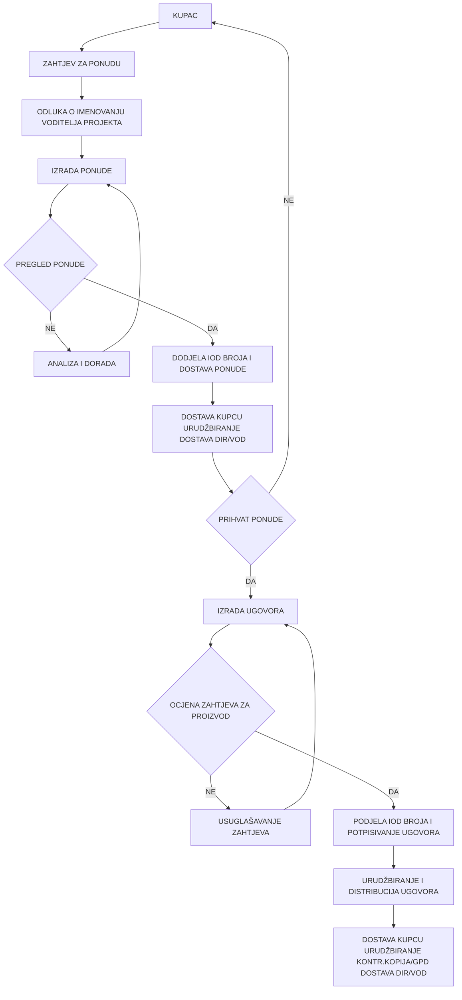

# RUN-20261007-06 — prikupljene mrvice

Izvor: PP-72-01,R5 PROCES MARKETINGA, UGOVARANJA I PRODAJ.md. Revizija: 5.

84 živih dobavljačkih mrvica; 131 točnih poveznica na poglavlja.
Prazni obrasci nisu ispunjeni zapisi. Povijesne kvalifikacije nisu potvrda današnjeg važenja.
Ovo je prikupljena dokumentacijska potpora, ne konačna ocjena kriterija.

[Registrirani izvor](<../../../raw/PP-72-01,R5 PROCES MARKETINGA, UGOVARANJA I PRODAJ.md>)

## 1. CRUMB-DOC-0007-APP_B_VI-0001

Kriterij: APP_B_VI — Document Control

objective_control: Postupak je identificiran oznakom PP-72-01, revizijom 5 i datumom objave.

Izvorno poglavlje: PROCES MARKETINGA, UGOVARANJA I PRODAJE [line 3]

~~~~text
| Naziv dokumenta:        | Programski postupak PP-72-01 |
~~~~

Izvorno poglavlje: PROCES MARKETINGA, UGOVARANJA I PRODAJE [line 3]

~~~~text
| Revizija broj:          | 5                            |
~~~~

Izvorno poglavlje: PROCES MARKETINGA, UGOVARANJA I PRODAJE [line 3]

~~~~text
| Datum objavljivanja:    | 17. 11. 2017.                |
~~~~

## 2. CRUMB-DOC-0007-APP_B_VI-0002

Kriterij: APP_B_VI — Document Control

supporting_control: Navedeni su priprema, dva pregleda i odobrenje postupka s imenima, ulogama i datumima.

Izvorno poglavlje: PROCES MARKETINGA, UGOVARANJA I PRODAJE [line 3]

~~~~text
| Pripremio:              | Vladimir Križe, voditelj QA  | 13. 11. 2017. |
~~~~

Izvorno poglavlje: PROCES MARKETINGA, UGOVARANJA I PRODAJE [line 3]

~~~~text
| Pregledao:              | Dubravka Dončević, voditelj KFP | 14. 11. 2017. |
~~~~

Izvorno poglavlje: PROCES MARKETINGA, UGOVARANJA I PRODAJE [line 3]

~~~~text
| Pregledao:              | mr.sc. Ilijana Ivekovic, predstavnik direktora | 14. 11. 2017. |
~~~~

Izvorno poglavlje: PROCES MARKETINGA, UGOVARANJA I PRODAJE [line 3]

~~~~text
| Odobrio:                | dr.sc. Nenad Debrecin, direktor | 15. 11. 2017. |
~~~~

## 3. CRUMB-DOC-0007-APP_B_VI-0003

Kriterij: APP_B_VI — Document Control

supporting_control: Predviđena je evidencija periodičnog pregleda; prazna tablica ne potvrđuje provedeni pregled.

Izvorno poglavlje: PROCES MARKETINGA, UGOVARANJA I PRODAJE [line 3] > Periodični pregled [line 17]

~~~~text
| Pregledao: | Datum: | Slijedeći pregled: |
~~~~

## 4. CRUMB-DOC-0007-APP_B_II-0001

Kriterij: APP_B_II — Quality Assurance Program

objective_control: Postupak uređuje odgovornosti kroz upit, ponudu, ugovor, promjene i reklamacije.

Izvorno poglavlje: SADRŽAJ [line 29] > 1. SVRHA [line 61]

~~~~text
Postupkom se definiraju komunikacijske veze s kupcima te utvrđuju aktivnosti i odgovornosti u procesu marketinga (praćenje tržišta i zadovoljstva kupca) te procesu ugovaranja i prodaje (upit, ponuda, ugovor, promjene i dopune ugovora, reklamacije i prigovori kupaca).
~~~~

## 5. CRUMB-DOC-0007-APP_B_II-0002

Kriterij: APP_B_II — Quality Assurance Program

objective_control: Primjena obuhvaća sve zahtjeve kojima se pokreće ugovorni odnos.

Izvorno poglavlje: SADRŽAJ [line 29] > 2. PODRUČJE PRIMJENE [line 65]

~~~~text
Postupak se primjenjuje na sve zahtjeve kojima se inicira ugovorni odnos.
~~~~

## 6. CRUMB-DOC-0007-APP_B_II-0003

Kriterij: APP_B_II — Quality Assurance Program

candidate_lead: Reference upućuju na ISO, Priručnik, IAEA i Appendix B; sam popis nije dokaz ispunjenja.

Izvorno poglavlje: SADRŽAJ [line 29] > 3. REFERENCE [line 69]

~~~~text
1. HRN EN ISO 9001:2015
~~~~

Izvorno poglavlje: SADRŽAJ [line 29] > 3. REFERENCE [line 69]

~~~~text
   Sustavi upravljanja kvalitetom-Zahtjevi
   Procesi usmjereni na kupca
~~~~

Izvorno poglavlje: SADRŽAJ [line 29] > 3. REFERENCE [line 69]

~~~~text
2. Enconet - Priručnik kvalitete PK
~~~~

Izvorno poglavlje: SADRŽAJ [line 29] > 3. REFERENCE [line 69]

~~~~text
   Procesi usmjereni na kupca
~~~~

Izvorno poglavlje: SADRŽAJ [line 29] > 3. REFERENCE [line 69]

~~~~text
3. IAEA Leadership and Management for Safety, IAEA Safety Standards Series,
~~~~

Izvorno poglavlje: SADRŽAJ [line 29] > 3. REFERENCE [line 69]

~~~~text
   No. GSR Part 2, IAEA Vienna, 2016.
~~~~

Izvorno poglavlje: SADRŽAJ [line 29] > 3. REFERENCE [line 69]

~~~~text
4. American Code of Federal Regulation, 10CFR50 App. B
~~~~

## 7. CRUMB-DOC-0007-APP_B_I-0001

Kriterij: APP_B_I — Organization

objective_control: Direktor odobrava ponude, ugovore i njihove promjene te odluke o reklamacijama.

Izvorno poglavlje: SADRŽAJ [line 29] > 5. ODGOVORNOSTI [line 109]

~~~~text
Direktor Enconeta prati podloge i analize o tržištu i zadovoljstvu kupaca te utvrđuje i donosi potrebne odluke i mjere. Odobrava ponude, te potpisuje ugovore u ime tvrtke s ugovornim strankama. Odobrava promjene i dopune ugovora, te potpisuje dodatke ugovoru u ime tvrtke. Odobrava rješavanje reklamacija kupca, te potrebne popravne i preventivne radnje. Odgovoran je da se zahtjevi kvalitete i primjena SUK-a odgovarajuće definiraju u ugovoru.
~~~~

## 8. CRUMB-DOC-0007-APP_B_II-0004

Kriterij: APP_B_II — Quality Assurance Program

objective_control: Direktor odgovara za ugovorno definiranje zahtjeva kvalitete i primjene SUK-a.

Izvorno poglavlje: SADRŽAJ [line 29] > 5. ODGOVORNOSTI [line 109]

~~~~text
Direktor Enconeta prati podloge i analize o tržištu i zadovoljstvu kupaca te utvrđuje i donosi potrebne odluke i mjere. Odobrava ponude, te potpisuje ugovore u ime tvrtke s ugovornim strankama. Odobrava promjene i dopune ugovora, te potpisuje dodatke ugovoru u ime tvrtke. Odobrava rješavanje reklamacija kupca, te potrebne popravne i preventivne radnje. Odgovoran je da se zahtjevi kvalitete i primjena SUK-a odgovarajuće definiraju u ugovoru.
~~~~

## 9. CRUMB-DOC-0007-APP_B_XVI-0001

Kriterij: APP_B_XVI — Corrective Action

objective_control: Direktor odobrava rješavanje reklamacija i potrebne popravne i preventivne radnje.

Izvorno poglavlje: SADRŽAJ [line 29] > 5. ODGOVORNOSTI [line 109]

~~~~text
Direktor Enconeta prati podloge i analize o tržištu i zadovoljstvu kupaca te utvrđuje i donosi potrebne odluke i mjere. Odobrava ponude, te potpisuje ugovore u ime tvrtke s ugovornim strankama. Odobrava promjene i dopune ugovora, te potpisuje dodatke ugovoru u ime tvrtke. Odobrava rješavanje reklamacija kupca, te potrebne popravne i preventivne radnje. Odgovoran je da se zahtjevi kvalitete i primjena SUK-a odgovarajuće definiraju u ugovoru.
~~~~

## 10. CRUMB-DOC-0007-APP_B_III-0001

Kriterij: APP_B_III — Design Control

objective_control: Voditelj projekta prenosi sve zahtjeve za proizvod jednoznačno u ugovor ili narudžbu.

Izvorno poglavlje: SADRŽAJ [line 29] > 5. ODGOVORNOSTI [line 109]

~~~~text
Voditelj projekta prikuplja i analizira informacije o tržištu i zadovoljstvu kupaca iz svoga područja rada. Odgovoran je da se svi zahtjevi za proizvod jednoznačno prenesu u odgovarajući dokument (ugovor/narudžbu). Odgovoran je za pregled ugovora i ocjenu zahtjeva za proizvod iz svog područja rada te održavanje zapisa o toj ocjeni. Odgovoran je za provedbu aktivnosti koje su posljedica odobrenih promjena odnosno dopuna ugovora te održavanje zapisa o tome. Odgovoran je za rješavanje reklamacija kupca, te provođenje popravnih i preventivnih radnji koje su posljedica tih aktivnosti.
~~~~

## 11. CRUMB-DOC-0007-APP_B_III-0002

Kriterij: APP_B_III — Design Control

objective_control: Voditelj projekta pregledava ugovor, ocjenjuje zahtjeve i provodi odobrene promjene.

Izvorno poglavlje: SADRŽAJ [line 29] > 5. ODGOVORNOSTI [line 109]

~~~~text
Voditelj projekta prikuplja i analizira informacije o tržištu i zadovoljstvu kupaca iz svoga područja rada. Odgovoran je da se svi zahtjevi za proizvod jednoznačno prenesu u odgovarajući dokument (ugovor/narudžbu). Odgovoran je za pregled ugovora i ocjenu zahtjeva za proizvod iz svog područja rada te održavanje zapisa o toj ocjeni. Odgovoran je za provedbu aktivnosti koje su posljedica odobrenih promjena odnosno dopuna ugovora te održavanje zapisa o tome. Odgovoran je za rješavanje reklamacija kupca, te provođenje popravnih i preventivnih radnji koje su posljedica tih aktivnosti.
~~~~

## 12. CRUMB-DOC-0007-APP_B_XVII-0001

Kriterij: APP_B_XVII — Quality Assurance Records

objective_control: Voditelj projekta održava zapise o ocjeni zahtjeva i provedbi ugovornih promjena.

Izvorno poglavlje: SADRŽAJ [line 29] > 5. ODGOVORNOSTI [line 109]

~~~~text
Voditelj projekta prikuplja i analizira informacije o tržištu i zadovoljstvu kupaca iz svoga područja rada. Odgovoran je da se svi zahtjevi za proizvod jednoznačno prenesu u odgovarajući dokument (ugovor/narudžbu). Odgovoran je za pregled ugovora i ocjenu zahtjeva za proizvod iz svog područja rada te održavanje zapisa o toj ocjeni. Odgovoran je za provedbu aktivnosti koje su posljedica odobrenih promjena odnosno dopuna ugovora te održavanje zapisa o tome. Odgovoran je za rješavanje reklamacija kupca, te provođenje popravnih i preventivnih radnji koje su posljedica tih aktivnosti.
~~~~

## 13. CRUMB-DOC-0007-APP_B_XVI-0002

Kriterij: APP_B_XVI — Corrective Action

objective_control: Voditelj projekta odgovara za reklamacije i povezane popravne i preventivne radnje.

Izvorno poglavlje: SADRŽAJ [line 29] > 5. ODGOVORNOSTI [line 109]

~~~~text
Voditelj projekta prikuplja i analizira informacije o tržištu i zadovoljstvu kupaca iz svoga područja rada. Odgovoran je da se svi zahtjevi za proizvod jednoznačno prenesu u odgovarajući dokument (ugovor/narudžbu). Odgovoran je za pregled ugovora i ocjenu zahtjeva za proizvod iz svog područja rada te održavanje zapisa o toj ocjeni. Odgovoran je za provedbu aktivnosti koje su posljedica odobrenih promjena odnosno dopuna ugovora te održavanje zapisa o tome. Odgovoran je za rješavanje reklamacija kupca, te provođenje popravnih i preventivnih radnji koje su posljedica tih aktivnosti.
~~~~

## 14. CRUMB-DOC-0007-APP_B_I-0002

Kriterij: APP_B_I — Organization

supporting_control: Komercijalno-financijski voditelj ima definiranu ulogu u pregledu ponude i ugovora.

Izvorno poglavlje: SADRŽAJ [line 29] > 5. ODGOVORNOSTI [line 109]

~~~~text
Voditelj komercijalno financijskih poslova prikuplja i sistematizira sve podloge i analize o tržištu i zadovoljstvu kupaca. Odgovoran je za pregled ponude i ugovora te ocjenu zahtjeva za proizvod s komercijalno financijskog aspekta. Odgovoran je da se u ugovor ugrade svi potrebni elementi za reguliranje komercijalno financijskih pitanja. Zadužen je da vodi Knjigu reklamacija kao evidenciju reklamacija kupaca.
~~~~

## 15. CRUMB-DOC-0007-APP_B_XVII-0002

Kriterij: APP_B_XVII — Quality Assurance Records

objective_control: Komercijalno-financijski voditelj vodi Knjigu reklamacija.

Izvorno poglavlje: SADRŽAJ [line 29] > 5. ODGOVORNOSTI [line 109]

~~~~text
Voditelj komercijalno financijskih poslova prikuplja i sistematizira sve podloge i analize o tržištu i zadovoljstvu kupaca. Odgovoran je za pregled ponude i ugovora te ocjenu zahtjeva za proizvod s komercijalno financijskog aspekta. Odgovoran je da se u ugovor ugrade svi potrebni elementi za reguliranje komercijalno financijskih pitanja. Zadužen je da vodi Knjigu reklamacija kao evidenciju reklamacija kupaca.
~~~~

## 16. CRUMB-DOC-0007-APP_B_III-0003

Kriterij: APP_B_III — Design Control

supporting_control: Pravna služba provjerava sukladnost ponude i ugovora sa zakonima i propisima.

Izvorno poglavlje: SADRŽAJ [line 29] > 5. ODGOVORNOSTI [line 109]

~~~~text
Ovlaštena osoba za pravne poslove odgovorna je da su ponuda i ugovor napisani u skladu s važećim zakonima i propisima te da su zaštićeni interesi Enconeta.
~~~~

## 17. CRUMB-DOC-0007-APP_B_II-0005

Kriterij: APP_B_II — Quality Assurance Program

objective_control: QA sudjeluje u utvrđivanju ugovornih zahtjeva kvalitete.

Izvorno poglavlje: SADRŽAJ [line 29] > 5. ODGOVORNOSTI [line 109]

~~~~text
Voditelj QA poslova surađuje kod definiranja zahtjeva kvalitete kao ugovorne obveze. Odgovoran je za koordiniranje i nadzor rješavanja reklamacija kupaca, te potvrđivanje provedenih popravnih i preventivnih radnji.
~~~~

## 18. CRUMB-DOC-0007-APP_B_XVI-0003

Kriterij: APP_B_XVI — Corrective Action

objective_control: QA koordinira i nadzire reklamacije te potvrđuje provedene popravne i preventivne radnje.

Izvorno poglavlje: SADRŽAJ [line 29] > 5. ODGOVORNOSTI [line 109]

~~~~text
Voditelj QA poslova surađuje kod definiranja zahtjeva kvalitete kao ugovorne obveze. Odgovoran je za koordiniranje i nadzor rješavanja reklamacija kupaca, te potvrđivanje provedenih popravnih i preventivnih radnji.
~~~~

## 19. CRUMB-DOC-0007-APP_B_VI-0004

Kriterij: APP_B_VI — Document Control

objective_control: Administrator urudžbira, upisuje i dostavlja dokumente prema važećim postupcima.

Izvorno poglavlje: SADRŽAJ [line 29] > 5. ODGOVORNOSTI [line 109]

~~~~text
Administrator je odgovoran za urudžbiranje, upis i dostavu dokumenata sukladno važećim postupcima.
~~~~

## 20. CRUMB-DOC-0007-APP_B_II-0006

Kriterij: APP_B_II — Quality Assurance Program

supporting_control: Proces obuhvaća komunikaciju, definiranje zahtjeva, ugovaranje, promjene i reklamacije.

Izvorno poglavlje: SADRŽAJ [line 29] > 6. POSTUPAK [line 123]

~~~~text
Proces marketinga, ugovaranja i prodaje je proces usmjeren na kupca. Obuhvaća sve aktivnosti koje se odnose na:
~~~~

Izvorno poglavlje: SADRŽAJ [line 29] > 6. POSTUPAK [line 123]

~~~~text
a) praćenje tržišta i zadovoljstva kupaca
b) komunikaciju s kupcem
c) utvrđivanje zahtjeva za proizvod i izrada ponude
d) ocjenu zahtjeva za proizvod i sklapanje ugovora
e) promjene i dopune ugovora
f) reklamacije kupaca
~~~~

## 21. CRUMB-DOC-0007-APP_B_II-0007

Kriterij: APP_B_II — Quality Assurance Program

supporting_control: Predviđeno je prikupljanje povratnih informacija anketom OB-OZK-037.

Izvorno poglavlje: SADRŽAJ [line 29] > 6.2      Praćenje tržišta i zadovoljstva kupaca [line 141]

~~~~text
Zadovoljstvo kupaca može se ispitati samo uz njihovo angažiranje i sudjelovanje. Zato i metode prikupljanja i korištenja informacija mogu biti:
~~~~

Izvorno poglavlje: SADRŽAJ [line 29] > 6.2      Praćenje tržišta i zadovoljstva kupaca [line 141]

~~~~text
Izravne metode jesu zamolbe ili ankete kupaca putem kojih oni sami kažu s čime su i koliko zadovoljni odnosno nezadovoljni. Enconet je razvio i koristi anketiranje kupaca putem obrasca OB-OZK-037 (Prilog u Radnoj uputi RU-82-01).
~~~~

## 22. CRUMB-DOC-0007-APP_B_XVI-0004

Kriterij: APP_B_XVI — Corrective Action

supporting_control: Neizravno praćenje uključuje analizu broja, učestalosti, uzroka i troškova reklamacija.

Izvorno poglavlje: SADRŽAJ [line 29] > 6.2      Praćenje tržišta i zadovoljstva kupaca [line 141]

~~~~text
Neizravne metode ispitivanja zadovoljstva kupaca odnose se na opažanje i procjene ponašanja kupaca kroz rezultate prodaje i kontakte koji se s kupcima ostvaruju na njihovu inicijativu, dakle upite, reklamacije i određene zahtjeve. Enconet, između ostalih, koristi slijedeće neizravne metode:
~~~~

Izvorno poglavlje: SADRŽAJ [line 29] > 6.2      Praćenje tržišta i zadovoljstva kupaca [line 141]

~~~~text
- analiza broja, učestalosti, uzroka i troškova reklamacija kupaca
~~~~

## 23. CRUMB-DOC-0007-APP_B_II-0008

Kriterij: APP_B_II — Quality Assurance Program

supporting_control: Informacije o zadovoljstvu kupaca koriste se za poboljšanje procesa i proizvoda.

Izvorno poglavlje: SADRŽAJ [line 29] > 6.2      Praćenje tržišta i zadovoljstva kupaca [line 141]

~~~~text
Enconet analizira i koristi informacije o zadovoljstvu kupaca kako bi poduzeo mjere za poboljšanje realizacije svojih procesa i kvalitete svojih proizvoda i usluga i time još više povećao zadovoljstvo kupaca.
~~~~

## 24. CRUMB-DOC-0007-APP_B_I-0003

Kriterij: APP_B_I — Organization

supporting_control: Određen je tok informacija od voditelja projekata preko KFP-a do odluka direktora.

Izvorno poglavlje: SADRŽAJ [line 29] > 6.2      Praćenje tržišta i zadovoljstva kupaca [line 141]

~~~~text
Voditelji projekata prikupljaju i analiziraju informacije o kupcima iz svog područja rada i podloge o tome dostavljaju voditelju KFP.
~~~~

Izvorno poglavlje: SADRŽAJ [line 29] > 6.2      Praćenje tržišta i zadovoljstva kupaca [line 141]

~~~~text
Voditelj KFP sistematizira sve podloge i analize o zadovoljstvu kupaca i dostavlja direktoru na pregled i korištenje.
~~~~

Izvorno poglavlje: SADRŽAJ [line 29] > 6.2      Praćenje tržišta i zadovoljstva kupaca [line 141]

~~~~text
Na osnovu podloga i analiza o zadovoljstvu kupaca Direktor, prema potrebi, donosi odgovarajuće odluke.
~~~~

## 25. CRUMB-DOC-0007-APP_B_II-0009

Kriterij: APP_B_II — Quality Assurance Program

supporting_control: Analize zadovoljstva ulaz su u direktorov pregled SUK-a i odluke o poboljšanju.

Izvorno poglavlje: SADRŽAJ [line 29] > 6.2      Praćenje tržišta i zadovoljstva kupaca [line 141]

~~~~text
Rezultati navedenih analiza o zadovoljstvu kupaca služe kao podloge za Direktorov pregled i izradu izvješća o stanju SUK-a. Oni su također i ulazni podaci Direktoru za donošenje odgovarajućih odluka o budućoj politici i mjerama nastupa prema kupcima i tržištu.
~~~~

## 26. CRUMB-DOC-0007-APP_B_II-0010

Kriterij: APP_B_II — Quality Assurance Program

candidate_lead: Detalji praćenja zadovoljstva upućuju na RU-82-01 za daljnju provjeru.

Izvorno poglavlje: SADRŽAJ [line 29] > 6.2      Praćenje tržišta i zadovoljstva kupaca [line 141]

~~~~text
Detaljniji opis metoda, postupaka i odgovornosti u procesu praćenja tržišta i zadovoljstva kupaca dan je u Radnoj uputi RU-82-01 «Praćenje i mjerenje zadovoljstva kupaca».
~~~~

## 27. CRUMB-DOC-0007-APP_B_III-0004

Kriterij: APP_B_III — Design Control

supporting_control: Komunikacija s kupcem obuhvaća usuglašavanje ponude, ugovora i dodataka.

Izvorno poglavlje: SADRŽAJ [line 29] > 6.2      Praćenje tržišta i zadovoljstva kupaca [line 141]

~~~~text
Ovisno o obimu i karakteru proizvoda, Enconet provodi različite postupke i metode komuniciranja s kupcem kao što su međusobne prezentacije, pisani dokumenti, službeni dopisi, e-mail i druga pošta, te neformalni usmeni i telefonski razgovori i slično.
~~~~

Izvorno poglavlje: SADRŽAJ [line 29] > 6.2      Praćenje tržišta i zadovoljstva kupaca [line 141]

~~~~text
Komunikacija s kupcem je stalna od upita preko izrade ponude i ugovora, realizacije i isporuke proizvoda te povratnih informacija kupca za vrijeme uporabe proizvoda do možebitnih reklamacija, prigovora ili prijedloga kupca. U svakoj navedenoj fazi koriste se najprimjereniji načini i metode komunikacije ovisno o tome da li se:
~~~~

Izvorno poglavlje: SADRŽAJ [line 29] > 6.2      Praćenje tržišta i zadovoljstva kupaca [line 141]

~~~~text
- provodi postupak usuglašavanja kod izrade ponude, ugovora ili narudžbe, uključujući i dodatke ugovora
~~~~

## 28. CRUMB-DOC-0007-APP_B_XVI-0005

Kriterij: APP_B_XVI — Corrective Action

supporting_control: Komunikacija obuhvaća povratne informacije, reklamacije i prijedloge poboljšanja.

Izvorno poglavlje: SADRŽAJ [line 29] > 6.2      Praćenje tržišta i zadovoljstva kupaca [line 141]

~~~~text
Komunikacija s kupcem je stalna od upita preko izrade ponude i ugovora, realizacije i isporuke proizvoda te povratnih informacija kupca za vrijeme uporabe proizvoda do možebitnih reklamacija, prigovora ili prijedloga kupca. U svakoj navedenoj fazi koriste se najprimjereniji načini i metode komunikacije ovisno o tome da li se:
~~~~

Izvorno poglavlje: SADRŽAJ [line 29] > 6.2      Praćenje tržišta i zadovoljstva kupaca [line 141]

~~~~text
- prikupljaju povratne informacije od kupca, uključujući njegove reklamacije i prigovore odnosno prijedloge za poboljšanje
~~~~

## 29. CRUMB-DOC-0007-APP_B_I-0004

Kriterij: APP_B_I — Organization

objective_control: Ugovor definira ovlaštene osobe za komunikaciju s kupcem.

Izvorno poglavlje: SADRŽAJ [line 29] > 6.2      Praćenje tržišta i zadovoljstva kupaca [line 141]

~~~~text
Ugovorom se definiraju ovlaštene osobe za komuniciranje s kupcem. No, ovisno o karakteru i sadržaju teme odnosno pitanja, nositelji komuniciranja od strane Enconeta mogu biti: direktor, predstavnik Direktora, voditelj odgovarajućeg projekta/posla, voditelj KFP, ovlaštena osoba za pravne poslove, voditelj QA i drugi.
~~~~

## 30. CRUMB-DOC-0007-APP_B_I-0005

Kriterij: APP_B_I — Organization

objective_control: Direktor pregledava početne zahtjeve i imenuje voditelja projekta.

Izvorno poglavlje: SADRŽAJ [line 29] > 6.2      Praćenje tržišta i zadovoljstva kupaca [line 141]

~~~~text
Direktor Enconeta pregledava sve zaprimljene dokumente i informacije od kupca u vezi s traženim proizvodom (zahtjev za ponudu, upit, tender, projektni zadatak, e-mail i druge bilješke nastale u komunikaciji s potencijalnim kupcem). Nakon pregleda donosi odluku o imenovanju voditelja projekta. Svu raspoloživu dokumentaciju i potrebne informacije upućuje voditelju posla, odnosno voditelju projekta, radi konačnog utvrđivanja zahtjeva za proizvod i izrade ponude.
~~~~

## 31. CRUMB-DOC-0007-APP_B_III-0005

Kriterij: APP_B_III — Design Control

objective_control: Dokumentacija i informacije kupca predaju se voditelju za utvrđivanje zahtjeva i ponudu.

Izvorno poglavlje: SADRŽAJ [line 29] > 6.2      Praćenje tržišta i zadovoljstva kupaca [line 141]

~~~~text
Direktor Enconeta pregledava sve zaprimljene dokumente i informacije od kupca u vezi s traženim proizvodom (zahtjev za ponudu, upit, tender, projektni zadatak, e-mail i druge bilješke nastale u komunikaciji s potencijalnim kupcem). Nakon pregleda donosi odluku o imenovanju voditelja projekta. Svu raspoloživu dokumentaciju i potrebne informacije upućuje voditelju posla, odnosno voditelju projekta, radi konačnog utvrđivanja zahtjeva za proizvod i izrade ponude.
~~~~

## 32. CRUMB-DOC-0007-APP_B_III-0006

Kriterij: APP_B_III — Design Control

objective_control: Usmene zahtjeve voditelj mora evidentirati i dobiti potvrdu kupca prije prihvaćanja.

Izvorno poglavlje: SADRŽAJ [line 29] > 6.2      Praćenje tržišta i zadovoljstva kupaca [line 141]

~~~~text
Ako kupac nije dostavio zahtjeve za proizvod u dokumentiranom obliku (usmeni upit), voditelj projekta mora te zahtjeve evidentirati te tražiti i dobiti potvrdu od kupca prije prihvaćanja.
~~~~

## 33. CRUMB-DOC-0007-APP_B_III-0007

Kriterij: APP_B_III — Design Control

objective_control: Voditelj izrađuje tehničku ponudu i s kupcem razjašnjava nedostatne zahtjeve.

Izvorno poglavlje: SADRŽAJ [line 29] > 6.2      Praćenje tržišta i zadovoljstva kupaca [line 141]

~~~~text
Voditelj projekta, na osnovu primljene dokumentacije i informacija, priprema tehnički dio ponude. Pritom komunicira s kupcem radi upotpunjavanja i razjašnjenja pojedinih zahtjeva za proizvod. Prijedlog ponude dostavlja drugim odgovornim osobama radi daljnje obrade.
~~~~

## 34. CRUMB-DOC-0007-APP_B_III-0008

Kriterij: APP_B_III — Design Control

supporting_control: Pravni pregled ponude uključuje poštivanje zakona i propisa.

Izvorno poglavlje: SADRŽAJ [line 29] > 6.2      Praćenje tržišta i zadovoljstva kupaca [line 141]

~~~~text
Ovlaštena osoba za pravne poslove (osoba iz tvrtke ili posebno angažirana stručna osoba izvana) utvrđuje pravne aspekte ponude, (poštivanje zakona i propisa te zaštita interesa tvrtke).
~~~~

## 35. CRUMB-DOC-0007-APP_B_II-0011

Kriterij: APP_B_II — Quality Assurance Program

objective_control: QA pregledava i parafira ponudu sa stanovišta zahtjeva kvalitete.

Izvorno poglavlje: SADRŽAJ [line 29] > 6.2      Praćenje tržišta i zadovoljstva kupaca [line 141]

~~~~text
Voditelj QA pregledava i parafira prijedlog ponude sa stanovišta poštivanja zahtjeva koji se odnose na kvalitetu proizvoda.
~~~~

## 36. CRUMB-DOC-0007-APP_B_VI-0005

Kriterij: APP_B_VI — Document Control

objective_control: Nakon pregleda voditelj dopunjava ponudu i dodjeljuje joj IOD.

Izvorno poglavlje: SADRŽAJ [line 29] > 6.2      Praćenje tržišta i zadovoljstva kupaca [line 141]

~~~~text
Nakon svih pregleda, voditelj projekta dopunjava prijedlog te izrađuje konačni prijedlog ponude i dodjeljuje IOD broj.
~~~~

## 37. CRUMB-DOC-0007-APP_B_III-0009

Kriterij: APP_B_III — Design Control

objective_control: Ponuda propisuje opis i opseg posla te standarde, specifikacije i ostale uvjete.

Izvorno poglavlje: SADRŽAJ [line 29] > 6.2      Praćenje tržišta i zadovoljstva kupaca [line 141]

~~~~text
Ponuda mora minimalno sadržavati slijedeće podatke:
-ime i adresa kupca
-broj ponude (veza s brojem zahtjeva za ponudu)
-datum ponude
-vrijednost ponude
-opis i opseg poslova
-rok izvedbe poslova
-rokovi i način plaćanja
-ostali uvjeti (standardi, specifikacije, opći uvjeti i sl.)
-opcija ponude (rok nakon kojega ponuda više nije važeća)
~~~~

## 38. CRUMB-DOC-0007-APP_B_VI-0006

Kriterij: APP_B_VI — Document Control

objective_control: Ponuda uključuje identitet kupca, broj povezan s upitom, datum i rok važenja.

Izvorno poglavlje: SADRŽAJ [line 29] > 6.2      Praćenje tržišta i zadovoljstva kupaca [line 141]

~~~~text
Ponuda mora minimalno sadržavati slijedeće podatke:
-ime i adresa kupca
-broj ponude (veza s brojem zahtjeva za ponudu)
-datum ponude
-vrijednost ponude
-opis i opseg poslova
-rok izvedbe poslova
-rokovi i način plaćanja
-ostali uvjeti (standardi, specifikacije, opći uvjeti i sl.)
-opcija ponude (rok nakon kojega ponuda više nije važeća)
~~~~

## 39. CRUMB-DOC-0007-APP_B_III-0010

Kriterij: APP_B_III — Design Control

objective_control: Nemogućnost potpune izvedbe tehničkog ili QA zahtjeva mora biti izričito navedena u ponudi.

Izvorno poglavlje: SADRŽAJ [line 29] > 6.2      Praćenje tržišta i zadovoljstva kupaca [line 141]

~~~~text
U slučaju da kupac želi ponudu na svojim standardnim obrascima, Enconet će ponudu učiniti na obrascima kupca.
U ponudi mora biti eksplicitno navedeno ukoliko bilo koji tehnički ili QA zahtjev naveden u zahtjevu za ponudu od strane naručitelja / kupca, Enconet nije u mogućnosti izvesti u potpunosti.
~~~~

## 40. CRUMB-DOC-0007-APP_B_III-0011

Kriterij: APP_B_III — Design Control

objective_control: Direktor potpisom potvrđuje zahtjeve kupca, uključujući radnje nakon isporuke.

Izvorno poglavlje: SADRŽAJ [line 29] > 6.2      Praćenje tržišta i zadovoljstva kupaca [line 141]

~~~~text
Direktor Enconeta pregledava i odobrava konačni dokument ponude te svojim potpisom potvrđuje:
~~~~

Izvorno poglavlje: SADRŽAJ [line 29] > 6.2      Praćenje tržišta i zadovoljstva kupaca [line 141]

~~~~text
- sukladnost sa zahtjevima koje postavlja kupac uključujući i radnje poslije isporuke
~~~~

## 41. CRUMB-DOC-0007-APP_B_III-0012

Kriterij: APP_B_III — Design Control

objective_control: Odobrenje ponude obuhvaća zahtjeve nužne za namjenu i kada ih kupac nije naveo.

Izvorno poglavlje: SADRŽAJ [line 29] > 6.2      Praćenje tržišta i zadovoljstva kupaca [line 141]

~~~~text
Direktor Enconeta pregledava i odobrava konačni dokument ponude te svojim potpisom potvrđuje:
~~~~

Izvorno poglavlje: SADRŽAJ [line 29] > 6.2      Praćenje tržišta i zadovoljstva kupaca [line 141]

~~~~text
- sukladnost sa zahtjevima koje kupac nije naveo ali su nužni za utvrđenu namjenu
~~~~

## 42. CRUMB-DOC-0007-APP_B_III-0013

Kriterij: APP_B_III — Design Control

objective_control: Direktor potvrđuje sukladnost ponude sa zakonima i propisima za proizvod.

Izvorno poglavlje: SADRŽAJ [line 29] > 6.2      Praćenje tržišta i zadovoljstva kupaca [line 141]

~~~~text
Direktor Enconeta pregledava i odobrava konačni dokument ponude te svojim potpisom potvrđuje:
~~~~

Izvorno poglavlje: SADRŽAJ [line 29] > 6.2      Praćenje tržišta i zadovoljstva kupaca [line 141]

~~~~text
- usklađenost sa zahtjevima zakona i propisa koji se odnose na proizvod
~~~~

## 43. CRUMB-DOC-0007-APP_B_VI-0007

Kriterij: APP_B_VI — Document Control

objective_control: Dostavlja se odobrena potpisana ponuda; primjerak se urudžbira u GPD i predaje nositelju.

Izvorno poglavlje: SADRŽAJ [line 29] > 6.2      Praćenje tržišta i zadovoljstva kupaca [line 141]

~~~~text
Administrator dostavlja potencijalnom kupcu jedan primjerak odobrene i potpisane ponude a drugi urudžbira kao kontrolirani dokument-zapis i uvodi ga u glavni popis dokumenata (GPD), te dostavlja voditelju posla odnosno voditelju projekta koji je nositelj ponude.
~~~~

## 44. CRUMB-DOC-0007-APP_B_XVII-0003

Kriterij: APP_B_XVII — Quality Assurance Records

objective_control: Primjerak ponude čuva se kao kontrolirani dokument-zapis.

Izvorno poglavlje: SADRŽAJ [line 29] > 6.2      Praćenje tržišta i zadovoljstva kupaca [line 141]

~~~~text
Administrator dostavlja potencijalnom kupcu jedan primjerak odobrene i potpisane ponude a drugi urudžbira kao kontrolirani dokument-zapis i uvodi ga u glavni popis dokumenata (GPD), te dostavlja voditelju posla odnosno voditelju projekta koji je nositelj ponude.
~~~~

## 45. CRUMB-DOC-0007-APP_B_III-0014

Kriterij: APP_B_III — Design Control

objective_control: Novi zahtjevi i promjene ponude obrađuju se aneksom po postupku početne ponude.

Izvorno poglavlje: SADRŽAJ [line 29] > 6.2      Praćenje tržišta i zadovoljstva kupaca [line 141]

~~~~text
U slučaju da dođe do dodatnih zahtjeva za proizvod od strane kupca ili zahtjeva za promjenu ponude od strane Enconeta (promjena regulative, predviđeni tehnički problemi prilikom pripreme i izvedbe, i sl.), izdaje se aneks ponudi, koji se proceduralno obrađuje isto kao i inicijalna ponuda.
~~~~

## 46. CRUMB-DOC-0007-APP_B_III-0015

Kriterij: APP_B_III — Design Control

objective_control: Prije ugovorne obveze provjerava se jesu li svi zahtjevi jasno preneseni u ugovor.

Izvorno poglavlje: SADRŽAJ [line 29] > 6.5 Ocjena zahtjeva za proizvod i sklapanje ugovora/narudžbe [line 235]

~~~~text
Na temelju prihvaćene ponude, kupac izrađuje ugovor odnosno narudžbu. Ponuda je sastavni dio ugovora. Prije prihvaćanja ugovora/narudžbe, odnosno obveze na isporuku proizvoda, Enconet mora pregledati i ocijeniti zahtjeve koji se odnose na proizvod kako bi se potvrdilo i osiguralo:
~~~~

Izvorno poglavlje: SADRŽAJ [line 29] > 6.5 Ocjena zahtjeva za proizvod i sklapanje ugovora/narudžbe [line 235]

~~~~text
- da su svi zahtjevi za proizvod jasno definirani i prenijeti u ugovor
~~~~

## 47. CRUMB-DOC-0007-APP_B_III-0016

Kriterij: APP_B_III — Design Control

objective_control: Prije prihvaćanja ugovora moraju se razriješiti razlike prema ponudi.

Izvorno poglavlje: SADRŽAJ [line 29] > 6.5 Ocjena zahtjeva za proizvod i sklapanje ugovora/narudžbe [line 235]

~~~~text
Na temelju prihvaćene ponude, kupac izrađuje ugovor odnosno narudžbu. Ponuda je sastavni dio ugovora. Prije prihvaćanja ugovora/narudžbe, odnosno obveze na isporuku proizvoda, Enconet mora pregledati i ocijeniti zahtjeve koji se odnose na proizvod kako bi se potvrdilo i osiguralo:
~~~~

Izvorno poglavlje: SADRŽAJ [line 29] > 6.5 Ocjena zahtjeva za proizvod i sklapanje ugovora/narudžbe [line 235]

~~~~text
- da su, u procesu ugovaranja, razriješene sve razlike između zahtjeva u ponudi i zahtjeva u ugovoru
~~~~

## 48. CRUMB-DOC-0007-APP_B_II-0012

Kriterij: APP_B_II — Quality Assurance Program

objective_control: Prije obveze isporuke mora se potvrditi sposobnost Enconeta da ispuni zahtjeve.

Izvorno poglavlje: SADRŽAJ [line 29] > 6.5 Ocjena zahtjeva za proizvod i sklapanje ugovora/narudžbe [line 235]

~~~~text
Na temelju prihvaćene ponude, kupac izrađuje ugovor odnosno narudžbu. Ponuda je sastavni dio ugovora. Prije prihvaćanja ugovora/narudžbe, odnosno obveze na isporuku proizvoda, Enconet mora pregledati i ocijeniti zahtjeve koji se odnose na proizvod kako bi se potvrdilo i osiguralo:
~~~~

Izvorno poglavlje: SADRŽAJ [line 29] > 6.5 Ocjena zahtjeva za proizvod i sklapanje ugovora/narudžbe [line 235]

~~~~text
- da je Enconet sposoban zadovoljiti te zahtjeve
~~~~

## 49. CRUMB-DOC-0007-APP_B_III-0017

Kriterij: APP_B_III — Design Control

objective_control: Voditelj pregledava cijelu ugovornu dokumentaciju i bilježi tehničku ocjenu u OB-OZP-034.

Izvorno poglavlje: SADRŽAJ [line 29] > 6.5 Ocjena zahtjeva za proizvod i sklapanje ugovora/narudžbe [line 235]

~~~~text
Voditelj projekta koji je izradio ponudu, organizira i provodi pregled i ocjenu zahtjeva za proizvod. Pritom pregledava cjelokupnu dokumentaciju koja je nastala u procesu ugovaranja i prodaje te u rubrici I u obrascu OB-OZP-034 ocjenjuje tehničke zahtjeve za proizvod.
~~~~

## 50. CRUMB-DOC-0007-APP_B_II-0013

Kriterij: APP_B_II — Quality Assurance Program

supporting_control: Pregled uvjeta isporuke, cijene i plaćanja bilježi KFP u rubrici II.

Izvorno poglavlje: SADRŽAJ [line 29] > 6.5 Ocjena zahtjeva za proizvod i sklapanje ugovora/narudžbe [line 235]

~~~~text
Voditelj KFP pregledava ugovorne zahtjeve za proizvod sa stanovišta roka i načina isporuke, cijene, načina i uvjeta plaćanja itd. te svoju ocjenu upisuje u rubriku II u obrascu OB-OZP-034.
~~~~

## 51. CRUMB-DOC-0007-APP_B_III-0018

Kriterij: APP_B_III — Design Control

objective_control: Pravna ocjena zakonskih i regulatornih zahtjeva bilježi se u rubrici III.

Izvorno poglavlje: SADRŽAJ [line 29] > 6.5 Ocjena zahtjeva za proizvod i sklapanje ugovora/narudžbe [line 235]

~~~~text
Ovlaštena osoba za pravna pitanja pregledava ugovorne zahtjeve za proizvod sa stanovišta primjene određenih zakonskih normi/propisa i zaštite interesa tvrtke te svoju ocjenu upisuje u rubriku III u obrascu OB-OZP-034.
~~~~

## 52. CRUMB-DOC-0007-APP_B_II-0014

Kriterij: APP_B_II — Quality Assurance Program

objective_control: QA ocjenjuje ugovorne zahtjeve kvalitete u rubrici IV obrasca.

Izvorno poglavlje: SADRŽAJ [line 29] > 6.5 Ocjena zahtjeva za proizvod i sklapanje ugovora/narudžbe [line 235]

~~~~text
Voditelj QA poslova pregledava ugovor sa stanovišta zahtjeva kvalitete te svoju ocjenu upisuje u rubriku IV u obrascu OB-OZP-034.
~~~~

## 53. CRUMB-DOC-0007-APP_B_VI-0008

Kriterij: APP_B_VI — Document Control

objective_control: Promjena zahtjeva traži izmjenu dokumentacije i obavještavanje odgovarajućeg osoblja.

Izvorno poglavlje: SADRŽAJ [line 29] > 6.5 Ocjena zahtjeva za proizvod i sklapanje ugovora/narudžbe [line 235]

~~~~text
Ako se zahtjevi za proizvod promijene, voditelj projekta osigurava da se odgovarajuća dokumentacija izmjeni i da odgovarajuće osoblje bude upoznato s promijenjenim zahtjevima.
~~~~

## 54. CRUMB-DOC-0007-APP_B_III-0019

Kriterij: APP_B_III — Design Control

objective_control: Ocjena se potpisuje i uz ponudu i uz ugovor radi ponovne provjere mogućih promjena.

Izvorno poglavlje: SADRŽAJ [line 29] > 6.5 Ocjena zahtjeva za proizvod i sklapanje ugovora/narudžbe [line 235]

~~~~text
Zbog mogućih promjena zahtjeva kupca u vremenskom periodu između slanja ponude i sklapanja ugovora, obrazac OB-OZP-034 će se potpisivati u oba slučaja, prilikom slanja ponude i prilikom sklapanja ugovora. Iako se ponuda smatra sastavnim dijelom ugovora, na taj se način još jednom želi obratiti pažnja na moguće nastale promjene. U obrascu OB-OZP-034 će se projekt / posao također definirati oznakama zahtjeva za ponudu, ponude, GIP-a i ugovora, da bi se olakšala i ubrzala identifikacija ključnih dokumenata prilikom pregleda i ocjene.
~~~~

## 55. CRUMB-DOC-0007-APP_B_VI-0009

Kriterij: APP_B_VI — Document Control

objective_control: Obrazac povezuje upit, ponudu, oznaku projekta GIP i ugovor za identifikaciju dokumenata.

Izvorno poglavlje: SADRŽAJ [line 29] > 6.5 Ocjena zahtjeva za proizvod i sklapanje ugovora/narudžbe [line 235]

~~~~text
Zbog mogućih promjena zahtjeva kupca u vremenskom periodu između slanja ponude i sklapanja ugovora, obrazac OB-OZP-034 će se potpisivati u oba slučaja, prilikom slanja ponude i prilikom sklapanja ugovora. Iako se ponuda smatra sastavnim dijelom ugovora, na taj se način još jednom želi obratiti pažnja na moguće nastale promjene. U obrascu OB-OZP-034 će se projekt / posao također definirati oznakama zahtjeva za ponudu, ponude, GIP-a i ugovora, da bi se olakšala i ubrzala identifikacija ključnih dokumenata prilikom pregleda i ocjene.
~~~~

## 56. CRUMB-DOC-0007-APP_B_III-0020

Kriterij: APP_B_III — Design Control

objective_control: Voditelj po pregledima dorađuje ugovor, prema potrebi u dogovoru s kupcem.

Izvorno poglavlje: SADRŽAJ [line 29] > 6.5 Ocjena zahtjeva za proizvod i sklapanje ugovora/narudžbe [line 235]

~~~~text
Nakon svih navedenih pregleda i ocjena voditelj projekta, prema potrebi i u konzultaciji s kupcem, poduzima dodatne radnje za dopunu odnosno doradu ugovora i dodjeljuje IOD broj dokumenta.
~~~~

## 57. CRUMB-DOC-0007-APP_B_VI-0010

Kriterij: APP_B_VI — Document Control

objective_control: Voditelj dodjeljuje konačnom ugovornom dokumentu IOD.

Izvorno poglavlje: SADRŽAJ [line 29] > 6.5 Ocjena zahtjeva za proizvod i sklapanje ugovora/narudžbe [line 235]

~~~~text
Nakon svih navedenih pregleda i ocjena voditelj projekta, prema potrebi i u konzultaciji s kupcem, poduzima dodatne radnje za dopunu odnosno doradu ugovora i dodjeljuje IOD broj dokumenta.
~~~~

## 58. CRUMB-DOC-0007-APP_B_III-0021

Kriterij: APP_B_III — Design Control

objective_control: Direktor pregledava zapise i konačni ugovor te potpisom potvrđuje završeno usuglašavanje.

Izvorno poglavlje: SADRŽAJ [line 29] > 6.5 Ocjena zahtjeva za proizvod i sklapanje ugovora/narudžbe [line 235]

~~~~text
Direktor Enconeta pregledava sve zapise iz procesa ugovaranja, ocjene zahtjeva za proizvod kao i konačni prijedlog ugovora te svojim potpisom potvrđuje da su sva usuglašavanja i dogovori s kupcem okončani.
~~~~

## 59. CRUMB-DOC-0007-APP_B_VI-0011

Kriterij: APP_B_VI — Document Control

objective_control: Potpisani ugovor dostavlja se kupcu, upisuje u GPD i predaje voditelju.

Izvorno poglavlje: SADRŽAJ [line 29] > 6.5 Ocjena zahtjeva za proizvod i sklapanje ugovora/narudžbe [line 235]

~~~~text
Administrator dostavlja kupcu jedan primjerak potpisanog ugovora a drugi urudžbira kao kontrolirani dokument-zapis, uvodi ga u glavni popis dokumenata (GPD) te dostavlja voditelju projekta/posla koji je nositelj posla.
~~~~

## 60. CRUMB-DOC-0007-APP_B_XVII-0004

Kriterij: APP_B_XVII — Quality Assurance Records

objective_control: Rezultati ocjene zahtjeva i nastale radnje vode se kao zapisi kvalitete na OB-OZP-034.

Izvorno poglavlje: SADRŽAJ [line 29] > 6.5 Ocjena zahtjeva za proizvod i sklapanje ugovora/narudžbe [line 235]

~~~~text
Rezultati ocjene zahtjeva koji se odnose na proizvod i radnje koje proizlaze iz te ocjene vode se kao zapisi kvalitete na obrascu OB-OZP-034.
~~~~

## 61. CRUMB-DOC-0007-APP_B_III-0022

Kriterij: APP_B_III — Design Control

objective_control: Promjene ugovora traže pisanu suglasnost svih strana i upoznavanje s posljedicama.

Izvorno poglavlje: SADRŽAJ [line 29] > 6.6 Promjene i dopune ugovora [line 267]

~~~~text
Promjene i dopune ugovora mogu biti zahtjevane od strane kupca odnosno Enconeta kao izvršitelja. Mogu se provoditi nakon pisane suglasnosti svih ugovornih strana tako da sve zainteresirane strane budu upoznate s elementima i karakterom promjena, te posljedicama njihove provedbe.
~~~~

## 62. CRUMB-DOC-0007-APP_B_I-0006

Kriterij: APP_B_I — Organization

objective_control: Voditelj projekta odgovara za provedbu usuglašenih i odobrenih promjena.

Izvorno poglavlje: SADRŽAJ [line 29] > 6.6 Promjene i dopune ugovora [line 267]

~~~~text
Voditelj projekta odgovoran je za provedbu aktivnosti nastalih kao posljedica usuglašenih i odobrenih promjena, odnosno dopuna ugovora.
~~~~

## 63. CRUMB-DOC-0007-APP_B_III-0023

Kriterij: APP_B_III — Design Control

objective_control: Aneks ili novi ugovor obrađuje se kao svaki drugi ugovor.

Izvorno poglavlje: SADRŽAJ [line 29] > 6.6 Promjene i dopune ugovora [line 267]

~~~~text
Rezultat promjena u ugovoru je dopuna/aneks postojećeg ugovora ili novi ugovor, koji će se proceduralno tretirati kao i svaki drugi ugovor.
~~~~

## 64. CRUMB-DOC-0007-APP_B_XVII-0005

Kriterij: APP_B_XVII — Quality Assurance Records

objective_control: Dokumentacija usuglašavanja i aneks ili novi ugovor čuvaju se kao zapisi kvalitete.

Izvorno poglavlje: SADRŽAJ [line 29] > 6.6 Promjene i dopune ugovora [line 267]

~~~~text
Sva dokumentacija vezana za postupak usuglašavanja i definiranja promjene, te dopuna/aneks postojećem ugovoru ili novi ugovor čuvaju se kao zapisi kvalitete jednako kao i postojeći ugovor.
~~~~

## 65. CRUMB-DOC-0007-APP_B_XV-0001

Kriterij: APP_B_XV — Nonconforming Materials, Parts, or Components

supporting_control: Reklamacija opisuje odstupanje; primatelj prikuplja podatke o problemu.

Izvorno poglavlje: SADRŽAJ [line 29] > 6.7 Reklamacije i prigovori kupca [line 282]

~~~~text
Reklamacijom ili prigovorom kupac proizvoda ili usluge prijavljuje odstupanje od definiranih ili očekivanih karakteristika. Reklamaciju ili prigovor kupac može dati u pisanom obliku, telefonom, usmeno ili na neki drugi način. Djelatnik Enconeta, koji prima reklamaciju ili prigovor, treba prikupiti što više podataka o uočenom problemu kako bi se što točnije i brže mogao utvrditi način njezinog rješavanja.
~~~~

## 66. CRUMB-DOC-0007-APP_B_XVI-0006

Kriterij: APP_B_XVI — Corrective Action

objective_control: Reklamacija se zapisuje u OB-REK-014 i direktor određuje nositelja rješavanja.

Izvorno poglavlje: SADRŽAJ [line 29] > 6.7 Reklamacije i prigovori kupca [line 282]

~~~~text
Djelatnik koji je zaprimio reklamaciju ili prigovor popunjava rubrike I Podaci o kupcu i II Opis reklamacije u obrascu OB-REK-014 priloženom u točki 7. ovog postupka. Obrazac se dostavlja direktoru Enconeta koji određuje nositelja rješavanja reklamacije.
~~~~

## 67. CRUMB-DOC-0007-APP_B_XVI-0007

Kriterij: APP_B_XVI — Corrective Action

objective_control: Nositelj dodjeljuje IOD, pregledava reklamaciju i utvrđuje popravnu radnju.

Izvorno poglavlje: SADRŽAJ [line 29] > 6.7 Reklamacije i prigovori kupca [line 282]

~~~~text
Nositelj rješavanja reklamacije dodjeljuje IOD broj, pregledava opis reklamacije te u rubrici III Poduzeta popravna radnja, utvrđuje način rješavanja reklamacije odnosno popravnu radnju, vodeći računa o slijedećem:
~~~~

## 68. CRUMB-DOC-0007-APP_B_XVI-0008

Kriterij: APP_B_XVI — Corrective Action

objective_control: Pri rješavanju reklamacije traži se sprečavanje mogućih šteta.

Izvorno poglavlje: SADRŽAJ [line 29] > 6.7 Reklamacije i prigovori kupca [line 282]

~~~~text
Nositelj rješavanja reklamacije dodjeljuje IOD broj, pregledava opis reklamacije te u rubrici III Poduzeta popravna radnja, utvrđuje način rješavanja reklamacije odnosno popravnu radnju, vodeći računa o slijedećem:
~~~~

Izvorno poglavlje: SADRŽAJ [line 29] > 6.7 Reklamacije i prigovori kupca [line 282]

~~~~text
- treba spriječiti eventualne štete;
~~~~

## 69. CRUMB-DOC-0007-APP_B_XVI-0009

Kriterij: APP_B_XVI — Corrective Action

objective_control: Daljnje aktivnosti slijede definirani način rješavanja popravne radnje.

Izvorno poglavlje: SADRŽAJ [line 29] > 6.7 Reklamacije i prigovori kupca [line 282]

~~~~text
Daljnje aktivnosti provode se sukladno definiranom načinu i postupku rješavanja popravne radnje.
~~~~

## 70. CRUMB-DOC-0007-APP_B_XVI-0010

Kriterij: APP_B_XVI — Corrective Action

objective_control: Nositelj može predložiti preventivnu radnju s rokom radi sprečavanja ponavljanja.

Izvorno poglavlje: SADRŽAJ [line 29] > 6.7 Reklamacije i prigovori kupca [line 282]

~~~~text
Voditelj projekta odnosno nositelj rješavanja reklamacije može, prema potrebi, predložiti preventivnu radnju koju treba poduzeti u odgovarajućem roku, kako bi se spriječilo ponavljanje iste reklamacije.
~~~~

## 71. CRUMB-DOC-0007-APP_B_XVI-0011

Kriterij: APP_B_XVI — Corrective Action

objective_control: Direktor odobrava preventivnu radnju nakon usuglašavanja s QA i stručnim osobama.

Izvorno poglavlje: SADRŽAJ [line 29] > 6.7 Reklamacije i prigovori kupca [line 282]

~~~~text
Direktor Enconeta, nakon usuglašavanja s voditeljem QA i drugim stručnim osobama, odobrava preventivnu radnju.
~~~~

## 72. CRUMB-DOC-0007-APP_B_XVI-0012

Kriterij: APP_B_XVI — Corrective Action

objective_control: QA potvrđuje provedbu traženih radnji i zaključuje reklamaciju.

Izvorno poglavlje: SADRŽAJ [line 29] > 6.7 Reklamacije i prigovori kupca [line 282]

~~~~text
Voditelj QA, nakon završetka potrebnih popravnih i preventivnih radnji, potvrđuje provedbu traženih radnji i zaključuje reklamaciju.
~~~~

## 73. CRUMB-DOC-0007-APP_B_XVI-0013

Kriterij: APP_B_XVI — Corrective Action

objective_control: QA prati status reklamacija i izvješćuje direktora o analizi i rezultatima.

Izvorno poglavlje: SADRŽAJ [line 29] > 6.7 Reklamacije i prigovori kupca [line 282]

~~~~text
Voditelj QA poslova nadzire provođenje postupka, vodi i evidentira status reklamacija, te izvješćuje direktora Enconeta o provedenoj analizi i rezultatima.
~~~~

## 74. CRUMB-DOC-0007-APP_B_XVII-0006

Kriterij: APP_B_XVII — Quality Assurance Records

objective_control: KFP vodi Knjigu reklamacija na OB-KRE-029.

Izvorno poglavlje: SADRŽAJ [line 29] > 6.7 Reklamacije i prigovori kupca [line 282]

~~~~text
Voditelj KFP vodi Knjigu reklamacija na obrascu OB-KRE-029.
~~~~

## 75. CRUMB-DOC-0007-APP_B_II-0015

Kriterij: APP_B_II — Quality Assurance Program

supporting_control: Reklamacije ulaze u direktorovu ocjenu QA sustava i odluke o unapređenju.

Izvorno poglavlje: SADRŽAJ [line 29] > 6.7 Reklamacije i prigovori kupca [line 282]

~~~~text
Reklamacije kupaca predstavljaju važan element u ocjeni QAS od strane direktora, te su podloga za donošenje odluka o održavanju i unapređenju sustava.
~~~~

## 76. CRUMB-DOC-0007-APP_B_XVII-0007

Kriterij: APP_B_XVII — Quality Assurance Records

objective_control: Reklamacije i pripadajuća dokumentacija čuvaju se kao zapisi kvalitete.

Izvorno poglavlje: SADRŽAJ [line 29] > 6.7 Reklamacije i prigovori kupca [line 282]

~~~~text
Reklamacije kupaca i pripadajuća dokumentacija vode se i čuvaju kao zapisi o kvaliteti.
~~~~

## 77. CRUMB-DOC-0007-APP_B_III-0024

Kriterij: APP_B_III — Design Control

supporting_control: Dijagram propisuje povrat na doradu ako pregled ponude ili ocjena ugovora nije prihvaćen.

Izvorno poglavlje: SADRŽAJ [line 29] > 7.1 Dijagram toka procesa ugovaranja i prodaje [line 328]

~~~~text

~~~~

## 78. CRUMB-DOC-0007-APP_B_XVII-0008

Kriterij: APP_B_XVII — Quality Assurance Records

supporting_control: Prazan obrazac ocjene povezuje projekt, upit, ponudu, GIP i ugovor; nije provedeni zapis.

Izvorno poglavlje: SADRŽAJ [line 29] > 7.1 Dijagram toka procesa ugovaranja i prodaje [line 328]

~~~~text
| PREGLED / OCJENA | IOD: OC- |
~~~~

Izvorno poglavlje: SADRŽAJ [line 29] > 7.1 Dijagram toka procesa ugovaranja i prodaje [line 328]

~~~~text
| ZAHTJEVA ZA PROIZVOD | Rev: |
~~~~

Izvorno poglavlje: SADRŽAJ [line 29] > 7.1 Dijagram toka procesa ugovaranja i prodaje [line 328]

~~~~text
|  | Datum: |
~~~~

Izvorno poglavlje: SADRŽAJ [line 29] > 7.1 Dijagram toka procesa ugovaranja i prodaje [line 328]

~~~~text
Naziv proizvoda/projekta:              .........................................................................................................................
~~~~

Izvorno poglavlje: SADRŽAJ [line 29] > 7.1 Dijagram toka procesa ugovaranja i prodaje [line 328]

~~~~text
Zahtjev za ponudu:          ………………………………………………………………………………………………….
~~~~

Izvorno poglavlje: SADRŽAJ [line 29] > 7.1 Dijagram toka procesa ugovaranja i prodaje [line 328]

~~~~text
Ponuda:       ………………………………………………………………………………………………………………
~~~~

Izvorno poglavlje: SADRŽAJ [line 29] > 7.1 Dijagram toka procesa ugovaranja i prodaje [line 328]

~~~~text
Oznaka projekta iz GIP-a:            ………………………………………………………………………………………….
~~~~

Izvorno poglavlje: SADRŽAJ [line 29] > 7.1 Dijagram toka procesa ugovaranja i prodaje [line 328]

~~~~text
Ugovor:       ……………………………………………………………………………………………………………….
~~~~

## 79. CRUMB-DOC-0007-APP_B_III-0025

Kriterij: APP_B_III — Design Control

supporting_control: Obrazac zahtijeva potvrdu definiranih zahtjeva, razriješenih razlika i sposobnosti izvedbe.

Izvorno poglavlje: SADRŽAJ [line 29] > 7.1 Dijagram toka procesa ugovaranja i prodaje [line 328]

~~~~text
Ovim dokumentom se potvrđuje:
~~~~

Izvorno poglavlje: SADRŽAJ [line 29] > 7.1 Dijagram toka procesa ugovaranja i prodaje [line 328]

~~~~text
   - da su zahtjevi za proizvod u Ponudi jasno definirani i prenijeti u Ugovor
~~~~

Izvorno poglavlje: SADRŽAJ [line 29] > 7.1 Dijagram toka procesa ugovaranja i prodaje [line 328]

~~~~text
   - da su, u procesu ugovaranja, razlike između Ponude i Ugovora razriješene
~~~~

Izvorno poglavlje: SADRŽAJ [line 29] > 7.1 Dijagram toka procesa ugovaranja i prodaje [line 328]

~~~~text
   - da je Enconet sposoban ispuniti tražene zahtjeve
~~~~

## 80. CRUMB-DOC-0007-APP_B_III-0026

Kriterij: APP_B_III — Design Control

supporting_control: Obrazac predviđa zaseban potpis i datum za ponudu i ugovor.

Izvorno poglavlje: SADRŽAJ [line 29] > 7.1 Dijagram toka procesa ugovaranja i prodaje [line 328]

~~~~text
Odgovorna osoba:......................................Potpis-Ponuda:.......................................Datum:..........................
Odgovorna osoba:......................................Potpis-Ugovor:........................................Datum:..........................
~~~~

## 81. CRUMB-DOC-0007-APP_B_II-0016

Kriterij: APP_B_II — Quality Assurance Program

supporting_control: Obrazac predviđa QA potpise i datume uz ponudu i ugovor.

Izvorno poglavlje: SADRŽAJ [line 29] > 7.1 Dijagram toka procesa ugovaranja i prodaje [line 328]

~~~~text
Voditelj QA:.................................................Potpis-Ponuda:.........................................Datum:........................
Voditelj QA:.................................................Potpis-Ugovor:.........................................Datum:........................
~~~~

## 82. CRUMB-DOC-0007-APP_B_XVII-0009

Kriterij: APP_B_XVII — Quality Assurance Records

supporting_control: Obrazac reklamacije predviđa IOD, reviziju, datum i poveznicu na ugovor.

Izvorno poglavlje: SADRŽAJ [line 29] > 7.1 Dijagram toka procesa ugovaranja i prodaje [line 328]

~~~~text
| REKLAMACIJA KUPCA | IOD: REK- |
~~~~

Izvorno poglavlje: SADRŽAJ [line 29] > 7.1 Dijagram toka procesa ugovaranja i prodaje [line 328]

~~~~text
|                   | Rev:      |
~~~~

Izvorno poglavlje: SADRŽAJ [line 29] > 7.1 Dijagram toka procesa ugovaranja i prodaje [line 328]

~~~~text
|                   | Datum:    |
~~~~

Izvorno poglavlje: SADRŽAJ [line 29] > 7.1 Dijagram toka procesa ugovaranja i prodaje [line 328]

~~~~text
Ugovor / narudžba broj:....................................................................................................................................
~~~~

## 83. CRUMB-DOC-0007-APP_B_XVI-0014

Kriterij: APP_B_XVI — Corrective Action

supporting_control: Predložak reklamacije predviđa nositelja, popravne i preventivne uloge, rok, odobrenje i QA zaključak.

Izvorno poglavlje: SADRŽAJ [line 29] > 7.1 Dijagram toka procesa ugovaranja i prodaje [line 328]

~~~~text
Nositelj aktivnosti:.......................................Potpis:..............................................Datum:...............................
~~~~

Izvorno poglavlje: SADRŽAJ [line 29] > 7.1 Dijagram toka procesa ugovaranja i prodaje [line 328]

~~~~text
Odgovorna osoba:......................................Potpis:..............................................Datum:...............................
~~~~

Izvorno poglavlje: SADRŽAJ [line 29] > 7.1 Dijagram toka procesa ugovaranja i prodaje [line 328]

~~~~text
Odg. osoba za prev. radnju:.........................................Potpis:................................Datum:............................
~~~~

Izvorno poglavlje: SADRŽAJ [line 29] > 7.1 Dijagram toka procesa ugovaranja i prodaje [line 328]

~~~~text
Rok za provedbu preventivne radnje:..............................................................................................................
~~~~

Izvorno poglavlje: SADRŽAJ [line 29] > 7.1 Dijagram toka procesa ugovaranja i prodaje [line 328]

~~~~text
Direktor Enconeta:........................................................Potpis:...............................Datum:.............................
~~~~

Izvorno poglavlje: SADRŽAJ [line 29] > 7.1 Dijagram toka procesa ugovaranja i prodaje [line 328]

~~~~text
Voditelj QA poslova:.....................................................Potpis:...............................Datum:.............................
~~~~

## 84. CRUMB-DOC-0007-APP_B_XVII-0010

Kriterij: APP_B_XVII — Quality Assurance Records

supporting_control: Knjiga reklamacija predviđa identitet dokumenta, datum, status, pripremu i odobrenje.

Izvorno poglavlje: SADRŽAJ [line 29] > 7.1 Dijagram toka procesa ugovaranja i prodaje [line 328]

~~~~text
| Pripremio:                      | KNJIGA            | IOD:             |
~~~~

Izvorno poglavlje: SADRŽAJ [line 29] > 7.1 Dijagram toka procesa ugovaranja i prodaje [line 328]

~~~~text
| Odobrio:                        | REKLAMACIJA       | Rev:             |
~~~~

Izvorno poglavlje: SADRŽAJ [line 29] > 7.1 Dijagram toka procesa ugovaranja i prodaje [line 328]

~~~~text
| Potpis:                         |                   | Datum:           |
~~~~

Izvorno poglavlje: SADRŽAJ [line 29] > 7.1 Dijagram toka procesa ugovaranja i prodaje [line 328]

~~~~text
| Br. | DOKUMENT / IOD | Datum | Status |
~~~~

