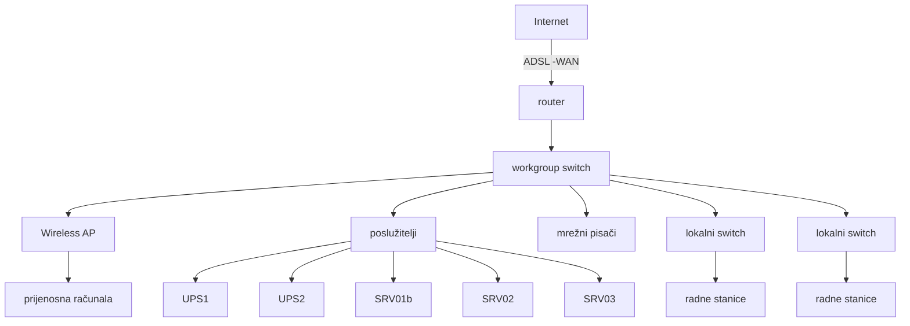

# RUN-20261007-12 — prikupljene mrvice

Izvor: RU-42-03,R2 ODRŽAVANJE RAČUNALNE INFRASTRUKTURE.md. Revizija: 2.

61 živih dobavljačkih mrvica; 142 točnih citatnih poveznica na poglavlja.
Prazni obrasci nisu ispunjeni zapisi. Inventar i opis stare konfiguracije nisu potvrda današnjeg stanja.
Ovo je dokumentacijska potpora, ne konačna ocjena kriterija.

[Registrirani izvor](<../../../raw/RU-42-03,R2 ODRŽAVANJE RAČUNALNE INFRASTRUKTURE.md>)

## 1. CRUMB-DOC-0013-APP_B_VI-0001

Kriterij: APP_B_VI — Document Control

objective_control: RU-42-03 identificirana je oznakom, revizijom 2 i datumom objave.

Izvorno poglavlje: ODRŽAVANJE RAČUNALNE INFRASTRUKTURE [line 3]

~~~~text
| Vrsta i oznaka dokumenta: | Radna uputa RU-42-03 |
~~~~

Izvorno poglavlje: ODRŽAVANJE RAČUNALNE INFRASTRUKTURE [line 3]

~~~~text
| Revizija broj:            | 2                    |
~~~~

Izvorno poglavlje: ODRŽAVANJE RAČUNALNE INFRASTRUKTURE [line 3]

~~~~text
| Datum objavljivanja:      | 17.11.2017.          |
~~~~

## 2. CRUMB-DOC-0013-APP_B_VI-0002

Kriterij: APP_B_VI — Document Control

supporting_control: Priprema, QA pregled i direktorovo odobrenje navedeni su s imenima i datumima.

Izvorno poglavlje: ODRŽAVANJE RAČUNALNE INFRASTRUKTURE [line 3]

~~~~text
| Pripremio: | (Josip Skupnjak, stručni suradnik) | 13.11.2017. Datum |
~~~~

Izvorno poglavlje: ODRŽAVANJE RAČUNALNE INFRASTRUKTURE [line 3]

~~~~text
| Pregledao: | (Vladimir Krže, voditelj QA)        | 14.11.2017. Datum |
~~~~

Izvorno poglavlje: ODRŽAVANJE RAČUNALNE INFRASTRUKTURE [line 3]

~~~~text
| Odobrio:   | (dr.sc. Nenad Debrecin, direktor)   | 15.11.2017. Datum |
~~~~

## 3. CRUMB-DOC-0013-APP_B_VI-0003

Kriterij: APP_B_VI — Document Control

supporting_control: Predviđen je periodični pregled; prazna tablica nije dokaz izvršenog pregleda.

Izvorno poglavlje: ODRŽAVANJE RAČUNALNE INFRASTRUKTURE [line 3] > Periodični pregled [line 17]

~~~~text
| Pregledao: | Datum: | Slijedeći pregled: |
~~~~

## 4. CRUMB-DOC-0013-APP_B_XVII-0001

Kriterij: APP_B_XVII — Quality Assurance Records

objective_control: Uputa opisuje čuvanje korisničkih dokumenata i baze GPD-a pričuvnim kopijama.

Izvorno poglavlje: 1. Svrha [line 69]

~~~~text
Ovaj dokument opisuje računalnu mrežu tvrtke Enconet d.o.o. Daje pregled i organizaciju poslužitelja tvrtke te njihovu namjenu, kao i pregled računalne opreme. Ima zadatak upoznati uposlenike sa važnošću brige o vlastitim dokumentima, kao o drugima koji su im dati na raspolaganje. U svrhu toga se opisuje način održavanja pričuvnih kopija podataka sa računala korisnika te čuvanje baze glavnog popisa dokumenata (GPD).
~~~~

## 5. CRUMB-DOC-0013-APP_B_VI-0004

Kriterij: APP_B_VI — Document Control

objective_control: RU-42-03 zamjenjuje tri stare upute koje prestaju važiti.

Izvorno poglavlje: 1. Svrha [line 69]

~~~~text
Zbog promjena u strukturi i organizaciji tvrtke kao i zbog promjena u računalnim tehnologijama, dokument po svom obimu i sadržaju zamjenjuje stare dokumente (radne upute) koji prestaju biti važeći te se više ne primjenjuju. :
~~~~

Izvorno poglavlje: 1. Svrha [line 69]

~~~~text
1. RU-42-01,R0 (Održavanje back-up kopija GPD-a)
~~~~

Izvorno poglavlje: 1. Svrha [line 69]

~~~~text
2. RU-42-02,R0 (Izrada i održavanje sigurnosnih kopija)
~~~~

Izvorno poglavlje: 1. Svrha [line 69]

~~~~text
3. RU-63-01,R0 (Preventivno održavanje računalne opreme i mreže)
~~~~

## 6. CRUMB-DOC-0013-APP_B_XVII-0002

Kriterij: APP_B_XVII — Quality Assurance Records

objective_control: Područje primjene obuhvaća pričuvne kopije podataka svih radnih stanica.

Izvorno poglavlje: 2. Područje primjene [line 81]

~~~~text
Područje primjene se odnosi na podršku u preventivnom održavanju:
~~~~

Izvorno poglavlje: 2. Područje primjene [line 81]

~~~~text
- pričuvnih kopija korisničkih podataka svih radnih stanica
~~~~

## 7. CRUMB-DOC-0013-APP_B_XVII-0003

Kriterij: APP_B_XVII — Quality Assurance Records

objective_control: Područje primjene obuhvaća pričuvne kopije GPD baze i drugih poslužiteljskih podataka.

Izvorno poglavlje: 2. Područje primjene [line 81]

~~~~text
Područje primjene se odnosi na podršku u preventivnom održavanju:
~~~~

Izvorno poglavlje: 2. Područje primjene [line 81]

~~~~text
- pričuvnih kopija baze glavnog popisa dokumenata i drugih podataka na poslužiteljima
~~~~

## 8. CRUMB-DOC-0013-APP_B_I-0001

Kriterij: APP_B_I — Organization

objective_control: Svi korisnici odgovaraju za vlastite podatke, opremu i praćenje pričuvnih kopija.

Izvorno poglavlje: 3. Odgovornosti [line 87]

~~~~text
Za brigu o vlastitim podacima, radu povjerene im opreme te za praćenje rada sustava za čuvanje pričuvnih kopija vlastitih dokumenata, kako je opisano u točki 8.1 odgovorni i zaduženi su svi korisnici.
~~~~

## 9. CRUMB-DOC-0013-APP_B_I-0002

Kriterij: APP_B_I — Organization

objective_control: Administrator odgovara za poslužitelje, mrežu i računalni sustav.

Izvorno poglavlje: 3. Odgovornosti [line 87]

~~~~text
Za brigu o radu poslužitelja, mreže, tj. sustava u cjelini, kako je opisano u točki 8.2 odgovoran je administrator računalnog sustava.
~~~~

## 10. CRUMB-DOC-0013-APP_B_VI-0005

Kriterij: APP_B_VI — Document Control

candidate_lead: Reference povezuju uputu s Priručnikom i PP-42-01; objective evidence not shown u samom popisu.

Izvorno poglavlje: 3. Odgovornosti [line 87] > 4. Reference [line 99]

~~~~text
1. Enconet - Priručnik kvalitete PK
~~~~

Izvorno poglavlje: 3. Odgovornosti [line 87] > 4. Reference [line 99]

~~~~text
   Zahtjevi koji se odnose na dokumentaciju
~~~~

Izvorno poglavlje: 3. Odgovornosti [line 87] > 4. Reference [line 99]

~~~~text
2. Enconet - Programski postupak PP - 42 - 01
~~~~

Izvorno poglavlje: 3. Odgovornosti [line 87] > 4. Reference [line 99]

~~~~text
   Upravljanje dokumentima
~~~~

## 11. CRUMB-DOC-0013-APP_B_XVII-0004

Kriterij: APP_B_XVII — Quality Assurance Records

supporting_control: Shema mreže prikazuje besprekidno napajanje poslužitelja.

Izvorno poglavlje: 3. Odgovornosti [line 87] > 5. Opis računalne mreže [line 112]

~~~~text

~~~~

Izvorno poglavlje: 3. Odgovornosti [line 87] > 5. Opis računalne mreže [line 112]

~~~~text
Prikazani su karakteristični elementi sustava - radne stanice tj. desktop ili prijenosna računala pojedinih korisnika (na slici: 4 i 8), mrežni pisači (5), poslužitelji (3), uređaji za preklapanje i usmjeravanje mrežnog prometa (1, 2, 6 i 7). Infrastruktura na slici prikazana crvenom bojom je ilustracija lokalnog, a zelenom, vanjskog protoka podataka. Plavom bojom su označene linije besprekidnog napajanja energijom. Detaljan i pregledan popis komponenata u mreži dat je tabelarno u prilogu (Tablica 3: Pregled komponenata računalne mreže).
~~~~

## 12. CRUMB-DOC-0013-APP_B_XVII-0005

Kriterij: APP_B_XVII — Quality Assurance Records

supporting_control: Router/firewall opisuje zaštitu unutarnje mreže, uključujući DoS zaštitu.

Izvorno poglavlje: 3. Odgovornosti [line 87] > 5. Opis računalne mreže [line 112]

~~~~text
Vezu sa svijetom omogućava usmjerivač (1 –ADSL/WAN router). Svaki uređaj u mreži ima svoju jedinstvenu IP adresu. No, ponuditelj usluge spajanja za Internet (u našem slučaju to je tvrtka T-com) nije u mogućnosti omogućiti cijelu klasu adresa korisnicima na uporabu, te se zbog toga pribjeglo NAT (Network Address Translation) mehanizmu prebacivanja javnih adresa u privatne (za javne adrese kaže se da je to 'vanjska' mreža, a za privatne adrese da je to 'unutarnja' mreža). O tome brine namjenski uređaj router/firewall (1) koji osim prevođenja IP adresa ima i ostale elemente zaštite unutarnje mreže, kao što je zaštita od DoS napada i slično.
~~~~

## 13. CRUMB-DOC-0013-APP_B_XVII-0006

Kriterij: APP_B_XVII — Quality Assurance Records

objective_control: Bežični uređaji izolirani su od unutarnjih uređaja pomoću VLAN grupa.

Izvorno poglavlje: 3. Odgovornosti [line 87] > 5. Opis računalne mreže [line 112]

~~~~text
U prilogu (Tablica 3: Pregled komponenata računalne mreže) se daje uvid i u IP adrese dodijeljene pojedinim uređajima u mreži. Privatne IP adrese su fiksno određene (postavljene na mrežnom adapteru svakog uređaja) u području od 192.168.0.1 do 192.168.0.255. Dinamičko dodjeljivanje (DHCP) je onemogućeno. Prijenosni uređaji spojeni na wireless AP (6) se nalaze u izoliranom adresnom prostoru koji se dinamički dodjeljuje (poseban DHCP servis wireless routera) i ne mogu pristupiti uređajima iz prve skupine –moguća je samo veza prema Internetu. Ova postavka je definirana u workgroup switchu (2) formiranjem tri port-based VLAN (Virtual Local Area Network) grupe.
~~~~

## 14. CRUMB-DOC-0013-APP_B_VI-0006

Kriterij: APP_B_VI — Document Control

supporting_control: Detaljne konfiguracijske postavke vode se u Enconet-InfoConfig.xls.

Izvorno poglavlje: 3. Odgovornosti [line 87] > 5. Opis računalne mreže [line 112]

~~~~text
U dokumentu Enconet -InfoConfig.xls se nalazi detaljan plan konfiguracijskih postavki računalne i telefonske infrastrukture.
~~~~

## 15. CRUMB-DOC-0013-APP_B_XVII-0007

Kriterij: APP_B_XVII — Quality Assurance Records

supporting_control: Srv01b naveden je kao središte pričuvnih kopija svih radnih stanica i dijeljenja datoteka.

Izvorno poglavlje: 3. Odgovornosti [line 87] > 5. Opis računalne mreže [line 112]

~~~~text
Prema shemi na slici poslužitelji (3) su u unutarnjoj mreži. Namjene i organizacija poslužitelja je prikazana u tablici (Tablica 1):
~~~~

Izvorno poglavlje: 3. Odgovornosti [line 87] > 5. Opis računalne mreže [line 112]

~~~~text
| Naziv poslužitelja | IP adresa    | Namjena i opis |
~~~~

Izvorno poglavlje: 3. Odgovornosti [line 87] > 5. Opis računalne mreže [line 112]

~~~~text
| Srv01b            | 192.168.0.15 | Pohrana pričuvnih kopija podataka sa svih radnih stanica u mreži, file sharing poslužitelj. Operativni sustav: MS Windows 2003, Server |
~~~~

## 16. CRUMB-DOC-0013-APP_B_XVII-0008

Kriterij: APP_B_XVII — Quality Assurance Records

objective_control: Svakodnevni rad odvija se u user profilu, odvojeno od administratorskog, radi zaštite sustava.

Izvorno poglavlje: 3. Odgovornosti [line 87] > 5. Opis računalne mreže [line 112]

~~~~text
Radne stanice (Slika 1, komponente označene brojem 4) su osobna ili prijenosna računala pojedinih
korisnika s operativnim sustavom MS Windows XP ili MS Windows 7. Na svakom računalu su
otvorena barem dva profila od kojih je uvijek samo jedan administratorski a svakodnevna upotreba
se odvija u tkzv. user profilu. Ovaj mehanizam se uvodi iz sigurnosnih razloga da bi se smanjila
mogućnost neželjenog instaliranja štetnih programa na računala korisnika (virusi, spyware). U tablici
(Tablica 3) iz priloga je prikazan popis korisnika koji koriste radne stanice u mreži. Sve radne
stanice participiraju u formiranoj radnoj grupi (Microsoftov 'File & Sharing' servis – workgroup),
naziva ENCONET_WG. U dokumentu Enconet -PswList.xls se nalazi popis korisničkih i
administratorskih profila na radnim stanicama u mreži, popis korisničkih profila na poslužiteljima te
sve pridružene zaporke. Ovaj dokument je u posjedu administratora sustava i direktora tvrtke. U
tablici (Tablica 4) se nalazi popis računalne opreme, evidentiran po korisnicima.
~~~~

## 17. CRUMB-DOC-0013-APP_B_VI-0007

Kriterij: APP_B_VI — Document Control

supporting_control: Popis profila i zaporki prema uputi posjeduju administrator i direktor; sam popis nije dostavljen.

Izvorno poglavlje: 3. Odgovornosti [line 87] > 5. Opis računalne mreže [line 112]

~~~~text
Radne stanice (Slika 1, komponente označene brojem 4) su osobna ili prijenosna računala pojedinih
korisnika s operativnim sustavom MS Windows XP ili MS Windows 7. Na svakom računalu su
otvorena barem dva profila od kojih je uvijek samo jedan administratorski a svakodnevna upotreba
se odvija u tkzv. user profilu. Ovaj mehanizam se uvodi iz sigurnosnih razloga da bi se smanjila
mogućnost neželjenog instaliranja štetnih programa na računala korisnika (virusi, spyware). U tablici
(Tablica 3) iz priloga je prikazan popis korisnika koji koriste radne stanice u mreži. Sve radne
stanice participiraju u formiranoj radnoj grupi (Microsoftov 'File & Sharing' servis – workgroup),
naziva ENCONET_WG. U dokumentu Enconet -PswList.xls se nalazi popis korisničkih i
administratorskih profila na radnim stanicama u mreži, popis korisničkih profila na poslužiteljima te
sve pridružene zaporke. Ovaj dokument je u posjedu administratora sustava i direktora tvrtke. U
tablici (Tablica 4) se nalazi popis računalne opreme, evidentiran po korisnicima.
~~~~

## 18. CRUMB-DOC-0013-APP_B_XVII-0009

Kriterij: APP_B_XVII — Quality Assurance Records

objective_control: Središnji poslužitelj predviđa svakodnevne automatske kopije u privatni prostor svakog korisnika.

Izvorno poglavlje: 3. Odgovornosti [line 87] > 6. Poslužitelj srv01b [line 181]

~~~~text
Centralno mjesto radne grupe ENCONET_WG je računalo, poslužitelj, srv01b. Zamišljeno je da se koristi kao tzv. file sharing server. Datotečni sustav i organizacija korisnika na ovom poslužitelju je izvršena tako da se zadovolje slijedeći ciljevi:
~~~~

Izvorno poglavlje: 3. Odgovornosti [line 87] > 6. Poslužitelj srv01b [line 181]

~~~~text
1. Automatizirati svakodnevno kreiranje pričuvnih kopija korisničkih dokumenata.
~~~~

Izvorno poglavlje: 3. Odgovornosti [line 87] > 6. Poslužitelj srv01b [line 181]

~~~~text
   Svakom je korisniku radne grupe na poslužitelju je kreiran zasebni, privatni prostor –mape za pohranu. Pristup ovom prostoru je dozvoljen samo njemu a osnovna namjena mu je čuvanje sigurnosnih kopija podataka s njegove radne stanice.
~~~~

## 19. CRUMB-DOC-0013-APP_B_VI-0008

Kriterij: APP_B_VI — Document Control

supporting_control: Dijeljene mape služe brzoj razmjeni dokumenata.

Izvorno poglavlje: 3. Odgovornosti [line 87] > 6. Poslužitelj srv01b [line 181]

~~~~text
Centralno mjesto radne grupe ENCONET_WG je računalo, poslužitelj, srv01b. Zamišljeno je da se koristi kao tzv. file sharing server. Datotečni sustav i organizacija korisnika na ovom poslužitelju je izvršena tako da se zadovolje slijedeći ciljevi:
~~~~

Izvorno poglavlje: 3. Odgovornosti [line 87] > 6. Poslužitelj srv01b [line 181]

~~~~text
2. Unaprijediti i pojednostaviti razmjenu dokumenata u našoj organizaciji.
~~~~

Izvorno poglavlje: 3. Odgovornosti [line 87] > 6. Poslužitelj srv01b [line 181]

~~~~text
   Za ovu svrhu su na poslužitelju kreirane dijeljene mape kojima pristupaju svi korisnici grupe i koje bi trebale služiti za brzu razmjenu datoteka.
~~~~

## 20. CRUMB-DOC-0013-APP_B_V-0001

Kriterij: APP_B_V — Instructions, Procedures, and Drawings

supporting_control: Zajednički resursi uključuju publikacije, literaturu i standarde dostupne osoblju.

Izvorno poglavlje: 3. Odgovornosti [line 87] > 6. Poslužitelj srv01b [line 181]

~~~~text
Centralno mjesto radne grupe ENCONET_WG je računalo, poslužitelj, srv01b. Zamišljeno je da se koristi kao tzv. file sharing server. Datotečni sustav i organizacija korisnika na ovom poslužitelju je izvršena tako da se zadovolje slijedeći ciljevi:
~~~~

Izvorno poglavlje: 3. Odgovornosti [line 87] > 6. Poslužitelj srv01b [line 181]

~~~~text
3. Olakšati pristup resursima od zajedničkog interesa
~~~~

Izvorno poglavlje: 3. Odgovornosti [line 87] > 6. Poslužitelj srv01b [line 181]

~~~~text
   Razne dokumente (publikacije, stručna literatura, standardi…) koje, u većoj ili manjoj mjeri, koriste svi uposlenici, valja držati na ovom mjestu.
~~~~

## 21. CRUMB-DOC-0013-APP_B_XVII-0010

Kriterij: APP_B_XVII — Quality Assurance Records

objective_control: Privatne podmape korisnika odvojene su u WG_private.

Izvorno poglavlje: 3. Odgovornosti [line 87] > 6. Poslužitelj srv01b [line 181]

~~~~text
Vezano za navedeno u stavci 1, kreirana je mapa WG_private (\\Srv01b\WG_private), u kojoj se nalaze podmape dodijeljene pojedinim korisnicima, npr. b_lukic, b_vrdoljak…itd.
~~~~

## 22. CRUMB-DOC-0013-APP_B_VI-0009

Kriterij: APP_B_VI — Document Control

objective_control: Javni prostor razdvaja ograničeno pisanje, neograničeno brisanje i read-only pristup.

Izvorno poglavlje: 3. Odgovornosti [line 87] > 6. Poslužitelj srv01b [line 181]

~~~~text
Za ostvarivanje zadaća u stavkama 2 i 3, u javnoj zoni (\\Srv01b\WG_public), imamo tri razine pristupa koje omogućuju svima:
 -čitanje i pisanje read_write (ograničeno brisanje) (\\Srv01b\WG_public\read_write),
 -čitanje i pisanje read_write_unrestrict.del! ( \\Srv01b\WG_public\read_write_unrestrict.del),
 -čitanje read_only (zadaća pod 3) (\\Srv01b\WG_public\read_only)
~~~~

## 23. CRUMB-DOC-0013-APP_B_VI-0010

Kriterij: APP_B_VI — Document Control

objective_control: SUK dokumente čitaju svi, ali ih mijenjaju samo određeni korisnici.

Izvorno poglavlje: 3. Odgovornosti [line 87] > 6. Poslužitelj srv01b [line 181]

~~~~text
Osim spomenutog, na poslužitelju su organizirane posebne grupe koje imaju nešto drugačiji režim i pravila korištenja. Radi se o grupama SUK, Administracija i Arhiva.
 • Specifičnost grupe SUK (skraćenica od 'Sustav Upravljanja Kvalitetom') je u tome što se koristi za dokumente koji su dozvoljeni za čitanje svim uposlenicima ali ih mijenjati mogu samo određeni korisnici.
 • Grupa 'Administracija' pripada izdvojenoj skupini korisnika, tj. sadrži dokumente koji su u domeni samo uposlenika u administraciji.
 • Grupa 'Arhiva' također pripada izdvojenoj skupini korisnika zaduženih za brigu o spremanju finalnih dokumenata ('proizvoda') tvrtke
~~~~

## 24. CRUMB-DOC-0013-APP_B_XVII-0011

Kriterij: APP_B_XVII — Quality Assurance Records

objective_control: Administracija i Arhiva imaju izdvojene skupine korisnika prema svojim odgovornostima.

Izvorno poglavlje: 3. Odgovornosti [line 87] > 6. Poslužitelj srv01b [line 181]

~~~~text
Osim spomenutog, na poslužitelju su organizirane posebne grupe koje imaju nešto drugačiji režim i pravila korištenja. Radi se o grupama SUK, Administracija i Arhiva.
 • Specifičnost grupe SUK (skraćenica od 'Sustav Upravljanja Kvalitetom') je u tome što se koristi za dokumente koji su dozvoljeni za čitanje svim uposlenicima ali ih mijenjati mogu samo određeni korisnici.
 • Grupa 'Administracija' pripada izdvojenoj skupini korisnika, tj. sadrži dokumente koji su u domeni samo uposlenika u administraciji.
 • Grupa 'Arhiva' također pripada izdvojenoj skupini korisnika zaduženih za brigu o spremanju finalnih dokumenata ('proizvoda') tvrtke
~~~~

## 25. CRUMB-DOC-0013-APP_B_I-0003

Kriterij: APP_B_I — Organization

objective_control: Administrator kreira profile i definira način korištenja poslužitelja.

Izvorno poglavlje: 3. Odgovornosti [line 87] > 6. Poslužitelj srv01b [line 181]

~~~~text
Administrator poslužitelja određuje na koji način će se koristiti poslužitelj, i u tu svrhu kreira korisničke profile.
Svaki korisnik grupe definiran je korisničkim profilom. Korisnički profil je mjesto za određivanje prava, načina i razine pristupa određenim resursima servera i mreže. Organiziranjem korisnika u grupe mogu se na jednom mjestu određivati i definirati zajednička pristupna pravila za više korisnika.
U našoj mreži (ENCONET_WG), svi korisnici su članovi grupe WGusers.
~~~~

## 26. CRUMB-DOC-0013-APP_B_XVII-0012

Kriterij: APP_B_XVII — Quality Assurance Records

objective_control: Profili i grupe određuju prava, način i razinu pristupa resursima.

Izvorno poglavlje: 3. Odgovornosti [line 87] > 6. Poslužitelj srv01b [line 181]

~~~~text
Administrator poslužitelja određuje na koji način će se koristiti poslužitelj, i u tu svrhu kreira korisničke profile.
Svaki korisnik grupe definiran je korisničkim profilom. Korisnički profil je mjesto za određivanje prava, načina i razine pristupa određenim resursima servera i mreže. Organiziranjem korisnika u grupe mogu se na jednom mjestu određivati i definirati zajednička pristupna pravila za više korisnika.
U našoj mreži (ENCONET_WG), svi korisnici su članovi grupe WGusers.
~~~~

## 27. CRUMB-DOC-0013-APP_B_XVII-0013

Kriterij: APP_B_XVII — Quality Assurance Records

objective_control: Privatnoj mapi korisnika pristupa samo taj korisnik.

Izvorno poglavlje: 3. Odgovornosti [line 87] > 6.1 Organiziranje prostora za privatne podatke ( mapa WG_private ) [line 215]

~~~~text
Svaki član radne grupe (workgroup ENCONET_WG) ovdje ima svoju mapu. Pristup sadržajima
unutar te mape je dozvoljen samo njemu.
~~~~

## 28. CRUMB-DOC-0013-APP_B_XVII-0014

Kriterij: APP_B_XVII — Quality Assurance Records

objective_control: Podmapa sync namijenjena je pričuvnim kopijama korisničkog računala.

Izvorno poglavlje: 3. Odgovornosti [line 87] > 6.1 Organiziranje prostora za privatne podatke ( mapa WG_private ) [line 215]

~~~~text
Zamišljeno je da svaki korisnik ovaj 'privatni prostor' koristi za:
~~~~

Izvorno poglavlje: 3. Odgovornosti [line 87] > 6.1 Organiziranje prostora za privatne podatke ( mapa WG_private ) [line 215]

~~~~text
- sigurnosnu pohranu (backup) sadržaja sa svog računala (u ovu svrhu je kreirana podmapa
~~~~

Izvorno poglavlje: 3. Odgovornosti [line 87] > 6.1 Organiziranje prostora za privatne podatke ( mapa WG_private ) [line 215]

~~~~text
  sync)
~~~~

## 29. CRUMB-DOC-0013-APP_B_XVII-0015

Kriterij: APP_B_XVII — Quality Assurance Records

supporting_control: Podmapa home predviđena je kao dodatni mrežni diskovni prostor.

Izvorno poglavlje: 3. Odgovornosti [line 87] > 6.1 Organiziranje prostora za privatne podatke ( mapa WG_private ) [line 215]

~~~~text
Zamišljeno je da svaki korisnik ovaj 'privatni prostor' koristi za:
~~~~

Izvorno poglavlje: 3. Odgovornosti [line 87] > 6.1 Organiziranje prostora za privatne podatke ( mapa WG_private ) [line 215]

~~~~text
- dodatni diskovni prostor, mapirani mrežni disk (u ovu svrhu će se koristiti podmapa home)
~~~~

## 30. CRUMB-DOC-0013-APP_B_VI-0011

Kriterij: APP_B_VI — Document Control

objective_control: Korisnik u svom privatnom prostoru može čitati, stvarati, mijenjati i brisati dokumente.

Izvorno poglavlje: 3. Odgovornosti [line 87] > 6.1 Organiziranje prostora za privatne podatke ( mapa WG_private ) [line 215]

~~~~text
Korisniku je dozvoljeno:
~~~~

Izvorno poglavlje: 3. Odgovornosti [line 87] > 6.1 Organiziranje prostora za privatne podatke ( mapa WG_private ) [line 215]

~~~~text
- čitanje postojećih datoteka, listanje mapa, kopiranje sadržaja na vlastito računalo
~~~~

Izvorno poglavlje: 3. Odgovornosti [line 87] > 6.1 Organiziranje prostora za privatne podatke ( mapa WG_private ) [line 215]

~~~~text
- kreiranje novih datoteka i mapa (dakle, osim predefiniranih mapa sync i home, mogu se
~~~~

Izvorno poglavlje: 3. Odgovornosti [line 87] > 6.1 Organiziranje prostora za privatne podatke ( mapa WG_private ) [line 215]

~~~~text
  kreirati nove), brisanje i mijenjanje postojećih dokumenata, tj. kopiranje s vlastitog
  računala
~~~~

## 31. CRUMB-DOC-0013-APP_B_XVII-0016

Kriterij: APP_B_XVII — Quality Assurance Records

supporting_control: Iz privatnog mrežnog prostora zabranjeno je izvršavanje programa.

Izvorno poglavlje: 3. Odgovornosti [line 87] > 6.1 Organiziranje prostora za privatne podatke ( mapa WG_private ) [line 215]

~~~~text
Onemogućeno je:
~~~~

Izvorno poglavlje: 3. Odgovornosti [line 87] > 6.1 Organiziranje prostora za privatne podatke ( mapa WG_private ) [line 215]

~~~~text
- Izvršavanje programa (*.exe, *.com i sl. datoteke): korisnici i ovdje mogu držati izvršive
~~~~

Izvorno poglavlje: 3. Odgovornosti [line 87] > 6.1 Organiziranje prostora za privatne podatke ( mapa WG_private ) [line 215]

~~~~text
  datoteke (programe), ali je njihovo pokretanje moguće samo u okruženju vlastitog računala.
~~~~

## 32. CRUMB-DOC-0013-APP_B_XVII-0017

Kriterij: APP_B_XVII — Quality Assurance Records

objective_control: Zaštićene su mape sync i home, ali njihov sadržaj korisnik može brisati.

Izvorno poglavlje: 3. Odgovornosti [line 87] > 6.1 Organiziranje prostora za privatne podatke ( mapa WG_private ) [line 215]

~~~~text
Onemogućeno je:
~~~~

Izvorno poglavlje: 3. Odgovornosti [line 87] > 6.1 Organiziranje prostora za privatne podatke ( mapa WG_private ) [line 215]

~~~~text
- Brisanje mapa sync i home, ali ne i njihovog sadržaja –zato valja pozornost posvetiti ovoj
~~~~

Izvorno poglavlje: 3. Odgovornosti [line 87] > 6.1 Organiziranje prostora za privatne podatke ( mapa WG_private ) [line 215]

~~~~text
  činjenici (naročito je to važno za mapu sync jer se u njoj nalazi backup)
~~~~

## 33. CRUMB-DOC-0013-APP_B_VI-0012

Kriterij: APP_B_VI — Document Control

objective_control: U prvoj javnoj mapi sadržaje mijenjaju i brišu samo njihovi vlasnici.

Izvorno poglavlje: 3. Odgovornosti [line 87] > 6.2 Prostor za pojednostavljenu razmjenu dokumenata (mape WG_public-read_write i WG_public\read_write_unrestrict.del!) [line 240]

~~~~text
Za ovu svrhu su organizirane dvije mape koje se razlikuju samo u definiciji prava korisnicima da
izbrišu sadržaje koji se u njima nalaze.
~~~~

Izvorno poglavlje: 3. Odgovornosti [line 87] > 6.2 Prostor za pojednostavljenu razmjenu dokumenata (mape WG_public-read_write i WG_public\read_write_unrestrict.del!) [line 240]

~~~~text
Ova mapa, tj. njeni sadržaji (datoteke, programi, podmape), je dostupna svim članovima radne
grupe (workgroup ENCONET_WG), na način, tj. moguće je:
~~~~

Izvorno poglavlje: 3. Odgovornosti [line 87] > 6.2 Prostor za pojednostavljenu razmjenu dokumenata (mape WG_public-read_write i WG_public\read_write_unrestrict.del!) [line 240]

~~~~text
- čitanje postojećih datoteka, listanje mapa, kopiranje sadržaja na vlastito računalo
~~~~

Izvorno poglavlje: 3. Odgovornosti [line 87] > 6.2 Prostor za pojednostavljenu razmjenu dokumenata (mape WG_public-read_write i WG_public\read_write_unrestrict.del!) [line 240]

~~~~text
- kreiranje novih datoteka i mapa, kopiranje sadržaja s vlastitog računala
~~~~

Izvorno poglavlje: 3. Odgovornosti [line 87] > 6.2 Prostor za pojednostavljenu razmjenu dokumenata (mape WG_public-read_write i WG_public\read_write_unrestrict.del!) [line 240]

~~~~text
- brisati i mijenjati postojeće datoteke i mape mogu samo njihovi vlasnici, tj. članovi grupe
~~~~

Izvorno poglavlje: 3. Odgovornosti [line 87] > 6.2 Prostor za pojednostavljenu razmjenu dokumenata (mape WG_public-read_write i WG_public\read_write_unrestrict.del!) [line 240]

~~~~text
  koji su ih kreirali ili u ovaj prostor kopirali.
~~~~

## 34. CRUMB-DOC-0013-APP_B_XVII-0018

Kriterij: APP_B_XVII — Quality Assurance Records

supporting_control: Iz prve javne mape zabranjeno je pokretanje programa.

Izvorno poglavlje: 3. Odgovornosti [line 87] > 6.2 Prostor za pojednostavljenu razmjenu dokumenata (mape WG_public-read_write i WG_public\read_write_unrestrict.del!) [line 240]

~~~~text
Izvršavanje programa (*.exe, *.com i sl. datoteke) je onemogućeno: korisnici bi ih trebali kopirati na
svoje računalo i pokretati iz svog okruženja
~~~~

## 35. CRUMB-DOC-0013-APP_B_VI-0013

Kriterij: APP_B_VI — Document Control

objective_control: U drugoj javnoj mapi svi korisnici smiju mijenjati i brisati sadržaj.

Izvorno poglavlje: 3. Odgovornosti [line 87] > 6.2 Prostor za pojednostavljenu razmjenu dokumenata (mape WG_public-read_write i WG_public\read_write_unrestrict.del!) [line 240]

~~~~text
Ova mapa, tj. njeni sadržaji (datoteke, programi, podmape), je dostupna svim članovima radne
grupe (workgroup ENCONET_WG), na način, tj. moguće je:
~~~~

Izvorno poglavlje: 3. Odgovornosti [line 87] > 6.2 Prostor za pojednostavljenu razmjenu dokumenata (mape WG_public-read_write i WG_public\read_write_unrestrict.del!) [line 240]

~~~~text
- čitanje postojećih datoteka, listanje mapa, kopiranje sadržaja na vlastito računalo
~~~~

Izvorno poglavlje: 3. Odgovornosti [line 87] > 6.2 Prostor za pojednostavljenu razmjenu dokumenata (mape WG_public-read_write i WG_public\read_write_unrestrict.del!) [line 240]

~~~~text
- kreiranje novih datoteka i mapa, kopiranje sadržaja s vlastitog računala
~~~~

Izvorno poglavlje: 3. Odgovornosti [line 87] > 6.2 Prostor za pojednostavljenu razmjenu dokumenata (mape WG_public-read_write i WG_public\read_write_unrestrict.del!) [line 240]

~~~~text
- brisanje i mijenjanje postojećih sadržaja je dozvoljeno svima!
~~~~

## 36. CRUMB-DOC-0013-APP_B_XVII-0019

Kriterij: APP_B_XVII — Quality Assurance Records

supporting_control: Iz javne mape s neograničenim brisanjem zabranjeno je pokretanje programa.

Izvorno poglavlje: 3. Odgovornosti [line 87] > 6.2 Prostor za pojednostavljenu razmjenu dokumenata (mape WG_public-read_write i WG_public\read_write_unrestrict.del!) [line 240]

~~~~text
Izvršavanje programa (*.exe, *.com i sl. datoteke) je onemogućeno: korisnici bi ih trebali kopirati na
svoje računalo i pokretati iz svog okruženja
~~~~

## 37. CRUMB-DOC-0013-APP_B_V-0002

Kriterij: APP_B_V — Instructions, Procedures, and Drawings

supporting_control: Read-only resursi dostupni su za čitanje i kopiranje svim članovima radne grupe.

Izvorno poglavlje: 3. Odgovornosti [line 87] > 6.2 Prostor za pojednostavljenu razmjenu dokumenata (mape WG_public-read_write i WG_public\read_write_unrestrict.del!) [line 240]

~~~~text
Ova mapa, tj. njeni sadržaji (datoteke, programi, podmape), je dostupna svim članovima radne
grupe (workgroup ENCONET_WG), a dozvoljeno je:
~~~~

Izvorno poglavlje: 3. Odgovornosti [line 87] > 6.2 Prostor za pojednostavljenu razmjenu dokumenata (mape WG_public-read_write i WG_public\read_write_unrestrict.del!) [line 240]

~~~~text
- čitanje postojećih datoteka, listanje mapa, kopiranje svih sadržaja na vlastito računalo
~~~~

## 38. CRUMB-DOC-0013-APP_B_VI-0014

Kriterij: APP_B_VI — Document Control

objective_control: Samo WGadmin stvara, mijenja i briše sadržaj read-only resursa.

Izvorno poglavlje: 3. Odgovornosti [line 87] > 6.2 Prostor za pojednostavljenu razmjenu dokumenata (mape WG_public-read_write i WG_public\read_write_unrestrict.del!) [line 240]

~~~~text
Samo administrator grupe (WGadmin) može kreirati nove ili kopirati, brisati i mijenjati
postojeće datoteke i mape.
~~~~

## 39. CRUMB-DOC-0013-APP_B_XVII-0020

Kriterij: APP_B_XVII — Quality Assurance Records

supporting_control: U read-only prostoru izvršavanje je dopušteno samo iz određenih instalacijskih mapa.

Izvorno poglavlje: 3. Odgovornosti [line 87] > 6.2 Prostor za pojednostavljenu razmjenu dokumenata (mape WG_public-read_write i WG_public\read_write_unrestrict.del!) [line 240]

~~~~text
Izvršavanje programa (*.exe, *.com i sl. datoteke) je omogućeno samo iz mape installers, software
downloads, drivers.
~~~~

## 40. CRUMB-DOC-0013-APP_B_XVII-0021

Kriterij: APP_B_XVII — Quality Assurance Records

objective_control: Korisnik i administrator određuju koje podatke čuvati, uključujući dokumente i e-poštu.

Izvorno poglavlje: 3. Odgovornosti [line 87] > 7. Sustav za čuvanje pričuvnih kopija (korisničkih) podataka [line 294]

~~~~text
Svaki korisnik računala (radne stanice) u suradnji s administratorom određuje koje podatke će održavati kao sigurnosne kopije. To su npr. podaci iz sistemskih mapa 'My Documents', 'Favorites', i 'Desktop'. Zatim, tu spadaju mape s elektroničkom poštom i adresar. Podatke, koje žele čuvati, korisnici na svojim računalima trebaju organizirati u smislene cjeline tj. podijeliti ih po mapama kako bi se izbjeglo spremanje cijelih diskova ili velikih količina 'nepotrebnih' podataka.
~~~~

## 41. CRUMB-DOC-0013-APP_B_XVII-0022

Kriterij: APP_B_XVII — Quality Assurance Records

objective_control: Podaci za kopiranje organiziraju se u smislene mape radi izbjegavanja nepotrebnih sadržaja.

Izvorno poglavlje: 3. Odgovornosti [line 87] > 7. Sustav za čuvanje pričuvnih kopija (korisničkih) podataka [line 294]

~~~~text
Svaki korisnik računala (radne stanice) u suradnji s administratorom određuje koje podatke će održavati kao sigurnosne kopije. To su npr. podaci iz sistemskih mapa 'My Documents', 'Favorites', i 'Desktop'. Zatim, tu spadaju mape s elektroničkom poštom i adresar. Podatke, koje žele čuvati, korisnici na svojim računalima trebaju organizirati u smislene cjeline tj. podijeliti ih po mapama kako bi se izbjeglo spremanje cijelih diskova ili velikih količina 'nepotrebnih' podataka.
~~~~

## 42. CRUMB-DOC-0013-APP_B_XVII-0023

Kriterij: APP_B_XVII — Quality Assurance Records

objective_control: Administrator kreira korisnički backup profil i bilježi postavke.

Izvorno poglavlje: 3. Odgovornosti [line 87] > 7. Sustav za čuvanje pričuvnih kopija (korisničkih) podataka [line 294]

~~~~text
Nakon što se izvršila organizacija, administrator pristupa podešavanju programa 'SyncToy'. Za svakog korisnika izradi backup profil, tj. definira način izrade backup-a. Ovo je dovoljno učiniti jednom, a postavke se upisuju u tablicu koju svaki korisnik ima uz svoje računalo (Error! Reference source not found.).
~~~~

## 43. CRUMB-DOC-0013-APP_B_VI-0015

Kriterij: APP_B_VI — Document Control

candidate_lead: Uputa za zapis profila sadrži Error! Reference source not found.; candidate; verify criterion mapping i dostupnost stvarne tablice.

Izvorno poglavlje: 3. Odgovornosti [line 87] > 7. Sustav za čuvanje pričuvnih kopija (korisničkih) podataka [line 294]

~~~~text
Nakon što se izvršila organizacija, administrator pristupa podešavanju programa 'SyncToy'. Za svakog korisnika izradi backup profil, tj. definira način izrade backup-a. Ovo je dovoljno učiniti jednom, a postavke se upisuju u tablicu koju svaki korisnik ima uz svoje računalo (Error! Reference source not found.).
~~~~

## 44. CRUMB-DOC-0013-APP_B_XVII-0024

Kriterij: APP_B_XVII — Quality Assurance Records

objective_control: Novi podaci svakodnevno se kopiraju na srv01b; program se treba pokretati svakodnevno.

Izvorno poglavlje: 3. Odgovornosti [line 87] > 7. Sustav za čuvanje pričuvnih kopija (korisničkih) podataka [line 294]

~~~~text
Program 'SncToy' ima zadaću da u pravilnom vremenskom režimu, svakodnevno, nove podatke prepiše u privatni prostor svakog korisnika na računalu srv01b. Zbog toga se treba i pokretati svakodnevno –npr. prilikom gašenja računala (podešavanje je opisano u sekciji 7.1).
~~~~

## 45. CRUMB-DOC-0013-APP_B_V-0003

Kriterij: APP_B_V — Instructions, Procedures, and Drawings

objective_control: Uputa određuje Group Policy skriptu za automatsko pozivanje backup profila.

Izvorno poglavlje: 3. Odgovornosti [line 87] > 7. Sustav za čuvanje pričuvnih kopija (korisničkih) podataka [line 294]

~~~~text
U ovu svrhu se koristi Group Policy Editor kao sučelje za podešavanje i upravljanje izvođenja tkzv. shut-down skripte tj. određujemo što će računalo izvršavati prilikom gašenja računala. Na ovom mjestu pozivamo naše prethodno organizirane SyncToy backup profile.
~~~~

## 46. CRUMB-DOC-0013-APP_B_V-0004

Kriterij: APP_B_V — Instructions, Procedures, and Drawings

objective_control: Propisani su koraci podešavanja Logoff skripte s SyncToyCmd i parametrom R.

Izvorno poglavlje: 3. Odgovornosti [line 87] > 7. Sustav za čuvanje pričuvnih kopija (korisničkih) podataka [line 294]

~~~~text
Podešavanje se izvodi na slijedeći način (Slika 2):
~~~~

Izvorno poglavlje: 3. Odgovornosti [line 87] > 7. Sustav za čuvanje pričuvnih kopija (korisničkih) podataka [line 294]

~~~~text
1. klik na Start, zatim Run, utipkati gpedit.msc
~~~~

Izvorno poglavlje: 3. Odgovornosti [line 87] > 7. Sustav za čuvanje pričuvnih kopija (korisničkih) podataka [line 294]

~~~~text
2. u grupi User Configuration kliknuti na Windows Settings i otvoriti Scripts (Logon/Logoff)
~~~~

Izvorno poglavlje: 3. Odgovornosti [line 87] > 7. Sustav za čuvanje pričuvnih kopija (korisničkih) podataka [line 294]

~~~~text
3. izabrati Logoff Properties
~~~~

Izvorno poglavlje: 3. Odgovornosti [line 87] > 7. Sustav za čuvanje pričuvnih kopija (korisničkih) podataka [line 294]

~~~~text
4. upisati novu skriptu (dugme Add...) tj. upisati prečac programa SyncToy:
~~~~

Izvorno poglavlje: 3. Odgovornosti [line 87] > 7. Sustav za čuvanje pričuvnih kopija (korisničkih) podataka [line 294]

~~~~text
   - u polje Script Name upisati (koristiti Browse...) C:\Program Files\SyncToy 2.1\SyncToyCmd.exe
~~~~

Izvorno poglavlje: 3. Odgovornosti [line 87] > 7. Sustav za čuvanje pričuvnih kopija (korisničkih) podataka [line 294]

~~~~text
   - u polje Script Parameters upisati –R
~~~~

Izvorno poglavlje: 3. Odgovornosti [line 87] > 7. Sustav za čuvanje pričuvnih kopija (korisničkih) podataka [line 294]

~~~~text
5. Potvrditi unos postavki klikom na OK dugme, zatvoriti Group Policy Editor
~~~~

## 47. CRUMB-DOC-0013-APP_B_XVII-0025

Kriterij: APP_B_XVII — Quality Assurance Records

objective_control: Opisano je automatsko spremanje na srv01b prije gašenja računala.

Izvorno poglavlje: 3. Odgovornosti [line 87] > 7. Sustav za čuvanje pričuvnih kopija (korisničkih) podataka [line 294]

~~~~text
Sada će operativni sustav, svaki puta prije gašenja računala, izvršiti aktivnosti predefinirane u
programu SyncToy, tj. izvršiti spremanje sigurnosnih kopija podataka na server srv01b.
~~~~

## 48. CRUMB-DOC-0013-APP_B_XVII-0026

Kriterij: APP_B_XVII — Quality Assurance Records

objective_control: Korisnik provjerava postojanje kopiranih mapa i datume izmijenjenih datoteka.

Izvorno poglavlje: 3. Odgovornosti [line 87] > 8. Praćenje rada računalnog sustava i pohrane pričuvnih kopija podataka [line 368]

~~~~text
Korisnici prate rad programa SyncToy na svom računalu, tj. da li se podaci/mape koji su definirani u njihovom back-up profilu kopiraju u odgovarajući prostor na poslužitelju srv01b. Na primjer, za prethodni dan pogledaju što se nalazi u njihovom prostoru za privatne podatke na poslužitelju, provjere datume na mapama i datotekama koje su mijenjali. Također, prate stanje svojeg računala i rad programa koje koriste. O svim uočenim nedostacima izvještavaju administratora sustava.
~~~~

## 49. CRUMB-DOC-0013-APP_B_XVI-0001

Kriterij: APP_B_XVI — Corrective Action

supporting_control: O uočenim nedostacima programa, računala ili kopiranja izvješćuje se administrator.

Izvorno poglavlje: 3. Odgovornosti [line 87] > 8. Praćenje rada računalnog sustava i pohrane pričuvnih kopija podataka [line 368]

~~~~text
Korisnici prate rad programa SyncToy na svom računalu, tj. da li se podaci/mape koji su definirani u njihovom back-up profilu kopiraju u odgovarajući prostor na poslužitelju srv01b. Na primjer, za prethodni dan pogledaju što se nalazi u njihovom prostoru za privatne podatke na poslužitelju, provjere datume na mapama i datotekama koje su mijenjali. Također, prate stanje svojeg računala i rad programa koje koriste. O svim uočenim nedostacima izvještavaju administratora sustava.
~~~~

## 50. CRUMB-DOC-0013-APP_B_II-0001

Kriterij: APP_B_II — Quality Assurance Program

objective_control: Oprema se konfigurira i održava za pouzdane aplikacije i razmjenu podataka.

Izvorno poglavlje: 3. Odgovornosti [line 87] > 8. Praćenje rada računalnog sustava i pohrane pričuvnih kopija podataka [line 368]

~~~~text
Oprema (računala, pisači, mrežni uređaji) treba biti konfigurirana i održavati se na potrebnom stupnju upotrebljivosti kako bi se osigurao rad operativnih aplikacija, sigurnost pohranjenih podataka i informacija te pouzdanost u razmjeni podataka i informacija između osoblja ENCONET doo kao i sa vanjskim suradnicima. Uvedene su adekvatne mjere zaštite kontrole pristupa računalima i informacijama i podacima, kao što su zaštita lozinkom i ograničenje pristupa. Vodi se briga o radu poslužitelja o čemu administrator vodi evidenciju (Tablica 2).
~~~~

## 51. CRUMB-DOC-0013-APP_B_XVII-0027

Kriterij: APP_B_XVII — Quality Assurance Records

objective_control: Pohranjeni podaci i informacije štite se lozinkama i ograničenjem pristupa.

Izvorno poglavlje: 3. Odgovornosti [line 87] > 8. Praćenje rada računalnog sustava i pohrane pričuvnih kopija podataka [line 368]

~~~~text
Oprema (računala, pisači, mrežni uređaji) treba biti konfigurirana i održavati se na potrebnom stupnju upotrebljivosti kako bi se osigurao rad operativnih aplikacija, sigurnost pohranjenih podataka i informacija te pouzdanost u razmjeni podataka i informacija između osoblja ENCONET doo kao i sa vanjskim suradnicima. Uvedene su adekvatne mjere zaštite kontrole pristupa računalima i informacijama i podacima, kao što su zaštita lozinkom i ograničenje pristupa. Vodi se briga o radu poslužitelja o čemu administrator vodi evidenciju (Tablica 2).
~~~~

## 52. CRUMB-DOC-0013-APP_B_XVII-0028

Kriterij: APP_B_XVII — Quality Assurance Records

objective_control: Administrator vodi evidenciju rada poslužitelja.

Izvorno poglavlje: 3. Odgovornosti [line 87] > 8. Praćenje rada računalnog sustava i pohrane pričuvnih kopija podataka [line 368]

~~~~text
Oprema (računala, pisači, mrežni uređaji) treba biti konfigurirana i održavati se na potrebnom stupnju upotrebljivosti kako bi se osigurao rad operativnih aplikacija, sigurnost pohranjenih podataka i informacija te pouzdanost u razmjeni podataka i informacija između osoblja ENCONET doo kao i sa vanjskim suradnicima. Uvedene su adekvatne mjere zaštite kontrole pristupa računalima i informacijama i podacima, kao što su zaštita lozinkom i ograničenje pristupa. Vodi se briga o radu poslužitelja o čemu administrator vodi evidenciju (Tablica 2).
~~~~

## 53. CRUMB-DOC-0013-APP_B_XVII-0029

Kriterij: APP_B_XVII — Quality Assurance Records

objective_control: Administrator povremeno prati korisničku pohranu pričuvnih kopija.

Izvorno poglavlje: 3. Odgovornosti [line 87] > 8. Praćenje rada računalnog sustava i pohrane pričuvnih kopija podataka [line 368]

~~~~text
Također, administrator sustava povremeno prati korisničke aktivnosti vezane za pohranu njihovih pričuvnih kopija podataka na poslužitelj srv01b.
~~~~

## 54. CRUMB-DOC-0013-APP_B_XVII-0030

Kriterij: APP_B_XVII — Quality Assurance Records

supporting_control: Prazna administratorska evidencija predviđa poslužitelj, kopije, UPS primjedbe, potpis i datum.

Izvorno poglavlje: 3. Odgovornosti [line 87] > 9. Prilozi [line 385]

~~~~text
Tablica 2: Izgled tabele za administratorsku evidenciju stanja poslužitelja
~~~~

Izvorno poglavlje: 3. Odgovornosti [line 87] > 9. Prilozi [line 385]

~~~~text
| Evidencija stanja poslužitelja |
~~~~

Izvorno poglavlje: 3. Odgovornosti [line 87] > 9. Prilozi [line 385]

~~~~text
| Poslužitelj: ............       | Administrator: .......... |
~~~~

Izvorno poglavlje: 3. Odgovornosti [line 87] > 9. Prilozi [line 385]

~~~~text
| stanje pričuvnih kopija korisničkih podataka / primjedbe i komentari na rad poslužitelja i opreme (UPS) / | potpis i datum |
~~~~

## 55. CRUMB-DOC-0013-APP_B_II-0002

Kriterij: APP_B_II — Quality Assurance Program

supporting_control: Popunjeni pregled mreže identificira backup poslužitelj i njegovo mrežno mjesto; povijesni inventar nije današnja potvrda.

Izvorno poglavlje: 3. Odgovornosti [line 87] > 9. Prilozi [line 385]

~~~~text
Tablica 3: Pregled komponenata računalne mreže
~~~~

Izvorno poglavlje: 3. Odgovornosti [line 87] > 9. Prilozi [line 385]

~~~~text
| korisnik / uređaj | naziv komponente (host name) u mreži ENCONET_WG | opis | IP adresa | MAC adresa | broj na priključnom panelu/zidu | broj na workgroup switchu |
~~~~

Izvorno poglavlje: 3. Odgovornosti [line 87] > 9. Prilozi [line 385]

~~~~text
| Server srv01b (Win2003 server) | srv01.enconet.local | | 192.168.0.15 | 00-11-11-EF-B7-D0 | 14 | 25 |
~~~~

## 56. CRUMB-DOC-0013-APP_B_II-0003

Kriterij: APP_B_II — Quality Assurance Program

supporting_control: Popunjeni inventar povezuje korisnike i radne stanice s mrežnim priključcima; treba provjeriti aktualnost.

Izvorno poglavlje: 3. Odgovornosti [line 87] > 9. Prilozi [line 385]

~~~~text
| korisnik / uređaj | naziv komponente (host name) u mreži ENCONET_WG | opis | IP adresa | MAC adresa | broj na priključnom panelu/zidu | broj na workgroup switchu |
~~~~

Izvorno poglavlje: 3. Odgovornosti [line 87] > 9. Prilozi [line 385]

~~~~text
| Josip Skupnjak | WKS01 | | 192.168.0.54 | 00-50-BA-AA-4C-DA | 26 | 2 |
~~~~

Izvorno poglavlje: 3. Odgovornosti [line 87] > 9. Prilozi [line 385]

~~~~text
| Matija Balić | wks12.enconet.local | | 192.168.0.56 | 00-1D-92-74-8A-57 | 28 | 4 |
~~~~

Izvorno poglavlje: 3. Odgovornosti [line 87] > 9. Prilozi [line 385]

~~~~text
| Boško Lukić | wks11.enconet.local | | 192.168.0.57 | 00-13-20-20-C7-14 | 28 | 4 |
~~~~

Izvorno poglavlje: 3. Odgovornosti [line 87] > 9. Prilozi [line 385]

~~~~text
| Josip Vuković | ATHLON | | 192.168.0.61 | 00-0C-F1-7F-62-3B | 7 | 5 |
~~~~

Izvorno poglavlje: 3. Odgovornosti [line 87] > 9. Prilozi [line 385]

~~~~text
| Ilijana Iveković | | | 192.168.0.63 | 00-21-5A-72-EF-92 | 5 | 3 |
~~~~

## 57. CRUMB-DOC-0013-APP_B_II-0004

Kriterij: APP_B_II — Quality Assurance Program

supporting_control: Popunjeni pregled opreme povezuje korisnika i hardversku konfiguraciju; nije test funkcionalnosti.

Izvorno poglavlje: 3. Odgovornosti [line 87] > 9. Prilozi [line 385]

~~~~text
Tablica 4: Pregled računalne opreme
~~~~

Izvorno poglavlje: 3. Odgovornosti [line 87] > 9. Prilozi [line 385]

~~~~text
| Korisnik /računalo | Procesor, radni takt, RAM | Tvrdi diskovi, optički pogoni | Monitor /rezolucija | Drugo... | Napomena |
~~~~

Izvorno poglavlje: 3. Odgovornosti [line 87] > 9. Prilozi [line 385]

~~~~text
| Barbara Vrdoljak | Intel Pentium Dual CPU@2GHz; 2GB RAM | HD1: 232GB CD/DVD pržilica | monitor LG (19") | scanner: Canon Lide20; | Novi HP Compaq... |
~~~~

Izvorno poglavlje: 3. Odgovornosti [line 87] > 9. Prilozi [line 385]

~~~~text
| Matija Balić | Intel Core 2 Quad@2,44GHz; 2 GB RAM | HD: 135GB DVDRom/CD pržilica | Samsung SyncMaster 710N (17") | | Novi HP Compaq... |
~~~~

Izvorno poglavlje: 3. Odgovornosti [line 87] > 9. Prilozi [line 385]

~~~~text
| Vlado Križe | Intel Pentium 4 @ 3GHz; 1GB RAM | HD: 110GB; 2xDVD/RW | lampaš monitor Hansol 920D (19") | | bivše Ilijanino računalo |
~~~~

Izvorno poglavlje: 3. Odgovornosti [line 87] > 9. Prilozi [line 385]

~~~~text
| Ilijana Iveković | Intel Pentium Dual CPU E2180@2GHz; 2GB RAM | HD: 232GB; CD/DVD | Philips 190S (19") | | Novi HP Compaq... |
~~~~

Izvorno poglavlje: 3. Odgovornosti [line 87] > 9. Prilozi [line 385]

~~~~text
| Boško Lukić | Intel Pentium 4, 3GHz, 1GB | HD: 149,04GB CD pržilica | Samsung SyncMaster 710N (17") | | |
~~~~

Izvorno poglavlje: 3. Odgovornosti [line 87] > 9. Prilozi [line 385]

~~~~text
| Dejan Škanata | Laptop: Toshiba, Intel Celeron | HD: 40GB DVDRom/CD pržilica | | | |
~~~~

Izvorno poglavlje: 3. Odgovornosti [line 87] > 9. Prilozi [line 385]

~~~~text
| Davor Šinka | Intel Pentium Mobile 1,2GHz, 1,23GB | HD: 40GB DVDRom/CD pržilica | Samsung SyncMaster 931BF (19") | docking station | |
~~~~

Izvorno poglavlje: 3. Odgovornosti [line 87] > 9. Prilozi [line 385]

~~~~text
| Josip Skupnjak | Intel Pentium 4, 1,8GHz, 512MB | HD1: 74,52GB, HD2: 76,33GB CDRom, CD/DVD pržilica | Compaq TFT7020 (17") (1280x1024) | | |
~~~~

Izvorno poglavlje: 3. Odgovornosti [line 87] > 9. Prilozi [line 385]

~~~~text
| Dubravka Dončević | AMD Athlon 64x2, 2,19GHz, 896MB | HD: 149,05GB CD/DVD pržilica | Sony (1152x864) (19") | lokalni printer: HPlj.2200 E-Zaba card reader | |
~~~~

Izvorno poglavlje: 3. Odgovornosti [line 87] > 9. Prilozi [line 385]

~~~~text
| Andrea Pirša | Intel Celeron@2,66GHz; 504MB RAM | HD1: 80GB, HD2: 120GB, HD3: 170GB CDrom, CD/DVD pržilica | Acer AL1716 (17") (1024x768) | lokalni printer: Epson LQ-570; lokalni scanner/printer: CanonMX700; E-Zaba card reader | |
~~~~

Izvorno poglavlje: 3. Odgovornosti [line 87] > 9. Prilozi [line 385]

~~~~text
| Damir Konjarek | Intel Pentium D @ 3,2GHz, 1,98GB RAM | HD1= HD2= 160GB (SATA) HD3 (na popravku)=1TB HD4=HD5= 320GB (na faxu) CD/DVD pržilica | Sony SDM-X93 (19") (1280x1024) | UPS | |
~~~~

## 58. CRUMB-DOC-0013-APP_B_XVII-0031

Kriterij: APP_B_XVII — Quality Assurance Records

supporting_control: Popis backup poslužitelja uključuje diskove i UPS kao povijesnu potporu čuvanju podataka.

Izvorno poglavlje: 3. Odgovornosti [line 87] > 9. Prilozi [line 385]

~~~~text
| Korisnik/Uređaj        | Procesor                    | Disk/Optički uređaj                  | Monitor/Ostalo           |
~~~~

Izvorno poglavlje: 3. Odgovornosti [line 87] > 9. Prilozi [line 385]

~~~~text
| Server 01b (MS         | Intel Pentium 4, 3,2GHz,    | HD1= HD2=186,31GB;                   | UPS                      |
~~~~

Izvorno poglavlje: 3. Odgovornosti [line 87] > 9. Prilozi [line 385]

~~~~text
| Win2003 server)        | 1GB                        | HD3=298,09GB; CD/DVD                 |                          |
~~~~

Izvorno poglavlje: 3. Odgovornosti [line 87] > 9. Prilozi [line 385]

~~~~text
|                        |                            | pržilica x2                          |                          |
~~~~

## 59. CRUMB-DOC-0013-APP_B_VI-0016

Kriterij: APP_B_VI — Document Control

candidate_lead: Uputa još traži GPD backup; candidate; verify criterion mapping prema važećem postupku upravljanja dokumentima.

Izvorno poglavlje: 1. Svrha [line 69]

~~~~text
Ovaj dokument opisuje računalnu mrežu tvrtke Enconet d.o.o. Daje pregled i organizaciju poslužitelja tvrtke te njihovu namjenu, kao i pregled računalne opreme. Ima zadatak upoznati uposlenike sa važnošću brige o vlastitim dokumentima, kao o drugima koji su im dati na raspolaganje. U svrhu toga se opisuje način održavanja pričuvnih kopija podataka sa računala korisnika te čuvanje baze glavnog popisa dokumenata (GPD).
~~~~

Izvorno poglavlje: 2. Područje primjene [line 81]

~~~~text
Područje primjene se odnosi na podršku u preventivnom održavanju:
~~~~

Izvorno poglavlje: 2. Područje primjene [line 81]

~~~~text
- pričuvnih kopija baze glavnog popisa dokumenata i drugih podataka na poslužiteljima
~~~~

## 60. CRUMB-DOC-0013-APP_B_XVII-0032

Kriterij: APP_B_XVII — Quality Assurance Records

candidate_lead: Svakodnevni backup vezan je uz Logoff ili gašenje; candidate; verify criterion mapping i kopiranje računala koja se ne odjavljuju.

Izvorno poglavlje: 3. Odgovornosti [line 87] > 7. Sustav za čuvanje pričuvnih kopija (korisničkih) podataka [line 294]

~~~~text
Program 'SncToy' ima zadaću da u pravilnom vremenskom režimu, svakodnevno, nove podatke prepiše u privatni prostor svakog korisnika na računalu srv01b. Zbog toga se treba i pokretati svakodnevno –npr. prilikom gašenja računala (podešavanje je opisano u sekciji 7.1).
~~~~

Izvorno poglavlje: 3. Odgovornosti [line 87] > 7. Sustav za čuvanje pričuvnih kopija (korisničkih) podataka [line 294]

~~~~text
U ovu svrhu se koristi Group Policy Editor kao sučelje za podešavanje i upravljanje izvođenja tkzv. shut-down skripte tj. određujemo što će računalo izvršavati prilikom gašenja računala. Na ovom mjestu pozivamo naše prethodno organizirane SyncToy backup profile.
~~~~

Izvorno poglavlje: 3. Odgovornosti [line 87] > 7. Sustav za čuvanje pričuvnih kopija (korisničkih) podataka [line 294]

~~~~text
2. u grupi User Configuration kliknuti na Windows Settings i otvoriti Scripts (Logon/Logoff)
~~~~

Izvorno poglavlje: 3. Odgovornosti [line 87] > 7. Sustav za čuvanje pričuvnih kopija (korisničkih) podataka [line 294]

~~~~text
3. izabrati Logoff Properties
~~~~

Izvorno poglavlje: 3. Odgovornosti [line 87] > 7. Sustav za čuvanje pričuvnih kopija (korisničkih) podataka [line 294]

~~~~text
Sada će operativni sustav, svaki puta prije gašenja računala, izvršiti aktivnosti predefinirane u
programu SyncToy, tj. izvršiti spremanje sigurnosnih kopija podataka na server srv01b.
~~~~

## 61. CRUMB-DOC-0013-APP_B_II-0005

Kriterij: APP_B_II — Quality Assurance Program

candidate_lead: Dokument navodi Windows XP i Server 2003; candidate; verify criterion mapping i aktualnu konfiguraciju bez zaključka iz starosti popisa.

Izvorno poglavlje: 3. Odgovornosti [line 87] > 5. Opis računalne mreže [line 112]

~~~~text
| Srv01b            | 192.168.0.15 | Pohrana pričuvnih kopija podataka sa svih radnih stanica u mreži, file sharing poslužitelj. Operativni sustav: MS Windows 2003, Server |
~~~~

Izvorno poglavlje: 3. Odgovornosti [line 87] > 5. Opis računalne mreže [line 112]

~~~~text
Radne stanice (Slika 1, komponente označene brojem 4) su osobna ili prijenosna računala pojedinih
korisnika s operativnim sustavom MS Windows XP ili MS Windows 7. Na svakom računalu su
otvorena barem dva profila od kojih je uvijek samo jedan administratorski a svakodnevna upotreba
se odvija u tkzv. user profilu. Ovaj mehanizam se uvodi iz sigurnosnih razloga da bi se smanjila
mogućnost neželjenog instaliranja štetnih programa na računala korisnika (virusi, spyware). U tablici
(Tablica 3) iz priloga je prikazan popis korisnika koji koriste radne stanice u mreži. Sve radne
stanice participiraju u formiranoj radnoj grupi (Microsoftov 'File & Sharing' servis – workgroup),
naziva ENCONET_WG. U dokumentu Enconet -PswList.xls se nalazi popis korisničkih i
administratorskih profila na radnim stanicama u mreži, popis korisničkih profila na poslužiteljima te
sve pridružene zaporke. Ovaj dokument je u posjedu administratora sustava i direktora tvrtke. U
tablici (Tablica 4) se nalazi popis računalne opreme, evidentiran po korisnicima.
~~~~

Izvorno poglavlje: 3. Odgovornosti [line 87] > 9. Prilozi [line 385]

~~~~text
| Server 01b (MS         | Intel Pentium 4, 3,2GHz,    | HD1= HD2=186,31GB;                   | UPS                      |
~~~~

Izvorno poglavlje: 3. Odgovornosti [line 87] > 9. Prilozi [line 385]

~~~~text
| Win2003 server)        | 1GB                        | HD3=298,09GB; CD/DVD                 |                          |
~~~~

